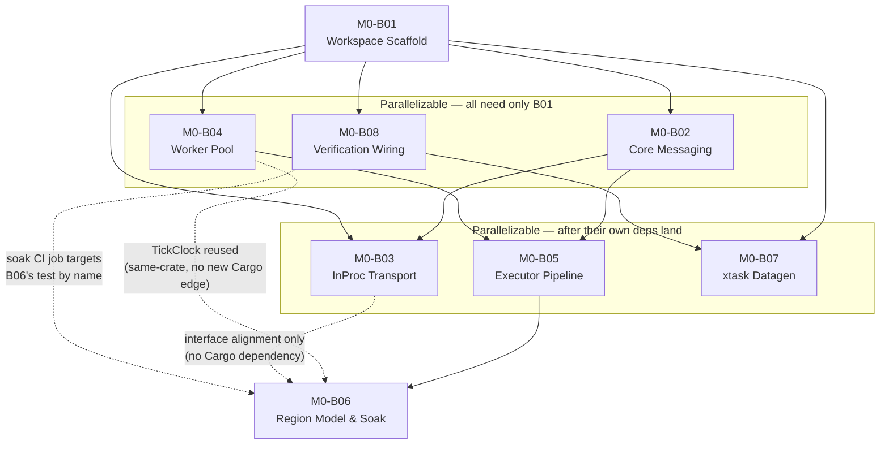

# M0-B00 — Milestone Index: Engine Skeleton & Workspace Bootstrap

## Milestone summary

M0 stands up the Cargo workspace exactly as `12-workspace-structure.md` defines it, and gets empty
(content-less) regions ticking at 20 TPS on the real scheduler, with no network and no chunks yet.
It is the foundation every later milestone assumes already holds: the workspace's 25 members and
dependency-graph rules (`12`'s WS-D2/WS-D3), the message-passing substrate and region partition
model that `11-roadmap-milestones.md`'s PLAN-D3 calls "foundational from M0, not their own
milestone" (`01`'s ARCH-D24–D30 addressing/envelope/`Transport`/bus, and ARCH-D5–D23's region/tick
pipeline/worker-pool machinery), the first slice of the version-data pipeline (NET-D9), and the
agent-executable verification loop (`09`'s TEST-D40–D52) that every subsequent milestone's
blueprints are held to.

Eight blueprints implement M0:

| ID | Title | Scope |
|---|---|---|
| M0-B01 | Workspace Scaffold & Basic CI Gates | L |
| M0-B02 | Core Types & Messaging Substrate | L |
| M0-B03 | In-Process Transport & Cross-Region Timing | L |
| M0-B04 | RC-WorkerPool & the Region Tick Clock | L |
| M0-B05 | RC-Executor: Conflict Graph & 11-Stage Tick Pipeline | L |
| M0-B06 | Region Model: Grid Cells, Build/Merge/Split, Synthetic-Load Soak | L |
| M0-B07 | xtask Version-Data Pipeline (fetch-data / codegen) | L |
| M0-B08 | Verification Loop & Test-Integrity Guardrails | L |

## Dependency graph

**Recommended execution order:**

1. **M0-B01** alone (every other blueprint needs its scaffold).
2. **M0-B02, M0-B04, M0-B08** in parallel (each needs only M0-B01).
3. **M0-B03** (needs M0-B01 + M0-B02), **M0-B05** (needs M0-B02 + M0-B04), and **M0-B07** (needs
   M0-B01 + M0-B08's `xtask/src/fetch_data.rs`, Finding 1, now resolved and declared in both
   blueprints' Prerequisites headers) in parallel — B03/B07 can start as soon as B02/B08
   respectively land, independent of B04/B05's progress.
4. **M0-B06** (needs M0-B05; reuses M0-B04's `TickClock<SystemTickWaiter>` directly, same crate,
   no new Cargo edge, Finding 9; reads M0-B03's `register_region`/`deregister_region` calling
   convention for interface alignment only — no Cargo dependency is introduced between
   `rc-scheduler` and `rc-transport-inproc`).

**Resolved:** B07 and B08 were previously drawn as independent leaves of B01, but Finding 1 (below)
showed a real coupling neither blueprint's Prerequisites header declared. Both blueprints now name
each other explicitly — M0-B07's Prerequisites row names M0-B08's `fetch_data.rs` as a hard
dependency, and M0-B08's own fetch-primitive Context section states the reuse obligation — so
**M0-B08 before M0-B07** is now the DAG's own required order, not merely a recommended manual
workaround.

## Per-blueprint summary

**M0-B01 — Workspace Scaffold & Basic CI Gates.** Stands up all 22 library crates + 2 binaries +
`xtask` as empty shells with real `Cargo.toml` dependency edges, implements `xtask`'s
`fmt-check`/`lint`/`lint-deps`/`test` verbs, and a two-OS CI workflow.
*Decisions covered:* WS-D1–D12, TEST-D34, TEST-D35 (command text only), TEST-D36 (resolved in favor
of WS-D4).

**M0-B02 — Core Types & Messaging Substrate.** Fills in `rc-core`'s coordinate/entity-id types and
`rc-messaging`'s addressing, envelope, `Transport` trait, `RegionMessage` payloads, and the
`RegionMessageBus`/`RegionMessageState` ECS-facing bus — no transport implementation.
*Decisions covered:* ARCH-D24, ARCH-D25, ARCH-D26, ARCH-D28 (seam only), ARCH-D29, ARCH-D30,
ARCH-D5/D6 (RegionId identity only), ARCH-D11 (contract only), CLUSTER-D12, TEST-D27.

**M0-B03 — In-Process Transport & Cross-Region Timing.** Implements `InProcessTransport` and
`EntitySnapshotPool`, and proves — with a deterministic stepped test harness — that a
`BorderUpdateEvent` sent at one region's Stage 10 lands in a neighbor's inbox at exactly its next
Stage 1 (M0 acceptance criterion 2).
*Decisions covered:* ARCH-D27, ARCH-D23, ARCH-D28, ARCH-D29, ARCH-D11/M0-B02's Stage-1/Stage-10
contract, TEST-D27.

**M0-B04 — RC-WorkerPool & the Region Tick Clock.** A work-stealing thread pool (elastic
grow/shrink per exact ARCH-D19 thresholds, plus a deterministic fixed-size mode) and `TickClock`, a
non-drift-compounding 50 ms deadline scheduler with platform-dispatched high-resolution waits
(`nix` on Linux for PERF-D55's `SCHED_RR` opt-in, `windows` on Windows for PERF-D53's timer — both
already workspace-pinned crates, reused directly rather than hand-rolled FFI). `TickClock` is also
M0-B06's own tick-pacing primitive, reused there unchanged.
*Decisions covered:* ARCH-D18, ARCH-D19, ARCH-D20 (primitives only), ARCH-D23, ARCH-D7, PERF-D14,
PERF-D53, PERF-D54, PERF-D55, PERF-D57, TEST-D17.

**M0-B05 — RC-Executor: Conflict Graph & 11-Stage Tick Pipeline.** A system-registration API, a
pure Kahn's-algorithm conflict-graph/wave-scheduling core, and `RcExecutor::tick_region`, which
drives one region's `bevy_ecs::World` through the fixed 11-stage pipeline once, dispatching onto
M0-B04's pool and fulfilling M0-B02's Stage-1/Stage-10 contract.
*Decisions covered:* ARCH-D1–D4 (context only), ARCH-D8, ARCH-D9, ARCH-D12, ARCH-D13, ARCH-D14
(documented, not exercised).

**M0-B06 — Region Model: Grid Cells, Build/Merge/Split, Synthetic-Load Soak.** Adds 16×16-chunk
grid cells, a cell-ownership directory, region merge/split with hysteresis, a synthetic-load
generator registered as a real system, and the 8-region/20-TPS/10-minute soak test (M0 acceptance
criterion 1) — paced by M0-B04's `TickClock<SystemTickWaiter>`, reused rather than re-implemented.
*Decisions covered:* ARCH-D5 (cell-ownership half), ARCH-D6, ARCH-D7, ARCH-D19 (hotness-EWMA half;
its own pool-sizing half is M0-B04's, and its per-region batch-granularity half is a documented,
deferred-past-M0 limitation — Constraints (g)), ARCH-D24 (cell-level directory), ARCH-D25/ARCH-D29
(merge/split redirect), PERF-D53 (reused from M0-B04, not re-implemented).

**M0-B07 — xtask Version-Data Pipeline (fetch-data / codegen).** `xtask fetch-data`/`codegen`,
built on M0-B08's shared `fetch_data::{fetch_server_jar, run_data_reports}` primitive (reused, not
re-implemented): resolves a version against `piston-meta`, downloads/verifies a `server.jar`, runs
`--reports`, and emits deterministic registry/block-state Rust tables plus a TEST-D47 fixture
manifest.
*Decisions covered:* NET-D9, NET-D10, ASSET-D15, ASSET-D25, ASSET-D28(i), TEST-D47 (concretized for
this blueprint's artifacts).

**M0-B08 — Verification Loop & Test-Integrity Guardrails.** Extends `xtask` with `tier0`/`tier1`,
`path-guard`, `lint-tests`, `verify-fixtures`, `setup-oracle`, `quarantine`/`list-quarantine`, and
`verifier-report`; adds the `guardrails` CI job (and a nightly-only `soak` job that runs M0-B06's
soak test — Finding 8, resolved), branch-protection script, `.gitignore`'s `/oracle/`/
`/datagen-output/` entries (Finding 2, resolved), and `CONTRIBUTING.md`. Its `fetch_data.rs` is the
single, authoritative NET-D9 jar-fetch primitive M0-B07 reuses (Finding 1, resolved).
*Decisions covered:* TEST-D2, TEST-D37 (Tier 0/1/2-soak wired), TEST-D40, TEST-D41, TEST-D43,
TEST-D44, TEST-D45, TEST-D46, TEST-D47 (vacuous wiring), TEST-D48 (restated constraint), TEST-D49,
TEST-D50, TEST-D51, TEST-D52.

## M0 acceptance criteria → blueprint mapping

| # | Acceptance criterion (`11-roadmap-milestones.md`) | Blueprint(s) | Status |
|---|---|---|---|
| 1 | 8 synthetic regions tick at a stable 20 TPS ±1% for a continuous 10-minute soak, zero panics. | M0-B06 (`soak_8_regions_20tps.rs`, `soak-tests` feature) + M0-B08 (`soak` CI job) | Test written; nightly-`schedule` CI job now invokes it (Finding 8, resolved) — CI-verified on the nightly cadence once both blueprints have landed. |
| 2 | Two regions exchange a synthetic `BorderUpdateEvent` across `InProcessTransport`, applied at the destination's next Stage-1 boundary (not same-tick, not two-tick-delayed). | M0-B03 (`cross_region_timing.rs`) | Verified in Tier 1. |
| 3 | `xtask fetch-data 26.2` and `xtask codegen` run against a legal `server.jar` and produce compiling code under `crates/protocol/generated/v776/`. | M0-B07 (automated logic, built on M0-B08's shared `fetch_data.rs`) + a manual, jar-gated step | Automated sub-logic verified in Tier 1; the end-to-end run is a documented manual step (NET-D9's "never a CI network fetch" rule), consistent with spec. Finding 1 (M0-B07/M0-B08's conflicting fetch mechanisms) resolved — both now share one implementation. |
| 4 | `xtask lint-deps` passes with zero forbidden edges. | M0-B01 | Verified in Tier 1 from the first commit. |
| 5 | The agent-executable verification loop and test-integrity guardrails (TEST-D40–D52) are wired and enforced from the first commit. | M0-B08 | Verified in Tier 1 (Tier 3 wiring still deferred past M0; Tier 2 now has one real job, the soak test above, per B08's own TEST-D37 table). |

## Cross-blueprint issues from the last audit — resolution status

All findings from the prior cross-blueprint audit have been applied to the affected blueprints
directly (Prerequisites headers, Context, Deliverables, Implementation steps, and Constraints, as
each finding required) rather than tracked here as open items:

- **Finding 1** (M0-B07/M0-B08's independent, incompatible jar-fetch implementations): resolved.
  M0-B07's Prerequisites header now names M0-B08's `fetch_data.rs` as a hard dependency and its
  `fetch.rs` calls `fetch_data::fetch_server_jar`/`run_data_reports` directly; M0-B08's
  `run_data_reports` no longer passes the unauthorized `--output` flag NET-D9 does not name.
- **Finding 2** (M0-B08 claimed a pre-existing `.gitignore` reservation for `/oracle/`/
  `/datagen-output/` that no prior blueprint actually created): resolved. M0-B08's own Deliverables
  now add both entries.
- **Finding 3** (ARCH-D19's batch-granularity clause misattributed between M0-B04/B05/B06): resolved
  as a documented, deferred-past-M0 limitation in M0-B06's own Constraints (g) — M0 has no real
  per-entity/per-chunk Stage-6/7/8 systems for any blueprint to batch yet.
- **Finding 4** (M0-B04 mischaracterized PERF-D55's `nix`-crate pin as illustrative and hand-rolled
  FFI instead): resolved. M0-B04 now uses the already-workspace-pinned `nix` crate directly.
- **Finding 5** (`cargo-nextest` version conflict between TEST-D2 and WS-D10, silently unflagged):
  resolved. Both M0-B01 and M0-B08 now carry an explicit resolved-discrepancy note favoring WS-D10.
- **Finding 6** (M0-B01/M0-B08 both exceed the ~800-line blueprint-size guideline — a real
  `00-blueprint-spec.md` Sizing-rule violation, worsened rather than fixed by this pass since both
  files grew further while resolving Findings 1/2/5/8): **not fixed in this pass.** Splitting either
  file safely requires touching every other M0 blueprint's Prerequisites header (every blueprint's
  own Verification commands already call `xtask fmt-check`/`lint`/`lint-deps`/`test`, so a
  scaffold-vs-verbs split of M0-B01 is not a self-contained, low-blast-radius change) plus this
  index's DAG and ID scheme — out of proportion to the other eight findings addressed in the same
  pass, and risking a worse, inconsistent state if done hastily. Left as a named, tracked follow-up:
  a future pass should split M0-B01 into a workspace-scaffold half and an xtask-verbs-plus-CI half,
  and M0-B08 into a TEST-D40/D41/D44 half (carrying `fetch_data.rs`, which M0-B07 depends on by ID)
  and a TEST-D46/D49/D50/D51/D52 half, each under the ~800-line/~300-line-Context guideline, with
  every dependent blueprint's Prerequisites row updated accordingly.
- **Finding 7** (ARCH-D4/ARCH-D21/ARCH-D22/TEST-D42 named in M0's roadmap ranges but structurally
  inapplicable at M0): resolved via the "Named-but-inapplicable-at-M0 decisions" note below.
- **Finding 8** (M0's headline soak-test acceptance criterion had no CI job): resolved. M0-B08 adds
  a nightly-`schedule`-triggered `soak` job that runs M0-B06's test on both OS legs.
- **Finding 9** (M0-B06 re-implemented M0-B04's Windows high-resolution timer as a second
  `pacing.rs`): resolved. M0-B06 now reuses `rc_scheduler::pool::TickClock<SystemTickWaiter>`
  directly; there is no `pacing.rs` module.

### Named-but-inapplicable-at-M0 decisions

`11-roadmap-milestones.md`'s M0 section names the decision ranges `ARCH-D1-D9, D12, D18-D23` and
`TEST-D40-D52`. A subset of the IDs inside those literal ranges is structurally out of M0's reach
and deliberately not implemented by any M0 blueprint:

- **ARCH-D4** (`World::register_component_with_descriptor`, dynamic mod-component registration) —
  no mod loader exists before `M8`; M0-B05 references it as context only.
- **ARCH-D21/ARCH-D22** (the isolated Tokio network runtime and its sync/async channel boundary) —
  M0 has no network layer (its own Goal states "no network... yet"); deferred to whichever `M1`
  blueprint first builds `rusty-clanker-server`'s async runtime boundary.
- **TEST-D42** (`rc-gametest`'s RON-authored structures) — `crates/testing/rc-gametest/` does not
  exist until a later milestone adds it to the workspace; M0-B08's own Constraints confirm it
  creates no file under `crates/testing/`.

This is a scoped, deliberate range narrowing, not an oversight — recorded here so a future coverage
audit does not need to re-derive it from scratch.
