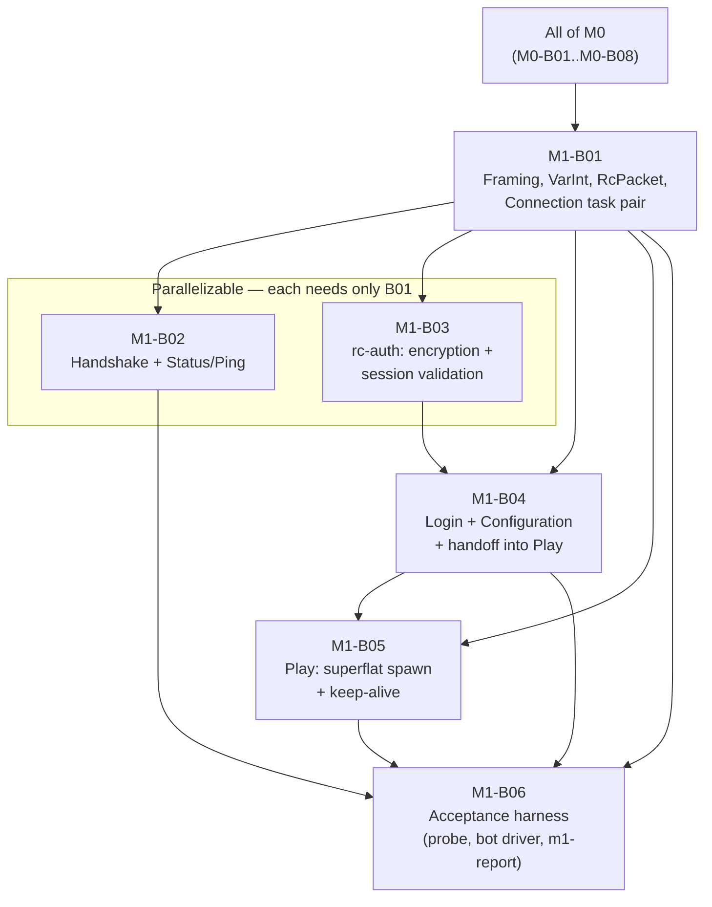

# M1-B00 — Milestone Index: Protocol Bootstrap — Status & Login

## Milestone summary

M1 gives the engine its first network-facing surface: an unmodified vanilla Java Edition 26.2
client can ping the server (Handshake → Status → Pong) and log into a minimal, hand-built
superflat placeholder world (Handshake → Login → Configuration → Play), staying connected for a
continuous 30-minute idle session with zero disconnects. `02-protocol-networking.md`'s NET-D1–D11
first become load-bearing and testable here (`11-roadmap-milestones.md`'s Interfaces section).
Six blueprints implement M1, building `rc-protocol`/`rc-protocol-macros`/`rc-auth` from empty
shells to a complete wire codec, encryption/session-validation toolkit, and connection-driving
state machine, plus the two dev-only crates (`rc-test-harness`, `rc-paritybot`) that measure the
milestone's own acceptance criteria end to end.

| ID | Title | Scope |
|---|---|---|
| M1-B01 | Framing, VarInt/VarLong, the Packet Trait Model, and the Connection Task Pair | L |
| M1-B02 | Handshake Routing and the Status/Ping Flow | L |
| M1-B03 | Login-Phase Encryption Handshake & Online-Mode Session Validation | L |
| M1-B04 | Login, Configuration, and the Handoff into Play | L |
| M1-B05 | Minimal Play State: Superflat Placeholder, Spawn, Keep-Alive | L |
| M1-B06 | Acceptance Harness: Status Probe, Bot-Driver Idle-Stability Leg, CI Tiers, M1-Completion Report | L |

## Dependency graph

**Recommended execution order:**

1. **M1-B01** alone (every other M1 blueprint builds directly on its wire codec and/or its
   `rusty-clanker-server::net` connection task pair).
2. **M1-B02** and **M1-B03** in parallel — each declares only M1-B01 as a prerequisite (M1-B03's
   own header explicitly notes M1-B02 is a sibling, not a dependency).
3. **M1-B04** (needs M1-B01's codec/connection layer and M1-B03's `rc-auth` primitives).
4. **M1-B05** (needs M1-B01 directly and M1-B04's Configuration-complete hand-off contract —
   M1-B05 implements M1-B04's `PlayerSessionSink` seam for its own `HardcodedWorld`, translating
   `PlayerSession` into its own lower-level `PlayerProfile`/`enter_play` call).
5. **M1-B06** (needs M1-B01, M1-B02, M1-B04, M1-B05 all landed — it drives a real, fully-assembled
   `rusty-clanker-server` subprocess as an opaque network peer, so it does not compile against any
   of their internal Rust APIs, only their combined external wire behavior; also depends
   transitively on M0-B01/M0-B08 for `xtask`'s command/verb-dispatch and verification-wiring
   conventions, already satisfied by M1's own M0 gate).

## Per-blueprint summary

**M1-B01 — Framing, VarInt/VarLong, the Packet Trait Model, and the Connection Task Pair.** Gives
`rc-protocol` VarInt/VarLong, the length-prefixed/zlib-compressed frame codec, `WireWrite`/
`WireRead` and their primitive impls, the `RcPacket` trait plus a working `#[derive(RcPacket)]`
macro in `rc-protocol-macros`, `ConnectionState`/`PacketBound` scaffolding, and the
`ConnectionCipher` seam NET-D6 later plugs into; gives `rusty-clanker-server` the Tokio
reader/writer task pair (`spawn_connection`/`ConnectionHandle`) with a concrete, tested
backpressure policy. Defines no concrete packet type.
*Decisions covered:* NET-D5 (full), NET-D3 (trait model + derive machinery only), NET-D4
(`ConnectionState`/`PacketBound` data types only, no transition logic), NET-D7 (task pair +
concrete backpressure resolution), NET-D9 (seam restated, not implemented), TEST-D25/D26 (fuzz
target #1 stub), TEST-D27 (VarInt/VarLong/String round-trip property tests), ASSET-D18/D19/D30
(restated constraint).

**M1-B02 — Handshake Routing and the Status/Ping Flow.** Defines `Intention` (Handshake) and
`StatusRequest`/`StatusResponse`/`PingRequest`/`PongResponse` (Status) plus the
`StatusResponsePayload` JSON schema; gives `rusty-clanker-server` the listener logic that reads
and validates Handshake, then — for `Intent::Status` — serves exactly one Status Response and an
optional Ping/Pong before closing the connection. First blueprint to call
`ConnectionHandle::set_inbound_state`/`set_outbound_state` for real. Adds
`extern crate self as rc_protocol;` to `lib.rs`, needed the moment a packet type is derived
*inside* `rc-protocol` itself.
*Decisions covered:* NET-D11 (full), NET-D4 (the Handshaking→Status leg only), NET-D1 (protocol
776 in every Status Response), ASSET-D21/D22 (the binding non-affiliation disclaimer, wired into
the default MOTD).

**M1-B03 — Login-Phase Encryption Handshake & Online-Mode Session Validation.** Gives `rc-auth`
NET-D6's complete server-side toolkit: a per-process RSA-1024 keypair (`ServerKeyPair`), the exact
Notchian server-hash algorithm (`compute_server_hash`), a persistent-state AES-128/CFB8 cipher
pair (`Aes128Cfb8Encryptor`/`Decryptor`), a rate-limit-aware `SessionService`/`MojangSessionService`
calling Mojang's real `hasJoined` endpoint off the connection's decode task, and `offline_uuid` for
NET-D6's offline-mode stance. `rc-auth` has no Cargo edge to `rc-protocol` (WS-D3 rule 1), so this
blueprint's own `rusty-clanker-server::net::auth_cipher::AuthConnectionCipher` is the one adapter
type that wraps `rc-auth`'s plain cipher primitives to satisfy M1-B01's `ConnectionCipher` seam.
Defines no Login-state packet type (packet-agnostic API, consumed by a future Login blueprint).
*Decisions covered:* NET-D6 (full — RSA/PKCS#1v1.5, server-hash, AES-128/CFB8, `hasJoined`,
offline-mode UUID derivation), ASSET-D1/D6/D7 (boundary restated: client-side Microsoft/Xbox auth
stays `08-assets-auth-legal.md`'s scope, not this crate's).

**M1-B04 — Login, Configuration, and the Handoff into Play.** Defines the complete Login-state
packet catalog (Disconnect, EncryptionRequest/Response, LoginSuccess, SetCompression,
LoginStart, LoginAcknowledged — five packets deliberately unimplemented and named as such) and
Configuration-state catalog (brand `PluginMessage`, `UpdateEnabledFeatures`, `KnownPacks`,
`RegistryData` for the 29 WORLDGEN-layer registries, `FinishConfiguration`/
`AcknowledgeFinishConfiguration`, `ClientInformation`, `KeepAlive`), drives both states' exact
NET-D4 sequencing including the split inbound/outbound state-slot timing, and extends
`xtask codegen` with a `registry_entries.rs` generator. Defines `PlayerSession`/
`PlayerSessionSink` as the seam a Play-state blueprint consumes, and its own `ResolvedProfile`
domain type (`login_flow.rs`) unifying M1-B03's two login outcomes — an online `HasJoinedProfile`
and an offline bare `uuid::Uuid` — into the one shape `PlayerSession.profile` carries.
*Decisions covered:* NET-D4 (Login→Configuration→Play, terminal-packet-driven transitions, the
two independent state slots), NET-D3 (Login/Configuration packet catalog), NET-D5 (Set-Compression
ordering relative to encryption), NET-D6 (consumes M1-B03's real `rc-auth` API — `ServerKeyPair`,
`MojangSessionService`, `offline_uuid`, `AuthConnectionCipher` — never the forward-looking,
non-delivered surface an earlier draft of this blueprint restated), NET-D8 (packet→
typed-event seam, restated as `PlayerSession`/`PlayerSessionSink` pending the real ECS-ingress
adapter), NET-D9/NET-D10 (registry-entries codegen extension), TEST-D47 (fixture-manifest
extension, no new mechanism).

**M1-B05 — Minimal Play State: Superflat Placeholder, Spawn, Keep-Alive.** Gives an
already-Configuration-complete connection a working Play state: one hardcoded 3×3-chunk
hand-built superflat world, the first real `rc-scheduler` region ticking at 20 TPS in this
project (via `RcExecutorBuilder`/`RcExecutor::spawn_region`/`tick_region`, `RcWorkerPool`,
`TickClock<SystemTickWaiter>` — all M0-B03/B04/B05 APIs consumed as-is), the exact Play-entry
clientbound packet sequence, and an idle-connection keep-alive/timeout driver proven to survive a
continuous 30-minute idle soak. Its own lower-level `PlayerProfile`/`enter_play` entry point stays
independently testable against a raw M1-B01 connection (bypassing Login/Configuration entirely,
as every acceptance test in this blueprint does), and its `HardcodedWorld` additionally implements
M1-B04's real `PlayerSessionSink` trait — translating an accepted `PlayerSession` into a
`PlayerProfile`/`enter_play` call spawned as its own Tokio task — completing the hand-off M1-B04's
own Context leaves for "a later blueprint."
*Decisions covered:* NET-D4 (the Configuration→Play inbound-state transition specifically —
landing inside player-spawn setup, not the protocol-state-machine blueprint), NET-D8 (implements
M1-B04's `PlayerSessionSink` seam), ARCH-D5/D7/D12
(first real one-region instantiation and tick loop), WORLD-D2 (paletted-container wire encoding,
restated field-by-field for hand-built content), TEST-D14 pattern (synchronous,
clock-injectable keep-alive driver), M1 roadmap Acceptance Criterion 1's Play-spawn and
30-minute-idle-soak halves.

**M1-B06 — Acceptance Harness: Status Probe, Bot-Driver Idle-Stability Leg, CI Tiers,
M1-Completion Report.** Adds `rc-test-harness` (subprocess orchestration, a raw-TCP status probe,
an in-process scripted "fake server" test double) and `rc-paritybot` (an azalea-based bot driver,
TEST-D8, performing a genuine Handshake→Login→Configuration→Play sequence and an idle-stability
leg against a real server subprocess); adds `xtask m1-report`, emitting a machine-readable,
per-criterion pass/fail JSON mapped 1:1 onto M1's three roadmap acceptance criteria; adds the
nightly/manual `m1-acceptance` CI job and `docs/MANUAL-VERIFICATION-M1.md` (AC3's one
non-automatable step). Treats `rusty-clanker-server` as an opaque network peer throughout — no
Rust API dependency on M1-B02/B04/B05's internals, only their combined external wire behavior.
Its Prerequisites/Context paragraph names M1-B04 ("Login, Configuration, and the Handoff into
Play") and M1-B05 ("Minimal Play State: Superflat Placeholder, Spawn, Keep-Alive") by their real,
merged scope, and its Fake-Server Protocol Cheat Sheet's Login Success row matches M1-B04's real
`LoginProfileProperty` shape (`{name, value, signature}`, no `is_signed` field) exactly.
*Decisions covered:* TEST-D7 (differential-harness architecture, narrowed to one server under
test), TEST-D8 (azalea as bot driver, wired for the first time), TEST-D37/D40 (CI-tier placement,
machine-readable JSON), TEST-D38/D41/D48 (oracle/vanilla-jar boundary, restated as not needed by
this blueprint's own automated tests), TEST-D46 (`PROTECTED_PATHS` extension plus a
naming-convention bugfix), NET-D1/D4/D6/D11 (exercised end-to-end by a real client), PLAN-D5
(the mechanism that measures M1's own acceptance criteria), M1's roadmap Acceptance Criteria 1–3
verbatim, mapped onto this blueprint's report cases.

## M1 acceptance criteria → blueprint mapping

| # | Acceptance criterion (`11-roadmap-milestones.md`) | Blueprint(s) | Status |
|---|---|---|---|
| 1 | An unmodified vanilla Java Edition 26.2 client completes Handshake→Status→Pong, and separately Handshake→Login→Configuration→Play, spawns into the superflat placeholder world, and stays connected for a continuous 30-minute idle session with zero disconnects or timeouts. | M1-B02 (Status/Pong) + M1-B04 (Login→Configuration) + M1-B05 (Play spawn + 30-minute idle soak, own `soak-tests`-gated test) + M1-B06 (`rc-paritybot`'s real-client idle-stability leg and the nightly `m1-acceptance` job that measures this criterion end to end) | Individually unit/soak-tested per blueprint; M1-B04's Login flow now compiles against M1-B03's real `rc-auth`, and M1-B04's Play hand-off now reaches M1-B05's `enter_play` via `HardcodedWorld`'s `PlayerSessionSink` impl — the end-to-end nightly measurement is unblocked, pending its own first real run once every prerequisite blueprint is implemented and merged. |
| 2 | A raw TCP probe (not a Minecraft client) confirms the Status Response JSON carries the correct protocol number (776, NET-D1), version name, online/max player count, and MOTD. | M1-B02 (`status_probe_returns_expected_json_and_ping_pong`, in-process) + M1-B06 (`rc_test_harness::probe::probe_status`, external subprocess — this criterion's own authoritative, real-binary proof) | Verified in Tier 1 at the unit level (M1-B02); the subprocess-level proof depends on M1-B06's `m1-acceptance` job, gated the same way as criterion 1. |
| 3 | Online-mode session validation (NET-D6) succeeds against Mojang's real session server for a genuine purchased account in a manual verification pass. | M1-B03 (its own narrower, isolated `hasJoined`-only manual procedure) + M1-B06 (`docs/MANUAL-VERIFICATION-M1.md`, the full end-to-end manual procedure this criterion actually names) | M1-B03's own isolated pass is independently executable today. M1-B06's full pass is a documented, reproducible manual procedure per PLAN-D5, and — like criterion 1 — can now exercise a real end-to-end Login flow, since M1-B04 consumes M1-B03's real, delivered `rc-auth` API. |

## Cross-blueprint issues from the last audit — resolution status

All findings from the prior cross-blueprint audit have been applied to the affected blueprints
directly (Context/Deliverables/Implementation-steps edits, as each finding required) rather than
tracked here as open items, mirroring M0-B00's own resolution-status precedent:

- **Finding 1** (M1-B04's Context restated a forward-looking `rc-auth` API — `ServerKeyPair::
  generate() -> Self`, a `CfbConnectionCipher` type, a bare `has_joined`/`offline_profile`
  function pair, a `GameProfile` type — that did not match M1-B03's real, delivered surface):
  resolved. M1-B04's Context ("The `rc-auth` API this blueprint depends on") now restates
  M1-B03's real API exactly (`ServerKeyPair::generate() -> Result<Self, KeyPairError>`,
  `rc_auth::session::{SessionService, MojangSessionService, HasJoinedProfile,
  SessionServiceError}`, `rc_auth::offline::offline_uuid -> uuid::Uuid`,
  `rusty_clanker_server::net::auth_cipher::AuthConnectionCipher` in place of a nonexistent
  `CfbConnectionCipher`). M1-B04 now defines its own `ResolvedProfile` domain type
  (`login_flow.rs`) unifying `rc-auth`'s two login outcomes, and `PlayerSession.profile`,
  `LoginOutcome.profile`, `LoginError`'s `#[from]` variants, and `drive_connection`'s signature
  (which now also takes `sessions: Arc<MojangSessionService>`) all use the real types throughout.

- **Finding 2** (M1-B04's `PlayerSession`/`PlayerSessionSink` seam and M1-B05's independently
  defined `PlayerProfile`/`enter_play` hand-off were structurally incompatible, and nothing
  plugged one into the other): resolved. M1-B05 now implements M1-B04's real `PlayerSessionSink`
  trait for its own `HardcodedWorld` (`world.rs`): `accept` translates `PlayerSession` (`profile:
  ResolvedProfile`, `connection: ConnectionHandle`, `inbound: mpsc::Receiver<RawPacket>`) into a
  `PlayerProfile`/`enter_play` call spawned as its own Tokio task. M1-B05's own lower-level
  `enter_play`/`PlayerProfile` entry point and its existing acceptance-test suite are unchanged
  and still fully self-contained (bypassing Login/Configuration entirely); a new acceptance test,
  `play_session_handoff.rs`, exercises the `PlayerSessionSink` impl itself.

- **Finding 3** (M1-B06's Prerequisites paragraph attributed Play-state spawn and keep-alive to
  two separate, misnamed, "still-unwritten" blueprints, and its Fake-Server Protocol Cheat Sheet's
  Login Success row carried a stale `is_signed: bool` field): resolved. M1-B06's Prerequisites
  paragraph now names M1-B04 ("Login, Configuration, and the Handoff into Play") and M1-B05
  ("Minimal Play State: Superflat Placeholder, Spawn, Keep-Alive") by their real, current scope,
  and its "Assumed server CLI surface" section now correctly attributes the Play-state spawn to
  M1-B05. The cheat sheet's Login Success row now matches M1-B04's real `LoginProfileProperty`
  shape exactly (`{name, value, signature: Option<String>}`, no `is_signed` field), and its
  precedence rule now names M1-B04's/M1-B05's own real, merged packet catalogs as authoritative
  rather than "the still-unwritten Login/Configuration blueprint."

- **Finding 4** (M1-B04's Deliverables added a second, differently-versioned root `uuid =` line,
  conflicting with the `uuid` entry `15-crossplay.md`'s integration already added to
  `12-workspace-structure.md`'s `[workspace.dependencies]`): resolved. M1-B04's Deliverables now
  treat `uuid` as already pinned (mirroring M1-B03's own `crates/auth/Cargo.toml` treatment,
  `uuid = { workspace = true }`, no version/feature restatement) and add only the `"v4"` feature
  its own code genuinely needs (`LoginSuccess.session_id`'s `Uuid::new_v4()`) to the *existing*
  `12-workspace-structure.md` entry, which now reads `uuid = { version = "1.24.0", features =
  ["v4", "v5"] }` — a strict, additive superset that keeps `rc-bedrock-auth`/CROSS-D12's `"v5"`
  feature intact.

- **Finding 5** (`12-workspace-structure.md`'s Interfaces section understated the dependency-graph
  hard rules a future domain doc must respect as "four," stale since `15-crossplay.md`'s CROSS-D5
  extends `WS-D3` with three more): resolved. The Interfaces bullet now reads "WS-D3's four rules
  plus CROSS-D5's three-rule extension for the Bedrock crates."
