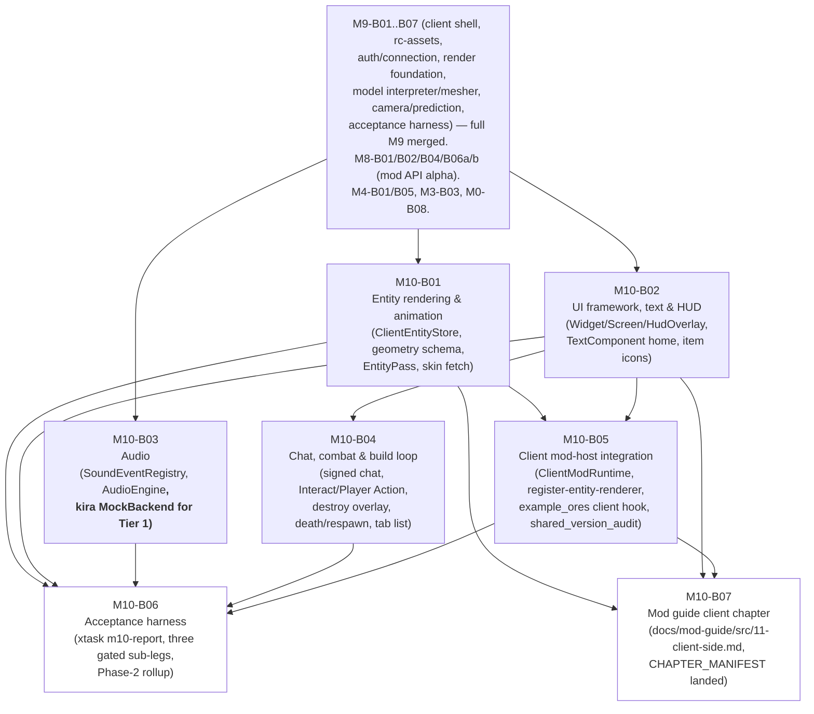

# M10-B00 — Milestone Index: Client Feature Parity: Entities, UI, Isomorphic Mods

## Milestone summary

M10 takes the static, cameras-only client `M9` shipped and gives it vanilla's
core play loop plus the client half of the isomorphic mod API `M8` opened.
Seven blueprints build the remaining stack: rendered, animated, interpolated
entities plus player-skin acquisition (B01); the retained-mode GUI/HUD
framework, item icons, and the shared `TextComponent` home every later
text-bearing blueprint consumes (B02); local-asset sound playback via a
`kira`-backed engine (B03); signed chat, combat input, the build loop,
death/respawn, sleep, the tab list, and window-focus/pause — the last slice
of `connection/play.rs`'s steady-state dispatch loop (B04); `rc-mod-host`
client-side integration, completing the `M8` reference mod's deferred
client render hook and the `cargo tree` shared-version audit M10's own
acceptance criterion 3 names (B05); one acceptance harness folding all
three M10 roadmap criteria into `xtask m10-report`, honestly gating the
sub-legs three still-open, precisely-named contracts block and closing
`PLAN-D2`'s Phase-2 (M9+M10, native client) rollup as a machine-readable fact
for the first time (B06); and the Mod Developer Guide's own Client-Side
chapter, landed for real against B05's now-completed reference-mod client
hook — the one M10 roadmap scope bullet the other six blueprints leave
untouched, closed here rather than left silently owned by nobody (B07).

| ID | Title | Scope |
|---|---|---|
| M10-B01 | Entity Rendering & Animation | L |
| M10-B02 | UI Framework, Text & HUD | L |
| M10-B03 | Audio | L |
| M10-B04 | Chat, Combat & the Build Loop | L |
| M10-B05 | Client Mod-Host Integration | L |
| M10-B06 | M10 Acceptance Harness | L |
| M10-B07 | Mod Developer Guide: Client-Side Chapter | S |

## Dependency graph

**Recommended execution order:**

1. **M10-B01**, **M10-B02**, and **M10-B03** first, in parallel — none
   depends on either of the other two (B01 needs only `M9`-merged
   prerequisites; B02 needs only `M9`-merged prerequisites; B03 needs only
   `M9-B01`/`M9-B02`). All three are hard prerequisites for at least one
   downstream blueprint.
2. **M10-B04** once B02 lands (hard: it is the "sibling blueprint owning
   Play-phase packet decode" B02 §Interfaces names by name, and consumes
   `text::component::TextComponent`/`gui::widget::{Screen, HudOverlay,
   ScreenAction}` directly). B04 does not list B01 as a Cargo prerequisite,
   but **land B01 before B04 regardless**: B04 §Context 9 discovers and
   resolves a real inconsistency between B01's own already-committed
   `Entity Animation` assumption and M4-B05's already-shipped `Entity Event`
   behavior, and that section's own accuracy depends on B01's text already
   existing in its final, merged form — the identical "no Cargo edge, but a
   real ordering dependency the index must fix" case M9-B00-index §"M9-B05
   and M9-B06" already established for this corpus.
3. **M10-B05** once B01 and B02 both land (hard: it adds the sixth
   `ClientRegistryBuildContext` method B01 §Interfaces fixes by exact
   signature, and composes a `Widget` alongside B02's `DefaultHudOverlay`).
   Independent of B03/B04 — no Cargo edge either direction.
4. **M10-B06** strictly after B01–B05 all land — it is the sole consumer of
   every other M10 blueprint's own already-real types and authors no
   production code of its own outside `xtask`/`tests/`.
5. **M10-B07** once B01, B02, and B05 land (hard: its own chapter content
   restates B05's completed `mods/example-ores` client hook and cites B01's/
   B02's already-shipped surfaces by exact name). Independent of B03/B04 and
   of B06 — neither depends on the other; B07 touches only
   `docs/mod-guide/` and `xtask/src/doc_guide/`, no engine crate.

**A three-way `crates/client/src/config.rs` race, resolved here.** B02
(`gui_scale: u8`), B03 (eleven flat volume/subtitle fields), and B05
(`mods_dir`/`mods_enabled`/`native_trust`/`fault_policy`/
`mod_action_bindings`) each additively extend `ClientConfig` and none lists
either of the other two as a Prerequisite — the identical class of
same-file, no-Cargo-edge race M9-B00-index's own "M9-B05 and M9-B06" note
already resolved for `rc-render/src/lib.rs`. Every one of the three adds
disjoint field names, so no two edits can textually collide, and each
blueprint's own Constraints already bind it to leave every pre-existing
field/method/test untouched — but an implementer applying B03's or B05's
diff against a stale, pre-B02 (or pre-B03) copy of `config.rs` would still
produce a merge conflict on the same struct literal/`Default` impl. This
index fixes the concrete order: **B02, then B03, then B05** (already implied
by the dependency graph's own B01/B02-before-B05 edges; this note only makes
the B02-before-B03 ordering, otherwise unconstrained, explicit) — apply each
blueprint's `config.rs` diff against the file's real current content, not
against M9-B01's original nine-field struct a literal reading of B03's or
B05's own prose (each phrased as a delta against "M9-B01's already-shipped
`ClientConfig`") would suggest once an earlier M10 blueprint has already
landed.

## Per-blueprint summary

**M10-B01 — Entity rendering & animation.** A client-side restatement of
`M4-B01`'s entity-network wire tables (spawn/despawn/metadata/movement,
plus a newly-needed `Entity Animation` packet M4-B01 never named) feeding a
`ClientEntityStore`; a declarative cuboid+pivot+UV-rect entity-geometry
schema (CLIENT-D18) with hand-authored RON models for item/zombie/villager/
cow/player, baked once into GPU-ready buffers; procedural+keyframe animation
(walk/idle, head tracking, hurt flash, death fall, attack swing); a fixed
3-tick remote-entity interpolation buffer (CLIENT-D26/D29); ground-item
rendering with a bounded, flagged substitute for vanilla's real generated-
item extrusion; player skin acquisition from the authenticated session
profile (ASSET-D7/D10/D28's custody stance restated exactly); and a
dedicated `EntityPass` slotting into CLIENT-D3's fixed pass order. Adds the
Rust-native shape (`EntityRenderer` trait, `EntityRendererRegistry`) behind
MOD-D18's sixth client extension point for B05 to bridge across the mod
ABI. Does not wire `EntityPass` into `Shell`/`Renderer` — the same
composition-root gap M9-B04/B05/B06 already flag, restated rather than
closed.

**M10-B02 — UI framework, text & HUD.** The vanilla-faithful custom
retained-mode `Widget`/`Screen`/`HudOverlay` system (CLIENT-D23); the GUI
sprite atlas and dynamic glyph atlas (CLIENT-D15(2)/(3)); the font pipeline
(`cosmic-text`/`swash`); a bounded CLIENT-D16 item-model subset (the
`minecraft:model` leaf case only) sufficient for 2D icons and a first-person
viewmodel stub; hotbar/health/XP/action-bar/title/boss-bar/scoreboard HUD
elements; inventory/container screens with client-predicted click handling;
tooltips; and — because no prior blueprint defined one and this blueprint's
own rendering has no text to render without it — **the shared home**,
`rc_render::text::component::TextComponent`, restated field-by-field from
the stable public text-component format. Declares, never populates, the
data contracts (`HudState`, `ContainerState`, a chat log) a sibling
blueprint's packet decode must feed — that sibling is B04.

**M10-B03 — Audio.** A `rc-assets`-side `sounds.json` parser (CLIENT-D24); a
`rc-render`-side `SoundEventRegistry` merging resource-pack/mod sources in
priority order with `replace`/`type: "event"` recursion; a seeded,
deterministic weighted-selection PRNG; pure distance-attenuation/pan
functions; a ten-slot category volume model plugging into B02's already-
shipped, inert `SettingsTab::Sound` placeholder; an `AudioEngine<B>` facade
generic over `kira`'s `Backend` trait, so the same logic runs against a real
device in production and `kira`'s hardware-free `MockBackend` in Tier-1 CI;
decode-only restatements of `Sound Effect`/`Entity Sound Effect`/`Stop
Sound`; and a bounded, crossfade-free music-sequencing mechanism. Does not
wire `AudioEngine` into `Shell`/`app.rs` — the identical, already-open
composition-root gap restated once more rather than closed.

**M10-B04 — Chat, combat & the build loop.** The first blueprint to
actually extend `connection/play.rs`'s steady-state dispatch loop beyond
movement/chunk/entity packets: real signed chat (chat-session-key
acquisition, the message-signing chain — restated from
`docs/research/mc-26.2/11-player-gameplay.md` §3.13 with this blueprint's
own self-consistency-tested, not byte-exact, candidate byte assembly —
acknowledgement tracking, and clientbound system/player/disguised message
decode feeding B02's `ChatLog`); combat input (attack-to-`Interact`, a
client-predicted cooldown indicator, hurt-flash/death triggers wired into
B01's `AnimationState`, `Set Health`-driven HUD updates); the build loop
(crosshair targeting, `Player Action`/`Use Item On` with sequence tracking,
a client-predicted destroy-progress overlay mirroring M3-B03's dig-timing
formula); death/respawn screens; client-side sleep/bed stance; a tab-list
overlay; and window-focus/pause behavior. §Context 9 discovers and resolves
a real inconsistency between B01's own `Entity Animation`-based hurt/death
assumption and M4-B05's already-shipped `Entity Event` broadcast — restated
as this corpus's own required-disclosure convention, not a defect report
against B01.

**M10-B05 — Client mod-host integration.** Real client-side mod discovery/
load/crash-isolation at a fixed `main.rs` startup slot, symmetric with
`rc-mod-host`'s already-proven server-side pipeline; a drain-and-bridge
layer turning a loaded mod's `on_client_registry_build` call into real,
composition-root-visible state for `register-model-provider`/
`register-block-renderer` (feeding B01/M9-B05's already-shipped atlas/bake/
mesh pipeline) and `register-gui-screen`/`register-hud-overlay` (composing a
real `Widget` alongside B02's `DefaultHudOverlay`); a sixth
`ClientRegistryBuildContext` method, `register_entity_renderer`, at a
registration-only bar honestly short of a live ABI-safe payload (no M10
reference mod exercises entity content); a per-tick `ClientModEntry::
on_client_tick` hook; the client receive half of MOD-D20's custom network
channels; and the reference mod's own deferred client render hook completed
for real — `example_ores:pulse_crystal` now renders a genuinely different
material per block state, closing `PLAN-D2`'s named gap. Ships
`xtask shared-crate-version-audit`, the exact machine-readable proof M10's
acceptance criterion 3 names, checking `rc-core`/`rc-nbt`/`rc-registries`/
`rc-protocol`/`rc-mod-api` — the roadmap's own five-crate reading of
`12`'s WS-D3 rule 1 (which itself names eight shared crates; this
blueprint's `SHARED_CRATES` constant deliberately matches the roadmap's own
acceptance-criterion wording, not the full WS-D3 rule 1 set).

**M10-B06 — Acceptance harness.** Wires M10's three roadmap acceptance
criteria into `xtask m10-report`, continuing the M6-B01/M6-B06/M7-B09/
M8-B05/M9-B07 harness lineage: AC1 is partitioned into its own six sub-legs
(join, move, build, fight, inventory, chat) plus a 30-minute/zero-crash
qualifier — join/move/chat are proven live against a real server subprocess
today; build/fight/inventory are proven only as Tier-1 wiring proxies,
honestly reported `fail` pending a named, not-yet-built test-support
contract (Gap 3: `--debug-grant-item`/`--debug-spawn-entity`); AC2 is split
into visual-behavior (cited from B05's own real proofs) and identical-
compiled-source (genuinely new: the first mechanical proof the shipped
server/client dylibs came from one unmodified checkout); AC3 wires B05's
already-real `shared_version_audit` as a **required**, blocking Tier-1 CI
gate for the first time. Confirms, by direct inspection while deriving this
blueprint, that `09-testing-quality.md` now carries TEST-D53's full,
formally-numbered text — closing the documentation gap several earlier M10
(and M9) blueprints flagged as still-open at their own drafting time (see
Cross-blueprint consistency notes, below). Ships the first machine-readable
`Phase2Gate`, stating whether `PLAN-D2`'s M9+M10 client-phase sequence has
reached its own final node.

**M10-B07 — Mod Developer Guide: Client-Side chapter.** Closes the one M10
roadmap scope bullet none of B01–B06 touches: `06-modding-api.md`'s MOD-D52
("Client-Side (Chapter 11) lands with `M10`, unconditionally") and
`11-roadmap-milestones.md`'s identical M10 Scope requirement. Replaces
M8-B07's own short, honest, deferred stub at `docs/mod-guide/src/
11-client-side.md` with real content documenting all six of
`ClientRegistryBuildContext`'s client extension points (MOD-D18) at their
real, current bar — two (block-renderer material, HUD-overlay text) proven
end to end by B05's own completed `mods/example-ores` client hook, two more
(model-provider geometry, GUI-screen static content) real and tested but not
yet exercised by the reference mod, and two (input-binding, entity-renderer)
still registration-only. Cites `mods/example-ores`'s own already-real,
already-CI-proven client entry directly as the chapter's flagship worked
example, per MOD-D51's own established linking convention and mirroring
MOD-D50's own Chapter 7 precedent — never a redundant, parallel
`examples/11-client-side` crate. Extends `xtask/src/doc_guide/manifest.rs`'s
`Landing` enum with an additive `M10` sibling variant alongside the
already-shipped `M8` variant, and moves `CHAPTER_MANIFEST`'s Chapter 11 row
from `Deferred { until: "M10" }` to a landed, enforced `Backing::Cited` entry.
Authors no engine, render, or mod-host production code — every signature it
restates is B01's/B02's/B05's/M8-B01's own, unchanged.

## M10 acceptance criteria → blueprint mapping

| # | Acceptance criterion (`11-roadmap-milestones.md`) | Blueprint(s) | Status |
|---|---|---|---|
| 1 | A full play session — join, move, build, fight a mob, open inventory, chat — is completable start to finish using only the native client against a Rusty Clanker server, no Java client involved, for a continuous 30-minute session with zero crashes. | M10-B01 (entities), M10-B02 (UI/HUD/inventory framework), M10-B04 (chat, combat, build loop), **M10-B06** (Leg 1, six sub-legs — join/move/chat fully live and automated; build/fight/inventory Tier-1 proxies only, evidence-gated; the 30-minute session a Tier-3 manual pass) | 1a/1b/1f pass for real against a real server. 1c/1d/1e and the 30-minute qualifier report a correctly-actionable `fail` pending Gap 1 (client composition root) and Gap 3 (test-support spawn/grant flags), never a faked `pass`. |
| 2 | The `M8` reference mod's client-side hook — identical Rust mod source, compiled once for the server target and once for the client target — renders its custom visual behavior correctly in the native client, closing the loop `M8` deliberately left open. | **M10-B05** (`example_ores:pulse_crystal`'s completed client render hook, Tier-1 pure bridge + Tier-2 GPU offscreen proof), **M10-B06** (AC2a cited from B05; AC2b — genuinely new — the identical-compiled-source mechanical proof) | AC2a/AC2b both proven for real, automated. |
| 3 | A `cargo tree` audit (`12-workspace-structure.md`'s WS-D3 rule 1) confirms `rc-core`, `rc-nbt`, `rc-registries`, `rc-protocol`, `rc-mod-api` resolve to the same compiled dependency versions in both `rusty-clanker-server`'s and `rusty-clanker-client`'s dependency graphs. | **M10-B05** (`xtask shared-crate-version-audit`, the real `cargo_metadata`-driven closure check), **M10-B06** (wires it as a required, blocking Tier-1 CI step) | Fully automated and fully proven — no rendering integration needed. |

## Cross-blueprint consistency notes

- **TEST-D53 is a landed, formally-numbered decision in
  `09-testing-quality.md`'s "Client-Side GPU Test Policy" section, cited
  identically across every blueprint that touches client GPU testing.**
  M9-B01 §Context 9 first established and named it; `09-testing-quality.md`'s
  own document body carries its full three-tier text; M10-B01 §Context 14,
  M10-B02, M10-B04 §Context 13, and M10-B06 §3 each restate it as a landed
  decision, with no drift in its content between any two of them.

- **The Mod Developer Guide's Client-Side chapter (mdBook Chapter 11,
  MOD-D50/D52) is named by the M10 milestone's own Scope text, and is
  implemented by M10-B07.** `11-roadmap-milestones.md`'s M10 Scope explicitly
  requires it: *"The Mod Developer Guide's Client-Side chapter (mdBook chapter 11:
  Models, Renderers, GUI, HUD, Input — MOD-D50/D52) lands here, tied to the
  same `M8`-reference-mod client-hook completion this milestone's own
  acceptance criteria already require — it cannot land earlier, since `M10`
  is the milestone that first proves the hook renders correctly at all."*
  `06-modding-api.md`'s MOD-D52 states the same binding placement even more
  starkly: *"Client-Side (Chapter 11) lands with `M10` unconditionally."*
  `M8-B07` (the blueprint that built the mdBook infrastructure and every
  other M8-landing chapter) shipped Chapter 11 only as a short, honest,
  `<!-- STATUS: deferred -->`-marked stub page, explicitly naming `M10` as
  the milestone that must replace it with real content. **M10-B07 is that
  replacement**: it moves `xtask/src/doc_guide/manifest.rs`'s `CHAPTER_
  MANIFEST` row for Chapter 11 from `Landing::Deferred { until: "M10" }` to
  a landed, enforced `Landing::M10`/`Backing::Cited` entry, and replaces the
  stub page with real content documenting all six of MOD-D18's client
  extension points at their real, current bar. It cites `mods/example-ores`'s
  own B05-completed client hook directly as the chapter's flagship worked
  example (per MOD-D51's own linking convention) rather than adding a new
  `examples/11-client-side/` crate — a deliberate, cited choice, not a
  narrower reading of MOD-D52's own binding rule (Context, M10-B07). Every
  other M10 blueprint (B01–B06) still touches none of `docs/mod-guide/`,
  `examples/`, or `xtask/src/doc_guide/` — this scope bullet's owner is B07
  alone, named explicitly, matching this corpus's own convention for every
  other named deferral.

- **A three-way `ClientConfig` file race** (B02/B03/B05, disjoint fields, no
  Cargo edge between any pair) is resolved by this index's own Recommended
  execution order, above — mirroring M9-B00-index's identical resolution of
  the M9-B05/M9-B06 `rc-render/src/lib.rs` race.

- **B01's `MOD-D18` sixth-extension-point signature is consumed identically
  by B05, verified against both blueprints' own committed text.**
  `register_entity_renderer(&mut self, entity_type: Identifier)` — B01
  §Interfaces fixes this exact signature "mirroring `register_block_
  renderer`'s exact registration-only shape"; B05 §6 adds exactly that
  method, at exactly that registration-only bar, citing B01's own wording
  verbatim. No drift between the two blueprints' own text.

- **The text-component type home is single-sourced, consumed identically
  everywhere it appears.** B02 declares `rc_render::text::component::
  TextComponent` as the shared home (no prior blueprint defined one). Every
  later reference — B03's `SoundEventRegistry`-adjacent subtitle text (via
  `HudState`), B04's `TextComponentNbt`→`TextComponent` decode path,
  `DeathScreen`, `TabListEntry`/`TabListEntryState`, `ActionBarState`/
  `TitleState`/`BossBarState`/`ScoreboardSidebar` — refers to the same type,
  either as `crate::text::component::TextComponent` from within `rc-render`
  itself or `rc_render::text::component::TextComponent` from
  `rusty-clanker-client`, with no second, parallel definition introduced
  anywhere in this milestone.

- **M10 deferrals are named identically and non-contradictorily across
  every blueprint that borders them.** Every named deferral — the client
  composition-root gap (`Shell`/`Renderer`/`ClientSimulation`/
  `InputConsumer` wiring), container/inventory-content decode, a live
  ABI-safe `register-entity-renderer` payload bridge (restated once more,
  honestly, by M10-B07's own chapter content), MOD-D20's send half, a
  client-side runtime-extensible `BlockStateId` space, and MECH-D69's
  `rc-brigadier` command system — is restated consistently by every
  blueprint whose scope borders it and is consolidated, without
  contradiction, by M10-B06 §2's own "three genuine gaps" accounting.

## M10 completion, restated

M10-B01, M10-B02, and M10-B03 each reach Tier-1 Done independently of each
other, needing only `M9`'s already-merged prerequisites. M10-B04 needs
M10-B02 merged (hard) and, for its own §Context 9 accuracy, M10-B01 merged
first (this index's own fixed order). M10-B05 needs both M10-B01 and
M10-B02 merged. M10-B06 needs M10-B01 through M10-B05 all merged and builds
its own three-criterion proof entirely against real, already-real B01–B05
artifacts and a real `rusty-clanker-server` subprocess — authoring no
production code of its own, only `tests/`- and `xtask`-scoped harness
content. M10-B07 needs M10-B01, M10-B02, and M10-B05 merged and authors no
engine code at all, only `docs/mod-guide/` content and an additive
`xtask/src/doc_guide/manifest.rs` edit — independent of B03/B04/B06. M10's
own build order is therefore: **{M10-B01, M10-B02, M10-B03} → M10-B04 →
M10-B05 → {M10-B06, M10-B07}** (B06 and B07 are mutually independent once
B05 lands).

M10's three roadmap acceptance criteria are proven, honestly and without
exception, by M10-B06: AC1's join/move/chat sub-legs, AC2 in full, and AC3
in full pass for real against real code and a real server subprocess; AC1's
build/fight/inventory sub-legs and its 30-minute/zero-crash qualifier remain
a correctly-reported, actionable `fail` pending three precisely-named,
still-open contracts (the client composition root; container/inventory
packet decode, still unowned; and a narrow, test-support-only server flag
pair) — never faked, mirroring the exact "pin the missing contract, prove
everything else hermetically, fail closed" discipline M6-B01/M6-B06/M8-B05/
M9-B07 already established for this corpus's own harness-blueprint lineage.

`M10-B06`'s own `Phase2Gate` is this corpus's first machine-readable
statement that `11-roadmap-milestones.md`'s `PLAN-D2` Phase 2 (the native
client, `M9`+`M10` together) has reached its own final node — `phase2_
complete` reads `true` only once both `M9`'s and `M10`'s own `m9-report`/
`m10-report` artifacts independently report `pass`, and is purely
informational (it gates none of `m10-report`'s own three AC cases). The
mdBook Chapter 11 (Client-Side) gap this index previously surfaced as
unowned is closed by M10-B07 — `11-roadmap-milestones.md`'s own M10 Scope
text and `06-modding-api.md`'s MOD-D52 are both satisfied in full. One real
gap remains between `Phase2Gate`'s milestone-level claim and this
milestone's own narrower Done-bar: the three composition-root-adjacent
contracts M10-B06 §2 names precisely and leaves, correctly, for a future
blueprint to close. `M11` (Bedrock Cross-Play) remains independent of it,
per CROSS-D22, and is unaffected by it.
