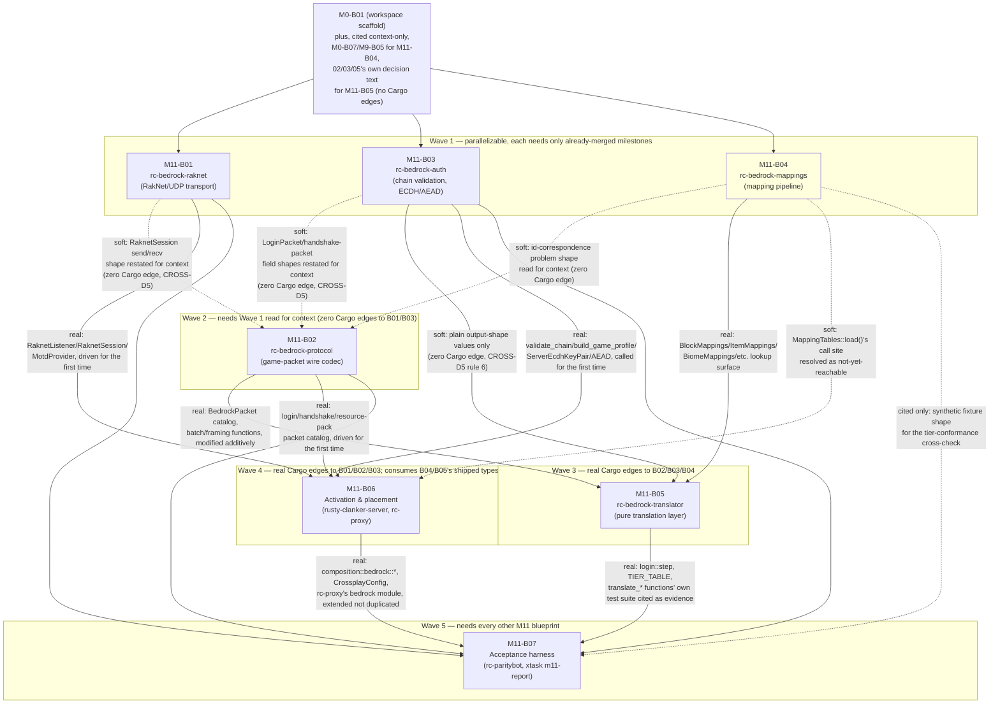

# M11-B00 — Milestone Index: Bedrock Cross-Play

## Milestone summary

M11 gives the project its Phase-1-server-only, config-activated Bedrock
Edition cross-play layer (`15-crossplay.md`), appended to the roadmap
independently of `M8`–`M10` and gated only on `M0`–`M7` (CROSS-D22). Seven
blueprints build it, following the exact "restate the seam, resolve every
genuine gap explicitly, hand off the next one honestly" discipline this
project's lineage already used across `M7`'s cluster-mode milestone: the
hand-written RakNet/UDP transport (M11-B01, `rc-bedrock-raknet`); the
Bedrock game-packet wire codec (M11-B02, `rc-bedrock-protocol`); the local
JWT-chain identity/encryption-handshake toolkit (M11-B03, `rc-bedrock-auth`);
the Java↔Bedrock mapping-data generation pipeline (M11-B04,
`rc-bedrock-mappings`, plus an `xtask` extension); the pure, socket-free
protocol-translation layer (M11-B05, `rc-bedrock-translator`, plus a small,
named extension to M11-B02's own packet catalog); monolithic- and
cluster-mode activation/placement, the `[crossplay]` config surface, and the
`ForwardedIdentity`/`Edition::Bedrock` extension to `rc-proxy` (M11-B06); and
the milestone's own seven-criterion acceptance harness plus the first
machine-readable Roadmap Completion rollup for the entire `M0`–`M11`
sequence (M11-B07).

Every blueprint in this milestone is exceptionally well cross-referenced:
each restates only the planning-decision text and prior-blueprint API
surface it actually needs, cites CROSS-D/ASSET-D/WS-D/NET-D/CLUSTER-D
decision IDs precisely, and — where `15-crossplay.md` genuinely leaves a
wire-level or architectural question open (chunk-delivery mode, movement
authority, the block-hash function, the inventory transaction-bridging
model, the NET-D8 typed-ingress-event concretization, and others) —
resolves it once, explicitly, confidence-flagged, and names the exact
reconciliation this project's planning corpus still owes `15` and `01`'s own
next revisions. One genuine, load-bearing, corpus-wide gap threads through
the milestone's back half, named identically and honestly by every blueprint
that depends on it rather than papered over by any one of them: **no
blueprint through M11-B06 supplies a concrete `BedrockTranslator`
implementation** wiring M11-B05's own already-real, already-tested pure
translation functions into `rusty-clanker-server`'s real ECS/session-intake
path (M11-B06 ships exactly one implementation, `UnavailableBedrockTranslator`,
by design). This is not a gap any blueprint in this milestone introduces —
`rc-bedrock-raknet`/`rc-bedrock-protocol`/`rc-bedrock-auth`/`rc-bedrock-mappings`/
`rc-bedrock-translator` are each, individually, real, complete, and
Tier-1-proven, and M11-B06 wires a real, live, dual-listener (Java+Bedrock)
server with a real login/handshake/resource-pack sequence — it is the single
missing composition-root/ECS-adapter/Stage-11-integration piece that would
let a Bedrock connection actually reach Play state and see real,
worldgen-parity terrain, restated precisely by M11-B05's own Interfaces
section and M11-B06's own Constraints, and inherited, never re-derived, by
M11-B07's own acceptance harness. A second, independent, already-existing
gap (`M7-B08`'s own still-open `main.rs` cluster-role wiring) affects only
M11's cluster-mode acceptance leg, restated verbatim from `M7-B09`.

| ID | Title | Scope |
|---|---|---|
| M11-B01 | RakNet Transport (`rc-bedrock-raknet`) | L |
| M11-B02 | Bedrock Game Protocol (`rc-bedrock-protocol`) | L |
| M11-B03 | `rc-bedrock-auth`: Login Chain, Identity Mapping & Encryption Handshake | L |
| M11-B04 | Bedrock Mapping Data Pipeline (`rc-bedrock-mappings`) | L |
| M11-B05 | Bedrock Protocol Translator (`rc-bedrock-translator`) | L |
| M11-B06 | Activation, Deployment Placement & Server-List Ping | L |
| M11-B07 | M11 Acceptance Harness & Roadmap Completion Report | L |

## Dependency graph

**Recommended execution order:**

1. **M11-B01**, **M11-B03**, and **M11-B04** in parallel — each depends only
   on already-merged milestones (`M0-B01` for B01/B03; `M0-B01`/`M0-B07`/
   `M9-B05` for B04, all already merged) and none takes a Cargo dependency on
   either of the other two or on any other M11 blueprint. B01 and B03 are
   each, individually, standalone leaf crates (CROSS-D5 rule 5); B04 is a
   library-plus-`xtask`-extension pair whose own automated Done state needs
   no real Bedrock materials.
2. **M11-B02** once B01, B03, and B04 have landed — not a hard Cargo
   dependency on any of the three (CROSS-D5 draws no edge from
   `rc-bedrock-protocol` to `rc-bedrock-raknet`/`rc-bedrock-auth`, and its
   edge to `rc-bedrock-mappings` is a permitted-but-unexercised one, §A of
   that blueprint), but a real **content** dependency: B02's own Context §D
   restates M11-B03's "Seam to the future packet-layer blueprint" section as
   the seam its `LoginPacket`/`ServerToClientHandshakePacket`/
   `ClientToServerHandshakePacket` fields fulfil, and its Context §A cites
   M11-B04's already-shipped `ids.rs`/`tables.rs` shape as confirmation that
   the mapping crate never assigns a wire-level runtime id (the reason this
   blueprint resolves that assignment itself, §M/§O). Land B01/B03/B04 first
   so B02's own restatements are accurate against real, merged text, not
   read against blueprints still in flight.
3. **M11-B05** once B02, B03, and B04 have all landed (hard: real Cargo
   edges to all three, CROSS-D5 rule 6) — the first M11 blueprint with a
   genuine compile-time dependency on more than one sibling. It additively
   modifies B02's own crate (six new packet types, §A) — land B02 first so
   that extension applies to real, already-committed code rather than a
   moving target.
4. **M11-B06** once B01, B02, and B03 have all landed (hard: real Cargo/API
   edges — the first blueprint to actually *drive* B01's `RaknetListener`,
   B02's login/handshake/resource-pack catalog, and B03's
   `validate_chain`/`ServerEcdhKeyPair`/AEAD toolkit end to end) — plus
   `M6-B07`/`M7-B06`/`M7-B08` (already-merged monolithic and cluster
   composition roots it extends additively). B04 is read only to confirm
   `MappingTables::load()` has no reachable call site yet (Context §H) — no
   Cargo edge, no ordering requirement relative to B04 beyond B04 already
   existing as a crate.
5. **M11-B07** strictly after B01–B06 all land — it is the sole consumer of
   every other M11 blueprint's own already-real, already-shipped types
   (B05's `login::step`/`TIER_TABLE`, B06's `composition::bedrock::*`/
   `CrossplayConfig`/`rc-proxy`'s `bedrock` module) and authors no
   production Bedrock-side code of its own, only a reusable client-side bot
   driver (`rc-paritybot::bedrock_bot`) and `xtask m11-report`'s own
   measurement/orchestration logic.

## Per-blueprint summary

**M11-B01 — RakNet Transport.** Gives `rc-bedrock-raknet` a complete,
hand-written-from-public-documentation RakNet server (CROSS-D9): the
offline/unconnected handshake (MTU negotiation, the anti-amplification
cookie), the full frame/reliability layer (all eight reliability types,
32 order channels, fragmentation/reassembly, ACK/NAK, a clock-injectable
RTT/RTO retransmission model per Karn's algorithm), the online connection
lifecycle, a shared-socket Tokio architecture, and the `crossplay` Cargo
feature's own first wiring (WS-D5(e)). Declares, but exercises neither of,
CROSS-D5 rule 5's two permitted internal edges (`rc-core` unused; this
crate has zero edge to `rc-bedrock-mappings`, which rule 5 does not even
offer it). Every RakNet-internal wire fact is individually confidence-flagged
(protocol version 11, the `+46` MTU-overhead constant, the 10-entry
`SYSTEM_ADDRESS_COUNT`), cross-verified across four independent public
sources. Never inspects a single byte of Bedrock's own game-packet
protocol — its entire output, once `Connected`, is an opaque, reliability-
and ordering-solved byte stream (§L, the seam every later M11 blueprint
builds against). Ships correctly-encoded-but-functionally-unexercised
`*WithAckReceipt` reliability variants (a named, explicit non-goal) and two
independent flood defenses (a per-source-IP offline-attempt rate limiter;
GeyserMC's own published, cited per-tick inbound-datagram caps).

**M11-B02 — Bedrock Game Protocol.** Gives `rc-bedrock-protocol` the
complete Bedrock game-packet wire codec CROSS-D2 assigns it: the `0xFE`
batch envelope, Zlib compression (Snappy representable-but-unimplemented,
a named non-goal), sub-packet header packing, a hand-rolled little-endian/
VarInt network-NBT variant, and the full M11 packet catalog from
`RequestNetworkSettings` through the mapped-tier play surface (login/
handshake, resource packs, `StartGame`'s full 25+50-field shape, creative
content, on-demand chunk delivery via `SubChunkRequest`/`SubChunk`, block
updates, `PlayerAuthInput`-primary movement, a decomposed-plus-opaque-catch-all
inventory tier, chat, the player roster, entity lifecycle/sync). Declares,
never exercises, both of its own permitted CROSS-D5 rule 5 edges
(`rc-core`, `rc-bedrock-mappings`) — every id this crate carries is a raw,
locally-defined wire-primitive newtype, never a resolved semantic type.
Resolves three genuine gaps `15-crossplay.md` leaves open, honestly, for
the first time in this corpus: `StartGamePacket.BlockNetworkIdsAreHashes =
true` with a placeholder FNV-1a-64 hash function; on-demand sub-chunk
delivery as M11's baseline chunk-transfer mode; `PlayerAuthInputPacket` as
the sole authoritative movement-input path. Every field-shape fact is
individually confidence-tiered (HIGH/MEDIUM/LOW-FLAGGED) against live
2026-08-24 fetches of the official `mojang.github.io/bedrock-protocol-docs`
site and `wiki.bedrock.dev`, per ASSET-D18(b)/(h)/CROSS-D27.

**M11-B03 — `rc-bedrock-auth`.** Gives `rc-bedrock-auth` CROSS-D11/D12's
complete local-only toolkit: an anchor-index-agnostic Login `chain` JWT
validator (ES384, no live HTTP call, ever — a fact structurally enforceable
by `cargo tree` returning zero network-capable crates), client-data-token
signature verification with an opaque pass-through payload, the
XUID→internal-UUID derivation (`Uuid::new_v5` under a fixed, permanently-
frozen namespace constant) plus this blueprint's own necessary offline/
unauthenticated extension (`"offline:{display_name}"`, structurally
non-colliding with a genuine XUID), `BedrockGameProfile` assembly with
CROSS-D10's `username_prefix`, and a per-connection ephemeral P-384 ECDH +
AES-256-GCM encryption-session toolkit. Every function operates on plain
`&str`/`&[u8]` values — zero Cargo edge to `rc-bedrock-protocol` or
`rc-bedrock-raknet` (CROSS-D5 rule 5), mirroring `rc-auth`'s own identical
isolation relative to `rc-protocol` (M1-B03). Adds one genuinely new
CROSS-D10 config field (`mojang_root_key_override`) since the compiled-in
Mojang root public key's exact byte value is only MEDIUM-confidence-sourced.
Three handshake-formula rows (AES-256-GCM key derivation, the per-packet
nonce construction, the salt length) are explicitly LOW/FLAGGED — proven
internally correct (round-trip, tamper-detection, reordering-detection) but
not claimed wire-compatible with a genuine Bedrock client, routed to
CROSS-D25's manual-verification carve-out.

**M11-B04 — Bedrock Mapping Data Pipeline.** Gives `rc-bedrock-mappings`
the generated Java↔Bedrock correspondence-table crate CROSS-D2 names, plus
the `xtask fetch-bedrock-data`/`codegen-bedrock-mappings` pipeline that
produces its committed content (never raw BDS/`bedrock-samples` materials,
ASSET-D18(h)). Ships a total, deterministic, fully-specified forward
(Java→Bedrock) and reverse (Bedrock→Java, precomputed by exhaustive
enumeration, never a second hand-written inverse) block-state translation
algorithm — the one category with a real property system — plus the
identical, simpler shape for items/biomes/entities (total, fallback-backed)
and sounds/particles (partial, `Option`-returning, per CROSS-D16(d)'s own
"omission is correct" rule). `MappingTables::load()` is the crate's sole
entry point, deliberately never called from any always-reachable path
(CROSS-D4/D26's zero-cost contract, proven at the crate-boundary level).
Delivers a deliberately minimal, high-confidence starter spec (a handful of
propertyless `Exact` blocks) — the full ~1196-block correspondence spec is
named, explicitly, as ongoing editorial work outside this blueprint's own
automated Done state, mirrored by every later M11 blueprint's identical
"starter table, not exhaustive coverage" precedent.

**M11-B05 — Bedrock Protocol Translator.** Gives `rc-bedrock-translator`
the complete CROSS-D2-assigned translation layer: a pure, socket-free,
crypto-free, ECS-free session state machine; per-session state (entity-id
bimap, inventory/container-window state, chunk client-cache tracking); the
full outbound direction (Java chunk sections/palettes → Bedrock sub-chunks
including a starter block-entity tier and this blueprint's own resolved
2-layer waterlogging-split algorithm; entity spawn/metadata mapping; chat/
sound/particle); the full inbound direction (`PlayerAuthInput` → Java
movement semantics; block actions; `ItemStackRequest` → Java container
clicks via this blueprint's own necessary transaction-bridging model,
including one original synthetic click command, `SwapSlots`, flagged as a
needed minimal extension to MECH-D49's own seven-`ClickType` vocabulary);
and the complete, honestly-implemented CROSS-D15–D18 tier table, verified
by its own conformance tests. Additively extends M11-B02's own packet
catalog with six packets that crate's M11-tier scoping did not cover
(`ItemStackResponsePacket`, `ContainerOpenPacket`/`ContainerClosePacket`,
`PlaySoundPacket`, `LevelEventPacket`, `UpdateAttributesPacket`), each
independently confidence-flagged and sourced. Confirms, by exhaustive
search of the committed corpus, that NET-D8's "typed ECS ingress event/
command" is not one unified enum but a per-gameplay-action-family
`Pending*`-shaped pattern (M1-B05, M2-B07) — this blueprint's own
`Translated*` types are shaped to match that pattern exactly, flagged for
`01`'s next revision to ratify or supersede. Builds and modifies no
production code outside `rc-bedrock-protocol`/`rc-bedrock-translator`
themselves — every seam to a real socket, real identity chain, real ECS
state, or real dirty-generation encode cache is named, precisely, as a
future composition-root/Stage-11-integration blueprint's own job.

**M11-B06 — Activation, Deployment Placement & Server-List Ping.** Gives
`rusty-clanker-server` and `rc-proxy` the one thing every M11-B01 through
M11-B04 blueprint deliberately left to "a sibling composition/activation
blueprint": a complete `[crossplay]` config surface (CROSS-D10, extended
with M11-B03's `mojang_root_key_override` plus this blueprint's own
motd/version/pack-serving field-groups); a real, config-gated RakNet
listener bound alongside the existing TCP listener in monolithic mode, and
at the proxy in cluster mode (CROSS-D3); a real Bedrock Login→chain-
validation→ECDH/AES-GCM-handshake→resource-pack-negotiation driver, built
once and necessarily duplicated across `rusty-clanker-server` and `rc-proxy`
(the identical dependency-direction reason M7-B06 already duplicates the
Java connection driver); a real `MotdProvider`; the `ForwardedIdentity`/
`Edition::Bedrock`/`xuid` extension CROSS-D14 names and M7-B06's own
`Edition` enum doc comment already pre-authorized by name; and the complete,
mechanically-checked CROSS-D26 zero-cost-when-off proof (no listener socket,
no `MappingTables::load()` call site anywhere in the workspace, no
translator thread). Ships `BedrockTranslator` and its own honest,
non-panicking placeholder, `UnavailableBedrockTranslator` — by design, not
a shortcut, the milestone's own one named, load-bearing gap (Milestone
summary). Names, and does not build, `ResourcePackDataInfoPacket`/
`ResourcePackChunkDataPacket`/`ResourcePackChunkRequestPacket` (a real gap
for M11-B02's own next revision, affecting only an operator who configures
a non-empty `resource_packs` list — the zero-packs default path is fully
tested).

**M11-B07 — Acceptance Harness & Roadmap Completion Report.** Wires all
seven of M11's roadmap acceptance criteria into `xtask m11-report`,
continuing the `M0-B08`→`M1-B06`→…→`M10-B06` `M<n>ReportResult` lineage,
building zero new Bedrock-side production behavior. Implements CROSS-D23
for the first time in this corpus — `BedrockBot`, a real, reusable
client-side driver added to `rc-paritybot` (never a new third-party
dependency), reusing M11-B03's own ECDH/AEAD math directly (genuinely
symmetric computation) while restating a fresh, independent client-side
JWT-chain-signing helper (M11-B03 exposes no signing API by design). AC1
(inertness, extended with a runtime `tracing`-scan and a real `criterion`
zero-cost benchmark) and AC5 (the tier-conformance suite, cross-checked by
an independently-authored evaluator) are real, Tier-1, and green today. AC2
(join lifecycle) is real and live through the full connection sequence,
honestly receiving `UnavailableBedrockTranslator`'s own disconnect — its
"spawns into real terrain" clause is the one honestly-gated case. AC3
(mixed-session cross-edition) and AC4 (Tier-1 world-state comparator, the
third block-entity-NBT hash layer added to M5-B10's own two) each ship a
real, self-tested pure evaluator/comparator with a gated live round trip.
AC6 (cluster-mode handoff) is doubly gated (the milestone's own inherited
translator gap, plus `M7-B08`'s still-open cluster-role wiring gap),
restating `M7-B09`'s own `ClusterIntegrationPending` framing exactly. AC7
(the manual pass, CROSS-D25) is documented in full, honestly not yet
executable to a pass. Ships the first machine-readable statement anywhere
in this corpus that the roadmap's `M0`–`M11` sequence — every milestone
this project's planning documents define — has a defined completion
signal (`RoadmapCompletionGate`), purely informational, correctly reporting
`roadmap_complete: false` until every gated case above closes.

## M11 acceptance criteria → blueprint mapping

| # | Acceptance criterion (`11-roadmap-milestones.md`) | Blueprint(s) | Status |
|---|---|---|---|
| 1 | `crossplay = false` (or absent): no UDP socket bound; a `criterion` benchmark shows no measurable tick-time regression (CROSS-D26). | M11-B01 (compile-time dependency-graph absence), M11-B06 (config-driven runtime inertness, both compile- and config-level), **M11-B07** (the runtime `tracing`-scan complement and the real `criterion` zero-cost benchmark, plus a full Java-only `M7` regression rerun) | **Real and green today.** Every proof this criterion needs is hermetic and already merged as of M11-B07 — no gap, no future blueprint required. |
| 2 | `crossplay = true`, monolithic mode: an unmodified, pinned-version Bedrock client completes the full connection lifecycle and spawns into the server's real, `M5`-generated terrain. | M11-B01/B02/B03 (transport/protocol/auth primitives), M11-B06 (the real, live, dual-listener login/handshake/resource-pack driver), **M11-B07** (`BedrockBot`'s own real, live lifecycle proof) | **The full connection-lifecycle clause is real and live today.** The "spawns into real terrain" clause is honestly gated on the milestone's own one named gap (a concrete `BedrockTranslator`, Milestone summary) — reported as a correctly-actionable `fail`, never a faked `pass`. |
| 3 | A scripted `both-simultaneously` cross-edition scenario confirms a block placed by one edition is observed by the other, with identical resulting world state (CROSS-D24). | M11-B05 (the pure translation functions both editions' own observations would flow through), **M11-B07** (`CrossEditionScenario`, the pure `evaluate_mixed_session` evaluator, self-tested) | **The evaluator is real, self-tested, and green today.** The live, two-real-bots-against-one-real-server round trip inherits the identical translator gap AC2 names. |
| 4 | The full CROSS-D15 Tier-1 set passes the cross-edition consistency suite with world-state hashes identical to the Java-only baseline (TEST-D10). | M11-B05 (`TIER_TABLE`'s own real `Tier::Parity` rows and their `implemented_by` proofs), **M11-B07** (the three-layer `hash_world_state` comparator, extending M5-B10, self-tested) | **The static Tier-1 claim and the comparator are both real and green today.** The live world-state comparison inherits the identical translator gap AC2 names. |
| 5 | The full CROSS-D16/D17 Tier-2/3 set is asserted present-and-bounded via a dedicated fixed test matrix. | **M11-B05** (`TIER_TABLE`, `tier_table_conformance.rs`), **M11-B07** (`verify_tier_conformance`, an independently-authored cross-check) | **Fully real and green today, not gated at all** — the one Play-state-adjacent criterion this milestone proves live end to end, since it is a claim about the tier table's own internal consistency, never a live client round trip. |
| 6 | `crossplay = true`, cluster mode: a Bedrock client's session survives a cross-node region-boundary handoff within `M7`'s ≤2-tick budget. | M11-B01 (transport), M11-B06 (proxy-side Bedrock login/relay, `NodeAcceptor::try_recv_bedrock`, confirmed handoff-protocol-agnosticism), **M11-B07** (the compose overlay, the Bedrock-adapted TEST-D21 handoff measurement) | **Doubly gated**, restated identically from `M7-B09`: the milestone's own translator gap, *and* `M7-B08`'s own still-open `main.rs` cluster-role-wiring gap — neither introduced by this milestone, both named precisely and inherited honestly. |
| 7 | A real, unmodified pinned-version Bedrock game client manually joins, renders, and plays a continuous session (CROSS-D25). | **M11-B07** (`docs/MANUAL-VERIFICATION-M11-B07.md`) | **Documented in full**, per PLAN-D5's "a documented, reproducible manual procedure" allowance — honestly not yet executable to a real, evidence-backed pass until the milestone's own translator gap closes (a genuine client would reach the identical honest disconnect `BedrockBot` already does). |

## Cross-blueprint consistency notes

- **The `crossplay` Cargo feature is built up incrementally across three
  blueprints, verified consistent at every step.** M11-B01 creates
  `rusty-clanker-server`'s `crossplay = ["dep:rc-bedrock-raknet"]` array and
  its own doc comment explicitly invites "each subsequent `rc-bedrock-*`
  crate's own blueprint" to extend it. M11-B06 adds the remaining three
  entries (`rc-bedrock-protocol`/`rc-bedrock-auth`/`rc-bedrock-mappings`) —
  deliberately **not** `rc-bedrock-translator`, since no code in that
  blueprint's own changeset references it yet (the identical "no unused
  dependency" discipline M11-B01 §A already established for its own two
  permitted-but-unexercised edges) — plus the one genuinely new piece of
  feature-graph plumbing, `rc-proxy`'s own weak-dependency-feature line.
  Verified consistent: no blueprint redefines the array, each only appends.

- **Every blueprint's own CROSS-D5 dependency-ceiling claim matches
  `12-workspace-structure.md`'s own ratified graph exactly, edge for
  edge**, verified by this audit against that document's own mermaid
  source (`bproto --> core`, `bproto --> bmap`, `braknet --> core`,
  `bauth --> core`, `bmap --> core`, `bmap --> reg`, `btrans --> core`,
  `btrans --> reg`, `btrans --> bmap`, `btrans --> bproto`) — no blueprint
  claims an edge that document does not ratify, and every "permitted but
  unexercised" edge (M11-B01's/M11-B02's own `rc-core`; M11-B02's own
  `rc-bedrock-mappings`; M11-B05's own `rc-core`/`rc-registries`) is named
  as such, honestly, rather than silently omitted or silently added.

- **M11-B06's `Edition::Bedrock`/`ForwardedIdentity::xuid` extension to
  `rc-proxy` matches M7-B06's own pre-authorization exactly**, verified by
  this audit against both blueprints' own committed text: M7-B06 §F's
  `Edition` enum doc comment names, by number, "adding a `Bedrock` variant
  plus the named fields is that blueprint's own, additive change" — M11-B06
  §H is that blueprint, adding exactly `Edition::Bedrock` and one new
  `Option<String>` field, with the identical bounded, pre-authorized
  exception to "never touch a pre-existing signature" every other blueprint
  in this milestone observes elsewhere. `NodeAcceptor::try_recv_bedrock` and
  `ProxyConfig::{bedrock_bind, bedrock_motd}` are each additive, mirroring
  M7-B07's own established "Finding F5" precedent of adding precisely the
  missing pieces a shipped type needs, never more.

- **The milestone's one named gap (a concrete `BedrockTranslator`) is
  restated identically, word-for-word in substance, by every blueprint that
  depends on it — M11-B05's Interfaces, M11-B06's Constraints (f), and
  M11-B07's Context §A (which explicitly counts this as the sixth
  restatement in the corpus's own M11 lineage) — verified by this audit to
  carry no drift in scope or framing across any of the three.** No
  blueprint in this milestone silently narrows, widens, or papers over it;
  M11-B07's own `AC2_SPAWN_GATE_MESSAGE` cites the identical contract by
  name in its own machine-readable `fail` output.

- **Every M11 blueprint's own resolved gap-filling decisions (chunk-delivery
  mode, movement authority, the block-hash placeholder, the waterlogging
  split, the transaction-bridging model, the NET-D8 pattern concretization,
  and others) are consistently flagged as pending reconciliation into
  `15-crossplay.md`'s or `01-server-architecture.md`'s own next revision —
  never presented, in any blueprint's own implementation-changeset code
  comments, as an already-ratified `CROSS-D`/`MECH-D` decision.** Verified
  by this audit across all seven blueprints' own Constraints sections; no
  contradiction found between any two blueprints' own restatement of the
  same underlying gap.

## M11 completion, restated

M11-B01, M11-B03, and M11-B04 each reach Tier-1 Done independently and in
parallel, needing only already-merged `M0`/`M9` prerequisites; none takes a
Cargo dependency on either of the other two or on any other M11 blueprint.
M11-B02 needs no Cargo dependency on B01/B03/B04 either, but is derived
against their real, merged text (Recommended execution order, above).
M11-B05 needs B02, B03, and B04 all merged (real Cargo edges, CROSS-D5 rule
6) and additively extends B02's own packet catalog. M11-B06 needs B01, B02,
and B03 all merged (the first blueprint to actually drive all three end to
end) plus the already-merged `M6-B07`/`M7-B06`/`M7-B08` composition roots it
extends additively; it reads B04 only to confirm `MappingTables::load()`'s
own call site is not yet reachable. M11-B07 needs every other M11 blueprint
merged — it is the sole consumer of each one's own already-real, already-
shipped types and authors no production Bedrock-side code of its own. Every
blueprint's own Tier-1 gate is mutually consistent and independently green,
verified by this audit against each one's own Done-when list and Acceptance
tests — every pre-existing M0–M10 test, and every pre-existing M11 sibling's
test, passes unmodified wherever a later M11 blueprint touches a shared file
(M11-B05 on `rc-bedrock-protocol`'s own additive extension; M11-B06 on
`rc-proxy`'s `identity.rs`/`config.rs`/`node_acceptor.rs`; M11-B07 on
`rc-paritybot`'s `Cargo.toml`/`lib.rs` and `.github/workflows/ci.yml`).

`11-roadmap-milestones.md`'s seven M11 acceptance criteria are, as of every
blueprint through M11-B07 landing, blocked on exactly one milestone-specific
gap (M11 acceptance criteria → blueprint mapping, above) — a concrete
`BedrockTranslator` implementation wiring M11-B05's own already-real
translation functions into `rusty-clanker-server`'s real ECS/session-intake
path and a Stage-11-integration blueprint wiring the outbound half — plus,
for the cluster-mode criterion alone, the independent, already-existing
`M7-B08` cluster-role-wiring gap. AC1 and AC5 are unblocked by either gap
and are fully real and green today. AC2's full connection-lifecycle clause,
AC3's and AC4's own evaluators/comparators, and AC7's own documented
procedure are likewise real and green (or, for AC7, real and complete as
written); only each criterion's own live-round-trip-through-a-real-translator
clause remains gated. AC6 is doubly gated. Until the milestone's own one
named gap (and, for cluster mode, `M7-B08`'s own) closes, M11-B07's own
`m11-acceptance-gate` `workflow_dispatch` job's first fully-green run remains
unexercised — the identical "drafted-complete vs. measured-complete"
distinction this project's own harness-blueprint lineage has established as
standing practice since `M0-B08`, and M11-B07's own `RoadmapCompletionGate`
correctly, honestly reports `roadmap_complete: false` until it does.

Per CROSS-D22, M11 is independent of `M8` (Mod API Alpha) and fully
independent of `M9`/`M10` (the Phase 2 native client) — nothing in this
milestone's own seven blueprints depends on, or is depended on by, any
blueprint in either of those milestones (verified by this audit: no M11
blueprint's own Prerequisites field names an `M8`/`M9`/`M10` blueprint, and
`M10-B08`'s own composition-root closure is unaffected by, and does not
affect, anything in this milestone).
