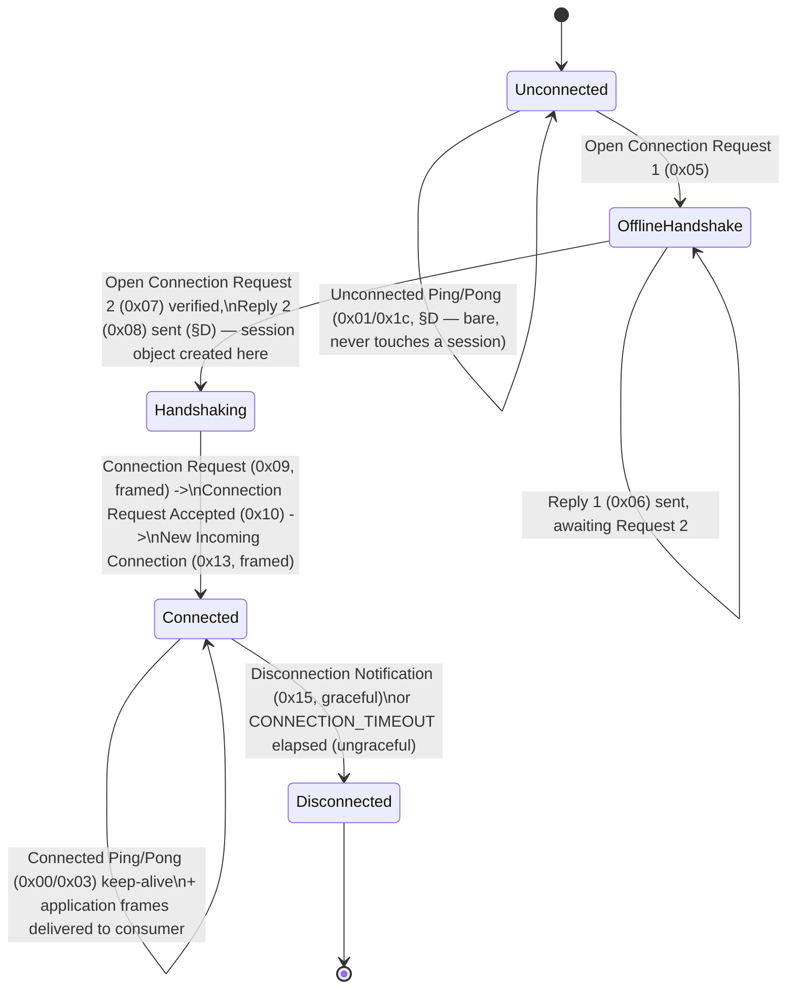

# M11-B01 — RakNet Transport (`rc-bedrock-raknet`)

| Field | Content |
|---|---|
| ID | M11-B01 |
| Milestone | M11 — Bedrock Cross-Play |
| Prerequisites | M0-B01 (workspace scaffold) — for the workspace-wide conventions this blueprint follows unmodified: WS-D1 naming (`rc-<domain>` / `crates/<domain>/`), WS-D4 toolchain/edition, WS-D7 (`[workspace.dependencies]` as the single version source), WS-D8 repository layout. **Restated explicitly because it is easy to assume otherwise:** `M0-B01`, as actually written, scaffolds only the 22 library crates + 2 binaries that existed in `12-workspace-structure.md`'s Crate Manifest at the time it was derived — the five `rc-bedrock-*` crates (CROSS-D2) were ratified into that manifest by a **later** revision of `12`, after M0-B01 already landed. Consequently `crates/bedrock-raknet/` does not exist yet, and `rusty-clanker-server`'s `Cargo.toml` does not yet carry a `crossplay` Cargo feature. This blueprint is therefore the **first** to create the crate and the first to wire that feature — both done in full below, not merely referenced, exactly as `00-blueprint-spec.md`'s self-containment rule requires. No other M0 blueprint, and no M1–M8 blueprint, is a functional prerequisite: this crate depends on zero Java-side code (CROSS-D1's "the simulation core never learns about Bedrock," applied at the crate-dependency level). |
| Implements | CROSS-D2 (crate identity, placement, responsibility — restated in full); CROSS-D3 (restated only for the one fact this crate's own design must honor: RakNet framing/reliability and the offline handshake run wherever the composition root places this crate — proxy-side in cluster mode, in-process in monolithic mode, per CROSS-D3's own split — this blueprint's own API is deployment-topology-agnostic and makes no assumption either way, deferring topology wiring entirely to a future composition-root blueprint); CROSS-D4 (compilation/activation split — the `crossplay` Cargo feature, wired by this blueprint); CROSS-D5 rule 5 (dependency-graph placement: `rc-core` only, never `rc-messaging`/`rc-protocol`); CROSS-D6 (referenced, not re-derived — this crate has zero hardcoded awareness of the pinned Bedrock game-protocol number); CROSS-D8 (RakNet-only transport, port/config surface, flood-protection stance — restated in full); CROSS-D9 (hand-written from public documentation, no third-party RakNet crate — restated with full source provenance); CROSS-D10 (default bind address, unconnected-ping/pong MOTD path, the `[crossplay]` config block's `bind` field — restated; the remaining `[crossplay]` fields belong to a future `rc-bedrock-auth`/composition blueprint); WS-D1/D4/D7/D8 (workspace conventions, restated above); WS-D2/D5(e) (crate-manifest ratification and the `crossplay` feature — wired by this blueprint, closing the gap noted in Prerequisites); TEST-D27 (property-test toolchain reuse — `proptest`, already workspace-pinned by M0-B02); TEST-D45/D46/D50 (test-first changeset boundary, CI authority, restated). |
| Crates touched | `rc-bedrock-raknet` (`crates/bedrock-raknet/`) — new, full implementation, this blueprint's entire scope. `rusty-clanker-server` (`crates/server/`) — `Cargo.toml` only: one new optional dependency line, one new Cargo feature entry (`crossplay`) added to `default`. Nothing under `crates/server/src/` is touched — no code in `rusty-clanker-server` calls into this crate yet; that is a future composition-root blueprint's job (see Constraints). Root `Cargo.toml` — one new `[workspace.dependencies]` line (`rand`), this blueprint's own cited addition. |
| Estimated scope | L |

## Goal & Done definition

Give `rc-bedrock-raknet` a complete, hand-written, from-scratch RakNet server implementation exactly as Minecraft Bedrock Edition uses it (CROSS-D9): the offline (unconnected) handshake — status ping/pong, MTU negotiation, the anti-amplification cookie — the frame-set/reliability layer (all eight reliability types, ordering across RakNet's 32 channels, sequencing, fragmentation/reassembly, ACK/NAK, a virtual-time-testable RTT/RTO retransmission model), the online connection lifecycle (connection request/accepted, new incoming connection, connected ping/pong keep-alive, graceful and timeout disconnect), a Tokio UDP socket architecture built so `crossplay` compiled out means this crate is entirely absent from `rusty-clanker-server`'s dependency graph (WS-D5(e)), and never binds a socket unless explicitly constructed by a future config-gated composition-root call (CROSS-D4/D10). This crate hands its consumer — `rc-bedrock-protocol`/`rc-bedrock-translator`, both future M11 blueprints — a byte-level, reliability-solved, ordering-solved, deduplicated RakNet payload stream. It never inspects, decodes, or knows about a single byte of Bedrock's own game-packet protocol (that boundary is CROSS-D2's crate split, restated in §A).

Done when:

- [ ] `cargo build -p rc-bedrock-raknet --all-features` succeeds with zero warnings, on both `ubuntu-24.04` and `windows-2025`.
- [ ] Every acceptance test in this blueprint's own test changeset passes under `cargo nextest run -p rc-bedrock-raknet`.
- [ ] `frame_roundtrip_all_reliability_classes` and its siblings (datagram header, ACK/NAK record encoding, MTU-budget packing) all pass.
- [ ] `fragmentation_reassembly_property` (proptest) passes: any payload split into fragments and fed back in any permutation reassembles byte-identical.
- [ ] `offline_handshake_state_machine` (own-authored recorded-shape fixtures) passes: the full request-1→reply-1→request-2→reply-2 sequence, a cookie-mismatch rejection, and an unsupported-protocol-version rejection.
- [ ] `retransmission_timing_virtual_clock` passes: RTO growth/shrink per the stated formula, RTO-driven and NAK-driven resend, Karn's-algorithm RTT-sampling exclusion on retransmitted datagrams — all driven by synthetic `Instant`s, zero real sleeps.
- [ ] `loopback_two_socket_integration` passes: two real Tokio `UdpSocket`s on `127.0.0.1`, a hand-authored test-only fake-client driver completing a real handshake and exchanging application messages against a real `RaknetListener`/`RaknetSession`.
- [ ] `ratelimit_offline_flood_and_inbound_flood` passes (CROSS-D8's flood-protection stance, restated).
- [ ] `crossplay_feature_absence_removes_crate_from_dependency_graph` passes: `cargo metadata --no-default-features --features monolithic -p rusty-clanker-server` resolves with zero `rc-bedrock-raknet` node.
- [ ] `cargo run -p xtask -- lint-deps` still exits 0 (this blueprint adds no crate to `rc-messaging`'s or `rc-mod-api`'s exact-set rules, and adds no `SIM`↔`NETRENDER` edge — `rc-bedrock-raknet` is outside every set that checker enumerates today; CROSS-D5's own extension of `lint-deps` for the Bedrock crates is a future `12`-ratifying blueprint's job, not this one's, restated in Constraints).
- [ ] `cargo run -p xtask -- fmt-check` and `cargo run -p xtask -- lint` both exit 0.
- [ ] `cargo test --doc -p rc-bedrock-raknet` exits 0.
- [ ] CI tier: Tier 1 (`fmt-check`, `lint`, `lint-deps`, `test`) green on both `ubuntu-24.04` and `windows-2025` (TEST-D34/D37), on a clean checkout (TEST-D50).

## Context (self-contained)

### §A — Crate boundary: what this blueprint does and does not own

CROSS-D2 assigns this crate exactly: "the RakNet/UDP transport: datagram framing, the reliability/ordering layer, the offline/online RakNet connection handshake." Everything Bedrock-game-protocol-shaped — the `0xFE`-wrapped game-packet batch format, `NetworkSettings`/`Login`/compression negotiation, and every packet a consumer would recognize as "Minecraft" rather than "RakNet" — belongs to `rc-bedrock-protocol` (wire codec) and `rc-bedrock-translator` (the actual translation into NET-D8's typed ECS ingress events), both **future** M11 blueprints this one does not create. The JWT-chain identity verification (CROSS-D11/D12) belongs to `rc-bedrock-auth`, likewise future. This crate's entire output, once a session reaches `Connected`, is: an ordered stream of opaque `Bytes` payloads per order channel, with reliability/ordering/deduplication/fragmentation already resolved — indistinguishable, from this crate's point of view, from any other application using RakNet for any other purpose. It never branches on a payload's first byte to recognize a Bedrock-specific packet ID (the small set of packet IDs this crate *does* recognize — §D/§I below — are RakNet's own internal protocol messages, not Bedrock's). This mirrors `rc-protocol`'s own "pure data/codec, no sockets" isolation and `rc-messaging`'s WS-D3-rule-3 purity, applied to a third, independent protocol family (CROSS-D1's own framing: cross-play is "a second wire protocol adapted at the connection boundary," never a second thing the engine understands).

CROSS-D5 rule 5 fixes this crate's own dependency ceiling: `rc-bedrock-raknet` may depend on `rc-core` and nothing else among RC crates — never `rc-messaging`, never `rc-protocol`, never `rc-scheduler`. This blueprint's own resolution: it declares **zero** internal RC-crate dependencies. `rc-core` remains M0-B01's doc-comment-only empty shell as of this writing, and nothing in this crate's own content needs a coordinate type, an entity-ID type, or a shared error convention beyond what this crate defines for itself with its own `thiserror` enums — adding an unused dependency for its own sake would be dead weight (a future blueprint may add the edge the moment it introduces a genuine need; CROSS-D5 rule 5 permits it, this blueprint simply does not exercise that permission).

### §B — Source provenance and confidence flags

Per CROSS-D9, this crate is hand-written from public documentation — never a dependency on `rust-raknet`/`raknet-rs`/`ruknet`/`raknet-rust`, and never any GeyserMC/CloudburstMC/gophertunnel code outside the ASSET-D30 firewall (CROSS-D29). Every field layout below is restated in this project's own words from, cross-verified across, the following public sources (all re-fetched live for this blueprint, 2026-08-24 — training-data recollection is never trusted alone for byte-level protocol facts in this corpus):

- `wiki.bedrock.dev/servers/raknet` — the primary named source (CROSS-D9): magic bytes, the offline handshake packet layouts, port `19132`/`19133`, RakNet protocol version "currently 11." This page is explicitly marked work-in-progress upstream and does **not** cover the frame/reliability layer at all.
- The original, openly-published RakNet protocol specification, as mirrored by two independent community documentation projects (`vp817/RakNetProtocolDoc`, `MFDGaming/MinecraftRakNetDocumentation`) plus `minecraft.wiki/w/RakNet` and an archived `wiki.vg` Pocket Edition protocol page — CROSS-D9's second named source ("the original openly-published RakNet protocol specification"). These four independently-authored pages agree, field-for-field, on the datagram header, frame header, reliability-type table, split-packet fields, and ACK/NAK record shape restated below — cross-agreement across four unrelated authors is this blueprint's own bar for "high confidence" on a fact no single source stated with byte-exact precision.
- The original RakNet library's own `SystemAddress` IPv4 encoding (the bitwise-complement quirk, §C) and its classic RTO formula's `u`/`q` coefficients and bounds (§H) — both corroborated by a GitHub mirror of the original pre-acquisition RakNet source tree's own protocol notes.
- GeyserMC's own published incident write-up on the RakNet amplification attack (`geysermc.org/blog/raknet-amplification-attack`) — the source for the cookie mitigation's purpose and shape (§D) and for the two concrete flood-protection numbers this blueprint reuses verbatim (§K), per this corpus's own established pattern (CROSS-D16's rationale: "reusing an already-battle-tested reality baseline... keeps this tier accurate on day one instead of accumulating as post-launch bug reports").

**Explicit confidence flags**, each individually named because a wrong value here risks either rejecting a real client or accepting a malformed one — never silently:

- **RakNet protocol version byte:** `wiki.bedrock.dev` states "currently 11"; one older community mirror states "10" (stale — it predates the cookie-based anti-amplification fix, which itself required a protocol-version bump to add the `Cookie`/`ServerHasSecurity` fields to Open Connection Reply 1 / Request 2). This blueprint adopts **11** as `RAKNET_PROTOCOL_VERSION`, per its primary named source, but this is the single fact in this blueprint most likely to have moved by implementation time — CROSS-D7(b)'s own bump-review step ("reviewed against fresh packet captures") is exactly the mechanism that re-verifies this against a real pinned-version (26.44) client at implementation time; a mismatch here is a one-line constant change, not a design change.
- **The `+46` MTU overhead constant** (§D): cited consistently but its exact provenance (IP+UDP header accounting vs. a RakNet-library-internal fixed offset) was not independently re-derived byte-for-byte. A few bytes of drift here only shifts the negotiated MTU ceiling slightly — both sides always agree on whatever value the server actually sent, so this cannot desync the protocol, only slightly under- or over-pack datagrams.
- **`SYSTEM_ADDRESS_COUNT = 10`** (§I, the fixed address-list length in `ConnectionRequestAccepted`/`NewIncomingConnection`): a widely-mirrored constant across community re-implementations, not independently confirmed against a byte-counted capture. Flagged for the same fresh-capture re-verification pass.
- Every other fact below — the datagram/frame header bit layout, the reliability-type table, split-packet field widths, the ACK/NAK record shape, the `SystemAddress` bitwise-complement encoding, the RTO formula's `u=2, q=4` coefficients and its `2s` cap / `30ms` additional variance — is treated as **high confidence**, cross-agreed across the independent sources named above.

### §C — Shared primitive types and the wire's own endianness asymmetry

**A real, load-bearing, source-confirmed asymmetry, restated explicitly so it is never "fixed" into one consistent endianness by mistake:** every multi-byte integer field **outside** a frame header — magic bytes, GUIDs, timestamps, MTU sizes, string-length prefixes, `SystemAddress` ports — is **big-endian**. Every multi-byte index field **inside** a frame header — reliable index, sequenced index, ordering index, and every split-packet field — is **little-endian**, specifically as 24-bit (`u24`) little-endian integers where noted. This is not an inconsistency to normalize; it is how the original RakNet library's own `BitStream` class actually serializes these two different field families, and every independent source cross-verified above agrees on it.

Primitive types this crate defines (`wire.rs`, internal, `pub(crate)` only — mirrors `rc-transport-net`'s own `wire.rs` role):

| Type | Wire width | Notes |
|---|---|---|
| `Magic` | 16 bytes, fixed | `[0x00,0xFF,0xFF,0x00,0xFE,0xFE,0xFE,0xFE,0xFD,0xFD,0xFD,0xFD,0x12,0x34,0x56,0x78]` — every offline message is prefixed or suffixed with this exact constant; a message whose magic bytes do not match this exactly is silently dropped, never replied to (§K's flood-protection stance: never dwell on or acknowledge malformed input). |
| `Guid` | `u64`, big-endian | A RakNet peer's own 64-bit session identity. `rc_bedrock_raknet::Guid` newtype (not `rc-core`'s `RcEntityId` — a different identity space entirely, never conflated). |
| `SocketAddressV4` | 7 bytes | `family: u8` (`0x04` for IPv4) + 4 address bytes, **each individually bitwise-complemented** (`!byte`, the confirmed RakNet-specific quirk — restated exactly: to encode `192.168.1.1`, write `!192, !168, !1, !1`; to decode, complement each received byte back) + `port: u16` big-endian. IPv6 `SystemAddress` encoding is **not implemented** by this blueprint — CROSS-D10 itself treats the IPv6 companion port as optional, not separately required; every `SocketAddressV4` field this crate reads/writes assumes an IPv4 peer, and this crate's own listener binds only the IPv4 form of whatever `bind` address a future config supplies (a bare `0.0.0.0:19132` per CROSS-D10's own default). |
| `MotdString` | `u16`-BE-length-prefixed UTF-8 | Used only by `Unconnected Pong`'s single MOTD field (§D) — the semicolon-delimited status string itself, composed by this crate from a caller-supplied `MotdProvider` (§J), never hardcoded. |

### §D — Offline (unconnected) handshake

Every packet in this section travels as a **bare** UDP datagram — no frame header, no reliability, no sequence number, exactly one packet per one UDP payload — starting with a single packet-ID byte. All numeric fields big-endian (§C). Table format: `field: type = meaning`.

**Unconnected Ping** (`0x01`, client→server; server list / MOTD probe, never touches session or ECS state — NET-D11's Java-side Status/Ping path restated for Bedrock, CROSS-D10):
`ping_time: u64` (client's own uptime clock, echoed back unmodified) · `magic: Magic` · `client_guid: Guid`.

**Unconnected Pong** (`0x1c`, server→client, unconditional reply to `0x01`):
`ping_time: u64` (echoed from the request) · `server_guid: Guid` · `magic: Magic` · `motd: MotdString`.

The MOTD string's own inner format — a single semicolon-delimited ASCII string, fields in this exact order (CROSS-D10's own enumeration: "edition, MOTD, protocol version, version name, player count/max, server GUID, sub-MOTD, game mode," restated field-for-field with the two trailing fields every current Bedrock client additionally expects):

```
MCPE;<motd_line1>;<bedrock_protocol_version>;<version_name>;<player_count>;<max_players>;<server_guid>;<motd_line2>;<game_mode>;<game_mode_numeric>;<ipv4_port>;<ipv6_port>;
```

`MCPE` (the edition tag) is a literal constant this crate writes unconditionally. `bedrock_protocol_version` and `version_name` are supplied by the caller through `MotdProvider` (§J) — **this crate has zero hardcoded knowledge of CROSS-D6's pinned Bedrock protocol number**; it only formats whatever the provider returns, exactly the isolation §A already establishes for game-protocol content generally. `game_mode_numeric` follows Bedrock's own small enum (`0` Survival, `1` Creative, `2` Adventure — the caller's `MotdProvider` supplies both the string and the matching numeric).

**Open Connection Request 1** (`0x05`, client→server, the first step of MTU discovery):
`magic: Magic` · `raknet_protocol_version: u8` · `padding: [u8]` (null bytes, variable length — the client's *entire* UDP datagram length up to this point *is* the MTU probe; this crate never validates the padding's content, only measures the datagram's total received length).

Validation, in order: (1) magic mismatch → silently drop (§K); (2) `raknet_protocol_version != RAKNET_PROTOCOL_VERSION` → reply `Incompatible Protocol Version` (`0x19`: `server_supported_version: u8` · `magic: Magic` · `server_guid: Guid`) and stop — never proceed to a reply-1; (3) otherwise, compute `advertised_mtu = clamp(received_datagram_len + MTU_OVERHEAD_BYTES, RAKNET_MIN_MTU, RAKNET_MAX_MTU)` (§B's flagged `+46` constant) and reply:

**Open Connection Reply 1** (`0x06`, server→client):
`magic: Magic` · `server_guid: Guid` · `server_has_security: bool` (this blueprint's own `require_cookie` config toggle, §J/§K — `true` by default, CROSS-D8's flood-protection stance) · `cookie: u32` (present **only if** `server_has_security`) · `advertised_mtu: u16`.

`cookie` is issued fresh, per source address, by `CookieAuthority::issue` (§K) — never stored server-side; its own re-derivability from `(secret, addr)` is the entire mechanism, so no per-attempt state is created by this step, which is exactly what defeats the amplification attack GeyserMC documented (a spoofed source address never receives this reply, so an attacker can never learn the cookie needed to complete the handshake — CROSS-D8's flood-protection stance, restated concretely).

**Open Connection Request 2** (`0x07`, client→server):
`magic: Magic` · `cookie: u32` (present only if reply-1 set `server_has_security`; echoed from reply-1 verbatim) · `client_supports_security: bool` (this crate ignores this field's value — RakNet's own built-in payload-encryption feature is never used by Bedrock, restated below) · `server_address: SocketAddressV4` (the address the client believes it reached — informational, this crate does not validate it against its own bind address) · `mtu: u16` (echoing the negotiated value from reply-1) · `client_guid: Guid`.

If `server_has_security` was set, this crate verifies `CookieAuthority::verify(from_addr, cookie)`; a missing or mismatched cookie is **silently dropped** — never a rejection reply (§K: replying to a value that fails verification is itself a potential amplification vector, so the correct response to "wrong cookie" is identical, from the network's point of view, to "no packet arrived"). A verified request creates this peer's `RaknetSession` in `Handshaking` state (§I) and replies:

**Open Connection Reply 2** (`0x08`, server→client):
`magic: Magic` · `server_guid: Guid` · `client_address: SocketAddressV4` (the address this crate actually observed the request arrive from — the client's own external, possibly-NATed address) · `mtu: u16` (the final negotiated value) · `encryption_enabled: bool` — **always `false`**. RakNet's own optional built-in wire-encryption feature is never used by Bedrock; the real encryption session Bedrock uses is negotiated afterward, entirely inside the framed game-protocol layer (CROSS-D11's ECDH-derived AES-GCM handshake, `rc-bedrock-auth`'s future scope) — a completely different, higher-layer mechanism this crate neither implements nor is aware of, restated here only to explain why this field is a hardcoded constant rather than a real toggle.

From this exact point — the moment `Open Connection Reply 2` is sent — every further datagram from this peer is a **framed** datagram (§E); this crate's offline-handshake state machine (`OfflineHandshake`, Deliverables) has nothing further to do for this peer.

**Additional offline rejections**, both silent-drop-free (a real reply, since these are not amplification-risky — they are short, fixed-size, and only sent to an address that already completed a real round trip):
- **Already Connected** (`0x12`): sent if `Open Connection Request 1` arrives from an address that already has a `Connected`-state session — `magic: Magic` · `server_guid: Guid`.
- **No Free Incoming Connections** (`0x14`): sent if `Open Connection Request 2` arrives while the listener is already at `max_pending_connections` (§J/§K) — same body shape as `0x12`.

### §E — Datagram and frame header layout

Once a session exists (§D's end state), every UDP datagram from that peer is one of exactly three shapes, distinguished by its first byte's top three bits:

```
bit:     7        6        5        4              3                  2
flag:  VALID    IS_ACK   IS_NAK   PACKET_PAIR   CONTINUOUS_SEND   NEEDS_B_AND_AS
mask:  0x80     0x40     0x20     0x10          0x08              0x04
```

`VALID` (`0x80`) is set on every real RakNet datagram this crate ever sends or accepts (a header byte with this bit clear is rejected outright — not a valid RakNet datagram at all). `PACKET_PAIR`/`CONTINUOUS_SEND`/`NEEDS_B_AND_AS` are part of RakNet's own legacy bandwidth-detection feature — present in the wire format's definition, **never set** by this implementation, and any inbound datagram that sets them is treated exactly as if it did not (this crate implements no packet-pair logic at all, matching Bedrock's own observed disuse of that feature).

**Data datagram** (`VALID` set, `IS_ACK`/`IS_NAK` both clear): header byte, then `sequence: u24` little-endian (this crate's own outbound sequence counter, or the peer's inbound one — monotonically increasing per direction, wrapping at `2^24`), then one or more **frames** packed back-to-back until the negotiated MTU budget (§D) is exhausted.

**ACK datagram** (`VALID | IS_ACK`): header byte, then directly the **record list** (no sequence number field on an ACK/NAK datagram — restated explicitly, a common point of confusion this blueprint's own cross-verified sources agree on).

**NAK datagram** (`VALID | IS_NAK`, `IS_ACK` clear): identical shape to an ACK datagram, opposite meaning (§H).

**Record list encoding** (shared by ACK and NAK): `record_count: u16` big-endian, then that many records, each: `is_single: bool` (1 full byte, not a bit — `minecraft.wiki`'s own field name, adopted here) then either, if `true`, one `index: u24` little-endian, or if `false`, `range_min: u24` little-endian followed by `range_max: u24` little-endian (an inclusive range, this crate's own encoder collapsing any run of ≥2 consecutive sequence numbers into one range record rather than emitting singles, for wire efficiency — decoding accepts either shape regardless of whether the peer bothers to collapse).

**Frame header**, one per frame within a data datagram's body:

```
flags: u8 = (reliability as u8) << 5 | if fragmented { 0x10 } else { 0 }
length_in_bits: u16 (big-endian)          // this frame's body length, in BITS — always a
                                            // byte-aligned value in practice (length_in_bits % 8 == 0)
                                            // since this implementation never sub-byte-packs a body;
                                            // read as bits, divided by 8 (rounding up defensively) to
                                            // get the body byte length
[reliable_index: u24 LE]                   // present iff reliability.is_reliable()
[sequenced_index: u24 LE]                  // present iff reliability.is_sequenced()
[order_channel: u8, order_index: u24 LE]   // present iff reliability.is_ordered()
[fragment: {compound_size: u32 BE, compound_id: u16 BE, index: u32 BE}]  // present iff fragmented
body: [u8; length_in_bits / 8]
```

**Reliability type table** — the top 3 bits of `flags`, cross-verified across all four independent sources named in §B:

| Value | Name | Reliable | Ordered | Sequenced | Wants ack receipt |
|---|---|---|---|---|---|
| 0 | Unreliable | no | no | no | no |
| 1 | UnreliableSequenced | no | yes | yes | no |
| 2 | Reliable | yes | no | no | no |
| 3 | ReliableOrdered | yes | yes | no | no |
| 4 | ReliableSequenced | yes | yes | yes | no |
| 5 | UnreliableWithAckReceipt | no | no | no | yes |
| 6 | ReliableWithAckReceipt | yes | no | no | yes |
| 7 | ReliableOrderedWithAckReceipt | yes | yes | no | yes |

`reliable_index` is one shared, monotonically increasing per-connection counter across every reliable frame this side sends, regardless of order channel — never per-channel. `sequenced_index` and `order_index` are each maintained **per order channel** (`MAX_ORDER_CHANNELS = 32`, `order_channel` is a `0..32` byte). The "with ack receipt" variants (5/6/7) exist for wire completeness (a real Bedrock client's engine may in principle use them) but are not required by this blueprint's own API surface — no acceptance test in this blueprint exercises the local send-receipt-notification behavior those variants imply on the *sending* side; this crate correctly encodes/decodes them and correctly applies their reliability/ordering semantics, but does not implement a receipt-callback API (an explicit, named non-goal — Constraints).

### §F — Reliability, ordering, and deduplication semantics

**Deduplication.** Every reliable frame's `reliable_index` is checked against a per-connection sliding window (`ReliableWindow`, Deliverables) before being accepted for further processing; an index already seen (an ordinary consequence of the dual NAK/RTO retransmit paths in §H racing) is silently dropped — never re-delivered, never re-acknowledged twice.

**Ordering.** A `ReliableOrdered`/`ReliableOrderedWithAckReceipt` frame on channel `c` carries `order_index`; a per-channel `OrderingState` (Deliverables) holds a small bounded out-of-order buffer and only releases payloads to the application-facing queue in strictly increasing `order_index` order — a frame arriving ahead of the currently-expected index is buffered (not dropped, not delivered early); its arrival may release a whole run of previously-buffered frames if it was the missing link.

**Sequencing.** An `UnreliableSequenced`/`ReliableSequenced` frame carries both `order_index` (its own channel's ordering slot) and `sequenced_index` (a separate, always-increasing-only counter used purely to decide staleness) — a frame whose `sequenced_index` is **older** than the newest one already delivered on that channel is dropped immediately, never buffered, never waited-for (this is what "sequenced" means: newest-wins, no head-of-line blocking, the opposite trade-off from "ordered"). `Unreliable`/`UnreliableWithAckReceipt` frames bypass `OrderingState` entirely and are delivered the instant they are decoded and deduplicated (trivially, since an unreliable frame is never resent and therefore never duplicated at this layer).

### §G — Fragmentation and reassembly

A payload larger than one datagram's negotiated MTU minus overhead is split by the **sender** into `compound_size` fragments, each its own frame carrying identical `reliability`/`order_channel`/`order_index`/`sequenced_index` values (fragments of one logical message always share one reliability/ordering identity — only their `fragment.index` differs) plus a shared `compound_id` (a per-connection counter distinct from, and independent of, `reliable_index`). **This crate never fragments outbound frames whose reliability is `Unreliable`/`UnreliableSequenced`/`UnreliableWithAckReceipt`** — an unreliable message that does not fit in one datagram is rejected at `send()` time with `SendError::PayloadTooLargeForUnreliable` rather than silently split (an unreliable fragment that never arrives can never be resent, making a partially-delivered unreliable message strictly worse than an outright rejection — this blueprint's own explicit, justified design choice, not stated by any source, consistent with this corpus's own "bounded, justified exception" discipline).

`ReassemblyBuffer` (Deliverables) holds, per `compound_id`, the fragments received so far and the timestamp of the *first* fragment received for that id; `insert` returns the fully-reassembled `Bytes` (fragments concatenated in `index` order) the instant the `compound_size`-th distinct fragment arrives, and `None` otherwise. A duplicate fragment index for an already-seen or already-completed `compound_id` is ignored (the same dual-delivery-path reasoning as §F's `ReliableWindow`). `evict_expired` drops any still-incomplete compound older than `REASSEMBLY_TIMEOUT = Duration::from_secs(10)` (this blueprint's own seed default, pending real-world calibration like every other numeric threshold in this corpus) — a malicious or badly-losing peer's incomplete fragments never accumulate unboundedly. `compound_size` is rejected outright (frame decode error, connection-level, never silently truncated) if it exceeds `MAX_FRAGMENT_COUNT = 4096` — a defensive bound against a forged huge claimed fragment count forcing a large allocation, the exact same defensive-bound reasoning `rc-transport-net`'s own `read_framed`'s `max_len` rejection already established in this corpus (M7-B01 §wire.rs).

### §H — Retransmission and RTO model

Restated exactly from the cross-verified original-RakNet formula (§B): `RTO = clamp(u * EstimatedRTT + q * DeviationRTT + ADDITIONAL_VARIANCE, RTO_MIN, RTO_MAX)`, with `u = 2.0`, `q = 4.0`, `ADDITIONAL_VARIANCE = Duration::from_micros(30_000)` (30ms), `RTO_MAX = Duration::from_micros(2_000_000)` (2s) — all four cited, cross-agreed values. `RTO_MIN = Duration::from_millis(50)` is this blueprint's **own** addition (no source states a floor; one is good practice against a pathologically tight retransmit loop on a near-zero-RTT loopback connection, seed-default-flagged like every other project-original numeric constant in this corpus). `EstimatedRTT`/`DeviationRTT` are maintained by the standard Jacobson/Karels exponential-smoothing scheme — the same family of algorithm this project's own TCP-based Java connections get for free from the OS kernel's TCP stack, restated here explicitly because RakNet runs over UDP and must implement its own equivalent in user space: on each fresh RTT sample `s`, `EstimatedRTT' = EstimatedRTT + 0.125 * (s - EstimatedRTT)`, `DeviationRTT' = DeviationRTT + 0.25 * (|s - EstimatedRTT| - DeviationRTT)`. The `0.125`/`0.25` smoothing coefficients are this project's own adopted standard (not independently confirmed as RakNet's own internal exact values) — flagged moderate-confidence but functionally low-risk, since the resulting behavior class (converges toward observed RTT, widens under jitter) is correct regardless of the precise coefficient, and every numeric threshold in this system is already stated as calibration-pending.

`INITIAL_RTO = Duration::from_millis(500)` seeds a connection before any real sample exists (this blueprint's own seed default).

**Karn's algorithm, applied without exception:** an RTT sample is taken **only** from a datagram's first send — never from a retransmission's timing, since an ACK arriving after a retransmit is ambiguous about which of the two sends it actually acknowledges. `ResendQueue` (Deliverables) tracks, per outstanding datagram sequence number, whether it has ever been retransmitted; `on_ack` feeds `RttEstimator::on_sample` only for entries still on their first send.

**Dual retransmit triggers**, exactly as the original protocol's own dual ACK/NAK-plus-timer design: (1) **NAK-driven** — a NAK record naming a sequence number moves every frame in that datagram to immediate resend, no waiting; (2) **RTO-driven** — a datagram whose RTO deadline (last-send time + current `RttEstimator::rto()`) elapses without being ACKed is resent proactively, covering the case where the peer's own NAK was itself lost. On resend, a frame's **identity** (`reliable_index`, unchanged) is preserved but it is packed into a **new** datagram with a **new** sequence number — never a byte-for-byte replay of the old datagram — which is exactly why the receiver's own `ReliableWindow` deduplication (§F) is what prevents the eventual, common case of both triggers firing for the same loss from delivering the message twice.

The **pure, clock-injectable design** this blueprint requires (mirroring `M1-B05`'s own `KeepAliveDriver` pattern exactly, restated for this crate): `RttEstimator`, `ResendQueue`, and the per-connection idle/timeout tracking (§I) all take an explicit `std::time::Instant` on every call — never `Instant::now()` internally, never `tokio::time::sleep`/`pause` inside the pure core. This is what makes `retransmission_timing_virtual_clock` (Acceptance tests) fully deterministic and instantaneous: a test constructs a sequence of `Instant`s via `base + Duration::from_millis(n)` arithmetic and feeds them directly, simulating minutes of real elapsed time in microseconds of test execution. The async production driver — one small `tokio::select!` loop per session (§J) — is a thin shell around this pure core, calling `Instant::now()` at each wake and translating `ResendQueue::due_for_resend` results into real `send_to` calls.

### §I — Connection lifecycle



Once `Open Connection Reply 2` is sent (§D), a `RaknetSession` object exists in `Handshaking` state and every further datagram from that peer flows through the frame decoder (§E). The three online-handshake packets are, structurally, ordinary framed application-shaped payloads whose packet-ID byte this crate's own dispatch recognizes and consumes internally (never surfaced to the consumer's `recv()`, exactly like `ConnectedPing`/`Pong` — §A's isolation, restated for the packets that happen to originate from *this* crate's own internal vocabulary rather than Bedrock's):

**Connection Request** (`0x09`, client→server, sent Reliable or ReliableOrdered): `client_guid: Guid` · `request_timestamp: i64` BE · `secure: bool` (always `false` — RakNet's own unused encryption toggle, §D).

**Connection Request Accepted** (`0x10`, server→client): `client_address: SocketAddressV4` · `system_index: i16` BE · `system_addresses: [SocketAddressV4; SYSTEM_ADDRESS_COUNT]` (§B's flagged `10`-entry constant — this crate emits `SYSTEM_ADDRESS_COUNT` copies of its own single bind address, since a monolithic/proxy deployment has exactly one externally-relevant address; a future cluster-aware composition blueprint may have reason to populate this list more meaningfully, out of this blueprint's own scope) · `request_timestamp: i64` BE (echoed) · `accepted_timestamp: i64` BE.

**New Incoming Connection** (`0x13`, client→server): `server_address: SocketAddressV4` · `internal_addresses: [SocketAddressV4; SYSTEM_ADDRESS_COUNT]` · `client_send_timestamp: i64` BE · `server_send_timestamp: i64` BE (echoed from `accepted_timestamp`). Receiving this transitions the session to `Connected` — the point at which this crate's own `recv()` (Deliverables) begins yielding application payloads to the consumer.

**Connected Ping** (`0x00`) / **Connected Pong** (`0x03`): `Connected Ping` carries `time_since_start: u64` BE; `Connected Pong` echoes it plus its own `server_time: u64` BE. Either side sends a `Connected Ping` whenever `CONNECTED_PING_INTERVAL = Duration::from_secs(5)` (seed default) has elapsed with no outbound traffic on that connection — matching `M1-B05`'s own Java-side keep-alive design in spirit (a periodic liveness probe, not a strict request/response gate). **Any** received datagram, of any kind, resets this session's own `CONNECTION_TIMEOUT = Duration::from_secs(10)` (seed default) idle clock — not merely a `Pong` — the same "every real packet counts as liveness" convention `M1-B05`'s Context already establishes for the Java side. A session whose idle clock elapses without any inbound datagram is force-closed as `DisconnectReason::Timeout`, independent of any individual frame's own RTO retry state (§H) — this project's own deliberate choice not to key connection-liveness off a fixed per-frame retry *count*, since RTO-driven resends already continue indefinitely on their own schedule; only total silence from the peer, for the whole timeout window, is treated as death.

**Disconnection Notification** (`0x15`, either direction, sent Reliable, no body): a graceful, explicit close — the receiving side transitions immediately to `Disconnected(DisconnectReason::Graceful)` without waiting out `CONNECTION_TIMEOUT`.

### §J — UDP socket architecture

One `Arc<tokio::net::UdpSocket>` per `RaknetListener`, bound once at `bind()` — never per-session (UDP is connectionless at the socket level; unlike NET-D7's per-connection `TcpStream` split-into-reader/writer-tasks, one shared socket demultiplexes every peer by source `SocketAddr`, and any number of tasks may `send_to` concurrently through the same `Arc<UdpSocket>` with no separate "writer half" needed). Architecture, mirroring NET-D7's own reader/writer-task shape adapted to UDP's connectionless multiplexing:

- **One shared receive task**: loops on `socket.recv_from`, and for each datagram either (a) routes it to the pending-offline-handshake table (`HashMap<SocketAddr, OfflineHandshake>`, §D — a source address with no live session and a leading byte in the offline packet-ID set) or (b) routes it, via a bounded `tokio::sync::mpsc` channel, into the matching `RaknetSession`'s own dedicated task (a live session for that source address, distinguished by the datagram's header byte being a data/ACK/NAK datagram rather than an offline-message ID). An inbound datagram from neither category — no pending handshake, no live session, and not a bare `Unconnected Ping`/`Open Connection Request 1` — is dropped silently (§K).
- **One task per `RaknetSession`**, owning that connection's `ReliableWindow`, per-channel `OrderingState`s, `ReassemblyBuffer`, `RttEstimator`, `ResendQueue`, and the `CONNECTED_PING_INTERVAL`/`CONNECTION_TIMEOUT` clocks (§H/§I) — a `tokio::select!` loop over its own inbound `mpsc::Receiver<Datagram>`, an outbound-payload `mpsc::Receiver` (fed by `RaknetSession::send`, the public API side, Deliverables), and a `tokio::time::interval` driving periodic keep-alive/resend/timeout checks. Every actual `send_to` call goes through the one shared `Arc<UdpSocket>`.

This crate shares — never spawns its own — Tokio runtime, exactly ARCH-D21's own "all network I/O runs on one isolated Tokio runtime" rule, restated for a third protocol family (`rc-transport-net`, M7-B01 §G, already established this pattern for QUIC): `RaknetListener::bind` takes a `tokio::runtime::Handle` supplied by its caller rather than constructing or owning a `Runtime` itself.

**Feature gating (WS-D5(e)/CROSS-D4) — restated exactly, and closed by this blueprint.** `rc-bedrock-raknet` is an `optional = true` dependency of `rusty-clanker-server`, unified (alongside every future `rc-bedrock-*` crate) under one Cargo feature `crossplay`, added to `rusty-clanker-server`'s `default` feature list (CROSS-D4: "on by default in the officially distributed binary," mirroring `cluster`'s own already-proven WS-D5(a) treatment exactly). A from-source minimal build strips it via `--no-default-features`. **This crate's own `Cargo.toml` carries no internal feature flag of its own** — nothing about *this* crate's content is conditionally compiled; the gate is entirely "is this crate in the dependency graph at all," decided one level up, exactly `rc-transport-net`'s own §L precedent (M7-B01) already established for the `cluster` feature.

**Runtime activation stays entirely config-presence-driven (CROSS-D4/D10), and is out of this blueprint's own scope.** `RaknetListener::bind` is an ordinary async constructor — nothing about it, or about this crate as a whole, auto-starts, reads a config file, or binds a socket at any point this blueprint's own code does not explicitly call it. The "genuinely zero runtime cost, not merely present but idle" claim CROSS-D4/D26 makes is therefore **trivially true of this crate's own compiled code the moment nothing calls `bind()`** — but the actual `[crossplay] enabled = true` config-parsing and the `main.rs` call site that decides *whether* to call `bind()` belong to a **future composition-root blueprint** (the Bedrock-side analog of `M7-B08`'s own "bootstrap/config/deployment" role for cluster mode), not this one. This blueprint's own acceptance criteria (Done definition) therefore verify the **compile-time** half of CROSS-D26's claim only (`crossplay_feature_absence_removes_crate_from_dependency_graph`); the **runtime**, config-driven half (a `criterion` benchmark comparing crossplay-compiled-in-but-disabled against a stripped build) is explicitly deferred to that future blueprint, named as an open item (Constraints/Open items).

Future M11 blueprints extend — never redefine — the `crossplay` feature array this blueprint creates: each subsequent `rc-bedrock-*` crate's own blueprint adds one more `dep:rc-bedrock-<x>` entry to the same `crossplay = [...]` list this blueprint writes (Deliverables), the same incremental pattern `12`'s own crate manifest was itself built up across multiple planning revisions (Prerequisites).

### §K — Backpressure and flood protection (CROSS-D8, restated concretely)

Two independent defenses, both this blueprint's own concrete resolution of CROSS-D8's "raknet-level flood protection stance":

**Pre-connection: the cookie (§D) plus a per-source-IP offline-attempt rate limit.** The cookie alone defeats *spoofed-source* amplification (GeyserMC's own documented attack shape); it does nothing against a *non-spoofed* flood of genuine connection attempts from one real, reachable address. `RateLimiter` (Deliverables) — a fixed-window counter, keyed by source `IpAddr`, pure and clock-injectable exactly like §H's timing primitives (`check(&mut self, key: IpAddr, now: Instant) -> RateLimitDecision`) — caps offline-handshake packets at `MAX_OFFLINE_ATTEMPTS_PER_IP = 20` per `OFFLINE_RATE_WINDOW = Duration::from_secs(10)` (this blueprint's own seed default, calibration-pending). An address over its window is silently dropped, identically to a malformed packet (§D) — never a distinguishable rejection reply, which would itself become a new amplification oracle.

**Post-connection: per-connection and global inbound datagram caps, reusing GeyserMC's own published, battle-tested numbers exactly** (CROSS-D16's already-established corpus pattern: reuse a real, documented reality baseline rather than inventing untested figures): `MAX_INBOUND_DATAGRAMS_PER_CONNECTION_PER_TICK = 120` and `MAX_GLOBAL_INBOUND_DATAGRAMS_PER_TICK = 1000`, both measured over a `10ms` tick window — Geyser's own two published defaults, cited verbatim (§B). A connection exceeding its own per-tick cap has its excess inbound datagrams for that window dropped (not disconnected outright — a burst, not necessarily malice); the listener as a whole exceeding the global cap drops excess inbound datagrams across *every* connection for that window, protecting total CPU/memory regardless of how the flood is distributed across sessions.

Both limiters live in `socket.rs`'s shared receive task (checked before a datagram is ever routed to a per-session task or the offline-handshake table), never inside `RaknetSession` itself — a session object has no way to observe traffic destined for a *different* session, so the global cap can only be enforced at the one shared point that sees every datagram.

### §L — The ordered/reliable channel API surface M11-B02 builds on

The complete consumer-facing contract, restated here as the seam a future `rc-bedrock-protocol`/`rc-bedrock-translator` blueprint is written against without needing to open this crate's own internals: once `RaknetListener::accept()` yields a `RaknetSession` in `Connected` state, that session is, from the consumer's point of view, an ordered multi-channel reliable byte-message transport — `send(channel, reliability, payload)` / `async recv() -> Option<Bytes>` — with RakNet's 32 order channels exposed as a plain `OrderChannel(u8)` newtype and all eight reliability types exposed as the `Reliability` enum (§E). The consumer chooses which channel/reliability to use for its own Bedrock-shaped traffic (in practice, per Bedrock's own observed convention, predominantly `Reliability::ReliableOrdered` on `OrderChannel(0)` for the game-packet batch stream — a fact this crate's own API surface makes available to choose, never bakes in as a hardcoded default, consistent with §A's isolation).

## Deliverables

### Root `Cargo.toml` (modify — one new `[workspace.dependencies]` line)

```toml
[workspace.dependencies]
# ... every existing entry unchanged ...
rand = "0.10.2"   # rc-bedrock-raknet's own server GUID + anti-amplification cookie-secret
                   # generation (CROSS-D8/D9, §D/§K) — this blueprint's own new pin, the same
                   # "cited, deliberate addition" M7-B01 already established for rcgen. MIT OR
                   # Apache-2.0 (TEST-D35's allow-list). Moderate-confidence flag: re-verify
                   # current version at implementation time per this corpus's standing convention.
```

### `crates/server/Cargo.toml` (modify — one new optional dependency, one new feature)

```toml
[dependencies]
# ... every existing line unchanged ...
rc-bedrock-raknet = { path = "../bedrock-raknet", optional = true }

[features]
default = ["cluster", "crossplay"]
cluster = ["dep:rc-cluster", "dep:rc-transport-net", "dep:rc-proxy"]
monolithic = []
crossplay = ["dep:rc-bedrock-raknet"]
```

### `crates/bedrock-raknet/Cargo.toml` (new)

```toml
[package]
name = "rc-bedrock-raknet"
version.workspace = true
edition.workspace = true
publish = false

[dependencies]
tokio       = { workspace = true }
bytes       = { workspace = true }
thiserror   = { workspace = true }
parking_lot = { workspace = true }
tracing     = { workspace = true }
rand        = { workspace = true }
sha1        = { workspace = true }
smallvec    = { workspace = true }

[dev-dependencies]
proptest = { workspace = true }
```

### `crates/bedrock-raknet/src/lib.rs`

```rust
//! `rc-bedrock-raknet` — the RakNet/UDP transport Bedrock Edition speaks (CROSS-D8/D9): datagram
//! framing, the reliability/ordering layer, and the offline/online RakNet connection handshake.
//! Server-only, `crossplay`-Cargo-feature-gated (WS-D5(e)). Hands its consumer (a future
//! `rc-bedrock-protocol`/`rc-bedrock-translator`) an ordered, reliability-solved, deduplicated
//! byte-payload stream — this crate never inspects a single byte of Bedrock's own game-packet
//! protocol (CROSS-D2's crate boundary, §A). Depends on zero other RC crates (CROSS-D5 rule 5).

mod constants;
mod cookie;
mod datagram;
mod frame;
mod guid;
mod handshake;
mod motd;
mod ordering;
mod ratelimit;
mod reassembly;
mod reliable_window;
mod resend;
mod rtt;
mod session;
mod socket;
mod wire;

pub mod error;

pub use constants::*;
pub use cookie::CookieAuthority;
pub use datagram::{AckRecord, DatagramHeader};
pub use frame::{Frame, FragmentInfo, Reliability};
pub use guid::Guid;
pub use handshake::{OfflineHandshakeState, RejectReason};
pub use motd::MotdProvider;
pub use ratelimit::{RateLimitDecision, RateLimiter, RateLimiterConfig};
pub use session::{DisconnectReason, OrderChannel, RaknetSession, SessionState};
pub use socket::{RaknetListener, RaknetListenerConfig};
```

### `crates/bedrock-raknet/src/constants.rs`

```rust
use std::time::Duration;

/// §C — every offline message's fixed 16-byte prefix/suffix.
pub const MAGIC: [u8; 16] = [
    0x00, 0xFF, 0xFF, 0x00, 0xFE, 0xFE, 0xFE, 0xFE, 0xFD, 0xFD, 0xFD, 0xFD, 0x12, 0x34, 0x56, 0x78,
];
/// §B/§D — moderate-confidence flag: re-verify against a fresh pinned-version packet capture.
pub const RAKNET_PROTOCOL_VERSION: u8 = 11;
/// CROSS-D10's own default RakNet listen address.
pub const DEFAULT_BIND_PORT: u16 = 19132;
pub const RAKNET_MIN_MTU: u16 = 576;
pub const RAKNET_MAX_MTU: u16 = 1492;
/// §B/§D — moderate-confidence flag on the exact provenance, low-risk if slightly off.
pub const MTU_OVERHEAD_BYTES: u16 = 46;
pub const MAX_ORDER_CHANNELS: u8 = 32;
/// §B/§I — moderate-confidence flag: widely-mirrored, not independently byte-counted.
pub const SYSTEM_ADDRESS_COUNT: usize = 10;
pub const MAX_FRAGMENT_COUNT: u32 = 4096;
pub const REASSEMBLY_TIMEOUT: Duration = Duration::from_secs(10);
/// §D/§J — this blueprint's own seed default, bounding memory under a connection-attempt flood
/// that the offline rate limiter (§K) has not yet caught (e.g. many distinct source addresses).
pub const MAX_PENDING_CONNECTIONS: usize = 4096;

/// §H — the cross-verified original-RakNet RTO formula's own coefficients/bounds.
pub const RTO_U_FACTOR: f64 = 2.0;
pub const RTO_Q_FACTOR: f64 = 4.0;
pub const RTO_ADDITIONAL_VARIANCE: Duration = Duration::from_micros(30_000);
pub const RTO_MAX: Duration = Duration::from_micros(2_000_000);
/// This blueprint's own addition — no source states a floor (§H).
pub const RTO_MIN: Duration = Duration::from_millis(50);
pub const INITIAL_RTO: Duration = Duration::from_millis(500);
pub const SRTT_ALPHA: f64 = 0.125;
pub const RTTVAR_BETA: f64 = 0.25;

/// §I — seed defaults, calibration-pending like every other numeric threshold in this corpus.
pub const CONNECTED_PING_INTERVAL: Duration = Duration::from_secs(5);
pub const CONNECTION_TIMEOUT: Duration = Duration::from_secs(10);

/// §K — this blueprint's own seed default (offline flood) and GeyserMC's own cited, published
/// defaults (post-connection flood), restated verbatim.
pub const OFFLINE_RATE_WINDOW: Duration = Duration::from_secs(10);
pub const MAX_OFFLINE_ATTEMPTS_PER_IP: u32 = 20;
pub const INBOUND_RATE_TICK: Duration = Duration::from_millis(10);
pub const MAX_INBOUND_DATAGRAMS_PER_CONNECTION_PER_TICK: u32 = 120;
pub const MAX_GLOBAL_INBOUND_DATAGRAMS_PER_TICK: u32 = 1000;

/// §D/§I — every RakNet-internal packet-ID byte this crate recognizes (Context §B: cross-agreed
/// across the independent sources named there). Anything outside this set, arriving inside a
/// frame on an already-`Connected` session, is opaque application payload (§A/§L) — never a
/// decode error, never inspected further by this crate.
pub const ID_CONNECTED_PING: u8 = 0x00;
pub const ID_UNCONNECTED_PING: u8 = 0x01;
pub const ID_UNCONNECTED_PING_OPEN_CONNECTIONS: u8 = 0x02;
pub const ID_CONNECTED_PONG: u8 = 0x03;
pub const ID_OPEN_CONNECTION_REQUEST_1: u8 = 0x05;
pub const ID_OPEN_CONNECTION_REPLY_1: u8 = 0x06;
pub const ID_OPEN_CONNECTION_REQUEST_2: u8 = 0x07;
pub const ID_OPEN_CONNECTION_REPLY_2: u8 = 0x08;
pub const ID_CONNECTION_REQUEST: u8 = 0x09;
pub const ID_CONNECTION_REQUEST_ACCEPTED: u8 = 0x10;
pub const ID_CONNECTION_ATTEMPT_FAILED: u8 = 0x11;
pub const ID_ALREADY_CONNECTED: u8 = 0x12;
pub const ID_NEW_INCOMING_CONNECTION: u8 = 0x13;
/// §B — moderate-confidence flag: widely-mirrored, not independently byte-captured.
pub const ID_NO_FREE_INCOMING_CONNECTIONS: u8 = 0x14;
pub const ID_DISCONNECTION_NOTIFICATION: u8 = 0x15;
pub const ID_INCOMPATIBLE_PROTOCOL_VERSION: u8 = 0x19;
pub const ID_UNCONNECTED_PONG: u8 = 0x1c;
```

### `crates/bedrock-raknet/src/guid.rs`

```rust
/// A RakNet peer's 64-bit session identity (§C) — a distinct namespace from `rc-core`'s
/// `RcEntityId` or CROSS-D12's derived Java-shaped player UUID; never conflated with either.
#[derive(Debug, Clone, Copy, PartialEq, Eq, Hash)]
pub struct Guid(pub u64);

impl Guid {
    /// Generated once per process boot from a CSPRNG (`rand`), mirroring NET-D6's own per-boot
    /// RSA keypair generation pattern (a fresh, unpredictable identity each process lifetime).
    pub fn generate_random() -> Self;
}
```

### `crates/bedrock-raknet/src/frame.rs`

```rust
use bytes::Bytes;

#[derive(Debug, Clone, Copy, PartialEq, Eq)]
#[repr(u8)]
pub enum Reliability {
    Unreliable = 0,
    UnreliableSequenced = 1,
    Reliable = 2,
    ReliableOrdered = 3,
    ReliableSequenced = 4,
    UnreliableWithAckReceipt = 5,
    ReliableWithAckReceipt = 6,
    ReliableOrderedWithAckReceipt = 7,
}

impl Reliability {
    /// From the wire's top-3-bits value (§E). `None` for 8..=255 (invalid, a decode error).
    pub fn from_wire(value: u8) -> Option<Self>;
    pub fn is_reliable(self) -> bool;
    pub fn is_ordered(self) -> bool;
    pub fn is_sequenced(self) -> bool;
    pub fn wants_ack_receipt(self) -> bool;
}

#[derive(Debug, Clone, Copy, PartialEq, Eq)]
pub struct FragmentInfo {
    pub compound_size: u32,
    pub compound_id: u16,
    pub index: u32,
}

/// One decoded frame (§E). Field presence is determined entirely by `reliability` — see the
/// Context §E table; `encode`/`decode` enforce this presence rule, never trusting a caller to
/// have set the "right" combination of `Option`s for a given `reliability`.
#[derive(Debug, Clone)]
pub struct Frame {
    pub reliability: Reliability,
    pub reliable_index: Option<u32>,
    pub sequenced_index: Option<u32>,
    pub order_channel: Option<u8>,
    pub order_index: Option<u32>,
    pub fragment: Option<FragmentInfo>,
    pub payload: Bytes,
}

impl Frame {
    /// Appends this frame's wire encoding to `out`. Panics (a programmer error, never a runtime
    /// condition) if `self`'s `Option` fields do not match `reliability`'s own presence rule.
    pub fn encode(&self, out: &mut bytes::BytesMut);
    /// Decodes exactly one frame from the front of `buf`, advancing it past the frame's own
    /// bytes. `Err` on a malformed reliability value, an out-of-range `order_channel`
    /// (`>= MAX_ORDER_CHANNELS`), or a `compound_size` exceeding `MAX_FRAGMENT_COUNT`.
    pub fn decode(buf: &mut Bytes) -> Result<Self, crate::error::FrameDecodeError>;
}
```

### `crates/bedrock-raknet/src/datagram.rs`

```rust
use crate::frame::Frame;

#[derive(Debug, Clone, Copy, PartialEq, Eq)]
pub enum AckRecord {
    Single(u32),
    /// Inclusive `min..=max`, both `u24`-range.
    Range(u32, u32),
}

#[derive(Debug, Clone)]
pub enum DatagramHeader {
    Data { sequence: u32 },
    Ack { records: Vec<AckRecord> },
    Nak { records: Vec<AckRecord> },
}

impl DatagramHeader {
    pub fn encode(&self, out: &mut bytes::BytesMut);
    pub fn decode(buf: &mut bytes::Bytes) -> Result<Self, crate::error::DatagramDecodeError>;
}

/// Encodes `frames` into one or more datagrams, each never exceeding `mtu` bytes total —
/// splitting into multiple datagrams (never multiple frames' worth of one frame) when the
/// accumulated frame bytes would overflow the budget. Each returned datagram is paired with the
/// `sequence` this crate assigned it (the caller's `ResendQueue::on_datagram_sent`, §H, is fed
/// this pairing).
pub fn pack_data_datagrams(
    frames: &[Frame],
    mtu: u16,
    next_sequence: &mut u32,
) -> Vec<(u32, bytes::Bytes)>;

/// Collapses a sorted, deduplicated set of sequence numbers into the minimal `AckRecord` list
/// (consecutive runs of length ≥2 become one `Range`, per §E's encoder-side efficiency note).
pub fn collapse_to_records(sequences: &[u32]) -> Vec<AckRecord>;
```

### `crates/bedrock-raknet/src/reliable_window.rs`, `ordering.rs`, `reassembly.rs`

```rust
// reliable_window.rs
/// §F's per-connection reliable-index dedup window.
pub struct ReliableWindow { /* private */ }
impl ReliableWindow {
    pub fn new() -> Self;
    /// `true` if `index` is new (and is now recorded as seen); `false` if a duplicate.
    pub fn accept(&mut self, index: u32) -> bool;
}
```

```rust
// ordering.rs
use bytes::Bytes;
use smallvec::SmallVec;
use crate::frame::Reliability;

/// §F's per-order-channel ordering/sequencing state — one instance per `OrderChannel`.
pub struct OrderingState { /* private */ }
impl OrderingState {
    pub fn new() -> Self;
    /// Feeds one already-deduplicated, already-reassembled payload; returns zero, one, or many
    /// payloads now ready for in-order application delivery (a run-release, §F).
    pub fn accept(
        &mut self,
        reliability: Reliability,
        order_index: Option<u32>,
        sequenced_index: Option<u32>,
        payload: Bytes,
    ) -> SmallVec<[Bytes; 1]>;
}
```

```rust
// reassembly.rs
use bytes::Bytes;
use std::time::Instant;
use crate::frame::FragmentInfo;

/// §G's per-connection fragment reassembly table, keyed by `compound_id`.
pub struct ReassemblyBuffer { /* private */ }
impl ReassemblyBuffer {
    pub fn new() -> Self;
    /// `Some(reassembled)` the instant the final fragment of `info.compound_id` arrives.
    pub fn insert(&mut self, info: FragmentInfo, payload: Bytes, now: Instant) -> Option<Bytes>;
    /// Drops every incomplete compound older than `REASSEMBLY_TIMEOUT`; returns the count evicted.
    pub fn evict_expired(&mut self, now: Instant) -> usize;
}
```

### `crates/bedrock-raknet/src/rtt.rs`, `resend.rs`

```rust
// rtt.rs
use std::time::{Duration, Instant};

/// §H's pure, clock-injectable RTT/RTO estimator.
pub struct RttEstimator { /* private */ }
impl RttEstimator {
    pub fn new() -> Self; // seeded at INITIAL_RTO
    pub fn on_sample(&mut self, rtt: Duration);
    pub fn rto(&self) -> Duration;
}
```

```rust
// resend.rs
use std::time::Instant;
use crate::{frame::Frame, datagram::AckRecord, rtt::RttEstimator};

/// §H's pure, clock-injectable per-connection outstanding-datagram/resend table.
pub struct ResendQueue { /* private */ }
impl ResendQueue {
    pub fn new() -> Self;
    pub fn on_datagram_sent(&mut self, sequence: u32, frames: Vec<Frame>, now: Instant);
    /// Removes every entry `records` covers; feeds a first-send entry's RTT into `rtt` (Karn's
    /// algorithm — never samples a retransmitted entry, §H).
    pub fn on_ack(&mut self, records: &[AckRecord], rtt: &mut RttEstimator, now: Instant);
    /// Marks every entry `records` covers as due for immediate resend.
    pub fn on_nak(&mut self, records: &[AckRecord]);
    /// Removes and returns every entry whose RTO deadline has elapsed as of `now`.
    pub fn due_for_resend(&mut self, now: Instant) -> Vec<Vec<Frame>>;
}
```

### `crates/bedrock-raknet/src/cookie.rs`, `ratelimit.rs`

```rust
// cookie.rs
use std::net::SocketAddr;

/// §D/§K's anti-amplification cookie authority — stateless per attempt: the cookie is always
/// re-derivable from `(secret, addr)`, never stored per pending connection.
pub struct CookieAuthority { /* private: a 32-byte secret, `rand`-generated at construction */ }
impl CookieAuthority {
    /// A fresh random secret, generated once (mirrors `Guid::generate_random`'s own per-boot
    /// randomness source).
    pub fn new_random() -> Self;
    pub fn issue(&self, addr: SocketAddr) -> u32;
    pub fn verify(&self, addr: SocketAddr, cookie: u32) -> bool;
}
```

```rust
// ratelimit.rs
use std::net::IpAddr;
use std::time::{Duration, Instant};

#[derive(Debug, Clone, Copy, PartialEq, Eq)]
pub enum RateLimitDecision { Allow, Drop }

#[derive(Debug, Clone, Copy)]
pub struct RateLimiterConfig {
    pub max_per_window: u32,
    pub window: Duration,
}

/// §K's pure, clock-injectable fixed-window rate limiter — one instance per limited resource
/// (offline attempts keyed by `IpAddr`; the global inbound cap uses a single fixed key).
pub struct RateLimiter { /* private */ }
impl RateLimiter {
    pub fn new(config: RateLimiterConfig) -> Self;
    pub fn check(&mut self, key: IpAddr, now: Instant) -> RateLimitDecision;
}
```

### `crates/bedrock-raknet/src/handshake.rs`

```rust
use std::net::SocketAddr;
use bytes::Bytes;
use crate::{cookie::CookieAuthority, guid::Guid};
use std::sync::Arc;

#[derive(Debug, Clone, PartialEq, Eq)]
pub enum RejectReason {
    UnsupportedProtocolVersion,
    CookieMismatch,
    AlreadyConnected,
    NoFreeIncomingConnections,
}

#[derive(Debug, Clone, PartialEq, Eq)]
pub enum OfflineHandshakeState {
    AwaitingRequest1,
    AwaitingRequest2 { negotiated_mtu: u16 },
    Complete { client_guid: Guid, negotiated_mtu: u16 },
    Rejected(RejectReason),
}

/// §D's offline-handshake state machine — one instance per pending (not-yet-`Connected`)
/// source address, held in `socket.rs`'s own pending-handshake table.
pub struct OfflineHandshake { /* private */ }
impl OfflineHandshake {
    pub fn new(server_guid: Guid, cookies: Option<Arc<CookieAuthority>>) -> Self;
    /// Feeds one already-magic-validated offline datagram's body (the leading packet-ID byte
    /// already stripped by the caller). Returns the reply bytes to send back, if any, alongside
    /// the resulting state. A malformed body never panics — it maps to `Rejected` or is ignored
    /// (returns `(None, &current_state)` unchanged) per §D/§K's silent-drop stance.
    pub fn on_datagram(
        &mut self,
        packet_id: u8,
        body: &[u8],
        from: SocketAddr,
    ) -> (Option<Bytes>, &OfflineHandshakeState);
}
```

### `crates/bedrock-raknet/src/motd.rs`

```rust
/// §D's MOTD content source — supplied by the caller, never hardcoded. This crate has zero
/// built-in knowledge of CROSS-D6's pinned Bedrock game-protocol number; it only formats
/// whatever this trait returns.
pub trait MotdProvider: Send + Sync + 'static {
    fn motd_line1(&self) -> String;
    fn motd_line2(&self) -> String;
    fn bedrock_protocol_version(&self) -> u16;
    fn version_name(&self) -> String;
    fn player_count(&self) -> u32;
    fn max_players(&self) -> u32;
    /// `(display_name, numeric_id)`, e.g. `("Survival", 0)`.
    fn game_mode(&self) -> (String, u8);
}
```

### `crates/bedrock-raknet/src/session.rs`

```rust
use bytes::Bytes;
use crate::{frame::Reliability, guid::Guid};
use std::net::SocketAddr;

#[derive(Debug, Clone, Copy, PartialEq, Eq, PartialOrd, Ord, Hash)]
pub struct OrderChannel(pub u8); // 0..MAX_ORDER_CHANNELS

#[derive(Debug, Clone, Copy, PartialEq, Eq)]
pub enum SessionState { Handshaking, Connected, Disconnected(DisconnectReason) }

#[derive(Debug, Clone, Copy, PartialEq, Eq)]
pub enum DisconnectReason { Graceful, Timeout, ProtocolError }

/// §I/§L — the consumer-facing handle for one established RakNet peer. Never publicly
/// constructible — created internally once `OfflineHandshake` reaches `Complete` (§D/§J).
pub struct RaknetSession { /* private */ }
impl RaknetSession {
    pub fn state(&self) -> SessionState;
    pub fn remote_guid(&self) -> Guid;
    pub fn remote_addr(&self) -> SocketAddr;
    /// Enqueues an application payload for delivery. Never blocks; a full per-connection
    /// outbound queue surfaces as `SendError::QueueFull` immediately.
    pub fn send(
        &self,
        channel: OrderChannel,
        reliability: Reliability,
        payload: Bytes,
    ) -> Result<(), crate::error::SendError>;
    /// Pops the next reassembled, ordered, deduplicated application payload. `None` once the
    /// session reaches `Disconnected` and its queue is drained.
    pub async fn recv(&mut self) -> Option<Bytes>;
    /// Sends `Disconnection Notification` and tears the session down after a bounded flush
    /// window.
    pub async fn disconnect(&self);
}
```

### `crates/bedrock-raknet/src/socket.rs`

```rust
use std::net::SocketAddr;
use std::sync::Arc;
use std::time::Duration;
use crate::{guid::Guid, motd::MotdProvider, ratelimit::RateLimiterConfig, session::RaknetSession};

#[derive(Clone)]
pub struct RaknetListenerConfig {
    /// CROSS-D10's default: `0.0.0.0:19132`.
    pub bind_addr: SocketAddr,
    pub server_guid: Guid,
    /// CROSS-D8's flood-protection stance — `true` by default.
    pub require_cookie: bool,
    pub motd: Arc<dyn MotdProvider>,
    pub offline_rate_limit: RateLimiterConfig,
    pub max_pending_connections: usize,
}

impl RaknetListenerConfig {
    /// `bind_addr`/`server_guid`/`motd` required; every other field defaulted to this crate's
    /// own `constants` (`require_cookie = true`, `offline_rate_limit` from
    /// `MAX_OFFLINE_ATTEMPTS_PER_IP`/`OFFLINE_RATE_WINDOW`, `max_pending_connections` from
    /// `MAX_PENDING_CONNECTIONS`).
    pub fn new(bind_addr: SocketAddr, server_guid: Guid, motd: Arc<dyn MotdProvider>) -> Self;
}

/// §J — never auto-constructed, never auto-activated. A future composition-root blueprint's own
/// config-presence-gated startup path is the only intended caller (CROSS-D4/D10).
pub struct RaknetListener { /* private */ }
impl RaknetListener {
    /// Binds `config.bind_addr`; spawns the shared receive task onto `runtime`.
    pub async fn bind(
        config: RaknetListenerConfig,
        runtime: tokio::runtime::Handle,
    ) -> Result<Self, crate::error::RaknetListenerError>;
    /// Yields each newly `Connected` session as its online handshake completes (§I).
    pub async fn accept(&mut self) -> RaknetSession;
    pub async fn shutdown(self, timeout: Duration);
}
```

### `crates/bedrock-raknet/src/error.rs`

```rust
use std::net::SocketAddr;

#[derive(Debug, thiserror::Error)]
pub enum FrameDecodeError {
    #[error("invalid reliability value {0}")]
    InvalidReliability(u8),
    #[error("order channel {0} exceeds MAX_ORDER_CHANNELS")]
    InvalidOrderChannel(u8),
    #[error("compound_size {0} exceeds MAX_FRAGMENT_COUNT")]
    FragmentCountTooLarge(u32),
    #[error("unexpected end of buffer decoding a frame")]
    UnexpectedEof,
}

#[derive(Debug, thiserror::Error)]
pub enum DatagramDecodeError {
    #[error("header byte {0:#x} has VALID clear")]
    NotValid(u8),
    #[error("unexpected end of buffer decoding a datagram header")]
    UnexpectedEof,
}

#[derive(Debug, thiserror::Error)]
pub enum SendError {
    #[error("per-connection outbound queue is full")]
    QueueFull,
    #[error("payload too large for an unreliable frame and cannot be fragmented (§G)")]
    PayloadTooLargeForUnreliable,
    #[error("session is not in Connected state")]
    NotConnected,
}

#[derive(Debug, thiserror::Error)]
pub enum RaknetListenerError {
    #[error("failed to bind UDP socket at {addr}: {source}")]
    Bind { addr: SocketAddr, #[source] source: std::io::Error },
}
```

## Acceptance tests (write these FIRST — own changeset)

**Changeset boundary (TEST-D45/D46):** the test changeset is every file listed below plus every `src/*.rs` file from Deliverables with executable bodies replaced by `todo!()` (every struct field, enum variant, derive, and public/`pub(crate)` signature stays exactly as specified). The implementation changeset (Implementation steps) fills in real bodies only — it must not edit a test file, must not add/remove/rename a test case, must not weaken an assertion.

### `crates/bedrock-raknet/tests/support/mod.rs` (test-only, not a deliverable)

Shared helpers: `fn base_instant() -> Instant` (a fixed anchor every timing test builds `Instant`s relative to via `base + Duration::from_millis(n)` arithmetic, §H); `struct FakeClient { .. }` — a small, hand-authored, test-only client-side driver implementing just enough of §D/§I's handshake sequence by hand (its own `Magic`/`SocketAddressV4`/BE-integer writers, deliberately **not** reusing this crate's own encoder internals, so a bug shared between the crate's encoder and decoder cannot hide from these tests) to complete a real offline+online handshake and exchange application frames over a real `UdpSocket`; `fn recorded_fixture(name: &str) -> &'static [u8]` — the hand-authored, own-encoded byte fixtures (never extracted from any captured trace, ASSET-D18/D19) `handshake_state_machine.rs` drives `OfflineHandshake` against, each constructed directly from this blueprint's own §D field tables (e.g. a literal byte array spelling out `MAGIC ++ [11u8] ++ padding`, with each field's boundary commented).

### `crates/bedrock-raknet/tests/frame_roundtrip.rs`

1. `frame_roundtrip_all_reliability_classes` — for each of the 8 `Reliability` values, construct a `Frame` with every field the reliability requires populated with a distinct, recognizable value (order channel `7`, indices `0x123456` staying within `u24` range, a small payload), `encode` then `decode`, assert field-for-field equality including that every `Option` the reliability does *not* require is `None` on both sides.
2. `frame_decode_rejects_out_of_range_order_channel` — a hand-built byte sequence claiming `order_channel = 32` (one past `MAX_ORDER_CHANNELS`); `decode` returns `Err(InvalidOrderChannel)`.
3. `frame_decode_rejects_oversized_fragment_count` — `compound_size = MAX_FRAGMENT_COUNT + 1`; `decode` returns `Err(FragmentCountTooLarge)`.
4. `datagram_header_roundtrip_data_ack_nak` — encode/decode all three `DatagramHeader` variants, including an `Ack`/`Nak` with a mix of `Single` and `Range` records; assert exact equality.
5. `collapse_to_records_merges_consecutive_runs` — `collapse_to_records(&[1,2,3,7,9,10])` produces exactly `[Range(1,3), Single(7), Range(9,10)]`.
6. `pack_data_datagrams_never_exceeds_mtu` — a burst of frames whose total size exceeds one MTU; assert every returned `(sequence, bytes)` pair's byte length is `<= mtu`, assert `sequence` values are contiguous starting from the caller's `next_sequence` input, and assert concatenating every returned datagram's decoded frames (in datagram order) reproduces the original frame list.

### `crates/bedrock-raknet/tests/fragmentation_property.rs`

`fragmentation_reassembly_property` (`proptest!`) — generates a payload of `1..=200_000` random bytes and a fragment-body-size cap; this blueprint's own (not-yet-public, `pub(crate)`-visible-to-tests via `#[cfg(test)]` re-export or an internal splitting helper exercised directly) fragment-splitting routine cuts it into `compound_size` fragments; the test feeds every fragment into a fresh `ReassemblyBuffer::insert` in a **randomly shuffled** order (proptest's own shuffle strategy) and asserts: (a) every `insert` call before the last returns `None`; (b) the final `insert` call returns `Some(bytes)` with `bytes == original_payload` exactly; (c) re-inserting an already-delivered fragment's index afterward is a no-op (does not panic, does not return `Some` again). A second case, `reassembly_evicts_stale_incomplete_compound`, inserts all-but-one fragment of a compound, advances a synthetic `Instant` past `REASSEMBLY_TIMEOUT`, calls `evict_expired`, and asserts the compound is gone (a subsequent insert of the final fragment never completes it).

### `crates/bedrock-raknet/tests/handshake_state_machine.rs`

Each case constructs a fresh `OfflineHandshake` and drives it through `support::recorded_fixture` byte arrays:

1. `full_handshake_reaches_complete` — Request 1 (protocol version `11`, some padding) → asserts a Reply 1 is returned with `server_has_security` matching the test's own `require_cookie` input and a plausible `advertised_mtu` (`RAKNET_MIN_MTU..=RAKNET_MAX_MTU`); feeds a matching Request 2 (echoing the cookie the reply carried, when present) → asserts a Reply 2 is returned and state is `Complete`.
2. `mismatched_protocol_version_rejects_with_incompatible_reply` — Request 1 with `raknet_protocol_version = 200`; asserts the returned reply bytes decode as `Incompatible Protocol Version` (`0x19`) and state becomes `Rejected(UnsupportedProtocolVersion)` — no Reply 1 is ever produced.
3. `cookie_mismatch_is_silently_dropped` — a Request 2 carrying a cookie that does not match `CookieAuthority::verify` for the test's own source address; asserts the returned reply is `None` (§D/§K's silent-drop stance) and state remains `Rejected(CookieMismatch)`, never `Complete`.
4. `no_cookie_required_when_require_cookie_is_false` — constructed with `cookies: None`; Reply 1's `server_has_security` is `false` and carries no cookie field; a Request 2 with no cookie field still reaches `Complete`.
5. `malformed_body_never_panics` — a body truncated mid-field at every possible cut point (a small loop over truncation lengths); every call returns without panicking, either `(None, unchanged_state)` or a `Rejected` state, never an `unwrap`-triggered abort.

### `crates/bedrock-raknet/tests/retransmission_timing.rs`

All driven by `support::base_instant()` arithmetic, zero real sleeps or `tokio::time` machinery:

1. `rto_grows_under_jitter_and_shrinks_once_stable` — feed `RttEstimator::on_sample` a sequence of samples first alternating wildly (large jitter), then converging tightly around one value; assert `rto()` is larger during the jittery phase than once the samples stabilize.
2. `resend_queue_flags_due_after_rto_elapses` — `on_datagram_sent` at `t0`; `due_for_resend(t0 + rto - 1ms)` returns empty; `due_for_resend(t0 + rto + 1ms)` returns that datagram's frames.
3. `nak_triggers_immediate_resend_regardless_of_rto` — `on_datagram_sent` at `t0`; immediately (`t0 + 1ms`, well before any plausible RTO) call `on_nak` naming that sequence; `due_for_resend(t0 + 1ms)` now returns it.
4. `ack_removes_entry_and_karns_algorithm_excludes_retransmit_samples` — send at `t0`, `on_ack` at `t0 + 50ms` on the *first* send: assert `RttEstimator` received a `50ms` sample (its `rto()` moved). Separately: send at `t0`, let it expire and resend (`due_for_resend`, `on_datagram_sent` again at `t1` with the *same* frames' identity but the queue's own "has been retransmitted" bookkeeping now set), then `on_ack` at `t1 + 20ms`: assert `RttEstimator` did **not** receive a `20ms` sample (Karn's algorithm, §H) — implemented by asserting the estimator's internal state (or its `rto()` output) is unchanged from before this second `on_ack` call.
5. `connection_idle_clock_resets_on_any_datagram_and_fires_after_timeout` — a small pure driver (mirrors `M1-B05`'s own `KeepAliveDriver` test shape) fed a sequence of "datagram received at `Instant`" events spaced under `CONNECTION_TIMEOUT`, asserting no timeout fires; then a gap exceeding `CONNECTION_TIMEOUT` with no events, asserting the next poll reports `DisconnectReason::Timeout`.

### `crates/bedrock-raknet/tests/loopback_integration.rs`

`loopback_two_socket_integration` (`#[tokio::test]`) — a real `RaknetListener::bind`ing `127.0.0.1:0` (ephemeral port), and `support::FakeClient` (its own real `UdpSocket` bound to `127.0.0.1:0`) driving the complete handshake (§D/§I) against it over real loopback UDP: `FakeClient` sends `Open Connection Request 1`, receives and validates `Open Connection Reply 1`, sends `Open Connection Request 2` (echoing the cookie), receives `Open Connection Reply 2`, then sends `Connection Request` (framed, `ReliableOrdered`, hand-encoded), receives `Connection Request Accepted`, sends `New Incoming Connection`; the test's own `listener.accept()` call resolves to a `RaknetSession` in `Connected` state. The test then sends a handful of `Reliable`/`ReliableOrdered`/`Unreliable` application payloads from `FakeClient` (including at least one payload larger than the negotiated MTU, exercising real fragmentation end-to-end) and asserts `session.recv()` yields them, correctly reassembled and in order per channel. A final sub-case sends `Disconnection Notification` from `FakeClient` and asserts `session.state()` becomes `Disconnected(Graceful)` and `session.recv()` subsequently returns `None`.

### `crates/bedrock-raknet/tests/ratelimit.rs`

1. `ratelimit_offline_flood_and_inbound_flood` — a `RateLimiter::new` configured with `max_per_window = 3, window = Duration::from_secs(1)`; four `check` calls for the same `IpAddr` within the window return `Allow, Allow, Allow, Drop`; a `check` for a **different** `IpAddr` within the same window still returns `Allow` (per-key isolation); advancing the injected `Instant` past the window resets the count for the original key back to `Allow`.
2. `default_constants_match_geysermc_published_values` — a trivial but load-bearing assertion pinning `MAX_INBOUND_DATAGRAMS_PER_CONNECTION_PER_TICK == 120` and `MAX_GLOBAL_INBOUND_DATAGRAMS_PER_TICK == 1000` (§K's cited values) — guards against an accidental future edit silently drifting away from the cited source without the drift being a visible, reviewed change.

### `crates/bedrock-raknet/tests/dependency_graph.rs`

`crossplay_feature_absence_removes_crate_from_dependency_graph` — invokes `cargo metadata --no-default-features --features monolithic -p rusty-clanker-server --format-version 1` as a subprocess (the identical mechanism M7-B01's own `dependency_graph.rs` already established for the `cluster` feature), parses the JSON, and asserts no package named `rc-bedrock-raknet` appears anywhere in `resolve.nodes` — proving this blueprint's own `crossplay` feature wiring (Deliverables) actually gates the crate out of a stripped build.

## Implementation steps

1. **Root `Cargo.toml` + `crates/server/Cargo.toml`.** Add the `rand` workspace pin and the `crossplay` feature wiring exactly as Deliverables specify. Observable: `cargo metadata` still resolves workspace-wide (with zero `crates/bedrock-raknet` member yet — the glob simply matches nothing there until step 2).
2. **`crates/bedrock-raknet/Cargo.toml` + module skeletons.** Create every `src/*.rs` file from Deliverables with real struct/enum/trait definitions but `todo!()`-stubbed function bodies (if not already present from the test changeset). Observable: `cargo build -p rc-bedrock-raknet` compiles.
3. **`wire.rs` (internal).** Implement the BE/LE primitive read/write helpers §C fixes: `u16`/`u24`/`u32`/`u64`/`i64` big-endian, `u24` little-endian, `Magic`, `Guid`, `SocketAddressV4` (including the bitwise-complement quirk), `MotdString`. Observable: a small internal `#[cfg(test)]` round-trip (implementer's freedom, not part of Acceptance tests) passes.
4. **`frame.rs`, `datagram.rs`.** Implement `Reliability`'s field-presence rule, `Frame::encode`/`decode`, `DatagramHeader::encode`/`decode`, `collapse_to_records`, `pack_data_datagrams`. Observable: `frame_roundtrip.rs` passes in full.
5. **`reliable_window.rs`, `ordering.rs`, `reassembly.rs`.** Observable: `fragmentation_property.rs` passes.
6. **`rtt.rs`, `resend.rs`.** Implement §H's exact formula and Karn's-algorithm exclusion. Observable: `retransmission_timing.rs` passes.
7. **`cookie.rs`, `ratelimit.rs`.** Observable: `ratelimit.rs` passes.
8. **`handshake.rs`.** Wire §D's full state machine, including the two silent-drop paths (magic mismatch, cookie mismatch) and the two real-reply rejections (`IncompatibleProtocolVersion`, and — inside `socket.rs`'s own listener-level logic, not this module — `AlreadyConnected`/`NoFreeIncomingConnections`). Observable: `handshake_state_machine.rs` passes.
9. **`motd.rs`, `session.rs`, `socket.rs`.** The shared-receive-task/per-session-task architecture (§J), `RaknetSession::send`/`recv`, `RaknetListener::bind`/`accept`/`shutdown`, wiring every prior module together plus the two-limiter flood-protection checks (§K) at the shared receive task. Observable: `cargo build -p rc-bedrock-raknet` succeeds with zero `todo!()` remaining.
10. **`tests/support/mod.rs` real bodies**, then **`loopback_integration.rs`**. Observable: full real-socket handshake + application-message round trip passes.
11. **`dependency_graph.rs`.** Observable: passes now that step 1's Cargo wiring exists.
12. **Doctests.** `cargo test --doc -p rc-bedrock-raknet` passes.
13. **Full-workspace gates.** `cargo run -p xtask -- fmt-check`, `-- lint`, `-- lint-deps`, `-- test` — all four exit 0.
14. **Push and confirm CI.** Both `ubuntu-24.04` and `windows-2025` legs green on a clean checkout (TEST-D50).

## Constraints & forbidden actions

(a) **Test-first changeset boundary is binding (TEST-D45/D46).** Every file under `crates/bedrock-raknet/tests/` (including `tests/support/mod.rs`) is committed first, alongside `todo!()`-stubbed `src/*.rs` files carrying every already-fixed field/derive/signature. The implementation changeset (steps 1–14) fills in real bodies only — it must not edit a test file, must not add/remove/rename a test case, must not weaken an assertion (in particular, `retransmission_timing.rs`'s exact Karn's-algorithm exclusion check and `ratelimit.rs`'s pinned-constant guard must survive unchanged).

(b) **No new external dependencies beyond the pinned set, with exactly one named exception.** Every external crate this blueprint's deliverables use (`tokio`, `bytes`, `thiserror`, `parking_lot`, `tracing`, `sha1`, `smallvec`, `proptest`) is already in `[workspace.dependencies]`, except `rand`, which this blueprint itself adds at the version cited in Context §B/Deliverables — a cited, deliberate addition, mirroring M7-B01's own `rcgen` precedent. Do not add `getrandom`, `uuid`, `hmac`, `hkdf`, or any crate not named here.

(c) **No third-party RakNet crate, no Mojang or third-party reimplementation code (CROSS-D9/ASSET-D18/D19/D30).** Every field layout, algorithm, and constant in this blueprint is derived solely from the public documentation sources cited in Context §B, restated in this project's own words — never from `rust-raknet`/`raknet-rs`/`ruknet`/`raknet-rust`, never from GeyserMC/CloudburstMC/gophertunnel source code (CROSS-D29's firewall applies regardless of their permissive licenses — only their *published, public documentation and blog posts* were consulted here, per ASSET-D18(e)'s architecture-reading allowance, never their source trees), never from any decompiled or leaked Minecraft source.

(d) **Own-authored test fixtures only.** `handshake_state_machine.rs`'s recorded-shape byte fixtures are constructed directly from this blueprint's own §D field tables — never extracted from a real packet capture of a Mojang client, and never sourced from any third-party project's own test fixtures.

(e) **Dependency-graph discipline (CROSS-D5 rule 5, §A).** `rc-bedrock-raknet` must never gain a dependency on `rc-messaging`, `rc-protocol`, `rc-scheduler`, or `rc-mechanics`. Do not "simplify" the `Transport`-trait-shaped API surface (§L) by actually implementing `rc-messaging`'s `Transport` trait — this crate's `RaknetSession::send`/`recv` is its own, unrelated API, never wired to Java's cross-region message substrate.

(f) **Scope boundary — do not implement beyond this blueprint's one crate.** This blueprint does not implement `rc-bedrock-protocol`'s game-packet codec, `rc-bedrock-auth`'s JWT-chain verification, `rc-bedrock-translator`'s ECS-ingress production, or any `rusty-clanker-server` composition-root code that actually parses `[crossplay]` config and calls `RaknetListener::bind` — all four are future M11 blueprints' scope, named explicitly rather than left implicit. In particular, CROSS-D26's own **runtime**, config-driven zero-cost benchmark (a `criterion` comparison of a crossplay-compiled-in-but-disabled build against a stripped one) is **not** implemented by this blueprint — only the compile-time half (`crossplay_feature_absence_removes_crate_from_dependency_graph`) is, restated as an explicit open item below. Do not add placeholder implementations of any of these as a shortcut.

(g) **`xtask lint-deps` is not extended by this blueprint.** CROSS-D5's own extension of WS-D3's dependency-graph rule checker to cover the five Bedrock crates is a future revision of `12-workspace-structure.md`-ratifying blueprint's job (mirroring how CROSS-D5 itself is still, as of this writing, an unimplemented extension of M0-B01's four-rule checker) — this blueprint's own Done-definition check (`cargo run -p xtask -- lint-deps` still exits 0) is a **non-regression** check against the existing four rules, not a claim that a fifth rule now exists.

(h) **No `unsafe` code.** Every type and function in this blueprint's deliverables is implementable in 100% safe Rust.

## Verification commands

Run from the workspace root on a clean checkout, on both Windows and Linux (TEST-D43):

```
cargo build -p rc-bedrock-raknet --all-features
cargo nextest run -p rc-bedrock-raknet
cargo test --doc -p rc-bedrock-raknet
cargo run -p xtask -- fmt-check
cargo run -p xtask -- lint
cargo run -p xtask -- lint-deps
cargo run -p xtask -- test
```

Expected: every command exits 0. `cargo nextest run -p rc-bedrock-raknet` runs 6 (`frame_roundtrip.rs`) + 2 (`fragmentation_property.rs`) + 5 (`handshake_state_machine.rs`) + 5 (`retransmission_timing.rs`) + 1 (`loopback_integration.rs`) + 2 (`ratelimit.rs`) + 1 (`dependency_graph.rs`) = 22 test cases named in Acceptance tests — all pass. CI (`.github/workflows/ci.yml`, M0-B01) green on both `ubuntu-24.04` and `windows-2025` legs is the authoritative done-signal (TEST-D50) — a local pass alone does not close this blueprint.

## Open items for a future M11 composition-root blueprint

- CROSS-D26's runtime, config-driven zero-cost benchmark (Constraints (f)) — needs `[crossplay]` TOML parsing and a real `main.rs` call site this blueprint deliberately does not create.
- `RAKNET_PROTOCOL_VERSION` (currently `11`), `MTU_OVERHEAD_BYTES` (`46`), and `SYSTEM_ADDRESS_COUNT` (`10`) are each individually confidence-flagged (§B) pending a fresh packet capture from a real pinned-version (26.44) Bedrock client — CROSS-D7(b)'s own bump-review step is the mechanism that closes this.
- CROSS-D13's account-linking design and CROSS-D25's manual real-client verification pass both depend on `rc-bedrock-auth`/a full composition-root build existing first — neither is this blueprint's concern, named here only so the gap is visible rather than silently absent from every M11 blueprint written so far.
