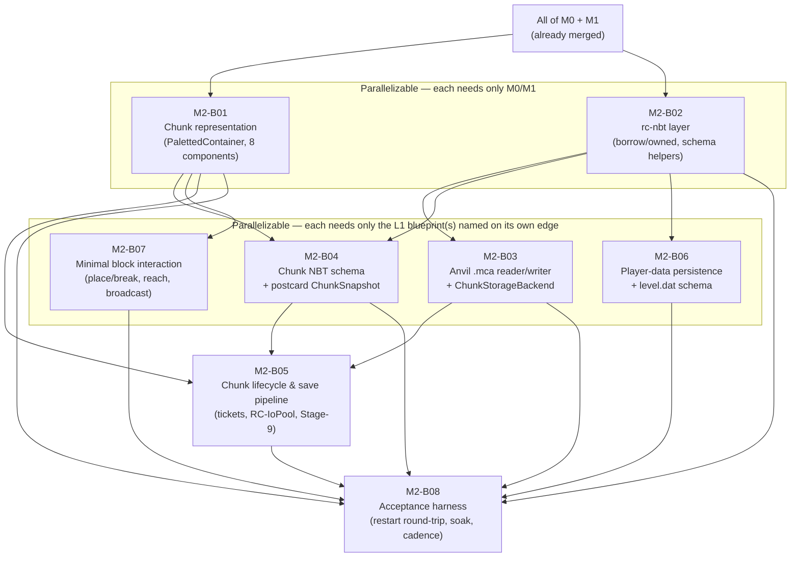

# M2-B00 — Milestone Index: Persistent World Storage

## Milestone summary

M2 replaces M1's throwaway, hand-built superflat placeholder with real, persisted chunk storage:
an in-memory `bevy_ecs` chunk representation (`03-world-chunks-persistence.md`'s WORLD-D1/D2),
hand-written NBT (de)serialization at the pinned DataVersion (4903), a hand-rolled Anvil `.mca`
region-file container, an async save/load pipeline off the tick thread (`RC-IoPool`, WORLD-D21),
a `ChunkKey`-level ticket/level system driving load/unload churn, player-data persistence, a
minimal creative-mode block place/break path proving the dirty-tracking hook end to end, and an
acceptance harness measuring all three roadmap criteria. No world generation (`04`, `M5`), no full
block mechanics (`05`, `M3`), and no light propagation (WORLD-D7/D9, a future mechanics blueprint)
exist anywhere in M2 — every blueprint below states this boundary explicitly and does not cross it.

Eight blueprints implement M2:

| ID | Title | Scope |
|---|---|---|
| M2-B01 | In-Memory Chunk Representation: PalettedContainer & Component Decomposition | L |
| M2-B02 | NBT Layer (`rc-nbt`) | L |
| M2-B03 | Anvil Region-File Reader/Writer (`rc-chunk-storage::anvil`) | L |
| M2-B04 | Chunk NBT Serialization & the Postcard Snapshot | L |
| M2-B05 | Chunk Lifecycle & Save Pipeline: Tickets, Async Load/Save, Stage-9 Snapshot | L |
| M2-B06 | Player Data Persistence (`players/data/`, minimal `level.dat` schema, join/disconnect wiring) | L |
| M2-B07 | Minimal Block Interaction: Place/Break, Reach Validation, Broadcast | L |
| M2-B08 | Acceptance Harness: Restart Round-Trip, 10,000-Chunk Soak, Save-Interval Cadence | L |

## Dependency graph

**Recommended execution order:**

1. **M2-B01** and **M2-B02** in parallel — both declare only already-merged M0 content as a
   prerequisite, and each explicitly states it is parallel-safe with the other (disjoint files
   inside `crates/chunk-storage/src/`, or a wholly separate crate).
2. **M2-B03** (needs M2-B02's `read_borrowed_strict`/`read_gzip_owned`/`write_gzip_owned` only —
   deliberately *not* M2-B01, since it operates on opaque `&[u8]` payloads), **M2-B04** (needs both
   M2-B01's components and M2-B02's schema layer), **M2-B06** (needs M2-B02 plus already-merged
   M1-B04/M1-B05 net types), and **M2-B07** (needs M2-B01's components plus already-merged
   M1-B01/M1-B04/M1-B05/M0-B02/M0-B03) — all four are mutually parallel once M2-B01/M2-B02 land.
3. **M2-B05** (needs M2-B01, M2-B03, and M2-B04 all landed — it is the blueprint that actually
   wires the Anvil backend and the NBT schema into a real async load/save pipeline).
4. **M2-B08** last (needs every other M2 blueprint landed — it is a pure consumer of their public
   surfaces, implementing no persistence logic of its own).

Note on derivation order vs. this graph: M2-B05 and M2-B08 were both derived before M2-B03/M2-B04
(and, for M2-B08, before M2-B05/M2-B06/M2-B07) existed as committed files, per this project's
per-milestone parallel-derivation practice — each restates the minimal contract it needs from its
not-yet-written prerequisite and flags every call site for reconciliation once the real blueprint
lands (mirroring `M1-B06`'s identical precedent for `rusty-clanker-server`'s not-yet-built CLI
surface). The audit findings below identify where those restated contracts diverge from what the
sibling blueprint actually shipped, beyond the "small, scoped adaptation" the derivation notes
themselves anticipate.

## Per-blueprint summary

**M2-B01 — In-Memory Chunk Representation: PalettedContainer & Component Decomposition.** Gives
`rc-chunk-storage` a generic, non-spanning bit-packed `PalettedContainer<T>` (byte-compatible with
M1-B05's hand-rolled wire encoder), the eight WORLD-D1 `bevy_ecs` components (`ChunkKeyTag`,
`BlockStateColumn`, `BiomeColumn`, `LightColumn`, `HeightmapSet`, `BlockEntityIndex`, `ChunkStatus`,
`ChunkPersistenceState`), and the dirty-tracking hook (`set`'s `bool` return + `mark_dirty`) a
future block-write system wires together. Defines its own local `BlockStateId(u32)`/`BiomeId(u16)`
newtypes rather than depending on `rc_protocol::generated_v776` directly — a hard dependency-graph
impossibility (`xtask lint-deps` Rule 2: `rc-mechanics` already depends on `rc-chunk-storage`, so a
further edge to `rc-protocol` would create a forbidden `SIM -> NETRENDER` path), not a preference.
No NBT, no Anvil I/O, no light propagation, no worldgen.
*Decisions covered:* WORLD-D1/D2 (full, both restated field-precise and cross-checked against
M1-B05's own encoder), WORLD-D3/D4 (registry-id integration, resolved via local newtypes),
WORLD-D5 (heightmap packing + `note_block_change`), WORLD-D6/D8 (storage-only contracts),
WORLD-D14 (world-height constants), WORLD-D22/D23 (`ChunkStatus`/`ChunkPersistenceState` storage
slots only).

**M2-B02 — NBT Layer (`rc-nbt`).** Turns `rc-nbt` from an empty shell into the engine's one
`simdnbt` 0.10.0 boundary for vanilla-schema data: `borrow`/`owned` read/write entry points
(`read_borrowed[_strict]`, `read_owned`, `read_gzip_owned`, `write_owned`, `write_gzip_owned`), an
`NbtError`/`SchemaError` taxonomy, and the hand-written (never-derived) `ToNbtCompound`/
`FromNbtCompound`/`NbtCompoundExt` schema-conversion layer every later M2 blueprint builds on. Ships
a non-member `crates/nbt/fuzz/` crate satisfying TEST-D26 item (2). No vanilla schema is
implemented here — pure infrastructure.
*Decisions covered:* WORLD-D11 (full — crate choice, borrow/owned split, hand-written conversion),
the GZip-convenience half of WORLD-D15, TEST-D25–D28/D39/D45–D47 (fuzz/property/test-first/
fixture-manifest obligations for this crate specifically).

**M2-B03 — Anvil Region-File Reader/Writer (`rc-chunk-storage::anvil`).** Implements WORLD-D12's
byte-exact `.mca` container (8 KiB header, crash-safe write-then-repoint sector allocation,
`.mcc` overflow), WORLD-D13's Zlib/LZ4/uncompressed compression, an open-handle LRU cache
(PERF-D29, 256 handles/60 s idle), a world-level `session.lock` single-writer guard, and
`AnvilDiskBackend`'s implementation of WORLD-D17's `ChunkStorageBackend` trait including
`level.dat`'s atomic-write-with-backup scheme. Resolves WORLD-D12's own text naming a separate
`rc-anvil` crate: everything lives inside `rc-chunk-storage::anvil` instead, since
`12-workspace-structure.md`'s actual Crate Manifest never scaffolded `rc-anvil`. Directly delivers
M2's roadmap acceptance criterion 2 (`anvil_soak_roundtrip.rs`, 10,000 round trips, zero checksum
mismatches, Tier 1).
*Decisions covered:* WORLD-D12/D13/D14/D15/D17 (full), WORLD-D21 (calling-convention restatement
only — RC-IoPool itself is M2-B05's job), PERF-D28/D29 (batched writes, LRU cache), TEST-D26
item (3) (Anvil round-trip fuzz targets).

**M2-B04 — Chunk NBT Serialization & the Postcard Snapshot.** Gives `rc-chunk-storage` two
independent capabilities built on M2-B01/M2-B02: `chunk_nbt` (`ChunkNbtCodec::to_nbt`/`from_nbt`,
hand-written per WORLD-D11, requiring caller-supplied `BlockStateNames`/`BiomeNames` registry
resolvers since this crate cannot depend on `rc-protocol`'s generated tables) and `snapshot`
(WORLD-D20's versioned `postcard` `ChunkSnapshot`, a flat scalar-only struct for fast in-memory
hand-off, unrelated to and not used for NBT). Documents, precisely, an on-disk paletted-container
encoding rule that differs from M2-B01's in-memory/wire `PalettedContainer` rule (no palette-less
`Direct` state on disk — the encoder always re-derives the on-disk palette fresh via `iter()`), and
a five-field fixed-default policy plus opaque unknown-tag preservation for every real vanilla
chunk field this milestone's components cannot yet represent.
*Decisions covered:* WORLD-D2 (on-disk encoding variant), WORLD-D3/D4 (resolver-trait seam),
WORLD-D5/D6/D8/D11/D16/D20/D22/D23 (chunk NBT schema, heightmap reconstruction, light-section-Y
mapping, DataVersion policy, postcard snapshot format).

**M2-B05 — Chunk Lifecycle & Save Pipeline: Tickets, Async Load/Save, Stage-9 Snapshot.** Gives
`rc-scheduler` a region-agnostic `TicketManager` (WORLD-D24's ticket/level system resolved to a
closed-form Chebyshev-distance formula, `Player` tickets only) and gives `rc-chunk-storage`
`RC-IoPool` (WORLD-D21), an async load path (disk-probe → NBT-decode → superflat-fill-on-miss →
Stage-1 spawn), a Stage-9-registered snapshot system with a drift-free `Local<u64>` tick counter
(WORLD-D23), unload-with-force-save (WORLD-D25), and a flush-on-shutdown barrier — wired into
`rusty-clanker-server`'s `HardcodedWorld` tick loop. Directly delivers the mechanism M2's roadmap
acceptance criterion 3 (save-interval cadence) measures.
*Decisions covered:* WORLD-D21/D22/D23/D24/D25/D26 (full), WORLD-D16 (consumed via B04's real,
committed `ChunkNbtCodec`/`BlockStateNames`/`BiomeNames` resolver contract — this blueprint's own
`ChunkNbtResolvers`/`McRegistryResolvers` thread it through `IoPool`/`ChunkLifecycleManager`/the
composition root), ARCH-D9/D12 (Stage 1/9/10 sync-point integration).

**M2-B06 — Player Data Persistence.** Gives `rc-chunk-storage` a player-data schema
(position/rotation/motion/health/food/XP/inventory/selected-slot/dimension/game-mode/abilities) at
`<world root>/players/data/<uuid>.dat` behind a `PlayerDataStore` trait mirroring
`ChunkStorageBackend`'s shape, plus a minimal `LevelDat` schema for the fields M2 needs
(`DataVersion`/`LevelName`/`Time`/spawn/`Version`). Both use a patch-over-`base` unknown-field
preservation design (not M2-B02's closed-schema `ToNbtCompound`/`FromNbtCompound` traits) so every
real vanilla field this blueprint does not model survives a load-then-resave cycle unchanged. Gives
`rusty-clanker-server` a fully self-contained `PlayerSessionStore` (load-on-join, save-on-disconnect,
periodic sweep) with zero dependency on `HardcodedWorld`'s exact, still-settling shape. Corrects
WORLD-D14's `playerdata/` folder name to `players/data/` (DataVersion 4903 already postdates the
4772 `FileFixerUpper` rename), citing the research corpus directly. Explicitly supersedes M2-B08's
own earlier guess that player persistence would live in `rc_mechanics::player_persistence`.
*Decisions covered:* the M2 roadmap's "player data persistence... via `rc-nbt`" scope item,
WORLD-D14 (folder-name correction), WORLD-D15 (schema-ownership pattern at M2's minimal scope),
MECH-D30/D47/D60 (consumed, not redefined).

**M2-B07 — Minimal Block Interaction: Place/Break, Reach Validation, Broadcast.** Gives
`HardcodedWorld`'s one region nine real `rc-chunk-storage` chunk entities (the first blueprint to
spawn any), the serverbound `Player Action`/`Use Item On` packets (creative-instant-break only, a
single fixed `STONE` placement, no `ItemStack`/inventory model), MECH-D62's pinned reach constants
(4.5 survival/5.0 creative, straight-line distance check only — no `rc-physics` raycast), the
MECH-D63 `sequence`-acknowledgment contract, a manual Stage-3-equivalent drain step (since
`rc-scheduler`'s `DomainGroup` enum accepts no real Stage-3 registration yet), a blanket
broadcast-to-every-connected-player resolution for the "no per-player interest set exists" gap, and
a real (if currently unreachable in production) cross-region `BorderUpdateEvent` routing path via
`apply_block_action`'s `resolve_owner` seam. Exercises M2-B01's `BlockStateId` registry-bridging
seam for the first time. Explicitly does not implement on-disk persistence of its own mutations —
only the in-memory, dirty-marked state a save pipeline reads.
*Decisions covered:* MECH-D4 (Stage-3 placement, manual-drain resolution), MECH-D61 (creative
instant break), MECH-D62 (reach, pinned values), MECH-D63 (sequence ack — this blueprint's own
client-allocates/server-echoes design is a flagged, cited correction of `05`'s own literal text,
mirroring M2-B06's WORLD-D14 correction pattern), WORLD-D22/D23 (dirty-tracking hook exercised end
to end), ARCH-D11/D25/D30 (`BorderUpdateEvent` routing exercised end to end), NET-D3 (four new
packets).

**M2-B08 — Acceptance Harness: Restart Round-Trip, 10,000-Chunk Soak, Save-Interval Cadence.**
Extends `rc-test-harness` (`chunk_soak.rs`'s deterministic, palette-shape-cycling PRNG corpus plus
a corrupting-backend self-test fixture; `save_cadence.rs`'s save-event-log parser/analyzer),
`rc-paritybot` (`restart_persistence.rs`, a real azalea bot driving a 5-action place/break script —
inventory editing is an explicit, documented M2-scope gap, since no M2 blueprint implements
`Set Creative Mode Slot` — against two sequential server subprocesses sharing one `--world-dir`), and
`xtask` (`m2-report`, mapping four sub-cases onto AC1 plus one onto AC3) — mirroring M1-B06's
architecture exactly. Adds `--world-dir`/`--save-interval-ticks`/`--save-event-log` to
`rusty-clanker-server`'s CLI contract. Its own Tier-1 Done state needs no real server subprocess;
the real end-to-end measurement is a nightly/manual-gated job, identical framing to M1-B06.
*Decisions covered:* M2's roadmap Acceptance Criteria 1–3 (mapped onto report cases), TEST-D7/D10/
D26 item (3)/D37/D40/D45/D46, WORLD-D16/D23.

## M2 acceptance criteria → blueprint mapping

| # | Acceptance criterion (`11-roadmap-milestones.md`) | Blueprint(s) | Status |
|---|---|---|---|
| 1 | A player places and breaks blocks, logs off, the server process restarts cleanly, the player rejoins: every block change and inventory item is present and byte-identical in block/item state to what was there before restart. | M2-B03 (on-disk Anvil I/O) + M2-B04 (chunk NBT schema) + M2-B05 (save pipeline, dirty-tracking wiring) + M2-B06 (player-data persistence) + M2-B07 (in-memory block mutation) + M2-B08 (`restart_persistence` scenario, AC1a–AC1d report cases) | **Achievable as scripted, with the inventory half of the criterion an explicit, documented M2-scope gap.** M2-B08's 5-action script places only `minecraft:stone` (M2-B07's real, single-fixed-block behavior) and performs no inventory edit — no M2 blueprint implements serverbound `Set Creative Mode Slot`, so inventory persistence is deferred to `M3`/`M4`'s real `ItemStack` model (MECH-D47), not scripted as a false assertion against non-existent functionality. The block-state and player position/health halves of the criterion (both the on-disk and live-protocol legs) are fully covered by M2-B08's own AC1a–AC1d report cases, soundly backed by B03/B04/B05/B06's own unit/integration tests. |
| 2 | An automated soak test performs 10,000 synthetic chunk write/read round trips with zero checksum mismatches. | M2-B03 (`anvil_soak_roundtrip.rs`, Tier 1, hand-built NBT-shaped payloads) + M2-B08 (`chunk_soak_10000.rs`, Tier 1, independently-generated PRNG/palette-shape-cycling payloads) | Covered twice, independently, both at Tier 1 — redundant but not contradictory; either alone already satisfies the criterion's literal text. |
| 3 | The configured save interval is measured, over a 30-minute run, to fire within ±1 tick of its configured cadence. | M2-B05 (`save_cadence.rs`'s own `soak-tests`-gated 30-minute real-time test, Tier 2 nightly) + M2-B08 (`m2-report --mode full`'s independent 30-minute measurement via `--save-event-log`, manual/on-demand) | Covered twice, independently, by two different measurement mechanisms (an in-process `Local<u64>` counter vs. an external CLI-driven event log) — redundant but not contradictory. |

## Cross-blueprint audit findings — resolution status

M2's first coverage/consistency audit found six findings; all six are resolved as of the current
state of every blueprint listed below (each blueprint's own Context/Deliverables/Acceptance-tests
sections carry the real, corrected content directly — this section only tracks status, it does not
restate what each blueprint itself already says):

1. **Resolved.** M2-B05's Context now restates M2-B04's real, committed `ChunkNbtCodec`/
   `ChunkNbtDocument`/`BlockStateNames`/`BiomeNames`/`ChunkNbtError` API exactly (no more assumed
   parameterless `ChunkSnapshot::to_nbt`/`from_nbt`). M2-B05 threads a `ChunkNbtResolvers` (bundling
   the two resolver traits plus `PaletteThresholds` for blocks/biomes) through `IoPool::submit_load`/
   `submit_save` and a new `ChunkLifecycleManager` field; `rusty-clanker-server`'s own
   `McRegistryResolvers` (a new `play/registry_resolvers.rs`, M2-B05's own Deliverable) is the
   concrete, composition-root-owned implementation, covering exactly the property-less default
   states M2's own real content ever produces. M2-B05's own Stage-9 capture vehicle is a distinct,
   locally-owned type, `ChunkSaveSnapshot` (`lifecycle.rs`), never colliding with M2-B04's real,
   unrelated, postcard-only `ChunkSnapshot`.
2. **Resolved.** M2-B08's Prerequisites paragraph and its "Minimal place/break protocol path"
   Context subsection now correctly attribute the save-interval/Stage-9 pipeline to M2-B05 and the
   minimal place/break protocol path to M2-B07.
3. **Resolved.** M2-B08's restart-round-trip script (Context's "Defined block pattern" table) now
   scripts only what M2-B07 actually implements — five actions, every placement `minecraft:stone`
   (M2-B07's real, single-fixed-block behavior), zero inventory edits. Inventory persistence is an
   explicit, documented M2-scope gap (no M2 blueprint implements `Set Creative Mode Slot`), deferred
   to `M3`/`M4`'s real `ItemStack` model (MECH-D47) — M2-B08's AC1 report cases (`AC1a`–`AC1d`) assert
   only block state and player position/health, never inventory content.
4. **Resolved.** M2-B07's `block_action.rs` now imports `rc_chunk_storage::{BlockStateId, BiomeId,
   RegistryId}` (the crate-root re-export), matching every other M2-B07 import from
   `rc-chunk-storage`.
5. **Resolved.** M2-B05's `io_pool.rs`/`lifecycle.rs`/`world.rs` now import from the crate root
   (`crate::{ChunkStorageBackend, RegionFileKind, StorageError, ...}` inside `rc-chunk-storage`
   itself; `rc_chunk_storage::{AnvilDiskBackend, ChunkStorageBackend, CompressionScheme, ...}` from
   `rusty-clanker-server`), matching M2-B03/M2-B04's real, flat re-export shape; `ChunkNbtError` is
   sourced from the real `chunk_nbt` module's crate-root re-export, not `snapshot`.
6. **Resolved.** M2-B07's Context now explicitly flags its client-allocates/server-echoes
   `sequence` design as a deliberate, cited correction of `05-game-mechanics.md`'s MECH-D63 wording
   (mirroring M2-B06's own WORLD-D14 folder-name correction pattern) rather than a silent
   divergence.
