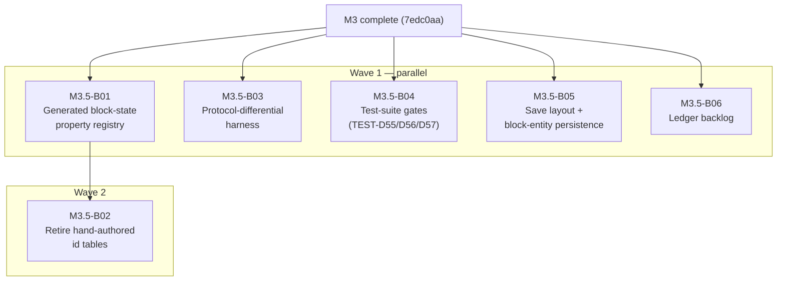

# M3.5-B00 — Milestone Index: Verification Hardening (PLAN-D9)

## Milestone summary

M3.5 is the short hardening milestone PLAN-D9 places between M3 and M4. It
removes, structurally, the defect classes M3's real-client field tests proved
the automated suite could not see: hand-maintained block-state id tables that
drifted from the real registry (WS-D15), server behavior that was never driven
through the real client packet path (TEST-D54), test suites that skipped the
exact blind spots every field bug lived in (TEST-D55/D56/D57), and two
persistence deviations M2/M3 shipped knowingly (WORLD-D14 save layout,
WORLD-D6 block-entity persistence). It also drains the findings-ledger backlog
that accumulated during M3's field-report waves. No new gameplay mechanics
belong here — anything that widens the vanilla surface is M4.

Six blueprints implement M3.5:

| ID | Title | Scope |
|---|---|---|
| M3.5-B01 | Generated Block-State Property Registry (codegen, table, manifest, lint) | L |
| M3.5-B02 | Retire Every Hand-Authored State-Id Table Against the Generated Registry | L |
| M3.5-B03 | Protocol-Differential Harness Against the Vanilla Oracle (`xtask protocol-diff`) | L |
| M3.5-B04 | Test-Suite Gates: Case-Matrix Lint, Spec-Cited Expectations, Reference-Verification Gate | M |
| M3.5-B05 | Save Layout Correction and Block-Entity Persistence | L |
| M3.5-B06 | Findings-Ledger Backlog: Broadcast Scaling, Hopper Re-evaluation, Harness Drains, Corpus Prose | M |

## Dependency graph

B02 is the only blueprint with an intra-milestone prerequisite: it consumes
B01's generated API. B03–B06 touch disjoint files and can run as one
parallel wave; B02 runs once B01 has merged.

## Acceptance criteria (this milestone's own; PLAN-D9 lists them as M4's entry gate)

1. **Registry**: `rc-registries` ships a generated block-state property table
   (id range, per-state properties, default id per block) with a manifest;
   `lint-tests` rejects any new literal block-state id outside the generated
   crate; every M3 placeholder table (redstone component constants, physics
   shape rows, dispatch ranges, oriented placement table, replay ranges) is
   gone; `parity-check redstone` 52/52 and `placement-diff` 85/85 unchanged.
2. **Protocol differential**: `xtask protocol-diff` drives one scripted bot
   session (join, move, sneak, dig with timing, place every tier-1 kind,
   break, disconnect, rejoin) and the redstone corpus over the wire against
   both the pinned oracle and `rusty-clanker-server`, diffs the normalized
   clientbound streams per packet type at byte level, and its first scheduled
   CI run is green over the M1–M3 packet surface.
3. **Gates**: `lint-tests` enforces the TEST-D55 case-matrix header (or
   waiver) on every mechanic test file, including the retroactively annotated
   M3 files; a spec-citation check covers state-id expectations (TEST-D56);
   the TEST-D57 claims-list convention exists as a checked artifact and the
   M4 blueprints carry a CONFIRMED/WRONG/UNVERIFIABLE list before any M4
   implementation begins.
4. **Persistence**: worlds save under `<world>/dimensions/<namespace>/<path>/`;
   chests, furnaces and hoppers (contents included) survive a clean server
   restart, verified by an `m2-report`-style restart round-trip case.
5. **Backlog**: multi-change ticks broadcast via `SectionBlocksUpdate` with
   per-viewer view-distance filtering; hopper `ENABLED` re-evaluated on
   neighbor change; the remaining `xtask` piped-child drains are concurrent;
   the corpus prose batch is applied and re-hashed. Tier-1 CI green on the
   final commit.

## Coverage audit

| Planning item | Blueprint |
|---|---|
| WS-D15 generated property registry | B01, B02 |
| TEST-D54 protocol-differential harness | B03 |
| TEST-D55 adversarial case matrix + lint | B04 |
| TEST-D56 spec-derived expectations | B04 |
| TEST-D57 reference-verification gate | B04 |
| WORLD-D14 save folder layout | B05 |
| WORLD-D6 block-entity records/codec | B05 |
| PLAN-D9 (d) block-event re-entrancy fix | already landed in M3 (`block_event.rs`, single-buffered re-entrant drain) — no blueprint |
| Findings ledger: broadcast scaling, hopper re-eval, xtask drains, corpus prose, replay range unification | B06 (replay ranges: B02) |

## Execution rules restated

- Test-first per blueprint (TEST-D45/D46): tests + stubs in a `test-authoring`
  changeset, code in an `implementation` changeset that never touches tests,
  fixtures, verification tooling or budget tables; harness/tooling work is
  `governance`.
- CI is the authority (TEST-D50); local results are advisory.
- Every vanilla-behavior claim a blueprint states was verified against the
  pinned reference by the research role before implementation (TEST-D57 —
  applied to M3.5's own blueprints as the first real use of the gate).
- Hard gate: when the five criteria above are green, STOP; M4 starts only on
  the owner's explicit go.
