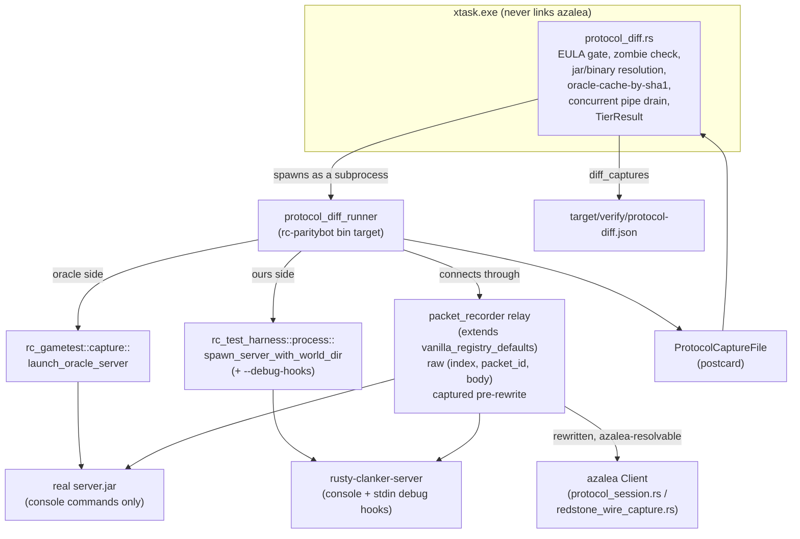

# M3.5-B03 — Protocol-Differential Harness Against the Vanilla Oracle

## 1. Header block

| Field | Content |
|---|---|
| ID | `M3.5-B03` |
| Milestone | `M3.5 — Verification Hardening (PLAN-D9)` |
| Prerequisites | — (Wave 1, parallel with M3.5-B01/B04/B05/B06; all run against M3-complete `main`) |
| Implements | TEST-D54 (own primary target); restates and reuses TEST-D7, TEST-D8, TEST-D9's "never a substitute" boundary, TEST-D40, TEST-D41, TEST-D46, TEST-D50, NET-D1 |
| Crates touched | `crates/testing/gametest` (new module), `crates/testing/paritybot` (new modules + bin target), `crates/testing/test-harness` (additive), `xtask` (new verb), `crates/server` (additive, gated), `.github/workflows/ci.yml` |
| Estimated scope | L |

## 2. Goal & Done definition

Build `xtask protocol-diff`: a scripted azalea bot session and a redstone-corpus-over-the-wire pass, driven identically against the hash-pinned vanilla oracle and against `rusty-clanker-server`, that captures every raw clientbound packet `(index, packet_id, body)` on both sides, normalizes known-non-deterministic fields, and diffs the two streams **at the byte level per packet type** — the harness TEST-D54 requires and M1–M3's own escaped-defect history (wrong packet ids, missing fields, doubled effects — every one invisible to this project's other test layers because encoder and decoder shared the same wrong assumption) shows this project has never had until now.

Done when:
- [ ] `crates/testing/gametest/src/protocol_capture.rs` exists: the capture format, the normalization table (data-driven, keyed by resolved packet name), the cross-packet chunk-batch reordering pass, and the multiset/presence-set diff algorithm, with its own hermetic self-tests green.
- [ ] `crates/testing/paritybot` gains the live capture relay, the scripted-session driver, and the redstone-corpus-over-the-wire driver, plus `bin/protocol_diff_runner.rs`.
- [ ] `xtask protocol-diff [--version 26.2] [--server-jar <path>] --server-bin <path> [--only <step>] [--side oracle|ours|both] [--accept-eula] [--debug-hooks]` runs end-to-end on a clean checkout on Windows and Linux, writing `target/verify/protocol-diff.json` in `TierResult` shape (TEST-D40), non-zero exit on any mismatch.
- [ ] `rusty-clanker-server` gains an explicit, off-by-default `--debug-hooks` flag with its own acceptance tests proving the hooks are inert without it.
- [ ] `.github/workflows/ci.yml` gains a scheduled `protocol-diff` job beside `m3-acceptance`, never Tier 1.
- [ ] Acceptance tests (own test-authoring changeset, TEST-D45) are committed and reviewed before any implementation changeset; the implementation changeset touches nothing under this blueprint's own protected paths (Constraints §7).
- [ ] Green CI tier: the `gates`/`guardrails` Tier-1 jobs (this blueprint's own new source compiles, lints, and its hermetic self-tests pass there) plus a real, green run of the new scheduled `protocol-diff` job (TEST-D50 — CI is the sole authority; a local run is advisory only).

## 3. Context (self-contained)

### 3.1 The decision this blueprint implements — TEST-D54, restated in full

> **Protocol-differential harness against the vanilla oracle.** A scripted bot session (join, move, sneak, dig with timing, place, disconnect/rejoin) is driven identically against the hash-pinned oracle server (TEST-D41's consent machinery, M3-B07's launch path) and against `rusty-clanker-server`; both clientbound packet streams are captured, normalized (entity/teleport ids, timestamps, keep-alive ids, chunk-send order within a batch), and diffed at the **byte level per packet type**. Any unmatched packet type, differing field bytes, or presence-set mismatch (a packet one server sends and the other omits — including self-exclusion differences) fails. Runs as its own scheduled CI tier next to `m*-acceptance`; every milestone from M4 on extends the script to cover its new serverbound surface before implementation of that surface begins.

Rationale (restated verbatim): M1–M3's dominant escaped-defect class was wire-shape divergence invisible to our own tests because encoder and decoder shared the mistake (missing `level_event` bool, wrong `UseItemOn` id, NBT-vs-JSON disconnect reason, doubled self-effects). Diffing against the real server's bytes is the only oracle that cannot share our assumptions; every one of those four field bugs would have been a first-run diff.

Every clause of TEST-D54 maps onto a concrete deliverable below:

| Clause | Where this blueprint answers it |
|---|---|
| Scripted session content (join, move, sneak, dig with timing, place, disconnect/rejoin) | §3.5 step list, `protocol_session.rs` |
| Both sides, identical script | §3.6 subprocess architecture (`protocol_diff_runner.rs`), mirrors `placement_diff_runner.rs` exactly |
| Capture | §3.7 capture relay, `protocol_capture.rs` format |
| Normalization list | §3.8 normalization table |
| Byte-level per-packet-type diff | §3.9 diff algorithm |
| Presence-set mismatch fails | §3.9, `missing_in_oracle`/`missing_in_ours` |
| Own scheduled CI tier | §3.10, §6 step 9 |
| Extension rule for later milestones | §7 constraint (h) |

This blueprint additionally covers M3.5-B00's own acceptance criterion 2 clause "and the redstone corpus over the wire against both the pinned oracle and `rusty-clanker-server`" — TEST-D54's text names the scripted session explicitly; the redstone-corpus-over-the-wire pass is this blueprint's own extension of the identical byte-level methodology to the existing 51-contraption corpus (`crates/testing/gametest/corpus/redstone/`), driven by real placements instead of console `/setblock`, per M3.5-B00's own acceptance text.

### 3.2 TEST-D41 — oracle consent, restated

`xtask setup-oracle` is the one-command oracle bootstrap: downloads the pinned vanilla `server.jar` via NET-D9's Mojang `piston-meta` mechanism, runs `--reports`, lays out the differential-test environment. The jar and every generated output are cached outside the repository, git-ignored, never committed. The **only** one-time interactive step across the whole verification loop is a single legal-consent prompt (EULA acceptance plus first-run download approval) — every subsequent invocation runs fully unattended. This blueprint's verb reuses this exact gate (`xtask::corpus::fetch_corpus::eula_gate`, already shared by `placement-diff`), never a second, independently-drifting consent primitive: `crate::corpus::fetch_corpus::eula_gate(&repo_root, args.accept_eula)` checks `setup_oracle::consent_already_given` first, else requires `--accept-eula` or `RC_ORACLE_EULA_ACCEPTED=1`, then records consent via `setup_oracle::record_consent`.

### 3.3 TEST-D7/D8 — differential harness architecture and bot driver, restated

`rc-test-harness` launches an unmodified, legally-downloaded vanilla `server.jar` as an OS subprocess, launches a Rusty Clanker server instance as a second subprocess, drives both through an identical scripted action sequence via a bot connection, and captures each side's raw clientbound packet stream. The bot driver is **azalea** (`azalea`/`azalea-client`/`azalea-protocol`, tracking git `main`, matching NET-D1's protocol target), consumed **exclusively as a workspace dev-dependency of `rc-paritybot`/`rc-loadtest`**, never a dependency of any shipped runtime crate — mechanically enforced by `cargo-deny`'s `bans` config. `xtask` itself must never link `azalea`; every azalea-touching function this blueprint adds lives in `rc-paritybot`, reached from `xtask` only across a subprocess boundary (`bin/protocol_diff_runner.rs`), exactly the same "forced deviation" precedent `placement_diff_runner.rs`, `fetch_corpus_runner`, and `load_scenario_runner` already establish.

TEST-D9 (byte-vs-semantic scope note): TEST-D9 defines the *older*, still-standing differential methodology (`fetch-corpus`/`parity-check redstone`) as semantic comparison via `rc-protocol`'s own decode path. TEST-D54 is a **separate, additional** verification layer with a deliberately stricter contract (byte-level, per packet type) — this blueprint's harness never replaces or weakens TEST-D9's own comparator; it is a new, independent tier alongside it.

### 3.4 NET-D1 — pinned target, restated

Parity target: **Java Edition 26.2** ("Chaos Cubed"), released 2026-06-16, **protocol version 776** (decimal). Single pinned version, never a multi-version compatibility layer. Every packet this harness captures is protocol 776's own wire shape; this blueprint asserts no other version's behavior.

### 3.5 The existing instruments this blueprint builds on

**`xtask/src/corpus/placement_diff.rs`** (623 lines) is the closest precedent and this blueprint's primary architectural template: `PlacementDiffArgs { version, server_jar, server_bin, only, side: Side::{Oracle,Ours,Both}, accept_eula }`; `run()` does, in order: EULA gate (only if `side` wants the oracle) → zombie-oracle-port check (`Get-NetTCPConnection`/`Stop-Process` via PowerShell, best-effort query, loud failure if a genuine kill attempt leaves the port still bound) → resolve jar (explicit `--server-jar` or `fetch_data::fetch_server_jar`, sha1-hashed) → check an on-disk oracle-capture cache keyed by that sha1 (skipped whenever `--only` narrows the run) → spawn `placement_diff_runner` as a subprocess with `current_dir` set to `crates/testing/paritybot` (every path handed to it first passes through `absolutize(repo_root, path)`, since a relative path would otherwise resolve against the wrong cwd once it crosses the subprocess boundary) → drain the subprocess's stdout/stderr **concurrently on their own threads while polling `try_wait`** (never read-after-exit, which is the exact M3 field-report pipe-buffer-deadlock lesson `m3_report.rs::run_load_scenario_subprocess`'s own doc comment documents in full: a child whose combined stdout+stderr exceeds the OS pipe buffer blocks forever if nothing drains it until the process is already observed to have exited) → read back the written capture file(s) → diff → print + write `TierResult` → best-effort kill any leftover `rusty-clanker-server.exe` process on the way out. `xtask/src/corpus/blocks_report.rs`'s `BlocksIndex` decodes a raw block-state id into a human-readable `minecraft:<block>[prop=value,...]` string from the local `blocks.json` reference (`C:\Users\krank\mc-research\26.2\datagen\generated\reports\blocks.json`, ASSET-D18(f)) for report readability only — never load-bearing, degrades to a bare numeric id when the reference is absent.

**`crates/testing/gametest/src/placement_trace.rs`** is the pure (no I/O, no azalea) capture-format-plus-diff pattern this blueprint's own `protocol_capture.rs` follows structurally: a `CAPTURE_FORMAT_VERSION` constant, a postcard-serialized capture file (`write_capture`/`read_capture`), and a `diff_*` function comparing two capture files structurally (matched by a stable key, never by list position) producing a report with `mismatches`/`missing_in_oracle`/`missing_in_ours` — a scenario/cell missing on one side is its own reported case, never silently dropped.

**`crates/testing/gametest/src/capture.rs`** is the azalea-free half of oracle orchestration this blueprint reuses unmodified: `resolve_java_binary()` (tries `$JAVA_HOME`, the pinned Adoptium install, then `PATH`, failing loudly rather than trusting shell `PATH` resolution blindly); `launch_oracle_server(jar_path, work_dir, port, startup_timeout)` writes `eula.txt`/`server.properties` (`online-mode=false`, `level-type=flat`, `gamemode=creative`, `difficulty=peaceful`), spawns `java -jar <jar> nogui` with piped stdin, polls a TCP connect **and** `read_server_log` for the literal string `]: Done (` before returning ready (a bare TCP accept happens before the console command dispatcher is fully live — a command written into that window is silently swallowed); `send_console_command` writes one line + `\n` to the child's piped stdin; `verify_setup_commands_accepted` polls `<work_dir>/logs/latest.log` for a known positive acknowledgement string per command (never for a negative-rejection string, whose wording varies by failure kind).

**`crates/testing/test-harness/src/process.rs`** owns `rusty-clanker-server`'s own subprocess orchestration: `ManagedServerConfig { binary_path, offline, startup_timeout, extra_args, world_dir, save_interval_ticks, save_event_log, tick_log, region_lifecycle, capture_stdout }`, `spawn_server`/`spawn_server_with_world_dir` (assembles `--bind <addr> [--offline] [--world-dir <path>] ...` from the config, polls a TCP connect for readiness), `ManagedServer { addr, .. }` with guaranteed-teardown `Drop` (hard `Child::kill`) and an additive `graceful_shutdown(timeout)` that writes a single `shutdown\n` line to the child's piped stdin (`main.rs`'s own stdin-line protocol, §3.6) and polls for clean exit before falling back to the hard kill.

**`crates/testing/paritybot/src/packet_capture.rs`** established the "poll azalea's own live world model, never hand-parse packets for state" lesson (a prior version hand-matched `BlockUpdate`/`SectionBlocksUpdate` and missed every position whose *first* delivery was baked into the initial `LevelChunkWithLight` full-chunk snapshot — every capture timed out on its first observed position as a result) for **derived state**. This blueprint's own raw byte capture (§3.7) is deliberately a *different* mechanism operating one layer lower, for the opposite reason: TEST-D54 needs the literal wire bytes, which azalea's own typed decode would already have thrown away (and which azalea may not even have a decoder for, for every packet in the M1–M3 surface).

**`crates/testing/paritybot/src/vanilla_registry_defaults.rs`** is the mechanism this blueprint's own capture relay extends. It is a small, purpose-built man-in-the-middle TCP relay azalea's bot connects **through** rather than directly to the real server (both sides — oracle and ours both currently send `minecraft:dimension_type` registry entries with `has_data=false`, which is correct 1.20.5+ wire behavior but which azalea's own `RegistryHolder` cannot resolve, since it ships no compiled-in vanilla-default registry data the way a real client does; without this relay azalea's own login handler never reaches `Event::Spawn` against **either** side). Its `pump_and_rewrite` function already does exactly the frame-level work this blueprint's capture needs: it reads raw bytes off the upstream (real server) socket, calls `rc_protocol::try_decode_frame(&mut accumulator, compression)` to produce one fully-buffered `(packet_id: VarInt, body: Bytes)` payload at a time (tracking `CompressionState`/login-vs-configuration-vs-play `Phase` purely by observing the same stream, via `SetCompression`/`LoginSuccess`/`FinishConfiguration`'s own well-known packet-ID constants already exposed by `rc_protocol`), optionally rewrites exactly one registry entry's payload, then re-encodes and forwards to the client (azalea) side unchanged otherwise. Client→server bytes are never inspected (a plain `tokio::io::copy`).

Critically, **offline mode skips wire encryption entirely** in real vanilla: per this project's own protocol research (`docs/research/mc-26.2/02-network-protocol.md` §3.4/§3.7), `handleHello` only sends `ClientboundHelloPacket`/enters the AES/CFB8 key-exchange state when the server authenticates online *and* the connection isn't a memory connection; with `online-mode=false` (this harness's own `server.properties`, both sides) the server instead builds an offline profile and proceeds straight past the encryption branch. This is exactly why `pump_and_rewrite` never implements decryption and why this blueprint's own capture relay can read plaintext frames directly — offline mode, on both sides, is a hard precondition for this whole harness, not an incidental convenience.

**`crates/testing/paritybot/src/corpus_capture.rs`** is the existing redstone-corpus orchestration this blueprint's own redstone-over-the-wire pass (§3.6) borrows structural pieces from: `world_origin_for(index)` (stable per-contraption world slot, keyed by the contraption's real position in the *full* corpus list, never a possibly-narrowed slice position), `bounding_box(spec)`, a tick-freeze/`tick step 1`/barrier-marker-cell protocol (oracle console only) that makes "did my last `/setblock` actually apply before I observe" a confirmed poll rather than a fire-and-forget assumption, and a padded-bounds cleanup `fill ... air` between contraptions so no residue from one contraption can dirty the next one's slot.

**`crates/testing/gametest/src/spec.rs`** is the committed corpus schema, unchanged by this blueprint: `ContraptionSpec { id, category, description, quirk, max_ticks, blocks: Vec<PlacedBlock>, actions: Vec<ScriptedAction> }`; `PlacedBlock { pos, vanilla_state: String, state_id: u32, has_analog_state: bool }`; `ScriptedAction { tick, pos, vanilla_state, state_id }` (a mid-run state poke applied before the named tick's own pass). 51 `.ron` files currently live under `crates/testing/gametest/corpus/redstone/`, loaded via `rc_gametest::spec::load_spec(path)`; `xtask::corpus::parity_check::sorted_ron_paths(dir)` returns them in stable sorted order — this blueprint reuses both functions unchanged.

**`crates/server/src/play/world.rs`** already exposes three test/diagnostic-only async methods on `World`, each following the identical shape (an mpsc send into the tick loop's own per-tick drain, paired with a oneshot ack the caller awaits so the mutation is confirmed landed before returning — not fire-and-forget): `debug_query_block(pos) -> Option<DebugBlockInfo>`, `debug_set_held_item(network_entity_id, item)`, `debug_set_survival(network_entity_id, survival: bool)` (sets `GameModeState.instabuild = false` when `survival == true`). These are called **only in-process today** (existing `crates/server/tests/*.rs` integration tests construct a `World` directly and call them — never through the wire). This blueprint is the first consumer that needs them reachable from an external subprocess with no in-process access, which is exactly why a new, explicitly gated exposure path is needed (§3.6, §4.6) rather than adding a fourth in-process-only method.

**`crates/server/src/main.rs`** already runs a stdin-line reader task (`tokio::spawn`, `BufReader::lines()`) recognizing exactly one line, `shutdown` (triggers `World::shutdown()`'s flush-on-shutdown barrier then a clean process exit); any other line is presently `Ok(Some(_)) => continue` — silently ignored. This is the exact, already-existing extension point this blueprint's `--debug-hooks` flag widens (§4.6), never a new communication channel.

### 3.6 Architecture this blueprint adds



Both sides run through **the same relay code path** — the relay's registry rewrite is required on both (§3.5), and the raw byte capture taps the stream **before** that rewrite is applied, so the captured bytes are always the literal, unmodified bytes the real process put on the wire, regardless of which side is being driven. The bot's own azalea-visible stream (downstream of the rewrite) is a separate, forwarding-only concern — the capture sink and the forwarded/rewritten stream are two independent outputs of the same frame-decode loop.

`protocol_diff_runner`'s `main` mirrors `placement_diff_runner`'s exactly: `oracle <jar_path> <work_dir> <out_capture_path> <source_jar_sha1> [--debug-hooks] [only_step]` / `ours <server_bin_path> <world_dir> <out_capture_path> [--debug-hooks] [only_step]`, one `tokio::task::LocalSet` wrapping the whole `!Send` azalea-driven flow, a line-based `RESULT=OK` / `RESULT=ERROR\nMESSAGE=<text>` stdout protocol (no `serde_json` dependency in `rc-paritybot`), exit code 0 iff `RESULT=OK`. `--debug-hooks` is passed to the `ours` side's `ManagedServerConfig` only — the oracle side never receives it; the oracle's equivalent hooks are real console commands (`/gamemode`, `/setblock`) sent via `send_console_command`, exactly as `corpus_capture.rs` already does.

### 3.7 Capture format and the relay

Frame decode (`rc_protocol::try_decode_frame`) already produces exactly `(packet_id: VarInt, body: Bytes)` post-length-prefix, post-decompression — this blueprint's capture unit is that same pair, plus a running index and a best-effort display name:

- `index: u32` — this packet's position in its own step's captured sequence (chronological, for human debugging only — never a diff key).
- `packet_id: i32` — the raw wire id. **Never normalized, never used only for display** — an id mismatch for what should be the same conceptual packet (M1–M3's own dominant defect class, §3.1) surfaces structurally as a presence-set mismatch (§3.9), which is the correct, load-bearing signal — this blueprint deliberately never hand-maintains a packet-name↔id table anywhere in `xtask`, since `xtask` cannot depend on azalea (§3.3) and any such table would itself be exactly the kind of hand-maintained, drift-prone mapping M3.5-B01 is independently retiring for block-state ids (WS-D15). Names are resolved only where azalea is already linked (`rc-paritybot`), best-effort, for the report only.
- `body: Vec<u8>` — everything after the packet-id VarInt, verbatim.
- `packet_name: Option<String>` — resolved in `rc-paritybot` (which links azalea) via whatever public decode-by-id entry point the pinned azalea revision exposes for its own `azalea_protocol::packets::game::ClientboundGamePacket` (the same dispatch azalea's own connection-reading loop already uses internally to route a raw id to a typed variant) — `None` on any resolution failure (an id azalea's own pinned revision doesn't recognize, or no such public entry point existing at all). Never load-bearing: a `None` name simply means that packet's body is compared unmasked (§3.8's own explicit default), which is the *safe* direction to fail in.

### 3.8 Normalization — the explicit masking table

TEST-D54 names the categories generically ("entity/teleport ids, timestamps, keep-alive ids, chunk-send order within a batch"); this blueprint pins them to concrete packet names for the M1–M3 surface. **The governing rule, restated as code**: a packet name not listed here is compared **byte-for-byte, unmasked** — an unlisted differing packet type is a failure, never silently tolerated (TEST-D54's own explicit text). Adding a new masked field to this table is a governance changeset (TEST-D46), never something an implementation changeset may do on its own initiative.

| Packet name (resolved, §3.7) | Masked | Rationale |
|---|---|---|
| `KeepAlive` (clientbound) | entire body (single field: a server-chosen challenge value) | Not vanilla-specified as a fixed value; both this project's own encoder and real vanilla derive it from wall-clock time at send. |
| `Login` / join-game | the world-seed-hash field only | Both sides launch with an independently-generated (or independently-configured) world seed; the hash is a pure function of a value this harness never pins. |
| `PlayerPosition` (clientbound teleport) | the teleport-id field only | An opaque, server-local sequence counter the client only ever echoes back — carries no gameplay meaning. |
| `AddEntity`, `SetEntityData`/entity-metadata packets, the `MoveEntity*` family, `RemoveEntities` | the entity-id field(s) (and UUID, for `AddEntity`) | Independently allocated per server instance/session — never expected to coincide numerically between two separate processes. |
| `PlayerInfoUpdate` | the latency/ping field only | Real, non-deterministic measured network round-trip time. |
| `SetTime` | the `game_time: i64` field and every value in the per-clock `clockUpdates` map (26.2's `SetTime` carries `(gameTime, Map<Holder<WorldClock>, ClockNetworkState>)` -- there is no separate day-time field any more; the map's *keys* (which clocks exist) stay unmasked) | A real-time-driven tick counter this harness's own settle-wait timing does not pin to an exact tick across two independently scheduled processes. |
| Every other packet name, including `BlockUpdate`, `SectionBlocksUpdate`, `BlockEntityData`, `RegistryData`, `UpdateTags`, `SystemChat`, `Disconnect`, `PlayerInfoUpdate`'s own non-latency fields (player UUID/name/gamemode), `LoginSuccess` | **nothing** (compared byte-for-byte) | Registry-sync order and content are deterministic (`docs/research/mc-26.2/26-registry-sync-configuration.md` §3.2's fixed 29-registry order); the scripted session uses one fixed, identical bot username on both sides so an offline-mode UUID (a deterministic function of username) is expected to already coincide — masking it anyway is deliberately *not* done, since a real, wire-visible UUID mismatch here would itself be exactly the class of defect this harness exists to catch, not noise to hide. |

**Chunk-batch order (§3.1's "chunk-send order within a batch") is a cross-packet normalization pass, not a per-packet field mask**: within each maximal contiguous run of `LevelChunkWithLight`-named packets bounded by a `ChunkBatchStart`/`ChunkBatchFinished` pair (`docs/research/mc-26.2/03-world-chunks.md` §"`PlayerChunkSender`" — sends "nearest-to-player first," a deterministic-per-implementation but not cross-implementation-guaranteed order), the run is re-sorted by the chunk position encoded in the packet body before the multiset diff runs — never reordered across a batch boundary or past any other packet type.

**Masking is structural, never by byte offset** (TEST-D57 pass, `M3.5-B03-CLAIMS.md` row 1: only `KeepAlive` has a fixed-offset field; every other masked field sits behind variable-width `VarInt`s, nested structures — `Login`'s seed hash lives inside `CommonPlayerSpawnInfo` — or a conditional presence bit — `PlayerInfoUpdate`'s latency exists only when its `actions` bitmask says so). The normalizer therefore decodes each listed packet type with a typed decoder (the `rc-protocol` packet structs where they exist; a purpose-built minimal decoder in `protocol_capture.rs` for clientbound types this server never encodes itself), replaces the masked fields with canonical values (`0`/empty), and re-encodes; the diff compares the re-encoded bytes. A packet type the normalizer cannot decode is not silently passed through as opaque bytes — it fails the run with a `NormalizerGap` case naming the packet id, so unmodeled surface is loud. Which *fields* each row masks is a vanilla-behavior claim in TEST-D57's sense — resolved by the implementer against the ASSET-D18(f) reference **before** this blueprint's implementation changeset begins (§7 constraint (g), §8 claims list). This blueprint specifies *which* fields mask and *why*; exact byte offsets are TEST-D57's job, never asserted here without that verification pass.

### 3.9 Diff algorithm

Grouping and pass/fail are always keyed on the **raw `packet_id`** (never on the best-effort `packet_name` — §3.7). For one step's two `Vec<CapturedPacket>` (oracle vs. ours):

1. Apply the chunk-batch reordering pass (§3.8) to each side's own packet list independently.
2. Apply per-packet normalization (§3.8's table, keyed by `packet_name`; unresolved names pass through unmasked) to every packet's `body`, producing a normalized-body multiset per `packet_id` per side (a `BTreeMap<i32, BTreeMap<Vec<u8>, usize>>`).
3. For each `packet_id` present in either side's multiset: if present only on one side → a **presence-set mismatch** (`missing_in_oracle`/`missing_in_ours`, keyed by `packet_id`); if present on both but the normalized-body-to-count maps differ → a **mismatch**, reporting the normalized bodies with a net excess count on each side (never silently averaged or best-matched — a genuine count difference, e.g. two distinct chunk packets on one side against one on the other, is exactly a real signal, per TEST-D54's own "presence-set mismatch... fails" clause read down to the multiset level).
4. A step with zero mismatches and zero presence-set differences passes; any step failing fails the whole tier (matches `placement-diff`'s own `push_diff_cases` convention — one `TierResult` case per step id, `Status::Fail` on any mismatch).

### 3.10 CI tier placement

TEST-D54: "Runs as its own scheduled CI tier next to `m*-acceptance`; **never** part of Tier 1." This mirrors `m3-acceptance`'s own established job shape exactly (§6 step 9): `if: github.event_name == 'schedule' || github.event_name == 'workflow_dispatch'`, needs a real Java 25+ runtime (`actions/setup-java@v4`), needs `RC_ORACLE_EULA_ACCEPTED: "1"` in its job env (the same one-time-per-CI-environment consent `m3-acceptance` already grants itself), builds `rusty-clanker-server --release --no-default-features --features monolithic`, then runs the verb and uploads `target/verify/protocol-diff.json`.

## 4. Deliverables

### 4.1 `crates/testing/gametest/src/protocol_capture.rs` (new module; declared in `lib.rs`, re-exported)

```rust
pub const PROTOCOL_CAPTURE_FORMAT_VERSION: u32 = 1;

/// One raw clientbound packet, captured pre-any-typed-decode (§3.7).
pub struct CapturedPacket {
    pub index: u32,
    pub packet_id: i32,
    pub body: Vec<u8>,
    /// Best-effort, display-only — see §3.7. Never read by `diff_step`.
    pub packet_name: Option<String>,
}

/// One scripted-session step's or one redstone-corpus contraption's own captured
/// clientbound stream. `step_id` matches `SESSION_STEPS`/a contraption's own `spec.id`.
pub struct StepCapture {
    pub step_id: String,
    pub packets: Vec<CapturedPacket>,
}

pub struct ProtocolCaptureFile {
    pub format_version: u32,
    /// `"oracle:<jar sha1>"` or `"ours"` — mirrors `PlacementCaptureFile::source_label`.
    pub source_label: String,
    pub steps: Vec<StepCapture>,
}

pub fn write_capture(path: &Path, capture: &ProtocolCaptureFile) -> std::io::Result<()>;
pub fn read_capture(path: &Path) -> Result<ProtocolCaptureFile, CaptureReadError>;

/// One packet type's declarative normalization rule (§3.8).
pub struct FieldMask {
    /// Report-only label, e.g. `"teleport_id"`.
    pub field: &'static str,
    /// Byte range within `body` this field occupies — resolved against the ASSET-D18(f)
    /// reference per TEST-D57 (§3.8), never asserted by this blueprint.
    pub range: std::ops::Range<usize>,
}

pub struct PacketNormalizationRule {
    pub packet_name: &'static str,
    pub masks: &'static [FieldMask],
    /// `true` replaces the whole body with an empty sentinel (e.g. `KeepAlive`) —
    /// mutually exclusive with a non-empty `masks`.
    pub mask_whole_body: bool,
}

/// The static table backing §3.8 — implementer-populated per Implementation step 1.
pub const NORMALIZATION_RULES: &[PacketNormalizationRule];

/// Applies `NORMALIZATION_RULES` (matched by `packet.packet_name`; an unresolved or
/// unlisted name returns `body` unchanged — §3.8's explicit default).
pub fn normalize_body(packet: &CapturedPacket) -> Vec<u8>;

/// The §3.8 cross-packet chunk-batch reordering pass, applied in place.
pub fn normalize_chunk_batch_order(packets: &mut Vec<CapturedPacket>);

pub struct PacketTypeDiff {
    pub packet_id: i32,
    /// The first `Some` name any captured instance of this `packet_id` carried, on
    /// either side — report-only.
    pub packet_name: Option<String>,
    pub oracle_only_bodies: Vec<(Vec<u8>, usize)>, // (normalized body, excess count)
    pub ours_only_bodies: Vec<(Vec<u8>, usize)>,
}

pub struct ProtocolDiffReport {
    pub mismatches: Vec<PacketTypeDiff>,
    pub missing_in_oracle: Vec<i32>, // packet_id present only in ours
    pub missing_in_ours: Vec<i32>,   // packet_id present only in oracle
}

/// §3.9, for one step's two packet lists (chunk-batch reordering + normalization
/// already applied by the caller — kept as two separable steps for the acceptance
/// tests' own benefit, mirroring `diff_captures`'s pure-function shape).
pub fn diff_step(oracle: &[CapturedPacket], ours: &[CapturedPacket]) -> ProtocolDiffReport;

/// Runs `diff_step` per `step_id` present in either file (a step missing on one side
/// entirely is its own reported case, never silently skipped — mirrors
/// `PlacementDiffReport`'s own discipline).
pub fn diff_captures(
    oracle: &ProtocolCaptureFile,
    ours: &ProtocolCaptureFile,
) -> std::collections::BTreeMap<String, ProtocolDiffReport>;
```

### 4.2 `crates/testing/paritybot/src/packet_recorder.rs` (new module)

```rust
/// A shared sink one relay connection's own `pump_and_rewrite` records every
/// server->client frame's raw `(packet_id, body)` into, **before** any registry
/// rewrite is applied (§3.6) — cheap to clone, `Arc`-backed.
#[derive(Clone, Default)]
pub struct PacketRecorder(/* Arc<Mutex<Vec<(i32, Vec<u8>)>>> */);

impl PacketRecorder {
    pub fn new() -> Self;
    /// A snapshot of every packet recorded so far, in receipt order, each tagged with
    /// its own position — the raw material `protocol_session`/`redstone_wire_capture`
    /// slice into per-step `CapturedPacket`s once a step boundary is reached.
    pub fn snapshot(&self) -> Vec<(i32, Vec<u8>)>;
    /// Truncates the recording — called at each session-step boundary so every step's
    /// own `StepCapture` starts from an empty recorder rather than needing to slice a
    /// monotonically growing one.
    pub fn clear(&self);
}

/// As `vanilla_registry_defaults::spawn`, additionally recording every server->client
/// frame's raw bytes (pre-rewrite) into `recorder` when `Some`. `vanilla_registry_
/// defaults::spawn` itself becomes a thin wrapper calling this with `None` — zero
/// behavior change for every existing caller (`idle_stability`, `packet_capture`,
/// `corpus_capture`, `placement_capture`).
pub async fn spawn_with_recorder(
    upstream_host: String,
    upstream_port: u16,
    recorder: Option<PacketRecorder>,
) -> std::io::Result<rc_paritybot::vanilla_registry_defaults::RelayHandle>;
```

### 4.3 `crates/testing/paritybot/src/protocol_session.rs` (new module)

```rust
pub const SESSION_STEPS: &[&str] = &[
    "session/login",
    "session/configuration",
    "session/spawn",
    "session/move",
    "session/sneak",
    "session/dig_stone_survival",
    // one per BlockKind::ALL (12 kinds, reusing rc_gametest::placement_spec), e.g.:
    "session/place/stone", /* ... */ "session/place/hopper",
    "session/break/stone", /* ... */ "session/break/hopper",
    "session/disconnect_reconnect",
    "session/observe_chunk",
];

#[derive(Debug, thiserror::Error)]
pub enum ProtocolSessionError { /* mirrors PlacementCaptureError's shape */ }

/// Drives the full TEST-D54 scripted session against an already-listening
/// `host:port`, through `packet_recorder::spawn_with_recorder`, returning one
/// `ProtocolCaptureFile` with one `StepCapture` per `SESSION_STEPS` entry (or exactly
/// the one entry named by `only`, when `Some`). `debug_hooks` gates whether the
/// survival-mode step (`dig_stone_survival`) reaches game-mode via this project's own
/// `debug-gamemode` stdin hook (`ours`, §4.6) or via a real `/gamemode` console
/// command (`oracle`, sent by the caller through a side-specific closure — this
/// function itself never launches a server or knows which side it's driving, mirroring
/// `placement_capture::run_capture`'s own side-agnostic posture).
pub async fn run_protocol_session(
    host: &str,
    port: u16,
    account_name: &str,
    only: Option<&str>,
    source_label: String,
    gamemode_survival: impl AsyncFnOnce(),
    gamemode_creative: impl AsyncFnOnce(),
) -> Result<rc_gametest::ProtocolCaptureFile, ProtocolSessionError>;
```

### 4.4 `crates/testing/paritybot/src/redstone_wire_capture.rs` (new module)

```rust
/// How one `PlacedBlock` cell of a corpus contraption is realized (§6 step 6).
pub enum CellRealization {
    /// Placed for real via `UseItemOn`, generalizing `placement_capture`'s existing
    /// per-kind orientation primitives to any `Direction6` approach/click face (not
    /// only the four/six fixed choices `placement_spec.rs` enumerates for tier-1).
    RealPlacement,
    /// This cell's own `vanilla_state` is not reachable as the direct result of one
    /// real placement (an already-extended piston, a pre-powered/lit state with no
    /// same-contraption upstream real source) — realized instead via a setblock
    /// prelude: `/setblock` on the console (oracle) or `debug-setblock` (ours, §4.6).
    SetblockPrelude { reason: &'static str },
}

/// Classifies `block` by scanning its own `vanilla_state` string for
/// `extended=true`/`powered=true`/`lit=true`/`triggered=true`/a nonzero default
/// comparator analog with no in-contraption upstream source — never edits the RON
/// fixture itself (TEST-D46), purely a read-only classification of already-committed
/// corpus content.
pub fn classify_cell(block: &rc_gametest::PlacedBlock) -> CellRealization;

/// Drives one `ContraptionSpec`'s own `blocks` through real placement (or the setblock
/// prelude, per `classify_cell`) at `rc_gametest::spec::world_origin_for(index)`, then
/// applies `spec.actions` at their own scripted ticks (mid-run state pokes — the exact
/// same prelude mechanism, never a separate code path), capturing every clientbound
/// `BlockUpdate`/`SectionBlocksUpdate`/`BlockEntityData` packet across `spec.max_ticks`
/// real (unfrozen — §"No tick-freeze" rationale below) ticks into one `StepCapture`
/// keyed by `spec.id`. Cleans its own padded footprint afterward (mirrors
/// `capture_contraption`'s own Step-10 `fill ... air`).
pub async fn capture_contraption_over_wire(
    /* host, port, index, spec, debug_hooks, setblock: side-specific closure, .. */
) -> Result<rc_gametest::StepCapture, RedstoneWireCaptureError>;

/// Orchestrates the full 51-contraption corpus (or one, via `only`) — mirrors
/// `run_full_corpus_capture`'s own per-contraption loop and stable-index discipline.
pub async fn run_redstone_wire_capture(/* .. */)
    -> Result<rc_gametest::ProtocolCaptureFile, RedstoneWireCaptureError>;
```

No tick-freeze/barrier dance here, unlike `corpus_capture.rs`: this pass captures the **real, unfrozen** clientbound stream a real client would see — freezing time would itself change the wire shape (packets a client never actually receives in that order/timing). `spec.max_ticks` bounds a generous real-time wait (mirrors `placement_capture.rs`'s own `ACTION_SETTLE_TICKS`/`INTERACTION_SETTLE_TICKS` idiom) rather than a tick-exact barrier.

### 4.5 `crates/testing/paritybot/src/bin/protocol_diff_runner.rs` (new bin target)

Mirrors `placement_diff_runner.rs` exactly (§3.6): `oracle`/`ours` subcommands, one `LocalSet`, `RESULT=OK`/`RESULT=ERROR` stdout protocol. Runs `protocol_session::run_protocol_session` then `redstone_wire_capture::run_redstone_wire_capture`, concatenating both into one `ProtocolCaptureFile`'s `steps` (step ids are disjoint by construction — `session/*` vs. contraption ids — so no merge conflict is possible), writes it via `rc_gametest::protocol_capture::write_capture`.

### 4.6 `crates/server` — the `--debug-hooks` flag (product code, explicitly gated — §7 constraint (f))

`crates/server/src/main.rs`: a new `#[arg(long)] debug_hooks: bool` CLI flag. The existing stdin-line reader task gains two new recognized lines, **only matched when `debug_hooks == true`** (an unrecognized-or-disabled line keeps falling through to the existing `Ok(Some(_)) => continue`, byte-for-byte unchanged from today for every deployment that never passes the flag):

- `debug-gamemode <network_entity_id> <survival|creative>` → `world.debug_set_survival(entity_id, mode == "survival").await`.
- `debug-setblock <x> <y> <z> <state_id>` → `world.debug_set_block_state(BlockPos::new(x, y, z), state_id).await`.

`crates/server/src/play/world.rs`: one new method, following `debug_set_survival`'s own exact mpsc-plus-oneshot-ack shape:

```rust
/// Test/diagnostic only, reachable only when `rusty-clanker-server` was launched with
/// `--debug-hooks` (main.rs) — a `/setblock`-equivalent raw world mutation, bypassing
/// every placement rule (support checks, orientation, held-item consumption). Never a
/// substitute for the real placement path `protocol_session`/`redstone_wire_capture`
/// exercise instead — used only for a cell `classify_cell` (§4.4) has already decided
/// is not placement-reachable.
pub async fn debug_set_block_state(&self, pos: BlockPos, state_id: u32);
```

`crates/testing/test-harness/src/process.rs`: `ManagedServerConfig` gains `pub debug_hooks: bool` (default `false` via `ManagedServerConfig::new`, passed as `--debug-hooks` when `true` — every existing call site unaffected); `ManagedServer` gains:

```rust
/// Writes `line` + `\n` to the child's piped stdin (borrowing, not consuming, unlike
/// `graceful_shutdown`'s own one-shot `stdin.take()` — this is called repeatedly
/// across one session). `false` if stdin was never captured or is already gone.
pub fn send_stdin_line(&mut self, line: &str) -> bool;
```

### 4.7 `xtask/src/corpus/protocol_diff.rs` (new module) and `mod.rs`/`lib.rs`/`main.rs` wiring

```rust
pub struct ProtocolDiffArgs {
    pub version: String,
    pub server_jar: Option<PathBuf>,
    pub server_bin: PathBuf,
    pub only: Option<String>,
    pub side: crate::corpus::placement_diff::Side, // reused, not redefined
    pub accept_eula: bool,
    pub debug_hooks: bool,
}

/// I/O wrapper (`xtask protocol-diff [--version 26.2] [--server-jar <path>]
/// --server-bin <path> [--only <step>] [--side oracle|ours|both] [--accept-eula]
/// [--debug-hooks]`). Structurally identical to `placement_diff::run` (§3.5): EULA
/// gate, zombie-oracle check, jar resolution + sha1-keyed cache, subprocess launch
/// with concurrent pipe drain, `protocol_capture::diff_captures`, `TierResult` written
/// to `target/verify/protocol-diff.json`.
pub fn run(args: &ProtocolDiffArgs) -> std::process::ExitCode;
```

`xtask/src/corpus/mod.rs`: `pub mod protocol_diff;`. `xtask/src/lib.rs`: a new `Command::ProtocolDiff { .. }` clap variant mirroring `Command::PlacementDiff` field-for-field plus `#[arg(long)] debug_hooks: bool`. `xtask/src/main.rs`: a new match arm parsing `--side` via the reused `Side::parse` and calling `xtask::corpus::protocol_diff::run`.

### 4.8 `.github/workflows/ci.yml`

A new `protocol-diff` job, placed after `m3-acceptance`, structurally identical to it (`if: github.event_name == 'schedule' || github.event_name == 'workflow_dispatch'`, full `{ubuntu-24.04, windows-2025}` matrix, `actions/setup-java@v4` at `temurin`/`25`, `rc-paritybot` lint+test under its own nested nightly toolchain, `cargo build --release -p rusty-clanker-server --no-default-features --features monolithic` with `RUSTC_BOOTSTRAP: "1"`), running `cargo run -p xtask -- protocol-diff --server-bin target/release/rusty-clanker-server` with `RC_ORACLE_EULA_ACCEPTED: "1"` in its env, uploading `target/verify/protocol-diff.json`.

## 5. Acceptance tests (write these FIRST — own changeset)

Per TEST-D45: every test below is authored and committed in its own dedicated test-authoring changeset, reviewed by the independent verifier-agent role (TEST-D52), **before** any implementation changeset in §6 begins. Implementation-changeset code satisfies these signatures exactly; it never edits them.

**`crates/testing/gametest/src/protocol_capture.rs`'s own `#[cfg(test)] mod tests`** (mirrors `placement_trace.rs`'s inline-test convention exactly):

- `identical_captures_diff_clean` — two `ProtocolCaptureFile`s built from the same fixture `Vec<CapturedPacket>` (a `KeepAlive`-named packet with differing raw challenge bytes, plus a `BlockUpdate`-named packet with identical bytes) diff to an empty `ProtocolDiffReport` for that step: proves normalization actually masks the field it claims to (a fixture pair with a known masked field diffs clean).
- `an_unmasked_field_difference_is_reported` — same fixture, but the `BlockUpdate` body differs by one byte: `diff_step` reports exactly one `PacketTypeDiff` for that `packet_id`, with the differing normalized bodies visible in `oracle_only_bodies`/`ours_only_bodies` (a deliberately altered byte diffs red).
- `keep_alive_masks_the_whole_body_not_just_a_prefix` — two `KeepAlive` packets differing in every byte still diff clean (`mask_whole_body: true`'s own contract, not merely `masks: &[FieldMask { range: 0..8 }]` happening to cover it).
- `an_unlisted_packet_name_is_never_masked` — a synthetic packet name absent from `NORMALIZATION_RULES`, with differing bytes, diffs red: proves the "unlisted differing packet type is a failure, never a mask" rule structurally, not just by table omission.
- `packet_id_absent_on_one_side_is_a_presence_set_mismatch_not_silently_dropped` — a `packet_id` present only in `ours`' step capture appears in `missing_in_oracle`, never silently absent from the report.
- `a_repeated_normalized_body_with_differing_counts_is_a_mismatch` — oracle sends the same normalized body for `packet_id` X twice, ours sends it once: reported as a mismatch (excess count 1 on the oracle side), proving the multiset (not a plain set) is what's actually compared.
- `normalize_chunk_batch_order_sorts_within_one_batch_only` — a fixture with two `ChunkBatchStart`/`ChunkBatchFinished`-bracketed runs of `LevelChunkWithLight` packets (each internally out-of-position-order on one side) diffs clean after `normalize_chunk_batch_order`; a `LevelChunkWithLight` packet appearing *outside* any batch bracket is never moved across a `ChunkBatchStart`/`Finished` boundary (a small fixture with a chunk position deliberately placed just past a boundary proves this).
- `round_trips_through_postcard_on_disk` — mirrors `placement_trace.rs`'s identical test verbatim, for `ProtocolCaptureFile`.
- `tier_result_shape` (in `xtask/src/corpus/protocol_diff.rs`'s own test module, or a small fixture-driven test against `protocol_capture::diff_captures` directly) — a `ProtocolDiffReport` with one mismatch and one presence-set entry, when folded into a `TierResult` by the same push-one-case-per-step convention `placement_diff.rs::push_diff_cases` uses, produces exactly one `Fail` case per failing step id and one `Pass` case per clean step id — proves the report shape TEST-D40 requires, not just the comparator's own internal correctness.

**`crates/testing/paritybot/tests/debug_hooks_stdin.rs`** (new integration test file — `rc-paritybot`'s own nested nightly toolchain, azalea already a dev-dependency there):

- `debug_setblock_is_inert_without_the_flag` — spawns a real `rusty-clanker-server` subprocess via `ManagedServerConfig` with `debug_hooks: false` (the default), sends `"debug-setblock 0 -60 0 1"` via `ManagedServer::send_stdin_line`, connects a bot, observes (via `packet_capture::BlockSnapshotView::state_id_at`) that the targeted cell is unchanged from its natural world-gen state.
- `debug_setblock_applies_the_state_when_the_flag_is_set` — identical setup with `debug_hooks: true`: the same stdin line results in the observed cell's state id matching the requested `state_id`.
- `debug_gamemode_is_inert_without_the_flag` / `debug_gamemode_switches_survival_when_the_flag_is_set` — sends `"debug-gamemode <entity_id> survival"`, then attempts an instant break (a creative-speed break completing in under the timing window bare-hand-on-stone survival requires is the observable signal a gamemode switch never landed).

## 6. Implementation steps

1. **`protocol_capture.rs`** — write `NORMALIZATION_RULES` (§4.1) against the ASSET-D18(f) reference (TEST-D57 gate — §7 constraint (g), §8 claims). Implement `normalize_body`/`normalize_chunk_batch_order`/`diff_step`/`diff_captures`. Observable state: every §5 test in this file passes.
2. **`packet_recorder.rs`** — implement `PacketRecorder`; refactor `vanilla_registry_defaults::pump_and_rewrite` to accept an `Option<PacketRecorder>` recording each decoded `(packet_id, body)` pair immediately after `try_decode_frame` returns, before `process_one_packet` is called; `vanilla_registry_defaults::spawn` becomes a thin `spawn_with_recorder(.., None)` wrapper. Observable: every existing `rc-paritybot` caller (`idle_stability`, `packet_capture`, `corpus_capture`, `placement_capture`) still compiles and its own existing tests still pass, unmodified.
3. **`world.rs`/`main.rs`** (`--debug-hooks`) — add `debug_set_block_state` (mirrors `debug_set_survival`'s tick-loop wiring: a new mpsc channel field on `World`, drained once per tick alongside the existing `debug_survival_tx`/`debug_held_item_tx` drains); add the CLI flag and the two new stdin-line arms. Observable: `debug_hooks_stdin.rs`'s four tests pass.
4. **`process.rs`** (`rc-test-harness`) — add `ManagedServerConfig::debug_hooks` and `ManagedServer::send_stdin_line`. Observable: compiles; step 3's tests now have what they need.
5. **`protocol_session.rs`** — implement the scripted session per `SESSION_STEPS` (§4.3), reusing `placement_capture.rs`'s `select_item`/`aim_bot`/`send_use_item_on`/`place` primitives unmodified for the place/break sub-steps (all 12 `BlockKind::ALL` kinds), azalea's own sneak/player-command and mining primitives for the move/sneak/dig steps (load_scenario.rs's own `client.mine()` precedent for creative-speed interactions; a hand-timed `StartDestroyBlock`/wait/`StopDestroyBlock` sequence, held comfortably past vanilla's own documented bare-hand stone break time, for the one survival-timed step), a plain disconnect/`connect_and_observe` reconnect for the rejoin step. Observable: a local, ad hoc `--only session/spawn --side ours` run produces a non-empty capture.
6. **`redstone_wire_capture.rs`** — implement `classify_cell`/`capture_contraption_over_wire`/`run_redstone_wire_capture`, reusing `world_origin_for`/`bounding_box`/the padded-cleanup-fill pattern from `corpus_capture.rs`, generalizing `placement_capture.rs`'s orientation primitives to place a `PlacedBlock` cell's item facing any of the six `Direction6` values (rig-position the approach so the *default* result of that particular click already matches the spec's own stated facing, rather than a hand-maintained per-kind orientation-inversion table for every corpus block kind beyond the 12 tier-1 ones). Observable: `--only <one contraption id> --side ours` produces a `StepCapture` with at least one `BlockUpdate`/`SectionBlocksUpdate` packet.
7. **`bin/protocol_diff_runner.rs`** — wire steps 5+6 together per §4.5. Observable: `cargo run --bin protocol_diff_runner -- ours <server_bin> <world_dir> <out> --debug-hooks` exits `RESULT=OK` and writes a non-empty capture file.
8. **`xtask/src/corpus/protocol_diff.rs` + CLI wiring** — implement `run` per §4.7, mirroring `placement_diff.rs`'s structure line-for-line (EULA gate → zombie check → jar resolution/cache → concurrent-drain subprocess launch for each requested side → `diff_captures` → `TierResult`). Observable: `cargo run -p xtask -- protocol-diff --server-bin <path> --side ours` (no oracle, no EULA needed) runs end-to-end and writes `target/verify/protocol-diff.json`.
9. **CI** — add the `protocol-diff` job (§4.8). Observable: a manual `workflow_dispatch` run is green on both OS legs.
10. **Findings** — append any deviation this implementation was forced to take (an azalea public-decode entry point that doesn't exist as hoped, §3.7; a corpus contraption whose starting state genuinely cannot be realized even via the setblock prelude, requiring a documented skip) to `docs/findings-for-planning.md`, never silently absorbed.

## 7. Constraints & forbidden actions

(a) The acceptance tests in §5 are committed in their own test-authoring changeset before any implementation changeset (TEST-D45); the implementation changeset never edits them.

(b) No new external dependencies beyond what `crates/testing/paritybot/Cargo.toml`/`crates/testing/gametest/Cargo.toml`/`xtask/Cargo.toml` already pin (`rc_protocol`, `postcard`, `serde`, `thiserror`, `sha1`, `tokio`, `azalea`* — the last strictly confined to `rc-paritybot`'s own `[dependencies]`/`[dev-dependencies]`, never `xtask`, per TEST-D8's `cargo-deny`-enforced boundary, unchanged by this blueprint).

(c) No Mojang or third-party reimplementation code is consulted or copied; every wire-layout claim in §3.8's normalization table is resolved against the ASSET-D18(f) reference by the TEST-D57 research-role pass named in §6 step 1 and §8, never guessed.

(d) `xtask` (the `xtask` crate itself, including `protocol_diff.rs`) must never gain a dependency on `azalea`, directly or transitively — every azalea-touching function lives in `rc-paritybot`, reached only across the `protocol_diff_runner` subprocess boundary (§3.3, §3.6).

(e) The implementation changeset never touches: this blueprint's own §5 acceptance tests; `rc-gametest`'s existing structure/corpus fixtures (`crates/testing/gametest/corpus/redstone/*.ron` — read-only, classified but never edited, §4.4); the fixture manifest (TEST-D47); any other blueprint's verification tooling; this document's own text (TEST-D46).

(f) `--debug-hooks` is the **one, explicit, narrow, off-by-default** product-code exception this blueprint makes, justified exactly as the task setting this blueprint requires: without it, `protocol_session`'s survival-timing step and `redstone_wire_capture`'s setblock prelude have no way to reach `rusty-clanker-server` from outside the process at all. Absent the flag, every new stdin line is inert (§4.6, verified by its own dedicated tests, §5) — a production deployment that never passes `--debug-hooks` is byte-for-byte unaffected. This is the only planning-decision-adjacent product surface this blueprint adds; anything else stays confined to `crates/testing/*` and `xtask`.

(g) Every field-identity/layout claim named "resolved per TEST-D57" in §3.8/§4.1/§6 step 1 is verified against the ASSET-D18(f) reference by the designated research role **before** the implementation changeset starts, producing the CONFIRMED/WRONG/UNVERIFIABLE list TEST-D57 requires; a WRONG claim is corrected here (and logged to `docs/findings-for-planning.md`) before code is written from it — this blueprint's own first real use of that gate (M3.5-B00's own acceptance criterion 3).

(h) Extension rule (TEST-D54's own clause, restated as a binding constraint on every milestone after this one, not on this blueprint itself): starting with M4, that milestone's own blueprint(s) extend `SESSION_STEPS`/the redstone-wire corpus to cover whatever new serverbound surface that milestone adds, **before** implementing that surface — this blueprint's own `protocol_session.rs`/`redstone_wire_capture.rs` are written to be additively extensible (new step ids appended to `SESSION_STEPS`, new masked-field rows appended to `NORMALIZATION_RULES`) for exactly that purpose, never a closed, M3.5-only script.

## 8. Verification commands

```
cargo run -p xtask -- fmt-check
cargo run -p xtask -- lint
cargo run -p xtask -- lint-deps
cargo nextest run -p rc-gametest -- protocol_capture::
cargo run -p xtask -- test
```
(`crates/testing/paritybot` runs under its own nested nightly `rust-toolchain.toml` override — every command below is run from `crates/testing/paritybot/`, mirroring `m3-acceptance`'s own established CI step shape.)
```
cargo clippy --all-targets -- -D warnings
cargo nextest run
```
(Full, oracle-touching, scheduled-tier run — requires a JDK 25+ on `PATH` or `JAVA_HOME`, and either prior `xtask setup-oracle --accept-eula` consent or `RC_ORACLE_EULA_ACCEPTED=1`; never run in Tier 1.)
```
cargo build --release -p rusty-clanker-server --no-default-features --features monolithic
cargo run -p xtask -- protocol-diff --server-bin target/release/rusty-clanker-server --accept-eula
```
Expected artifact: `target/verify/protocol-diff.json`, a `TierResult` (`{"tier":"protocol-diff","status":"pass"|"fail","cases":[...]}`, TEST-D40 shape), exit code 0 iff `status == "pass"`.

### Claims to verify (TEST-D57)

- §3.8's per-packet masked-field list (which named field(s) each listed packet type carries that this harness must mask), decoded structurally per the typed-decoder rule -- no byte-offset claims are made.
- §3.8's claim that `LevelChunkWithLight`'s body begins with the chunk's own `(x, z)` position fields (needed by `normalize_chunk_batch_order`), and their exact encoding (raw `i32` pair vs. some other representation).
- §3.7's claim that the pinned azalea revision (TEST-D8) exposes a public entry point capable of dispatching a raw `(packet_id, body)` pair to its own `ClientboundGamePacket` variant name outside of a live connection's own internal routing — if false, `packet_name` resolution falls back to `None` universally (§3.7's own stated safe default), which changes only report readability, never pass/fail correctness, but should still be recorded as a finding either way.
- §3.5's claim (from `docs/research/mc-26.2/02-network-protocol.md` §3.4/§3.7) that `online-mode=false` skips the AES/CFB8 encryption handshake entirely in the pinned 26.2 server, which this blueprint's whole capture mechanism (plaintext frame decode, no decryption step) depends on.
