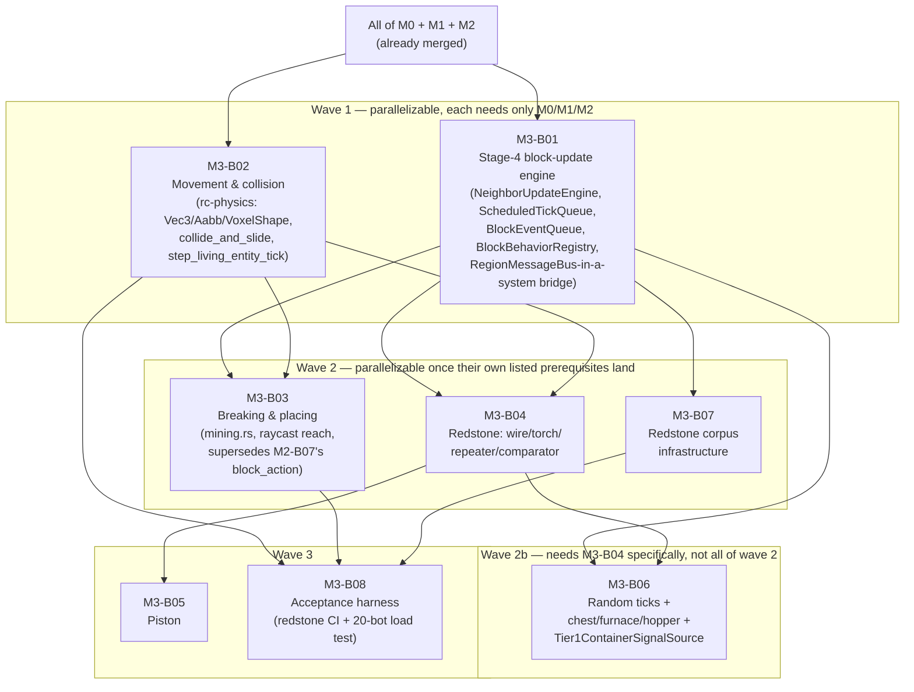

# M3-B00 — Milestone Index: Mechanics Tier 1 (Movement, Blocks, Redstone Core)

## Milestone summary

M3 gives the engine its first real vanilla-parity mechanics slice: a Stage-4
block-update/scheduled-tick/block-event substrate (`ARCH-D13`'s mandatory
single-worker sequential collapse, exercised for the first time); real player
movement and collision (`rc-physics`, shared unmodified with the future
Phase-2 client); full survival/creative block breaking and placing, superseding
M2-B07's minimal place/break path; the four core redstone components (wire,
torch, repeater, comparator) plus piston; random block ticks and the tier-1
block-entity set (chest, furnace, hopper); and the redstone parity-corpus
infrastructure `11-roadmap-milestones.md`'s own Acceptance Criterion 1 depends
on. Item entities, entity pushing/displacement, mob spawning, liquid flow,
lever/button/pressure-plate, and container-menu packets are explicitly **M4**
(or later) scope and are named as such, not silently dropped, everywhere they
would otherwise be assumed — every blueprint below states this boundary
explicitly.

Eight blueprints implement M3:

| ID | Title | Scope |
|---|---|---|
| M3-B01 | Stage-4 Block-Update Engine | L |
| M3-B02 | Player Movement & Collision | L |
| M3-B03 | Full Tier-1 Block Breaking & Placing | L |
| M3-B04 | Redstone Components: Wire, Torch, Repeater, Comparator | L |
| M3-B05 | Piston | L |
| M3-B06 | Random Ticks & Tier-1 Block Entities (Chest, Furnace, Hopper) | L |
| M3-B07 | Redstone Parity Corpus Infrastructure | L |
| M3-B08 | Acceptance Harness: Redstone Corpus in CI, 20-Bot Load Test, M3 Completion Report | L |

## Dependency graph

**Recommended execution order:**

1. **M3-B01** and **M3-B02** in parallel — both declare only already-merged M0/M1/M2
   content as prerequisites, and touch disjoint crates/files (`rc-scheduler`+`rc-mechanics`
   vs. `rc-physics`+`rusty-clanker-server/play/movement.rs`).
2. **M3-B03**, **M3-B04**, **M3-B07** — all three become startable once their own
   listed prerequisites land, and every pair among them touches disjoint files:
   - M3-B03 needs M3-B01 (`UpdateContext::set_block`, Stage-4 registration) *and*
     M3-B02 (`rc-physics`'s raycast/shape types, `PlayerMotion`/`eye_position`).
   - M3-B04 needs M3-B01 (the `BlockBehavior`/`BlockBehaviorRegistry` seam) *and*
     M3-B02 (`rc-physics`'s shape table, for redstone-conductor determination).
   - M3-B07 needs **only** M3-B01 (the ECS-agnostic `stage4::{run_scheduled_phase,
     run_block_event_subphase}` core its replay driver calls directly) plus already-merged
     M0/M1 test-harness content — likewise startable the moment M3-B01 lands.
3. **M3-B06** needs M3-B01 (Stage-4/`RcRandom`/`BlockBehaviorRegistry`) **and** M3-B04
   specifically (it implements M3-B04's `ContainerSignalSource` trait, `Tier1ContainerSignalSource`
   — the wiring that closes M3-B04's own comparator-container-fullness seam, M3-B04's Context
   §G) — it does **not** need M3-B02, M3-B03, or M3-B07, so it is startable the moment
   M3-B04 lands, in parallel with M3-B03/M3-B07 (both still only wave-2-dependent) but
   strictly after M3-B04 itself.
4. **M3-B05** (needs M3-B04's `SignalSourceRegistry`/power-query API — piston is
   registered strictly after B04's four components, per B05's own construction-order
   note) and **M3-B08** (needs M3-B02, M3-B03, and M3-B07 — the load-test bots'
   movement/interaction packets and the redstone-corpus verbs it wires into CI) —
   both startable once wave 2 completes; note B08 does **not** require M3-B04, M3-B05,
   or M3-B06 as hard prerequisites for its own Tier-1 Done state (only for the
   milestone-level "first meaningfully green `m3-acceptance` run," a later signal —
   see "M3 completion, restated" below).

## Per-blueprint summary

**M3-B01 — Stage-4 Block-Update Engine.** Builds the substrate every later M3
block/redstone blueprint registers into: `NeighborUpdateEngine` (the two fixed
direction fan-out orders, `SHAPE_UPDATE_ORDER`/`NEIGHBOR_CHANGED_ORDER`, and the
reentrant-buffer-then-reverse-push stack discipline reproducing vanilla's own
`CollectingNeighborUpdater`); a combined block+fluid `ScheduledTickQueue` (vanilla's
7-level `TickPriority`, `(trigger_tick, priority, sub_tick_order)` drain order);
a double-buffered `BlockEventQueue` (MECH-D9); a range-based `BlockBehaviorRegistry`
dispatch seam (ships only `NoOpBehavior`); `BorderHalo`/`RegionOwnership` and
`border::fan_out_from_changed_block` for cross-region point-propagation; and the
first-ever `RegionMessageBus`-reachable-from-inside-a-`bevy_ecs::System` bridge,
closing a gap M0-B02/M0-B05 both explicitly left open. Ships zero real redstone
content — wire/repeater/comparator/torch/piston are later blueprints' own
`register_range` calls against this seam. Does not touch `crates/server/`; the
supersession of M2-B07's own `block_action.rs` mutation path is explicitly
flagged as *future* work for a sibling blueprint (M3-B03 performs it).
*Decisions covered:* ARCH-D8/D9/D11/D13/D14/D25/D30 (restated and, for D11/D25/D30,
exercised end-to-end for the first time), MECH-D5/D9/D10/D15/D17(a).

**M3-B02 — Player Movement & Collision.** Gives the engine `rc-physics`
(MECH-D36): bit-exact vanilla `Mth.sin`/`Mth.cos` lookup-table trig, gravity/drag/
friction integration (MECH-D37), a `Vec<Aabb>`-backed `VoxelShape` collision
representation plus a hand-authored tier-1 block-shape table (MECH-D38/D39
source (a) only — source (b), `xtask extract-shapes`, is explicitly deferred),
a Y-then-X-then-Z collide-and-slide sweep with step-up and sneak edge-keep, and
`rc-physics`'s complete normal-dependency set staying `{rc-core}` (WS-D3 rule 1,
future client reuse). On the server side: `PlayerMotion`/`TeleportState`
components, the four serverbound movement packets (`0x1E`–`0x21`), server-authoritative
speed-check/replay-mismatch validation (14-physics-collision.md §3.15's exact
thresholds), and the teleport-correction protocol reusing M1-B05's already-shipped
`SynchronizePlayerPosition`/`ConfirmTeleportation` packets unmodified. Does not
touch `rc-mechanics` (component definitions live in `rusty-clanker-server`,
mirroring M2-B07's own precedent) and does not itself rewire `block_action.rs`
to consume the new `PlayerMotion` — that supersession is explicitly left to
M3-B03.
*Decisions covered:* MECH-D36/D37/D38/D39 (full), NET-D3 (four packets), MECH-D62
(supersession flagged, not performed here).

**M3-B03 — Full Tier-1 Block Breaking & Placing.** Supersedes M2-B07's minimal
place/break path: the full survival dig-timing formula (hardness × tool
multiplier⁻¹, Efficiency/Haste/Mining-Fatigue/water/airborne penalties — with a
flagged, binding correction of `05`'s own Mining-Fatigue text from `0.2ⁿ` to the
verified `0.3ⁿ` series), the server-side dig-packet state machine (`START`/`STOP`/
`ABORT_DESTROY_BLOCK`, delayed destroy, the 0.7 stop-threshold, per-tick crack-stage
broadcast), creative instant break (kept), placement-context-driven block-state
selection/orientation for the full tier-1 placeable set via a held-item stub
(no real inventory model exists, MECH-D47/M4), and a real per-player voxel raycast
(`rc_physics::raycast::cast_ray`, new) replacing M2-B07's fixed-position Euclidean
reach check. Wires every place/break mutation through M3-B01's `UpdateContext::set_block`
and wires M3-B01's Stage-4 substrate into `HardcodedWorld`'s live tick loop for
the first time (neither M2-B07 nor M3-B02 did). Explicitly removes M2-B07's
`apply_block_action`/`ApplyOutcome`/`BlockActionKind`, replacing them with
`mining::apply_mining_action`, while keeping every other M2-B07 item (`Face`,
`resolve_place_position`, `to_storage_id`, `ChunkIndex`, the packet identities
for `Block Update`/`Acknowledge Block Change`) unchanged — a clean, explicitly
itemized supersession (see "The M2-B07 supersession" below).
*Decisions covered:* MECH-D4/D9/D10/D15/D61/D62/D63 (full, with two flagged,
cited corrections — Mining Fatigue's exponent base, and `Use Item On`'s packet
ID drift from `0x2A` to `0x42`).

**M3-B04 — Redstone Components: Wire, Torch, Repeater, Comparator.** Gives
`rc-mechanics` its first real Stage-4 content: a shared quasi-connectivity
primitive (`emitted_toward`/`direct_signal_to`/`signal_into`/`best_neighbor_signal`,
one function every component calls, never re-derived per component, per the
research corpus's own explicit warning) reusing `rc-physics`'s `tier1_shape_table()`
for conductor determination rather than a parallel table; a `RedstoneSignalSource`
trait plus `SignalSourceRegistry`; wire (classic/default evaluator, MECH-D11,
locational and order-dependent by design), torch (inverter + burnout, exact
`RECENT_TOGGLE_TIMER`/`MAX_RECENT_TOGGLES`/`RESTART_DELAY` constants), repeater
(delay/lock/priority-selection, the two-phase tick state machine), and comparator
(compare/subtract modes, container-fullness analog input via a new
`ContainerSignalSource` trait boundary, implemented by M3-B06's own
`Tier1ContainerSignalSource`). Additively extends `rc-physics`'s
shape table with four new non-full shapes. Resolves its own registry
self-reference (each of the four components reads its own `SignalSourceRegistry`
handle via a `OnceLock` bound by `register_tier1_redstone`'s returned
`Tier1RedstoneHandles`, immediately after the composition root wraps the
populated registry in an `Arc`) without adding a field to M3-B01's `UpdateContext`.
*Decisions covered:* MECH-D7/D8/D9/D11/D12/D13/D15/D48 (full).

**M3-B05 — Piston.** Push/pull structure resolution (`MAX_PUSH_DEPTH=12`,
sticky-block branching/`canStickToEachOther`, obstruction/unpushable refusal),
the block-event-driven extend/retract decoupling (MECH-D9's own queue, reused),
and quasi-connectivity input reusing M3-B04's `signal::has_signal`/`signal_into`
unmodified. Consumes B04's power-query API and additively extends `rc-physics`'s
shape table with six `piston_head` entries, the exact extension point M3-B02's
own Open Questions reserved. Entity displacement is explicitly M4 scope, stated
as an interim behavior (a piston-pushed position's block state changes under
a standing entity with no push-out physics), not a silent gap.
*Decisions covered:* MECH-D9/D13/D14 (piston's own row).

**M3-B06 — Random Ticks & Tier-1 Block Entities (Chest, Furnace, Hopper).**
Gives Stage 5 (random tick) a deterministic per-chunk position-selection-and-dispatch
mechanism (ARCH-D14) with **zero** real receivers registered (05 names no
tier-1 random-tick receiver set; ice/snow/crop-growth are explicitly deferred) —
only the mechanism, mirroring M3-B01's "substrate now, behavior later" precedent.
Gives Stage 7 (block-entity tick) chest (open-count/viewer tracking), furnace
(burn/cook state machine, a hand-authored minimal fuel/recipe stand-in for
MECH-D52's not-yet-built data-driven pipeline), and hopper (8-tick transfer
cooldown, the ejection-side 7-tick "into empty" exception) — each with a
comparator-signal function and a hand-written NBT codec. Implements M3-B04's
`ContainerSignalSource` trait (`Tier1ContainerSignalSource`, a `Mutex`-guarded
per-region cache Stage 7 writes into every pass and M3-B04's Stage-4 comparator
reads from, since the two stages run sequentially within one region's own tick
and no `Query` can be held live across both) — the wiring M3-B04 built the seam
for but left unconnected; this is why this blueprint's own prerequisites now
include M3-B04, not only M3-B01 (Dependency graph, above). Widens `rc-scheduler`'s
`DomainGroup` from 5 to 7 variants, an extension M0-B05's own Context explicitly
pre-authorized and reserved (`Stage::RandomBlockTick`/`BlockEntityTick` already
existed, unused, since M0-B05). Cross-region hopper chains (MECH-D19) and
container-menu packets (MECH-D49/D50) are explicitly out of scope.
*Decisions covered:* ARCH-D14/D17 (full, first real exercise), MECH-D9/D13
(full, incl. the M3-B04 wiring)/D19 (deferred, flagged)/D48/D52 (stand-in, flagged).

**M3-B07 — Redstone Parity Corpus Infrastructure.** The concrete mechanism
`11-roadmap-milestones.md`'s M3 Acceptance Criterion 1 depends on: a versioned,
bit-exact `RedstoneTrace` format; `xtask fetch-corpus` (captures a contraption's
per-tick state from a real, frozen, console-driven vanilla 26.2 oracle via a
connected `rc-paritybot` bot); `xtask parity-check redstone` (replays the
identical contraption through M3-B01's own ECS-agnostic Stage-4 core, unmodified,
and diffs bit-exactly); the committed/never-committed fixture-custody split
(`ContraptionSpec` RON files committed, `RedstoneTrace` files git-ignored,
mirroring NET-D10/WS-D10's established policy); and a named, categorized
≥50-contraption content plan (55 entries across six categories — PulseGenerator,
Clock, PistonDoor, ComparatorCircuit, QcShowcase, UpdateOrderProbe — every entry
citing the exact constant/decision it locks in), with the first five fully
authored as the template every later contribution follows. Explicitly does not
build TEST-D14's full generic `#[rc_gametest]`/`TestContext` framework (reserved
for a future, broader blueprint) and ships zero real redstone-component
behavior — its own Tier-1 gate proves the harness, not parity.
*Decisions covered:* TEST-D14/D15/D16/D38/D41/D42/D44/D46/D47/D48 (infrastructure
half), WS-D9/D10.

**M3-B08 — Acceptance Harness: Redstone Corpus in CI, 20-Bot Load Test, M3
Completion Report.** Wires M3-B07's `fetch-corpus`/`parity-check redstone`
verbs into a scheduled CI tier with fail-on-any-diff semantics (no partial
credit); a 20-real-bot, single-region, 10-real-minute load test (`±1%` TPS
threshold, reusing M0-B06's own soak-pass formula, reimplemented externally
since the in-process code is unreachable from a black-box subprocess) with a
structural argument *and* a runtime assertion (`RC_REGION_COUNT=1`) for why the
arena cannot leave one region at M3; and one unified `xtask m3-report` verb
aggregating both roadmap acceptance criteria, mirroring `m1-report`/`m2-report`'s
established shape exactly. Its own Tier-1 Done state needs no real oracle, no
real server subprocess, and no green `m3-acceptance` run — identical framing to
every prior harness blueprint (M0-B08, M1-B06, M2-B08).
*Decisions covered:* M3's roadmap Acceptance Criteria 1–2 (mapped onto report
cases), TEST-D37/D40/D45/D46/D48/D50, ARCH-D6/D7/D19 (restated as the
single-region structural argument).

## M3 acceptance criteria → blueprint mapping

| # | Acceptance criterion (`11-roadmap-milestones.md`) | Blueprint(s) | Status |
|---|---|---|---|
| 1 | A corpus of at least 50 known redstone contraptions... captured from vanilla and replayed tick-for-tick produces a bit-identical redstone-component state sequence... checked automatically by `xtask parity-check redstone` on every scheduled CI run. | M3-B01 (Stage-4 substrate the replay driver runs against) + M3-B04 (wire/torch/repeater) + M3-B05 (piston) + M3-B06 (`Tier1ContainerSignalSource`, the container-fullness signal path the comparator-gated corpus entries need) + M3-B07 (trace format, capture/replay pipeline, the five fully-authored contraptions, the 55-entry content plan) + M3-B08 (`m3-acceptance` CI wiring, fail-on-any-diff aggregation) | **Infrastructure and the first five contraptions are complete; the remaining ≥45 contraptions are named, categorized, and cited but not yet authored as committed `.ron` files.** No blueprint in this set is assigned to author entries 6–55 — each is explicitly left as "a `test-authoring`-labeled changeset... authored by whichever later changeset first needs it" (M3-B07's own Context). This mirrors this project's own established pattern for a milestone-level criterion whose full closure is a later, incremental signal (M2's own AC1 inventory gap, M1-B06's/M2-B08's "first meaningfully green run" framing) — not a blueprint-derivation defect, since TEST-D42 explicitly licenses incremental, code-authored corpus growth and M3-B07/M3-B08 both state the gap openly rather than silently. The milestone is **not** closeable against AC1's literal "≥50" wording until that authoring work lands, which this index flags as M3's single largest piece of remaining, unassigned work. |
| 2 | 20 TPS sustained for 10 minutes with 20 simulated bot clients performing continuous movement and block interaction concentrated within a single region. | M3-B02 (movement packets/validation) + M3-B03 (creative instant break/place interaction) + M3-B08 (`load_scenario`, `RC_REGION_COUNT=1` runtime assertion, `±1%` TPS measurement) | **Achievable as scripted.** M3-B08's own arena/movement/interaction design is placed with generous margin inside a single `ARCH-D6` grid cell, backed by both a structural argument (`HardcodedWorld` has exactly one region at M3, by construction) and a runtime check, not prose alone. |

## The M2-B07 supersession

Three blueprints touch M2-B07's `crates/server/src/play/block_action.rs`, each
with a distinct, explicitly stated role, and the three are consistent with each
other:

- **M3-B01** does not modify `block_action.rs` at all. Its Context names the
  supersession as *future* work: "M2-B07's own future replacement... is expected
  to call this blueprint's `UpdateContext::set_block`... **not this blueprint**."
- **M3-B02** likewise does not modify `block_action.rs`. Its Interfaces section
  flags that `block_action.rs`'s reach-check call site still computes
  `eye_position(SPAWN_POSITION)` unconditionally and should instead query each
  acting player's own new `PlayerMotion.position` — explicitly assigning that
  edit to "whichever sibling M3 blueprint owns block placement/breaking's own
  tier-1 upgrade."
- **M3-B03** is that sibling blueprint, and performs the supersession precisely
  as both M3-B01 and M3-B02 anticipated: it removes `apply_block_action`/
  `ApplyOutcome`/`BlockActionKind`'s old shape, replaces the reach check with
  `mining::raycast_reach` (a real per-player-position voxel raycast consuming
  M3-B02's `PlayerMotion`/`eye_position` directly), and replaces the fixed-`STONE`
  placement with the held-item stub — while explicitly keeping every other
  M2-B07 item unchanged (`Face`, `resolve_place_position`/`target_position`,
  `to_storage_id`, `seed_chunk_column`, `ChunkIndex`, `debug_query_block`,
  `pack_position`/`unpack_position`, the `Block Update`/`Acknowledge Block Change`
  packets, and the broadcast-to-every-connected-player interest-set simplification).

No blueprint in this set silently duplicates or contradicts another's claim on
`block_action.rs`; the three-way handoff (B01 defers → B02 defers and flags the
call site → B03 performs it) is clean.

## M3 completion, restated

Per this project's own established pattern (`TEST-D39`'s "mergeable" vs.
"parity-complete" split, already exercised by every prior milestone's index):
every blueprint above reaches its own Tier-1 Done state without a real oracle
run, a real 20-bot load test, or a fully-populated ≥50-contraption corpus.
`11-roadmap-milestones.md`'s M3 Acceptance Criteria are reached only once (a)
M3-B04/M3-B05/M3-B06's real component behaviors and cross-blueprint wiring have
actually been implemented and merged — including M3-B04's own registry
self-reference (Context §I½ of that blueprint: each of the four tier-1
components binds its own `SignalSourceRegistry` handle via `OnceLock`,
resolving the circular-construction problem without a M3-B01 `UpdateContext`
field) and M3-B06's `Tier1ContainerSignalSource` implementation of M3-B04's
`ContainerSignalSource` trait (closing the seam that gates comparator-fullness
corpus entries #15/#17/#33) — and (b) the remaining ~45 named corpus
contraptions (the AC1 status row above) are authored as committed `.ron`
files — at which point M3-B08's `m3-acceptance` CI job's first meaningfully
green run is the milestone's own completion signal, exactly as M0-B08's `soak`,
M1-B06's `m1-acceptance`, and M2-B08's `m2-acceptance` jobs already established
this project's standing pattern for a harness wired ahead of the content that
makes it meaningfully green.
