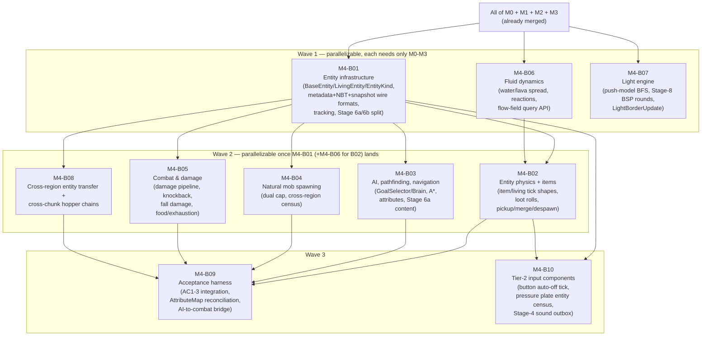

# M4-B00 — Milestone Index: Mechanics Tier 2 (Entities, AI, Combat, Items)

## Milestone summary

M4 broadens mechanics coverage from M3's block/redstone-only slice to entities:
a composition-over-inheritance entity infrastructure (NBT/metadata/snapshot
serialization, tracking, persistence) for four tier-2 kinds (item, zombie,
villager, cow); real Stage-6a/6b content for the first time (`ARCH-D15`'s
AI-selection/physics-integration split); A* pathfinding, the GoalSelector and
Brain AI systems; natural mob spawning with a cross-region census; a full
melee combat/damage pipeline; water/lava flow; the Stage-8 light engine at
real scale; and the first real exercise of cross-region entity transfer
(`ARCH-D10`) and cross-chunk-border hopper chains (`ARCH-D17`) with real
players and mobs; and the tier-2 input components — button and pressure
plate — that PLAN-D10 named as M4's own follow-up to the lever it pulled into
M3, the first blocks in this project driven by entity presence rather than by
a player action or a redstone edge. Ten blueprints implement M4.

M4's own parallel-derivation design — independent waves, each reconciled by a
later blueprint — is the intended pattern (M4-B09's own Parts B/C/I are three
instances of exactly this reconciliation), and every cross-blueprint gap that
design produced has been closed in place: M4-B01's `BaseEntity` field order is
ascending; M4-B02/M4-B04/M4-B08's own doc comments now correctly describe the
three-registrant `DomainGroup::EntityPhysicsIntegration` group instead of
claiming sole ownership, and M4-B09's own Part I fixes the real composition-root
call order for M4-B02/M4-B04/M4-B05's registrants plus a registration-order
acceptance test; M4-B09's Part B retires both the duplicate `AttributeMap` type
and the duplicate `UpdateAttributes` wire packet; M4-B03's Cargo.toml edit
states its own merge instruction against M4-B02's; M4-B07's `UpdateContext`
field addition is a coordinated, cited, one-changeset update across every
M3-B01/M3-B04/M3-B06/M4-B06 construction site; M4-B01's own Context states
explicitly, once, why ARCH-D15's entity-entity reconciliation pass is a bounded,
judged-safe deferral at M4's own scope; M4-B09 is structurally spec-compliant
(eight sections, no more); every blueprint whose body exceeds the spec's own
~800-line guideline carries an explicit justification; and M4-B07's lint-deps
checkbox restates its own actual dependency-set claim rather than M3-B01's now-
superseded baseline.

| ID | Title | Scope |
|---|---|---|
| M4-B01 | Entity Infrastructure | L |
| M4-B02 | Entity Physics & Item Entities | L |
| M4-B03 | AI, Pathfinding & Navigation | L |
| M4-B04 | Natural Mob Spawning | L |
| M4-B05 | Combat & Damage | L |
| M4-B06 | Fluid Dynamics: Water & Lava Flow | L |
| M4-B07 | Light Engine: Push-Model BFS, Stage-8 BSP Rounds, Cross-Region Propagation, Client Sync | L |
| M4-B08 | Cross-Region Entity Transfer & Cross-Chunk Hopper Chains | L |
| M4-B09 | Acceptance Harness: Region-Boundary Delta, Hopper Cadence, AI/Combat Scenario Suite, M4 Completion Report | L |
| M4-B10 | Tier-2 Input Components: Button and Pressure Plate | M |

## Dependency graph

**Recommended execution order:**

1. **M4-B01**, **M4-B06**, **M4-B07** in parallel — each declares only already-merged
   M0–M3 content as its own hard prerequisite, and each touches a disjoint slice of
   `rc-mechanics` (`entity/`, `fluid/`, `light/` respectively). M4-B07 additionally
   touches `rc-messaging`/`rc-scheduler` additively; M4-B06 touches neither. M4-B07's
   own `UpdateContext` field addition (Context §7) touches every already-merged
   `UpdateContext`-constructing test file across M3-B01/M3-B04/M3-B06, and across
   M4-B06 too if M4-B06 has already landed by the time M4-B07 is implemented — a
   coordinated, cited, one-changeset update (M4-B07's own Constraint (e)), not a
   hard DAG dependency, since M4-B06's own construction sites simply do not exist
   yet to touch if M4-B06 lands second.
2. **M4-B02**, **M4-B03**, **M4-B04**, **M4-B05**, **M4-B08** become startable once
   M4-B01 lands (M4-B02 additionally needs M4-B06). None of these five lists any
   of the other four as a prerequisite — M4-B03's own Context states this
   explicitly ("M4-B02... is being written in parallel and is not read or bound
   to"), and M4-B05/M4-B08 follow the identical discipline. This parallel
   independence is by design: M4-B09's own Part I (below) is the reconciliation
   step that fixes the real composition-root call order across the three of these
   five that register into `DomainGroup::EntityPhysicsIntegration`
   (M4-B02/M4-B04/M4-B05), exactly the same pattern M4-B09's Parts B/C already
   apply to M4-B03/M4-B05's own independently-invented `AttributeMap` type and
   `PendingMeleeAttack` contract.
3. **M4-B09** needs M4-B02 (`register_stage6b`'s own signature, Part I), M4-B03
   (AI substrate), M4-B04 (`register_mob_despawn`'s own signature, Part I), M4-B05
   (combat substrate), and M4-B08 (both of its own already-complete acceptance
   tests) — it is wave 4 in practice even though it does not hard-depend on
   M4-B06/M4-B07, because its own Done state requires `cargo nextest run` across
   the whole affected crate set to stay green, which implicitly requires every
   sibling that shares a file (`rc-mechanics::combat`, `rc-mechanics::ai`,
   `crates/server/src/play/world.rs`) to have already landed in the form M4-B09's
   own governance changeset assumes.
4. **M4-B10** sits in the dependency graph's own wave 3 alongside M4-B09, but
   carries no edge to or from that blueprint: its own Prerequisites list only
   M4-B01 and M4-B02, both already merged once wave 2 starts. It is therefore
   actually startable earlier than M4-B09 in practice — as soon as M4-B02
   specifically lands, with no need to wait on M4-B03, M4-B04, M4-B05 or
   M4-B08 the way M4-B09 does — and can run in parallel with any of those
   four, alongside M4-B09 itself, or after all of them, whichever this
   project's own parallel-execution capacity favors at the time. M4-B09's own
   eleven-scenario AI/combat suite never references a button or a pressure
   plate, so nothing in either blueprint's own text creates an ordering
   constraint between the two.

## Per-blueprint summary

**M4-B01 — Entity Infrastructure.** The composition-over-inheritance component
scheme for four tier-2 kinds (item, zombie, villager, cow): `BaseEntity`
(corrected to include `Pos`, a cited fix to MECH-D30's own field list) +
`LivingEntity` + per-kind bundles; `rc-entity-macros`' first real
`#[derive(EntityNbtFields)]`/`#[derive(EntityMetadataFields)]` implementation;
entity identity (`EntityUuid`, a formalized `NetworkEntityIdAllocator`); the
complete metadata wire protocol and nine spawn/despawn/movement/tracking
packets; a real per-entity, per-type distance-gated tracking system replacing
M2-B07's blanket broadcast; NBT persistence into `entities/` region files; a
real, versioned `EntitySnapshot` payload replacing M0-B02's opaque placeholder;
and the `Stage`/`DomainGroup` split that finally gives ARCH-D15's Stage 6a
(read-only) and Stage 6b their own registration slots — Stage 6a's read-only
dispatch is proven structural (Commands silently discarded), not conventional.
Ships zero AI/spawning/combat/pickup content. *Decisions covered:* MECH-D29/D30
(full, one cited correction), MECH-D31/D32 (Stage split only, no AI content),
ARCH-D8/D10/D15/D24/D25/D28, WORLD-D29, WS-D13, NET-D3 (nine packets).

**M4-B02 — Entity Physics & Item Entities.** The first real content in
`DomainGroup::EntityPhysicsIntegration` (Stage 6b): the item-entity tick shape
(subtract-gravity → move → drag → conditional halve-invert) as new code, and
the living tier-2 kinds' tick shape via `rc_physics::step_living_entity_tick`
reused unmodified with `MovementIntent::default()` (no AI exists yet, so every
mob "stands in place, falls, collides, reacts to fluid push"); the entity-side
AABB fluid-submersion scan and push/swim/drowning consuming M4-B06's flow-field
API; fall-distance tracking with a damage-hook-only landing effect; and the
complete item-entity lifecycle — spawn-on-block-break (completing M3-B03's own
deferred drops stance), a real bit-exact Xoroshiro128++/`random_sequence`
engine driving a hand-authored interim tier-1 loot table, merge, pickup (into
an explicitly interim per-player log), and age-despawn. *Decisions covered:*
MECH-D36–D39 (extended to non-player entities), MECH-D24 (first entity-facing
fluid consumer), MECH-D51 (full), MECH-D52/D53 (interim stance), ARCH-D15
(Stage 6b's first real system, `order_tag = 0` per M4-B09's own Part I —
M4-B04's despawn system and M4-B05's mob-combat system join this same group
afterward).

**M4-B03 — AI, Pathfinding & Navigation.** The priority-based `GoalSelector`
(Zombie/Cow) and memory/sensor/activity-gated `Brain` (Villager) systems, both
over a shared `AiContext`; A* pathfinding over a `WalkNodeEvaluator`-classified
navigation graph with vanilla's node-cost/malus model and a budgeted,
throttled, per-tick-synchronous search; navigation execution
(`MoveControl`/`LookControl`/`JumpControl`) producing one `MovementIntent` per
entity per tick — Stage 6a's own produce-side of the seam M4-B01 opened;
sensing (nearest-player targeting, line-of-sight); and the attribute system
(base value + three-stage modifier calculation, an `AttributeMap` keyed by the
real `minecraft:attribute` registry, the `Update Attributes` wire packet).
Registers real systems into `DomainGroup::EntityAiSelection` (Stage 6a) for the
first time and proves, with an executable test, that Stage 6a's read-only
dispatch structurally discards a `Commands`-issuing system. Does not wire
anything into `HardcodedWorld`'s live tick loop. *Decisions covered:* MECH-D31
(first real content), MECH-D32 (first real enforcement), MECH-D33 (full,
`WalkNodeEvaluator` only), MECH-D62 (attribute values only).

**M4-B04 — Natural Mob Spawning.** The dual mob-cap algorithm (global,
scaled by eligible-chunk count over the `17²` magic number; local, per-player,
"any nearby player has room") for two tier-2 species (Zombie/Monster,
Cow/Creature — Villager deliberately excluded, matching vanilla's own
structure/breeding-only spawn path); a concrete, all-to-all gossip resolution
of MECH-D35's cluster-safe census (`RegionMessage::MobCensusReport`, a new
`MobCensusInbox` bridge mirroring `BorderUpdateInbox`); the full per-tick
pack-spawn algorithm (chunk shuffle, group tries, weighted species pick,
placement-legality dispatch) with a persistent, engine-seeded RNG stream
(vanilla's own spawning RNG is time-seeded and never reproducible even in
vanilla itself, so this is not a parity deviation); and despawn rules
(instant-distance, random-roll past 600 ticks, persistence exemption). Spawn
cycle joins `DomainGroup::RandomTick` as its second member; despawn is placed
in `DomainGroup::EntityPhysicsIntegration`. *Decisions covered:* MECH-D34
(full), MECH-D35 (concrete message-substrate design), ARCH-D8 (widened
`RandomTick`).

**M4-B05 — Combat & Damage.** The full melee damage order of operations
(invulnerability top-up gate, armor/toughness, enchantment-protection factor
fed by a bounded-zero stub, the documented player/mob absorption asymmetry);
the 1.9+ attack-cooldown charge curve with critical hits and sweep; the
two-impulse knockback model; fall damage for network-connected players; a
minimal, real attribute system and `GlobalDifficulty` resource; death
detection, mob despawn, and a loot-drop seam (`FixedTierTwoLoot`); a minimal
food/exhaustion/natural-regen system; and five new packets (`Interact`,
`Set Health`, `Update Attributes`, `Damage Event`, `Entity Event`, plus
`Player Combat Kill`). Defines `PendingMeleeAttack` as the Stage-6a→Stage-6b
contract a future AI blueprint is expected to produce into, and spawns real
mobs into `HardcodedWorld`'s live tick loop for the first time via a
debug-only entry point — the first real production exerciser of M4-B01's
`NetworkEntityIdAllocator` beyond its own unit tests. *Decisions covered:*
MECH-D40/D43–D46 (full), MECH-D51 (loot-drop seam only), MECH-D62/D63
(entity-target reach), MECH-D64/D65 (first real content), ARCH-D15 (Stage 6b
content — one of three real registrants into `DomainGroup::EntityPhysicsIntegration`
alongside M4-B02/M4-B04, ordered `order_tag = 2` by M4-B09's own Part I).

**M4-B06 — Fluid Dynamics: Water & Lava Flow.** Bit-exact water/lava flow: the
`FluidState` model (the legacy-`LEVEL`↔`BlockStateId` duality and its
documented "flowing amount-8 collides with source" quirk); the complete spread
algorithm (`getNewLiquid`'s neighbor recompute, `spread`'s down-before-sideways
preference, the tie-preserving, order-broken `getSpread` candidate search, the
greedy-DFS-not-BFS `getSlopeDistance` probe); infinite-source creation and
drain; both lava+water reactions as genuinely distinct code paths (synchronous
5-neighbor contact conversion vs. asynchronous downward-spread-into-water);
tick-cadence scheduling (water flat 5, lava 30/10 by dimension profile, lava's
75%-chance ×4 wave-stacking delay) riding M3-B01's `ScheduledTickQueue` fluid
lane for the first time and closing that blueprint's own deferred tighter
same-tick dedup guard; waterlogging as a registry-based extension point with
zero real content; and the flow-field query API (`getFlow`, float/double-
boundary-exact) M4-B02/M4-B05 consume. Adds zero new Stage-4 system — dispatched
through the existing `BlockBehaviorRegistry`. *Decisions covered:* MECH-D24
(full), MECH-D1/D2/D9/D10/D15/D17(a)/D20 (exercised by real content for the
first time), ARCH-D11/D13 (reused).

**M4-B07 — Light Engine.** The complete server-side light engine: a
push-model BFS propagator shared by sky and block light (two independent
channels, each with an increase/decrease queue pair, decrease-before-increase
per round); the Stage-8 bulk-synchronous-parallel round scheduler over
disjoint per-chunk `LightPropagatorState` (a second, additive dispatch path
alongside `bevy_ecs`'s ordinary conflict-graph model, mirroring ARCH-D13's own
precedent for Stage 4); the block-change enqueue hook wired into
`UpdateContext::set_block`; chunk-load trust-vs-recompute policy; cross-chunk
propagation within a region (a deferred-merge design, safer than a literal
snapshot-read) and cross-*region* propagation via a new `LightBorderUpdate`
message; sky-light source derivation from `HeightmapSet::WORLD_SURFACE`; and a
pure, protocol-crate-decoupled payload builder for the `Update Light`/
`Level Chunk with Light` wire fields. Ships the mechanism with zero real
per-block emission/opacity content (every acceptance test supplies synthetic
properties). *Decisions covered:* WORLD-D7/D8/D9/D10 (full), ARCH-D8/D16/D30,
PERF-D17/D59/D61.

**M4-B08 — Cross-Region Entity Transfer & Cross-Chunk Hopper Chains.** Two
sub-tasks sharing one Stage-1/Stage-7 substrate. Part 1 gives ARCH-D10 a real
transfer system: a `RegionTransferInbox`/`EntityArrivalDriver` `rc-scheduler`
extension mirroring M4-B07's own `LightBorderInbox` pattern; a self-describing
discriminator byte distinguishing a mob `SnapshotPayload` (M4-B01, reused) from
a new, bounded `PlayerTransferPayload`; a cited correction making
`NetworkEntityIdAllocator` process-wide (M4-B01's own per-region scope
collides once two regions are simultaneously live); and `PlayerRouting`, a
monolithic-mode-only connection-redirect mechanism that keeps a player's TCP
session alive across a region-ownership change. Part 2 proves — without
changing one line of M3-B06's own production code — that ARCH-D17's
cross-chunk-same-region hopper collapse already holds unconditionally, since
exactly one system is ever registered into `DomainGroup::BlockEntity`. Ships
`TwoRegionWorld`, a new, additive two-region test/dev harness, never modifying
`HardcodedWorld`. *Decisions covered:* ARCH-D10 (the real system, not merely
the payload shape), ARCH-D9/D17/D24/D29 (restated, exercised for the first
time), MECH-D19/D20/D21 (restated, confirming the cross-region-hopper boundary
stays out of scope).

**M4-B09 — Acceptance Harness.** Closes three real gaps M4-B02/M4-B03/M4-B04/M4-B05
each independently left open for "whichever blueprint wires the milestone
together," then measures all three M4 roadmap acceptance criteria: (Part B) a
governance changeset retiring M4-B05's own independently-invented, hand-rolled
`AttributeKind`-keyed `AttributeMap` in favor of M4-B03's registry-keyed one
(four new registry rows added for the combat-only attributes M4-B03 never
declared), with a documented mechanical key-substitution table, and retiring
the identical duplicate-definition conflict between M4-B03's and M4-B05's own
`UpdateAttributes` wire packets in favor of M4-B05's; (Part C) reshapes
`PendingMeleeAttack` from a `Commands`-added marker (structurally impossible
for a Stage-6a `Goal` to emit, per MECH-D32) into an always-attached
`Option`-valued field, adds `RecentDamage` as the Stage-6b→Stage-6a damage
pulse M4-B03's own `AiContext.hurt_by` field already assumed existed, and adds
three fields to `AiContext` plus the first concrete goal/sensor bodies
(`ZombieAttackGoal`, `HurtByTargetGoal`, Cow's `PanicGoal`, Villager's
`HurtBySensor`); (Part I) fixes the required `HardcodedWorld` composition-root
call order across M4-B02's/M4-B04's/M4-B05's own three real
`DomainGroup::EntityPhysicsIntegration` registrants, with an acceptance test
proving the three co-register without an `AmbiguousMutationAuthority`-class
error; then a lightweight, `bevy_ecs`-free `ScenarioWorld` (mirroring
M3-B07's `ReplayWorld` pattern) drives an eleven-scenario AI/combat behavioral
suite plus integrates M4-B08's own already-complete AC1/AC2 tests into one
`xtask m4-report`, placed in Tier-1 CI on every PR (no oracle exists for any of
M4's three criteria, so no `Mode::{Smoke,Full}` split is needed, unlike
M1/M2/M3's own harnesses). *Decisions covered:* M4's roadmap Acceptance
Criteria 1–3 (mapped onto report cases), TEST-D37/D40/D42/D45–D47/D50.

**M4-B10 — Tier-2 Input Components: Button and Pressure Plate.** The tier-2
half of the input-component set PLAN-D10 named as M4's own follow-up to the
lever it pulled into M3: the button (`ButtonBlock`, all 14 block-set
variants) — face-attached placement identical to the lever, an `on_use`
press that powers the block and schedules its own release 20
(stone/polished blackstone) or 30 (every wooden variant) ticks out, weak 15
all round while pressed and strong 15 only into its mount block, popping
when the mount face stops being `Full`-sturdy — and the pressure-plate
family (`PressurePlateBlock`, `WeightedPressurePlateBlock`, all 16
variants) — a new entity-presence trigger (`on_entity_inside`) re-checked
by a scheduled tick every 20 (plain) or 10 (weighted) ticks, boolean 15/0
or analog `ceil(min(count, max_weight)/max_weight*15)` signal, popping when
the block below stops being `Rigid`-or-`Center`-sturdy. Consumes M4-B01's
entity infrastructure and M4-B02's own per-kind dimension table (promoted
to a public `entity_dimensions` function so item entities and mobs can be
censused) to build the entity-box census (`EntityPresenceSource`, one
production implementation in `rusty-clanker-server`, the only crate that
can see both players and `BaseEntity` entities — WS-D3 rule 2) the plate
reads through; only entities the region itself owns are counted (ARCH-D10).
Ships two small mechanisms this content needs and no more: a
Stage-4-reachable sound outbox (`UpdateContext.sounds`/`TickSoundOutbox`,
absorbing `UseUpdateContext`'s own former duplicate) so a scheduled tick or
an entity-presence dispatch can produce a client-audible sound, and the
`on_entity_inside` `BlockBehavior` hook plus its `rusty-clanker-server`-side
driver (`entity_inside_step`). Placement is exposed for a bounded six-kind
representative subset (§H) covering every distinct behavioural class, not
all 30 blocks. *Decisions covered:* MECH-D13 (the tier-2 half of the
input-component set), MECH-D73/D78/D82/D84 (exercised by new content),
ARCH-D10/D13/D14. No new decision ID; closes the
`docs/findings-for-planning.md` entry "Tier-2 input components have no
blueprint" (PLAN-D10).

## M4 acceptance criteria → blueprint mapping

| # | Acceptance criterion (`11-roadmap-milestones.md`) | Blueprint(s) | Status |
|---|---|---|---|
| 1 | A player walks across a live region boundary (two independently-ticking regions, still monolithic) with position-delta logging showing no observable discontinuity beyond ARCH-D10's one-tick budget. | M4-B01 (`EntitySnapshot`/tracking substrate) + M4-B08 (the real transfer system, `TwoRegionWorld`, `play_region_transfer_player_walk.rs`) + M4-B09 (integrates that already-passing test into `m4-report`, plus a standalone, independently-self-tested `analyze_position_delta` formula) | **Fully addressed as drafted**, contingent on the "process-wide `NetworkEntityIdAllocator`" and `PlayerRouting` mechanisms in M4-B08 landing exactly as specified — no outstanding gap against this criterion specifically. |
| 2 | An automated test confirms a hopper chain crossing a chunk border within one region transfers items at vanilla's correct tick cadence. | M3-B06 (hopper substrate, unmodified) + M4-B08 (Part 2 — proves the substrate's cross-chunk-same-region collapse against a real two-chunk fixture, hand-derived 10-tick table) + M4-B09 (integrates `hand_derived_three_hopper_chain_tick_table` into `m4-report`) | **Fully addressed as drafted.** No outstanding gap. |
| 3 | A scripted scenario suite confirms mob AI pathfinding routes around obstacles and engages in combat consistent with vanilla behavioral expectations (qualitative, not bit-exact). | M4-B01 (entity/AI substrate) + M4-B03 (GoalSelector/Brain/pathfinding/attributes) + M4-B05 (damage/knockback/melee formulas) + M4-B09 (the eleven-scenario suite, the AttributeMap/`UpdateAttributes`/`PendingMeleeAttack` reconciliation that makes B02/B03/B04/B05 mutually coherent, the ten `combat_ai_bridge.rs` fields/types) | **Fully addressed at the Rust-API level by M4-B09's reconciliation**, including the wire-protocol duplication (Part B). The scenario suite itself runs against `ScenarioWorld` (a non-`bevy_ecs` replay harness), never a live `RcExecutor`/`HardcodedWorld` — real production Stage-6a wiring remains unimplemented after M4-B09 (Stage-6b combat wiring is real, per M4-B09's own Part I), which every one of M4-B01/M4-B03/M4-B05/M4-B09's own texts already states as an open scope boundary, not a silent gap. |

## Deferred-item pickup from M3/M0 — verified

- **MECH-D18 (border-halo widening for wide-radius reads, e.g. explosions).**
  Not picked up by name; M4-B05's own Context explicitly re-defers it
  ("Explosions — out of scope, checked against 05/11 explicitly... MECH-D18's
  widening remains deferred to whichever future blueprint first implements an
  explosion"), consistent with no M4 blueprint shipping an explosion-producing
  mechanic. No specific future blueprint ID is named as owner, only "whichever
  blueprint first implements an explosion" — acceptable under this project's
  own established convention for a mechanism with no current consumer, but
  flagged here so a future audit does not need to re-derive that this is a
  deliberate, not accidental, non-pickup.
- **`apply_inbound_border_event`'s `BorderUpdateKind::NeighborChanged` arm
  (never exercised by any M3 test).** Picked up by M4-B06 (Context §N): a
  dedicated inbound-path test hand-constructs a `NeighborChanged` event and
  asserts M3-B01's own already-shipped handling is correct, closing the gap
  M3-B01 named without M4-B06 itself becoming a production emitter of that
  variant (no fluid-specific scenario produces one).
- **`rc_messaging::EntitySnapshot.component_data`'s opaque-placeholder shape
  (M0-B02).** Picked up by M4-B01 (`serialize_entity_snapshot`/
  `deserialize_entity_snapshot`, a real, versioned payload) and extended a
  second time by M4-B08 (the leading discriminator byte distinguishing a mob
  payload from a new player payload) — both extensions are additive to the
  outer `Box<EntitySnapshot>` shape, per M0-B02's own explicit invitation.
- **M3-B03's interim "drops" stance (`BreakOutcome::Applied`'s missing
  drop-spawn behavior).** Superseded by M4-B02 exactly as M3-B03's own text
  licensed: `BreakOutcome::Applied` gains one additive field
  (`broken_state: BlockStateId`) carrying a value `finalize_break` already
  computed internally but previously discarded, and M4-B02's own
  `entity_drops::spawn_break_drop` is wired into the identical tick-loop branch
  M3-B03 already established.
- **M4-B01's own explicitly-deferred items** ("migrating `PlayerMarker`/
  `enter_play` onto `BaseEntity`/`LivingEntity`", "the `RcEntityId -> RegionId`
  directory") remain unimplemented after M4 as a whole — restated as still
  open, not silently dropped, consistent with every blueprint that touches
  players (M4-B05, M4-B08) explicitly re-stating the same boundary rather than
  assuming the migration happened.

## M4 completion, restated

Per this project's own established pattern (every prior milestone's index
draws the same distinction): every blueprint above, as drafted, reaches its
own Tier-1 Done state independent of the others reconciling cleanly — M4-B09's
own Done state is the one exception, since its governance changeset only
compiles once M4-B02, M4-B03, M4-B04, and M4-B05 have actually landed in the
form its own Parts B/C/I reconciliation assumes. `11-roadmap-milestones.md`'s
M4 Acceptance Criteria are reached only once (a) M4-B01 through M4-B08's own
real content has actually been implemented and merged, following the
recommended execution order above, and (b) M4-B09's own `m4-acceptance` CI
job is green on both reference OS legs from a clean checkout, at which point
that job's first meaningfully green run is this milestone's own completion
signal, exactly as M0-B08/M1-B06/M2-B08/M3-B08's own harness jobs already
established this project's standing pattern. M4-B10 sits outside that
criteria mapping entirely — PLAN-D10 assigned it to M4 as the tier-2 half of
the input-component set (button and pressure plate), not as an answer to any
of M4's own three roadmap Acceptance Criteria — so its own Tier-1 Done state
is independent of every other M4 blueprint's Done state and of the
`m4-acceptance` CI job alike; M4 as a whole is not complete, in this
project's own sense of the word, until M4-B10 has landed too, alongside
M4-B01 through M4-B09.
