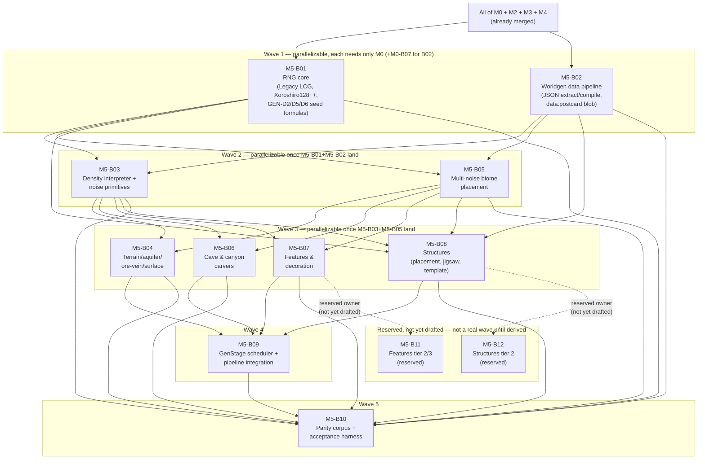

# M5-B00 — Milestone Index: World Generation Parity

## Milestone summary

M5 gives `rc-worldgen` vanilla's data-driven worldgen pipeline end to end: the
bit-exact RNG core both algorithm families and every seed-derivation formula
route through (M5-B01); the vanilla-JSON extraction/compilation pipeline that
turns Mojang's own worldgen datapack into a compiled, committable
`postcard` blob (M5-B02); the density-function interpreter and noise
primitives every later subsystem samples through (M5-B03); terrain fill,
aquifers, ore veins, and surface rules (M5-B04); multi-noise biome placement
(M5-B05); cave/canyon carvers (M5-B06); the 11-step feature/decoration
pipeline (M5-B07); structure-set placement, jigsaw assembly, and template
stamping (M5-B08); the `GenStage` scheduler that assembles all of the above
into one background, off-tick, `RC-WorkerPool`-driven pipeline delivering
completed chunks as Stage-1 structural commands (M5-B09); and the
corpus/harness infrastructure that turns `11-roadmap-milestones.md`'s two M5
acceptance criteria into an agent-executable, CI-wired measurement
(M5-B10). Ten blueprints implement M5, drafted and Tier-1-tested; two more
IDs (M5-B11, M5-B12) are reserved but not yet drafted — the named owners of
M5-B07's/M5-B08's own tier gaps ("Cross-blueprint gaps and reconciliation"
below), required before the milestone's own GEN-D1/GEN-D27 acceptance gate
is exercised for real.

M5-B01 independently caught and resolved a genuine internal contradiction in
this project's own research corpus (`24-seed-derivation-map.md` §3.1's
incorrect float-truncated-`DOUBLE_UNIT` claim for Xoroshiro's `nextDouble()`,
superseded by `16-rng-internals.md`/`18-float-determinism.md`'s
bytecode-verified exact-power-of-two finding) and a genuine error in
`04-worldgen-parity.md` GEN-D6's own prose (the carver source-chunk seed
formula, corrected to `set_large_feature_seed(world_seed + carver_index,
source_chunk_x, source_chunk_z)`, XOR-combined, multipliers not forced odd —
independently confirmed against `16-rng-internals.md` §7/§8 and propagated
correctly into M5-B06's own carver-seeding implementation). Both resolutions
are stated once, in M5-B01's own Context, and consumed by every downstream
blueprint without re-derivation — this is the intended pattern, not a
one-off. Both corrections have since been applied to the planning/research
corpus itself (`04-worldgen-parity.md` GEN-D6's row, `24-seed-derivation-map.md`
§3.1/§4/§8), so the corpus and every M5 blueprint now agree. The M5-B05/M5-B03 `ClimateSampler` seam — the highest-risk seam
named by this milestone's own task assignment, since the two blueprints were
written in parallel — reconciles cleanly: M5-B05 declares the trait, M5-B03's
own Context explicitly names M5-B05 as "already a known consumer" and
confirms its `EvalContext`/`DensityInterpreter::sample` public shape already
satisfies it with zero change required. GEN-D20's canonical decoration-order
exception is handled consistently across every blueprint that touches it:
M5-B07 defines `DecorationOrderKey { region_local_chunk_index, step,
feature_global_index }` and the sortable-key mechanism; M5-B09 resolves
`region_local_chunk_index` concretely (ascending `(chunk_x, chunk_z)` over the
active generation batch) and enforces the ordering via `DecorationScheduler`;
M5-B10 restates the same single exception category as its own
machine-checkable ledger schema and gates GEN-D27's ≥99.9% match threshold on
zero *undocumented* mismatches, not the raw percentage.

M5-B10 was originally drafted before M5-B09 existed, against an *assumed*
minimal contract (a synchronous, no-I/O `rc_worldgen::pipeline::generate_chunk(...)
-> GeneratedChunk`) that M5-B09's real, merged API did not provide. This is
now resolved: M5-B09's own `pipeline` module additionally exposes
`generate_chunk_sync(chunk_x: i32, chunk_z: i32, ctx: &GenerationContext) ->
ProtoChunk` (M5-B09 Context §P) — the pure, synchronous, single-chunk entry
point M5-B10's own `Md5B09Generator` needed all along, built entirely out of
M5-B09's already-shipped per-rung functions and `DecorationWindow`, calling
nothing new. M5-B10's own Context §A.1/§A.4 and `generator.rs` Deliverables
are restated against this real, merged signature. `Md5B09Generator::generate_chunk`
itself still stays a `todo!()` stub, but for a different, narrower reason now:
it needs a real `GenerationContext` built from a real, production content-resolver
table, which remains a separate, not-yet-written blueprint's job (M5-B09
Context §A) — M5-B09's own API is no longer the blocker. See "Cross-blueprint
gaps and reconciliation" below for what remains.

| ID | Title | Scope |
|---|---|---|
| M5-B01 | RNG Core (Legacy LCG, Xoroshiro128++, Seed-Derivation Hierarchy) | L |
| M5-B02 | Worldgen Data Pipeline (JSON Extraction, Compilation, Postcard Blob) | L |
| M5-B03 | Density-Function Interpreter & Noise Primitives | L |
| M5-B04 | Terrain Fill, Aquifers, Ore Veins & Surface Rules | L |
| M5-B05 | Multi-Noise Biome Placement | L |
| M5-B06 | Cave & Canyon Carvers | L |
| M5-B07 | Features & Decoration (11-Step Placement Pipeline) | L |
| M5-B08 | Structures: Placement, Jigsaw Assembly, Template Stamping | L |
| M5-B09 | GenStage Scheduler & Generation Pipeline Integration | L |
| M5-B10 | Worldgen Parity Corpus & Acceptance Harness | L |

**Reserved, not-yet-drafted follow-up blueprints** — named owners for M5-B07's/M5-B08's own tier gaps ("Cross-blueprint gaps and reconciliation" below); not derived yet, not counted in the "ten blueprints" above, and not part of the wave structure below until drafted:

| ID | Title | Scope | Owns |
|---|---|---|---|
| M5-B11 | Features Tier 2/3 (Deferred Feature/Trunk/Foliage Kinds) | TBD once drafted | The 56 remaining vanilla `Feature` kinds and 14 remaining trunk/foliage placer kinds M5-B07 Context §M/§N.5 names individually and defers |
| M5-B12 | Structures Tier 2 (Hand-Coded Piece Generators) | TBD once drafted | The 15 non-jigsaw hand-coded structure families M5-B08 Context §A/§J names individually and defers |

## Dependency graph

**Recommended execution order:**

1. **M5-B01** and **M5-B02** in parallel — neither declares the other as a
   prerequisite (M5-B01 touches only `src/random*.rs`; M5-B02 touches only
   `xtask/src/worldgen_data/` and `src/data/`), and both need only already-merged
   M0 content (M5-B02 additionally reuses M0-B07's `fetch_data.rs`/
   `fixture_manifest.rs`).
2. **M5-B03** and **M5-B05** become startable once M5-B01+M5-B02 land, and are
   mutually independent (M5-B05's own Context states plainly that it calls
   **zero** RNG primitives from M5-B01 and binds only to M5-B02's compiled
   types; M5-B03 does not read M5-B05 at all). This is the milestone's
   highest-risk seam by the task assignment's own framing — resolved cleanly,
   not merely asserted: M5-B03's Context names M5-B05 as an already-satisfied
   consumer of its `EvalContext`/`DensityInterpreter::sample` public shape,
   with the exact adapter shape (`ClimateSampler::sample_climate_raw`, six
   `interpreter.sample(router.<axis>, ...)` calls) spelled out in both
   directions.
3. **M5-B04**, **M5-B06**, **M5-B07**, **M5-B08** become startable once
   M5-B03+M5-B05 land. None of these four lists any of the other three as a
   prerequisite and each touches a disjoint module slice of `rc-worldgen`
   (`terrain/`, `carve/`, `decoration/`, `structure/` respectively) — the one
   file-level overlap is M5-B08's own additive extension to M5-B03's already-
   shipped `density/interpreter.rs`/`density/noise_chunk.rs` (a trailing
   `Option<&BeardifierContext>` parameter on `evaluate_node`, threaded through
   `DensityInterpreter`/`NoiseChunk`'s constructors), which M5-B04/M5-B06/
   M5-B07 never call directly (they consume M5-B03's `sample()` methods, not
   its constructors), so this extension is safe to land in any order relative
   to the other three waves-3 blueprints. M5-B08 additionally needs M5-B01
   (`set_large_feature_seed`/`set_large_feature_with_salt`) and M5-B02
   (compiled `StructureSet`/`TemplatePool`/`ProcessorList` types) directly,
   already covered by wave 1.
4. **M5-B09** needs all of M5-B01 through M5-B08 — it is the actual
   `GenStage`-scheduler-integration blueprint every one of M5-B03 through
   M5-B08's own Deliverables names and defers to, calling each stage's
   already-shipped driver function in GEN-D25's fixed order against a
   non-ECS `ProtoChunk`, and closing M5-B05's own open `ClimateSampler` seam
   with a real implementation for the first time.
5. **M5-B10** needs M5-B01 through M5-B08 transitively (for its corpus/hash
   machinery) and now, for real, needs M5-B09 too: `Md5B09Generator`'s own
   struct fields reference `rc_worldgen::pipeline::GenerationContext` directly
   (Context §A.4), so `cargo build -p rc-gametest` cannot type-check without
   M5-B09's real `pipeline` module present, even though `generate_chunk`'s own
   *body* stays a `todo!()` stub and every Tier-1 test exercises only
   `FixedChunkGenerator`. Its **real** parity/throughput gate (`m5-acceptance`,
   scheduled/nightly, not part of its own Done state) is unreachable until the
   real production content-resolver table (Context §A.4) lands.

## Per-blueprint summary

**M5-B01 — RNG Core.** Both of vanilla's RNG algorithm families
(`RcLegacyRandom`: 48-bit LCG, bit-compatible with `java.util.Random`;
`RcXoroshiroRandom`: Xoroshiro128++, wrapping `rand_xoshiro`'s raw core only,
never its `RngCore` convenience methods), every hand-matched derived-value
formula (`next_int`, both `next_int_bounded` shapes — Legacy's power-of-two
fast path + rejection loop vs. Xoroshiro's Lemire multiply-high rejection,
structurally different algorithms, GEN-D4), the 128-bit seed upgrade/mixing
chain (`mix_stafford13`, GEN-D5), both positional-factory flavors
(`mth_get_seed`'s mixed 32/64-bit-width multiply — independently ranked the
single highest-risk formula in the whole domain by two research documents —
`java_string_hash_code` for Legacy, MD5 for Xoroshiro), `WorldgenRandom<B>`'s
always-legacy-formula quirk (even when wrapping a Xoroshiro backend — a real,
source-confirmed vanilla behavior, mechanically proven divergent from native
Xoroshiro in this blueprint's own acceptance tests), the complete GEN-D6
seed-derivation formula table (decoration, feature, large-feature, large-
feature-with-salt, carver, slime-chunk), `random_sequence` seeding (GEN-D5),
and GEN-D2's seed-string parsing grammar. Independently resolves two real
research-corpus defects (Context §K's `DOUBLE_UNIT` contradiction, §I's
GEN-D6 carver-formula correction) rather than silently picking a side.
*Decisions covered:* GEN-D2–D6 (full).

**M5-B02 — Worldgen Data Pipeline.** `xtask fetch-worldgen-data`/
`compile-worldgen-data`, extending NET-D9's jar-acquisition pipeline: unzips
`data/minecraft/{worldgen,dimension,dimension_type}/**` from the same
legally-obtained `server.jar`, parses with `serde_json` (dev-time only,
`deny_unknown_fields`), canonicalizes into id-interned compiled Rust structs
covering ten JSON node families (density functions — 34 variants, noise
params, noise router, noise generator settings, surface rules, configured
carvers, configured/placed features, structure sets/structures/template
pools/processor lists, biome parameter lists with GEN-D14's quantization
confirmed exact via `17-noise-math.md` §3.9), and `postcard`-encodes into one
committed `data.postcard` blob per protocol version (GEN-D9), loaded once via
`include_bytes!`/`OnceLock` (`data::load()`). GEN-D23/D24's custody split
(structure NBT templates never committed; worldgen JSON's compiled form is
committable functional data) is restated and applied to this blueprint's own
artifacts. The manual, jar-gated fetch/compile run against a real 26.2
`server.jar` is explicitly outside this blueprint's own CI-checkable Done
state (mirroring M0-B07's precedent) — required before any blueprint
depending on real compiled data can be exercised for real. *Decisions
covered:* GEN-D7, GEN-D8, GEN-D9, GEN-D12 (re-verified), GEN-D13, GEN-D14
(quantization resolved), GEN-D17, GEN-D19, GEN-D21, GEN-D23/D24, WS-D13.

**M5-B03 — Density-Function Interpreter & Noise Primitives.** A bit-exact
noise-primitive library (`ImprovedNoise`, `PerlinNoise`, `NormalNoise`,
`SimplexNoise`, `BlendedNoise`, `EndIslands` — GEN-D11's small enumerable set
of natively-hardcoded, non-JSON-driven algorithms) and a complete interpreter
over M5-B02's compiled `DensityFunctionGraph` — all 34 node kinds, with the
five caching/marker kinds implemented as real memoization matched to
vanilla's `NoiseChunk` cell/interpolation machinery, not pass-through
no-ops (GEN-D12's binding requirement). Two evaluation tiers: `Tier
1 — DensityInterpreter::sample` (pure, uncached, single-point — already the
exact shape M5-B05's `ClimateSampler` seam needs, zero change required) and
`Tier 2 — NoiseChunk` (the real stateful cell/cache/interpolation machinery a
future chunk-fill driver walks). GEN-D10's float-determinism discipline
(plain IEEE-754 only, no `mul_add`/FMA, no algebraic reassociation)
restated as binding Rust guardrails. `Beardifier{}`'s fresh-generation `0.0`
default is an explicitly named, forward-compatible seam M5-B08 later fills
via an additive `Option<&BeardifierContext>` parameter — not a silent stub.
*Decisions covered:* GEN-D8 (evaluation half), GEN-D10, GEN-D11, GEN-D12
(full), GEN-D13 (sampling half).

**M5-B04 — Terrain Fill, Aquifers, Ore Veins & Surface Rules.** The `Noise`
and `Surface` `GenStage` bodies: `fill_chunk_from_noise` (per-column
`final_density` evaluation, solid/air resolution); aquifers (GEN-D15,
barrier/floodedness/spread fields, never reading neighbor-chunk block state);
ore veins (GEN-D16, the density-router-integrated `vein_toggle`/
`vein_ridged`/`vein_gap` per-block evaluation — every named constant
(edge-roundoff `20.0`/`-0.2`, veininess gate `0.4`, richness range
`[0.4,0.6]`→`[0.1,0.3]`, gap gate `-0.3`, solidness reject `0.7`, raw-ore
chance `0.02`) verified bit-for-bit against `24-seed-derivation-map.md` §3.4);
and surface rules (GEN-D17, the sequential condition-tree interpreter —
`y_above`/`water`/`biome`/`stone_depth`/`hole`/`noise_threshold`/
`vertical_gradient`/`temperature`/`steep`/boolean combinators, first-match-
wins `sequence`). Several sub-formulas are explicitly flagged moderate
confidence for a future GEN-D27 reconciliation pass rather than presented as
verified (aquifer pressure/barrier combining arithmetic, floodedness
threshold, `stone_depth`'s offset formula, `steep`'s chunk-edge clamping,
bandlands' 192-entry palette generation — deferred via a caller-supplied
resolver closure). *Decisions covered:* GEN-D13 (consumption half), GEN-D15,
GEN-D16, GEN-D17 (full), GEN-D25 (Noise/Surface stage bodies).

**M5-B05 — Multi-Noise Biome Placement.** GEN-D14's complete climate math:
the 7-dimension quantized-parameter distance/fitness formula (`quantize_climate`
confirmed exact — `(v * 10000.0) as i64`, truncate-toward-zero — against
`17-noise-math.md` §3.9), a brute-force parameter-list search (GEN-D14's own
sanctioned default) plus a structurally-faithful `BiomeSearchTree`
accelerator kept deliberately opt-in, not wired as the default (per GEN-D14's
own "brute force until profiling says otherwise" framing); the
`ClimateSampler` seam M5-B03's noise-router evaluator implements (§56 of this
blueprint, verified compatible from both sides — the milestone's
highest-risk seam, resolved); `MultiNoiseBiomeSource<B>`, `fill_biome_column`
wiring into M2-B01's `BiomeColumn`; and vanilla's two-pass spawn-point
climate search (moderate confidence, structural-only acceptance tests). Uses
**zero** RNG primitives from M5-B01 (biome placement is RNG-free per the
research corpus, stated explicitly rather than left to be discovered).
*Decisions covered:* GEN-D13 (climate-target fields), GEN-D14 (full),
GEN-D25/D26 (biome placement's pure-function property).

**M5-B06 — Cave & Canyon Carvers.** GEN-D18's bounded-neighborhood carve
algorithm: for each of 289 candidate source chunks in a target chunk's 17×17
neighborhood, re-derives that source chunk's own carve geometry via M5-B01's
corrected carver-seed formula (`set_large_feature_seed(world_seed +
carver_index, source_chunk_x, source_chunk_z)`, XOR-combined, carver_index
resetting to `0` per source chunk — mechanically proven distinct from both
the decoration-seed formula and a non-resetting index in this blueprint's own
acceptance tests) and carves into the target wherever that geometry overlaps
it — a pure function of coordinates only, never reading a neighbor's
materialized block state (GEN-D18's own precise claim). Cave/canyon
tunnel-walk math, room sizing, and several `HeightProvider`/config-field
shapes are explicitly flagged `[C-MED]`/`[C-LOW]` placeholders pending a
future golden-corpus reconciliation (M5-B10 does not yet provide this — see
gaps below). Deliberately no memoization across the 289-chunk redundant
recomputation (correctness-neutral per GEN-D26, matching vanilla's own
behavior exactly). Three real gaps in prior M5 blueprints are closed only
with trait boundaries + safe defaults, not concrete implementations:
`AquiferSampler` (`DisabledAquifer` default), `SurfaceRetopper` (`NoRetop`
default), `BiomeCarverSource` (no default — WorldgenData has no per-biome
carver-list field yet, deferred to M5-B02's own future revision). *Decisions
covered:* GEN-D18 (full), GEN-D6 (carver formula, corrected and consumed),
GEN-D10 (extended with `Mth.sin`/`cos` table-vs-real-trig split).

**M5-B07 — Features & Decoration.** GEN-D19's 11 fixed decoration steps
(`RawGeneration` through `TopLayerModification`, compiled by M5-B02 as
`DecorationStep`), `FeatureSorter`'s cross-biome global feature index (DFS
topological sort over registry-iteration-order edges — moderate confidence on
exact edge-storage order, flagged for GEN-D27), the 15-kind placement-modifier
interpreter, a representative explicitly-tiered set of terminal `Feature`
algorithms (ore, disk, spring, lake, tree, random-patch, simple-block) with
every one of the remaining 56 of 63 vanilla feature kinds and 14 of 18
trunk/foliage placer kinds individually named and deferred to a future
features-tier-2/3 blueprint — a genuine, bounded parity gap that must close
before GEN-D27's real 99.9%-chunk-hash gate is exercised, not a silent
omission. Defines `DecorationOrderKey { region_local_chunk_index, step,
feature_global_index }`, GEN-D20's own concrete, sortable tie-break
mechanism (later resolved and enforced by M5-B09). Makes one small, additive,
explicitly-flagged extension to M5-B02's own pipeline (per-biome
`features: [HolderSet<PlacedFeature>; 11]`, read from
`data/minecraft/worldgen/biome/*.json`, a family M5-B02's own extraction walk
already copies to disk but never named) — flagged for M5-B02's next revision,
not silently absorbed. *Decisions covered:* GEN-D19 (full), GEN-D6 (feature-
seed call sites), GEN-D20 (mechanism defined), GEN-D25/D26 (Features stage).

**M5-B08 — Structures.** Structure-set placement (`random_spread` grid+jitter
with all four `FrequencyReductionMethod` variants including the `DEFAULT`
param-order hazard and buried-treasure's two-independent-RNG-stream quirk;
`concentric_rings`' once-per-world ring algorithm); the structure-starts/
structure-references two-phase flow; the complete jigsaw assembly algorithm
(template pools, pool aliases, priority-bucketed BFS placement, rotation/
mirror, terrain adaptation, beardifier density contribution — wired into
M5-B03's interpreter via an additive `Option<&BeardifierContext>` parameter on
`evaluate_node`, explicitly preserving every pre-existing M5-B03 call site's
behavior via `None`); operator-supplied structure-NBT-template loading
(GEN-D23, `DirectoryTemplateSource` + the full 11-processor pipeline) and
structure-start/reference chunk-NBT persistence (extending M2-B04's own
`chunk_nbt.rs`). Every non-jigsaw (hand-coded) structure family — 15 of them,
named individually — is explicitly deferred to a future blueprint, since the
research corpus does not document their piece-generation grammars precisely
enough to restate bit-exactly here. Several formulas (non-`LegacyType1`
frequency reducers, the ring-growth loop assembly, the beardifier per-cell
kernel, jigsaw-specific NBT field names) are explicitly flagged moderate
confidence for GEN-D27 reconciliation. *Decisions covered:* GEN-D6 (large-
feature/salt seed call sites), GEN-D21 (full), GEN-D22 (full), GEN-D23 (full,
concrete mechanism), GEN-D25 (StructureStarts/References stage bodies).

**M5-B09 — GenStage Scheduler & Generation Pipeline Integration.** Drives one
chunk through the real, research-verified **12**-rung `ChunkStatus` ladder
(`empty → structure_starts → structure_references → biomes → noise → surface
→ carvers → features → initialize_light → light → spawn → full` —
corrected from `04-worldgen-parity.md`'s own GEN-D25 mermaid diagram, which
omits `spawn`; documented and worked around per this project's reconciliation
convention, not silently patched), calling M5-B03 through M5-B08's
already-shipped functions in that exact order against a non-ECS `ProtoChunk`.
Closes M5-B05's own open `ClimateSampler` seam with a real `RouterClimateSampler`
implementation for the first time. `WorldgenScheduler` dispatches
`structure_starts` through `carvers` as independent, zero-shared-state
`RC-WorkerPool` jobs (GEN-D26's "any interleaving, bit-identical output"
holds by direct inspection); `features` is the one rung with real shared
mutable state, gated by `DecorationScheduler`'s GEN-D20 admission invariant.
An explicit EDF admission gate (`RegionOverdueSource`) ensures no worldgen job
is ever dispatched onto `RC-WorkerPool` while any region is overdue
(ARCH-D20), proven by a dedicated acceptance test. `initialize_light`/`light`
stay pure status markers by binding architectural decision — M4-B07's own
already-audited `run_stage8_lighting` recomputes from `LightColumn::
new_uninitialized()` on a chunk's next Stage 8, so this pipeline does not
duplicate a second light propagator. `spawn` is a documented, bounded no-op
(vanilla's own `spawnOriginalMobs` is itself non-seed-reproducible and cannot
be part of GEN-D1's bit-identical criterion; real mob population needs a live
`bevy_ecs::World` this pipeline structurally cannot touch before `full`).
Rewrites M2-B05's `IoPool`/`ChunkLifecycleManager` load-miss seam from a
concrete `SuperflatFiller` parameter to a generic `ChunkGenerator` trait
object, with `SuperflatFiller` becoming one implementor (M2's own behavior
preserved verbatim) alongside the real `WorldgenScheduler`. Also exposes
`generate_chunk_sync(chunk_x, chunk_z, ctx) -> ProtoChunk` — a pure,
synchronous, single-chunk entry point built entirely out of the same
per-rung functions and `DecorationWindow`, for non-scheduled, in-process
callers that need one fully-generated chunk with no `RC-WorkerPool` and no
channel (M5-B10's own corpus/parity-check harness is the first such caller).
*Decisions covered:* GEN-D20 (mechanism enforced), GEN-D21/D22 (exploited for
zero cross-task synchronization), GEN-D25 (full execution model), GEN-D26
(full), ARCH-D20 (concrete EDF gate).

**M5-B10 — Worldgen Parity Corpus & Acceptance Harness.** `xtask fetch-corpus
worldgen` (a fully deterministic, 10,000-chunk corpus across a fixed seed set
— `0`, community reference seeds, cryptographically random seeds, `i64`
extremes — and coordinate samples stressing every subsystem, extracting
vanilla reference hashes from a live oracle server's own on-disk region files
via a from-scratch `rc-anvil`-independent reader per GEN-D27's explicit
"deliberately not `03`'s own persistence format" mandate) and `xtask
parity-check worldgen` (regenerates every corpus chunk, hashes it identically,
diffs against the oracle, and gates on **zero undocumented mismatches**
outside GEN-D20's own pinned exception category — restated here as a
machine-checkable exception-attribution ledger, not merely a percentage
threshold). A throughput leg (20 bots, render distance 12, p99 tick budget,
zero EDF-admission-violation observability) measures M5's second roadmap
acceptance criterion. Both legs, plus a unified `xtask m5-report`, are wired
into a scheduled/nightly `m5-acceptance` CI job from this blueprint's own
merge onward — its first meaningfully green run, not this blueprint's own
Tier-1 Done state, is what closes M5's roadmap acceptance criteria. Its
`Md5B09Generator` adapts M5-B09's real, merged `generate_chunk_sync`
(building/caching one `GenerationContext` per corpus seed), though its own
`generate_chunk` body stays a `todo!()` stub until a real production
content-resolver table exists to build a real `GenerationContext` from. This
blueprint's own Tier-1 *test* gate is fully self-sufficient (harness
self-tests against synthetic data only, `FixedChunkGenerator`, no
oracle/Java/network required); its Tier-1 *build* does now require M5-B09's
real `pipeline` module to exist and compile.
*Decisions covered:* GEN-D27 (both tiers), GEN-D20 (exception ledger), GEN-D25/
D26 (verified, not re-decided), ARCH-D19/D20 (throughput leg), TEST-D12/D13.

**M5-B11 — Features Tier 2/3 (reserved, not yet drafted).** Owns the 56
remaining vanilla `Feature` kinds and 14 remaining trunk/foliage placer
kinds M5-B07 Context §M/§N.5 names individually (full list restated there,
owner attribution now points here) and explicitly defers, since this
blueprint's own quality bar and the research corpus available at M5-B07's
drafting time could not honestly restate their algorithms bit-exactly. Not
yet derived against this project's own blueprint-spec — no Context, Deliverables,
or Acceptance tests exist yet for this ID.

**M5-B12 — Structures Tier 2 (reserved, not yet drafted).** Owns the 15
non-jigsaw hand-coded structure families M5-B08 Context §A/§J names
individually (`stronghold`, `fortress`, `woodland_mansion`, `ocean_monument`,
`mineshaft`, `end_city`, `desert_pyramid`, `jungle_temple`, `swamp_hut`,
`igloo`, `ocean_ruin`, `shipwreck`, `buried_treasure`, `ruined_portal`,
`nether_fossil`) and explicitly defers, implementing
`generation::StructureGenerator` (M5-B08's own trait) per family. Not yet
derived — no Context, Deliverables, or Acceptance tests exist yet for this ID.

## M5 acceptance criteria → blueprint mapping

| # | Acceptance criterion (`11-roadmap-milestones.md`) | Blueprint(s) | Status |
|---|---|---|---|
| 1 | For a fixed world seed, 10,000 generated chunks' block-state arrays hash-match a vanilla-server-generated reference corpus for **at least 99.9%** of chunks, checked by `xtask parity-check worldgen`; any exceptions documented, bounded, and attributable to a specific named source of non-determinism. | M5-B01 through M5-B08 (the generation content itself) + M5-B09 (assembles it into one real pipeline, and exposes `generate_chunk_sync` for M5-B10's own use) + M5-B10 (the corpus, the hash/diff machinery, the exception-attribution ledger and its own machine-checked gate) | **Not yet reachable as a real, green measurement** — every algorithmic piece is drafted and self-tested, M5-B09's `generate_chunk_sync`/M5-B10's `Md5B09Generator` API mismatch is resolved, but (a) the manual jar-gated `fetch-worldgen-data`/`compile-worldgen-data` run against a real 26.2 `server.jar` has not been performed (M5-B02's own named precondition); (b) 56 of 63 feature kinds, 14 of 18 trunk/foliage placers, and 15 of 20 non-jigsaw structure families are named-and-deferred to reserved-but-not-yet-drafted M5-B11/M5-B12 (blueprint table above), which will produce real mismatches on any corpus chunk that exercises them until those land; (c) the real production content-resolver table `Md5B09Generator`'s `context_builder` needs (M5-B10 Context §A.4) has not been written, so `xtask parity-check worldgen` cannot generate real chunks yet even though it compiles against M5-B09's real pipeline. This is the honest, documented state this project's own convention calls for — not a silent gap. |
| 2 | Worldgen throughput sustains chunk generation fast enough to keep 20 simulated players at render distance 12 from exhausting their loaded-chunk radius, while concurrently-ticking regions' p99 tick duration stays within the 50 ms budget and zero overdue-region admission violations occur. | M5-B09 (the EDF admission gate itself, proven by a dedicated acceptance test) + M5-B10 (the throughput leg's measurement/observability machinery: `RegionTickLogEntry`, `EdfViolationEvent`/`rc_scheduler::edf_log`, `loaded-radius-log`) | **Mechanism fully specified and self-tested in isolation; the real measurement is blocked on the same real production content-resolver table as row 1** (a real `rusty-clanker-server` build with real worldgen wired in is a hard precondition for this leg, per M5-B10's own Context §A.2). `rc_scheduler::edf_log` is confirmed **not** supplied by M5-B09 as written (M5-B09's own EDF gate is entirely internal to `WorldgenScheduler`'s dispatch thread, with no `record_violation`/`drain_violations()` hooks exposed) — M5-B10's own conditional clause (Context §A.3) correctly triggers and remains M5-B10's own responsibility to build, not a gap. |

## Cross-blueprint gaps and reconciliation

- **`rc_scheduler::edf_log` is confirmed not supplied by M5-B09.** M5-B10's
  Context §A.3 names this as a conditional dependency ("plausibly M5-B09
  itself... if this module does not yet exist by the time this blueprint's
  own governance changeset lands, adding it... is in scope for this
  blueprint's own governance changeset"). Confirmed: M5-B09's EDF admission
  logic lives entirely inside `WorldgenScheduler`'s own dispatch thread via
  `RegionOverdueSource::any_region_overdue()`, with no `EdfViolationEvent`/
  `record_violation`/`drain_violations()` surface anywhere in its Deliverables.
  M5-B10's own conditional clause therefore resolves cleanly in the direction
  it already anticipated — building `edf_log.rs` is M5-B10's own governance
  changeset's job, not a newly-discovered gap, but is called out here so a
  future implementer does not need to re-derive that the condition triggered.
- **The real production content-resolver table `Md5B09Generator`'s
  `context_builder` needs is still a separate, not-yet-written blueprint's
  job.** `BlockStateResolver`/`BlockPropertyResolver`/`BiomeNameResolver`/
  `TemplateSource` implementations covering the real compiled v776
  `WorldgenData` do not exist yet — M5-B09's own Context §A explicitly scopes
  a full production resolver table out of its own blueprint, and M5-B10's
  own `Md5B09Generator::generate_chunk` body (Context §A.4) stays a `todo!()`
  stub until one exists. No future blueprint ID is yet reserved for this gap
  — acceptable under this project's established convention for a
  not-yet-triggered future need (the same convention the feature/structure
  tier gaps below used before this audit reserved their own IDs).
- **Feature/trunk/foliage/structure tier gaps (M5-B07/M5-B08's own named
  deferrals) are real, bounded, and must close before GEN-D27's real
  99.9%-chunk-hash gate is exercised — now tracked against reserved
  blueprint IDs instead of a bare "future blueprint" placeholder.** 56 of 63
  vanilla `Feature` kinds, 14 of 18 trunk/foliage placer kinds (M5-B07
  Context §M/§N.5), and 15 of 20 non-jigsaw hand-coded structure families
  (M5-B08 Context, "the research corpus's own description of their
  piece-generation grammars is not precise enough for a bit-exact
  restatement at this blueprint's quality bar") are each individually named
  as deferred-with-owner: M5-B07's own text now names **M5-B11** (Features
  Tier 2/3), M5-B08's own text now names **M5-B12** (Structures Tier 2) — both
  reserved above (blueprint table) and in the dependency graph, neither
  drafted yet. Flagged here so this audit's own coverage claim is precise:
  M5-B01 through M5-B10 as drafted do **not**, by themselves, reach GEN-D1's
  full bit-identical acceptance criterion — they reach a correctly-scoped,
  explicitly-bounded subset of it, with the remainder's owner now named and
  ID-reserved, though its content is not yet written.
- **M5-B07's per-biome-features data-pipeline extension is not yet reflected
  in `M5-B02-worldgen-data-pipeline.md` itself**, for the identical reason —
  M5-B07's own Context names this explicitly and implements the extension
  additively without touching M5-B02's file (out of its own assigned scope).

## M5 completion, restated

Per this project's own established pattern: M5-B01 through M5-B08 each reach
their own Tier-1 Done state independently, in the wave order above, with zero
cross-blueprint compile dependency beyond the additive, explicitly-scoped
file touches named in each blueprint's own Deliverables (M5-B08's beardifier
extension to M5-B03's `density/` files chief among them). M5-B09's own Done
state depends only on M5-B01 through M5-B08 having actually landed in the
form its own Context assumes — no separate reconciliation changeset is
needed there, since M5-B09 was drafted with all eight already available.
M5-B10's own Tier-1 *test* gate is fully independent of M5-B09's real
generation output (its harness self-tests use only `FixedChunkGenerator`),
though its Tier-1 *build* does require M5-B09's real `pipeline` module to
exist and compile, since `Md5B09Generator` references
`rc_worldgen::pipeline::GenerationContext` directly. `11-roadmap-milestones.md`'s
two M5 roadmap acceptance criteria are reached only once: (a) the manual,
jar-gated `fetch-worldgen-data`/`compile-worldgen-data` run has produced a
real, committed `data.postcard` for protocol 776; (b) the real production
content-resolver table `Md5B09Generator`'s `context_builder` needs (Context
§A.4) has been written, so `generate_chunk`'s own body is no longer a
`todo!()` stub; (c) the named feature/structure tier gaps have been closed
by their now-reserved M5-B11/M5-B12 (still not yet drafted) or explicitly
re-scoped into GEN-D20-style documented, bounded exceptions; and (d) the
`m5-acceptance` CI job's first run against all of the above is green on both
reference OS legs from a clean checkout — exactly the same
"drafted-complete vs. measured-complete" distinction M0-B08/M1-B06/M2-B08/
M3-B08/M4-B09's own harness jobs already established as this project's
standing pattern.
