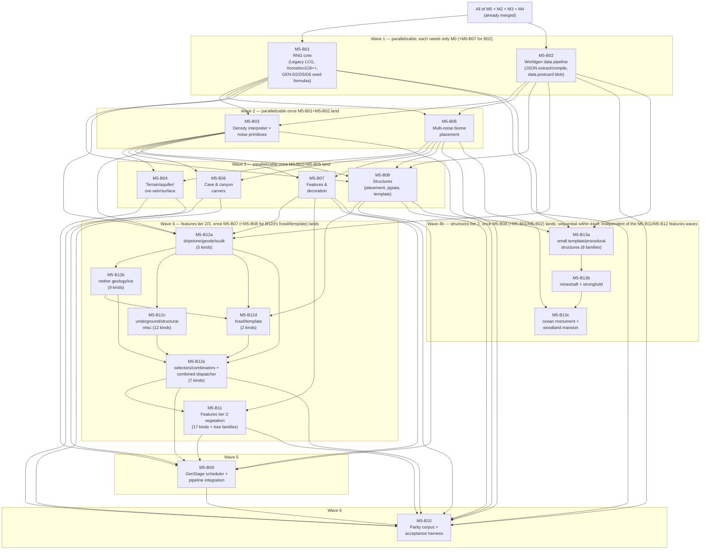

# M5-B00 — Milestone Index: World Generation Parity

## Milestone summary

M5 gives `rc-worldgen` vanilla's data-driven worldgen pipeline end to end: the
bit-exact RNG core both algorithm families and every seed-derivation formula
route through (M5-B01); the vanilla-JSON extraction/compilation pipeline that
turns Mojang's own worldgen datapack into a compiled, committable
`postcard` blob (M5-B02); the density-function interpreter and noise
primitives every later subsystem samples through (M5-B03); terrain fill,
aquifers, ore veins, and surface rules (M5-B04); multi-noise biome placement
(M5-B05); cave/canyon carvers (M5-B06); the 11-step feature/decoration
pipeline (M5-B07); structure-set placement, jigsaw assembly, and template
stamping (M5-B08); the `GenStage` scheduler that assembles all of the above
into one background, off-tick, `RC-WorkerPool`-driven pipeline delivering
completed chunks as Stage-1 structural commands (M5-B09); the
corpus/harness infrastructure that turns `11-roadmap-milestones.md`'s two M5
acceptance criteria into an agent-executable, CI-wired measurement
(M5-B10); and the two features-tier-2/3 continuations that close out
M5-B07's own named deferred-feature backlog — non-vegetation/underground
(the 5-blueprint M5-B12 family: M5-B12a dripstone/geode/sculk, M5-B12b nether
geology/ice, M5-B12c underground/structural misc, M5-B12d fossil/template,
M5-B12e selectors/combinators) and vegetation (M5-B11), split along a
disjoint axis and composed through a two-layer dispatcher (M5-B11's own
`place_configured_feature_vegetation` falls through to M5-B12e's
`place_configured_feature_all`, which itself falls through to M5-B07's
original `place_configured_feature`). The M5-B12 family was originally
drafted as a single blueprint (`M5-B12-features-underground-misc.md`) that
self-declared an `XL` exception to `00-blueprint-spec.md`'s own Sizing rule
(a 1389-line body, a 1144-line Context section); this audit split it into
five conforming `L`-sized blueprints along its own already-drawn family
boundaries and, in the same pass, added the `ctx: &PlacementCtx` parameter
its combined dispatcher was missing (below) — both defects a prior audit
pass had flagged but left unresolved as outside its own assigned scope.
Nineteen blueprints implement M5, drafted and Tier-1-tested — the sixteen
already-established blueprints plus the three-blueprint **M5-B13** family
(M5-B13a small-template/procedural structures, M5-B13b mineshaft/stronghold,
M5-B13c ocean monument/woodland mansion), which closes M5-B08's own
separate structures-tier-2 gap (the 15 non-jigsaw hand-coded structure
families that blueprint named and deferred to a single reserved ID,
reassigned from the single-file M5-B12's own original ID once that
blueprint was drafted against a different, features-only scope —
"Cross-blueprint gaps and reconciliation" below). With M5-B13a/b/c landed,
every content gap this milestone's own text once named as blocking the
GEN-D1/GEN-D27 acceptance gate from being exercised for real is closed at
the drafted-complete level (modulo one genuine wiring gap this audit found
between M5-B13's own `GeneratorRegistry` and M5-B08's already-shipped
`generate_structure_starts`, "Cross-blueprint gaps and reconciliation"
below); the gate's own *measured* exercise still awaits the real jar-gated
data pipeline run and the real production content-resolver table M5-B09/
M5-B10 already name (below).

M5-B01 independently caught and resolved a genuine internal contradiction in
this project's own research corpus (`24-seed-derivation-map.md` §3.1's
incorrect float-truncated-`DOUBLE_UNIT` claim for Xoroshiro's `nextDouble()`,
superseded by `16-rng-internals.md`/`18-float-determinism.md`'s
bytecode-verified exact-power-of-two finding) and a genuine error in
`04-worldgen-parity.md` GEN-D6's own prose (the carver source-chunk seed
formula, corrected to `set_large_feature_seed(world_seed + carver_index,
source_chunk_x, source_chunk_z)`, XOR-combined, multipliers not forced odd —
independently confirmed against `16-rng-internals.md` §7/§8 and propagated
correctly into M5-B06's own carver-seeding implementation). Both resolutions
are stated once, in M5-B01's own Context, and consumed by every downstream
blueprint without re-derivation — this is the intended pattern, not a
one-off. Both corrections have since been applied to the planning/research
corpus itself (`04-worldgen-parity.md` GEN-D6's row, `24-seed-derivation-map.md`
§3.1/§4/§8), so the corpus and every M5 blueprint now agree. The M5-B05/M5-B03 `ClimateSampler` seam — the highest-risk seam
named by this milestone's own task assignment, since the two blueprints were
written in parallel — reconciles cleanly: M5-B05 declares the trait, M5-B03's
own Context explicitly names M5-B05 as "already a known consumer" and
confirms its `EvalContext`/`DensityInterpreter::sample` public shape already
satisfies it with zero change required. GEN-D20's canonical decoration-order
exception is handled consistently across every blueprint that touches it:
M5-B07 defines `DecorationOrderKey { region_local_chunk_index, step,
feature_global_index }` and the sortable-key mechanism; M5-B09 resolves
`region_local_chunk_index` concretely (ascending `(chunk_x, chunk_z)` over the
active generation batch) and enforces the ordering via `DecorationScheduler`;
M5-B10 restates the same single exception category as its own
machine-checkable ledger schema and gates GEN-D27's ≥99.9% match threshold on
zero *undocumented* mismatches, not the raw percentage.

M5-B10 was originally drafted before M5-B09 existed, against an *assumed*
minimal contract (a synchronous, no-I/O `rc_worldgen::pipeline::generate_chunk(...)
-> GeneratedChunk`) that M5-B09's real, merged API did not provide. This is
now resolved: M5-B09's own `pipeline` module additionally exposes
`generate_chunk_sync(chunk_x: i32, chunk_z: i32, ctx: &GenerationContext) ->
ProtoChunk` (M5-B09 Context §P) — the pure, synchronous, single-chunk entry
point M5-B10's own `Md5B09Generator` needed all along, built entirely out of
M5-B09's already-shipped per-rung functions and `DecorationWindow`, calling
nothing new. M5-B10's own Context §A.1/§A.4 and `generator.rs` Deliverables
are restated against this real, merged signature. `Md5B09Generator::generate_chunk`
itself still stays a `todo!()` stub, but for a different, narrower reason now:
it needs a real `GenerationContext` built from a real, production content-resolver
table, which remains a separate, not-yet-written blueprint's job (M5-B09
Context §A) — M5-B09's own API is no longer the blocker. See "Cross-blueprint
gaps and reconciliation" below for what remains.

| ID | Title | Scope |
|---|---|---|
| M5-B01 | RNG Core (Legacy LCG, Xoroshiro128++, Seed-Derivation Hierarchy) | L |
| M5-B02 | Worldgen Data Pipeline (JSON Extraction, Compilation, Postcard Blob) | L |
| M5-B03 | Density-Function Interpreter & Noise Primitives | L |
| M5-B04 | Terrain Fill, Aquifers, Ore Veins & Surface Rules | L |
| M5-B05 | Multi-Noise Biome Placement | L |
| M5-B06 | Cave & Canyon Carvers | L |
| M5-B07 | Features & Decoration (11-Step Placement Pipeline) | L |
| M5-B08 | Structures: Placement, Jigsaw Assembly, Template Stamping | L |
| M5-B09 | GenStage Scheduler & Generation Pipeline Integration | L |
| M5-B10 | Worldgen Parity Corpus & Acceptance Harness | L |
| M5-B11 | Features Tier 2: Vegetation (Trees, Plants, Ocean & Cave Vegetation) | L |
| M5-B12a | Features: Dripstone, Geode & Sculk (Underground Tier 2, Part 1 of 5) | L |
| M5-B12b | Features: Nether Geology & Ice (Underground Tier 2, Part 2 of 5) | L |
| M5-B12c | Features: Underground & Structural Miscellany (Underground Tier 2, Part 3 of 5) | L |
| M5-B12d | Features: Fossil & Template (Underground Tier 2, Part 4 of 5) | L |
| M5-B12e | Features: Selectors, Combinators & the Combined Dispatcher (Underground Tier 2, Part 5 of 5) | L |
| M5-B13a | Structures Tier 2: Small Template & Procedural Structures (Part 1 of 3) | L |
| M5-B13b | Structures Tier 2: Mineshaft & Stronghold (Part 2 of 3) | L |
| M5-B13c | Structures Tier 2: Ocean Monument & Woodland Mansion (Part 3 of 3) | L |

M5-B13a/b/c are the named owner of M5-B08's own structures-tier-2 gap (the
15 non-jigsaw hand-coded structure families that blueprint's Context §A/§J
named individually and deferred to a single reserved ID). The ID was
originally reserved as a single blueprint, `M5-B13`, "TBD once drafted"; it
is now three conforming `L`-sized blueprints split along family-complexity
boundaries, each depending on its predecessor for shared plumbing
(`hand_coded::common`, the `GeneratorRegistry`/`ProceduralPieceData`
additive extension to M5-B08's own `structure/generation.rs` — M5-B13a
creates both, M5-B13b/c each extend them further) — never in parallel with
each other, unlike M5-B11/the M5-B12 family's own mutually-independent
split. (M5-B11 and the M5-B12 family are likewise no longer reserved — all
eleven are drafted and listed in the table above; the ID that was
originally reserved here for structures was `M5-B12` (a single blueprint,
before it was drafted and later split into the M5-B12a-e family below),
reassigned to `M5-B13` once that scope turned out to be features, not
structures — see "Cross-blueprint gaps and reconciliation" below.)

## Dependency graph

**Recommended execution order:**

1. **M5-B01** and **M5-B02** in parallel — neither declares the other as a
   prerequisite (M5-B01 touches only `src/random*.rs`; M5-B02 touches only
   `xtask/src/worldgen_data/` and `src/data/`), and both need only already-merged
   M0 content (M5-B02 additionally reuses M0-B07's `fetch_data.rs`/
   `fixture_manifest.rs`).
2. **M5-B03** and **M5-B05** become startable once M5-B01+M5-B02 land, and are
   mutually independent (M5-B05's own Context states plainly that it calls
   **zero** RNG primitives from M5-B01 and binds only to M5-B02's compiled
   types; M5-B03 does not read M5-B05 at all). This is the milestone's
   highest-risk seam by the task assignment's own framing — resolved cleanly,
   not merely asserted: M5-B03's Context names M5-B05 as an already-satisfied
   consumer of its `EvalContext`/`DensityInterpreter::sample` public shape,
   with the exact adapter shape (`ClimateSampler::sample_climate_raw`, six
   `interpreter.sample(router.<axis>, ...)` calls) spelled out in both
   directions.
3. **M5-B04**, **M5-B06**, **M5-B07**, **M5-B08** become startable once
   M5-B03+M5-B05 land. None of these four lists any of the other three as a
   prerequisite and each touches a disjoint module slice of `rc-worldgen`
   (`terrain/`, `carve/`, `decoration/`, `structure/` respectively) — the one
   file-level overlap is M5-B08's own additive extension to M5-B03's already-
   shipped `density/interpreter.rs`/`density/noise_chunk.rs` (a trailing
   `Option<&BeardifierContext>` parameter on `evaluate_node`, threaded through
   `DensityInterpreter`/`NoiseChunk`'s constructors), which M5-B04/M5-B06/
   M5-B07 never call directly (they consume M5-B03's `sample()` methods, not
   its constructors), so this extension is safe to land in any order relative
   to the other three waves-3 blueprints. M5-B08 additionally needs M5-B01
   (`set_large_feature_seed`/`set_large_feature_with_salt`) and M5-B02
   (compiled `StructureSet`/`TemplatePool`/`ProcessorList` types) directly,
   already covered by wave 1.
4. **The 5-blueprint M5-B12 family** closes 35 of M5-B07's 57 named-deferred
   `Feature` kinds (the non-vegetation half), split into conforming `L`-sized
   blueprints along family boundaries — replacing what an earlier, single
   `M5-B12` draft attempted as one self-declared `XL`-scoped blueprint (a
   spec violation, resolved by this split, "Cross-blueprint gaps and
   reconciliation" below):
   1. **M5-B12a** (dripstone/geode/sculk, 5 kinds) becomes startable once
      M5-B01, M5-B02, M5-B03, M5-B07 land. It creates
      `decoration/underground/mod.rs` and the 4 shared helpers
      (`eval_feature_rule_test`, `FloatProvider`, an internal ellipsoid-cell
      iterator, `DIRECTION_ORDER`) every other family member reuses.
   2. **M5-B12b** (nether geology/ice, 9 kinds) and **M5-B12c**
      (underground/structural misc, 12 kinds) become startable once M5-B12a
      lands, and are mutually independent (both only need M5-B12a's shared
      helpers; each adds its own new files plus an additive `pub mod` line to
      `underground/mod.rs`). M5-B12b additionally defines `FreezeResolver`.
   3. **M5-B12d** (fossil/template, 2 kinds) becomes startable once M5-B12a,
      M5-B12b (for `FreezeResolver`, bundled into `UndergroundFeatureContext`),
      and **M5-B08** land (a corrected/added prerequisite beyond the original
      single-file M5-B12's own task assignment — its `fossil`/`template`
      kinds need M5-B08's structure-template/processor types).
   4. **M5-B12e** (selectors/combinators, 7 kinds) becomes startable once
      M5-B12a, M5-B12b, M5-B12c, and M5-B12d all land — it is the family's
      own final blueprint, the first to have every sibling's kind functions
      available, and defines the real, complete combined dispatcher,
      `place_configured_feature_all`, that supersedes M5-B07's own
      `place_configured_feature` as `decorate_chunk`'s real per-feature call
      site (an additive, one-line change to that file plus one new trailing
      `bridge: Option<&UndergroundFeatureContext>` parameter on
      `decorate_chunk`'s own signature). `place_configured_feature_all`
      carries a `ctx: &PlacementCtx` parameter from its first draft — the
      earlier single-file M5-B12 draft omitted this, which meant 5 of its own
      selector-family kinds could not actually be implemented as specified;
      landing the family's dispatcher last, only once every sibling's kind
      functions exist, removes the need to ever draft it without `ctx`.
5. **M5-B11** needs M5-B07 (its own base tree/foliage/dispatch machinery)
   **and M5-B12e** (its own composed dispatcher,
   `place_configured_feature_vegetation`, falls through to M5-B12e's
   `place_configured_feature_all` — forwarding `ctx`, which that function now
   requires — for every kind M5-B11 does not itself claim, and `driver.rs`'s
   one per-feature call site is edited by M5-B07, then M5-B12e, then M5-B11
   in that order to converge on one consistent final state). It closes the
   remaining 17 vegetation-classified `Feature` kinds plus the 6 remaining
   `TrunkPlacer`, 8 remaining `FoliagePlacer`, the 1-member `RootPlacer`, and
   6 of 10 `TreeDecorator` kinds — together with the M5-B12 family, every one
   of M5-B07's 57 named-deferred kinds is now accounted for (7
   already-implemented + 17 + 35 + 5 End-exclusive-out-of-scope = 64, the
   complete vanilla `Feature`-kind registry including `random_patch`, which
   both M5-B11 and the M5-B12 family independently noted is missing from
   `docs/research/mc-26.2/05-worldgen.md` §3.13's own 63-name enumeration —
   see "Cross-blueprint gaps and reconciliation" below for the residual,
   smaller gaps this does **not** close).
6. **M5-B09** needs all of M5-B01 through M5-B08 **and M5-B11/the M5-B12
   family too** — it is the actual `GenStage`-scheduler-integration blueprint every
   one of M5-B03 through M5-B08's own Deliverables names and defers to,
   calling each stage's already-shipped driver function in GEN-D25's fixed
   order against a non-ECS `ProtoChunk`, and closing M5-B05's own open
   `ClimateSampler` seam with a real implementation for the first time.
   `M5-B09-generation-pipeline.md`'s own text reflects the real, final
   `decoration::decorate_chunk` contract: M5-B12e's own additive trailing
   `bridge: Option<&UndergroundFeatureContext>` parameter, and M5-B11's own
   composed dispatcher chain (`decorate_chunk`'s internal per-feature call
   site reaching M5-B11's `place_configured_feature_vegetation`, falling
   through to M5-B12e's `place_configured_feature_all`, falling through to
   M5-B07's original `place_configured_feature`). Its own `advance_to_features`
   calls `decoration::decorate_chunk` passing `bridge: None`, since no real
   `UndergroundFeatureContext` producer exists yet.
7. **M5-B10** needs M5-B01 through M5-B09 transitively (for its corpus/hash
   machinery) and, for real, needs M5-B09 too: `Md5B09Generator`'s own
   struct fields reference `rc_worldgen::pipeline::GenerationContext` directly
   (Context §A.4), so `cargo build -p rc-gametest` cannot type-check without
   M5-B09's real `pipeline` module present, even though `generate_chunk`'s own
   *body* stays a `todo!()` stub and every Tier-1 test exercises only
   `FixedChunkGenerator`. Its **real** parity/throughput gate (`m5-acceptance`,
   scheduled/nightly, not part of its own Done state) is unreachable until the
   real production content-resolver table (Context §A.4) lands.
8. **M5-B13a**, **M5-B13b**, **M5-B13c** become startable once M5-B01,
   M5-B02, and M5-B08 land (M5-B13c additionally needs M5-B05, for its own
   ocean-monument biome gate). Unlike every other multi-part family in this
   milestone, the three are **not** mutually parallel: M5-B13b depends on
   M5-B13a for shared plumbing (`hand_coded::common`'s box-fill/heightmap/
   loot-container helpers, the `GeneratorRegistry`/`ProceduralPieceData`
   additive extension to M5-B08's `structure/generation.rs`), and M5-B13c
   depends on both M5-B13a and M5-B13b for the same reason, extended twice
   further — each blueprint's own Deliverables applies one more additive
   edit to the identical two files (`structure/generation.rs`,
   `structure/hand_coded/mod.rs`), so the three must land strictly in
   alphabetical order. None of the three is a prerequisite for M5-B09 or
   M5-B10 — no landed blueprint yet constructs a `GeneratorRegistry` and
   passes it anywhere a `GenStage`-integration caller would need it (M5-B13a
   Context §A's own noted omission: `JigsawGenerator` itself is still a bare
   unit struct with unfulfillable field needs, left unfixed as out of that
   blueprint's own file scope) — closing that wiring gap, and M5-B08's own
   `generate_structure_starts`'s inability to route through the new
   registry-shaped `dispatch_generator` at all (this audit's own finding,
   "Cross-blueprint gaps and reconciliation" below), is a future
   GenStage-integration blueprint's job.

## Per-blueprint summary

**M5-B01 — RNG Core.** Both of vanilla's RNG algorithm families
(`RcLegacyRandom`: 48-bit LCG, bit-compatible with `java.util.Random`;
`RcXoroshiroRandom`: Xoroshiro128++, wrapping `rand_xoshiro`'s raw core only,
never its `RngCore` convenience methods), every hand-matched derived-value
formula (`next_int`, both `next_int_bounded` shapes — Legacy's power-of-two
fast path + rejection loop vs. Xoroshiro's Lemire multiply-high rejection,
structurally different algorithms, GEN-D4), the 128-bit seed upgrade/mixing
chain (`mix_stafford13`, GEN-D5), both positional-factory flavors
(`mth_get_seed`'s mixed 32/64-bit-width multiply — independently ranked the
single highest-risk formula in the whole domain by two research documents —
`java_string_hash_code` for Legacy, MD5 for Xoroshiro), `WorldgenRandom<B>`'s
always-legacy-formula quirk (even when wrapping a Xoroshiro backend — a real,
source-confirmed vanilla behavior, mechanically proven divergent from native
Xoroshiro in this blueprint's own acceptance tests), the complete GEN-D6
seed-derivation formula table (decoration, feature, large-feature, large-
feature-with-salt, carver, slime-chunk), `random_sequence` seeding (GEN-D5),
and GEN-D2's seed-string parsing grammar. Independently resolves two real
research-corpus defects (Context §K's `DOUBLE_UNIT` contradiction, §I's
GEN-D6 carver-formula correction) rather than silently picking a side.
*Decisions covered:* GEN-D2–D6 (full).

**M5-B02 — Worldgen Data Pipeline.** `xtask fetch-worldgen-data`/
`compile-worldgen-data`, extending NET-D9's jar-acquisition pipeline: unzips
`data/minecraft/{worldgen,dimension,dimension_type}/**` from the same
legally-obtained `server.jar`, parses with `serde_json` (dev-time only,
`deny_unknown_fields`), canonicalizes into id-interned compiled Rust structs
covering ten JSON node families (density functions — 34 variants, noise
params, noise router, noise generator settings, surface rules, configured
carvers, configured/placed features, structure sets/structures/template
pools/processor lists, biome parameter lists with GEN-D14's quantization
confirmed exact via `17-noise-math.md` §3.9), and `postcard`-encodes into one
committed `data.postcard` blob per protocol version (GEN-D9), loaded once via
`include_bytes!`/`OnceLock` (`data::load()`). GEN-D23/D24's custody split
(structure NBT templates never committed; worldgen JSON's compiled form is
committable functional data) is restated and applied to this blueprint's own
artifacts. The manual, jar-gated fetch/compile run against a real 26.2
`server.jar` is explicitly outside this blueprint's own CI-checkable Done
state (mirroring M0-B07's precedent) — required before any blueprint
depending on real compiled data can be exercised for real. *Decisions
covered:* GEN-D7, GEN-D8, GEN-D9, GEN-D12 (re-verified), GEN-D13, GEN-D14
(quantization resolved), GEN-D17, GEN-D19, GEN-D21, GEN-D23/D24, WS-D13.

**M5-B03 — Density-Function Interpreter & Noise Primitives.** A bit-exact
noise-primitive library (`ImprovedNoise`, `PerlinNoise`, `NormalNoise`,
`SimplexNoise`, `BlendedNoise`, `EndIslands` — GEN-D11's small enumerable set
of natively-hardcoded, non-JSON-driven algorithms) and a complete interpreter
over M5-B02's compiled `DensityFunctionGraph` — all 34 node kinds, with the
five caching/marker kinds implemented as real memoization matched to
vanilla's `NoiseChunk` cell/interpolation machinery, not pass-through
no-ops (GEN-D12's binding requirement). Two evaluation tiers: `Tier
1 — DensityInterpreter::sample` (pure, uncached, single-point — already the
exact shape M5-B05's `ClimateSampler` seam needs, zero change required) and
`Tier 2 — NoiseChunk` (the real stateful cell/cache/interpolation machinery a
future chunk-fill driver walks). GEN-D10's float-determinism discipline
(plain IEEE-754 only, no `mul_add`/FMA, no algebraic reassociation)
restated as binding Rust guardrails. `Beardifier{}`'s fresh-generation `0.0`
default is an explicitly named, forward-compatible seam M5-B08 later fills
via an additive `Option<&BeardifierContext>` parameter — not a silent stub.
*Decisions covered:* GEN-D8 (evaluation half), GEN-D10, GEN-D11, GEN-D12
(full), GEN-D13 (sampling half).

**M5-B04 — Terrain Fill, Aquifers, Ore Veins & Surface Rules.** The `Noise`
and `Surface` `GenStage` bodies: `fill_chunk_from_noise` (per-column
`final_density` evaluation, solid/air resolution); aquifers (GEN-D15,
barrier/floodedness/spread fields, never reading neighbor-chunk block state);
ore veins (GEN-D16, the density-router-integrated `vein_toggle`/
`vein_ridged`/`vein_gap` per-block evaluation — every named constant
(edge-roundoff `20.0`/`-0.2`, veininess gate `0.4`, richness range
`[0.4,0.6]`→`[0.1,0.3]`, gap gate `-0.3`, solidness reject `0.7`, raw-ore
chance `0.02`) verified bit-for-bit against `24-seed-derivation-map.md` §3.4);
and surface rules (GEN-D17, the sequential condition-tree interpreter —
`y_above`/`water`/`biome`/`stone_depth`/`hole`/`noise_threshold`/
`vertical_gradient`/`temperature`/`steep`/boolean combinators, first-match-
wins `sequence`). Several sub-formulas are explicitly flagged moderate
confidence for a future GEN-D27 reconciliation pass rather than presented as
verified (aquifer pressure/barrier combining arithmetic, floodedness
threshold, `stone_depth`'s offset formula, `steep`'s chunk-edge clamping,
bandlands' 192-entry palette generation — deferred via a caller-supplied
resolver closure). *Decisions covered:* GEN-D13 (consumption half), GEN-D15,
GEN-D16, GEN-D17 (full), GEN-D25 (Noise/Surface stage bodies).

**M5-B05 — Multi-Noise Biome Placement.** GEN-D14's complete climate math:
the 7-dimension quantized-parameter distance/fitness formula (`quantize_climate`
confirmed exact — `(v * 10000.0) as i64`, truncate-toward-zero — against
`17-noise-math.md` §3.9), a brute-force parameter-list search (GEN-D14's own
sanctioned default) plus a structurally-faithful `BiomeSearchTree`
accelerator kept deliberately opt-in, not wired as the default (per GEN-D14's
own "brute force until profiling says otherwise" framing); the
`ClimateSampler` seam M5-B03's noise-router evaluator implements (§56 of this
blueprint, verified compatible from both sides — the milestone's
highest-risk seam, resolved); `MultiNoiseBiomeSource<B>`, `fill_biome_column`
wiring into M2-B01's `BiomeColumn`; and vanilla's two-pass spawn-point
climate search (moderate confidence, structural-only acceptance tests). Uses
**zero** RNG primitives from M5-B01 (biome placement is RNG-free per the
research corpus, stated explicitly rather than left to be discovered).
*Decisions covered:* GEN-D13 (climate-target fields), GEN-D14 (full),
GEN-D25/D26 (biome placement's pure-function property).

**M5-B06 — Cave & Canyon Carvers.** GEN-D18's bounded-neighborhood carve
algorithm: for each of 289 candidate source chunks in a target chunk's 17×17
neighborhood, re-derives that source chunk's own carve geometry via M5-B01's
corrected carver-seed formula (`set_large_feature_seed(world_seed +
carver_index, source_chunk_x, source_chunk_z)`, XOR-combined, carver_index
resetting to `0` per source chunk — mechanically proven distinct from both
the decoration-seed formula and a non-resetting index in this blueprint's own
acceptance tests) and carves into the target wherever that geometry overlaps
it — a pure function of coordinates only, never reading a neighbor's
materialized block state (GEN-D18's own precise claim). Cave/canyon
tunnel-walk math, room sizing, and several `HeightProvider`/config-field
shapes are explicitly flagged `[C-MED]`/`[C-LOW]` placeholders pending a
future golden-corpus reconciliation (M5-B10 does not yet provide this — see
gaps below). Deliberately no memoization across the 289-chunk redundant
recomputation (correctness-neutral per GEN-D26, matching vanilla's own
behavior exactly). Three real gaps in prior M5 blueprints are closed only
with trait boundaries + safe defaults, not concrete implementations:
`AquiferSampler` (`DisabledAquifer` default), `SurfaceRetopper` (`NoRetop`
default), `BiomeCarverSource` (no default — WorldgenData has no per-biome
carver-list field yet, deferred to M5-B02's own future revision). *Decisions
covered:* GEN-D18 (full), GEN-D6 (carver formula, corrected and consumed),
GEN-D10 (extended with `Mth.sin`/`cos` table-vs-real-trig split).

**M5-B07 — Features & Decoration.** GEN-D19's 11 fixed decoration steps
(`RawGeneration` through `TopLayerModification`, compiled by M5-B02 as
`DecorationStep`), `FeatureSorter`'s cross-biome global feature index (DFS
topological sort over registry-iteration-order edges — moderate confidence on
exact edge-storage order, flagged for GEN-D27), the 15-kind placement-modifier
interpreter, a representative explicitly-tiered set of terminal `Feature`
algorithms (ore, disk, spring, lake, tree, random-patch, simple-block) with
every one of the remaining 56 of 63 vanilla feature kinds and 14 of 18
trunk/foliage placer kinds individually named and deferred to a future
features-tier-2/3 blueprint — a genuine, bounded parity gap that must close
before GEN-D27's real 99.9%-chunk-hash gate is exercised, not a silent
omission. Defines `DecorationOrderKey { region_local_chunk_index, step,
feature_global_index }`, GEN-D20's own concrete, sortable tie-break
mechanism (later resolved and enforced by M5-B09). Makes one small, additive,
explicitly-flagged extension to M5-B02's own pipeline (per-biome
`features: [HolderSet<PlacedFeature>; 11]`, read from
`data/minecraft/worldgen/biome/*.json`, a family M5-B02's own extraction walk
already copies to disk but never named) — flagged for M5-B02's next revision,
not silently absorbed. *Decisions covered:* GEN-D19 (full), GEN-D6 (feature-
seed call sites), GEN-D20 (mechanism defined), GEN-D25/D26 (Features stage).

**M5-B08 — Structures.** Structure-set placement (`random_spread` grid+jitter
with all four `FrequencyReductionMethod` variants including the `DEFAULT`
param-order hazard and buried-treasure's two-independent-RNG-stream quirk;
`concentric_rings`' once-per-world ring algorithm); the structure-starts/
structure-references two-phase flow; the complete jigsaw assembly algorithm
(template pools, pool aliases, priority-bucketed BFS placement, rotation/
mirror, terrain adaptation, beardifier density contribution — wired into
M5-B03's interpreter via an additive `Option<&BeardifierContext>` parameter on
`evaluate_node`, explicitly preserving every pre-existing M5-B03 call site's
behavior via `None`); operator-supplied structure-NBT-template loading
(GEN-D23, `DirectoryTemplateSource` + the full 11-processor pipeline) and
structure-start/reference chunk-NBT persistence (extending M2-B04's own
`chunk_nbt.rs`). Every non-jigsaw (hand-coded) structure family — 15 of them,
named individually — is explicitly deferred to a future blueprint, since the
research corpus does not document their piece-generation grammars precisely
enough to restate bit-exactly here. Several formulas (non-`LegacyType1`
frequency reducers, the ring-growth loop assembly, the beardifier per-cell
kernel, jigsaw-specific NBT field names) are explicitly flagged moderate
confidence for GEN-D27 reconciliation. *Decisions covered:* GEN-D6 (large-
feature/salt seed call sites), GEN-D21 (full), GEN-D22 (full), GEN-D23 (full,
concrete mechanism), GEN-D25 (StructureStarts/References stage bodies).

**M5-B12a-e — Features: Underground & Miscellaneous (Non-Vegetation Tier
2/3), a 5-blueprint family.** Together close 35 of M5-B07's 57 named-deferred
`Feature` kinds — every kind that is not vegetation/plant-like — split along
family boundaries into conforming `L`-sized blueprints: **M5-B12a**
(dripstone family — `large_dripstone`, `speleothem`, `speleothem_cluster` —
plus `geode`, `sculk_patch`; also creates `decoration/underground/mod.rs` and
the 4 shared helpers — `eval_feature_rule_test`, `FloatProvider`, an internal
ellipsoid-cell iterator, `DIRECTION_ORDER` — every sibling reuses); **M5-B12b**
(nether geology — `delta_feature`, `basalt_columns`/`basalt_pillar`,
`netherrack_replace_blobs`, `glowstone_blob` — plus ice/cold — `iceberg`,
`blue_ice`, `freeze_top_layer`, `spike`; defines `FreezeResolver`); **M5-B12c**
(underground/miscellaneous geological — `root_system`, `multiface_growth`,
`underwater_magma`, `monster_room`, `block_pile`, `block_column`,
`replace_single_block`, `block_blob` — plus structural/world-init miscellany
— `desert_well`, `void_start_platform`, `fill_layer`, `bonus_chest`);
**M5-B12d** (the two structure-template-integrated kinds — `fossil`,
`template`, consuming M5-B08's template/processor machinery through a new
`DecorationStructureSink` bridge adapter and `UndergroundFeatureContext`);
**M5-B12e** (the seven utility/meta-combinator kinds — `no_op`, the four
selector kinds, `sequence`, `scattered_ore` — and, since it is the family's
own final blueprint with every sibling's kind functions available, the real,
complete combined dispatcher). Resolves the task's own "who owns `ore`"
ambiguity precisely: M5-B04 owns ore **veins** (GEN-D16, a density-router
mechanism with zero relationship to the `Feature` registry); the
`ore`/`disk`/`scattered_ore` **Feature** kinds are the entirely separate
GEN-D19 pipeline M5-B07/M5-B12e implement, confirmed by GEN-D16's own
decision text. M5-B12e defines `place_configured_feature_all`, the combined
dispatcher superseding M5-B07's own `place_configured_feature` as
`decorate_chunk`'s real per-feature call site (one additive line change,
plus one new trailing `bridge: Option<&UndergroundFeatureContext>` and one
`ctx: &PlacementCtx` parameter on `decorate_chunk`'s signature — Constraints
(d) confirms M5-B07's own files are otherwise untouched). `ctx` is present
from `place_configured_feature_all`'s first draft — landing the family's
combined dispatcher in its own final blueprint, only once every sibling's
kind functions exist, is what makes carrying `ctx` from the start
straightforward: 5 of M5-B12e's own selector-family kinds re-enter
`run_placement_chain` and need it. The 4 End-dimension-only kinds among the
family's own 39-kind non-vegetation half (`end_platform`, `end_spike`,
`end_island`, `end_gateway`) are named individually and deferred with no
reserved owner yet, consistent with this index's own established
convention. This family supersedes an earlier, single-file `M5-B12` draft
that self-declared an `XL` exception to `00-blueprint-spec.md`'s own Sizing
rule (a 1389-line body, a 1144-line Context section, both well past the
spec's own "~800"/"~300... split anything larger" limits) and whose combined
dispatcher was missing the `ctx` parameter entirely — both defects a prior
audit pass had flagged but left unresolved as outside its own assigned
scope; this audit's own pass resolved both by drafting the family fresh
along its own already-drawn boundaries. *Decisions covered:* GEN-D19
(continuation of M5-B07's own scope), GEN-D6 (feature-seed call sites,
unchanged mechanism), GEN-D20 (restated non-conflation), GEN-D23/GEN-D24
(restated, not re-decided, for `fossil`/`template`), GEN-D16 (ore/vein
boundary, resolved precisely).

**M5-B11 — Features Tier 2: Vegetation (Trees, Plants, Ocean & Cave
Vegetation).** Closes the remaining 17 vegetation-classified `Feature` kinds
M5-B07 named and deferred (`fallen_tree`, `huge_red_mushroom`/
`huge_brown_mushroom`, `vines`, `vegetation_patch`/`waterlogged_vegetation_patch`,
`seagrass`, `kelp`, `coral_tree`/`coral_mushroom`/`coral_claw`, `sea_pickle`,
`bamboo`, `huge_fungus`, `nether_forest_vegetation`, `weeping_vines`/
`twisting_vines`), together with the full `TrunkPlacer` family (6 new kinds:
`forking`/`giant`/`mega_jungle`/`dark_oak`/`fancy`/`cherry`, alongside
M5-B07's already-shipped `straight`/`bending`), the full `FoliagePlacer`
family (8 new kinds alongside M5-B07's `blob`/`spruce`), the single-member
`RootPlacer` family (`mangrove_root_placer`, a new additive
`TreeConfiguration.root_placer` field), and 6 of the 10 `TreeDecorator` kinds
(`beehive`, `trunk_vine`, `leave_vine`, `cocoa`, `attached_to_leaves`,
`attached_to_logs` — `pale_moss`/`creaking_heart`/`alter_ground`/
`place_on_ground` remain named-deferred with no reserved owner). Reconciles
its own classification against the M5-B12 family's real, already-drafted
content (agreement on 17 of 18 names the family independently lists as
vegetation-owned; the one discrepancy, `chorus_plant`, is genuinely
End-dimension-exclusive and is left unimplemented anywhere in this project —
a real, small, honestly-flagged gap, harmless in practice since GEN-D1
already excludes the End). Defines `place_configured_feature_vegetation`,
composing with M5-B12e's own dispatcher (tries its own 17 kinds first, falls
through to M5-B12e's `place_configured_feature_all` — forwarding `ctx`,
which that function requires — for everything else) — `driver.rs`'s one
per-feature call site is therefore edited by three blueprints in sequence
(M5-B07 defines it, M5-B12e changes it, M5-B11 changes it again), converging
correctly only if applied in that order. Together, M5-B11 and the M5-B12
family account for all 64 named vanilla `Feature` kinds with no gap and no
double-ownership (7 already-implemented by M5-B07 + 17 here + 35 across
M5-B12a-e + 5 End-exclusive out of scope = 64, cross-checked against
`docs/research/mc-26.2/05-worldgen.md` §3.13's own 63-name enumeration plus
`random_patch`, which both M5-B11 and the M5-B12 family independently note
is a real, unambiguous vanilla kind that research document's own list
omits). *Decisions covered:* GEN-D19 (continuation of M5-B07's own scope),
GEN-D6 (feature-seed call sites, unchanged mechanism), GEN-D8/D10
(interpreter-over-JSON architecture, float-determinism), GEN-D20 (restated
non-conflation).

**M5-B09 — GenStage Scheduler & Generation Pipeline Integration.** Drives one
chunk through the real, research-verified **12**-rung `ChunkStatus` ladder
(`empty → structure_starts → structure_references → biomes → noise → surface
→ carvers → features → initialize_light → light → spawn → full` —
corrected from `04-worldgen-parity.md`'s own GEN-D25 mermaid diagram, which
omits `spawn`; documented and worked around per this project's reconciliation
convention, not silently patched), calling M5-B03 through M5-B08's
already-shipped functions in that exact order against a non-ECS `ProtoChunk`.
Closes M5-B05's own open `ClimateSampler` seam with a real `RouterClimateSampler`
implementation for the first time. `WorldgenScheduler` dispatches
`structure_starts` through `carvers` as independent, zero-shared-state
`RC-WorkerPool` jobs (GEN-D26's "any interleaving, bit-identical output"
holds by direct inspection); `features` is the one rung with real shared
mutable state, gated by `DecorationScheduler`'s GEN-D20 admission invariant.
An explicit EDF admission gate (`RegionOverdueSource`) ensures no worldgen job
is ever dispatched onto `RC-WorkerPool` while any region is overdue
(ARCH-D20), proven by a dedicated acceptance test. `initialize_light`/`light`
stay pure status markers by binding architectural decision — M4-B07's own
already-audited `run_stage8_lighting` recomputes from `LightColumn::
new_uninitialized()` on a chunk's next Stage 8, so this pipeline does not
duplicate a second light propagator. `spawn` is a documented, bounded no-op
(vanilla's own `spawnOriginalMobs` is itself non-seed-reproducible and cannot
be part of GEN-D1's bit-identical criterion; real mob population needs a live
`bevy_ecs::World` this pipeline structurally cannot touch before `full`).
Rewrites M2-B05's `IoPool`/`ChunkLifecycleManager` load-miss seam from a
concrete `SuperflatFiller` parameter to a generic `ChunkGenerator` trait
object, with `SuperflatFiller` becoming one implementor (M2's own behavior
preserved verbatim) alongside the real `WorldgenScheduler`. Also exposes
`generate_chunk_sync(chunk_x, chunk_z, ctx) -> ProtoChunk` — a pure,
synchronous, single-chunk entry point built entirely out of the same
per-rung functions and `DecorationWindow`, for non-scheduled, in-process
callers that need one fully-generated chunk with no `RC-WorkerPool` and no
channel (M5-B10's own corpus/parity-check harness is the first such caller).
*Decisions covered:* GEN-D20 (mechanism enforced), GEN-D21/D22 (exploited for
zero cross-task synchronization), GEN-D25 (full execution model), GEN-D26
(full), ARCH-D20 (concrete EDF gate).

**M5-B10 — Worldgen Parity Corpus & Acceptance Harness.** `xtask fetch-corpus
worldgen` (a fully deterministic, 10,000-chunk corpus across a fixed seed set
— `0`, community reference seeds, cryptographically random seeds, `i64`
extremes — and coordinate samples stressing every subsystem, extracting
vanilla reference hashes from a live oracle server's own on-disk region files
via a from-scratch `rc-anvil`-independent reader per GEN-D27's explicit
"deliberately not `03`'s own persistence format" mandate) and `xtask
parity-check worldgen` (regenerates every corpus chunk, hashes it identically,
diffs against the oracle, and gates on **zero undocumented mismatches**
outside GEN-D20's own pinned exception category — restated here as a
machine-checkable exception-attribution ledger, not merely a percentage
threshold). A throughput leg (20 bots, render distance 12, p99 tick budget,
zero EDF-admission-violation observability) measures M5's second roadmap
acceptance criterion. Both legs, plus a unified `xtask m5-report`, are wired
into a scheduled/nightly `m5-acceptance` CI job from this blueprint's own
merge onward — its first meaningfully green run, not this blueprint's own
Tier-1 Done state, is what closes M5's roadmap acceptance criteria. Its
`Md5B09Generator` adapts M5-B09's real, merged `generate_chunk_sync`
(building/caching one `GenerationContext` per corpus seed), though its own
`generate_chunk` body stays a `todo!()` stub until a real production
content-resolver table exists to build a real `GenerationContext` from. This
blueprint's own Tier-1 *test* gate is fully self-sufficient (harness
self-tests against synthetic data only, `FixedChunkGenerator`, no
oracle/Java/network required); its Tier-1 *build* does now require M5-B09's
real `pipeline` module to exist and compile.
*Decisions covered:* GEN-D27 (both tiers), GEN-D20 (exception ledger), GEN-D25/
D26 (verified, not re-decided), ARCH-D19/D20 (throughput leg), TEST-D12/D13.

**M5-B13a — Structures Tier 2: Small Template & Procedural Structures.**
Implements 8 of the 15 non-jigsaw structure families M5-B08 Context §A/§J
named and deferred — `desert_pyramid`, `jungle_temple`, `swamp_hut`, `igloo`,
`ocean_ruin`, `shipwreck`, `buried_treasure`, `ruined_portal` — each a
concrete `generation::StructureGenerator` (M5-B08's own trait). Restates the
full fifteen-family map and its three-way M5-B13a/b/c ownership split, and
resolves the dimension-deferred remainder (`fortress`, `end_city`,
`nether_fossil` — Nether/End-only, no reserved owner, matching this index's
own established convention for the four End-exclusive `Feature` kinds).
Builds the shared `hand_coded::common` infrastructure every M5-B13 sibling
reuses (box-fill primitives over `StructureBlockSink`, a ground-height
averaging seam, a pending-loot-container recorder) and replaces M5-B08's own
single-generator `dispatch_generator` with a `GeneratorRegistry`-keyed
version (additive to M5-B08's `structure/generation.rs`) — seven of its
eight families reuse `PieceKind::Jigsaw` directly (a single fixed-rotation
template stamp is structurally identical to a one-element, zero-junction
jigsaw piece, an explicit, justified design choice avoiding a redundant
parallel piece-replay path); only `buried_treasure` (no template at all)
needs the new `PieceKind::Procedural` variant. Confidence is tiered exactly
as M5-B04/M5-B06/M5-B08 already established (HIGH/MODERATE/LOW), with every
numeric constant this blueprint invents outright (igloo basement stack
offsets, ocean-ruin cluster radius, shipwreck embed depth, ruined-portal
Y-search ranges) explicitly flagged for a future GEN-D27 reconciliation
pass. *Decisions covered:* GEN-D21 (8 more concrete instances), GEN-D23
(zero new template-loading code), GEN-D6 (`set_large_feature_seed` call
sites, restated per family).

**M5-B13b — Structures Tier 2: Mineshaft & Stronghold.** Implements 2 more
families. Stronghold reuses M5-B08's already-implemented `concentric_rings`
ring-position math unmodified and adds only the piece-graph generation that
blueprint explicitly left out — a retry-until-portal-room weighted piece BFS
(`MAX_DEPTH=50`, the 11-kind `STRONGHOLD_PIECE_WEIGHTS` table, salt-
incrementing retry loop), this blueprint's own best-grounded family (its
piece weight table and both depth gates independently cross-confirmed by
two separate sources). Mineshaft is explicitly, honestly LOW confidence
throughout its own eager corridor/crossing/room random-walk shape — neither
available source documents corridor length ranges, branching probabilities,
or piece counts — shipped anyway as a concrete, internally consistent,
deterministic, terminating reconstruction, flagged for GEN-D27
reconciliation rather than left as a silent gap. Both families' own
bounded-retry/bounded-piece-count safety caps (`MAX_RETRY_ATTEMPTS = 20`,
`MAX_PIECES = 40`) are explicit, documented, justified deviations from
vanilla's own unbounded generation (this repository's own binding
"explicitly documented, bounded, justified exception" principle). *Decisions
covered:* GEN-D21, GEN-D6, GEN-D23 (M5-B08's persistence/replay seam, reused
not re-derived).

**M5-B13c — Structures Tier 2: Ocean Monument & Woodland Mansion.**
Implements the final 2 families — the least-documented pair in the whole
fifteen-family set, by a wide margin. Ocean monument (a strict 29×29
all-required-biome gate, then a fixed-grid, non-template, box-fill room
layout) is this blueprint's own single lowest-confidence algorithm in the
entire M5-B13 family, stated as such rather than dressed up as more certain
than it is — neither available source documents a piece-by-piece generation
algorithm. Woodland mansion is better-grounded: the research corpus confirms
real numbers (an 11×11 planar room grid, a fixed `(7,4)` 3×3 foyer, four
recursive corridors with base lengths `6/6/3/3`, three floors) this
blueprint's own algorithm is built directly around; its own rooms reuse
`PieceKind::Jigsaw` (M5-B13a's own convention) since they are genuinely
template-stamped, needing only one new `ProceduralPieceData` variant for its
post-placement cobblestone backfill. The corpus's own unresolved `"11x11x5-
cell"` qualifier is deliberately left open rather than guessed at — a
documented, honest incompleteness, not a silently fabricated interpretation.
Completes the fifteen-family map: every non-jigsaw structure family is now
either implemented (this blueprint and its two siblings), jigsaw-covered (no
code needed), or explicitly dimension-deferred with no reserved owner
(`fortress`, `end_city`, `nether_fossil`) — verified by this audit as a
complete, non-overlapping accounting against the 26.2 `StructureType`
registry, with no double-ownership against M5-B12c's `monster_room`/
`desert_well` (real *Feature* kinds, an entirely different registry) or
M5-B12d's `fossil` *Feature* kind (a naming coincidence with the
dimension-deferred `nether_fossil` *structure*, never the same code path —
both M5-B13a and M5-B12d's own text name this distinction explicitly).
*Decisions covered:* GEN-D21, GEN-D6, GEN-D23.

## M5 acceptance criteria → blueprint mapping

| # | Acceptance criterion (`11-roadmap-milestones.md`) | Blueprint(s) | Status |
|---|---|---|---|
| 1 | For a fixed world seed, 10,000 generated chunks' block-state arrays hash-match a vanilla-server-generated reference corpus for **at least 99.9%** of chunks, checked by `xtask parity-check worldgen`; any exceptions documented, bounded, and attributable to a specific named source of non-determinism. | M5-B01 through M5-B08 + M5-B11/M5-B12a-e + M5-B13a/b/c (the generation content itself — with M5-B11/M5-B12a-e now closing the `Feature`-kind registry completely and M5-B13a/b/c now closing the structure-family registry completely, see below) + M5-B09 (assembles it into one real pipeline, and exposes `generate_chunk_sync` for M5-B10's own use) + M5-B10 (the corpus, the hash/diff machinery, the exception-attribution ledger and its own machine-checked gate) | **Not yet reachable as a real, green measurement; both content-registry gaps this row previously named are now closed, several smaller gaps remain.** The complete 64-name vanilla `Feature`-kind registry (63 names in `docs/research/mc-26.2/05-worldgen.md` §3.13 plus `random_patch`, a real kind that document's own enumeration omits — independently caught by both M5-B11 and the M5-B12 family) is now accounted for exactly once each, with no silent gap and no double-ownership, verified by this audit: 7 by M5-B07 (`ore`, `disk`, `spring_feature`, `lake`, `tree`, `random_patch`, `simple_block`), 17 by M5-B11 (vegetation), 35 across M5-B12a-e (underground/misc), 5 End-dimension-exclusive and out of scope for both (`chorus_plant`, `end_platform`, `end_spike`, `end_island`, `end_gateway` — GEN-D1's own scope already excludes the End). The complete 15-family non-jigsaw `StructureType` registry (`docs/research/mc-26.2/06-structures.md` §3.1) is likewise accounted for exactly once each, verified by this audit: 8 by M5-B13a, 2 by M5-B13b, 2 by M5-B13c, 3 dimension-deferred with no reserved owner (`fortress`, `end_city`, `nether_fossil`), no double-ownership against M5-B12c's `monster_room`/`desert_well` or M5-B12d's `fossil` *Feature* kind (both entirely separate registries from the `nether_fossil` *structure*). What remains open: (a) the manual jar-gated `fetch-worldgen-data`/`compile-worldgen-data` run against a real 26.2 `server.jar` has not been performed (M5-B02's own named precondition); (b) **a genuine wiring gap this audit found**: M5-B08's own `generate_structure_starts` still only accepts a single `jigsaw_generator: &dyn StructureGenerator` parameter and was never extended to accept M5-B13a's own `GeneratorRegistry`, so it cannot actually route to any of the fifteen newly-registered hand-coded generators even though `dispatch_generator`'s own signature now requires a registry in place of that lone generator (Cross-blueprint gaps and reconciliation, below) — a future GenStage-integration blueprint's job to close, not silently absorbed; (c) the real production content-resolver table `Md5B09Generator`'s `context_builder` needs (M5-B10 Context §A.4) has not been written, so `xtask parity-check worldgen` cannot generate real chunks yet; (d) a handful of smaller, individually-named, honestly-flagged sub-registry gaps remain even within M5-B11/M5-B12a-e's own closed scope — 4 of 10 `TreeDecorator` kinds, 4 End-dimension `Feature` kinds, `monster_room`'s spawner NBT/`bonus_chest`'s loot-table population (no mob-spawner/loot-table system exists anywhere in this project yet) — each already named as a bounded, documented incompleteness by M5-B11/M5-B12a-e themselves. **The API gap this row previously named — M5-B12's combined dispatcher missing a `ctx: &PlacementCtx` parameter, discovered by an earlier audit pass — is now closed**: M5-B12e's own `place_configured_feature_all` carries `ctx` from its first draft (landing the family's combined dispatcher in its own final blueprint, once every sibling's kind functions exist, is what made this the natural fix rather than a retrofit), and M5-B11's own fallthrough forwards it correctly. This is the honest, documented state this project's own convention calls for — not a silent gap. |
| 2 | Worldgen throughput sustains chunk generation fast enough to keep 20 simulated players at render distance 12 from exhausting their loaded-chunk radius, while concurrently-ticking regions' p99 tick duration stays within the 50 ms budget and zero overdue-region admission violations occur. | M5-B09 (the EDF admission gate itself, proven by a dedicated acceptance test) + M5-B10 (the throughput leg's measurement/observability machinery: `RegionTickLogEntry`, `EdfViolationEvent`/`rc_scheduler::edf_log`, `loaded-radius-log`) | **Mechanism fully specified and self-tested in isolation; the real measurement is blocked on the same real production content-resolver table as row 1** (a real `rusty-clanker-server` build with real worldgen wired in is a hard precondition for this leg, per M5-B10's own Context §A.2). `rc_scheduler::edf_log` is confirmed **not** supplied by M5-B09 as written (M5-B09's own EDF gate is entirely internal to `WorldgenScheduler`'s dispatch thread, with no `record_violation`/`drain_violations()` hooks exposed) — M5-B10's own conditional clause (Context §A.3) correctly triggers and remains M5-B10's own responsibility to build, not a gap. |

## Cross-blueprint gaps and reconciliation

- **`rc_scheduler::edf_log` is confirmed not supplied by M5-B09.** M5-B10's
  Context §A.3 names this as a conditional dependency ("plausibly M5-B09
  itself... if this module does not yet exist by the time this blueprint's
  own governance changeset lands, adding it... is in scope for this
  blueprint's own governance changeset"). Confirmed: M5-B09's EDF admission
  logic lives entirely inside `WorldgenScheduler`'s own dispatch thread via
  `RegionOverdueSource::any_region_overdue()`, with no `EdfViolationEvent`/
  `record_violation`/`drain_violations()` surface anywhere in its Deliverables.
  M5-B10's own conditional clause therefore resolves cleanly in the direction
  it already anticipated — building `edf_log.rs` is M5-B10's own governance
  changeset's job, not a newly-discovered gap, but is called out here so a
  future implementer does not need to re-derive that the condition triggered.
- **The real production content-resolver table `Md5B09Generator`'s
  `context_builder` needs is still a separate, not-yet-written blueprint's
  job.** `BlockStateResolver`/`BlockPropertyResolver`/`BiomeNameResolver`/
  `TemplateSource` implementations covering the real compiled v776
  `WorldgenData` do not exist yet — M5-B09's own Context §A explicitly scopes
  a full production resolver table out of its own blueprint, and M5-B10's
  own `Md5B09Generator::generate_chunk` body (Context §A.4) stays a `todo!()`
  stub until one exists. No future blueprint ID is yet reserved for this gap
  — acceptable under this project's established convention for a
  not-yet-triggered future need (the same convention the feature/structure
  tier gaps below used before this audit reserved their own IDs).
- **Feature-kind tier gap (M5-B07's own named deferral) is now closed, by
  M5-B11 (vegetation, 17 kinds) and the 5-blueprint M5-B12 family
  (underground/misc, 35 kinds) — verified by this audit as a complete,
  non-overlapping partition of the full 64-name vanilla `Feature`-kind
  registry, cross-checked against `docs/research/mc-26.2/05-worldgen.md`
  §3.13's own 63-name enumeration plus `random_patch`** (a real, unambiguous
  vanilla kind that document's own list omits — independently caught by both
  M5-B11 and the M5-B12 family, not an error introduced by either): 7
  (M5-B07) + 17 (M5-B11) + 35 (M5-B12a-e) + 5 (End-dimension-exclusive, out
  of scope for both) = 64, every name appearing in exactly one column. The
  14 remaining `TrunkPlacer`/`FoliagePlacer` kinds, the 1-member `RootPlacer`
  family, and 6 of 10 `TreeDecorator` kinds M5-B07 also named and deferred
  are likewise closed by M5-B11. **The structure-tier gap (M5-B08's own
  named deferral) is now closed too, by M5-B13a/b/c** — the 15 non-jigsaw
  hand-coded structure families are verified by this audit as a complete,
  non-overlapping accounting: 8 (M5-B13a) + 2 (M5-B13b) + 2 (M5-B13c) + 3
  (dimension-deferred, no reserved owner — `fortress`, `end_city`,
  `nether_fossil`) = 15, cross-checked against
  `docs/research/mc-26.2/06-structures.md` §3.1's own 15-name enumeration,
  with `pillager_outpost` correctly excluded (jigsaw-typed, zero code
  needed) and no double-ownership against M5-B12c's `monster_room`/
  `desert_well` *Feature* kinds or M5-B12d's `fossil` *Feature* kind (a
  naming coincidence with the dimension-deferred `nether_fossil`
  *structure*, never the same code path — both M5-B13a's own Context §A and
  M5-B12d's own text name this distinction explicitly). One genuine gap
  survives this closure, newly found by this audit and not previously
  tracked anywhere: see the `generate_structure_starts`/`GeneratorRegistry`
  wiring-gap bullet below.
- **`generate_structure_starts` cannot actually reach any of M5-B13a/b/c's
  fifteen newly-registered generators — a genuine wiring gap this audit
  found, not yet tracked by any prior pass.** M5-B08's own
  `generate_structure_starts` (`structure/generation.rs`) has always taken a
  single `jigsaw_generator: &dyn StructureGenerator` parameter and resolves
  "the structure kind's own `find_generation_point`" (M5-B08 Context §D item
  5) by calling `dispatch_generator(structure_type, jigsaw_generator)`
  internally — M5-B08's own original two-parameter form. M5-B13a's own
  additive edit changes `dispatch_generator`'s signature to
  `dispatch_generator(structure_type, registry: &GeneratorRegistry<'a>)`,
  justified at drafting time as "no compiled caller exists yet... a safe,
  zero-cost signature change" (M5-B13a Context §B) — true in isolation, but
  `generate_structure_starts`'s own signature was never correspondingly
  extended to accept a `GeneratorRegistry` in place of its lone
  `jigsaw_generator` parameter, by any of M5-B13a/b/c. The result: once a
  real implementation exists, `generate_structure_starts`'s own body cannot
  satisfy the new `dispatch_generator`'s parameter type from what it is
  given — it has no `GeneratorRegistry` to pass, only a bare
  `&dyn StructureGenerator` — so none of the fifteen M5-B13a/b/c generators
  is reachable through the one function M5-B08 Context §D designates as the
  real per-chunk entry point, no matter how many are registered. No blueprint
  through M5-B13c closes this — it is a future GenStage-integration
  blueprint's job (the same future blueprint M5-B13a Context §A already
  names as needing to retrofit `JigsawGenerator`'s own bare-unit-struct
  problem) to extend `generate_structure_starts`'s own signature to accept
  `registry: &GeneratorRegistry<'a>` and thread it through to
  `dispatch_generator` at every attempted-structure call site.
- **A genuine ID conflict between M5-B00-index.md's own reserved table and
  the originally-drafted, single-file M5-B12 — discovered independently by
  both M5-B11 and that original M5-B12, and resolved by an earlier audit
  pass.** This index's reserved-blueprint table once reserved the ID
  **M5-B12** for "Structures Tier 2 (Hand-Coded Piece Generators)" — M5-B08's
  own 15-family deferral. The single-file blueprint actually drafted under
  that ID instead claimed a completely different scope (35 non-vegetation
  `Feature` kinds), per its own task assignment. Resolved by reassigning the
  structures-tier-2 scope to a fresh ID, **M5-B13** (blueprint table above);
  the features-registry scope that ID conflicted with has since been
  redrafted as the M5-B12a-e family (below), and the structures-tier-2 scope
  itself has since been drafted as the three-blueprint M5-B13a/b/c family
  (blueprint table above), so the conflict is now fully moot in both
  directions, not merely reassigned-but-still-pending.
- **The API gap in the (now-superseded, single-file) M5-B12's own combined
  dispatcher — discovered by an earlier audit pass, resolved by this one.**
  That draft's `place_configured_feature_all` took `feature, origin, world,
  resolver, props, random, data, bridge` — no `ctx: &PlacementCtx` parameter
  — while 5 of its own 35 dispatched kinds (`random_selector`,
  `weighted_random_selector`, `simple_random_selector`,
  `random_boolean_selector`, `sequence`) delegate to another named
  `placed_feature` via a full, re-entrant `run_placement_chain` call that
  needs exactly that parameter, and could not be implemented as specified.
  This also blocked M5-B11's own `place_configured_feature_vegetation` (which
  does carry `ctx`) from ever correctly forwarding it on its fallthrough
  path. Resolved by this audit's own M5-B12a-e split: `ctx:
  &crate::decoration::modifiers::PlacementCtx` is part of
  `place_configured_feature_all`'s signature from its first draft, in
  M5-B12e (the family's own final blueprint, `M5-B12e-features-selectors-dispatcher.md`
  Context §S), threaded through from `driver.rs`'s per-feature call site
  (where a `PlacementCtx` is already constructed per M5-B07 Context §E.3);
  M5-B11's own fallthrough now forwards it. M5-B12e also adds a dedicated
  acceptance test (`underground_selectors_and_no_op.rs`, test 8) exercising
  a `ctx`-dependent kind through the real `place_configured_feature_all`
  entry point, the exact gap class the single-file draft's own test suite
  (probing only `minecraft:no_op`) had missed.
- **M5-B12's own single-file draft self-declared an explicit exception to
  `00-blueprint-spec.md`'s own Sizing rule — discovered by an earlier audit
  pass, resolved by this one.** `Estimated scope: XL` was not one of the
  spec's permitted S/M/L values; that draft's 1389-line body and 1144-line
  Context section were roughly 1.7× and 3.8× the spec's own "~800 lines" /
  "~300 lines... Split anything larger" guidance, respectively. Resolved by
  this audit re-splitting that content into five conforming `L`-sized
  blueprints along its own already-drawn family boundaries — M5-B12a
  (dripstone/geode/sculk), M5-B12b (nether geology/ice), M5-B12c
  (underground/structural misc), M5-B12d (fossil/template), M5-B12e
  (selectors/combinators + the combined dispatcher) — each with a Context
  section between roughly 150 and 330 lines and a body under 500 lines (blueprint
  table above; the individual `M5-B12a-features-dripstone-geode-sculk.md`
  through `M5-B12e-features-selectors-dispatcher.md` files carry the full
  derivation).
- **M5-B07's per-biome-features data-pipeline extension is not yet reflected
  in `M5-B02-worldgen-data-pipeline.md` itself**, for the identical reason —
  M5-B07's own Context names this explicitly and implements the extension
  additively without touching M5-B02's file (out of its own assigned scope).
- **`M5-B08-structures.md`'s own Context still defers its 15 non-jigsaw
  structure families to "M5-B12 (reserved, not yet drafted)" — stale, noticed
  by an earlier audit pass, still not corrected as of this one (out of this
  file's own assigned scope; the fix belongs in `M5-B08-structures.md`
  itself).** That reservation was reassigned to **M5-B13**, then drafted in
  full as the three-blueprint M5-B13a/b/c family (blueprint table above) —
  M5-B08's own text is now doubly stale (both the ID and the "not yet
  drafted" status are wrong). Whoever next revises `M5-B08-structures.md`
  should retarget its deferral reference from "M5-B12 (reserved, not yet
  drafted)" to "M5-B13a/b/c" and drop the "reserved, not yet drafted"
  framing entirely.
- **M5-B13a's own Context section runs to roughly 545 lines, well past
  `00-blueprint-spec.md`'s own "~300 lines... the task is too big" guidance
  (its total body, 701 lines, stays within the "~800 lines" body limit) —
  now corrected.** An earlier audit pass found `Estimated scope: L` claimed
  as ordinary, with no stated exception, unlike M5-B08's own precedent for a
  large blueprint covering several loosely-coupled families in one coherent
  domain (its header's Estimated scope field explicitly states the "not the
  general ≤800-line guideline" exception) — the same class of defect this
  index's own "Cross-blueprint gaps" section already records as resolved for
  the single-file M5-B12 draft (a self-declared `XL` scope, split into the
  conforming M5-B12a-e family). Resolved by this audit: rather than
  fragmenting the shared `hand_coded::common` infrastructure derivation
  (built here and reused by both sibling M5-B13 blueprints) away from its
  first four consumers, M5-B13a's own header now states the same class of
  explicit Sizing-rule exception M5-B08 already established, matching this
  project's own convention for declaring, rather than silently exceeding, a
  deliberate oversized-Context blueprint.

## M5 completion, restated

Per this project's own established pattern: M5-B01 through M5-B08, M5-B11,
and M5-B12a-e each reach their own Tier-1 Done state independently, in the
wave order above, with zero cross-blueprint compile dependency beyond the
additive, explicitly-scoped file touches named in each blueprint's own
Deliverables (M5-B08's beardifier extension to M5-B03's `density/` files,
the M5-B12 family's own internal sequential edits to its own
`underground/mod.rs` (M5-B12a creates it, M5-B12b/c/d/e each add one `pub
mod` line, M5-B12e alone adds the `place_configured_feature_all` body), and
M5-B12e's/M5-B11's own sequential edits to M5-B07's `driver.rs`, chief among
them — applied in M5-B07 → M5-B12e → M5-B11 order, per those two
blueprints' own stated convergence claim). M5-B13a/b/c reach their own
Tier-1 Done state the same way, but **not** in parallel with each other —
M5-B13b needs M5-B13a merged (for `hand_coded::common` and the
`GeneratorRegistry`/`ProceduralPieceData` shapes it extends) and M5-B13c
needs both M5-B13a and M5-B13b merged, each applying one more additive edit
to the identical `structure/generation.rs`/`structure/hand_coded/mod.rs`
pair M5-B13a's own Deliverables first created — landing them out of
alphabetical order does not compile. None of the three feeds forward into
M5-B09 or M5-B10's own compile graph: no landed blueprint yet constructs a
`GeneratorRegistry` and passes it to `generate_structure_starts`, since that
function's own signature was never extended to accept one (this audit's own
"Cross-blueprint gaps" finding, above) — M5-B13a/b/c's own fifteen
generators are Tier-1-proven in isolation but not yet reachable from the
real generation flow. M5-B09's own Done state, as
*drafted*, depends on M5-B01 through M5-B08 and M5-B11/the M5-B12 family
having actually landed in the form its own Context assumes — M5-B09's own
text already reflects the real, final `decoration::decorate_chunk` contract
(M5-B12e's trailing `bridge: Option<&UndergroundFeatureContext>` parameter,
M5-B11's composed dispatcher chain reaching `place_configured_feature_vegetation`
→ `place_configured_feature_all` → `place_configured_feature`), with its own
`advance_to_features` calling `decorate_chunk` passing `bridge: None`, so no
separate reconciliation changeset is needed there. M5-B10's own Tier-1 *test* gate is fully independent of
M5-B09's real generation output (its harness self-tests use only
`FixedChunkGenerator`), though its Tier-1 *build* does require M5-B09's real
`pipeline` module to exist and compile, since `Md5B09Generator` references
`rc_worldgen::pipeline::GenerationContext` directly. `11-roadmap-milestones.md`'s
two M5 roadmap acceptance criteria are reached only once: (a) the manual,
jar-gated `fetch-worldgen-data`/`compile-worldgen-data` run has produced a
real, committed `data.postcard` for protocol 776; (b) the real production
content-resolver table `Md5B09Generator`'s `context_builder` needs (Context
§A.4) has been written, so `generate_chunk`'s own body is no longer a
`todo!()` stub; (c) the `Feature`-kind tier gap, now closed by M5-B11/the
M5-B12 family (verified by this audit — the complete 64-name registry, no
gap, no double-ownership, M5-B12e's own combined dispatcher correctly
`ctx`-carrying from its first draft), and the structures-family tier gap,
now likewise closed by **M5-B13a/b/c** (verified by this audit — the
complete 15-family registry, no gap, no double-ownership) modulo the
`generate_structure_starts`/`GeneratorRegistry` wiring gap this audit found
(a future GenStage-integration blueprint's job to close, "Cross-blueprint
gaps and reconciliation" above — not a content gap, a routing one); and
(d) the `m5-acceptance` CI job's first run against all of the above is green
on both reference OS legs from a clean checkout — exactly the same
"drafted-complete vs. measured-complete" distinction M0-B08/M1-B06/M2-B08/
M3-B08/M4-B09's own harness jobs already established as this project's
standing pattern.
