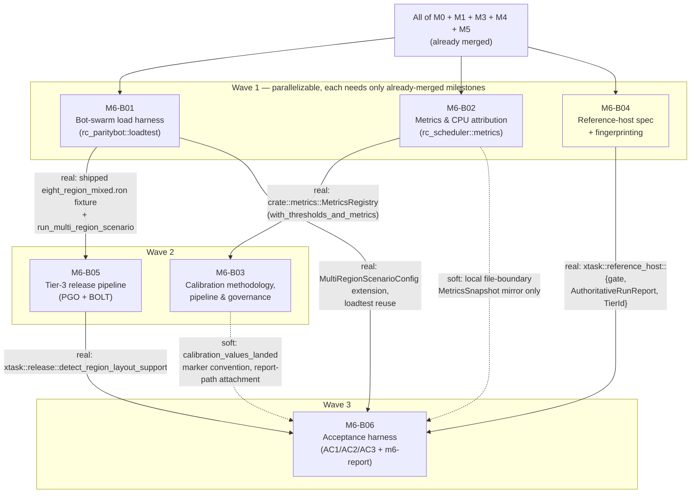

# M6-B00 — Milestone Index: Scale & Optimization: Multi-Region Throughput

## Milestone summary

M6 gives the project the measurement and governance machinery its own
headline claim needs — "quiet regions batched, hot regions scale out,"
proven under real multi-region load, with `01`'s ARCH-D6/ARCH-D19 seed
threshold defaults replaced by calibrated values — without yet requiring the
real `RegionManager`-driven, network-facing, many-region composition root on
`rusty-clanker-server` that no blueprint through this milestone builds. Six
blueprints implement M6: a declarative multi-region bot-swarm load-testing
harness proven at 200-bot/8-region scale against synthetic/fake targets
(M6-B01); a per-`(region, stage)` CPU-attribution and pool/EDF/lifecycle
metrics layer wired additively into the already-merged `rc-scheduler`
(M6-B02); the ARCH-D6/ARCH-D19 calibration methodology, pipeline, and
governance path for landing a calibrated value into `01-server-architecture.md`
(M6-B03); a three-tier reference-host specification with a real,
filesystem-probing fingerprint/match/gate mechanism (M6-B04); the Tier-3
PGO+BOLT release build pipeline (M6-B05); and the concrete pass/fail
evaluators, `xtask m6-report` entry point, and `AuthoritativeRunReport`
wrapping for all three of `11-roadmap-milestones.md`'s M6 acceptance criteria
(M6-B06). Every blueprint in this milestone follows the identical, by-now
five-times-established pattern this project's own blueprint lineage uses
whenever a task's real execution depends on work no blueprint has built yet:
pin the dependency's exact contract shape, build and Tier-1-prove the
consuming blueprint's own machinery entirely against synthetic data or a
stub fixture, and leave the real, full-scale run wired, correct-by-construction,
and honestly fail-closed until a future sibling blueprint lands the
composition root. All six blueprints are self-consistent on that stance; no
blueprint in this milestone claims a real green acceptance run it cannot
produce.

The milestone's actual mechanism content — the scenario schema, the metrics
APIs, the calibration pipeline, the reference-host fingerprint/gate, the
PGO/BOLT pipeline, and the acceptance evaluators — is accurate against the
planning corpus and internally consistent in the API surfaces blueprints
actually share. All six blueprints are mutually consistent: M6-B03's and
M6-B04's own new `PROTECTED_PATHS` rows are described without a hardcoded
ordinal, so the two may land in either order; both keep `CONTRIBUTING.md` in
sync with their own new row; M6-B03's header Prerequisites cites only the one
M6-B02 type its body actually uses; and M6-B06 — the last of the three
`.github/workflows/ci.yml`-touching blueprints to land — reconciles
`reference-host-gate`'s and `release`'s shared `workflow_dispatch` trigger
with a `job` selector input. Details in "Cross-blueprint consistency notes"
below.

| ID | Title | Scope |
|---|---|---|
| M6-B01 | Multi-Region Bot-Swarm Load Harness | L |
| M6-B02 | Metrics & Per-Region CPU Attribution | L |
| M6-B03 | Scheduler Calibration: Methodology, Pipeline & Governance | L |
| M6-B04 | Reference Host Specification & Fingerprinting | L |
| M6-B05 | Tier-3 Release Build Pipeline (PGO + BOLT) | L |
| M6-B06 | Multi-Region Acceptance Harness | L |

## Dependency graph

**Recommended execution order:**

1. **M6-B01**, **M6-B02**, and **M6-B04** in parallel — none declares a real
   dependency on either of the other two. M6-B01 touches only
   `crates/testing/paritybot/`; M6-B02 touches only `crates/scheduler/`;
   M6-B04 touches only `xtask/` plus the new root-level `reference-hosts.toml`.
2. **M6-B03** becomes startable once M6-B02 lands — its own `with_thresholds_and_metrics`
   constructor references `crate::metrics::MetricsRegistry` (M6-B02) inside
   the same `rc-scheduler` crate. **M6-B05** becomes startable once M6-B01
   lands — its own real-target profile-collection workload is driven via
   `rc_paritybot::loadtest::run_multi_region_scenario` against M6-B01's
   already-shipped `eight_region_mixed.ron` fixture, and `xtask` has depended
   on `rc-paritybot` as a path dependency since M1-B06, so no new Cargo edge
   is needed. M6-B03 and M6-B05 are themselves mutually independent and may
   land in either order relative to each other.
3. **M6-B06** needs all five of the above: M6-B01 (scenario/runner types,
   the new `client_view_distance` field it adds to
   `MultiRegionScenarioConfig`), M6-B02 (conceptually — its own local
   `metrics_snapshot_log` mirror is a file-boundary shape restatement, not a
   Cargo dependency, but the mirror's own correctness depends on M6-B02's
   real field names/semantics already being fixed), M6-B03 (the
   `"Calibrated against"` governance-marker convention its own
   `calibration_values_landed` check looks for, and the `calibration-report.json`
   shape its own `--calibration-report` flag attaches as evidence), M6-B04
   (`xtask::reference_host::{gate, AuthoritativeRunReport, TierId, load_spec,
   tier_by_id}`, all imported directly inside the same `xtask` crate), and
   M6-B05 (`xtask::release::detect_region_layout_support`, reused unmodified,
   same crate).

## Per-blueprint summary

**M6-B01 — Multi-Region Bot-Swarm Load Harness.** Realizes `TEST-D8`/`TEST-D31`'s
"`rc-loadtest`" as an additive `rc_paritybot::loadtest` module tree (never a
new workspace crate, continuing M3-B08/M5-B10's own established resolution
of that naming gap): a declarative `MultiRegionScenario` RON schema (named
region cell groups, per-group `HotnessProfile` hotness, time-phased
`ScenarioPhase` transitions for hysteresis exercises, a deterministic
`FaultInjectionSchedule`), `plan_bot_layout`'s pure spatial-placement
algorithm proven at 200-bot/8-region scale, five built-in hotness profiles
whose `hotness_load_score` sorts into strictly increasing load bands, a
`ScenarioRng` (SplitMix64, deliberately not `rc-rng` — WS-D14's scope is
Java-bit-exact parity RNG only, restated as the reason this test-only tool
does not use it), a wave/stagger-paced bot-connection fan-out driver with its
own self-resource guard (RSS/CPU ceilings), and machine-readable phase-marker/
resource-guard outputs. Ships two worked-example scenarios, including
`eight_region_mixed.ron` — later reused, byte-for-byte, as both M6-B05's PGO/
BOLT profile-collection workload and M6-B06's real acceptance-run scenario.
Restates in full (§B), and implements neither side of, the four-item
`--region-layout`/`RC_REGION_LAYOUT`/`--fault-injection-schedule`/
`--region-lifecycle-log` contract a future composition-root sibling blueprint
must satisfy before any real multi-region server run is possible. Proven
entirely against `rc_test_harness::fake_server` and pure functions, capped at
20 real concurrent sockets in its own Tier-1 gate. *Decisions covered:*
ARCH-D6 (exercise mechanism), ARCH-D7, ARCH-D18/D19 (load-shape generator),
TEST-D8/D31, TEST-D40.

**M6-B02 — Metrics & Per-Region CPU Attribution.** Wires the measurement
layer M6's own three acceptance criteria are checked against into the
already-merged `rc-scheduler`, entirely additively (new `Option`-typed
fields, new sibling constructors, conditional wraps at already-named
extension points — every pre-existing M0-B04/B05/B06 test passes unmodified
when metrics are not opted into). Precise per-task `(RegionId, Stage)`
thread-CPU-time attribution (never periodic sampling — chosen specifically
because a 0-player coalesced region's near-zero tick is the case a sampler is
least likely to ever land a sample on), a distinct CPU-time EWMA instance
from `ManagedRegion`'s own wall-clock tick-duration EWMA (explicitly
two-clock, stated why), an `is_near_zero_dedicated_cpu` threshold (2% of
budget, 40 consecutive ticks) this blueprint itself fixes since M6's own
acceptance-criterion text leaves "near-zero" undefined, an EDF
admission-violation feed-in contract (`record_deadline_ready`/
`record_admission`) with an exact, checkable violation rule (zero-violation
assertability proven by construction, not statistically), ARCH-D18 pool-
utilization sampling, an `hdrhistogram`-backed tick-duration percentile
tracker, a bounded merge/split lifecycle journal, and one JSON `MetricsSnapshot`
export. Explicitly does not implement the real EDF admission scheduler or
ARCH-D19's real coalesced single-work-item dispatch — both remain open
through every blueprint in this milestone. *Decisions covered:* ARCH-D6/D7
(measured, not implemented), ARCH-D18/D19/D20, CLUSTER-D28 (monolithic
instance), PERF-D11/D52 (contrasted).

**M6-B03 — Scheduler Calibration: Methodology, Pipeline & Governance.**
Builds the calibration methodology and governance path `11`'s own M6 goal
text ("replace `01`'s seed threshold defaults with calibrated values")
names, without waiting on the real composition root: two additive,
non-breaking `rc-scheduler` extensions (`ResizeThresholds`/
`HysteresisThresholds`, each with a `Default` proven byte-identical to
today's pinned constants) turning ARCH-D6's/ARCH-D19's hardcoded numbers
into runtime-settable values; a new `calibration_sweep_point` bin target
that replays a scripted synthetic load series through the *real*
`ManagedRegion`/`RcWorkerPool` hysteresis code under one candidate threshold
set; a pure, `rc-scheduler`-dependency-free `rc_test_harness::calibration`
analysis module (objective function, thrash detection, constrained-argmin
selection) proven to recover the analytically-known-optimal answer on two
constructed scenarios; `xtask calibrate --mode synthetic-sweep`; and the
governance path itself — a dedicated `Changeset-Type: governance` changeset
touching exactly `docs/planning/01-server-architecture.md`'s decision text
and the matching `rc-scheduler` `Default` impl atomically, gated by a new
`PROTECTED_PATHS` row this blueprint adds. States precisely (§I) why ARCH-D6
must be swept before ARCH-D19 on any real run, and that the ARCH-D19
hot/quiet batch-granularity threshold pair cannot be calibrated until that
mechanism itself exists. `--mode real-sweep` (the mode that would actually
drive a sweep against a real server) is explicitly not built here. *Decisions
covered:* ARCH-D6/D19 (calibration target), ARCH-D20 (folded in as an
admissibility constraint), TEST-D45/D46/D49/D50/D52 (governance changeset
process, concretely instantiated).

**M6-B04 — Reference Host Specification & Fingerprinting.** Fixes the
open question `12`'s WS-D11 rationale and `11`'s own M6 Scope bullet 4 both
name: a concrete, machine-verifiable, three-tier reference-host
specification (`dev-workstation` — new, never authoritative;
`m6-acceptance` — TEST-D32's monolithic reference restated and extended with
a pinned CPU governor and timer-granularity ceiling; `budget-vps` —
PERF-D58's VPS reference, likewise extended), committed as a new
governance-protected `reference-hosts.toml`. A pure, injectable-root Linux
`/proc`/`/sys`/`/etc` probe (`probe_linux_from_root`, fully unit-testable
against a synthetic tree, never panicking, honestly degrading to `None`
fields with warnings on every other platform since all three tiers are
Ubuntu-only), a fixed 11-field match table with an explicit
gated/not-gated/mismatch outcome per field, and a generic
`AuthoritativeRunReport<T>`/`gate` wrapper whose binding two-part rule
(`is_match(tier_match) && declared_tier.authoritative`) is proven to reject
even a perfect field match against the non-authoritative `dev-workstation`
tier. `xtask host-fingerprint` and a new `workflow_dispatch`-only
`reference-host-gate` CI job are wired; both are correctly, deliberately
inert until an operator provisions and labels a real self-hosted runner — a
named, out-of-scope infrastructure action, not a gap in this blueprint's own
mechanism. *Decisions covered:* WS-D11 (open question closed), TEST-D32/
PERF-D58 (restated, extended), PERF-D53–D57 (OS-tuning basis), TEST-D37 Tier
3 (the concrete enforcement of "never a shared runner").

**M6-B05 — Tier-3 Release Build Pipeline (PGO + BOLT).** Builds the actual
Tier-3 release pipeline `11`'s own M6 scope assigns to `14`: PGO via
`cargo-pgo` (reconciled to the real current `0.3.0`, correcting `14`'s own
stale `0.2.9` text — the identical "pin the file-owning decision's actual
current value" resolution pattern M0-B01 already established), BOLT
post-link optimization on Linux only (restated as a real, no-Windows-
equivalent asymmetry, never silently absorbed), the fixed `-C
target-cpu=x86-64-v2` baseline with the PERF-D19 runtime-dispatch allow-list
restated, an honestly-bounded reproducibility stance (plain builds
deterministic modulo two named, accepted sources; PGO/BOLT builds
functionally — never bit-for-bit — equivalent, proven directly by a
byte-identical-stdout smoke test), a deterministic artifact-naming/manifest
schema (`BuildMetadata`, `BoltStatus`), and one `xtask release` orchestration
verb. Pins M6-B01's already-shipped `eight_region_mixed.ron` as the
canonical, single, maintained profile-collection workload (reconciling its
real 18,000-tick/15-minute duration against `14`'s own illustrative
10-minute text). Because the real profile-collection target
(`rusty-clanker-server`) has no composition root yet, this blueprint's own
correctness proof runs the identical pipeline mechanism against a tiny,
self-contained toy fixture crate instead, and the real-target path fails
closed with an actionable message (`detect_region_layout_support`,
mirrored — not reimplemented — by M6-B06) rather than crashing opaquely.
*Decisions covered:* PERF-D45–D50 (restated verbatim, corrected where
stale), PERF-D19/D47 (target-cpu policy), WS-D12 (artifact naming).

**M6-B06 — Multi-Region Acceptance Harness.** Gives all three of `11`'s M6
acceptance criteria a precise, agent-executable, machine-readable pass/fail
definition and one `xtask m6-report` entry point. Resolves every ambiguity
the milestone text itself leaves open: AC1's "sustained... across all
regions" as M0-B06's own `±1%`-drift-ratio convention generalized per-region
(AC1a) plus a hard-cap utilization check (AC1b); AC2's "near-zero dedicated
CPU" and "the coalesced-tick path actually engaged" as two independently-
checked sub-parts (AC2a reads M6-B02's own `near_zero_dedicated_cpu`; AC2b
adds one new, precisely-specified field, `last_tick_task_count`, to the real,
future `RegionMetricsSnapshot` and honestly reports
`CoalescedDispatchEvidence::NotYetInstrumented` today, since no landed
blueprint implements the real coalesced-dispatch mechanism); AC3's fault-
injection isolation as target-degrades (AC3a, an explicit 40-tick settle
window reusing ARCH-D6's own "sustained" window) plus siblings-hold-with-
zero-relaxed-tolerance (AC3b). Extends M6-B01 §B's still-open composition-
root contract with one new item (`--metrics-snapshot-log`), reuses
`eight_region_mixed.ron` byte-for-byte as the real AC1/AC2/AC3 scenario
(never forking a second full-scale file), ships a genuinely separate,
independently-authored, proportionally-smaller `m6_acceptance_smoke.ron` for
Tier-1 plumbing exercise only (never standing in for the real 200-bot claim),
and is the first blueprint in this lineage to discharge M6-B04's own
`AuthoritativeRunReport`-wrapping obligation for real — the completion
report is always `AuthoritativeRunReport<M6ReportResult>`, never a bare
report. Adds one honest, currently-expected-red case,
`M6_calibrated_values_landed_via_governance` (checking `docs/planning/01-server-architecture.md`
for M6-B03's own `"Calibrated against"` governance-changeset marker text),
plus three mandatory harness self-tests proving each acceptance criterion's
own named failure mode is actually caught
(`artificially_capped_pool_fails_ac1`, `cpu_burning_quiet_region_fails_ac2`,
`siblings_also_degrade_fails_ac3`). Also — being the last of the three
`.github/workflows/ci.yml`-touching M6 blueprints to land — adds a `job`
choice input to the workflow's shared `workflow_dispatch` trigger and
narrows M6-B04's `reference-host-gate` and M6-B05's `release` jobs' own
`if:` conditions to check it, so one manual dispatch runs exactly the job
an operator selected. *Decisions covered:* the concrete
realization of M6's Acceptance Criteria 1–3 (`11-roadmap-milestones.md`);
ARCH-D6/D7/D18/D19/D20 (verification only); TEST-D32/PERF-D58 (via M6-B04);
TEST-D37 Tier 3 (restated).

## M6 acceptance criteria → blueprint mapping

| # | Acceptance criterion (`11-roadmap-milestones.md`) | Blueprint(s) | Status |
|---|---|---|---|
| 1 | 20 TPS sustained across all regions for a 15-minute run with 200 simulated bots distributed across ≥8 independently-ticking regions at view distance 10, on the milestone's documented reference host, with RC-WorkerPool utilization staying under its hard cap (ARCH-D18). | M6-B01 (scenario/fanout mechanism + `eight_region_mixed.ron`), M6-B02 (pool-utilization sampling), M6-B04 (the reference-host tier + fingerprint gate), M6-B06 (AC1a/AC1b evaluators, `xtask m6-report`) | **Mechanism fully specified, self-tested against synthetic data, and correctly fail-closed.** The real run is blocked on the same, single, already-and-consistently-named gap every blueprint in this milestone states: no landed blueprint wires `rc-scheduler::RegionManager`/`RcExecutor`/`RcWorkerPool` into a live, network-facing, many-region `rusty-clanker-server` composition root (M6-B01 §B). Once that lands and implements M6-B01 §B's four-item contract plus M6-B06's own `--metrics-snapshot-log` addition, `xtask m6-report --server-bin <real binary> --reference-tier m6-acceptance` on a provisioned, labeled self-hosted reference-host runner (an operator action M6-B04 also names as out of scope) produces the real, authoritative measurement. |
| 2 | A region with 0 players coalesces onto a shared worker (ARCH-D19's coalesced-tick path) and is measured, via per-region CPU attribution metrics, to contribute near-zero dedicated CPU. | M6-B02 (`near_zero_dedicated_cpu`, the attribution mechanism itself, dispatch-granularity-agnostic by construction), M6-B06 (AC2a/AC2b evaluators, the new `last_tick_task_count` contract field) | **CPU-attribution mechanism fully built and correct today; the coalesced-dispatch mechanism itself does not exist.** AC2a (near-zero CPU reading) is measurable the instant a real region exists to measure. AC2b (proof the *coalesced* code path, not merely many cheap fine-grained tasks, actually ran) cannot pass until ARCH-D19's real coalesced single-work-item dispatch is implemented — M0-B06, M6-B02, and M6-B03 all independently confirm this gap is still open as of their own drafting, and M6-B06 honestly reports `CoalescedDispatchEvidence::NotYetInstrumented` rather than a false pass. No blueprint through M6-B06 implements this mechanism; it remains reserved for a future blueprint. |
| 3 | A fault-injection test deliberately overloads one region: sibling regions hold 20 TPS while only the overloaded region's own TPS degrades (ARCH-D7), confirmed automatically. | M6-B01 (`FaultInjectionSchedule`, `resolve_load_multiplier`'s deterministic mechanism, the shipped scenario's own one-region fault entry), M6-B06 (AC3a/AC3b evaluators, the settle-window/threshold constants) | **Mechanism fully specified and self-tested against synthetic data (the `siblings_also_degrade_fails_ac3` self-test proves the two sub-checks are independently attributed).** Blocked on the identical composition-root gap as criterion 1 — the fault-injection *schedule* is real and shippable today (M6-B01 §B item 3's server-side application is the missing half), and `evaluate_ac3`'s own pure functions are provably correct against constructed fault-window data. |

## Cross-blueprint consistency notes

- **`PROTECTED_PATHS` new-row additions (M6-B03, M6-B04) are order-independent.**
  M0-B08's original table has 14 rows. M6-B03 §H item 5 adds one new row for
  `docs/planning/01-server-architecture.md`; M6-B04's own Context/Deliverables
  ("TEST-D46: the protected-path extension") independently add one new row for
  `reference-hosts.toml`. Neither blueprint hardcodes its own row's numeric
  position — `check_paths` itself scans the whole `PROTECTED_PATHS` slice by
  pattern, never by index — so the two may land in either order. Both
  blueprints also append a matching row to `CONTRIBUTING.md`'s own TEST-D46
  protected-path table (M6-B03 §H item 6; M6-B04's own Deliverables), per
  M0-B08's own standing "`CONTRIBUTING.md` documents... the full TEST-D46
  protected-path list" Done-when obligation.

- **M6-B03's header Prerequisites cites only the one M6-B02 type its body
  actually uses.** M6-B03 takes no dependency on M6-B01 — none of
  `MultiRegionScenario`, `HotnessProfile`, or `FaultInjectionSchedule` is
  referenced anywhere in its own Context, Deliverables, Acceptance tests, or
  Implementation steps (§D explains why its own synthetic-sweep methodology
  deliberately takes no `rc-paritybot` dependency at all); of M6-B02's own
  types it references only `rc_scheduler::metrics::MetricsRegistry` (the
  parameter type on the rarely-used `RegionManager::with_thresholds_and_metrics`
  sibling constructor). M6-B03's Prerequisites field names only that one
  M6-B02 type.

- **`reference-host-gate` (M6-B04, extended by M6-B06) and `release`
  (M6-B05) share one `workflow_dispatch` trigger, disambiguated by a `job`
  input.** Both are real, self-hosted-runner-only jobs on the identical
  `.github/workflows/ci.yml` `workflow_dispatch` event. M6-B06 — the last of
  the three to land, since it needs all five other M6 blueprints merged —
  adds a `job` choice input to the shared `on.workflow_dispatch.inputs`
  block and narrows both jobs' own `if:` conditions to check it (M6-B06
  Context §G.1), so one manual dispatch runs exactly the job an operator
  selected.

- **Every M6 blueprint's own "the real run is blocked on the composition
  root" stance is mutually consistent.** M6-B01 §B, M6-B02's Scope-boundary
  note, M6-B03 §A, M6-B04's own Context, M6-B05 §L, and M6-B06 §A all
  restate, in each blueprint's own words, the identical fact — no blueprint
  through M6-B06 wires `rc-scheduler`'s `RegionManager`/`RcExecutor`/
  `RcWorkerPool` into a live, network-facing, many-region
  `rusty-clanker-server` composition root — and each pins its own dependent
  contract on that gap precisely (M6-B01 §B's four items, extended by M6-B06
  §D's fifth; M6-B05's toy-fixture substitution; M6-B06's
  `AC2b`/`CoalescedDispatchEvidence::NotYetInstrumented` honesty). No
  blueprint's restatement of this gap contradicts another's, and every
  blueprint's own Tier-1 Done state is correctly independent of it landing.

## M6 completion, restated

Per this project's own established pattern: M6-B01, M6-B02, and M6-B04 each
reach their own Tier-1 Done state independently and in parallel, with zero
cross-blueprint compile dependency among them. M6-B03 needs only M6-B02
merged (for `crate::metrics::MetricsRegistry`'s type to exist inside
`rc-scheduler`); M6-B05 needs only M6-B01 merged (for `eight_region_mixed.ron`
and `rc_paritybot::loadtest::run_multi_region_scenario` to exist). M6-B06
needs all five other blueprints merged, since it is the one blueprint in this
milestone whose own crate (`xtask`) directly imports items from four of the
other five (`rc_paritybot::loadtest` from M6-B01, `xtask::reference_host`
from M6-B04, `xtask::release::detect_region_layout_support` from M6-B05) and
restates a fifth's own governance-marker convention (M6-B03) plus a sixth's
own metrics shape (M6-B02, file-boundary mirror only), and reconciles
`reference-host-gate`'s and `release`'s shared `workflow_dispatch` trigger
(Cross-blueprint consistency notes, above) — the one substantive edit it
makes to a file two sibling blueprints already committed. All six
blueprints' own Tier-1 gates are mutually consistent and independently
green.

`11-roadmap-milestones.md`'s three M6 acceptance criteria are reached for
real only once a still-future, not-yet-drafted sibling blueprint (a) wires
`rc-scheduler`'s `RegionManager`/`RcExecutor`/`RcWorkerPool` into a real,
network-facing, many-region `rusty-clanker-server` composition root
implementing M6-B01 §B's full four-item contract plus M6-B06 §D's fifth
item; (b) implements ARCH-D19's real coalesced single-work-item dispatch
mechanism and populates the new `last_tick_task_count` field (M6-B06 §D) —
required for AC2b, not AC2a; (c) implements `xtask calibrate --mode
real-sweep` (M6-B03 §A/§H, explicitly deferred) and lands at least one real
governance changeset calibrating an ARCH-D6/ARCH-D19 value into
`docs/planning/01-server-architecture.md`, carrying M6-B03 §H's own
`"Calibrated against"` marker text M6-B06's own `calibration_values_landed`
check looks for; and (d) an operator provisions and labels a real,
self-hosted reference-host runner matching one of M6-B04's three declared
tiers, so `reference-host-gate`'s `workflow_dispatch` job — extended by
M6-B06 to run the real `m6-report` step — has a runner to dispatch to at
all. Until then, every mechanism this milestone's six blueprints build is
correct-by-construction and honestly, mechanically fail-closed rather than
silently green — exactly the same "drafted-complete vs. measured-complete"
distinction M0-B08/M1-B06/M3-B08/M4-B09/M5-B10's own harness blueprints
already established as this project's standing pattern.
