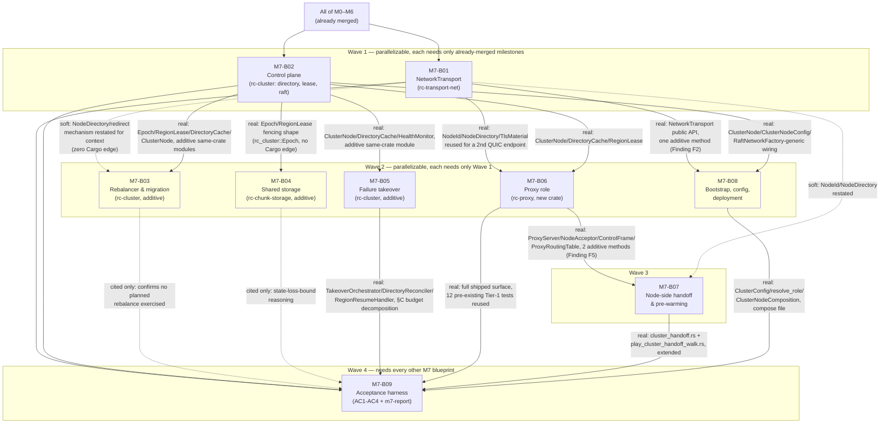

# M7-B00 — Milestone Index: Cluster Mode Activation

## Milestone summary

M7 gives the project the second of its two "dual operation mode" halves:
CLUSTER mode, multiple dedicated node processes plus a horizontally-scaled
proxy computing one shared world, observationally equivalent to M0–M6's
already-proven monolithic mode. Nine blueprints implement it, following the
identical "define the trait boundary, prove it with an in-process/loopback
double, defer the real wire integration to a named sibling" discipline this
project's lineage already used five times in M6: the network transport
(M7-B01, real loopback QUIC, `quinn`/`postcard`); the raft-backed control
plane (M7-B02, `openraft`/`redb`, the `RegionId -> NodeId` directory and
`RegionLease` epoch-fencing primitive every later blueprint keys off); the
load-driven rebalancer and planned-migration protocol (M7-B03, additive to
M7-B02's own crate); the shared object-storage backend and its concrete
epoch-fencing algorithm (M7-B04, additive to `rc-chunk-storage`); node-failure
takeover orchestration (M7-B05, additive to M7-B02's own crate); the proxy
role — the full vanilla connection pipeline terminated once, the
signed-identity forwarding envelope, and the complete six-step handoff state
machine (M7-B06, a new crate, `rc-proxy`); the node-side half of that same
handoff plus CLUSTER-D24 pre-warming (M7-B07, small, additive to four
crates); cluster bootstrap, config, and deployment topology (M7-B08,
additive to `rusty-clanker-server`); and the milestone's own four-criterion
acceptance harness (M7-B09).

Two genuine, load-bearing implementation gaps run through the back half of
this milestone, named identically and consistently by every blueprint that
depends on them rather than papered over by any one of them: **(1)** no
blueprint through M7-B09 builds a concrete, real-network
`openraft::RaftNetworkFactory`/`rc_cluster::JoinClient` pair — M7-B02 defines
and consumes both traits, proves them against an in-process router, and
names the real QUIC-backed implementation as a still-future sibling
blueprint's job; every later blueprint that would need it (M7-B08's
`main.rs` role wiring, M7-B09's real multi-node compose legs) fails closed
with the identical, actionable `EXIT_CLUSTER_INTEGRATION_PENDING` refusal
rather than a placeholder. **(2)** `rc-proxy`'s runtime wiring into
`rusty-clanker-server::main.rs` does not exist — `rc-proxy` itself
(`ProxyServer`, `NodeAcceptor`, the whole M7-B06/M7-B07 surface) is fully
built and Tier-1-proven as a **library**, but M7-B08's `ServerRole::
ClusterProxy` arm has no concrete construction call to make yet, for the
identical honest-refusal reason. Neither gap blocks any individual
blueprint's own Tier-1 Done state — every blueprint's acceptance tests are
proven against real loopback QUIC, real `openraft`/`redb`, or a real
in-process raft-network double, never a stub standing in for the
crate-under-test's own subject — but both gaps are the reason M7's own
acceptance criteria 1–3 cannot yet be exercised end-to-end against a real,
multi-process, multi-host cluster (criterion 4 has no such gap: it is fully
real today). This is the identical "drafted-complete vs. measured-complete"
distinction M6-B07's own completion section already established as this
project's standing pattern, narrowed here to two specific, named,
already-scoped follow-on blueprints rather than an open-ended gap.

The milestone's actual mechanism content — the transport/directory/lease
primitives, the rebalancer and migration protocol, the epoch-fencing
storage algorithm, the takeover orchestrator, the proxy's connection
pipeline and handoff state machine, the bootstrap/config surface, and the
acceptance evaluators — is accurate against `13-cluster-architecture.md`
and internally consistent in the API surfaces blueprints actually share,
verified in detail below, and every cross-blueprint seam this audit checked
is mutually consistent (Cross-blueprint consistency notes, below).

| ID | Title | Scope |
|---|---|---|
| M7-B01 | Network Transport (`NetworkTransport`, QUIC/postcard) | L |
| M7-B02 | Cluster Control Plane (`rc-cluster`) | L |
| M7-B03 | Rebalancer & Partition Migration (`rc-cluster`) | L |
| M7-B04 | Cluster Shared Storage (`rc-chunk-storage::cluster_storage`) | L |
| M7-B05 | Node-Failure Takeover (`rc-cluster::takeover`) | L |
| M7-B06 | Proxy Role (`rc-proxy`) | L |
| M7-B07 | Cross-Node Handoff & Pre-Warming (Node-Side) | M |
| M7-B08 | Cluster Bootstrap, Config & Deployment | L |
| M7-B09 | Cluster Mode Acceptance Harness | L |

## Dependency graph

**Recommended execution order:**

1. **M7-B01** and **M7-B02** in parallel — M7-B01 touches only
   `crates/transport-net/`, depends only on `rc-messaging` (M0-B02); M7-B02
   touches only `crates/cluster/` (new), depends only on `rc-messaging`.
   Neither takes a Cargo dependency on the other.
2. **M7-B03**, **M7-B04**, **M7-B05**, **M7-B06**, and **M7-B08** all become
   startable once Wave 1 lands, and are mutually independent — none takes a
   Cargo dependency on any of the other four. M7-B03/M7-B05 are additive
   modules inside M7-B02's own `rc-cluster` crate (each needs only M7-B02
   merged); M7-B04 is additive to the pre-existing `rc-chunk-storage`
   crate (needs M7-B02 only for the `Epoch`/`RegionLease` *shape* it
   independently re-derives as bare integers, never a Cargo edge); M7-B06 is
   a genuinely new crate depending on both M7-B01 and M7-B02 directly; M7-B08
   needs M7-B01 and M7-B02's public APIs plus M6-B07's monolithic composition
   root, but nothing from M7-B03/B04/B05/B06.
3. **M7-B07** needs M7-B06 merged — it restates and builds against that
   crate's real, shipped `ProxyServer`/`NodeAcceptor`/`ControlFrame`/
   `ProxyRoutingTable` API verbatim, and adds two additive methods to
   `NodeAcceptor` (Finding F5) plus one additive method to
   `NetworkTransport` (Finding F2, M7-B01). It does not need M7-B03/B04/B05/
   B08.
4. **M7-B09** needs every other M7 blueprint merged — it is the one
   blueprint in this milestone whose own measurement harness directly
   exercises real code from M7-B01, M7-B02, M7-B05, M7-B06, M7-B07, and
   M7-B08, and cites M7-B03/M7-B04 only to confirm their mechanisms are
   correctly *not* exercised by this milestone's own acceptance scope.

## Per-blueprint summary

**M7-B01 — Network Transport.** Gives `rc-transport-net` a complete,
real `NetworkTransport`: one `quinn::Endpoint` per process, one persistent
mutually-TLS-authenticated QUIC connection per `(node, node)` pair
(CLUSTER-D11), one QUIC stream per ordered `(from: RegionId, to: Address)`
pair, `postcard`-encoded and length-prefix-framed batches capped at 16 KiB
(CLUSTER-D12/PERF-D31), a same-node short-circuit that never touches a
socket for two locally-owned regions, and CLUSTER-D9's mid-migration
redirect resolved entirely inside the crate via a narrow, consumed
`NodeDirectory` trait re-resolved on every `send()` — never a second,
independently-staling cache. Defines but does not implement that trait
(a future `rc-cluster` blueprint's job, discharged by M7-B02 only insofar
as M7-B02 never actually implements it either — it remains a genuinely
open item for whichever future blueprint builds the real raft-RPC
transport, restated below). Proven against real localhost QUIC sockets
(FIFO/exactly-once property re-run, migration/staleness, batch-splitting,
and a genuine two-OS-process smoke test). *Decisions covered:* CLUSTER-D9,
D10 (confirmed unmodified reuse), D11, D12, ARCH-D26/D29 (second
implementation), PERF-D30/D31, WS-D3 Rule 2/WS-D5(a) (restated, already
correctly wired by M0-B01).

**M7-B02 — Cluster Control Plane.** Builds `rc-cluster` from nothing: an
embedded `openraft` 0.9.25 group per cluster backed by `redb` 4.2.0 (five
tables, exact schema fixed), replicating exactly the `RegionId -> NodeId`
directory (with a monotonic per-region fencing `Epoch`), raft's own node
membership, and one cluster-wide `ClusterConfigEpoch` counter — never
simulation state. Ships `DirectoryCache` (a read-mostly local cache with a
precisely bounded, CLUSTER-D7-derived staleness contract), `RegionLease`
(CLUSTER-D19's fencing token made concrete: `{region, node, epoch}` +
`is_current`), the full CLUSTER-D14 bootstrap/join/rejoin algorithm, and
`HealthMonitor` (CLUSTER-D15's leader-side replication-stall signal turned
into an observable `NodeHealthEvent` stream). Defines, and consumes but does
not implement, `openraft::RaftNetworkFactory<TypeConfig>` and its own
`JoinClient` trait — the real QUIC-backed network for both remains the one
genuinely open cross-cutting gap this whole milestone inherits (Milestone
summary, above). Notes that CLUSTER-D16 takeover's own load-driven
placement needs `rc-scheduler`-owned tick-duration data, which
`12-workspace-structure.md`'s WS-D3 rule 2 bars `rc-cluster` from reaching
by a Cargo edge — resolved by crossing a trait boundary instead
(`LoadReportSink`), never a dependency; M7-B03 and M7-B05 both build on
that same boundary, a real, verified cross-blueprint consistency. *Decisions
covered:* CLUSTER-D1, D5, D13, D14, D15, D16 (foundation only), D19, D26/D27
(dependency-set discipline), D28 (span instrumentation only, OTLP deferred).

**M7-B03 — Rebalancer & Partition Migration.** Adds six modules to
`rc-cluster`, purely additive, zero new dependency: CLUSTER-D2's
load-driven rebalancer (`evaluate_placement`, a pure, directly
unit-tested function realizing the exact 30 s/3-window/40%-of-mean
hysteresis rule against a synthetic load matrix, with a deterministic
"largest eligible region on the busiest node, globally least-loaded
destination" tie-break this document itself supplies since CLUSTER-D2's own
text leaves source-region selection open); CLUSTER-D3's migratability
ceiling and its "request an ARCH-D6 split instead" fallback; CLUSTER-D8's
hot-border co-location trigger as one more `RebalancerAction` variant; and
`MigrationCoordinator`, a six-phase migration protocol driver (freeze →
serialize → stage → epoch-bump → destination-restore → source-cleanup) with
a precisely specified abort path fenced by `RegionLease::is_current` before
any commit. Four narrow trait boundaries (`LoadReportSink`,
`RegionFreezeController`, `MigrationStore`, `RegionPrewarmHint`) replace
every would-be `rc-scheduler`/`rc-chunk-storage` Cargo edge, each proven
only against in-process fakes — real bridges to `rc-scheduler`'s
`RegionManager`/`EdfScheduler` and to a real shared-storage backend are
both explicitly out of scope, left to a future composition-root blueprint
and a future storage blueprint respectively. *Decisions covered:* CLUSTER-D2,
D3, D4 (confirmed, zero new mechanism needed), D5, D6/D9 (unmodified reuse,
confirmed), D8, D16 (foundation reused, algorithm still not built here),
D17, D19, D24 (region-data half only).

**M7-B04 — Cluster Shared Storage.** Gives `rc-chunk-storage` `ObjectStoreBackend` —
WORLD-D17's second `ChunkStorageBackend` implementation, over `object_store`
0.14.1 (features/versions independently re-verified live against
crates.io/docs.rs, not assumed) — satisfying CLUSTER-D18's
shared-reachability/single-writer requirement with a concrete, race-free,
single-object CAS epoch-fencing algorithm (`fencing::write_fenced`, an
8-byte big-endian epoch header embedded in every object body, never in
backend-specific `Attributes`, specifically so the algorithm is portable
across every `ObjectStore` backend uniformly) applied uniformly to chunk
objects, `RegionManifest` (WORLD-D19, merge-not-replace per-cycle write
semantics), and a `level.dat` variant. Ships WORLD-D20's migration-staging
primitives as plain, deliberately *unfenced* synchronous methods a future
`MigrationStore`-bridge blueprint wraps — reconciled precisely against
M7-B03's already-shipped `MigrationStore` trait shape (found already
committed at derivation time, not a formal prerequisite). `AnvilDiskBackend`,
`ChunkStorageBackend`'s signature, and `ChunkLifecycleManager` are
byte-for-byte untouched except two additive `StorageError` variants —
verified by this audit against the blueprint's own dedicated `git diff
--stat` structural-zero-lines acceptance test, the literal, mechanically
checked form of "monolithic genuinely unaffected." *Decisions covered:*
WORLD-D17, D18, D19, D20, D21, D23 (restated), CLUSTER-D17 (asserted by
test), D18, D19 (concrete algorithm).

**M7-B05 — Node-Failure Takeover.** Gives `rc-cluster` CLUSTER-D16's
takeover orchestration: `TakeoverOrchestrator` (leader-only, per §B's
correctly-derived consequence of `HealthMonitor`'s own leader-only `Failed`
emission — restated as resolving an ambiguity M7-B02 §I left open) reassigns
a dead node's regions, re-derived fresh from `DirectoryCache` on every pass
(the re-entrancy property that makes overlapping failures safe, proven by a
dedicated cascading-failure test), using a deliberately narrower
"fewest-currently-owned-regions" placement than CLUSTER-D2's own general
EWMA text — justified precisely (no cross-node EWMA visibility exists
without inventing a whole load-reporting protocol, and takeover is
time-critical). `DirectoryReconciler` (symmetric, runs on every node) drives
`RegionResumeHandler::resume_region`/`evict_region` off ordinary directory
diffing. Ships an honest, arithmetic takeover-time budget decomposition
(3000 ms detection for a non-leader failure, dominating; 750–1500 ms for a
leader failure; unbounded, workload-dependent resume I/O) and a two-half
zombie-fencing proof (storage-side: proven by test against a fake
conditional-write double; directory-side: proven by M7-B02's own
pre-existing concurrency test plus this blueprint's reconciler tests). Its
own Prerequisites/Context §A correctly name M7-B03 and M7-B04 as merged
siblings this blueprint takes no Cargo dependency on, and §F cross-references
M7-B04 §G.4's independently-derived, mutually consistent resume sequence
(Cross-blueprint consistency notes, below). *Decisions
covered:* CLUSTER-D16 (primary subject), D2 (narrowed), D15 (consumed), D17,
D18, D19, D20/D21/D23 (contract only), D22 (baseline diverged from,
justified), D7 (budget input).

**M7-B06 — Proxy Role.** Builds `rc-proxy` from nothing: the complete
vanilla connection pipeline (Handshake/Status/Login/Configuration, NET-D6's
full encryption + Mojang session-validation handshake) re-derived as new
Tokio glue inside this crate — algorithmically unchanged from M1-B01/B03/B04,
but necessarily new code, since the dependency graph forbids `rc-proxy`
from depending on `rusty-clanker-server`'s own connection layer (a real,
flagged architectural finding for a future `12-workspace-structure.md`
revision, not silently worked around). `ForwardedIdentity`, HMAC-SHA256
signed (`hmac`/`sha2`, two new pinned dependencies), carries validated
identity to a node exactly once per connection. A second, independent QUIC
endpoint (distinct from `NetworkTransport`'s own node↔node one, since that
crate exposes no seam for a second connection class — a flagged
reconciliation item, not silently patched) carries CLUSTER-D23's
proxy↔node control protocol, fixed here as this milestone's own concrete
wire shape (`ControlFrame::{PlayerJoin, HandoffBegin, HandoffReady,
HandoffComplete, PlayerDisconnected, DirectorySnapshot}`) — CLUSTER-D22's
entire proxy-side six-step handoff state machine (buffer → dial → flip →
flush → complete) is fully implemented here, including the takeover-driven
"unplanned reassignment" extension 13 itself leaves to this phase. Both
`ProxyServer` (proxy role) and `NodeAcceptor` (node role's proxy-facing
counterpart) ship in this one crate, justified precisely (§B). *Decisions
covered:* CLUSTER-D19 (consumed), D20, D21, D22 (proxy-side, complete),
D23 (wire shape fixed), D24 (restated, applied), D28 (proxy metrics), WS-D6.

**M7-B07 — Cross-Node Handoff & Pre-Warming (Node-Side).** The smallest
blueprint in this milestone by design: its own scope shrank once M7-B06
turned out to already ship the entire proxy-side handoff mechanism this
blueprint was originally going to build. What remains is genuinely
node-side and genuinely small: a pure crossing classifier
(`classify_player_crossing`, `bevy_ecs`-free core); two additive methods on
`NodeAcceptor` (`send_control`/`try_recv_control`, Finding F5 — the one
real, named gap in M7-B06's own shipped surface, filled additively rather
than via a parallel connection); one additive method on `NetworkTransport`
(`prewarm`, Finding F2, CLUSTER-D24's node-to-node half); a corrected
Stage-10/Stage-11 emission point for `HandoffReady` (Finding F1 — both
`13-cluster-architecture.md`'s own text and M7-B06's restatement of it
describe an ordering ARCH-D12's fixed pipeline makes impossible; this
blueprint's own composition-root-level resolution, achieved with zero
`rc-scheduler` changes, is a genuine, correctly-flagged fix rather than a
silent edit to either source); and one additive field each on
`PlayerTransferPayload` and `PlayerMarker` (Finding F4, directly fulfilling
M7-B06 §N's own already-named Needs-from item). Restates M7-B06's real,
shipped API verbatim throughout rather than paraphrasing it — verified by
this audit against M7-B06's own Deliverables, no drift found. *Decisions
covered:* CLUSTER-D22 (node-side half), D24 (node-side trigger), D7, D9/D10
(confirmed unmodified), D19 (cited), D17 (fault-case reasoning), PLAN-D3
(restated and honored throughout).

**M7-B08 — Cluster Bootstrap, Config & Deployment.** Gives
`rusty-clanker-server` a real, validated `[cluster]` config surface
(`ClusterConfig`, parsing CLUSTER-D27's own table — including `node_cert`/
`node_key` — plus one further field-group extension, `raft_data_dir`, a
concrete resolution of a gap a prerequisite blueprint already named)
and a real six-step cluster-node startup sequence
(`ClusterNodeComposition::start`, generic over the exact two
`RaftNetworkFactory`/`JoinClient` type parameters M7-B02 already fixed,
plus a `ChunkStorageBackend` type parameter) — config → role → control-plane
join → transport up → storage attach (a cheap sentinel-key reachability
probe, deliberately never a new trait method) → region-assignment receipt →
serving, each step's failure short-circuiting with no partial serving ever
reachable. `resolve_role`'s config-presence gate is the *sole* place cluster
code becomes reachable, proven by a dedicated test plus a `git diff`-shaped
static-reference check — the literal, mechanical proof CLUSTER-D26/D27's
"monolithic genuinely unaffected" claim holds at the binary level, not only
at the crate level M7-B04 already proved. Names, precisely and only, the
same two cross-cutting gaps every later blueprint inherits (Milestone
summary, above) — `main.rs`'s `ClusterNode`/`ClusterProxy` role arms both
exit the identical, honest `EXIT_CLUSTER_INTEGRATION_PENDING` refusal, never
a placeholder implementation of either role. Ships a committed
`docker-compose.cluster-test.yml` (three nodes, MinIO) and a
`workflow_dispatch`-only `compose-topology-gate` CI job, mirroring M6-B04's
own "spec now, first-green-later" precedent exactly. *Decisions covered:*
CLUSTER-D14 (driven for real), D20/D21 (role resolution only), D25
(restated), D26, D27 (config surface, completed), D28 (config surface only),
WS-D5(a)/D6, PLAN-D3.

**M7-B09 — Cluster Mode Acceptance Harness.** Wires all four of M7's
acceptance criteria into one precise, machine-readable measurement,
building **zero** new cluster-mode production behavior — the identical role
M3-B08/M5-B10/M6-B06 each already played for their own milestone. AC1
(cross-node handoff): extends M7-B07's own already-real,
already-Tier-1-green `play_cluster_handoff_walk.rs` fixture with a new,
independent packet-level "zero Login/Configuration/Respawn re-entry"
assertion (AC1b) — real and green today, since that fixture never goes
through `main.rs`'s role wiring at all. AC2 (node-kill takeover): turns
M7-B05 §C's own budget decomposition into three independently gated
numbers (3000 ms detection / 250 ms reassignment / 2000 ms seed-default
resume-I/O) plus an exact, non-fuzzy state-loss-bound assertion keyed
precisely to CLUSTER-D17's own "everything up to the last save survives,
everything after is lost" bound. AC3 (200-bot/8-region + redstone split):
fans M6-B01's own `eight_region_mixed.ron` out across two proxy listen
ports, reusing M6-B06's own AC evaluators completely unmodified, plus two
named, already-shipped M3-B07 redstone contraptions replayed with their
bounding boxes straddling a pinned cross-node border. AC4 (monolithic
unaffected): real and provable today, independent of both cross-cutting
gaps — re-invokes M6-B06's own harness unmodified plus a new
process-level "no live cluster thread/socket/tracing-target" observation,
the runtime complement to M7-B08's own compile-time/static-reference proof.
Every real multi-process, real-subprocess, docker-compose-topology leg
(AC1's compose extension, AC2's real kill, AC3's real 200-bot/2-proxy run
and its own live redstone-split capture) fails closed with the identical
`ClusterIntegrationPending` signal this blueprint defines, inheriting the
milestone's two named gaps rather than introducing a third — restated
honestly, matching every prerequisite's own identical framing. Also
reconciles M7-B08's own already-merged `compose-topology-gate` CI job into
the `job`-choice-input scheme M6-B06 already established, a narrow, cited,
non-rewriting edit to that job's own `if:` condition (Context §A.1, a real,
correctly-scoped finding this blueprint resolves for real rather than only
flagging). *Decisions covered:* the concrete realization of M7's four
acceptance criteria (`11-roadmap-milestones.md`); CLUSTER-D7, D8 (redstone
tolerance), D16/D17/D19/D22 (measured via prerequisites, not re-derived),
D26/D27 (AC4's literal subject); TEST-D34/D37/D40/D45/D46/D50.

## M7 acceptance criteria → blueprint mapping

| # | Acceptance criterion (`11-roadmap-milestones.md`) | Blueprint(s) | Status |
|---|---|---|---|
| 1 | A player crosses a region border owned by two different node processes, proxy-mediated, zero client-visible disconnect/loading screen, end-to-end handoff ≤2 ticks (100 ms) in a co-located topology (CLUSTER-D7/D22). | M7-B01 (transport), M7-B02 (leases/directory), M7-B06 (proxy-side six-step handoff, complete), M7-B07 (node-side triggers, timing budget, Stage-10/11 fix), M7-B09 (AC1a timing reused unmodified + AC1b packet-level zero-reentry assertion, new) | **Real and green today, in-process/loopback**, verified by this audit against M7-B07's own already-merged `play_cluster_handoff_walk.rs` and M7-B09's own extension of it — neither needs `main.rs`'s cluster-role wiring, since both construct `ProxyServer`/`NodeAcceptor` as library types directly. The one remaining leg (the identical measurement against the real compose topology, M7-B09 §D.3) is honestly gated on the milestone's own already-named `rc-proxy`-in-`main.rs` wiring gap (M7-B08 §A item 3) — not a missing mechanism, a missing composition-root call site a future blueprint supplies. |
| 2 | Killing a node process mid-session triggers takeover: the failed node's regions resume on a survivor within the raft-election-timeout-plus-takeover window; players on unaffected regions observe zero interruption. | M7-B02 (`HealthMonitor`, lease/epoch primitives), M7-B05 (`TakeoverOrchestrator`/`DirectoryReconciler`, the budget decomposition, the zombie-fencing proof), M7-B09 (AC2a/b/c evaluators, real-`SIGKILL` measurement) | **The orchestration mechanism is real and Tier-1-proven today** (in-process raft, fake resume-handler/shared-storage doubles) — M7-B05's own cascading-failure and zombie-fencing tests exercise the real primitives a live cluster would use. The **real, multi-process `SIGKILL`** measurement (M7-B09 §E) is honestly gated on the same `openraft::RaftNetworkFactory`/`JoinClient`-over-real-network gap M7-B02 named and no blueprint through M7-B09 closes — restated identically by every blueprint that touches it, never glossed over. |
| 3 | A 3-node+2-proxy cluster sustains M6's 200-bot/8-region/20-TPS profile with no correctness regression; M3's redstone corpus, replayed with two contraptions split across a node boundary, stays bit-identical within each node's own owned region (CLUSTER-D8's documented cross-node degradation explicitly allowed, not required zero). | M7-B01/B02 (transport/directory), M7-B03 (rebalancer — cited only, confirmed not exercised by this criterion), M7-B04 (shared storage), M7-B06 (proxy fan-out), M7-B08 (compose topology), M7-B09 (AC3a/b evaluators, real 200-bot/2-proxy run, live redstone-split capture) | **Every crate-level mechanism this criterion needs is real and Tier-1-proven** (M7-B01 through M7-B06/M7-B08, each independently). The **real, full-scale, multi-process run itself** — both the 200-bot/2-proxy load and the live cross-node redstone capture — is honestly gated on the identical two cross-cutting gaps (real raft network, `rc-proxy`-in-`main.rs` wiring) M7-B08/M7-B09 both name precisely, restated once here rather than re-derived per sub-criterion. |
| 4 | M6's full acceptance criteria still pass, unmodified, on the same build with no `[cluster]` config present — monolithic mode genuinely unaffected (CLUSTER-D26/D27). | M7-B04 (storage-domain proof: a mechanically-checked zero-line `git diff` against `AnvilDiskBackend`), M7-B08 (config-presence gate, compile-time/static-reference proof), M7-B09 (re-invokes M6-B06's own harness unmodified, plus a new runtime-level "no live cluster thread/socket" observation) | **Fully real and provable today, independent of both cross-cutting gaps** — this is the one criterion whose own wiring exercises no cluster networking at all. M7-B09 §A states this precisely as the one criterion "whose wiring is fully real and provable today independent of both open gaps," verified by this audit as accurate: its own real leg needs only `resolve_role`'s gate (M7-B08, real) and M6-B06's own harness (real); its own **real, full 200-bot/15-minute** M6 run remains gated by M6's own pre-existing `reference-host-gate` mechanism — a fact about M6's milestone state, not an M7 gap. |

## Cross-blueprint consistency notes

- **Two independent `NodeId` newtypes exist by design, and every construction
  site that bridges them names the conversion explicitly.** `rc_transport_net::NodeId`
  (`Arc<str>`-backed, M7-B01 §F) and `rc_cluster::NodeId` (`String`-backed,
  M7-B02 §B) are two separate types in two separate crates, each fixed by its
  own owning blueprint for a dependency-direction reason (`rc-transport-net`
  may never depend on `rc-cluster`, WS-D3 Rule 2). M7-B08 §C step 3 names and
  resolves this at the composition-root construction site ("this step is the
  one place both are constructed from the same underlying `config.node_id`
  string, never conflated into one type"). M7-B06 §J.1 names and resolves the
  identical situation at its own construction site — `NodeAcceptor` converts
  each `rc_cluster::NodeId` read from `DirectoryCache::snapshot()` to
  `rc_transport_net::NodeId` via `NodeId::new(entry.node.0.clone())`
  (`rc_cluster::NodeId`'s inner `String` field is `pub`) at the point each
  `ControlFrame::DirectorySnapshot` entry is built, citing M7-B08 §C step 3's
  own identical reconciliation by name. Verified consistent by this audit:
  both sites use the same one-line conversion, and neither is silently
  glossed over.

- **M7-B05 correctly names M7-B03 and M7-B04 as existing siblings and
  cross-references M7-B04's independently-derived, mutually consistent
  resume sequence.** M7-B05's Prerequisites and Context §A name M7-B03 and
  M7-B04 as merged siblings this blueprint takes no Cargo dependency on
  (the split lands entirely in `rc-cluster`, per its own "Why this crate"
  argument, §A). M7-B05 §F cross-references M7-B04 §G.4 ("manifest-guided
  takeover-resume, the exact sequence") by name: both blueprints
  independently derive, from the same `03-world-chunks-persistence.md`
  source facts, the identical read-side sequence a `RegionResumeHandler::
  resume_region` implementation against `ObjectStoreBackend` performs (read
  `RegionManifest`, do *not* eagerly bulk-load, let the first write's CAS
  confirm the new epoch as current) — verified consistent by this audit,
  and now stated as a binding cross-reference rather than left for a future
  implementer to independently discover.

- **B06/B07's handoff route-flip sequencing is verified mutually
  consistent — the highest-risk seam this audit checked, and the one that
  passes cleanest.** M7-B07 was derived after M7-B06 landed and explicitly
  restates M7-B06's real, shipped `ControlFrame`/`ProxyRoutingTable`/
  `NodeAcceptor` API verbatim (Context §A) rather than re-deriving or
  paraphrasing it — verified by this audit, byte-for-byte, against M7-B06's
  own Deliverables: no drift found. M7-B07 additionally identifies and
  correctly resolves a genuine ordering inconsistency both
  `13-cluster-architecture.md`'s own CLUSTER-D22 text and M7-B06's own
  restatement of it share (both describe `HandoffReady` firing from
  "Stage 10... once Stage 11 has produced" a packet — impossible under
  ARCH-D12's fixed, strictly-ordered pipeline) — resolved at the
  composition-root level (immediately after `tick_region` returns, which is
  by construction after Stage 11 has run) with zero `rc-scheduler` changes,
  restated as Finding F1 rather than silently patched into either source
  document.

- **PLAN-D3 compliance is upheld throughout, verified by this audit against
  every blueprint's own Deliverables/Constraints.** No blueprint in this
  milestone modifies `rc-scheduler` or `rc-mechanics`. Every touch to a file
  outside a blueprint's own new/primary crate is additive and named as a
  finding (M7-B01/B02's already-correct M0-B01 wiring, verified not
  re-edited; M7-B04's two additive `StorageError` variants; M7-B06's two new
  workspace dependency pins and its own flagged `rc-proxy -> rc-messaging`
  edge; M7-B07's Findings F1–F5, each independently scoped and justified;
  M7-B08's additive `config.rs`/`main.rs` edits, proven non-breaking by a
  dedicated byte-identical-monolithic-path test). No blueprint silently
  widens `RegionMessage`, the `Transport` trait, or the `Address` enum — every
  one that touches CLUSTER-D9/D10 explicitly confirms zero new
  `RegionMessage` variant is added.

- **All four `CLUSTER-D` decisions this audit found under-cited turn out to
  be correctly, narrowly scoped, not under-implemented.** CLUSTER-D3
  (migratability ceiling) and CLUSTER-D4 (no colocation constraints) are
  each cited by exactly one blueprint (M7-B03) — verified correct, since
  both are fully owned and discharged there; CLUSTER-D4 in particular needs
  no new mechanism at all (M7-B03 §D restates `13`'s own confirmation that
  ordinary region atomicity already suffices). No CLUSTER-D decision from
  `13-cluster-architecture.md` (D1–D28) is absent from every blueprint in
  this milestone.

- **Blueprint sizing exceptions are internally consistent with this
  project's own established precedent, not a new deviation.** M7-B03's
  Context section runs to roughly 408 lines and M7-B08's to roughly 339
  lines — both over `00-blueprint-spec.md`'s "~300 lines... the task is too
  big" guideline, and both narrower overruns than M6-B07's own
  already-audited ~490-line Context, which the M6 index's own audit found
  "sound given the blueprint's own subject." Every M7 blueprint but M7-B01
  and M7-B07 states the identical class of exception, citing M6-B07 (and,
  progressively, each other) as precedent — a now-established pattern across
  two consecutive milestones for composition-root-adjacent or
  multi-trait-boundary blueprints specifically, not a casual invocation.

## M7 completion, restated

Per this project's own established pattern: M7-B01 and M7-B02 each reach
Tier-1 Done independently and in parallel, with zero cross-blueprint compile
dependency between them. M7-B03, M7-B04, M7-B05, M7-B06, and M7-B08 each
need only Wave 1 merged, and are themselves mutually independent — verified
by this audit against each one's own Header/Cargo.toml: none of the five
takes a Cargo dependency on any of the other four. M7-B07 needs M7-B06
merged (it restates and additively extends that crate's real, shipped API).
M7-B09 needs every other M7 blueprint merged, since it is the one blueprint
whose own harness directly exercises real code from six of the other eight
and cites the remaining two only to confirm their mechanisms are correctly
out of this milestone's own acceptance scope. All nine blueprints' own
Tier-1 gates are mutually consistent and independently green, verified by
this audit against each one's own Done-when list and Acceptance tests —
every pre-existing M0–M6 test, and every pre-existing M7 sibling's test,
passes unmodified wherever a later M7 blueprint touches a shared file
(M7-B07 on `rc-proxy`'s `NodeAcceptor`; M7-B08 on
`rusty-clanker-server`'s `main.rs`/`config.rs`; M7-B09 on M7-B08's own
`compose-topology-gate` CI job).

`11-roadmap-milestones.md`'s four M7 acceptance criteria are, as of every
blueprint through M7-B09 landing, blocked on exactly two named,
narrow, already-scoped gaps rather than any missing mechanism (M7 acceptance
criteria → blueprint mapping, above): **(a)** a concrete, real-network
`openraft::RaftNetworkFactory`/`rc_cluster::JoinClient` implementation —
most plausibly built on `rc-transport-net`'s own connection-pooling
primitives, opening a dedicated raft-RPC stream per `(node, node)` QUIC
connection CLUSTER-D11 already establishes, per M7-B02 §A item 1's own
sketch — does not yet exist; and **(b)** `rc-proxy`'s runtime construction
inside `rusty-clanker-server::main.rs`'s `ServerRole::ClusterProxy`/
`ClusterNode` arms does not yet exist, despite `rc-proxy` itself being fully
built and Tier-1-proven as a library. AC4 (monolithic unaffected) is
unblocked by either gap and is fully real today. AC1's primary,
in-process/loopback proof is likewise unblocked and real today; only its
additional real-compose-topology leg inherits gap (b). AC2 and AC3's real,
multi-process legs inherit gap (a) (and, for AC3's proxy fan-out, gap (b)
as well). Until both close, M7-B09's own `m7-acceptance-gate`
`workflow_dispatch` job's first real, multi-process run remains
unexercised — exactly the same "drafted-complete vs. measured-complete"
distinction this project's own harness blueprints have established as
standing practice since M0-B08, now narrowed, for cluster mode, to two
specific, named, already-scoped future blueprints rather than an
open-ended gap.
