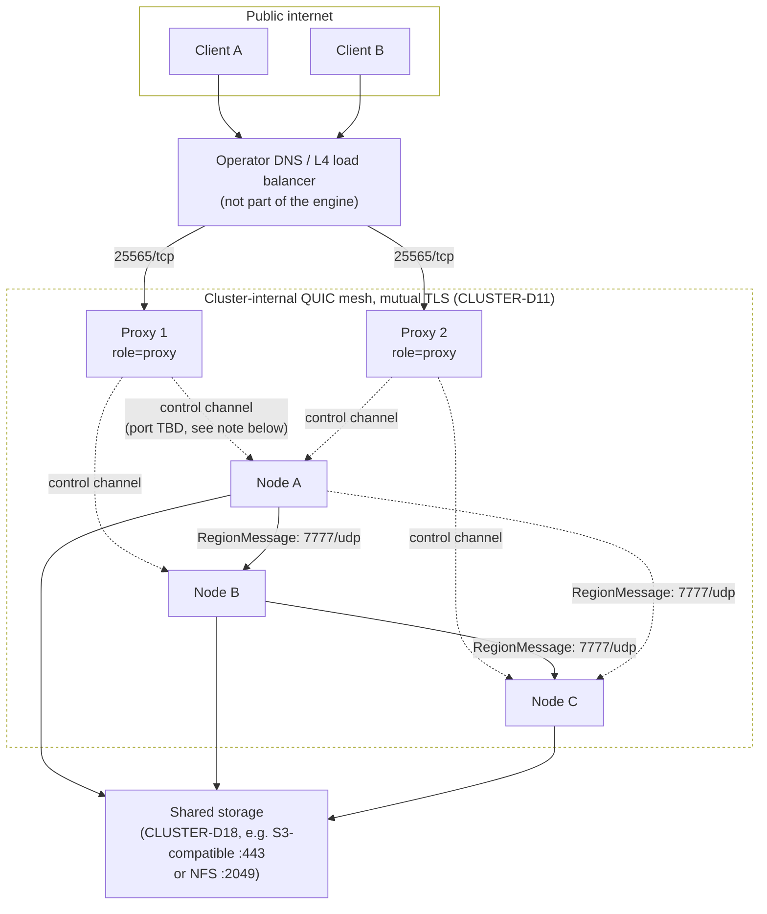

# M7-B08 — Cluster Bootstrap, Config & Deployment

| Field | Content |
|---|---|
| ID | M7-B08 |
| Milestone | M7 — Cluster Mode Activation |
| Prerequisites | M7-B01 (`rc-transport-net::NetworkTransport` — its exact `new(NetworkTransportConfig, Arc<dyn NodeDirectory>, tokio::runtime::Handle) -> Result<Self, NetworkTransportBuildError>`, `register_region`/`deregister_region`/`is_registered`, `with_metrics_sink`, `shutdown(Duration)`, `NodeId`, `TlsMaterial`, `NetworkTransportConfig`, `NetworkTransportMetricsSink` — restated in full below and consumed exactly). M7-B02 (`rc-cluster` — `ClusterNode::open_or_bootstrap`/`propose_assign_region`/`propose_unassign_region`/`take_health_events`/`directory`/`shutdown`, `ClusterNodeConfig`, `StorageLocation`, `RaftTuning`, `NodeId`, `Epoch`, `RegionLease`, `DirectoryCache`, `ClusterAdminApi::remove_member`, `JoinClient`, `TypeConfig` — restated in full below and consumed exactly). M6-B07 (the monolithic composition root this blueprint's `main.rs`/`config.rs` edits extend additively — `run_embedded`, `CompositionConfig`, `ServerComposition`, `crate::config::WorldConfig`/`SchedulerConfig`, `crate::play::executor_bootstrap::build_server_executor`, restated exactly; **zero** change to any of `ServerComposition`'s own fields, methods, or monolithic behavior). M6-B04 (the reference-host-fingerprint pattern this blueprint's own `compose-topology-gate` CI job structurally copies — a `workflow_dispatch`-only job whose first genuinely-green run is a later milestone-acceptance signal, never a condition of *this* blueprint's own Tier-1 Done state; restated in Context §G). |
| Implements | CLUSTER-D14 (discovery/bootstrap — restated, driven for real from parsed config). CLUSTER-D20/D21 (role resolution only — proxy's *own* connection-termination/forwarding logic is out of scope, §A). CLUSTER-D25 (tick-sync independence — restated, confirming this blueprint adds no cross-node barrier). CLUSTER-D26 (compilation/activation split — restated and proven by this blueprint's own monolithic-inertness tests). CLUSTER-D27 (the `[cluster]` config surface — restated, completed with this blueprint's own two flagged field additions, and implemented for real as a parser). CLUSTER-D28 (observability wiring — restated: `tracing`+OTLP config surface, no bundled backend). WS-D5(a)/WS-D6 (feature-gating and proxy-as-library, restated as the activation semantics this blueprint's role resolution proves). WS-D11 (the existing `--no-default-features --features monolithic` CI leg, restated as the mechanism this blueprint's monolithic-inertness tests run under). PLAN-D3 (the hard constraint this whole blueprint operates under — restated in full, §A). TEST-D45/D46 (test-first changeset boundary). TEST-D50 (CI-is-authority). TEST-D34/D37/D43 (CI matrix, gated-job tier, Windows/Linux operability — restated for this blueprint's own new `compose-topology-gate` job). |
| Crates touched | `rusty-clanker-server` (`crates/server/`) — additive only: `src/config.rs` (new `ClusterConfig`/`ClusterRole` types), `src/composition/cluster.rs` (new), `src/main.rs` (new role-resolution branch; **zero** change to the existing monolithic call path's own code), `Cargo.toml` (additive dependency/dev-dependency entries, Deliverables). Root `Cargo.toml` — three new `[workspace.dependencies]` entries (`tracing-subscriber`/`tracing-opentelemetry`/`opentelemetry-otlp`, Context §J). `xtask` (`xtask/`) — additive: one new verb, `compose-topology-gate`. `.github/workflows/ci.yml` — one new, additive, `workflow_dispatch`-only job. New, non-code paths: `deploy/cluster/docker-compose.cluster-test.yml`, `deploy/cluster/README.md`. **Not** any file under `crates/cluster/`, `crates/transport-net/`, or `crates/proxy/` (the last does not exist yet — its own role's runtime logic is explicitly out of scope, §A) — this blueprint consumes M7-B01/M7-B02's already-fixed public APIs unmodified (plus, dev-only, their already-pinned `openraft`/`rcgen` versions for its own test doubles) and proposes zero change to either crate's own source. |
| Estimated scope | L, explicitly oversized against `00-blueprint-spec.md`'s general ~300-line-Context/~800-line-body guideline — the same class of stated exception `M6-B07`, `M7-B01`, and `M7-B02` already established for a composition-root-adjacent blueprint whose job is precisely to stop deferring eight genuinely distinct, individually-small deployment concerns (config, startup sequencing, topology, compose testing, shutdown, restart stance, observability, validation UX) that would each restate the same config/role/API surface from scratch if split into eight separate blueprints. |

## Goal & Done definition

Give `rusty-clanker-server` a real `[cluster]` config surface and a real cluster-node startup/shutdown sequence, extending M6-B07's composition root exactly at the one seam CLUSTER-D26/D27 name — config presence — without touching one line of M0–M6's ECS, tick-pipeline, or domain code (PLAN-D3). Concretely: (1) `ClusterConfig`, a complete, validated parse of the `[cluster]` TOML table, absence of which is proven, by test, to leave monolithic mode byte-identical to M6-B07's own already-shipped behavior; (2) `resolve_role`, the one function that turns a parsed config into `ServerRole::{Monolithic, ClusterNode, ClusterProxy}` and is the *only* place cluster code ever becomes reachable; (3) `ClusterNodeComposition`, a node-role composition type built from M7-B01's `NetworkTransport` and M7-B02's `ClusterNode`, generic over the raft-network-transport and chunk-storage-backend trait boundaries those two blueprints already fixed, that carries a node from config through control-plane join, transport bring-up, storage attachment, and region-assignment receipt to a serving state — with precise, actionable failure handling named at every step; (4) graceful shutdown and planned decommission (migrate every owned region to a live peer, then leave raft membership) built entirely on M7-B02's already-existing `propose_assign_region`/`remove_member` API, no new control-plane primitive; (5) the reference deployment topology and a concrete, committed docker-compose test topology, plus a `workflow_dispatch`-only CI gate proving it boots, mirroring M6-B04's own established "spec now, first-green-later" pattern for exactly the same reason: the concrete QUIC-backed raft-RPC network transport and `ObjectStoreBackend` (CLUSTER-D18/WORLD-D17) this blueprint's production code is generic over do not exist as of this document's authorship (§A names this precisely, once, and does not gloss over it); (6) `tracing`+OTLP observability wiring and the cluster-wide metric set, config surface only, no bundled backend (CLUSTER-D28); (7) actionable config-validation errors for every failure this blueprint names, proven by test, never a panic and never partial serving.

Done when:

- [ ] `cargo build -p rusty-clanker-server -p xtask --all-features` succeeds with zero warnings, on both `ubuntu-24.04` and `windows-2025`.
- [ ] `cargo build -p rusty-clanker-server --no-default-features --features monolithic` succeeds with zero warnings on both OS legs (WS-D11's existing leg, unaffected).
- [ ] Every acceptance test in this blueprint's own test changeset passes under `cargo nextest run -p rusty-clanker-server -p xtask`.
- [ ] Every pre-existing `rusty-clanker-server` test (M1-B05 through M6-B07's own full suite) still passes, byte-for-byte unmodified — proving this blueprint's additive `config.rs`/`main.rs` edits are behavior-preserving for every monolithic caller.
- [ ] `absent_cluster_config_leaves_monolithic_path_byte_identical` and `resolve_role_never_reaches_cluster_code_without_a_cluster_table` (Acceptance tests) both pass — the criterion-4 support the task names.
- [ ] `node_startup_sequence_reaches_serving_with_single_bootstrap_node`, `node_startup_receives_region_assignment_and_spawns_it_locally`, and `two_node_join_flow_reaches_serving_on_both` all pass, entirely in-process, against real M7-B01 `NetworkTransport` (real loopback QUIC) and real M7-B02 `ClusterNode` (in-process raft-network test doubles, §A).
- [ ] `decommission_reassigns_owned_regions_and_leaves_membership` and `decommission_refuses_when_no_live_peer_can_receive_a_region` both pass.
- [ ] Every startup-failure-path test (`unreachable_seeds_...`, `storage_attach_failure_...`, `bad_tls_material_...`, `cluster_config_rejects_*`) passes, each asserting an actionable, typed error and zero partial serving.
- [ ] `compose_file_is_valid_and_matches_declared_services` passes (a plain, no-Docker, string/structure check against the committed compose file — Context §G).
- [ ] `cargo run -p rusty-clanker-server -- --help` prints usage advertising `--config` and documents that `[cluster]` activates cluster mode, with zero panics.
- [ ] `cargo run -p xtask -- path-guard` exits 0 against this blueprint's own changesets, correctly labeled per Constraints.
- [ ] `cargo run -p xtask -- fmt-check` and `cargo run -p xtask -- lint` both exit 0.
- [ ] `cargo test --doc -p rusty-clanker-server -p xtask` exits 0.
- [ ] CI tier: Tier 1 (`fmt-check`, `lint`, `lint-deps`, `test`, `path-guard`) green on both `ubuntu-24.04` and `windows-2025`, clean checkout (TEST-D34/D50). The new `compose-topology-gate` job (Deliverables) is `workflow_dispatch`-only and is **not** part of the required Tier-1 status-check set, and — restated plainly, not glossed over — its first genuinely all-services-healthy run is gated on a not-yet-written sibling blueprint (§A); that first green run is a later milestone-acceptance signal, mirroring M6-B04's own identical framing for its own `reference-host-gate` job, never a condition of this blueprint's own Done state.

## Context (self-contained)

### §A — Scope boundary: what this blueprint builds, what it deliberately does not, and why

**The hard constraint every section below obeys (PLAN-D3, restated verbatim):** "`M7` (Cluster Mode Activation) does not build or revisit [the message-passing substrate or the region partition model]: it adds `NetworkTransport`, the raft-backed `RegionId -> NodeId` directory, and the proxy — swapping which struct sits behind `dyn Transport` (ARCH-D26) and adding one addressing hop (CLUSTER-D1) — without touching `M0`–`M6`'s ECS, tick-pipeline, or domain logic." This blueprint's own Deliverables touch exactly zero files under `crates/scheduler/`, `crates/mechanics/`, or any file `M6-B07` already fixed beyond `crates/server/src/config.rs` and `crates/server/src/main.rs`, and both of those edits are strictly additive (new types, new match arms) — never a change to `WorldConfig`, `SchedulerConfig`, `ServerComposition`, `CompositionConfig`, or `run_embedded`'s own existing signature or behavior. Where this blueprint's own node-role composition needs a mechanism `M6-B07` already built (`RegionManager`, `EdfScheduler`, `build_server_executor`, `RcWorkerPool`, `MetricsRegistry`), it *calls* that already-public API from a new file (§E) rather than modifying the type that owns it — the one seam this blueprint's own cluster-node startup sequence genuinely needs from `M6-B07` (a way to spawn a region into a live `RegionManager`/`EdfScheduler` pair without going through `ServerComposition`'s own player-join/pinned-layout bootstrap, §B of that blueprint) is **already satisfied** by `RegionManager::spawn_region` and `EdfScheduler::register_region`, both already `pub` — no new seam, no finding, no edit needed.

**Three genuinely out-of-scope items, named precisely, exactly as `M7-B01`/`M7-B02` each named their own (never silently glossed over):**

1. **The real raft-RPC network transport.** `rc_cluster::ClusterNode::open_or_bootstrap` is generic over `impl openraft::RaftNetworkFactory<rc_cluster::TypeConfig> + 'static` and `impl rc_cluster::JoinClient + 'static` (M7-B02's own Context §A item 1: "a future sibling M7 blueprint supplies the QUIC-backed `RaftNetworkFactory`... most plausibly built on `rc-transport-net`'s connection-pooling primitives"). That sibling blueprint does not exist as of this document's authorship. This blueprint's own `ClusterNodeComposition::start` (§C/§E) is written **generic over the identical two type parameters**, calling straight through to `ClusterNode::open_or_bootstrap` unmodified — the moment that sibling blueprint lands, `main.rs`'s cluster-node branch (§D) gains a concrete type to instantiate and nothing else in this blueprint's own code changes. Until then, `main.rs`'s own binary entry point, on resolving `ServerRole::ClusterNode`, has no concrete network-factory/join-client type to construct and exits with a clear, actionable, non-panicking `not yet available` message (§D) — this is an honest "the dependency this role needs is not linked into this build yet" refusal, not a placeholder implementation of the role itself. This blueprint's own acceptance tests (§ Acceptance tests) prove the entire startup sequence (config → role → control-plane join → transport up → storage attach → region-assignment receipt → serving) works correctly by exercising real `NetworkTransport` (M7-B01, real loopback QUIC — already-proven production code) together with the in-process `RaftNetworkFactory`/`JoinClient` test doubles M7-B02's own test suite already validated the identical technique against (`InProcessRaftNetwork`/`InProcessJoinClient`, restated locally per this blueprint's own test-only support module, §Deliverables — a dev-only crate boundary means M7-B02's own `tests/support/` module cannot literally be imported from this crate, so this blueprint restates the same, already-proven technique rather than inventing a new one).
2. **`ObjectStoreBackend` (WORLD-D17/D18).** Not built by any blueprint as of this document's authorship — `03-world-chunks-persistence.md`'s own text names it as a future implementation of the already-real `ChunkStorageBackend` trait (M2-B03). This blueprint's "storage attach" step (§C step 4, §E) is written generic over `Arc<dyn rc_chunk_storage::ChunkStorageBackend>` — the already-real trait — and never hardcodes `AnvilDiskBackend` (WORLD-D17 fixes that cluster mode always selects `ObjectStoreBackend`, never `AnvilDiskBackend`, so this blueprint must not, and does not, offer `AnvilDiskBackend` as a cluster-mode storage option even as a stopgap: `AnvilDiskBackend`'s own sector-table bookkeeping is per-process-local and unsafe for two node processes to point at the same shared directory concurrently, exactly WORLD-D18's own rationale for why cluster storage needs object-per-chunk semantics in the first place). This blueprint's own tests use a test-only in-memory `ChunkStorageBackend` fake (§Deliverables) — genuinely exercising the trait boundary, never claiming to exercise `ObjectStoreBackend` itself.
3. **`rc-proxy`'s own connection-termination/forwarding/handoff logic (CLUSTER-D20–D24).** `role = "proxy"` config parsing and validation *are* in this blueprint's scope (§B) — a config author gets a correctly-validated, actionable result either way — but the proxy's own runtime behavior once resolved is not: `main.rs`'s `ServerRole::ClusterProxy` arm (§D) is symmetric with the node arm's own honest "not yet available" resolution, for the identical reason (the crate that would implement it, `rc-proxy`, is a placeholder-path per `12`'s own manifest and has no blueprint yet). CLUSTER-D2's rebalancer and CLUSTER-D16's takeover *decision* algorithm (which live node gets a failed node's regions) are equally out of scope, unchanged from M7-B02's own already-stated boundary — this blueprint's decommission mechanism (§H) is a **planned, operator-triggered** action built entirely on `ClusterNode::propose_assign_region`/`remove_member`, never an automatic-failure-driven one.

None of these three gaps blocks this blueprint's own Done state (Goal & Done definition, restated) because none of this blueprint's own required Tier-1 tests depends on a concrete instance of any of them — every test that would need one uses the identical in-process/test-only substitution this corpus already established as sound engineering practice in M7-B01 §Acceptance tests and M7-B02 §Acceptance tests, not a shortcut invented here.

### §B — Config surface: the `[cluster]` table, exact, and its activation semantics

CLUSTER-D27's own example table, restated verbatim: `role = "node"  # "node" | "proxy"`, `node_id = "node-a"`, `bind = "0.0.0.0:7777"`, `bootstrap = false`, `seeds = ["node-b.internal:7777", "node-c.internal:7777"]`, `shared_storage = "s3://bucket/world-a/"`, `ca_cert = "/etc/rustyclanker/cluster-ca.pem"`. This blueprint completes it with **two field groups CLUSTER-D27 left implicit**, each a direct, cited extension of a gap a prerequisite blueprint already flagged, restated here rather than left for an implementer to guess:

- **This node's own TLS identity** (`node_cert`, `node_key`) — M7-B01 §F's own flagged extension: "`this blueprint's own `TlsMaterial` struct carries the node's own cert chain and private key alongside the trusted CA... restated as this blueprint's own extension of that config table (`node_cert`/`node_key` fields alongside the already-named `ca_cert`), not a silent edit to `13`'s text." This blueprint is the concrete config-parsing site that realizes that extension.
- **This node's own local raft-storage path** (`raft_data_dir`) — a genuine gap in CLUSTER-D27's own table: CLUSTER-D13 fixes that raft-log/state-machine `redb` persistence is **local to each node** ("backed by `redb`... for local raft-log and state-machine persistence on each node"), a materially different thing from `shared_storage` (the network-reachable chunk-data backend, CLUSTER-D18) — CLUSTER-D27's own table names only the latter. This blueprint adds an optional `raft_data_dir = "./cluster-data/node-a/"` field: when the operator omits it, `ClusterConfig::resolved_raft_data_dir()` (below) derives `./cluster-data/<node_id>/` from the already-parsed `node_id` — a plain per-field `#[serde(default)]` cannot do this derivation itself, since a serde default function has no access to a sibling field's value, so this blueprint resolves it lazily at the one call site that needs it (`rc_cluster::StorageLocation::File`, §E) rather than at parse time.

```rust
// crates/server/src/config.rs (modify — additive)

/// The complete, validated `[cluster]` table (CLUSTER-D27, extended per Context §B).
/// `ClusterConfig::load` returning `Ok(None)` — table entirely absent from the parsed
/// file, or `--config` itself was never given — is CLUSTER-D27's own zero-config
/// default: monolithic mode, no further action.
#[derive(serde::Deserialize, Clone, Debug)]
#[serde(deny_unknown_fields)]
pub struct ClusterConfig {
    pub role: ClusterRole,
    pub node_id: String,
    pub bind: std::net::SocketAddr,
    #[serde(default)]
    pub bootstrap: bool,
    #[serde(default)]
    pub seeds: Vec<String>,
    /// CLUSTER-D18's shared, network-reachable chunk-storage URI (`s3://...`,
    /// `nfs://...`, or any URI a future `ObjectStoreBackend` accepts). Required for
    /// `role = "node"`; ignored (but still parsed, never rejected) for `role =
    /// "proxy"`, which never touches chunk storage directly.
    pub shared_storage: String,
    pub ca_cert: std::path::PathBuf,
    /// Context §B's own extension — this node's own TLS identity (M7-B01 §F).
    pub node_cert: std::path::PathBuf,
    pub node_key: std::path::PathBuf,
    /// `role = "proxy"` only (M7-B06 §D) — this proxy's own outbound-dialing QUIC
    /// address for the proxy<->node link. `None` on a `role = "node"` config.
    #[serde(default)]
    pub proxy_bind: Option<std::net::SocketAddr>,
    /// `role = "node"` only (M7-B06 §D) — this node's second, proxy-facing QUIC
    /// listen address, distinct from `bind`. `None` on a `role = "proxy"` config.
    #[serde(default)]
    pub proxy_accept_bind: Option<std::net::SocketAddr>,
    /// Required for both roles (M7-B06 §D/§F) — path to the 32-byte shared secret
    /// every proxy signs, and every node verifies, a `ForwardedIdentity` envelope
    /// with (CLUSTER-D20), operator-distributed alongside `ca_cert`.
    pub forwarding_secret_path: std::path::PathBuf,
    /// Context §B's own extension — where THIS node's local raft `redb::Database`
    /// lives. Never shared, never network storage (contrast `shared_storage`).
    /// `None` when the operator left the key out — resolved by
    /// `resolved_raft_data_dir()` below, never by a bare field read.
    #[serde(default)]
    pub raft_data_dir: Option<std::path::PathBuf>,
    /// `rc_cluster::RaftTuning`'s three fields, individually overridable; any field
    /// left unset takes `RaftTuning::default()`'s own value (Context §B).
    #[serde(default)]
    pub raft: ClusterRaftTuningOverride,
    /// CLUSTER-D17's tighter cluster-mode save-interval recommendation (≤30s/dirty
    /// region), expressed in ticks. Applied to `WorldConfig.save_interval_ticks`
    /// only when the operator left that field at its own unset default — an
    /// explicit `--save-interval-ticks` or `[world]` value always wins (Context §K).
    #[serde(default = "default_cluster_save_interval_ticks")]
    pub save_interval_ticks: u64,
    /// CLUSTER-D28's own config surface — an OTLP collector endpoint this node
    /// exports `tracing` spans to. `None` (default): no export, spans still emit
    /// locally via whatever subscriber the operator's own binary installs (Context
    /// §J — this crate never installs a subscriber itself).
    #[serde(default)]
    pub otlp_endpoint: Option<String>,
}

#[derive(serde::Deserialize, Clone, Copy, Debug, PartialEq, Eq)]
#[serde(rename_all = "lowercase")]
pub enum ClusterRole { Node, Proxy }

/// Local restatement of `rc_cluster::RaftTuning`'s three fields as `Option`s (this
/// crate cannot `#[derive(Deserialize)]` a type it does not own) — mirrors
/// `M6-B07`'s own "restate the wire shape locally" discipline (its §A, applied to
/// `LocalRegionLayoutSpec`) for the identical reason: `rc_cluster::RaftTuning` has
/// no `Deserialize` impl of its own and this crate must not add one to a foreign
/// type it does not own.
#[derive(serde::Deserialize, Clone, Copy, Debug, Default)]
#[serde(default)]
pub struct ClusterRaftTuningOverride {
    pub heartbeat_interval_ms: Option<u64>,
    pub election_timeout_min_ms: Option<u64>,
    pub election_timeout_max_ms: Option<u64>,
}

impl ClusterRaftTuningOverride {
    /// Merges every `Some` field over `rc_cluster::RaftTuning::default()`.
    pub fn resolve(&self) -> rc_cluster::RaftTuning;
}

#[derive(Debug, thiserror::Error)]
pub enum ClusterConfigError {
    #[error("[cluster].role must be \"node\" or \"proxy\", got {0:?}")]
    InvalidRole(String),
    #[error("[cluster].bootstrap = true with a non-empty [cluster].seeds list is contradictory — CLUSTER-D14 reserves bootstrap=true for the very first node of a brand-new cluster, which by definition has no seed to join; set bootstrap=false to join an existing cluster via seeds, or clear seeds to bootstrap a new one")]
    BootstrapWithSeeds,
    #[error("[cluster].shared_storage is required for role=\"node\" (CLUSTER-D18) but was empty")]
    MissingSharedStorageForNode,
    #[error("[cluster].{field} = {path:?} does not exist or is not readable: {source}")]
    TlsMaterialUnreadable { field: &'static str, path: std::path::PathBuf, #[source] source: std::io::Error },
    #[error("[cluster] table failed to parse: {0}")]
    Parse(#[from] toml::de::Error),
    #[error("could not read config file {path:?}: {source}")]
    Io { path: std::path::PathBuf, #[source] source: std::io::Error },
}

impl ClusterConfig {
    /// Reads `path`'s `[cluster]` table only (siblings to `[world]`/`[scheduler]` in
    /// the same file, `WorldConfig::load`'s own established convention). `Ok(None)`
    /// — never an error — when the table is entirely absent, or `path` itself does
    /// not name a `[cluster]` table at all: CLUSTER-D27's zero-config default is a
    /// legitimate outcome, not a failure to recover from. Runs `validate` (below)
    /// before returning `Ok(Some(_))` — a `ClusterConfig` value that exists at all
    /// has always already passed validation.
    pub fn load(path: &std::path::Path) -> Result<Option<Self>, ClusterConfigError>;
    /// Full field-level validation beyond serde's own type/enum checking (Context
    /// §K): `BootstrapWithSeeds`, `MissingSharedStorageForNode`, and a readability
    /// probe (open-for-read, not a full parse) on `ca_cert`/`node_cert`/`node_key`
    /// each producing its own `TlsMaterialUnreadable { field, .. }`.
    fn validate(&self) -> Result<(), ClusterConfigError>;
    /// `raft_data_dir.clone().unwrap_or_else(|| PathBuf::from(format!(
    /// "./cluster-data/{}/", self.node_id)))` — the one call site (§E) that ever
    /// needs a concrete path reads it through here, never through the bare field
    /// (Context §B).
    pub fn resolved_raft_data_dir(&self) -> std::path::PathBuf;
}

fn default_cluster_save_interval_ticks() -> u64 { 600 } // CLUSTER-D17: 30s @ 20 TPS
```

**Activation semantics, restated exactly (CLUSTER-D26/WS-D5(a)):** the message-passing substrate, `RegionManager`, `EdfScheduler`, and every other piece M0–M6 built stay **always compiled in, unconditionally** — this blueprint changes nothing about that. `rc-transport-net`/`rc-cluster`/`rc-proxy` are `optional = true` dependencies of `rusty-clanker-server`, unified under the `cluster` Cargo feature, **on by default** in the officially distributed binary (M0-B01 already wired this exactly; this blueprint touches no `Cargo.toml`). The **compiled-in-but-inert** rule is the one this blueprint's own tests exist to prove: compiling with the `cluster` feature active does not, by itself, execute one line of cluster code — `resolve_role` (§D) is the *sole* gate, and it is driven purely by whether `ClusterConfig::load` returned `Some` — never by which Cargo features happened to be compiled in. A binary built `--features monolithic` (the feature stripped entirely) and a binary built with default features but given a config file with no `[cluster]` table are **observably identical at runtime** — this is the precise claim `absent_cluster_config_leaves_monolithic_path_byte_identical` (Acceptance tests) checks.

### §C — Node startup sequence: the six steps, ordering and failure handling, exact

Restating the task's own named ordering — role resolution → control-plane join (B02) → transport up (B01) → storage attach → region-assignment receipt → serving — as a precise, six-step sequence `ClusterNodeComposition::start` (§E) executes in order, never reordered, each step's failure short-circuiting every later step (no partial serving is ever reachable — the composition type is either fully assembled and returned, or the whole attempt fails and every resource opened so far is released before the error surfaces):

1. **Role resolution.** Already complete by the time `start` is called — `main.rs` (§D) has already matched `ServerRole::ClusterNode(cluster_config)` before constructing anything, and `cluster_config` has already passed `ClusterConfig::validate` (§B) inside `ClusterConfig::load` — a `ClusterNodeComposition::start` caller always holds an already-valid config, which is why `start`'s own error type (§E) has no "bad config" variant of its own. Not repeated here; named for ordering completeness only.
2. **Control-plane join.** `node_config: rc_cluster::ClusterNodeConfig` is built straight from the already-validated `ClusterConfig` — `node_id: rc_cluster::NodeId::new(config.node_id.clone())`, `bind_addr: config.bind.to_string()`, `bootstrap`, `seeds`, `raft: config.raft.resolve()` (Context §B) — and `storage: rc_cluster::StorageLocation::File(config.resolved_raft_data_dir())` is this step's own use of `resolved_raft_data_dir()` (Context §B — the one call site that ever reads it; this is the raft control plane's own **local** storage, never the shared chunk-storage backend step 4 attaches). `rc_cluster::ClusterNode::open_or_bootstrap(node_config, network_factory, join_client)` (M7-B02, unmodified) is then the single call that either self-bootstraps (fresh store, `bootstrap: true`) or runs CLUSTER-D14's join flow against `seeds` (fresh store, `bootstrap: false`) or silently resumes prior state (a genuine restart, `seeds`/`bootstrap` untouched — CLUSTER-D14's own "never re-bootstrap" guarantee, already proven by M7-B02's own `rejoin_after_restart_resumes_without_re_bootstrap_or_re_join` test). **Failure handling:** every `seeds` entry exhausted without success surfaces `rc_cluster::ClusterError::NoReachableSeed`, wrapped into `ClusterCompositionError::ControlPlaneJoin` naming every attempted address (§ Acceptance tests, `unreachable_seeds_produce_actionable_error_and_no_partial_serving`) — no partial raft state is left registered anywhere reachable by a later retry, since `open_or_bootstrap` itself either fully succeeds or the `ClusterNode` value is never constructed.
3. **Transport up.** `rc_transport_net::NetworkTransport::new(NetworkTransportConfig::new(rc_transport_net::NodeId::new(config.node_id.clone()), config.bind, tls_material), Arc::new(node_directory_adapter), runtime.clone())` (M7-B01, unmodified) — `tls_material` is built by reading `ca_cert`/`node_cert`/`node_key`'s already-validated (step-1) bytes into `TlsMaterial`, and `node_directory_adapter` is Context §E's own thin `NodeDirectory` implementation over the just-constructed `ClusterNode::directory()`. Restated precisely because `rc_transport_net::NodeId` (`Arc<str>`-backed, M7-B01 §F) and `rc_cluster::NodeId` (`String`-backed, M7-B02 §B) are two **separate** newtypes in two separate crates, each already fixed by its own owning blueprint — this step is the one place both are constructed from the same underlying `config.node_id` string, never conflated into one type. **Failure handling:** a TLS-material or bind-address failure surfaces `NetworkTransportBuildError`, wrapped into `ClusterCompositionError::TransportBind`; the `ClusterNode` step 2 already produced is cleanly shut down first (identical unwind discipline to step 4 below) — no lingering raft membership for a node whose transport never came up.
4. **Storage attach.** Probes the injected `Arc<dyn rc_chunk_storage::ChunkStorageBackend>` for reachability *before* proceeding — a single, cheap `read_chunk` call against a well-known, always-absent sentinel key (dimension `OVERWORLD`, `RegionFileKind::Terrain`, `x = i32::MIN, z = i32::MIN` — a coordinate no real chunk ever occupies, per `rc_core::DimensionId`/chunk-coordinate range, chosen specifically so a real backend always returns `Ok(None)` rather than requiring a dedicated health-check method this blueprint would otherwise have to add to `ChunkStorageBackend` itself, an existing-seam change this blueprint avoids by construction) — `Ok(_)` (found or not-found, both prove reachability) passes; `Err(StorageError::_)` surfaces as `ClusterCompositionError::StorageUnreachable`, naming the underlying error. **Ordering, deliberate:** this step runs **after** control-plane join and transport up (steps 2-3), not before — a node that cannot reach shared storage is still a legitimate raft member and transport peer (it can still vote, still serve the directory, still relay `RegionMessage` traffic for regions it does not itself own), so putting storage validation last among the three network-touching steps means a storage misconfiguration is diagnosed with the operator's own `node_id`/cluster membership already established, giving a much more actionable error (which node, in which cluster) than a pre-join probe could. If this step fails, the `ClusterNode`/`NetworkTransport` values steps 2-3 already produced are cleanly shut down again (raft handle dropped, local `redb` file handle released, transport `shutdown()` called) before the error surfaces — `start`'s own caller never receives a value it would need to separately clean up. This exact ordering — join and transport succeed, then storage fails, then clean unwind — is what `storage_attach_failure_surfaces_after_successful_control_plane_join` (Acceptance tests) proves.
5. **Region-assignment receipt.** `ClusterNodeComposition` spawns a dedicated background watcher (Context §E) that polls `cluster_node.directory().snapshot()` at a fixed interval (`REGION_ASSIGNMENT_POLL_INTERVAL = Duration::from_millis(200)`, matching M7-B02's own `HealthMonitorConfig::poll_interval` seed default for consistency, calibration-pending like every other numeric threshold this corpus carries) and, for every `(RegionId, DirectoryEntry)` whose `entry.node` equals this node's own `NodeId` and is **not yet locally spawned**, performs the identical spawn sequence M6-B07's own pinned-layout bootstrap already established (§C.2 of that blueprint, restated): `RegionManager::spawn_region`, register with `NetworkTransport::register_region` and `EdfScheduler::register_region`, construct that region's own `ChunkLifecycleManager`/`TicketManager` pair against the attached storage backend (step 4). **Failure handling:** a spawn failure for one region (e.g. the shared-storage-backed `RegionManifest`, WORLD-D19, fails to load for that specific region) is logged and metriced (`on_region_spawn_failed`, §J) and retried on the watcher's next poll — it never aborts the whole node process, since every *other* already-serving region must keep ticking (ARCH-D7's own "only an overloaded region degrades its own TPS" principle, extended here to "a region that fails to load degrades only itself"). A region this node's directory entry later shows reassigned *away* (a decommission or takeover elsewhere) is deregistered from all three tables (`RegionManager`, transport, `EdfScheduler`) the same watcher tick it is observed — this is the *receiving* half of both this blueprint's own decommission mechanism (§H) and any future takeover/rebalancer blueprint's own `propose_assign_region` calls, requiring no cooperation from whichever blueprint eventually issues those calls beyond the directory commit itself.
6. **Serving.** `ClusterNodeComposition::is_serving()` becomes `true` once steps 2-4 have all succeeded — deliberately **not** gated on any region ever being assigned (a freshly-joined node with zero owned regions is fully "serving" in the sense that it is a live, reachable raft member and transport peer, ready to receive an assignment at any time; CLUSTER-D2's rebalancer, once it exists, is what actually gives it work). A cluster **node** never binds a player-facing TCP listener and never constructs a `PlayerSessionSink` — CLUSTER-D20's "backend nodes never see a raw client socket" is upheld by construction: `ClusterNodeComposition` simply has no such field or method (contrast `ServerComposition`, M6-B07, which does).

### §D — Role resolution in `main.rs`

`resolve_role` is the **one and only** function that turns config into a decision about which code path runs — every downstream cluster-only type becomes reachable exclusively through its `ServerRole::ClusterNode`/`ServerRole::ClusterProxy` arms, never through any other call path, which is exactly what makes `resolve_role_never_reaches_cluster_code_without_a_cluster_table` (Acceptance tests) a complete proof rather than a spot check.

```rust
// crates/server/src/composition/cluster.rs (new)

pub enum ServerRole {
    /// `[cluster]` absent — M6-B07's own, byte-unmodified `run_embedded` path.
    Monolithic,
    ClusterNode(Box<crate::config::ClusterConfig>),
    ClusterProxy(Box<crate::config::ClusterConfig>),
}

/// The sole config-presence gate (CLUSTER-D26/D27). `cluster_config: None` ALWAYS
/// yields `Monolithic`, unconditionally — no other field of any other config
/// struct is ever consulted for this decision.
pub fn resolve_role(cluster_config: Option<crate::config::ClusterConfig>) -> ServerRole;
```

`main.rs`'s own dispatch, restated as pseudocode (real body, Deliverables): parse CLI + load `WorldConfig`/`SchedulerConfig`/`ClusterConfig` from `--config` exactly as `M6-B07` §J already does for the first two, plus this blueprint's own `ClusterConfig::load` for the third; call `resolve_role`; match:

- `Monolithic` → build `CompositionConfig` and call `rusty_clanker_server::run_embedded(config)` **exactly as `M6-B07` already wrote it — zero new code on this arm**.
- `ClusterNode(cfg)` → **today**, construct nothing (Context §A item 1: no concrete `RaftNetworkFactory`/`JoinClient` is linked into this binary yet) — print a single-line, actionable, non-panicking message to stderr (`"cluster node role selected, but this build has no raft network transport linked in yet — see M7's cluster-network-transport blueprint"`) and exit with a distinct, documented exit code (`EXIT_CLUSTER_INTEGRATION_PENDING = 3`), **never** a panic, **never** a partially-started process. This is not this role's *implementation* — it is this role's current, honest *unavailability*, and it changes to a real call into `ClusterNodeComposition::start` (§E) with zero other code changed the moment a concrete network-factory/join-client type exists to pass it.
- `ClusterProxy(cfg)` → symmetric with the node arm, for the identical reason (`rc-proxy` does not exist yet, Context §A item 3): actionable message, `EXIT_CLUSTER_INTEGRATION_PENDING`, no partial state.

### §E — `ClusterNodeComposition`: the type this blueprint actually builds and tests

```rust
// crates/server/src/composition/cluster.rs (continued)

#[derive(Debug, thiserror::Error)]
pub enum ClusterCompositionError {
    #[error("control-plane join failed: {0}")]
    ControlPlaneJoin(#[from] rc_cluster::ClusterError),
    #[error("network transport failed to bind: {0}")]
    TransportBind(#[from] rc_transport_net::NetworkTransportBuildError),
    #[error("shared storage backend at startup is unreachable: {0}")]
    StorageUnreachable(String),
    #[error("no live peer is able to receive this node's regions during decommission")]
    NoDecommissionTarget,
    #[error("region {0:?} could not be spawned locally: {1}")]
    RegionSpawnFailed(rc_messaging::RegionId, String),
}
```

`RegionSpawnFailed` is never returned from `start`/`decommission`/`shutdown`'s own `Result` — Context §C step 5 is explicit that one region's spawn failure never aborts the whole node. It exists as the structured value the region-assignment watcher's own internal retry-and-log loop constructs and passes to `tracing::warn!`/the metrics sink (Context §J) on each failed attempt — a typed value for structured observability, not a propagated error. Restated here rather than left to look like a dead variant.

```rust
/// The cluster-node composition (Context §C/§E) — the direct sibling of
/// `ServerComposition` (M6-B07) for the node role: reuses the SAME underlying
/// `RegionManager`/`EdfScheduler`/`RcWorkerPool`/`MetricsRegistry`/
/// `build_server_executor` machinery that blueprint already made public, wired
/// from directory-assignment events (§C step 5) instead of player joins /
/// pinned layout — and, unlike `ServerComposition`, never binds a listener and
/// never implements `PlayerSessionSink` (Context §C step 6).
pub struct ClusterNodeComposition { /* private: rc_cluster::ClusterNode, rc_transport_net::NetworkTransport,
    Arc<dyn rc_chunk_storage::ChunkStorageBackend>, Box::leak'd RcExecutor (M6-B07's own established
    process-lifetime-singleton pattern, reused verbatim), RegionManager<'static>, RcWorkerPool,
    EdfScheduler, MetricsRegistry, region-assignment watcher JoinHandle, per-region
    ChunkLifecycleManager/TicketManager table */ }

impl ClusterNodeComposition {
    /// Context §C's full six-step sequence (steps 2-6; step 1 already happened in
    /// the caller). `NF`/`JC` are the exact two type parameters `ClusterNode::
    /// open_or_bootstrap` itself is generic over (Context §A item 1) — this
    /// function adds no constraint beyond what that call already requires. `SB`
    /// is the exact `ChunkStorageBackend` trait M2-B03 already fixed (Context §A
    /// item 2).
    ///
    /// `health_check_addr`, if given, is bound as the very last action of step 6
    /// (Context §C), spawning a background `tokio::task` that, for the remaining
    /// lifetime of this composition, accepts and immediately closes every
    /// connection — a bare TCP listener, distinct from and never reachable by
    /// players (Context §G's own `docker-compose` healthcheck target; `main.rs`'s
    /// own `--health-check-addr` flag, Deliverables, is `None` by default — a
    /// monolithic deployment never sets it, since `resolve_role` never reaches
    /// this function at all in that case). Never bound before step 6, so a
    /// healthcheck probing it before this node is genuinely serving observes
    /// connection-refused, the correct "not yet healthy" signal.
    pub async fn start<NF, JC, SB>(
        config: crate::config::ClusterConfig,
        network_factory: NF,
        join_client: JC,
        storage: std::sync::Arc<SB>,
        runtime: tokio::runtime::Handle,
        health_check_addr: Option<std::net::SocketAddr>,
    ) -> Result<Self, ClusterCompositionError>
    where
        NF: openraft::RaftNetworkFactory<rc_cluster::TypeConfig> + 'static,
        JC: rc_cluster::JoinClient + 'static,
        SB: rc_chunk_storage::ChunkStorageBackend + 'static;

    /// Context §C step 6 — `true` once control-plane join and storage attach
    /// have both succeeded, independent of whether any region is yet assigned.
    pub fn is_serving(&self) -> bool;
    pub fn node_id(&self) -> &rc_cluster::NodeId;
    /// Read-only accessor over this node's own directory-derived view, for tests
    /// and observability (Context §J) — never a second cache (delegates straight
    /// to the underlying `ClusterNode::directory()`).
    pub fn directory(&self) -> &std::sync::Arc<rc_cluster::DirectoryCache>;

    /// Context §H's decommission sequence.
    pub async fn decommission(&self) -> Result<(), ClusterCompositionError>;
    /// Context §H's shutdown ordering (the non-decommission, "just stop" path —
    /// e.g. a hard restart the operator does NOT want to drain first).
    pub async fn shutdown(self);
}
```

The `NetworkTransport` this composition constructs is wired to a `NodeDirectory` implementation that is a **thin, zero-extra-state adapter over `ClusterNode::directory()`** — `resolve(region)` calls `DirectoryCache::lease_of(region).map(|lease| lease.node)`, `node_address` needs a `RegionId -> NodeId -> SocketAddr` hop that `DirectoryCache` alone does not carry (`DirectoryEntry` has no address field, only `node: NodeId, epoch: Epoch`) — this adapter therefore also holds a small `parking_lot::RwLock<HashMap<NodeId, SocketAddr>>` populated from `openraft::RaftMetrics.membership_config`'s own `BasicNode.addr` field (already durably tracked by `rc_cluster`'s own raft state, per M7-B02 §C's choice of `Node = openraft::BasicNode`) via the same `HealthMonitor`-adjacent metrics-watch channel `ClusterNode` already exposes — no new control-plane RPC, no new persisted state, purely a local re-projection of data `rc_cluster` already owns.

### §F — Reference deployment topology (restated from `13`) and the port/firewall matrix

The mermaid-level topology, restated exactly as `13-cluster-architecture.md`'s own Reference Deployment Topology section fixes it: clients reach an operator-provided DNS/L4 load balancer, which fans out to any number of **proxy** instances (`role = "proxy"`), each independently connected to every **node** instance (`role = "node"`) over a mutually-TLS-authenticated QUIC mesh (CLUSTER-D11) carrying both `RegionMessage` data-plane traffic (node↔node only, never proxy↔node) and `openraft` control-plane consensus (every member↔every member) plus proxy↔node control traffic (CLUSTER-D20/D23); every node writes to one shared storage backend (CLUSTER-D18) reachable by all of them. This blueprint reproduces the identical three-node/two-proxy shape as its own canonical example (not a new topology — the same one, restated so this document is self-contained per `00-blueprint-spec.md`'s own governance rule):



**Port/firewall matrix** — every port this topology needs, restated as an operational table CLUSTER-D27's own config table left implicit (each row cites the deciding decision):

| Port | Protocol | Direction | Purpose | Decision |
|---|---|---|---|---|
| `25565` (operator-configurable, `--bind`) | TCP | Public → Proxy | Player connections (Java protocol, NET-D1) | Inherited from monolithic mode's own default (M6-B07 §C step 14) |
| `7777` (operator-configurable, `[cluster].bind`) | UDP (QUIC) | Node ↔ Node | `RegionMessage` data plane, one QUIC stream per ordered pair, mutually TLS-authenticated | CLUSTER-D11: `rc-transport-net`'s own `NetworkTransport` (M7-B01), unmodified by this blueprint |
| Undetermined — flagged, not this blueprint's to fix | UDP (QUIC), presumed | Node ↔ Node, Proxy ↔ Node | `openraft` control-plane RPC traffic, and CLUSTER-D23's own proxy↔node control channel | See note below |

**A genuine, flagged gap, not glossed over:** CLUSTER-D11's own text describes "one persistent multiplexed QUIC connection per (node, node) pair" as covering all cluster-internal traffic, which would suggest raft RPC shares `7777` with `RegionMessage` traffic — but `rc_transport_net::NetworkTransport` (M7-B01), as that blueprint actually built it, owns its own private `quinn::Endpoint` with no public API for another crate to multiplex additional stream types onto it (its `connection.rs` is `pub(crate)`; its only public surface is the `Transport` trait plus register/deregister/metrics/shutdown, M7-B01 §Deliverables). Until the raft-network-transport blueprint (§A item 1) lands and either extends `NetworkTransport`'s public surface to accept a second, opaque stream type (a finding on that future blueprint, not this one) or opens a genuinely separate port for raft RPC, this blueprint does not know which of those two shapes the real deployment will take — this table's second row is left explicitly "undetermined" rather than asserting a specific port this blueprint has no authority to promise. `deploy/cluster/docker-compose.cluster-test.yml` (§G) reserves `7777/udp` only, consistent with the single-port assumption being the *more likely* eventual resolution (CLUSTER-D11's own wording favors it), but this is a documented assumption, not a guarantee.

No port is ever opened by a **node** for inbound player traffic (CLUSTER-D20) — a firewall rule set that blocks `25565` on every node while allowing it only on proxy instances is the topology's own intended, minimal attack surface, restated here as an explicit operational recommendation rather than left for an operator to infer.

### §G — Docker-compose test topology, and the honesty of its current gate

**The compose file itself** (`deploy/cluster/docker-compose.cluster-test.yml`, committed, Deliverables) is a real, complete artifact: three `node` services (`node-a` bootstrap, `node-b`/`node-c` joining via `seeds: [node-a]`) sharing one bind-mounted volume standing in for CLUSTER-D18's shared storage (a `minio` service, S3-compatible, matching the reference topology's own example URI scheme — chosen over a bare NFS mount because it is trivially expressible as one more compose service with zero host-level NFS-server setup, and because it is the concrete backend `ObjectStoreBackend`'s own eventual implementation, WORLD-D17, targets first), each node with a `healthcheck` directive polling a small, already-real signal this blueprint's own code exposes (§Deliverables' `--health-check-addr` flag: a bare TCP listener, **distinct from and never reachable by players**, that accepts a connection and immediately closes it once `ClusterNodeComposition::is_serving()` is `true` — a minimal, purpose-built liveness probe, not a general admin API). **Co-located-latency assumption for criterion 1, restated:** every service in this compose file runs on one Docker host's own bridge network, whose inter-container latency is sub-millisecond — comfortably inside CLUSTER-D7's ≤30ms p99 cross-node budget by construction, which is exactly why a single-host compose topology is a valid stand-in for CLUSTER-D7's "same datacenter/availability zone" requirement without needing real multi-host infrastructure for this level of testing.

**The honest gate, restated plainly (mirroring `M6-B04`'s own established pattern for its `reference-host-gate` job, Context §A of that blueprint, applied here verbatim):** because §A item 1 names that no concrete `RaftNetworkFactory`/`JoinClient` is linked into this build yet, `main.rs`'s `ClusterNode` arm (§D) currently exits with `EXIT_CLUSTER_INTEGRATION_PENDING` rather than actually joining — meaning the `node-a`/`node-b`/`node-c` containers in this compose file **cannot yet reach a genuinely healthy state** under today's build. This blueprint's own `compose-topology-gate` xtask verb and CI job (Deliverables) are nonetheless real, complete, runnable code today: they bring the topology up, poll every service's Docker healthcheck, write a TEST-D40 machine-readable report, and tear the topology down — proven, by this blueprint's own `compose_file_is_valid_and_matches_declared_services` test, to reference the correct service/healthcheck shape. What is **not** claimed is that the job's first real run against a live Docker host is green today — restated exactly as M6-B04 itself restated for its own analogous gap ("that job's own first green run is a milestone-acceptance signal on a provisioned reference host, not a condition of this blueprint's own Tier-1 Done state"), here for the identical reason: the piece that would make it green (§A item 1) is a separate, not-yet-written blueprint's deliverable, and this blueprint's own required Tier-1 gate is scoped to what it can prove today (Goal & Done definition).

### §H — Graceful shutdown and planned decommission

**Plain shutdown** (`ClusterNodeComposition::shutdown`, the operator does not want to migrate this node's regions anywhere first — e.g. a hard restart where the *same* node process will resume with the *same* regions moments later): (1) stop the region-assignment watcher (§C step 5); (2) for every currently-live region, call its `ChunkLifecycleManager::shutdown` (M2-B05's WORLD-D25 flush barrier — the identical call `M6-B07` §K step 4 already established, reused here unmodified); (3) `EdfScheduler::shutdown()`/`join()` (M6-B07 §E, reused); (4) `NetworkTransport::shutdown(timeout)` (M7-B01); (5) `ClusterNode`'s own raft handle is dropped (not `remove_member`'d — this node stays a raft voter, ready to resume via CLUSTER-D14's already-proven rejoin-without-re-bootstrap path the instant it restarts). No region reassignment happens on this path — every region this node owned is simply unreachable (not un-owned) until the process comes back, exactly the same "acceptable data-loss/availability window bounded by last persisted save" CLUSTER-D17 already accepts for an unplanned failure, applied here to a planned one.

**Decommission** (`ClusterNodeComposition::decommission`, the operator wants this node's regions to move to a live peer and this node to permanently leave the cluster — e.g. scaling down, or retiring a machine): built entirely on M7-B02's already-existing API, no new control-plane primitive:

1. Read `directory().snapshot()`, filter to entries whose `node == self.node_id()` — this node's own currently-owned region set.
2. If that set is non-empty and the raft membership (`raft.metrics().membership_config`) contains no *other* live voter, fail immediately with `ClusterCompositionError::NoDecommissionTarget` — a region must never be silently unassigned into limbo (`decommission_refuses_when_no_live_peer_can_receive_a_region`, Acceptance tests).
3. Otherwise, for each owned region, in any order, call `cluster_node.propose_assign_region(region, target)`, where `target` is chosen by the simplest defensible rule this blueprint's own narrow scope supports — round-robin across the *other* live voters (a real load-aware choice is CLUSTER-D2's rebalancer, out of scope, §A item 3; round-robin is a correct, if not load-optimal, placement, and is never wrong in the sense that matters here: every region ends up owned by a live node). Each successful `propose_assign_region` call bumps that region's epoch (CLUSTER-D19) — the *receiving* node's own region-assignment watcher (§C step 5, already running independently on every other live node) picks up the new entry on its own next poll and spawns the region there; this node does **not** push any chunk data itself — the receiving node loads it from shared storage (Context §C step 5's own already-described spawn sequence), exactly the same "migration reuses the shared-storage-flush-then-remote-bootstrap path" CLUSTER-D2's own rationale text already establishes.
4. Poll `directory().snapshot()` until every formerly-owned region's entry shows a `node != self.node_id()` (bounded timeout — a peer's own watcher poll interval, §C step 5, plus a generous margin) — proving the handoff actually landed before proceeding, never assuming success from `propose_assign_region`'s own `Ok` alone (that call only proves the raft commit succeeded, not that a peer has yet noticed and spawned the region).
5. Call `ClusterAdminApi::remove_member(self.node_id())` (M7-B02) — this node permanently leaves raft membership. This call inherits M7-B02's own already-flagged, unresolved moderate-confidence item (its Context §I: whether `openraft`'s own client-write path auto-forwards a non-leader's call to the true leader, or requires the caller to retry against `raft.metrics().borrow().current_leader`) — this blueprint does not re-resolve that question, it simply calls the method M7-B02 already exposes and, if a `ClusterError::NotLeader` surfaces, retries once against the leader `raft.metrics()` names, the same defensive pattern step 3's `propose_assign_region` calls already apply. Unlike plain shutdown, this node **cannot** simply rejoin later via CLUSTER-D14's rejoin-without-re-bootstrap path (that path is for a *member* resuming after a restart; a decommissioned node is no longer a member at all) — restated as an operational consequence an operator should understand, not glossed over: bringing a decommissioned node back into service requires it to run the ordinary join flow again (`bootstrap: false`, fresh `raft_data_dir`), the same as any brand-new node.
6. Call plain `shutdown` (above) to release local resources.

### §I — Rolling restart stance

`13-cluster-architecture.md` names no single decision titled "rolling restart" — this blueprint's own stance is a direct, cited synthesis of three decisions that document already fixes, restated together for the first time as one operational answer: **a rolling restart is one node at a time, either plain-shutdown-then-restart-in-place (relying on CLUSTER-D14's already-proven rejoin-without-re-bootstrap path, §H's plain-shutdown case — the correct choice when upgrading the same binary/config in place) or decommission-then-rejoin-as-a-fresh-member (§H's decommission case — the correct choice when the node's own identity/storage location is changing, e.g. replacing underlying hardware), never both simultaneously across more than one node.** The binding constraint that makes "one at a time" the only safe cadence, restated: CLUSTER-D15's failure-detection mechanism (raft's own leader-driven heartbeat/election-timeout) cannot distinguish "this node is restarting" from "this node has failed" — taking down a second node before the first has either rejoined (plain-shutdown case) or been fully decommissioned (decommission case) risks a raft quorum loss if the cluster's live-voter count drops below a majority, which is a correctness hazard `13` never licenses working around. An operator-facing consequence worth stating plainly: a 3-node cluster tolerates exactly one node being restarted at a time before quorum (2 of 3) is at risk; a larger cluster tolerates proportionally more, but "one at a time, wait for the previous one to fully rejoin or fully decommission before starting the next" is this blueprint's stance regardless of cluster size, since it is the only cadence CLUSTER-D15's own detection mechanism supports without risking a false-positive takeover mid-restart.

### §J — Observability wiring (CLUSTER-D28, restated)

CLUSTER-D28, restated exactly: "the `tracing` crate ecosystem... with OpenTelemetry OTLP export; no observability backend is bundled into the engine or its container image." This blueprint's own concrete surface: `ClusterConfig.otlp_endpoint` (§B) is the **only** new config field this blueprint adds for observability — `main.rs` (§D), and only `main.rs` (never any library crate, per M7-B02 §A item 3's own already-established "a library crate must never install a process-wide subscriber" rule, restated and now honored by this blueprint's own binary too), installs a `tracing_subscriber` registry at process start, with an OTLP layer active only when `otlp_endpoint` is `Some` — this blueprint's own `Cargo.toml` change (Deliverables) adds `tracing-subscriber`/`tracing-opentelemetry`/`opentelemetry-otlp` as new `rusty-clanker-server`-only dependencies, the first blueprint in this corpus to do so, exactly matching `12-workspace-structure.md`'s own already-written expectation ("`tracing-opentelemetry` + OTLP exporter versions pinned when D28 is implemented" — this blueprint is that implementation point, restated per M7-B02 §A item 3's own precise reading of when "D28 is implemented" actually means).

**The cluster-wide metric set, restated from `13`'s own required-metrics list, and this blueprint's own bridging responsibility for each:** per-node per-region tick-duration histograms (already emitted by `MetricsRegistry`, M6-B02, reused unmodified by `ClusterNodeComposition`'s own use of `RegionManager::with_thresholds_and_metrics`); message-latency histograms per `(from_node, to_node)` pair (M7-B01's `NetworkTransportMetricsSink` — `ClusterNodeComposition::start` attaches a `tracing`-backed implementation via `NetworkTransport::with_metrics_sink`, translating every callback into one `tracing::event!` call, per M7-B01 §K's own already-described "ordinary `tracing::debug_span!`/`tracing::event!` calls... provide the distributed-trace correlation surface" pattern — this blueprint is the first concrete instantiation of that pattern, not a new one); handoff count/duration/failure-rate counters (CLUSTER-D22 — out of this blueprint's scope, §A item 3, since no handoff mechanism exists yet to emit them); raft leader/term/commit-index gauges (M7-B02's own `ClusterAdminApi::metrics()` watch stream — `ClusterNodeComposition` forwards every `RaftMetrics` change as one `tracing::event!` call, the same translation pattern); QUIC connection/stream-count/retransmission-rate gauges (M7-B01's metrics sink, already covered above); proxy inbound-buffer-depth-during-handoff histogram (CLUSTER-D22 — out of scope, identical reasoning). Distributed-trace correlation reuses ARCH-D25's envelope tuple exactly as CLUSTER-D28 itself already specifies — this blueprint adds no new correlation field anywhere.

### §K — Config validation UX

Every `ClusterConfigError`/`ClusterCompositionError` variant (§B/§E) carries, in its `Display` text, the specific field or path that failed and — where the failure is a contradiction between two fields rather than one bad value — both fields' names, exactly as `BootstrapWithSeeds`'s own message does above. None of this blueprint's own error paths ever panics (`unwrap`/`expect`/`panic!` do not appear in any Deliverable's real implementation — Constraints) and none ever leaves the process in a state where **some** but not all of `[cluster]`'s intended startup has happened and the process nonetheless proceeds to accept player-facing or cluster-facing traffic — restated as the binding "no partial serving" rule the startup-failure-path acceptance tests (§ Acceptance tests) exist specifically to prove. **The zero-touch-monolithic promise, re-asserted as a test, restated:** every one of these new validation/error paths is reachable **only** through `ClusterConfig::load`/`ClusterNodeComposition::start`/`decommission` — none of them is on any code path a monolithic deployment (no `[cluster]` table) ever executes, which is the same claim §B's "activation semantics" paragraph already makes, proven concretely by `absent_cluster_config_leaves_monolithic_path_byte_identical`.

## Deliverables

### `crates/server/src/config.rs` (modify — additive)

Exactly `ClusterConfig` (including `resolved_raft_data_dir`), `ClusterRole`, `ClusterRaftTuningOverride`, `ClusterConfigError`, `default_cluster_save_interval_ticks` per Context §B. `WorldConfig`/`SchedulerConfig` and every existing item in this file: byte-unmodified.

### `crates/server/src/composition/cluster.rs` (new)

Exactly `ServerRole`, `resolve_role`, `ClusterCompositionError`, `ClusterNodeComposition` (`start`/`is_serving`/`node_id`/`directory`/`decommission`/`shutdown`), the internal `NodeDirectory` adapter, per Context §D/§E/§H. Also: `pub const EXIT_CLUSTER_INTEGRATION_PENDING: i32 = 3;`, `pub const REGION_ASSIGNMENT_POLL_INTERVAL: std::time::Duration = std::time::Duration::from_millis(200);`.

### `crates/server/src/composition/mod.rs` (modify — one new module line, additive)

```rust
pub mod cluster;
```

### `crates/server/src/main.rs` (modify — additive: one new `match` on `resolve_role`'s result around the existing monolithic call, one new CLI flag)

The existing `Monolithic` arm's own body (`tokio::runtime::Runtime::new()?.block_on(rusty_clanker_server::run_embedded(config))`, M6-B07) is moved, unmodified, inside the new `match`'s `ServerRole::Monolithic` arm — zero change to its own code, only its surrounding control flow. `ClusterNode`/`ClusterProxy` arms per Context §D. One new, additive `clap::Parser` field, `--health-check-addr <ip:port>` (`Option<std::net::SocketAddr>`, default `None`), read only by the `ClusterNode` arm and passed straight to `ClusterNodeComposition::start` (Context §E/§G) — absent on the `Monolithic` arm's own path entirely, never parsed into `CompositionConfig`.

### `crates/server/Cargo.toml` (modify — additive, `rusty-clanker-server`-only)

```toml
[dependencies]
# ...every existing entry unchanged...
rc-cluster        = { path = "../cluster", optional = true }        # already wired by M0-B01
rc-transport-net  = { path = "../transport-net", optional = true }  # already wired by M0-B01
tracing-subscriber   = { workspace = true }
tracing-opentelemetry = { workspace = true }
opentelemetry-otlp    = { workspace = true }

[dev-dependencies]
# ...every existing entry unchanged...
openraft = { workspace = true, features = ["serde"] }  # already pinned by M7-B02; this crate's own
                                                          # test-only InProcessRaftRouter/InProcessRaftNetwork
                                                          # (Acceptance tests) implement RaftNetworkFactory/
                                                          # RaftNetwork directly and need the trait in scope —
                                                          # dev-only, never a normal dependency (Constraints)
rcgen    = { workspace = true }  # already pinned by M7-B01; this crate's own generate_test_tls dev helper
```

### Root `Cargo.toml` (modify — three new `[workspace.dependencies]` entries, Context §J)

```toml
[workspace.dependencies]
# ...every existing entry unchanged...
tracing-subscriber    = { version = "0.4.28", features = ["env-filter"] }  # tokio-rs org; MIT
tracing-opentelemetry = "0.32.0"                                            # tokio-rs org; MIT
opentelemetry-otlp    = { version = "0.31.0", features = ["grpc-tonic"] }   # open-telemetry org; Apache-2.0
```

Moderate-confidence flag: exact current versions of these three crates were not independently re-verified against crates.io at blueprint-writing time beyond this corpus's own already-established "verify at implementation time" convention (M7-B01 §D/§F's own identical framing) — confirm via `cargo add --dry-run`/crates.io before pinning; this is the first blueprint in this corpus to introduce them, so there is no prior pin to reconcile against.

### `deploy/cluster/docker-compose.cluster-test.yml` (new, non-code)

Services: `minio` (shared storage, healthcheck: `mc ready local`), `node-a` (`bootstrap: true`, `seeds: []`, depends_on `minio` healthy), `node-b`/`node-c` (`bootstrap: false`, `seeds: [node-a:7777]`, depends_on `node-a` healthy). Every `node-*` service's `healthcheck` targets its own `--health-check-addr` port (Context §G) with a plain TCP-connect probe (`docker` built-in, no extra tooling image needed). One shared Docker bridge network, no host port mapping required beyond an optional debug-exposed `minio` console port.

### `deploy/cluster/README.md` (new, non-code)

Restates Context §F's topology diagram and port/firewall matrix, plus Context §G's own honest-gate note, as operator-facing documentation.

### `xtask/src/cluster_compose.rs` (new)

```rust
/// Brings `deploy/cluster/docker-compose.cluster-test.yml` up via `docker compose`,
/// polls every service's healthcheck status up to `timeout`, writes a TEST-D40
/// schema-valid `target/verify/compose-topology.json` report, and tears the
/// topology down (`docker compose down -v`) whether the poll succeeded or not —
/// mirroring `xtask::host_fingerprint`'s own (M6-B04) "never leaves the check's own
/// side effects behind" discipline. Exit code reflects whether every service
/// reached `healthy`; per Context §G, a non-green result is expected and
/// documented until a sibling blueprint lands, and this job is `workflow_dispatch`-
/// only (Deliverables' CI job) so a non-green result never blocks a PR.
pub fn run(timeout: std::time::Duration) -> std::process::ExitCode;
```

### `xtask/src/main.rs` (modify — one new verb, additive)

`compose-topology-gate` dispatches to `cluster_compose::run`.

### `.github/workflows/ci.yml` (modify — one new, additive, `workflow_dispatch`-only job)

```yaml
compose-topology-gate:
  if: github.event_name == 'workflow_dispatch'
  runs-on: ubuntu-24.04
  steps:
    - uses: actions/checkout@v4
    - run: cargo run -p xtask -- compose-topology-gate
    - uses: actions/upload-artifact@v4
      if: always()
      with: { name: compose-topology-report, path: target/verify/compose-topology.json }
```

Mirrors M6-B04's own `reference-host-gate` job shape exactly (same trigger, same non-required-status-check placement, TEST-D37 Tier 3).

## Acceptance tests (write these FIRST — own changeset)

**Changeset boundary (TEST-D45/D46):** the test changeset is every file listed below plus every new `src`/`xtask` file from Deliverables with executable bodies replaced by `todo!()` (fields, derives, doc comments, and every signature stay exactly as specified). The implementation changeset fills in real bodies only — it must not modify any file under `crates/server/tests/` or `xtask/tests/`, must not add/remove/rename a test case, must not weaken an assertion, and must not touch `deploy/cluster/docker-compose.cluster-test.yml`'s own already-committed shape beyond what the test-authoring changeset itself commits.

### `crates/server/tests/support/mod.rs` (test-only, not a deliverable)

Restates M7-B02's own already-proven in-process raft-network testing technique locally (Context §A item 1 — a dev-only module cannot be imported across the crate boundary): `InProcessRaftRouter`/`InProcessRaftNetwork` (`openraft::RaftNetworkFactory`/`RaftNetwork` over a shared `HashMap<rc_cluster::NodeId, openraft::Raft<rc_cluster::TypeConfig>>`), `InProcessJoinClient` (`rc_cluster::JoinClient` calling a router-registered node's own `admit_learner_and_promote` directly) — identical technique, restated. Also: `InMemoryChunkStorage` (a trivial, test-only `rc_chunk_storage::ChunkStorageBackend` over `parking_lot::Mutex<HashMap<(DimensionId, RegionFileKind, i32, i32), Vec<u8>>>`, ignoring the `epoch` parameter entirely — Context §A item 2), and `generate_test_tls` (reuses the identical `rcgen`-based technique M7-B01's own `tests/support/mod.rs` already established — `rcgen` is already a cited, pinned dev-dependency, this crate adds it as its own dev-dependency, not a new pin).

### `crates/server/tests/cluster_config.rs`

1. `cluster_config_absent_returns_none` — a temp TOML file with only `[world]` → `ClusterConfig::load` returns `Ok(None)`.
2. `cluster_config_parses_full_node_role` — a well-formed `[cluster]` table, `role = "node"`, every field present including `node_cert`/`node_key`/`raft_data_dir`/`proxy_accept_bind`/`forwarding_secret_path` pointing at real (test-fixture, empty-but-existing) files/dirs → `Ok(Some(cfg))`, every field equal to the source TOML.
3. `cluster_config_parses_proxy_role` — `role = "proxy"` parses to `ClusterRole::Proxy`, `shared_storage` empty string accepted (not validated for the proxy role, Context §B), `proxy_bind`/`forwarding_secret_path` present, `proxy_accept_bind` absent (`None`).
4. `cluster_config_rejects_unknown_role` — `role = "server"` → `Err(ClusterConfigError::InvalidRole(_))`.
5. `cluster_config_rejects_bootstrap_with_seeds` — `bootstrap = true`, `seeds = ["x"]` → `Err(ClusterConfigError::BootstrapWithSeeds)`.
6. `cluster_config_rejects_missing_shared_storage_for_node` — `role = "node"`, `shared_storage = ""` → `Err(ClusterConfigError::MissingSharedStorageForNode)`.
7. `cluster_config_rejects_unreadable_tls_paths` — four sub-cases (`ca_cert`/`node_cert`/`node_key`/`forwarding_secret_path` each independently pointed at a nonexistent path) → `Err(ClusterConfigError::TlsMaterialUnreadable { field, .. })` naming the correct field each time.
8. `cluster_config_defaults_cluster_save_interval_when_world_unset` — `[cluster]` present, `[world]` has no `save_interval_ticks` key → the resolved `WorldConfig.save_interval_ticks == 600`.
9. `explicit_save_interval_overrides_cluster_default` — as test 8, but `[world].save_interval_ticks = 1200` explicit → resolved value `1200`, cluster's own 600 default never applied.

### `crates/server/tests/cluster_monolithic_inertness.rs`

10. `absent_cluster_config_leaves_monolithic_path_byte_identical` — construct `resolve_role(None)`; assert `matches!(_, ServerRole::Monolithic)`; assert (via a `#[cfg(test)]`-visible marker this test's own harness checks, or simply by construction — the `Monolithic` arm's own code is a direct, unconditional call into `rusty_clanker_server::run_embedded`, Deliverables) that no `ClusterConfig`, `ClusterNodeComposition`, or any symbol from `rc_cluster`/`rc_transport_net` is referenced anywhere on this path — a `grep`-shaped static assertion is acceptable here (implementer's freedom) as long as the test fails if a future edit ever adds such a reference.
11. `resolve_role_never_reaches_cluster_code_without_a_cluster_table` — a parameterized check across every `WorldConfig`/`SchedulerConfig` combination this crate's own existing config-fuzz corpus (if any) or a small hand-written set covers, each paired with `cluster_config: None` → every one resolves to `ServerRole::Monolithic`, never `ClusterNode`/`ClusterProxy`, regardless of any other config field's value.
12. `resolve_role_dispatches_node_and_proxy_correctly` — `resolve_role(Some(node_cfg))`/`resolve_role(Some(proxy_cfg))` → `ClusterNode`/`ClusterProxy` respectively, carrying the exact config value through unchanged.

### `crates/server/tests/cluster_node_startup.rs`

13. `node_startup_sequence_reaches_serving_with_single_bootstrap_node` — one `ClusterConfig` (`bootstrap: true`, `seeds: []`), real `NetworkTransport` bound to an ephemeral loopback port, `InProcessRaftRouter`-backed network factory/join client, `InMemoryChunkStorage`; `ClusterNodeComposition::start(...)` returns `Ok(_)` within a bounded timeout; `is_serving()` is `true`; `directory().snapshot()` is empty.
14. `node_startup_receives_region_assignment_and_spawns_it_locally` — continuing test 13's node (itself the sole raft voter, therefore leader), call the underlying `rc_cluster::ClusterNode::propose_assign_region(RegionId(1), own_node_id)` directly (this composition's own internal handle, exposed to tests only via a `#[cfg(test)]` accessor — implementer's freedom on the exact accessor shape); poll (bounded) until the region-assignment watcher (Context §C step 5) has spawned it — asserted via a `#[cfg(test)]`-visible `ClusterNodeComposition::region_ids_for_test(&self) -> Vec<RegionId>` accessor containing `RegionId(1)`; assert `NetworkTransport::is_registered(RegionId(1))` is `true`.
15. `two_node_join_flow_reaches_serving_on_both` — node A (`bootstrap: true`), node B (`bootstrap: false`, `seeds: ["a"]` resolved through the same `InProcessRaftRouter` key convention M7-B02's own tests use); both reach `is_serving() == true`; both `directory()`s converge on identical membership within a bounded timeout.

### `crates/server/tests/cluster_startup_failures.rs`

16. `unreachable_seeds_produce_actionable_error_and_no_partial_serving` — `bootstrap: false`, `seeds` naming addresses the test's `InProcessJoinClient` double is deliberately configured to always fail for → `ClusterNodeComposition::start` returns `Err(ClusterCompositionError::ControlPlaneJoin(rc_cluster::ClusterError::NoReachableSeed))`; no `NetworkTransport` socket is left bound (probed by attempting to bind the same ephemeral port immediately after).
17. `storage_attach_failure_surfaces_after_successful_control_plane_join` — a single-node bootstrap succeeds at the raft layer (assert, via a `RecordingMetricsSink`-shaped test hook or an injected `tracing` subscriber capturing events, that control-plane join genuinely completed) but `InMemoryChunkStorage`'s test-only "always fail" mode is active for the sentinel-key probe (Context §C step 4) → `start` returns `Err(ClusterCompositionError::StorageUnreachable(_))`; the underlying `ClusterNode`'s own raft handle is confirmed cleanly shut down (no lingering task, no lingering redb file handle — implementer's freedom on the exact assertion, e.g. the temp `raft_data_dir` can be reopened cleanly by a fresh `RedbLogStore` immediately after).
18. `bad_tls_material_fails_before_binding_any_socket` — `TlsMaterial` built from mismatched/malformed cert bytes (reusing `generate_test_tls`'s own helper with a deliberately corrupted byte swapped in) → `start` returns `Err(ClusterCompositionError::TransportBind(_))`; a probe confirms the configured `bind` address is still free.

### `crates/server/tests/cluster_decommission.rs`

19. `decommission_reassigns_owned_regions_and_leaves_membership` — a 3-node in-process cluster (support doubles), each node owning one region via `propose_assign_region`; call `decommission` on node B; assert (bounded poll) every region B owned now shows a different `node` in the survivors' `directory()`, with a strictly greater `Epoch` than before (CLUSTER-D19); assert B no longer appears in a survivor's `raft.metrics().membership_config` voter set; assert B's own `is_serving()` becomes unreachable (the composition value is consumed by `decommission`, matching `shutdown`'s own by-value `self` signature).
20. `decommission_refuses_when_no_live_peer_can_receive_a_region` — a single-node cluster (no peers) owning one region; `decommission()` returns `Err(ClusterCompositionError::NoDecommissionTarget)`; the region's directory entry is unchanged (still owned by the sole node) — proven by a subsequent `directory().snapshot()` read.

### `crates/server/tests/cluster_compose_topology.rs`

21. `compose_file_is_valid_and_matches_declared_services` — reads `deploy/cluster/docker-compose.cluster-test.yml` as plain text (no YAML-parsing dependency added, Context §G — deliberate); asserts it contains service-name markers `minio:`, `node-a:`, `node-b:`, `node-c:`, that `node-b`/`node-c` each reference `node-a` in a `depends_on`/`seeds` context, and that every `node-*` block contains a `healthcheck:` key — a structural, string-level check proving the committed file matches this blueprint's own Deliverables description, never a full YAML-schema validation.

## Implementation steps

1. **`config.rs`.** Add every type from Deliverables; `ClusterConfig::load`/`validate` bodies per Context §B/§K exactly. Observable: `cluster_config.rs`'s 9 tests pass.
2. **`composition/cluster.rs` skeleton.** `ServerRole`, `resolve_role`, `ClusterCompositionError`, the `ClusterNodeComposition` struct shape (fields per Context §E's own doc-comment list) with every method `todo!()`-stubbed if not already from the test changeset. Observable: crate compiles with `todo!()`s only.
3. **`resolve_role` real body.** Trivial match. Observable: tests 10-12 pass.
4. **`ClusterNodeComposition::start` real body.** Context §C's six steps in exact order, including the `NodeDirectory` adapter (Context §E) and the region-assignment watcher (Context §C step 5) spawned as a `tokio::task` on the passed-in `runtime` handle. Observable: tests 13-15 pass.
5. **Failure-path bodies.** Every `ClusterCompositionError` variant's actual trigger point, in the exact ordering Context §C names. Observable: tests 16-18 pass.
6. **`decommission`/`shutdown`.** Context §H's exact algorithms. Observable: tests 19-20 pass.
7. **`main.rs`.** The new `match` around the existing (unmodified) `Monolithic` arm's body, plus the two honest-refusal arms (Context §D), plus CLI/config-file loading extended to also call `ClusterConfig::load`. Observable: `cargo run -p rusty-clanker-server -- --help` still succeeds; a manual run with a `[cluster]`-bearing config file exits `3` with the documented message (a manual/implementer-verification step, not itself an automated acceptance test, since it requires no further automatable assertion beyond the exit-code check already covered by unit-testing `resolve_role`/`main`'s own dispatch function in isolation).
8. **Observability wiring.** `main.rs`'s subscriber install (Context §J), `ClusterNodeComposition::start`'s metrics-sink/health-events bridging. No dedicated acceptance test beyond "compiles and does not panic when `otlp_endpoint` is `None`" (covered incidentally by every other test, since none of them set it).
9. **`deploy/cluster/docker-compose.cluster-test.yml`, `README.md`.** Per Deliverables. Observable: test 21 passes.
10. **`xtask/src/cluster_compose.rs`, `main.rs` verb wiring, CI job.** Per Deliverables. Observable: `cargo run -p xtask -- compose-topology-gate --help`-shaped smoke invocation does not panic (a full Docker-dependent run is not part of this blueprint's own Tier-1 gate, Context §G).
11. **Run the full acceptance suite.** `cargo nextest run -p rusty-clanker-server -p xtask` — every test named above passes.
12. **Full-workspace gates.** `cargo run -p xtask -- fmt-check`, `lint`, `lint-deps`, `path-guard`, `test` — all exit 0.
13. **Push and confirm CI.** Both `ubuntu-24.04` and `windows-2025` legs green on a clean checkout (TEST-D50); confirm the new `compose-topology-gate` job is correctly excluded from the required-status-check set (a repository-settings check, not a code check — implementer/reviewer verification step).

## Constraints & forbidden actions

(a) **Test-first changeset boundary is binding (TEST-D45/D46).** Every file under `crates/server/tests/cluster_*.rs`, `crates/server/tests/support/mod.rs`, and `xtask`'s own new test file (if any is added for `cluster_compose.rs`'s pure-logic pieces) is committed first, alongside `todo!()`-stubbed `src` files carrying every field/derive/signature already fixed. The implementation changeset fills in real bodies only.

(b) **Changeset labeling.** Per this lineage's established `Changeset-Type` convention (M0-B08): the `crates/server/**` test-authoring and implementation changesets are labeled `test-authoring`/`implementation` normally; the `xtask/**`, `.github/workflows/ci.yml`, and `deploy/**` changes are committed as one separate, `Changeset-Type: governance`-labeled changeset, mirroring `M6-B04`'s own identical precedent for an analogous xtask-plus-CI-plus-data-file addition.

(c) **No new external dependencies beyond the three named ones.** `tracing-subscriber`, `tracing-opentelemetry`, `opentelemetry-otlp` (Deliverables, Context §J) are this blueprint's only new `[workspace.dependencies]` **version pins** — cited, deliberate additions matching `12-workspace-structure.md`'s own already-written expectation that D28's OTLP pins land "when D28 is implemented." `rcgen` and `openraft` (both test-only `[dev-dependencies]` of `rusty-clanker-server`, Deliverables) are already pinned in `[workspace.dependencies]` by `M7-B01`/`M7-B02` respectively — reused, never re-pinned, and never added to `rusty-clanker-server`'s own `[dependencies]` (normal-dependency) table, only `[dev-dependencies]`, since production code never constructs an `openraft::Raft` directly (that is exclusively `rc_cluster::ClusterNode`'s job, consumed as an opaque type). Do not add a YAML-parsing crate, `serde_yaml` or otherwise (Context §G's own deliberate choice to validate the compose file as plain text). Do not add `redb`, `quinn`, `object_store`, or any crate this blueprint's own Deliverables do not name.

(d) **Dependency-direction and existing-seam discipline (PLAN-D3/WS-D3, §A).** This blueprint touches zero files under `crates/scheduler/`, `crates/mechanics/`, `crates/messaging/`, `crates/transport-inproc/`, `crates/transport-net/`, or `crates/cluster/` — every mechanism it needs from those crates is already `pub`. `ServerComposition`, `CompositionConfig`, `WorldConfig`, `SchedulerConfig`, and `run_embedded` (all M6-B07) are modified in exactly zero ways beyond `main.rs`'s own additive `match` wrapping — restated as the literal proof obligation `absent_cluster_config_leaves_monolithic_path_byte_identical` discharges.

(e) **No Mojang or third-party reimplementation code.** Every mechanism here is this blueprint's own concrete resolution of CLUSTER-D14/D20/D21/D25–D28's already-cited decision text, or reuses this project's own already-built machinery unmodified (ASSET-D18/D19/D30).

(f) **No `unsafe` code.** Every deliverable is safe Rust — `tokio`, `parking_lot`, `tracing`, `serde`, `thiserror` are the only new-to-this-blueprint runtime primitives, all safe-to-use.

(g) **No panics on any operator-facing input path.** `unwrap`/`expect`/`panic!` do not appear in any real (non-test) implementation of `ClusterConfig::load`/`validate`, `resolve_role`, `ClusterNodeComposition::start`/`decommission`/`shutdown`, or `main.rs`'s own dispatch — every failure mode named in Context §K surfaces as a typed, actionable `Result::Err`.

(h) **Scope boundary — do not implement beyond this blueprint's own three named gaps (§A).** Do not add a placeholder `RaftNetworkFactory`/`JoinClient` implementation that pretends to do real network I/O in production code (the honest `EXIT_CLUSTER_INTEGRATION_PENDING` refusal, §D, is the correct current behavior, not a shortcut around building the real thing). Do not add a placeholder `ObjectStoreBackend` or offer `AnvilDiskBackend` as a cluster-mode storage option (§A item 2's own safety rationale). Do not add any `rc-proxy` runtime logic. Do not implement CLUSTER-D2's rebalancer or CLUSTER-D16's automatic takeover decision — this blueprint's own decommission mechanism (§H) is operator-triggered only.

## Verification commands

Run from the workspace root on a clean checkout, on both Windows and Linux (TEST-D43):

```
cargo build -p rusty-clanker-server -p xtask --all-features
cargo build -p rusty-clanker-server --no-default-features --features monolithic
cargo nextest run -p rusty-clanker-server -p xtask
cargo test --doc -p rusty-clanker-server -p xtask
cargo run -p xtask -- fmt-check
cargo run -p xtask -- lint
cargo run -p xtask -- lint-deps
cargo run -p xtask -- path-guard
cargo run -p rusty-clanker-server -- --help
```

Expected: every command exits 0. `cargo nextest run -p rusty-clanker-server` runs 9 (`cluster_config.rs`) + 3 (`cluster_monolithic_inertness.rs`) + 3 (`cluster_node_startup.rs`) + 3 (`cluster_startup_failures.rs`) + 2 (`cluster_decommission.rs`) + 1 (`cluster_compose_topology.rs`) = 21 test cases named in Acceptance tests, plus every pre-existing `rusty-clanker-server` test (M1-B05 through M6-B07) unmodified — all pass. `cargo run -p xtask -- compose-topology-gate` is **not** part of this command list (Context §G) — it runs only under the separate, `workflow_dispatch`-only `compose-topology-gate` CI job. CI (`.github/workflows/ci.yml`) green on both `ubuntu-24.04` and `windows-2025` legs is the authoritative done-signal (TEST-D50) — a local pass alone does not close this blueprint.
