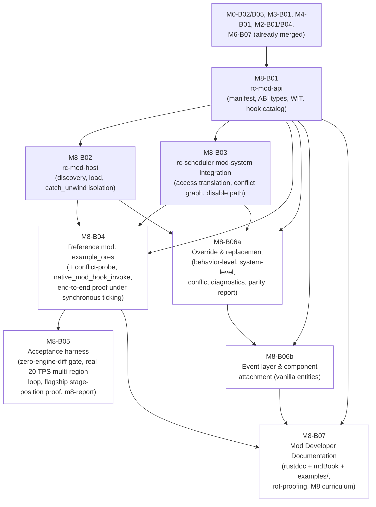

# M8-B00 — Milestone Index: Mod API Alpha

## Milestone summary

M8 gives the project the first working half of `06-modding-api.md`'s
isomorphic modding promise: a mod loads and hooks the engine on the
server side, with zero engine source changes, sandboxed by crash
isolation rather than trust. Following the roadmap's own explicit
M8-alpha scoping ("`rc-mod-host`'s dylib loader (`libloading`)"), all
seven blueprints implement **MOD-D1's native tier only** — the WASM
tier's toolchain pin, WIT interface package, and guest-side bindings
are fully specified as data/schema (M8-B01), but WASM-tier *hosting*
(a real `wasmtime::Engine`, fuel/epoch limits, WASI capability grants)
is consistently, honestly deferred by every blueprint that touches the
boundary to "a future, not-yet-numbered `rc-mod-host` blueprint" —
named identically and non-contradictorily in M8-B01, M8-B02, M8-B04,
M8-B05, M8-B06a, and M8-B06b.

The milestone's original five blueprints build the stack bottom-up, strictly linearly: the
complete `rc-mod-api` public surface —
manifest schema, `stabby` ABI-stable native types, the WIT package,
the hook/capability/registry-insertion contract (M8-B01);
`rc-mod-host`'s discovery/loading/ABI-handshake/SHA-256-trust/
`catch_unwind`-crash-isolation pipeline for the native tier (M8-B02);
`rc-scheduler`'s translation of a mod's declared access into a real
`ComponentAccessSummary`, a real conflict-graph `ModSystemShim`, and a
scheduler-side disable path, including the "engine-component export
table" mechanism neither `01` nor `06` itself designs (M8-B03); one
real, permanent, git-tracked reference mod (`mods/example-ores`) plus
a deliberately-conflicting second mod (`mods/conflict-probe`), proven
end to end against real, separately-compiled dylibs under synchronous
(non-real-time-paced) ticking, and the milestone's only two pieces of
new production glue — `ModUpdateContext::new` and `rc_scheduler::
mod_host_bridge::native_mod_hook_invoke` (M8-B04); and one acceptance
harness that builds directly on M8-B04's own reference mod and bridge
— never a second one — adding exactly the value M8-B04 itself defers:
a mechanically-checked "zero engine source change" gate, a real
wall-clock-paced multi-region 20 TPS crash-isolation loop, a flagship
real-`RcExecutor`-wave stage-position proof, and the milestone's
`xtask m8-report` completion artifact (M8-B05).

| ID | Title | Scope |
|---|---|---|
| M8-B01 | `rc-mod-api`: The Isomorphic Mod API Surface | L |
| M8-B02 | `rc-mod-host`: Discovery, Loading, Lifecycle & Crash Isolation | L |
| M8-B03 | Mod Systems in RC-Executor: Access Translation, Domain-Group Slotting & Crash-Isolated Dispatch | L |
| M8-B04 | The Reference Mod: `example_ores`, Its Template Shape, and End-to-End Proof | L |
| M8-B05 | Mod API Alpha Acceptance Harness | M |
| M8-B06a | Override & Replacement: Behavior-Level, System-Level, Cross-Mod Diagnostics, Parity Surfacing | L |
| M8-B06b | Event Layer & Component Attachment to Vanilla Entities | L |
| M8-B07 | Mod Developer Documentation: Infrastructure, Rot-Proofing, and the M8 Curriculum | L |

`M8-B06a`/`M8-B06b` implement `06-modding-api.md`'s override/replacement decision block (MOD-D33–D46), added to that document after the roadmap's own three numbered M8 acceptance criteria (below) were already fixed — a binding extension of M8's own scope, not a fourth numbered criterion, per the task mandate that vanilla behavior hold no special position over what the mod API exposes. Both build additively on `M8-B01`/`M8-B02`/`M8-B03`'s already-shipped surfaces and on M3-B01/M4-B06's already-shipped `rc-mechanics` content; neither depends on, or is depended on by, `M8-B04`/`M8-B05`.

`M8-B07` implements `06-modding-api.md`'s documentation decision block (MOD-D47–D52), added to that document after the roadmap's own three numbered M8 acceptance criteria were already fixed but subsequently folded into `11-roadmap-milestones.md`'s own M8 Acceptance criteria as a fourth, explicit bullet (MOD-D52's binding chapter-plus-tested-examples definition-of-done rule) — restated in the mapping table below as acceptance criterion #4. It is the milestone's last blueprint to land: its own Prerequisites cite `M8-B01`'s complete public surface (restated verbatim for every chapter/example to build against), `M8-B02`'s surface as explanatory context only (this blueprint's own `examples/` crates are never dylib-loaded through `ServerModHost` by its own tests), and `M8-B04`/`M8-B06a`/`M8-B06b`'s already-shipped, already-CI-proven worked cases (`mods/example-ores`, `crates/mechanics/tests/water_override_replace.rs`, `crates/mod-api/tests/abi_handshake.rs`) linked directly rather than reinvented. It does not depend on `M8-B05` and is not depended on by any other M8 blueprint.

## Dependency graph

**Recommended execution order:**

1. **M8-B01** first and alone — every other blueprint builds against
   its public surface exactly.
2. **M8-B02** and **M8-B03** in parallel once M8-B01 lands — neither
   takes a Cargo dependency on the other (M8-B03's `Cargo.toml` carries
   a pre-existing, currently-unused `rc-mod-host` edge from M0-B01's
   scaffold; M8-B03's own production code never imports it).
3. **M8-B04** once M8-B01/B02/B03 all land — it is the first blueprint
   to construct a real `ModHookInvoke` (`rc_scheduler::mod_host_bridge`)
   bridging M8-B03's dispatch slot into M8-B02's crash-isolated
   `ServerModHost::call_on_tick_hook`, and the first to add a public
   constructor to M8-B01's `ModUpdateContext`. It ships the milestone's
   only reference mod (`mods/example-ores`) and only conflict fixture
   (`mods/conflict-probe`).
4. **M8-B05** strictly after M8-B04 — its own Header lists M8-B04 as a
   hard prerequisite and it builds directly on M8-B04's already-shipped
   `mods/example-ores`/`mods/conflict-probe`, `crates/scheduler/tests/
   common/mod_fixture.rs`'s `build_and_package_mod`, and `crates/
   scheduler/src/mod_host_bridge.rs`'s `native_mod_hook_invoke`. It
   authors no reference mod, no dylib-packaging helper, and no
   `ModHookInvoke` bridge of its own — every one of those three is
   M8-B04's, reused unmodified. What it adds is the value M8-B04 itself
   honestly defers: a mechanically-checked zero-engine-source-change
   gate, a real, wall-clock-paced, multi-region 20 TPS crash-isolation
   loop (M8-B04 uses only repeated synchronous `tick_region` calls), a
   flagship real-`RcExecutor`-wave stage-position proof, and the
   `xtask m8-report` completion artifact.
5. **M8-B06a** once M8-B01/B02/B03 all land — parallel to M8-B04/B05,
   sharing only M8-B01/B02/B03 as common ancestors, never M8-B04's own
   reference mod/bridge and never M8-B05's own harness. Adds an
   additive `rc-mod-api` dependency to `rc-mechanics` and extends
   M3-B01's `BlockBehaviorRegistry`/M4-B06's `register_fluids`/M8-B03's
   `mod_order.rs`/`registry.rs`/`executor.rs`, all in place, all
   byte-for-byte-unmodified for every pre-existing test.
6. **M8-B06b** strictly after M8-B06a — its own Header lists M8-B06a as
   a prerequisite solely to reuse the `rc-mod-api`/`stabby` dependency
   edge M8-B06a already added to `rc-mechanics` (its own component-
   attachment resolution functions live in that same crate); its event
   layer has no mechanism-level dependency on M8-B06a's own override
   machinery at all (06's own "events sit underneath, composing freely
   but never depending on, the override tiers").
7. **M8-B07** last, once M8-B01/B02/B04/B06a/B06b all land — it is the
   milestone's documentation deliverable, restating every prior
   blueprint's already-shipped public surface into rustdoc, an mdBook
   guide, and CI-verified `examples/` crates rather than shipping any
   new mod-facing mechanism of its own. It shares no dependency edge,
   in either direction, with M8-B05.

## Per-blueprint summary

**M8-B01 — `rc-mod-api`.** Defines the complete, self-contained mod-API
contract with zero dylib loading and zero `bevy_ecs::World` access: the
`.rcmod`/`manifest.toml` schema and its two-phase `parse_manifest`/
`validate_manifest` gate; the native-tier `stabby`-ABI-stable boundary
types (`ModComponentDescriptor`, `ModBlockPos`/`ModDirection`,
`ModBlockBehavior`/`ModUpdateContext` mirroring M3-B01's
`BlockBehavior`/`UpdateContext` one-for-one, `ServerModEntry`/
`ClientModEntry`); the WASM-tier `wit/rc-mod-api.wit` package plus
generated guest bindings; `DenseIdAllocator`, the dense/sequential
id-allocation primitive whose rationale is a direct, correctly-derived
consequence of M2-B01's own `Direct`-palette bit-width rule
(WORLD-D2); and the ABI version handshake (`ModAbiVersion`,
`ABI_HANDSHAKE_SYMBOL`). Resolves a real gap between `12`'s own prose
and its Crate Manifest/dependency table (an expanded, cited Rule-4
dependency set: `{rc-core, serde, toml, thiserror}` unconditional, plus
`{bevy_ecs, stabby}`/`{wit-bindgen}` feature-gated) rather than silently
working around it. Leaves several `*Context` types deliberately opaque
and several methods `unimplemented!()`-stubbed, explicitly named as
"`rc-mod-host`, a later M8 blueprint"'s job — a real, bounded, correctly
self-disclosed scope boundary M8-B02 then closes exactly as promised.
`registry.rs`'s `BlockRegistration::default_state_component_count` is
documented as recorded, informational sizing metadata only — one
`register_block` call always allocates exactly one `ModBlockStateId`
regardless of this field's value, matching M8-B02's and M8-B04's own
already-shipped, test-pinned behavior exactly.

**M8-B02 — `rc-mod-host`.** Builds the native-tier loader end to end:
`mods/` directory discovery of `.rcmod` zips, MOD-D31's dependency-order
Kahn's-algorithm resolution (a second, independent application of the
identical technique M0-B05's `compute_waves` already established),
MOD-D4's exact platform/filename convention (correctly diverging from
`libloading::library_filename`'s `lib`-prefixed default, a real,
verified mismatch this blueprint catches and documents), MOD-D26's
hand-rolled SHA-256 trust allowlist (reusing M0-B08's own established
"no SHA-256 crate is pinned" resolution independently, for a different
purpose), and MOD-D32's `catch_unwind`-at-the-FFI-boundary crash
isolation with auto-disable. Its own Implementation step 1 is a
standalone smoke test proving `stabby`'s vtable dispatch is genuinely
unwind-catchable *before* any other work proceeds — the single highest-
value piece of engineering-discipline in this milestone, since MOD-D32's
entire premise depends on an unconfirmed detail of a third-party crate's
ABI. Completes M8-B01's four opaque `*Context` types as a **recording**
structure (never a live callback into a `World` this crate cannot
construct, since it has no `bevy_ecs`/`rc-scheduler`/`rc-mechanics`
dependency by design) — the correct, minimal answer given `12`'s own
dependency-graph rules, verified against the Dependency Graph mermaid
diagram (`sched --> modhost`, never the reverse).

**M8-B03 — Scheduler integration.** The genuinely new engineering in
this milestone: an "engine-component export table"
(`RcExecutorBuilder::export_component`) that answers a question neither
`01` nor `06` itself resolves (how a mod's manifest-declared component
*name* becomes a real `ComponentId` for an *existing* engine
component, as opposed to a mod-registered new one), built directly on
M0-B05's own `component_bootstrap`/replay-at-`spawn_region` invariant
so every region's `World` assigns identical ids; a second, independent
Kahn's-algorithm topological sort (`resolve_hook_order`, `before`/
`after`/`native:<domain>` resolution, distinct from `compute_waves`'s
own access-conflict graph) with a precisely specified
default-after-native rule; and `ModSystemShim`, the concrete
realization of MOD-D8's own pseudocode, reusing `compute_waves`'s
already-proven wildcard-wave-of-one property for MOD-D12's exclusive-
access escape hatch entirely for free (no new dispatch mechanism).
Correctly identifies and resolves a real staleness in M8-B01's own
`DomainGroup` mirror (fixed against `01`'s original five-group text,
stale against M3-B06/M4-B01's already-merged eight-group/twelve-stage
widening) with a cited, justified `AiPhysics -> EntityPhysicsIntegration`
mapping (never `EntityAiSelection`, since that stage is structurally
read-only and MOD-D8 requires a mutation capability). `ModSystemShim`
never calls `catch_unwind` itself (Constraints (d), verified honored) —
the disable path is a pure `Arc<AtomicBool>`-shared, process-wide,
per-mod flag, correctly and completely reconciled with M8-B02's own
independent `ServerModHost`/`ModStatus` disable state by M8-B04's later
bridge function (see Cross-blueprint consistency notes).

**M8-B04 — The reference mod (`example_ores`).** Closes the loop
between three independently-shipped mechanisms using one real, working
mod: a two-state `pulse_crystal` block with genuine scheduled-tick
behavior wired through M3-B01's own `BlockBehaviorRegistry` seam (never
a generic hook, correctly citing M8-B01's own "strictly cheaper"
rationale), a `pulse_shard` item, an `ore_charge` component (registered
but honestly not yet ECS-reachable, a named, owner-deferred gap), and a
`pulse_survey` generic Lighting-group tick hook that genuinely
participates in a real conflict graph. Adds the two small, purely
additive pieces of glue no earlier blueprint built and both explicitly
needed to prove anything end to end: `ModUpdateContext::new` (a public
constructor M8-B01 left crate-private) and
`rc_scheduler::mod_host_bridge::native_mod_hook_invoke` (the first, and
only, real `ModHookInvoke` this milestone builds, correctly never
calling `catch_unwind` itself, per M8-B03's own Constraints (d) —
`ServerModHost::call_on_tick_hook` already did). Makes M2-B01's
WORLD-D2 palette-bit-width consequence and M2-B04's namespaced-name
persistence guarantee concrete with real numbers (a 10-to-11-bit
`Direct`-palette width jump from installing one small mod; a block
state round-tripping correctly under two different boot-time id
assignments) — both verified accurate against M2-B01's/M2-B04's own
committed Deliverables. Never touches `crates/server/`, honestly, and
explicitly, honestly defers real-time (wall-clock-paced) tick pacing to
a later blueprint — M8-B05 is that later blueprint. `mods/example-ores`
and `mods/conflict-probe` are the milestone's **only** reference mod
and conflict fixture — M8-B05 builds on them directly rather than
authoring a second pair.

**M8-B05 — Acceptance harness.** States, as a binding contract, exactly
what a still-future composition-root blueprint must build
(`--mods-dir`, `resolve_hook_order`-before-`register_mod_system`
ordering, a real declared-access-scoped `ModHookInvoke`,
`--help`-advertised `--mods-dir`) — continuing the exact "pin the
missing contract, prove everything else hermetically, fail closed"
discipline M6-B01/M6-B06 already established. Builds directly and only
on M8-B04's own `mods/example-ores`/`mods/conflict-probe`,
`mod_fixture::build_and_package_mod`, and `mod_host_bridge::
native_mod_hook_invoke` — it authors no reference mod, no dylib-
packaging helper, and no `ModHookInvoke` bridge of its own. Its own
genuinely new contribution is exactly the value M8-B04 itself names as
out of scope: a mechanically-defined "zero engine source change"
`git status` check (`ENGINE_TREE_PATHS`/`assert_engine_tree_unchanged`);
a real wall-clock-paced, multi-region `RegionManager`/`TickClock`-driven
20 TPS crash-isolation loop (M8-B04 uses only repeated synchronous
`tick_region` calls); the flagship real-`RcExecutor`-wave proof that
`example_ores:pulse_survey` fires at exactly its declared `DomainGroup`'s
`Stage` position among native probe systems in three other stages; a
small lifecycle-call-ordering invariant; a machine-readable `xtask
m8-report` completion artifact continuing the `M<n>ReportResult`
lineage, sourcing the criteria M8-B04 already proves (registration
content, conflict rejection, block-behavior direct-call correctness,
client-registration headless verification) from M8-B04's own already-
passing test suites via a supplied JUnit XML rather than re-proving
them; and three mandatory harness self-tests proving each of its own
new gates actually catches the failure mode it claims to.

**M8-B06a — Override & replacement.** Gives mods MOD-D33's anchor
promise a concrete, working mechanism for the two tiers 06 itself
splits the problem into: `Identifier`-targeted `Wrap`/`Replace` for
block behaviors (MOD-D35), proven end to end by replacing
`minecraft:water`'s own real vanilla `FluidBehavior` (M4-B06) and
proving `BlockBehaviorRegistry::resolve` genuinely returns the
replacement, never a synthetic stand-in; and named-system export plus
disable/replace for `RcExecutor`-scheduled systems (MOD-D36/D37),
proven inside Stage 4's mandatory sequential collapse. Both tiers
share one new ordering algorithm, `resolve_override_order`
(`rc-scheduler`'s `mod_order.rs`, a structural sibling of M8-B03's own
`resolve_hook_order`), extending MOD-D10 exactly as MOD-D38 requires
rather than inventing a second conflict-resolution model — the same
function serves the cross-mod double-override diagnostic
(`OverrideOrderingError::UnresolvedReplaceConflict`) for both
mechanisms. Closes a real, previously-open gap neither M8-B01 nor
M8-B02 could resolve on its own: a genuinely engine-wired
`ModUpdateContext` construction (M8-B01's own doc comment deferred
this to "host-side" without naming a crate that actually has both a
live `UpdateContext<'a>` and an `rc-mod-api` dependency; M8-B02
explicitly confirmed `rc-mod-host` itself cannot build one) — resolved
here, correctly, in `rc-mechanics`'s new `mod_behavior_adapter.rs`.
Adds `active_overrides()`/`active_system_overrides()` queries
satisfying MOD-D34's discoverability requirement at the data layer
only, honestly short of the `minecraft:brand`/Server List Ping wire
change 06 itself still leaves open pending `02-protocol-
networking.md`'s own ratification.

**M8-B06b — Event layer & component attachment.** Ships MOD-D39's
cancellable/mutable event mechanism — a generic, reusable
`EventDispatcher<E: Clone>` with five mutating priority tiers plus a
Monitor tier whose "cannot itself cancel or mutate" contract is
enforced mechanically (a clone-and-discard technique), not merely
documented — proven through a full cancellation matrix against 06's
own first-named illustrative catalog entry, `BlockBreakAttempt`
(shipped as a real type; wiring it to a real M3-B03 block-breaking
call site is honestly named as a still-future integration, mirroring
M8-B02/B03's own "prove the mechanism, defer the real call site"
precedent). Ships MOD-D41's `ModComponents` persistence encoding — a
byte-exact, dormant-data-preserving format needing no per-component
(de)serialize code (MOD-D13's POD guarantee doing the work for free) —
with a real round-trip proof covering both an unloaded-mod's own
dormant entry and a version-mismatched entry, both losslessly
preserved. Ships MOD-D42's two missing world-query resolution
functions (`ChunkKey`→chunk entity, `BlockPos`→block entity),
completing the one gap MOD-D6/D13's own existing generic component-
attachment machinery was missing. Explicitly, honestly out of scope:
MOD-D43 (region-scoped singleton data) and MOD-D44 (world-scoped data
piggybacking on `05`'s still-unbuilt GameRules mechanism) — neither
named in this task's own component-attachment bullet, both flagged as
a later blueprint's own job rather than silently dropped.

**M8-B07 — Mod Developer Documentation.** Turns MOD-D47–D52's
"documentation cannot rot" mandate into an actually-enforced CI gate:
the `docs/mod-guide/` mdBook (MOD-D49) over its full fixed 15-chapter
navigation (MOD-D50), the anchor-based `{{#rustdoc_include}}`/
`{{#include}}` rot-proofing mechanism binding every shown code block to
a real, workspace-member `examples/<NN>-<slug>/` mod crate (MOD-D48),
`#![deny(missing_docs)]`/`RUSTDOCFLAGS="-D warnings"` plus a runnable-
doctest audit over `rc-mod-api`'s complete public surface (MOD-D47),
and a machine-checked `CHAPTER_MANIFEST` proving MOD-D52's own binding
definition-of-done rule (a chapter and its tested `examples/` entry
both exist and pass Tier 1 CI) for every M8-landing capability. Writes
Chapters 1 and 2 verbatim and every other M8-landing chapter as a
binding outline an implementer transcribes without inventing API
claims; Chapters 9 (Custom World/Chunk Data) and 11 (Client-Side) ship
as honest, explicitly-dated stub pages, never silently omitted.
Reuses `mods/example-ores` (M8-B04) and `crates/mechanics/tests/
water_override_replace.rs` (M8-B06a) as worked cases rather than
inventing new ones, and mirrors every `dynptr!`/entry-factory
construction in its own 11 new `examples/` crates on M8-B04's own
already-resolved pattern verbatim. Adds no new mod-facing mechanism of
its own — every capability it documents was already shipped by an
earlier M8 blueprint.

## M8 acceptance criteria → blueprint mapping

| # | Acceptance criterion (`11-roadmap-milestones.md`) | Blueprint(s) | Status |
|---|---|---|---|
| 1 | Reference mod's dylib loads at server startup with zero engine source changes, registers a new component via `register_component_with_descriptor`, participates in ARCH-D8's startup conflict-graph check; a second, conflicting test mod is rejected at boot with a clear diagnostic. | M8-B01 (manifest schema, registration surface), M8-B02 (real discovery/load/ABI handshake), M8-B03 (`resolve_component_access`/`resolve_hook_order`, the real `ModOrderingError::Cycle` rejection), **M8-B04** (`example_ores`/`conflict-probe`, `mod_reference_conflict_graph.rs`/`mod_reference_hook_dispatch.rs` — the real registration-observable and conflict-rejection proofs), **M8-B05** (the mechanically-checked "zero engine source change" gate `mod_reference_conflict_graph.rs` itself does not attempt; cites M8-B04's own registration/rejection proofs by name in its own completion report rather than re-running them) | Registration-observable and conflict-rejection are proven exactly once, by M8-B04, against two real, separately-compiled dylibs; M8-B05 adds the one sub-criterion neither M8-B04 nor any earlier blueprint checks (the mechanical zero-engine-tree-diff gate) and cites the rest. The real `bevy_ecs::component::ComponentDescriptor`/`register_component_with_descriptor` translation and a real `rusty-clanker-server --mods-dir` boot-refusal remain honestly gated on a still-future composition-root blueprint (M8-B05's own `AC1d`, correctly reported `fail`, never faked). |
| 2 | A deliberate panic in the reference mod's tick hook is caught at the `rc-mod-host` boundary, disables only that mod, and the tick pipeline continues at 20 TPS for every other region/system without crashing the server process. | M8-B02 (`catch_unwind`/`ModStatus::Disabled`, isolated-layer proof), M8-B03 (scheduler-side `Arc<AtomicBool>` disable path, synthetic-`ModHookInvoke` proof), M8-B04 (real dylib, repeated synchronous `tick_region`, no real-time pacing — honestly, explicitly deferred), **M8-B05** (real dylib, real `RegionManager`/`TickClock`-paced 20 TPS loop, `\|drift_ratio\| <= 1%` — the milestone's only real-time-paced proof) | Proven exactly once at the full, wall-clock-accurate fidelity the criterion names — by M8-B05, reusing M8-B04's own dylib and bridge function directly rather than re-authoring either. |
| 3 | Every hook fires at the correct pipeline point with correct data, headlessly; client render hook visual verification deferred to M10. | M8-B01 (hook catalog contract), M8-B02 (isolated-layer dispatch+data proof, `good_mod` fixture), M8-B03 (real conflict-graph wave membership, synthetic hooks), M8-B04 (`mod_reference_hook_dispatch.rs`, real `example_ores` dylib — lifecycle/registry-content, block-behavior direct-call correctness, and client-registration headless verification), **M8-B05** (the flagship real-`RcExecutor`-wave `Stage`-position proof, plus a lifecycle-call-ordering invariant — the two sub-proofs neither M8-B03's synthetic doubles nor M8-B04's synchronous-dispatch proof attempts; cites M8-B04's own block-behavior and client-registration proofs by name rather than re-running them) | Each sub-proof is owned by exactly one blueprint, with M8-B05's own completion report naming which blueprint's test suite each `AC3_*` case is actually sourced from. |
| 4 | Per MOD-D52's binding definition-of-done rule (`11-roadmap-milestones.md`'s own fourth M8 Acceptance criterion): none of `M8`'s own mod-API capabilities is considered done on engine-side tests alone — each requires its Mod Developer Guide chapter and its tested `examples/` entry to both exist and pass Tier 1 CI before `M8` itself is considered complete. | **M8-B07** (the complete rustdoc/mdBook/`examples/` infrastructure; the `xtask doc-guide verify-manifest` checker realizing the rule mechanically; every M8-landing chapter of MOD-D50's curriculum) | Proven exactly once, by M8-B07, against the real, final, committed `docs/mod-guide/`/`examples/` trees — it does not re-derive any engine-side proof M8-B01–B06b already own, only that each already-shipped capability also has a passing chapter and example. |

## Cross-blueprint consistency notes

- **M8-B04 and M8-B05 build on a single, shared reference mod and bridge
  function.** `mods/example-ores`/`mods/conflict-probe` are the
  milestone's only reference mod and conflict fixture — M8-B04 alone
  authors them. M8-B05 lists M8-B04 as a hard Prerequisite, authors no
  mod under `mods/`, no dylib-packaging helper of its own on the
  `crates/scheduler` side (`rc-mod-host`-side keeps only the small,
  explicitly-cited file-copied variant M6-B03's own cross-crate
  test-helper convention sanctions), and no `ModHookInvoke` bridge of
  its own — it imports and calls M8-B04's own `rc_scheduler::
  mod_host_bridge::native_mod_hook_invoke` directly. Its own new
  content (the zero-engine-tree-diff gate, the real TPS-paced
  multi-region loop, the flagship stage-position proof, `xtask
  m8-report`) is exactly the value M8-B04 itself names as out of scope,
  never a second proof of what M8-B04 already proves.

- **M8-B05's own dylib-packaging test helper needs no `Cargo.toml` edit
  of its own.** Packaging a built `cdylib` into a `.rcmod` zip archive
  needs the `zip` crate on `rc-scheduler`'s test target, which M8-B04's
  own Deliverables already add. M8-B05 lists M8-B04 as a hard
  Prerequisite and reuses M8-B04's own `mod_fixture.rs` module directly
  rather than authoring its own dylib-packaging function, so this
  dependency is already present by construction; M8-B05's own
  Deliverables touch no `Cargo.toml` anywhere.

- **`BlockRegistration::default_state_component_count`'s documented
  semantics in M8-B01 match its actual, implemented behavior.** One
  `register_block` call always allocates exactly one `ModBlockStateId`,
  regardless of `default_state_component_count`'s value — M8-B01's own
  `registry.rs` doc comment states this plainly (the field is recorded,
  informational metadata only, sizing a block's total state-property
  space for a future translation layer), matching M8-B02's own
  committed acceptance test and M8-B04's own reference mod exactly.

- **The disable-path seam between M8-B02 and M8-B03, though built as
  two independently-owned mechanisms, is verified correctly reconciled
  by M8-B04's bridge — not left as an unresolved gap.** M8-B02 tracks
  disablement as a per-mod `ServerModHost`/`ModStatus` state (checked
  before every `call_on_*` dispatch); M8-B03 tracks it as a separate,
  scheduler-owned `Arc<AtomicBool>` per mod (checked inside
  `ModSystemShim::run` before `invoke` is ever called). M8-B04's
  `native_mod_hook_invoke` (the milestone's one and only bridge
  function — M8-B05 imports it directly rather than defining its own)
  closes this gap correctly: on the very tick a panic occurs,
  `ServerModHost::call_on_tick_hook` catches it and returns
  `HookOutcome::Panicked`, which the bridge function synchronously
  translates into `Err(ModHookFailure)`, which `ModSystemShim::run`
  reacts to by setting its own `Arc<AtomicBool>` — both layers' disable
  state becomes `true` within the same tick, not merely eventually
  consistent across ticks.

- **The conflict-rejection diagnostic (`rc_scheduler::ModOrderingError::
  Cycle { group, hooks }`) is identical, byte-for-byte in shape, across
  M8-B03 (definition) and M8-B04's fixture assertion** — verified by
  direct comparison; no drift found. M8-B05 does not re-derive this
  diagnostic at all — it cites M8-B04's own already-passing assertion
  in its completion report rather than constructing a second cycle.

- **WASM-tier deferral is stated identically and non-contradictorily
  everywhere it is mentioned.** M8-B01 ships the WASM tier's complete
  data/schema surface (WIT package, guest bindings, manifest `tier =
  "wasm"` support) but implements no host embedding. M8-B02's own
  `ModLoadError::WasmTierNotYetSupported` treats a `tier = "wasm"`
  manifest as "a clean, diagnosed skip... never a crash or a silent
  no-op," citing the roadmap's own M8-alpha native-only scoping by
  name. M8-B04 and M8-B05 both restate "native-only" identically in
  their own Constraints; M8-B06a and M8-B06b restate the identical
  native-tier-only boundary, deferring WASM-tier override/event
  hosting to a future `rc-mod-host` blueprint. No blueprint claims
  WASM-tier hosting is implemented or silently assumes it exists.

- **WS-D3 rule 4 (mod-API leaf) and rule 1 (shared client+server logic)
  are honored throughout, verified against `12`'s own Dependency Graph
  and Crate Manifest table.** `rc-mod-api` never gains a Cargo edge to
  `rc-scheduler`, `rc-mechanics`, `rc-chunk-storage`, or `rc-registries`
  anywhere across all seven blueprints; every mirror type (`DomainGroup`,
  `TickPriority`, `ModBlockPos`, `ModAddress`, etc.) is restated
  structurally rather than imported. `rc-mod-host` gains no dependency
  on `bevy_ecs`/`rc-scheduler`/`rc-mechanics` (M8-B02's own `lint-deps`
  done-condition is the mechanical proof). Both M8-B01 and M8-B03 name
  the same, real, narrow gap between `12`'s own prose and its diagram
  (an undrawn `rc-mod-api`/`rc-scheduler` edge respectively) and resolve
  it identically — "flagged for `12`'s own next revision, not this
  blueprint's job" — a consistent, correctly-bounded pattern across
  both blueprints, not a contradiction. M8-B06a's own new
  `rc-mechanics -> rc-mod-api` edge is the same pattern's third
  instance — `12`'s own WS-D3 rule 4 prose already names
  `rc-mechanics` explicitly as an eventual `rc-mod-api` consumer,
  undrawn on its own diagram exactly as the `rc-scheduler` edge was
  before M8-B03 drew it.

- **M8-B06a/M8-B06b never touch `rc-mod-host`, and never load a
  dylib.** Both blueprints' own acceptance tests exercise their
  mechanisms directly against real `BlockBehaviorRegistry`/
  `RcExecutorBuilder` state (M8-B06a) or pure data types (M8-B06b),
  with hand-constructed override/event requests standing in for what a
  future composition-root blueprint will eventually source from a
  loaded mod's manifest — the identical "prove the mechanism now,
  defer the real wiring" discipline M8-B03's own
  `mod_conflict_graph_integration.rs` already established for hooks,
  extended here to overrides, systems, and events without exception.

## M8 completion, restated

M8-B01 reaches Tier-1 Done independently, the sole foundation every
other blueprint builds against. M8-B02 and M8-B03 each need only
M8-B01 merged and take no Cargo dependency on each other, verified
against both blueprints' own `Cargo.toml` Deliverables. M8-B04 needs
M8-B01/B02/B03 merged and is the first, and only, blueprint to author a
reference mod (`mods/example-ores`) and conflict fixture (`mods/
conflict-probe`), proving all three acceptance criteria against real
content under synchronous (non-real-time) ticking. M8-B05 needs M8-B04
merged — a hard Prerequisite, stated in its own Header — and builds
directly on M8-B04's own reference mod, dylib-packaging helper, and
`ModHookInvoke` bridge, adding only the value M8-B04 itself names as
out of scope: the mechanical zero-engine-source-change gate, the real
wall-clock-paced multi-region 20 TPS crash-isolation loop, the flagship
stage-position proof, and the milestone's `xtask m8-report` artifact.
M8-B06a needs only M8-B01/B02/B03 merged — it shares no dependency edge,
in either direction, with M8-B04/B05 — and closes out MOD-D33–D38's
override/replacement decision block plus MOD-D34's discoverability
requirement, additively, against M3-B01/M4-B06's already-shipped
`rc-mechanics` content. M8-B06b needs M8-B06a merged (its own Header) solely
to reuse the `rc-mod-api` dependency edge M8-B06a already added to
`rc-mechanics`, and closes out MOD-D39's event layer and MOD-D41/D42's
persistence/resolution contract. M8-B07 needs M8-B01/B02/B04/B06a/B06b
merged and is the milestone's last blueprint: it closes out MOD-D47–D52's
documentation decision block by restating every one of the other six
blueprints' already-shipped public surface into rustdoc, an mdBook
guide, and CI-verified `examples/` crates, and by mechanically proving
MOD-D52's own binding chapter-plus-tested-example definition-of-done
rule for every M8-landing capability. M8's own build order is therefore
**M8-B01 → M8-B02 → M8-B03**, after which **M8-B04 → M8-B05** and
**M8-B06a → M8-B06b** proceed independently, in either order or in
parallel, and **M8-B07** lands last, once M8-B01/B02/B04/B06a/B06b are
all merged.

Every blueprint's own Tier-1 gate is independently sound: the
vtable-unwind-catchability smoke test (M8-B02) is exactly the kind of
"prove the load-bearing assumption before building on it" discipline
this corpus values; the two independent Kahn's-algorithm applications
(M8-B02's dependency order, M8-B03's hook order) are each correctly
distinguished from `compute_waves`'s own third, pre-existing
application; and the milestone's first three acceptance criteria are
fully, honestly proven against real, separately-compiled native-tier
dylibs — each sub-criterion owned by exactly one blueprint, with the
one remaining gap (a real `rusty-clanker-server --mods-dir` boot run)
named precisely as a still-future composition-root blueprint's binding
contract, never faked, in both M8-B04 and M8-B05. The fourth
acceptance criterion — MOD-D52's documentation definition-of-done rule
— is proven independently, and only, by M8-B07, against the real,
final, committed `docs/mod-guide/`/`examples/` trees.
