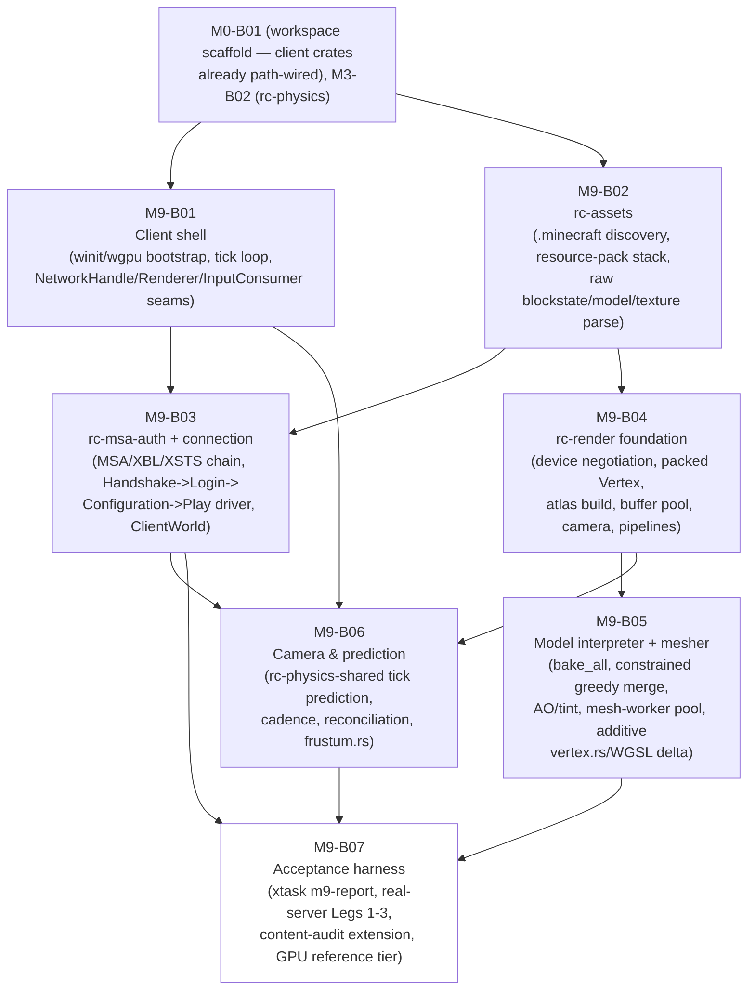

# M9-B00 — Milestone Index: Client Bootstrap — Connect & Render a Static World

## Milestone summary

M9 gives the project its first working half of `07-client-architecture.md`'s
Phase 2 promise: a native `rusty-clanker-client` binary that opens a real
window, authenticates a real Microsoft/Mojang account, speaks the exact
`rc-protocol` wire codec the server targets, receives and decodes a real
world, and turns that world into vanilla-faithful, correctly textured
triangles — all built on the shared-crate guarantees `01`–`06` already
established (`rc-protocol`, `rc-physics`, `rc-registries`, `rc-mechanics`'s
`client-predict` feature). Seven blueprints build the stack bottom-up: an
application shell with real windowing/GPU bootstrap and stub seams (B01); a
local asset pipeline that discovers and parses the player's own
`.minecraft` installation, never bundling or fetching Mojang content (B02);
the Microsoft/Xbox/Mojang identity chain plus a real Handshake→Login→
Configuration→Play connection driver and client-side chunk store (B03); the
`wgpu` rendering foundation — device capability negotiation, the packed
vertex-format contract, texture-array atlas build, buffer suballocation,
camera/chunk uniforms, shader-permutation/pipeline-cache management (B04);
the blockstate/model JSON interpreter and the constrained-greedy-merge
chunk mesher, closing two real gaps B04 itself left open (sub-block vertex
precision, biome-tint carriage) as additive deltas (B05); client-side
movement prediction sharing `rc-physics` byte-for-byte with the server, and
the camera/FOV/frustum layer M9-B04 named as its own open interface item
(B06); and one acceptance harness wiring M9's three roadmap criteria into
one machine-readable `xtask m9-report`, built entirely against real B03/
B05/B06 code and a real server subprocess, honestly reporting `fail` on the
one genuine composition-root integration gap no blueprint in this milestone
closes (B07).

| ID | Title | Scope |
|---|---|---|
| M9-B01 | Client Application Shell | L |
| M9-B02 | Local Asset Pipeline (`rc-assets`) | L |
| M9-B03 | Client Authentication & Connection | L |
| M9-B04 | Render Foundation (`rc-render`) | L |
| M9-B05 | Blockstate/Model Interpreter & Chunk Meshing | L |
| M9-B06 | Camera & Client-Side Movement Prediction | L |
| M9-B07 | Client Bootstrap Acceptance Harness | L |

## Dependency graph

**Recommended execution order:**

1. **M9-B01** and **M9-B02** first, in parallel — neither depends on the
   other (B01 needs only M0-B01's scaffold; B02 needs only M0-B01's
   scaffold). Both are hard prerequisites for everything downstream.
2. **M9-B03** once B01 and B02 both land — it consumes B01's
   `net::{NetworkHandle, NetworkSessionIo, ClientNetworkEvent,
   OutboundIntent}` unmodified and B02's `discovery::Installation` for
   known-packs negotiation.
3. **M9-B04** once B02 lands (B01 is consulted-only, no Cargo edge) — it
   can run in parallel with B03, since neither takes a Cargo dependency on
   the other and neither's own test suite touches the other's files.
4. **M9-B05** strictly after B04 — it additively extends B04's own
   already-committed `vertex.rs` and both WGSL shader files (new bit
   ranges only, no existing bit position touched) and consumes B04's
   `chunk::{SectionKey, RenderLayer, MeshData, ChunkMeshRegistry}`/
   `atlas::{TextureAtlas, AtlasError}`/`camera::{Camera, RenderOrigin}`
   directly. It does not depend on B03.
5. **M9-B06** once B01, B03, and B04 all land. **B06 also touches
   `crates/render/src/lib.rs`** (adding `pub mod frustum;`, additive) —
   the same file B05 already modified. Neither B05 nor B06 lists the
   other as a Prerequisite (see Cross-blueprint consistency notes,
   below), so this index fixes the order explicitly: **land B05 before
   B06** to avoid a two-way race on `rc-render`'s own module list: B06's
   own Deliverables text describes its `lib.rs` edit purely as a delta
   against "M9-B04's committed list," which is stale by the time B05 has
   already run — the one-line `pub mod frustum;` addition is correct and
   trivial regardless of order, but implementers must apply it against
   the file's real current content (post-B05), not against B04's original
   nine-line list a literal reading of B06's own prose would suggest.
6. **M9-B07** strictly after B03, B05, and B06 — it drives `run_client_session`
   (B03), `bake_all`/the mesher (B05), and `PlayerController` (B06) against
   a real server subprocess and authors no production code of its own
   outside `xtask`/`tests/`.

## Per-blueprint summary

**M9-B01 — Client application shell.** A real `winit` 0.30
`ApplicationHandler`-driven event loop, a real `wgpu` 30 bootstrap chain
(feature/limits negotiation itself stubbed to `Features::empty()`,
completed only by B04's own `negotiate_device_requirements`, still unwired
into `GraphicsContext::new` at the end of this milestone — see B07's
Context §2 gap), a fixed 50 ms tick accumulator decoupled from an
uncapped/vsync render loop, an isolated Tokio network runtime with three
named seams (`Renderer`, `NetworkHandle::spawn_session`, `InputConsumer`),
per-platform config persistence, and `tracing`-based diagnostics. Resolves
a real, honestly-disclosed gap `09-testing-quality.md` leaves open
(no headless-GPU/window CI policy exists anywhere in the corpus) by
drawing a structural Tier-1 boundary — zero test constructs a real
`EventLoop`/`Window`/`wgpu` object — proven instead by
`docs/MANUAL-VERIFICATION-M9-B01.md`.

**M9-B02 — Local asset pipeline (`rc-assets`).** Discovers and validates
the player's `.minecraft` installation against the pinned protocol target
(26.2), reads the client jar as a pure zip data container (no `.class`
entry ever read or executed), resolves an ordered resource-pack stack with
correct highest-priority-wins path resolution, decodes PNG textures and
`.mcmeta` animation sidecars, and parses (never bakes) blockstate and
model JSON into raw Rust types. Every acceptance test runs against
hand-authored fixtures — zero real Mojang content ever enters the
repository or CI. Adds `xtask content-audit`, the mechanical seam
ASSET-D24's release-artifact scan needs, later extended by B07.

**M9-B03 — Client authentication & connection.** A new client-only crate,
`rc-msa-auth` (resolving a real, cited gap between `08`'s ASSET-D3 prose —
which names "a new `rc-auth` crate" — and the actual, already-taken
server-only `rc-auth` from M1-B03), implementing the full six-step
device-code→MSA→XBL→XSTS→`login_with_xbox` chain, `keyring`-backed token
caching/silent refresh, and the client-side `serverId`-hash join call.
Inside `rusty-clanker-client`, a single-task connection driver walks
Handshake→Login→Configuration→Play as the *initiator*, performs the client
half of the NET-D6 encryption handshake, and decodes `LevelChunkWithLight`
into a from-scratch, `rc-chunk-storage`-free client chunk store — a
corrected departure from the originating task's own "reuse
`rc-chunk-storage`" paraphrase, since that crate is fixed server-only by
`12`'s Crate Manifest and CLIENT-D25's closed shared-crate-role list; the
blueprint restates WORLD-D2's wire algorithm independently instead,
exactly as this corpus's own governance rule requires when a blueprint and
a planning document conflict. Restates ~20 Play-state packet structs
client-side (see Cross-blueprint consistency notes' first item — a real,
flagged architectural gap, not a defect of this blueprint).

**M9-B04 — Render foundation (`rc-render`).** The concrete `wgpu` device
feature/limits negotiation CLIENT-D4's bindless-vs-tiered-fallback split
requires; the fixed M9 pass sequence (Clear → Opaque → Cutout →
Translucent terrain, no general render-graph DAG built yet — a scoped-down,
explicitly-flagged CLIENT-D3 simplification); the exact byte-for-byte
packed `Vertex` format M9-B05 targets (CLIENT-D6's four `u32` fields'
concrete bit *order*, left open by `07` itself); a `texture_2d_array` atlas
builder with vanilla-faithful naive-box-filter mip generation and
`.mcmeta` animation playback; a suballocated buffer-page pool with
frame-budget-capped upload; the floating-origin camera/chunk uniform
scheme M9-B06 later owns the state for; and a 12-entry shader-permutation
matrix with a persistent, adapter-scoped `wgpu::PipelineCache` (this
crate's one narrowly-scoped `unsafe` block). Explicitly does not implement
chunk meshing, blockstate interpretation, or wire itself into
`rusty-clanker-client`'s `Shell`/`Renderer` seam — three concrete,
named obligations left for later consumers (M9-B05, and an unnamed
integration blueprint B07 ultimately declines to be).

**M9-B05 — Blockstate/model interpreter & chunk meshing.** A from-scratch
interpreter (parent-chain flattening, texture-variable substitution,
`variants`/`multipart` selection including deterministic weighted-random
choice) baked once per resource-pack load into a flat, block-state-ID-
indexed face-list cache; cullface + full-face-opacity classification;
vanilla's corner-sampling AO algorithm and biome-tint box blur; the
section-local constrained-greedy-merge mesher; and the `rayon`-backed
mesh-worker pool (dirty-set debounce, priority min-heap, frustum
deprioritization, `crossbeam-channel` return path, PERF-D9 buffer
recycling). Closes two real, load-bearing gaps discovered while deriving
this blueprint as explicit, additive deltas rather than silent
workarounds: `rc-registries`' generated code exposed no per-state property
decomposition or biome climate data (closed via a small, additive `xtask`
codegen extension — two new generated files, zero existing file rewritten);
M9-B04's committed `Vertex` format had no room for sub-block-precision
geometry (stairs, slabs, fences...) or a resolved tint color (closed by
packing into that format's own already-`reserved`, already-zero bits —
`pack_pos_and_face_frac`/`pack_light_and_ao_tint`, additive, non-breaking,
every one of B04's own already-committed tests re-run unmodified and
still green).

**M9-B06 — Camera & client-side movement prediction.** Every tick, raw
input becomes vanilla-faithful movement by calling the **exact same**
`rc_physics::step_living_entity_tick` the server's own future mob/
falling-block simulation uses (CLIENT-D28's local, immediate,
every-tick prediction model) against a client-local `BlockShapeSource`
bridge mirroring M3-B02's server-side one; the predicted position feeds a
`rc_render::camera::Camera` each tick with sprint-modified FOV and
render-distance-derived near/far planes, plus per-frame view-position
interpolation and a new `rc-render` `frustum.rs` module closing M9-B04's
own flagged-open CPU-frustum-culling item; the four vanilla serverbound
movement packets are sent at a sourced, documented cadence; a
server-issued `SynchronizePlayerPosition` hard-snaps predicted state
(properly `relative_arguments`-aware, layered *alongside* — never
replacing — M9-B03's own always-absolute `world.player.position`
bookkeeping). Adds **zero** new public-signature surface to any prior
blueprint's own committed types — every seam is reached through one
additive `PlayerState.local` field and body-only extensions of
already-shipped function implementations, a design this blueprint's own
Context §1 states is forced specifically to keep every one of M9-B01's/
M9-B03's own already-merged acceptance tests compiling and passing
unmodified.

**M9-B07 — Acceptance harness.** Wires M9's three roadmap acceptance
criteria into `xtask m9-report`, continuing the M6-B01/M6-B06/M7-B09/
M8-B05 harness lineage exactly: Leg 1 proves B03's chunk decode end-to-end
against a real `rusty-clanker-server` subprocess via a universal,
seed-independent invariant (the `y=-64` bedrock floor), plus an automated
mesh-render proxy driving B05's real bake/mesh pipeline against that same
real network-received data; Leg 2 drives a real, scripted position
round-trip through B06's real prediction/cadence code against a real
server, plus a pure, hermetically-tested frame-time/stable-FPS analysis
function; Leg 3 extends B02's `content-audit` scanner (JPEG detection,
model-JSON-signature detection, a best-effort Mojang-hash cross-check) and
wires it, for the first time in this milestone, into a real client release
build and a new `workflow_dispatch`-only CI job. Names, precisely and
without silently absorbing it, the one genuine composition-root gap no
M9 blueprint closes — no merged blueprint wires a real
`rc_render::renderer::TerrainRenderer` into `rusty-clanker-client`'s
`Shell`/`Renderer` seam, negotiates real device features, or implements a
production `SnapshotProvider` — and reports the two sub-criteria that
gap blocks (real-account-auth-plus-screenshot, reference-GPU 10-minute
frame-rate session) as an honest, actionable `fail` until a future
integration blueprint closes it, never a faked `pass`.

## M9 acceptance criteria → blueprint mapping

| # | Acceptance criterion (`11-roadmap-milestones.md`) | Blueprint(s) | Status |
|---|---|---|---|
| 1 | The native client connects to a Rusty Clanker server, authenticates via a real Microsoft/Mojang account, and renders a generated world's terrain correctly textured from the player's legally-owned local assets, with block placement matching server state 1:1. | M9-B01 (shell/seams), M9-B02 (local asset pipeline), **M9-B03** (real auth chain + real Handshake→Login→Configuration→Play connection + chunk decode), M9-B04 (render foundation, atlas build), **M9-B05** (blockstate/model interpretation, meshing), **M9-B07** (Leg 1: real client-vs-real-server block-placement proof `leg1a`, automated mesh-render proxy `leg1b`, the consolidated real-account auth pass `leg1c` — evidence-gated) | AC1a (block placement 1:1) and AC1b's automated mesh proxy are proven for real by M9-B07 against real B03/B05 code and a real server subprocess. AC1b's actual pixel-correct render, and AC1c's real-account auth pass, remain honestly gated on the still-missing composition-root integration blueprint (M9-B07's Context §2) — reported `fail` with an actionable message until that blueprint lands and supplies `--manual-evidence`, never faked. |
| 2 | Camera movement and basic input round-trip to the server at a stable, documented frame rate on a reference GPU for a continuous 10-minute session with zero crashes. | M9-B01 (tick loop, `OutboundIntent`), M9-B04 (camera/uniform contract), **M9-B06** (real prediction/cadence/reconciliation), **M9-B07** (Leg 2: real, scripted position round-trip `leg2a` fully automated; the reference-GPU 10-minute stable-FPS session `leg2b` — evidence-gated, plus the pure `analyze_frame_times` measurement definition and the fourth, GPU-bearing reference-host tier) | AC2a is proven for real, automated, against a real server. AC2b needs the identical still-missing rendering integration blueprint AC1b does — M9-B07 supplies the measurement definition and evidence contract, honestly reported `fail` until that blueprint lands. |
| 3 | A release-artifact content audit confirms zero PNG/OGG/model/Mojang-derived binary assets anywhere in the client binary or its build archive. | M9-B02 (`xtask content-audit`'s base PNG/OGG/JAR detectors), **M9-B07** (JPEG + model-JSON-signature detectors, a best-effort Mojang-hash cross-check, and — for the first time — a real client release build wired through the scanner via `client-release-audit`) | Fully automatable and fully proven — no rendering integration is needed to scan a built binary's bytes. `leg3` reports `pass` unconditionally, the only one of the six `m9-report` cases that never depends on the composition-root gap. |

## Cross-blueprint consistency notes

- **Play-state packet types are duplicated, not shared, between
  `rusty-clanker-server` and `rusty-clanker-client` — a real,
  self-flagged architectural gap this milestone inherits rather than
  introduces.** `02-protocol-networking.md`'s NET-D3 states packet data
  definitions live as hand-written Rust types (generically, not scoped to
  any one connection state), and `12`'s WS-D3 rule 1 fixes `rc-protocol`
  as a `SHARED` crate reachable from both binaries. In practice, only
  Handshake/Status/Login/Configuration packets (M1-B01–B04) actually live
  in `rc-protocol` (`rc_protocol::{handshake, login, configuration}`);
  every Play-state packet (`LoginPlay`, `SynchronizePlayerPosition`,
  `LevelChunkWithLight`, `BlockUpdate`, `KeepAlive`, and M3-B02's four
  serverbound movement packets) was instead hand-written directly inside
  `crates/server/src/play/packets.rs` — a `rusty-clanker-server`-binary-
  local module M1-B05/M2-B07/M3-B02 never routed through the shared
  crate. M9-B03 and M9-B06 both discover this exact gap independently
  while deriving their own Deliverables and both resolve it the only way
  available to them without editing an already-merged prior blueprint:
  `crates/client/src/connection/play_packets.rs` restates every one of
  those ~20 struct definitions byte-for-byte client-side (M9-B03
  Constraint (b), M9-B06 Deliverables) rather than importing them — a
  genuine, if narrow, violation of NET-D3/WS-D3 rule 1's shared-packet-
  crate intent, honestly disclosed and justified in both blueprints'
  own text ("importing them is not an option regardless of preference"),
  never silently worked around. **This index surfaces it as the one
  concrete, mechanical case a future `02-protocol-networking.md`/
  `12-workspace-structure.md` revision should resolve** — moving
  Play-state packet definitions into `rc-protocol` (mirroring how
  Login/Configuration packets already live there) would let a future
  client-protocol revision delete `play_packets.rs`'s duplicated structs
  entirely in favor of a real, shared import; until that revision lands,
  the duplication is a maintained, test-covered liability (Constraint
  (b) in both M9-B03 and M9-B06 names it as the flag a reviewer checks
  any future M1/M2/M3 packet-shape change against).

- **M9-B04's device-capability negotiation gates `bindless_textures` on all
  three of CLIENT-D4's named wgpu features, matched to what both bindless
  consumers actually need.** CLIENT-D4 names `TEXTURE_BINDING_ARRAY`/
  `BUFFER_BINDING_ARRAY`/`PARTIALLY_BOUND_BINDING_ARRAY` as the feature set
  bindless mode needs for **both** the block/item texture arrays (CLIENT-D15)
  **and** the animation table (CLIENT-D12) — M9-B04 §Context 8/10 restates
  the bindless animation table as a `binding_array`-eligible **storage
  buffer**, a buffer-kind binding array, sharing one bindless bind group
  with the texture arrays per CLIENT-D4's own "one bindless bind group for
  the whole terrain pass" framing. `device::negotiate_device_requirements`/
  `RenderCapabilities.bindless_textures` (M9-B04 §Context 4/Deliverables
  `device.rs`) accordingly requires all three flags together before setting
  `bindless_textures = true` — a partial match (e.g. the two texture-array
  flags without `BUFFER_BINDING_ARRAY`) selects the tiered-fallback path
  for everything, never a bindless texture array paired with a
  tiered-fallback animation table — and `device_negotiation.rs`'s
  `requests_bindless_only_when_all_three_flags_available`/
  `partial_bindless_support_falls_back` acceptance tests cover exactly this.
  `STORAGE_RESOURCE_BINDING_ARRAY`, present in M9-B04's own "confirmed
  present in wgpu 30.0.0's `Features` bitflags" enumeration, is deliberately
  not requested by any code path — CLIENT-D4 names only the three-flag trio
  above as what bindless mode requires, so this blueprint requests exactly
  that trio and no more.

- **M9-B05 and M9-B06 both additively modify `crates/render/src/lib.rs`,
  and neither lists the other as a Prerequisite.** M9-B05 appends seven
  new `pub mod` lines (§Deliverables `lib.rs`); M9-B06 appends one more
  (`pub mod frustum;`), describing the edit only as a delta against
  "M9-B04's committed list" (M9-B06 §Deliverables) — accurate only if B05
  has not yet landed. Neither blueprint's own Prerequisites table names
  the other, and neither's own Cargo dependency graph requires the other
  (M9-B06 needs nothing M9-B05 produces; M9-B05 needs nothing M9-B06
  produces) — so nothing in either blueprint's own text fixes their
  relative order, leaving a real two-way race on one shared file if both
  were started from the same base commit in parallel. This index resolves
  it (Recommended execution order, above): **land M9-B05 before M9-B06**.
  The one-line `pub mod frustum;` addition itself is correct and trivial
  regardless of order — this is a merge-sequencing note, not a defect in
  either blueprint's own Deliverables content.

- **B01's seams are consumed identically by B03/B04/B06, verified against
  each blueprint's own Deliverables.** `net::{NetworkHandle,
  NetworkSessionIo, ClientNetworkEvent, OutboundIntent}` (B01) are used
  unmodified by B03's `connection::session::{client_session,
  run_client_session}` and read unmodified by B06's steady-state
  `connection/play.rs` extension (body-only, per B06 Constraint (b));
  `renderer::{Renderer, GraphicsContext, FrameInfo}` (B01) are the exact
  shapes B04 §Context 3 designs `TerrainRenderer`/`FrameContext` to mirror
  without a reverse Cargo edge, left for a future integration blueprint to
  bridge; `input::{InputConsumer, InputSnapshot, LookDelta}` and
  `tick::ClientSimulation` (B01) are implemented, for the first time, by
  B06's `InputAdapter`/`PredictionSimulation`, installed via B01's own
  already-shipped `Shell::set_input_consumer`/`set_simulation` — no
  signature of either trait changed anywhere in this milestone.

- **B02's parsed types are consumed identically by B04/B05.** M9-B02's
  `resource_location::ResourceLocation`, `texture::{DecodedTexture,
  ParsedTexture, AnimationMeta, AnimationFrame}`, `resourcepack::
  ResourceStack`, and `store::AssetStore` are read directly by B04's
  `atlas.rs`/`AtlasBuilder::build` and, independently, by B05's
  `model_resolve.rs`/`bake.rs` — both blueprints treat every B02 type as
  already-committed and read-only, never modifying `crates/assets/`.

- **M3-B02's `rc-physics` reuse claim is executable, not asserted.** M9-B06
  §Context 4/Deliverables `state.rs`'s `step` function is a 1:1,
  no-reordering wrapper around `rc_physics::step_living_entity_tick`,
  and `prediction_parity.rs`'s own acceptance test (item 3) asserts this
  blueprint's own prediction path and a *direct* call to
  `step_living_entity_tick` produce bit-identical results, reusing
  M3-B02's own already-hand-derived golden values (`velocity.y ==
  -0.0784, position.y == 100.0` after one tick) rather than re-deriving
  them — the WS-D3-rule-1/CLIENT-D25/MECH-D36 shared-crate guarantee made
  concrete and CI-checked, not merely restated in prose.

- **The auth manual-pass framing is consistent with M1's own precedent.**
  M9-B03's `docs/MANUAL-VERIFICATION-M9-B03.md` (Context §15) and M9-B07's
  own consolidated `docs/MANUAL-VERIFICATION-M9-B07.md` both explicitly
  extend — never duplicate — the identical "one deliberately manual,
  human-executed, real-account, non-CI step" category `08`'s ASSET-D3 and
  `09`'s TEST-D41 already establish and M1's own `docs/
  MANUAL-VERIFICATION-M1.md` first instantiated; M9-B03's own four known-
  answer server-hash vectors and four AES-128/CFB8 known-answer vectors
  are reused unchanged from M1-B03's own already-audited `hash.rs`/
  `cipher.rs` fixtures, not re-derived.

- **M10 deferrals are named identically and non-contradictorily across
  every M9 blueprint.** Entities, particles, sky/weather/world border,
  inventory/HUD/GUI, chat, sound, and `rc-mod-host` client-side wiring are
  each restated, in every blueprint whose scope borders them, as an
  M10-owned boundary already fixed by `11-roadmap-milestones.md`'s own
  M9/M10 split and M8-B02's own "client-side mod loading proven only in
  isolation, real wiring deferred to M10" stance — no blueprint in this
  milestone implements a placeholder for any of them.

## M9 completion, restated

M9-B01 and M9-B02 each reach Tier-1 Done independently of each other,
both needing only M0-B01's workspace scaffold. M9-B03 needs both merged.
M9-B04 needs only M9-B02 merged (M9-B01 is consulted-only) and can run in
parallel with M9-B03. M9-B05 needs M9-B04 merged and is the first
blueprint to additively extend an already-committed prior blueprint's own
files (`vertex.rs`, both WGSL shaders) rather than only adding new ones —
every one of M9-B04's own already-committed tests re-runs unmodified and
green as the mechanical proof that delta stayed additive. M9-B06 needs
M9-B01, M9-B03, and M9-B04 merged (not M9-B05, despite both touching
`rc-render/src/lib.rs` — this index fixes M9-B05-before-M9-B06 as the
resolving order). M9-B07 needs M9-B03, M9-B05, and M9-B06 merged and
builds its own three-leg proof entirely against real, already-real B03/
B05/B06 artifacts and a real `rusty-clanker-server` subprocess — authoring
no production code of its own, only `tests/`- and `xtask`-scoped harness
content. M9's own build order is therefore: **{M9-B01, M9-B02} → {M9-B03,
M9-B04} → M9-B05 → M9-B06 → M9-B07**.

Every blueprint's own Tier-1 gate is independently sound and — per the
identical, binding rule every one of them restates — constructs zero real
`winit::event_loop::EventLoop`/`Window` or `wgpu::Instance`/`Adapter`/
`Device`/`Surface` object anywhere in its own CI-gated test suite; what
CI structurally cannot prove (real window/GPU bootstrap, real pipeline
compilation and texture-array upload, an actual rasterized frame) is
each blueprint's own named, human-executed manual-verification document,
never silently assumed. M9's three roadmap acceptance criteria are
proven, honestly and without exception, by M9-B07: AC1a/AC1b's automated
proxy/AC2a/AC3 pass for real against real code and a real server
subprocess; AC1b's actual rendered pixel, AC1c's real-account auth pass,
and AC2b's reference-GPU frame-rate session remain a correctly-reported,
actionable `fail` pending the one genuine composition-root integration
gap this milestone's own seven blueprints jointly specify in full but do
not close (M9-B04 §Context 3/Interfaces, M9-B05 §Interfaces, M9-B06
§Interfaces, consolidated in M9-B07 §Context 2) — named precisely as a
still-future blueprint's binding contract, never faked, mirroring the
exact "pin the missing contract, prove everything else hermetically, fail
closed" discipline M6-B01/M6-B06/M8-B05 already established for this
corpus's own harness-blueprint lineage.
