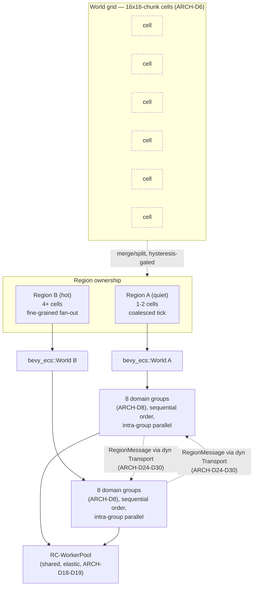
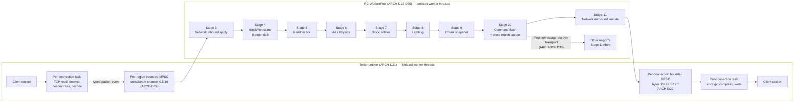

# Server Architecture

## Purpose

Defines the ECS foundation, threading model, tick pipeline, scheduler, and vanilla ordering-fidelity rules for the Rusty Clanker server core. Every other server-domain document builds its systems, data, and I/O on top of the primitives decided here.

## Scope

**In scope:** ECS crate selection and configuration; region-based world partitioning; domain parallelism within a region; conflict/access model; command-buffer and sync-point semantics; the message-passing substrate (location-transparent addressing, message envelope, the `Transport` trait, its monolithic-mode `InProcessTransport` implementation, delivery/ordering guarantees, and the ECS-facing send/receive API) that all cross-partition communication — cross-region today, cross-node once `13-cluster-architecture.md` supplies a network implementation — goes through; cross-region entity and redstone/block handoff built on that substrate; the full 50 ms tick pipeline as ordered stages; the work-stealing scheduler and its elastic worker pool; the Tokio/simulation handoff boundary; vanilla intra-tick ordering fidelity rules.

**Out of scope:** chunk data structures, palettes, and persistence format (`03-world-chunks-persistence.md`); world generation algorithms and noise pipelines (`04-worldgen-parity.md`); concrete game mechanics and their component definitions (`05-game-mechanics.md`); packet framing, compression, and encryption wire details (`02-protocol-networking.md`). This document defines the *boundaries and contracts* those domains plug into, not their internals.

## Decisions

| ID | Decision | Rationale |
|---|---|---|
| ARCH-D1 | ECS core: `bevy_ecs` 0.19.1 (crates.io, published 2026-08-13; Rust edition 2024, MSRV 1.95.0), used standalone. | Only actively-maintained, native-Rust (no C-library FFI core) ECS combining archetype+sparse-set hybrid storage, per-`SystemParam` statically-computed `Access<ComponentId>` read/write sets, and a runtime dynamic-component-registration path at production (post-1.0, widely-deployed) maturity — all three required simultaneously, at that maturity bar, given the project's from-scratch memory-safe-Rust-core mandate. |
| ARCH-D2 | `bevy_ecs` pulled with `default-features = false, features = ["std"]`. No rendering/app/windowing crates enter the dependency graph; `bevy_reflect`, `multi_threaded`, `async_executor` are left disabled. | We consume only `World`, `Entity`, `Component`, `Query`/`QueryState`, `Commands`/`CommandQueue`, and the `System` trait's access-set introspection. Reflection and the built-in executor are unused (ARCH-D3). |
| ARCH-D3 | `bevy_ecs`'s built-in `Schedule`/`MultiThreaded` executor and `bevy_tasks::ComputeTaskPool` are **not** used for tick execution. Rusty Clanker implements its own executor, RC-Executor, running on its own elastic worker pool, RC-WorkerPool. | `bevy_tasks::TaskPool` is fixed-size once built and is a process-global singleton — incompatible with the dynamic grow/shrink and per-region-hotness fan-out this project requires (ARCH-D18–D20). Reusing `bevy_ecs`'s `System::component_access()` output while replacing only the *execution* strategy keeps the safety guarantees without the pool rigidity. |
| ARCH-D4 | Mods register components at runtime via `World::register_component_with_descriptor` (layout-only `ComponentDescriptor`: size, alignment, drop fn — no static Rust type required) and access them through `QueryBuilder`/`FilteredEntityRef`/`FilteredEntityMut` dynamic-`ComponentId` APIs. Native engine/domain components use the static `#[derive(Component)]` path. | Isomorphic mods are loaded as separate dynamic libraries; a `ComponentId` obtained from a descriptor crosses the dylib ABI boundary safely where a monomorphized generic type cannot. Full mechanism (loader, ABI, hook injection points) is owned by the modding-API planning doc; this document fixes only the ECS-level registration primitive it depends on. |
| ARCH-D5 | The world is partitioned into **regions**. Each region owns exactly one `bevy_ecs::World` instance and one fixed, statically-registered list of domain systems (ARCH-D8). A region owns a contiguous, mutable set of chunks; no two regions ever hold a chunk simultaneously. | Mirrors Folia's region-threading concept (prior art, reimplemented originally — no Folia/Paper source is consulted or copied; only the publicly documented *concept* of independently-ticking geographic regions informs this design). Gives domain systems safe concurrent access to the *same* chunks without cross-region lock contention, since concurrency across regions requires no shared state at all. |
| ARCH-D6 | Regions are built from a fixed **grid cell** of 16×16 chunks (matches Folia's default `gridExponent = 4`). A region's owned area is a union of adjacent grid cells. Cells merge into the neighboring region when combined load drops below the merge threshold for 100 consecutive ticks (5 s, hysteresis); a region splits along its largest internal cell-connectivity cut when its own tick duration EWMA exceeds 45 ms (90% of budget) for 40 consecutive ticks (2 s). | Cell size of 16×16 chunks (256×256 blocks) is large enough that the common case (a player base, a farm, a redstone contraption) fits inside one region, keeping ARCH-D13's sequential-collapse rule cheap; hysteresis on both directions prevents merge/split thrashing at a load boundary. |
| ARCH-D7 | Each region has an **independent** tick clock. Target is 20 TPS / 50 ms measured from that region's own tick start. RC-Executor's admission control never delays a quiet region's on-time tick because another region is overloaded. Only a region that cannot keep up degrades its own TPS. | Directly implements the vision's "quiet regions batched onto few workers; hot regions scale out" — and is a strict parity *improvement* over vanilla, where one overloaded chunk stalls every player on the server. |
| ARCH-D8 | Domain systems are grouped into eight fixed groups per region, run in this fixed inter-group order every tick: **Block/Redstone → Random Tick → Entity AI Selection → Entity Physics Integration → Block Entity → Lighting → Chunk Serialization (snapshot) → Network Encode/Decode** (Random Tick and Block Entity are named groups in their own right, addressable individually — e.g. by `06-modding-api.md`'s MOD-D36/D37 — never folded into an adjacent group; Entity AI Selection and Entity Physics Integration are ARCH-D15's own 6a/6b split, each its own addressable group rather than one combined "AI+Physics" group). Every system in every group declares its component read/write set via `bevy_ecs`'s `SystemParam` machinery (`Query<&T>`, `Query<&mut T>`, `Res`/`ResMut`, `ParamSet` for intentionally-disjoint conflicting params). RC-Executor computes a static conflict graph from these `Access<ComponentId>` sets once at startup (Kahn's-algorithm topological sort, ties broken by declaration index) and reuses it for every tick of every region. | Fixed group order matches vanilla's own stage ordering (scheduled block ticks before entity ticks before lighting/chunking) closely enough to preserve observable causality within a tick; computing the conflict graph once at startup (not per-tick) removes scheduling overhead from the hot path. |
| ARCH-D9 | All structural World mutations (entity spawn/despawn, component add/remove, archetype-changing block-state replace) go through `CommandQueue`-equivalent buffers during stages 3–9 and are applied only at two **sync points**: pre-tick (Stage 1, applies previous tick's buffers + inbound cross-region transfers) and post-tick (Stage 10, applies this tick's buffers in `(stage index, emission order, chunk/entity id)` order). No system ever performs a structural mutation directly against the live `World` mid-stage. **Exception:** Stage 4 (Scheduled Block Tick) applies its own block-state mutations immediately, inline, block-by-block, not deferred through this sync-point mechanism — `ARCH-D13`'s mandatory single-worker sequential execution for that stage already provides the same-tick visibility guarantee these sync points exist to manufacture, for free, simply by finishing before Stage 5's full-drain barrier opens (see `05-game-mechanics.md`'s MECH-D9/D10, which specify Stage 4's inline-apply behavior in full, including the block-event queue sub-phase this exception covers). | Archetype moves invalidate in-flight `QueryState` iterators; confining them to two single-threaded sync points is what makes the rest of the tick safe to parallelize under `bevy_ecs`'s aliasing rules. Stage 4's exception costs nothing extra in that regard because `ARCH-D13` already forces it single-worker sequential for an unrelated reason (redstone ordering fidelity) — the same-tick visibility is a free consequence of that constraint, not a second concurrency-safety mechanism to maintain; without this carve-out a literal reading would put every piston move one full tick behind vanilla. |
| ARCH-D10 | Cross-region entity transfer: computed during Entity AI+Physics (Stage 6) as a `RegionTransferRequest` — a `RegionMessage` variant sent via `RegionMessageBus` (ARCH-D24–D30) — when an entity's resolved position leaves its region's owned chunks. Applied at the *destination* region's next Stage 1: entity removed from source `World`, component state snapshotted into the message payload, re-inserted into destination `World`, `RcEntityId -> RegionId` directory updated (ARCH-D24). | Guarantees no two regions ever mutate the same entity concurrently; costs exactly one tick (50 ms) of transfer latency, which is below the threshold of human perception and is the same order of magnitude Folia accepts for the same problem. |
| ARCH-D11 | Cross-region redstone/block propagation: a region maintains a read-only border halo — mirroring the last known state of a full 16-block (one-chunk) slice of each neighboring region's bordering chunks, not merely the outermost block row — so that wide-radius reads (e.g. explosion resistance lookups, `05-game-mechanics.md`'s MECH-D18) have enough neighbor depth without a second halo mechanism. A block/redstone update whose propagation would cross into a neighbor is captured as a `BorderUpdateEvent` — a `RegionMessage` variant sent via `RegionMessageBus` (ARCH-D24–D30) — and delivered to the neighbor's inbox, applied as the first sub-step of that neighbor's Stage 4 (Scheduled Block Tick) on its *next* tick. Sustained border-crossing update traffic (>10 border events/tick average over 40 ticks) triggers the ARCH-D6 merge policy so the circuit becomes single-region and zero-latency. | Vanilla has no region boundary at all, so no boundary-crossing behavior can be bit-identical by construction; this rule makes the deviation the smallest possible (exactly one tick, only at the crossing point) and self-heals into zero-latency for any circuit hot enough to matter. The one-chunk halo depth is sized to cover the largest wide-radius read this document's consumers currently need (a charged creeper's up-to-12-block explosion radius, MECH-D18) without over-provisioning further. |
| ARCH-D12 | The tick pipeline is the fixed 11-stage sequence in the [Tick Pipeline](#tick-pipeline) section below, executed identically by every region every tick. | Single canonical pipeline definition all domain docs implement against; see stage table for per-stage parallelization axis and determinism guarantee. |
| ARCH-D13 | Stage 4 (Scheduled Block Tick) runs **fully sequential**, single worker, per region: vanilla's four tick-priority levels (`EXTREMELY_HIGH=-3, VERY_HIGH=-2, HIGH=-1, NORMAL=0`, FIFO within a level, insertion-order tie-break) and neighbor-update fan-out order (post-placement: west, east, north, south, down, up; neighbor-changed: west, east, down, up, north, south) are reproduced exactly. | This is the one domain vanilla players build machines against (redstone). No parallelization axis is safe here without changing observable behavior; sequential collapse is mandatory, not a performance choice. |
| ARCH-D14 | Stage 5 (Random Block Tick) parallelizes **by chunk**, each chunk seeding its own RNG stream as `hash(world_seed, chunk_x, chunk_z, tick_counter)` instead of replicating vanilla's single shared sequential `Random` instance. | No vanilla-observable mechanic depends on the cross-chunk *order* random ticks are drawn in, only on correct per-block statistical frequency, which a per-chunk seeded stream preserves exactly; this is a deliberate, documented parity exception distinct from ARCH-D13. |
| ARCH-D15 | Stage 6 (Entity AI+Physics) splits into 6a (AI/pathfinding/target-selection: read-only over neighboring entity state, fully data-parallel, entity-batched across RC-WorkerPool) and 6b (physics/movement integration: parallel per-entity compute over the Stage-6a snapshot, then a single-threaded deterministic reconciliation pass ordered by `(chunk, entity id ascending)` resolving any write-write contention, e.g. simultaneous piston-push or gap-crowding). | Matches vanilla's own iteration-order tie-break (entity ID order within a chunk's tick list) for the only sub-step where two entities can observably contend, while keeping the bulk of AI/physics compute fully parallel. |
| ARCH-D16 | Stage 8 (Lighting) parallelizes fully **by chunk**. Light propagation is a wavefront BFS fixed point over the block-opacity graph; the converged result is independent of visitation order by construction. | Order-independence is a mathematical property of the algorithm, not an approximation — full chunk parallelism here has zero parity cost. |
| ARCH-D17 | Stage 7 (Block Entity Tick, including hopper item transfer) parallelizes **by chunk**; within a chunk, block entities process sequentially in stable load order (vanilla's own per-chunk block-entity list order). Hopper chains crossing a chunk border within the same region are covered by this same per-region sequential domain (ARCH-D13's sequential Stage-4 pass does not apply here, but Stage 7's cross-chunk-same-region hopper interactions are resolved by processing all of a region's block entities under one worker when any adjacency is detected at region-build time). Hopper chains crossing a *region* border use the ARCH-D11 border-event mechanism. | Hopper "clocks" are famously timing-sensitive in vanilla; preserving per-chunk load order and collapsing cross-chunk-same-region adjacency to one worker keeps the overwhelming majority of contraptions bit-exact while still parallelizing the common case (chunks with no adjacent-region block entities). |
| ARCH-D18 | RC-WorkerPool is a custom work-stealing pool built on `crossbeam-deque` 0.8.7 (global `Injector` + one `Worker`/`Stealer` pair per OS thread) and `crossbeam-utils` 0.8.22 park/unpark primitives. Baseline size = `std::thread::available_parallelism()`, always alive. Hard cap = baseline × 2 (overprovision factor, configurable) to bound context-switch overhead on oversubscribed hosts. Under containerized/virtualized deployment, both values are further clamped by `14-performance-engineering.md`'s PERF-D57 cgroup v1/v2 quota-aware sizing — baseline becomes `min(available_parallelism(), cgroup_cores)`, and the hard cap is baseline × 2 computed from that clamped value, never the raw host core count. | Lock-free steal path, full control over thread lifecycle (required for ARCH-D19's elastic growth/shrink, which `rayon::ThreadPool` does not support at runtime), no framework dependency beyond primitive building blocks. |
| ARCH-D19 | Pool sizing policy: every tick, RC-Executor samples the `Injector` backlog depth and each region's tick-duration EWMA (α = 0.2). **Grow** by exactly 1 worker thread when backlog EWMA > 2× current pool size, sustained ≥ 3 consecutive ticks, and current size < hard cap. **Shrink** by 1 worker (graceful: finish in-flight task, deregister `Stealer`, join) when a worker has had 0 successful steals for ≥ 100 consecutive ticks (5 s) and current size > baseline. A region with tick-duration EWMA > 35 ms (70% of budget, "hot") splits its Stage-6/7/8 work into finer batches (32 entities/chunks per unit instead of 128) to expose more stealable work; a region under 5 ms ("quiet") coalesces its entire tick into a single work item. | Additive (not multiplicative) growth avoids overshoot/oscillation; the hot/quiet granularity split is the concrete mechanism realizing "quiet regions batched onto few workers, hot regions scale out" inside a shared pool rather than via per-region dedicated threads. |
| ARCH-D20 | Region tick admission is Earliest-Deadline-First: each region's deadline = `last_tick_start + 50ms`; RC-Executor's Injector serves overdue regions before on-time regions regardless of arrival order. | Prevents a burst of many quiet regions' tiny work items from starving a hot region that is falling behind, and vice versa; directly modeled on Folia's `TickRegionScheduler` EDF mode as prior art (concept only, original implementation). |
| ARCH-D21 | All network I/O runs on a separate, isolated Tokio multi-thread runtime (`tokio` 1.53.1, `rt-multi-thread` + `net` + `time` + `sync` + `macros` features), sized to `clamp(available_parallelism()/4, 2, 8)` worker threads. This runtime's threads never execute RC-WorkerPool work and vice versa. | Keeps a CPU-bound simulation burst from starving the async reactor (which would manifest as network stalls/timeouts) and keeps a network I/O burst from stealing simulation cycles; the two workloads have incompatible scheduling needs (cooperative-yield async vs. run-to-completion sync). |
| ARCH-D22 | The sync/async boundary is exactly two bounded channel types, no other shared state: inbound is `crossbeam-channel` 0.5.16 bounded MPSC, one per region, carrying already-decoded/decrypted/decompressed typed packet events keyed by the sending player's current `RegionId` (looked up from an atomically-updated ownership table maintained at ARCH-D10 sync points). Outbound is a `bytes::Bytes` (crate `bytes` 1.12.1, zero-copy) bounded MPSC per connection, carrying pre-serialized packet buffers produced read-only at Stage 11. Tokio tasks never acquire a reference into any region's `World`. | Structural isolation, not discipline, is what prevents an async task from ever holding a `World` borrow across an `.await` point — a class of bug that is otherwise easy to introduce accidentally in a Tokio+ECS hybrid. |
| ARCH-D23 | `parking_lot` 0.12.5 `Mutex`/`RwLock` guard only cold-path bookkeeping (region ownership table, pool-resize control state, border-halo snapshots). All hot-path work distribution is lock-free via `crossbeam-deque`. | Keeps the one genuinely hot path (steal/execute) free of any lock, while giving the infrequent cross-cutting state (touched a handful of times per tick, not per system) a simpler, still-fast primitive than hand-rolled atomics. |
| ARCH-D24 | **Location-transparent addressing.** Two global identifiers exist independent of runtime placement: `ChunkKey { dimension: DimensionId, x: i32, z: i32 }` (permanent per chunk) and `RcEntityId(u64)` (monotonic, allocated once at spawn, distinct from the ephemeral intra-`World` `bevy_ecs::Entity` index+generation, and stable across ARCH-D10 transfers and any future cluster-mode relocation). Two directories, `ChunkKey -> RegionId` (derived from ARCH-D6 region-to-cell membership) and `RcEntityId -> RegionId`, are the sole source of truth for "which region owns X"; both are mutated only at ARCH-D9 sync points and are read-only during a tick. No code anywhere holds a raw cross-region reference into another region's `World` or a bare `bevy_ecs::Entity` index that outlives that region's tick. | These are exactly the two directories `13-cluster-architecture.md` extends with a further `RegionId -> NodeId` hop for cluster mode; fixing the `RegionId`-keyed addressing unit here, rather than a node identity, is what keeps this document cluster-agnostic while remaining cluster-ready. |
| ARCH-D25 | **Message envelope.** All cross-partition traffic is a `Message<RegionMessage>` value: `{ from: RegionId, to: Address, tick_stamp: u64, seq: u32, payload: RegionMessage }`, where `Address` is `Region(RegionId) \| Entity(RcEntityId) \| Chunk(ChunkKey)`. The sending region resolves `Address::Entity`/`Address::Chunk` to a concrete destination `RegionId` at emission time via the ARCH-D24 directories — never re-resolved by the receiver. Every `RegionMessage` variant derives `serde::Serialize`/`Deserialize` so the identical type is reusable, unmodified, as `13-cluster-architecture.md`'s pre-wire-serialization payload; this document does not choose a wire format, it only guarantees the payload type is representable as one. | Sender-side resolution anchors the routing decision to the sender's own consistent tick-1 snapshot instead of a possibly-stale receiver view; deriving (not requiring) serde on the payload gets cluster-mode reuse for free without coupling the monolithic hot path to a serializer. |
| ARCH-D26 | **`Transport` trait, two implementations.** `trait Transport: Send + Sync + 'static { fn send(&self, msg: Message<RegionMessage>) -> Result<(), TransportError>; fn try_recv(&self, into: RegionId) -> Option<Message<RegionMessage>>; }`. RC-Executor and every domain system depend on `dyn Transport` only, wired up once at startup by a `TransportFactory`, never branched per call site. `InProcessTransport` (ARCH-D27) is the monolithic-mode implementation owned by this document; `NetworkTransport`, implementing the identical trait signature over the cluster's node-to-node link, is owned by `13-cluster-architecture.md`. | The trait boundary is the literal realization of the vision's "zero user-facing complexity" dual-mode requirement: no domain system and no part of ARCH-D8's conflict model changes between monolithic and cluster deployment — only which struct is behind the `dyn Transport` pointer changes. |
| ARCH-D27 | **Monolithic-mode transport: `InProcessTransport`.** One bounded `crossbeam-channel` 0.5.16 MPSC per live `RegionId` (capacity 4096 messages, configurable), created/destroyed exactly at ARCH-D6 split/merge boundaries under the `parking_lot`-guarded region ownership table (ARCH-D23). `Message<RegionMessage>` values are moved — never cloned, never serialized — from sender to receiver; the destination `RegionId -> Sender` lookup reuses that same region ownership table RC-Executor already maintains for chunk-to-region mapping and EDF admission control (ARCH-D19–D20). | This is the "effectively zero latency," allocation-lean in-memory path the vision requires for ordinary single-container hosting; reusing one table for chunk ownership, scheduling admission, and message routing avoids a second source of truth for "which regions currently exist." |
| ARCH-D28 | **Allocation strategy for in-memory messages.** `RegionMessage`'s common-case variant (`BorderUpdateEvent`) is sized to fit inline (≤128 bytes, no heap allocation). The rarer, larger `RegionTransferRequest` payload (full entity component snapshot) is drawn from a global lock-free slot pool (`crossbeam-queue` 0.3.13 `SegQueue<Box<EntitySnapshot>>`, pre-sized to the expected concurrent in-flight transfer count): the sending worker pops a free slot to build the snapshot, the payload moves through the channel by value, and the *destination* region's Stage-1 apply pass returns the slot to the pool once consumed. | Keeps the overwhelmingly common message (border updates) allocation-free on the hot path and reuses a bounded set of pre-sized snapshot buffers instead of per-message heap churn. A per-worker-thread bump arena (e.g. `bumpalo`) was rejected: RC-WorkerPool is work-stealing, so the worker that allocates a `RegionTransferRequest` snapshot and the worker whose region consumes it at Stage 1 are not guaranteed to be the same OS thread, which a single-threaded-reset arena requires and a lock-free MPMC pool does not. |
| ARCH-D29 | **Delivery & ordering guarantees.** Per ordered `(from: RegionId, to: Address)` pair: FIFO, exactly-once for the process's lifetime (a bounded channel neither reorders nor duplicates; any cluster-mode guarantee across node restarts is `13-cluster-architecture.md`'s call). No ordering is guaranteed *across* different sender/destination pairs — a region's Stage-1 drain consumes all currently-queued inbound messages in arrival order, and downstream logic (ARCH-D10, ARCH-D11) is written to tolerate cross-sender arrival-order variance. A full destination inbox returns `TransportError::Backpressure` to the sender's Stage-10 flush as a retry-next-tick condition; a region never blocks its own tick waiting on another region's inbox. | Matches the one guarantee domain logic actually needs (no A→B message is ever lost or reordered relative to other A→B messages) without paying for a total order nothing in the design requires; never-block-on-another-region's-inbox keeps ARCH-D7's per-region independent tick clock true under message backpressure, not just under compute load. |
| ARCH-D30 | **ECS-facing API: `RegionMessageBus`.** Systems never call `Transport::send`/`try_recv` directly. A per-region `RegionMessageBus` resource, injected like `Commands`, exposes `.send(Address, RegionMessage)`; calls are buffered into that system's deferred command queue and flushed to `dyn Transport` at Stage 10 in emission order — the same deferred-apply discipline as ARCH-D9's structural mutations. Inbound messages are drained from `dyn Transport` into an `Events<RegionMessage>`-equivalent queue at Stage 1, consumed read-only by any Stage-1..N system declaring read access to it (ARCH-D10's transfer application and ARCH-D11's border-tick injection are the two native consumers). | One deferred-apply discipline for both structural ECS mutation and cross-partition messaging means a system author learns a single pattern; consuming inbound messages as a normal declared-read-access queue keeps message consumption inside ARCH-D8's conflict-graph model instead of being a bolted-on special case. |
| ARCH-D31 | **Confirmed: RC-Executor's startup construction path can support a stable-`Identifier`-to-native-system export mechanism**, analogous to ARCH-D4's dynamic component-registration primitive — a domain document opts a `SystemHandle` into an exported table keyed by `Identifier` during the same startup pass that builds ARCH-D8's conflict graph, before any connection is accepted; an un-exported system simply has no entry, unreachable by that name. This is the concrete "stable name for an existing native system" primitive `06-modding-api.md`'s MOD-D36 needs, which no prior decision in this document named. | Generalizing ARCH-D4's already-proven "register once at startup, resolve by name thereafter" shape from components to systems costs no new startup phase or synchronization primitive — the export table is populated during the same once-per-process conflict-graph build ARCH-D8 already runs, then read-only for the rest of the process's life. |

## Region Architecture



## Message-Passing Substrate

This is the one substrate every cross-boundary communication in the engine goes through, in either deployment mode (ARCH-D26). It is distinct from — and does not share channels, threads, or types with — ARCH-D22's Tokio↔RC-WorkerPool boundary, which carries player packet events, not `RegionMessage` traffic.

**Boundary rule.** Because ARCH-D8 groups every domain (block/redstone, random tick, entity AI selection, entity physics integration, block entity, lighting, serialization, network codec) inside one region behind statically declared, conflict-checked component access on a *shared* `bevy_ecs::World`, no domain-to-domain communication within one owned partition ever needs this substrate — shared-memory declared access is strictly cheaper and is what ARCH-D8 already guarantees is safe. The message substrate exists exclusively for communication *across* partition ownership boundaries: region↔region (ARCH-D10, ARCH-D11) today, and node↔node once `13-cluster-architecture.md` supplies `NetworkTransport`. Within one owned partition, the ECS remains shared-memory, full stop — this is the precise line the project vision's "engineering note" draws, and this document is its authority.

```mermaid
flowchart LR
    subgraph RegionA["Region A — owned partition (shared-memory bevy_ecs::World)"]
        SysA["Domain systems\n(ARCH-D8)"] -->|".send(Address, RegionMessage)\nResMut&lt;RegionMessageBus&gt;"| BusA["RegionMessageBus\n(deferred, ARCH-D30)"]
    end
    BusA -->|"flush @ Stage 10\nMessage&lt;RegionMessage&gt;\n(ARCH-D25)"| Impl

    subgraph Impl["dyn Transport (ARCH-D26) — exactly one impl wired at startup"]
        direction TB
        InProc["InProcessTransport\ncrossbeam-channel MPSC\n(ARCH-D27, monolithic mode)"]
        Net["NetworkTransport\n(13-cluster-architecture.md,\ncluster mode)"]
    end

    Impl -->|"drain @ Stage 1"| BusB["RegionMessageBus\n(inbound queue)"]
    subgraph RegionB["Region B — owned partition (shared-memory bevy_ecs::World)"]
        BusB --> SysB["Domain systems\n(ARCH-D8)\nread Events&lt;RegionMessage&gt;"]
    end

    style RegionA fill:transparent
    style RegionB fill:transparent
    style Impl fill:transparent,stroke-dasharray: 3 3
```



Addressing (ARCH-D24), the envelope (ARCH-D25), the trait and its two implementations (ARCH-D26–D27), allocation strategy (ARCH-D28), delivery/ordering guarantees (ARCH-D29), and the ECS-facing send/receive API (ARCH-D30) are specified in full in the Decisions table above. `RegionTransferRequest` (ARCH-D10) and `BorderUpdateEvent` (ARCH-D11) are the two native `RegionMessage` payload variants shipped by this document; `13-cluster-architecture.md` may add cluster-only variants (e.g. node-liveness, ownership-handoff control messages) without changing this envelope or trait.

## Domain Conflict Model

Each of ARCH-D8's eight groups is a fixed, ordered list of systems declared at engine startup (native engine systems plus any mod-injected systems resolved before the server accepts connections — no system list changes mid-run). For every system, RC-Executor holds:

```rust
struct SystemHandle {
    system: Box<dyn bevy_ecs::system::System<In = (), Out = ()>>,
    access: bevy_ecs::query::Access<bevy_ecs::component::ComponentId>, // from system.component_access()
    group: DomainGroup,       // BlockRedstone | RandomTick | EntityAiSelection | EntityPhysicsIntegration | BlockEntity | Lighting | ChunkSerialize | NetCodec
    order_tag: u32,           // declaration index; deterministic tie-break
}
```

Two systems in the **same** group may run concurrently on RC-WorkerPool iff their `Access` sets are disjoint or read-only/read-only (checked once at startup against the precomputed conflict graph, ARCH-D8; a conflict at startup is a hard boot-time error, not a runtime fallback). Systems in **different** groups never run concurrently against each other by construction — inter-group order is the fixed ARCH-D8 sequence, enforced by RC-Executor treating each group as a full-drain barrier before the next group's systems become eligible for scheduling. Within Stage 4 and the sequential portion of Stage 7 (ARCH-D13, ARCH-D17), the group's system list additionally collapses to a single worker regardless of declared access — sequencing there is a correctness requirement, not a conflict-avoidance one.

Structural changes never touch `access` sets directly: every system that spawns/despawns entities or adds/removes components does so through a `CommandQueue` parameter, deferred to the two sync points (ARCH-D9). RC-Executor validates at startup that no system both declares direct mutable `Query` access to a component *and* defers structural changes to that same component through a command in the same tick region — that combination is rejected at registration time, forcing a single, unambiguous authority (live query or deferred command, never both) per component per group.

## Tick Pipeline

Fixed 11-stage sequence, identical for every region, every 50 ms tick (ARCH-D12):

| # | Stage | Parallel axis | Determinism guarantee |
|---|---|---|---|
| 1 | Pre-tick sync & command apply | None (single worker, region-exclusive) | Total order = previous tick's command emission order (ARCH-D9), then inbound cross-region transfers (ARCH-D10) in source-region FIFO order |
| 2 | World/environment update (time, weather, sleep, world border) | None | Pure function of `(tick_counter, seed)` |
| 3 | Network inbound apply | Player-parallel drain, deterministic merge by ascending player id | Fixed input packet sequence + fixed player-id order ⇒ identical resulting component state |
| 4 | Scheduled block tick (redstone, liquids, growth timers), including a block-event queue sub-phase (piston extend/retract, note-block play, chest/shulker open-count, end-gateway trigger, bell ring) at the end of the stage — placement fixed by `05-game-mechanics.md`'s MECH-D9 | **None — sequential, mandatory** (ARCH-D13) | Bit-identical to vanilla for updates confined to one region; +1 tick at region borders (ARCH-D11); block-state mutations apply inline, not deferred through ARCH-D9's sync points (ARCH-D9's exception, MECH-D10) |
| 5 | Random block tick | Chunk-parallel | Per-chunk seeded RNG (ARCH-D14); statistically, not order-, faithful to vanilla |
| 6a | Entity AI / pathfinding / target selection | Entity-parallel, read-only | Deterministic given `(seed, world state snapshot)`; batch size varies by region hotness (ARCH-D19) |
| 6b | Entity physics / movement / collision | Parallel compute + sequential reconciliation pass | Reconciliation ordered `(chunk, entity id)` (ARCH-D15) |
| 7 | Block entity tick (furnaces, hoppers, spawners) | Chunk-parallel, sequential within a chunk's block-entity list | Vanilla per-chunk load order preserved (ARCH-D17) |
| 8 | Lighting propagation | Chunk-parallel (full) | Order-independent BFS fixed point (ARCH-D16) |
| 9 | Chunk lifecycle & serialization snapshot | Chunk-parallel | Snapshot only; no disk I/O inside the tick budget (handoff to `03-world-chunks-persistence.md`) |
| 10 | Post-tick command flush & cross-region outbox | None (single worker, region-exclusive) | `(stage, emission order, chunk/entity id)` order (ARCH-D9); populates destination regions' Stage-1 inboxes |
| 11 | Network outbound encode | Player-parallel, read-only | Pure function of final post-command `World` state for that player's visibility set |

Worldgen (`04-worldgen-parity.md`) is explicitly **not** a pipeline stage: it runs as background work on RC-WorkerPool at lower scheduling priority than any in-tick stage, and a completed chunk is delivered as an ordinary structural command consumed at a region's Stage 1, never inserted mid-tick.

## Scheduler & Async/Sync Boundary



No arrow crosses the `Net`/`Sim` boundary except through the two bounded channels; no Tokio task ever holds a reference into a `bevy_ecs::World` (ARCH-D22). A full connection round trip therefore never blocks either runtime on the other: a slow client backs up its own bounded outbound channel (dropped/kicked past a configurable backlog, not blocking Stage 11), and a slow tick never blocks the Tokio reactor from servicing other connections' I/O.

## Interfaces

**Provides to `02-protocol-networking.md`:**
- `RegionId` type and the per-connection region-affinity lookup (ARCH-D22) that `02` must resolve into before pushing to the inbound channel.
- The inbound/outbound channel contract (ARCH-D22): `02` owns packet framing/encryption/compression and must complete all of it inside the Tokio task, handing RC-Executor only fully-decoded typed events (inbound) or fully-encoded `Bytes` (outbound).
- The Stage-3/Stage-11 apply/encode boundary: `02` must specify, per packet type, whether it is a Stage-3 gameplay-affecting event (applied once per tick) or an out-of-band control packet (keep-alive, status) that bypasses the tick pipeline entirely.

**Provides to `03-world-chunks-persistence.md`:**
- Chunk-to-region ownership mapping and its mutation points (only at ARCH-D6 merge/split and ARCH-D10/D11 sync points).
- The Stage-9 snapshot handoff contract: RC-Executor guarantees a chunk snapshot is immutable and produced without disk I/O inside the tick; `03` owns the on-disk format, compression, and write scheduling entirely outside the tick budget.
- The storage-class choice (`Table` vs `SparseSet`, `#[component(storage = ...)]`) for any component `03` defines is `03`'s call; ARCH-D8's conflict graph only needs the resulting `ComponentId` and its declared access.

**Provides to `04-worldgen-parity.md`:**
- Confirmation that worldgen is not a pipeline stage (see Tick Pipeline note) and the exact structural-command insertion point (a region's Stage 1) a completed chunk must use.
- RC-WorkerPool availability at lower-than-tick scheduling priority (ARCH-D20's EDF ordering never yields to worldgen work ahead of an overdue region tick).

**Provides to `05-game-mechanics.md`:**
- The fixed eight-group pipeline slot list (ARCH-D8) every mechanic's systems register into, plus the `SystemHandle`/`Access<ComponentId>` declaration contract systems must honor honestly (ARCH-D8's startup conflict check is the only enforcement — no runtime aliasing checks in release builds).
- The binding ordering-fidelity rules (ARCH-D13–D17) mechanics implementations must not violate.
- The `CommandQueue` structural-change contract (ARCH-D9): no system may mutate archetypes directly mid-stage.

**Needs from `02-protocol-networking.md`:** the definitive per-packet-type classification (Stage-3 tick-bound vs. out-of-band) referenced above; confirmation that all decompression/decryption fits inside a Tokio task without needing `spawn_blocking` onto a pool outside the two isolated runtimes (ARCH-D21).

**Needs from `03-world-chunks-persistence.md`:** the chunk coordinate/grid convention (must align with ARCH-D6's 16×16-chunk grid cells, even though region size is independently tunable) and whether chunk objects handed to Stage 9 are engine-owned in-memory structures or opaque handles into `03`'s store.

**Needs from `04-worldgen-parity.md`:** the completion-signaling mechanism for a finished chunk (must be expressible as a Stage-1 structural command) and confirmation that not-yet-generated chunks at a region's edge do not require provisional region ownership.

**Needs from `05-game-mechanics.md`:** the authoritative component list with each component's expected read/write pattern per mechanic, so RC-Executor's startup conflict graph (ARCH-D8) can be validated against real system declarations rather than placeholders.

**Provides to `06-modding-api.md`:** ARCH-D8's now-current eight-group domain enumeration (Random Tick and Block Entity named individually; Entity AI Selection and Entity Physics Integration named individually per ARCH-D15's 6a/6b split, replacing the earlier combined "AI+Physics" group) this document tracks going forward, so `06`'s MOD-D8/D37 text ("whatever `01` currently enumerates") never goes stale independently; confirmation that Entity AI Selection is structurally read-only-dispatched (no `apply_deferred` runs for that group, ARCH-D15/Tick Pipeline Stage 6a), the fact `06`'s amended MOD-D8 relies on to reject a manifest declaring `access: "write"` against it at RegistryBuild time; ARCH-D31's confirmation that RC-Executor's startup construction path supports a stable-`Identifier`-to-native-system export table analogous to ARCH-D4's component-registration primitive, the concrete answer to MOD-D36's "no stable name for an existing native system" gap.

**Provides to `13-cluster-architecture.md`:**
- The complete message-passing substrate `13` builds multi-node routing on top of, unmodified: the `Address`/`ChunkKey`/`RcEntityId` addressing types and their directories (ARCH-D24), the `Message<RegionMessage>` envelope (ARCH-D25), the `Transport` trait (ARCH-D26) `13` implements as `NetworkTransport`, and the delivery/ordering contract (ARCH-D29) `NetworkTransport` must uphold at minimum (it may offer strictly stronger guarantees, e.g. durable exactly-once across node restarts, never weaker).
- `RegionId` as the sole location-transparent unit this document addresses messages to; this document never names a node, host, or network endpoint anywhere — that mapping (`RegionId -> NodeId`) is entirely `13`'s to define.
- The `RegionMessage` enum's extension point: `13` may add cluster-only variants (node liveness, ownership-handoff control traffic) without this document's involvement, provided they satisfy ARCH-D25's `serde::Serialize`/`Deserialize` requirement.
- The ARCH-D6 region split/merge lifecycle and the ARCH-D24 directory update points, which are the exact moments `13` must hook to move a region's owning `NodeId` or to seed a newly-split region's directory entries.

**Needs from `13-cluster-architecture.md`:** confirmation that `NetworkTransport`'s latency/loss characteristics stay within what ARCH-D10 (one-tick entity transfer) and ARCH-D11 (one-tick border propagation, `>10` events/tick merge trigger) assume; if cluster-mode round-trip latency cannot bound within one 50 ms tick under `13`'s target deployment topology, those two thresholds need joint revision. Also needs `13`'s policy for what happens to an in-flight `Message<RegionMessage>` when its destination `RegionId` migrates to a different `NodeId` mid-transit (this document's directories assume the ARCH-D9 sync-point update is atomic from a single node's point of view; cluster mode's cross-node atomicity for that same update is `13`'s design problem, flagged here as a dependency, not solved here).

**Needs from `14-performance-engineering.md`:** none beyond optional extensions — `14` owns general-purpose allocator/arena/pool/fixed-capacity-collection/cache-line-padding/NUMA-thread-pinning policy (PERF-D7–D14, generalizing ARCH-D28's own narrower bump-arena rejection) and the parity-gated fast-path trait-seam mechanism (PERF-D1–D6) any future ARCH-level optimization must route through.

## Open Questions

- Exact public-API method name(s) on `bevy_ecs::system::System` for extracting a system's `Access<ComponentId>` without constructing a `Schedule` must be re-verified against the pinned 0.19.1 API surface once implementation starts; ARCH-D3/ARCH-D8 assume this is public and stable but the precise signature is not pinned here.
- ARCH-D6/D19's numeric thresholds (grid cell size, merge/split hysteresis windows, EWMA α, grow/shrink tick counts, hot/quiet batch sizes) are seed defaults for the blueprint phase; final values require a reference server and load-testing harness to calibrate, not analysis alone.
- ~~Behavior of `std::thread::available_parallelism()` under containerized/virtualized deployment (cgroup CPU quotas can misreport core count) is unresolved.~~ Resolved by `14-performance-engineering.md`'s PERF-D57 (cgroup v1/v2 quota-aware worker-pool sizing).
- The precise state machine for a cross-region entity transfer (ARCH-D10) that is in flight at the exact tick a merge/split (ARCH-D6) reassigns the destination region's chunk ownership is not fully specified; needs a blueprint-phase state diagram.
- Whether ARCH-D21's Tokio `spawn_blocking` pool is sufficient for decompression offload, or a third dedicated pool is warranted, depends on packet size/frequency characteristics fixed by `02-protocol-networking.md`'s compression format choice — revisit once that is decided.
- Isomorphic-modding hook injection into ARCH-D8's groups (where in a group's system list a mod system may insert itself, and under what ordering guarantee relative to native systems) is intentionally left to the modding-API planning doc; ARCH-D4 fixes only the ECS-level dynamic registration primitive it will need.
- ARCH-D29's `TransportError::Backpressure` defines a single retry-next-tick signal but not a bounded retry policy: how many ticks a sender holds and re-attempts a rejected message, and what it does if a destination inbox stays saturated past that bound (drop with a logged/metric event? escalate to forcing an ARCH-D6 split of the overloaded destination region?) is unspecified and needs a blueprint-phase decision, informed by real overload-scenario load testing.
- ARCH-D28's `SegQueue<Box<EntitySnapshot>>` pool's pre-sizing (how many concurrent in-flight `RegionTransferRequest` slots to provision) and its exhaustion behavior (block the sending worker, drop the transfer and retry next tick, or grow the pool dynamically) are not fixed here; needs calibration against expected entity cross-region migration rates.
- ARCH-D24's `RcEntityId -> RegionId` and `ChunkKey -> RegionId` directory update at an ARCH-D9 sync point is specified as atomic only from a single node's point of view; the cross-node atomicity story for that same update in cluster mode is explicitly deferred to `13-cluster-architecture.md` (see this document's "Needs from `13-cluster-architecture.md`" interface note).
