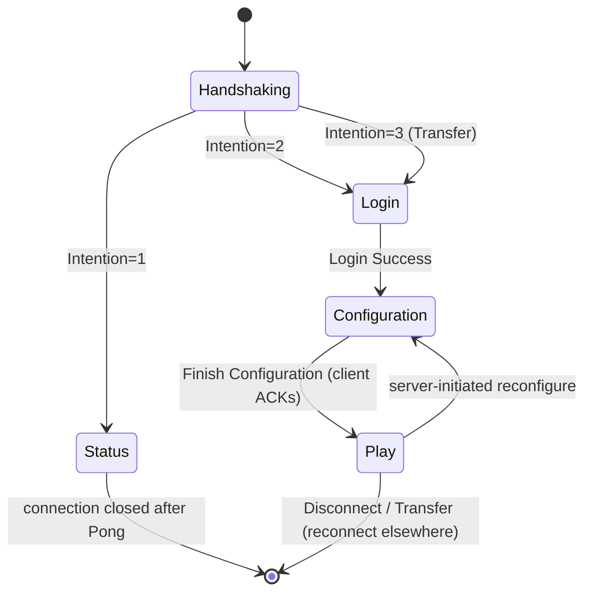
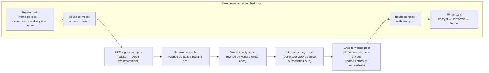
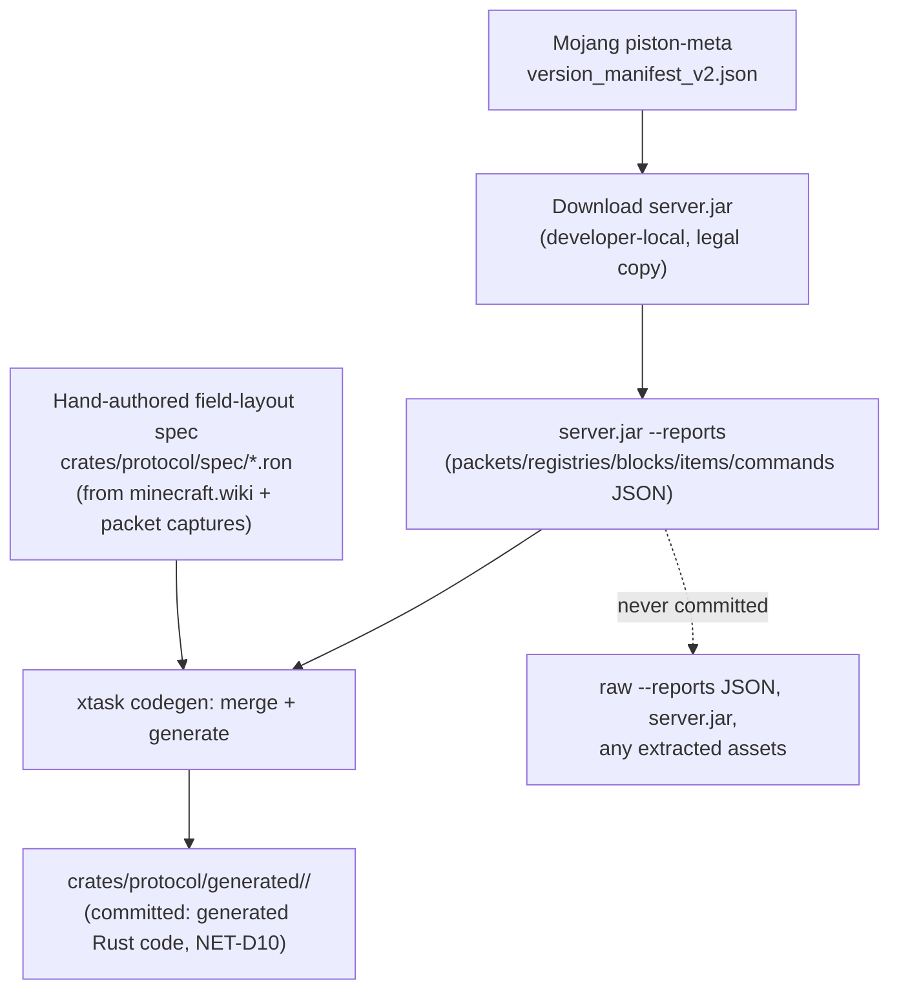

# Protocol & Networking

## Purpose

Defines the Java Edition protocol target, the packet data/codec strategy, the connection lifecycle (handshake through play), the transport/concurrency architecture connecting sockets to the ECS, and the pipeline that turns Mojang's official version data into compiled Rust. This is the single source of truth for how bytes on the wire become typed Rust values and vice versa, and for how those values cross into and out of the simulation.

## Scope

**In scope:** Java Edition wire protocol (framing, compression, encryption, connection states), the packet type/codec generation pipeline, the online-mode session-validation flow, the tokio-based transport architecture, the network↔ECS boundary contract (event/channel shapes, not ECS internals), interest management strategy for broadcast, and the policy for which Mojang-derived data may be committed to the repository.

**Out of scope:** ECS scheduler internals and the domain-parallel threading model itself (owned by the core architecture / ECS-threading document, `ARCH-`/`ECS-`-prefixed decisions); gameplay packet-handling business logic (owned by the respective gameplay domain docs — this doc defines the packet shapes and delivery mechanism, not what a `Use Item On` packet does to the world); world/chunk storage format (owned by the world/persistence doc); Bedrock Edition (out of scope for the whole project per the project vision — Java Edition only); the final, binding legal determination of exactly which Mojang-derived bytes may be committed (owned by `08-assets-auth-legal.md`; this doc proposes a boundary in NET-D10 pending that sign-off).

## Decisions

| ID | Decision |
|----|----------|
| NET-D1 | Pin initial parity target to **Java Edition 26.2** ("Chaos Cubed"), released 2026-06-16, **protocol version 776** (decimal), the latest full release as of this document (2026-08-20), verified against minecraft.wiki. Mojang switched from `1.21.x` point releases to year-based `YY.n` versioning during 2026 (`1.21.11`→protocol 774 was the last pre-switch release; `26.1`→775; `26.1.1`/`26.1.2`→775; `26.2`→776); the next drop, `26.3`, is in snapshot as of this writing and is not tracked until it ships as a full release. |
| NET-D2 | **Single pinned protocol version, no multi-version compatibility layer.** Older or newer clients are rejected at Status/Login with an explicit disconnect reason. A version bump is a deliberate, reviewed event gated on: (a) the version data pipeline (NET-D9) re-run against the new release, (b) the hand-maintained packet field-layout spec reviewed against minecraft.wiki and fresh packet captures, (c) the full parity/regression suite passing against the new version. Snapshots and pre-releases are never tracked. This mirrors the single-version-tracking policy of every actively-maintained Rust MC reimplementation surveyed (see `10-prior-art.md`, PRIOR-D1, PRIOR-D2, PRIOR-D7) — a ViaVersion-style translation layer is explicitly not attempted in Phase 1. |
| NET-D3 | **Packet data definitions are hand-written Rust types plus an in-repo derive-macro crate (`rc-protocol-macros`)**, not sourced from `valence_protocol` or `azalea-protocol` as dependencies. Both crates track only the single latest Minecraft version, are architecturally fused to their own project's ECS/data model (Bevy-`valence` and bot-client-`azalea` respectively), have no stable independently-versioned release track (`valence_protocol`'s only two crates.io releases are `0.0.1`, October 2022, and `0.2.0-alpha.1+mc.1.20.1`, August 2023 — its most recent, itself targeting a Minecraft version three-plus years obsolete as of this writing; both `valence_protocol` and `azalea-protocol` are consumed via git dependency on a moving branch in practice, not the published crate), and coupling to either would tie this project's protocol release cadence to an external early-stage or single-maintainer project (see `10-prior-art.md`, PRIOR-D2, PRIOR-D7, PRIOR-D9). Field layouts are sourced from public protocol documentation (minecraft.wiki Java Edition protocol pages), black-box packet captures, and — per ASSET-D18(f) — the pinned version's own decompiled, unobfuscated jar consulted as a local reference, with Mojang expression never copied verbatim (ASSET-D19). Reading the *architecture* of other independent reimplementations (not their code, not Mojang's) for inspiration is permitted; copying their code is not, independent of licensing. |
| NET-D4 | **Connection state machine:** `Handshaking` → (`Status` \| `Login` \| `Transfer`) per the Handshake packet's `Intention` VarInt (1=Status, 2=Login, 3=Transfer — Transfer routes into Login processing exactly like a normal login) → `Configuration` → `Play`, with a `Play → Configuration` re-entrant transition supported for server-initiated mid-game reconfiguration (e.g. registry/resource-pack reload), matching current vanilla behavior. The play-state `Transfer` packet (server tells a connected client to reconnect elsewhere) is a new-connection instruction, not an in-place state change, and is handled at the connection-lifecycle level, not inside the packet codec. |
| NET-D5 | **Framing & compression:** VarInt-prefixed frame length; once `Set Compression` establishes a threshold (default 256 bytes, configurable), each frame body carries a VarInt uncompressed-data-length (0 = sent uncompressed) followed by zlib-compressed payload for frames at/above threshold. Compression via the `flate2` crate with its `zlib-ng` backend feature for throughput. NBT parsing/encoding via the `simdnbt` crate (zero-copy borrowed-buffer decode) — a generic, MC-protocol-agnostic NBT library, so depending on it does not conflict with NET-D3. Chat/text components are NBT-encoded on the wire (vanilla behavior since 1.20.3, format revised again at 1.21.5) and are handled through the same NBT layer via a dedicated `TextComponent` type generated per NET-D9; exact field layout is a version-data-pipeline artifact, not fixed in this document. |
| NET-D6 | **Encryption & online-mode:** server generates one RSA-1024 keypair per process boot (X.509 SubjectPublicKeyInfo DER sent in `Encryption Request`); client returns a 16-byte (AES-128) shared secret and verify token encrypted under that key (PKCS#1 v1.5 via the `rsa` crate); all subsequent traffic is wrapped in AES/CFB8 keyed by the shared secret (`aes` + `cfb8`, RustCrypto family). Online-mode validation computes the Notchian server hash (SHA-1 of `serverId ++ sharedSecret ++ serverPublicKey`, reinterpreted as a signed two's-complement BigInteger and hex-encoded) and calls `GET https://sessionserver.mojang.com/session/minecraft/hasJoined?username=…&serverId=…[&ip=…]` via `reqwest` (rustls backend) on a bounded-concurrency async task pool — never blocking the connection's decode task. Mojang's session API enforces a 6-joins-per-30s per-account limit and a 200-req-per-2min per-IP limit (bucketed per /56 for IPv6); the validation task pool respects these. Online-mode defaults on and is the supported, documented configuration (it is the mechanism that enforces "legitimate Microsoft account required," per the project vision). Offline-mode is retained for local/LAN testing parity but is never the default and carries no anti-piracy guarantee; distribution/marketing implications are owned by `08-assets-auth-legal.md`. |
| NET-D7 | **Runtime:** `tokio` 1.53.1 (current stable release as of this writing; separately-maintained LTS lines are 1.47.x, supported through September 2026, and 1.51.x, supported through March 2027 — this project tracks current stable, not an LTS line), multi-threaded runtime. One reader task and one writer task per connection (split `TcpStream` halves). The reader task decodes frames → decompresses → decrypts → parses into a typed packet enum → pushes onto a bounded `tokio::sync::mpsc` channel consumed by that player's ECS-ingress adapter. The writer task drains a bounded per-connection outbound channel and applies backpressure: a connection whose outbound queue exceeds a configurable depth/age threshold is disconnected rather than allowed to grow unbounded, protecting server memory under load from slow or malicious clients. |
| NET-D8 | **Network↔ECS boundary:** inbound packets are translated into typed ECS events/commands at the edge of the network layer and handed to the domain scheduler (owned by the core architecture/ECS-threading document); the network layer performs no game-state mutation itself. Outbound chunk/entity broadcast **encoding** (palette section serialization, light-data packing, entity-metadata diffing — the CPU-heavy part) runs on a dedicated encode worker pool off the per-tick simulation path, driven by per-player interest management (a view-distance-based subscription set, recomputed on player/chunk movement), so one chunk's serialized bytes are computed once and shared across every subscribed viewer rather than re-encoded per player. |
| NET-D9 | **Version data pipeline:** `xtask fetch-data <version>` resolves the version against Mojang's public `piston-meta` `version_manifest_v2.json`, downloads the matching `server.jar`, runs `java -DbundlerMainClass=net.minecraft.data.Main -jar server.jar --reports` locally to obtain packet-ID, registry, block-state, and item-ID JSON, and merges that against an in-repo, hand-maintained packet **field-layout** spec (versioned RON/TOML under `crates/protocol/spec/`, authored from minecraft.wiki and packet captures — `--reports` gives IDs and names but never field layouts). `xtask codegen` then emits generated Rust under `crates/protocol/generated/<protocol-version>/` using `rc-protocol-macros`. This is a local, on-demand developer step run against a `server.jar` the developer legally downloaded themselves — never a network fetch performed by CI or at build time in a released artifact. |
| NET-D10 | **Committed vs. regenerated data (joint with `08-assets-auth-legal.md`):** the hand-authored packet field-layout spec (our own description of field names/types/order) is committed. Derived *numeric/structural facts* from `--reports` (packet IDs, registry entry ID↔name tables, block-state ID tables) are committed only as processed, code-generated Rust source — never as raw Mojang JSON — to keep builds reproducible offline while treating those tables as functional/factual data rather than copied creative expression. Mojang's `server.jar`, its raw `--reports` output, and any extracted game assets (textures, sounds, lang files, models) are **never** committed and never distributed; they exist transiently only on a developer machine that legally obtained the jar, consistent with the project's "ship no Mojang assets" rule. This split is provisional pending binding sign-off in `08-assets-auth-legal.md`, which owns the final policy. |
| NET-D11 | **Server List Ping / Status** is handled as its own lightweight path off the `Status` state: a JSON `Status Response` (version name + NET-D1's protocol number, online/max player count, an optional player sample, MOTD as a text component, optional base64 favicon) answered without touching the ECS, followed by a `Pong Response` echoing the client's `Ping Request` payload. This path shares the framing/codec layer (NET-D5) but never the play-state event bus (NET-D8). |

## Connection State Machine



## Networking Architecture



## Interest Management

Each player's subscription set is a view-distance-bounded region of chunks plus the entities within it, recomputed only when the player crosses a chunk boundary (not every tick). Chunk-section and light encoding is content-addressed by `(chunk coordinate, dirty-generation counter)`: the encode worker pool serializes a changed chunk once per tick at most, and every subscriber's writer task receives a cheap clone/reference of the same encoded buffer rather than triggering a re-encode. Entity metadata broadcast follows the same shared-encode-then-fan-out shape, keyed by the entity's dirty-metadata generation. This is what keeps chunk/entity packet encoding off the simulation's hot tick path (NET-D8) regardless of how many players observe the same region.

## Version Data Pipeline



## Illustrative Type Sketches

Generated packet shape (illustrative output of NET-D9's codegen, not hand-maintained):

```rust
// crates/protocol/generated/v776/play/clientbound.rs
#[derive(RcPacket)]
#[packet(state = "play", bound = "client", id = 0x2C)]
pub struct LevelChunkWithLight {
    pub chunk_x: i32,
    pub chunk_z: i32,
    #[rc(nbt)]
    pub heightmaps: HeightmapsNbt,
    #[rc(prefixed_array = "VarInt")]
    pub data: Vec<u8>,
    #[rc(prefixed_array = "VarInt")]
    pub block_entities: Vec<BlockEntityInfo>,
    pub sky_light_mask: BitSet,
    pub block_light_mask: BitSet,
    pub empty_sky_light_mask: BitSet,
    pub empty_block_light_mask: BitSet,
    #[rc(prefixed_array = "VarInt")]
    pub sky_light_arrays: Vec<[u8; 2048]>,
    #[rc(prefixed_array = "VarInt")]
    pub block_light_arrays: Vec<[u8; 2048]>,
}
```

Per-connection handle exposed across the network↔ECS boundary (NET-D8):

```rust
pub struct PlayerConnection {
    pub entity: Entity,                              // ECS entity for this player
    pub inbound: mpsc::Receiver<ServerboundPacket>,   // consumed by the ECS ingress adapter
    pub outbound: mpsc::Sender<OutboundJob>,          // pre-encoded bytes or a shared-encode handle
    pub view: ViewState,                              // interest-management subscription set
}
```

## Interfaces

**Provides to other domains:**
- A typed inbound-packet event/command stream per connection, delivered into the ECS ingress boundary owned by the core architecture/ECS-threading document (`ARCH-`/`ECS-` decisions) — this doc defines the boundary shape (NET-D8), not what happens after.
- A per-connection outbound channel plus the interest-management subscription API, for any domain that needs to broadcast state (entity movement, block updates, world events) to affected players.
- `rc-protocol`: an edition-agnostic crate (VarInt/NBT/text-component codecs, generated packet enums) that Phase 2's native client reuses directly, per the project vision's "shared logic crates with the server."
- Resolved player identity (UUID, username, skin/cape properties) from the online-mode join flow (NET-D6), handed to whichever domain owns player-profile/identity state.

**Needs from other domains:**
- From the core architecture/ECS-threading document: the concrete ingress/egress event-bus contract, the entity ID space, and the tick-boundary semantics defining when world/entity state is "settled" and safe to encode.
- From the world/chunk domain: the canonical in-memory chunk-section/palette representation to serialize into `Level Chunk with Light` and related packets.
- From the entity domain: the entity metadata table and its dirty-tracking, so the encode worker pool (NET-D8) only re-serializes what changed.
- From `08-assets-auth-legal.md`: binding sign-off on the NET-D10 commit/regenerate boundary for Mojang-derived data.
- From `14-performance-engineering.md`: none beyond optional extensions — `14` owns network syscall-batching tactics beneath NET-D5/D7/D8 (vectored writes, socket tuning, flush cadence, cross-tick encoded-packet caching, compression tactics, `io_uring` non-adoption; PERF-D22, PERF-D24–D27).

## Open Questions

- Whether a future release should offer an *opt-in* multi-version compatibility shim (ViaVersion-style) once the single-version policy (NET-D2) has real-world adoption data to justify the added complexity.
- Concrete backpressure thresholds (outbound queue depth/age before disconnect, NET-D7) — left as a tunable pending load testing in the blueprint phase.
- Whether the per-boot RSA keypair (NET-D6) should ever be rotated at runtime; revisit if `08-assets-auth-legal.md`'s threat model calls for it.
- Exact NBT field layout for text components at protocol 776 (post-1.21.5 revision) — deferred to the NET-D9 field-layout spec authoring pass, not fixed by this document.
