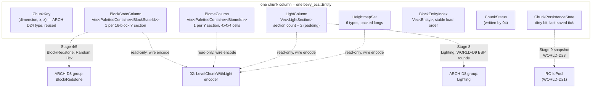
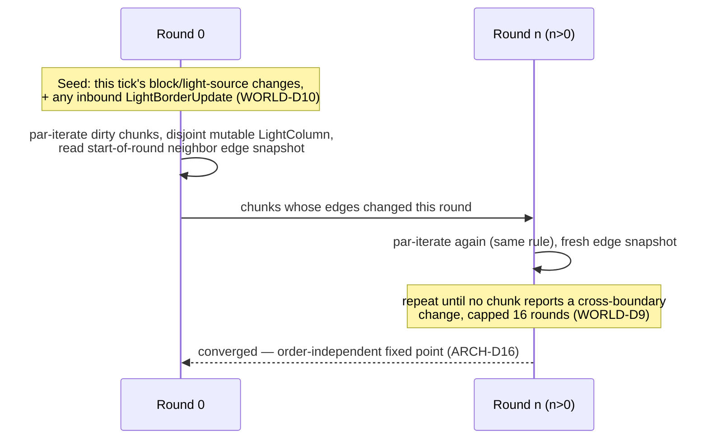
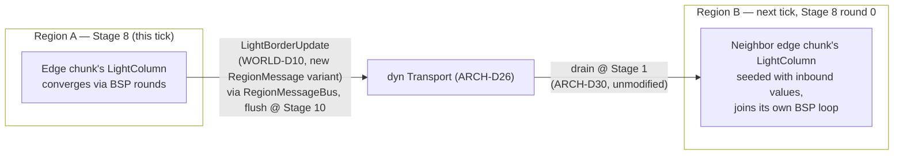
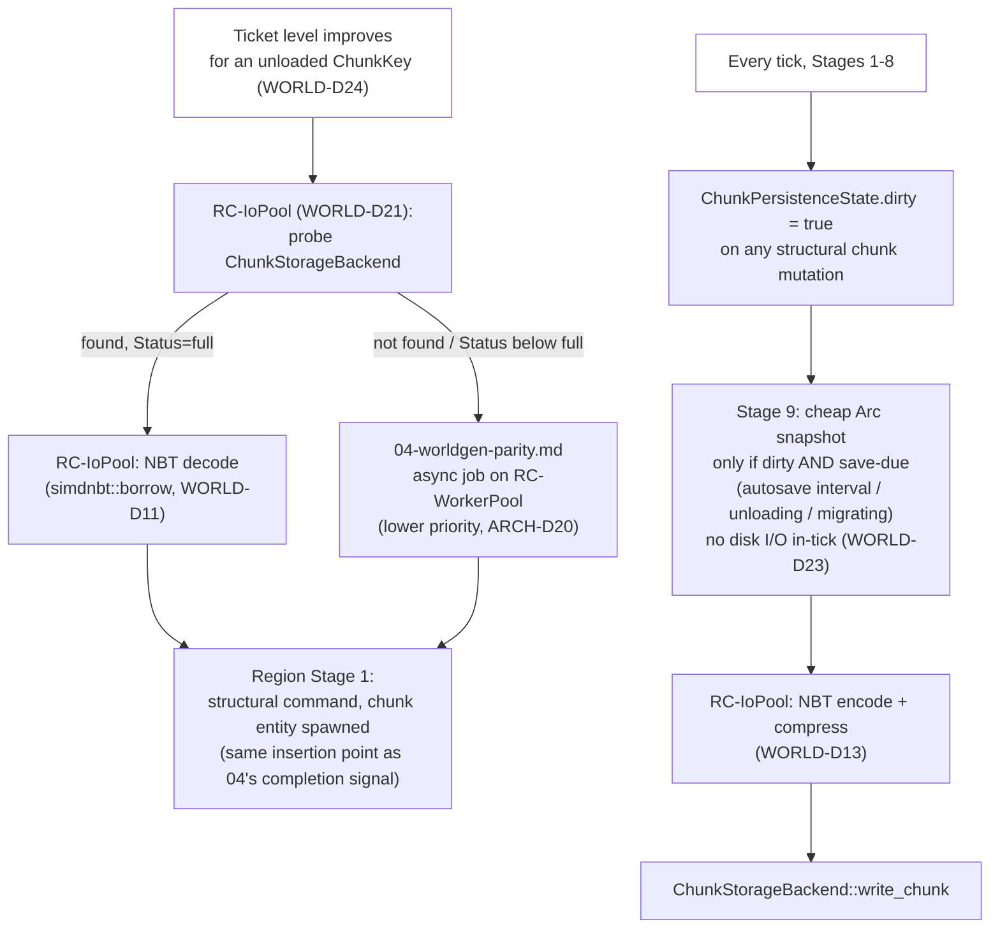
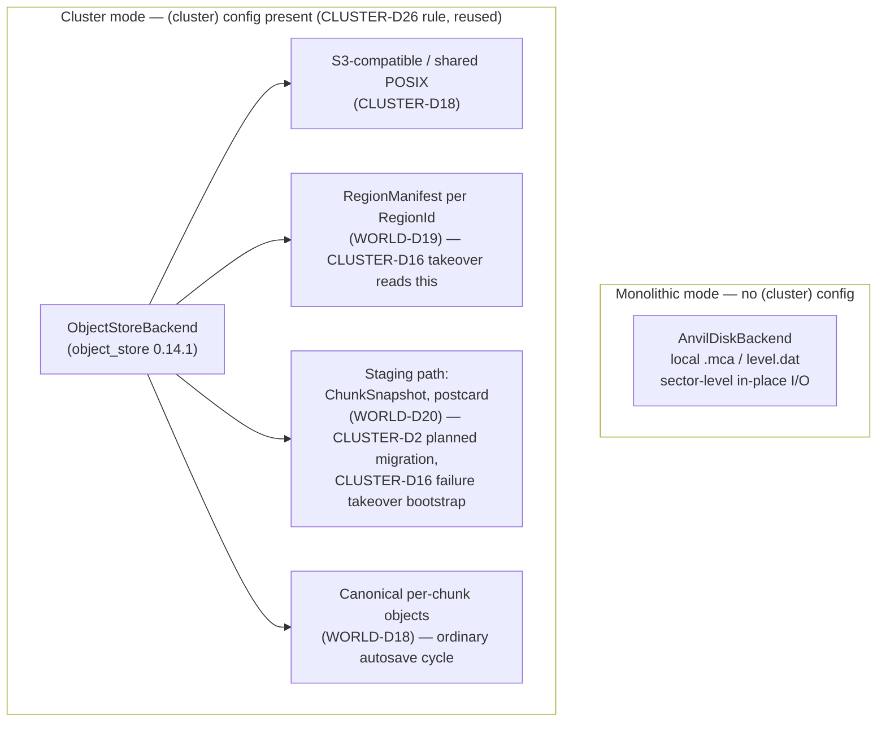

# World Chunks & Persistence

## Purpose

Defines the in-memory representation of chunks and everything inside them (sections, paletted block/biome storage, heightmaps, block entities), the light engine, and on-disk persistence (NBT, Anvil region files, level.dat, entity/POI storage, chunk lifecycle and the ticket system that drives it). This is the single source of truth for how a chunk exists in RAM, how it becomes bytes on disk (or in shared cluster storage), and how it moves between the two — and, at region/node boundaries, how neighboring chunks stay lit and loaded across the message-passing substrate `01-server-architecture.md` provides.

Terminology note, because two unrelated things in this project are both called "16×16": a **chunk section** (this document) is a 16×16×16 cube of blocks, the vertical sub-division of a chunk column. A **grid cell** (`01-server-architecture.md`, ARCH-D6) is a 16×16 *chunk* area (256×256 blocks) used purely for region-partitioning. They never appear together in the same sentence without this note being implied.

## Scope

**In scope:** chunk-column in-memory representation and its decomposition into `bevy_ecs` components (satisfying the storage-class choice `01` deferred to this document); the generic paletted-container bit-packing structure for block state and biome storage; the code-generated block-state and biome registries sourced from Mojang's data generator; heightmaps; block-entity storage; the light engine algorithm, its data structures, and how it is scheduled inside the ARCH-D8 domain-parallel model, including light propagation across region (and cluster node) boundaries; the NBT crate and its zero-copy/write requirements; the Anvil `.mca` region-file format (byte-exact), `level.dat`, entity and POI region files, and DataVersion policy; the chunk lifecycle (vanilla ticket/level system, async load/generate/save pipeline, unload policy, memory budget); chunk/region serialization for cluster partition migration and hand-off; persistence ownership and storage-backend abstraction for cluster mode; world border, spawn, and force-loaded chunk persistence.

**Out of scope:** world generation algorithms and noise pipelines (`04-worldgen-parity.md` — this document only defines the container `04` populates and the `ChunkStatus` field `04` writes into); concrete block/entity behavior and game rules, including block-entity business logic and the `/forceload` command surface (`05-game-mechanics.md` — this document owns storage and the ticket primitive, not gameplay semantics); wire encoding of chunks into protocol packets (`02-protocol-networking.md` — this document owns the in-memory representation `02` serializes from, not the packet bytes themselves); cluster node coordination, `RegionId -> NodeId` assignment, and the rebalancer (`13-cluster-architecture.md` — this document owns the storage-backend abstraction and snapshot format `13`'s migration/takeover paths call into, not the decision of *when* or *to which node* a region moves).

## Decisions

| ID | Decision | Rationale |
|---|---|---|
| WORLD-D1 | **Chunk representation: one `bevy_ecs::Entity` per loaded chunk column**, tagged with a `ChunkKey` component (`01`'s ARCH-D24 type, reused unmodified), and decomposed into independent components chosen exactly along ARCH-D8's domain-group boundaries: `BlockStateColumn`, `BiomeColumn`, `LightColumn`, `HeightmapSet`, `BlockEntityIndex`, `ChunkStatus`, `ChunkPersistenceState`. No single monolithic "chunk data" component exists. | This is the concrete realization of `01`'s deferred "storage-class choice... is `03`'s call": splitting chunk data into per-domain components is what lets the Block/Redstone, Lighting, and Chunk-Serialization ARCH-D8 groups hold genuinely disjoint `Access<ComponentId>` sets against the *same chunk entity* simultaneously — the literal mechanism behind the project's headline claim that multiple threads can work one chunk at once. |
| WORLD-D2 | **Generic bit-packed paletted container**, `PalettedContainer<T: RegistryId>`, reused unmodified for both block-state and biome storage and shared byte-for-byte with `02-protocol-networking.md`'s wire encoding (one Rust type, two consumers: disk and wire). Three palette states — `SingleValue(T)`, `Indirect { entries: Vec<T>, bits_per_entry }`, `Direct { bits_per_entry }` (full registry ID, no local table) — with non-spanning bit packing: an entry that does not fully fit in the current `u64` starts at bit 0 of the next `u64` rather than straddling the boundary, matching vanilla's own packing exactly (verified against minecraft.wiki's Chunk format page, 2026-08-20). Blocks: minimum 4 bits/entry, indirect while bits-per-entry ∈ [4,8], direct above 8. Biomes: no minimum, indirect while bits-per-entry ∈ [1,3], direct above 3. | Byte-identical packing to vanilla is required for two independent reasons at once: `02` needs it to produce wire-correct `Level Chunk with Light` packets, and this document needs it to produce Anvil-compatible `.mca` chunk data — sharing one struct means those two obligations can never drift apart. Exact crossover bit-widths should be re-confirmed against a live packet capture during the blueprint phase per this project's standing verification discipline (mirrors `01`'s own flagged-for-reverification items). |
| WORLD-D3 | **Block-state registry is code-generated**, extending `02-protocol-networking.md`'s NET-D9 `xtask codegen` step (no new fetch, no new command) to additionally emit `crates/world/generated/<data-version>/block_states.rs` from the same already-fetched `--reports` `blocks.json`, which enumerates every valid block-state combination with Mojang's own global numeric ID. Generated output is a dense `BlockStateId(u32)` newtype whose values match Mojang's IDs exactly, plus per-block property enums and pack/unpack functions. Keyed by **DataVersion** (4903 for the pinned target, WORLD-D16), not protocol version, since save-format registries are a distinct versioning axis from wire protocol version even though both bump together on a full release. | Reusing Mojang's own global IDs verbatim (rather than inventing our own numbering) is what makes both `PalettedContainer<BlockStateId>`'s `Direct` mode and Anvil on-disk `data` arrays bit-compatible with vanilla with zero translation layer; generating from `--reports` keeps this consistent with the same allowed-source policy (ASSET-D18) as NET-D9's own packet-ID generation. |
| WORLD-D4 | **Biome registry is code-generated** the same way as WORLD-D3, from `--reports`' registries JSON, emitting `BiomeId(u16)` and `crates/world/generated/<data-version>/biomes.rs`. Biome storage per chunk section is a `PalettedContainer<BiomeId>` over 64 entries (4×4×4 cells), independent of the block-state container's palette/bit-width state. | Same registry-fidelity argument as WORLD-D3, applied to the other paletted-container instantiation; keeping it a fully separate `PalettedContainer<BiomeId>` (not folded into block storage) matches vanilla's own independent biome/block section layout and keeps Stage 4/5 block writes from ever touching biome data (worldgen-only churn). |
| WORLD-D5 | **Heightmaps**: the six vanilla types — `WORLD_SURFACE`, `WORLD_SURFACE_WG`, `OCEAN_FLOOR`, `OCEAN_FLOOR_WG`, `MOTION_BLOCKING`, `MOTION_BLOCKING_NO_LEAVES` — each a 256-entry (16×16) array packed at `bits = ceil(log2(world_height + 1))` bits/entry (vanilla's own `Heightmap` constructor: `Mth.ceillog2(chunk.getHeight() + 1)`) using the **same non-spanning packing** as WORLD-D2 (not WORLD-D2's `PalettedContainer` itself — a heightmap has no palette, just raw packed integers). At the current world height (-64..320, 384 blocks), this is 9 bits/entry, 7 entries/`u64`, 37 `u64`s per heightmap (verified against minecraft.wiki: 256 values, 9 bits, 37 Longs, 1 bit unused per long). Stored in `HeightmapSet`, updated incrementally via a `HeightmapSet::note_block_change(x, y, z, old, new)` hook called by whatever system performs a block write (owned by `05-game-mechanics.md`). | Reusing the packing primitive (not the full palette machinery, which heightmaps don't need) avoids a second bit-packing implementation; exposing the update as a hook rather than owning the block-write path itself keeps this document's boundary at storage, not block-write semantics, which `05` owns. |
| WORLD-D6 | **Block entities are NOT decomposed into per-block ECS entities for the raw 98,304-cell chunk volume.** Each *placed* block entity (furnace, chest, etc.) is one child `bevy_ecs::Entity` tagged `BlockPos` + `ChunkKey`, referenced from its owning chunk's `BlockEntityIndex: Vec<Entity>` in vanilla's own stable per-chunk load order (required by `01`'s ARCH-D17). This document's persistence contract is generic: `BlockEntityRecord { pos: BlockPos, id: ResourceLocation, data: simdnbt::owned::NbtCompound }`. A `BlockEntityCodec` trait (`fn to_record(&self) -> BlockEntityRecord`, `fn from_record(&BlockEntityRecord) -> Self`), implemented per concrete block-entity type, is the extension point `05-game-mechanics.md` fills in; this document never interprets a block entity's field semantics. | Keeping the *storage* contract generic-NBT-in/generic-NBT-out means this document is fully specified without needing `05` (unwritten) to exist first, while still giving `05` a single, uniform place to plug in every block-entity type's actual (de)serialization. |
| WORLD-D7 | **Light engine algorithm: a single, source-agnostic BFS propagator that pushes light values outward to neighbors** (computing each of the 6 cardinal neighbors' target level from the position being processed and only enqueueing a neighbor when its value must change) — this is a direct, structural match to the pinned reference's own current light engine (`LightEngine`/`BlockLightEngine`'s increase-phase propagation), not a deviation from or improvement over it; the older pull-based-from-neighbors design this push shape is sometimes contrasted against was vanilla's pre-1.14 legacy light engine, already superseded in every version this project could target. Concept-only reference to Starlight's publicly documented technical design (`PaperMC/Starlight`, `TECHNICAL_DETAILS.md`) — no Starlight or Minecraft source code consulted or copied, identical treatment to `01`'s ARCH-D5 handling of Folia. Skylight and blocklight share one propagator implementation; skylight's sources are precomputed externally (via `HeightmapSet::WORLD_SURFACE` plus a per-section "guaranteed opacity 0" bitset) and fed in, rather than the propagator special-casing sky light internally. | The push model and source-agnostic propagator are Starlight's two central, independently-verified wins (measured 6-7× fewer block/light reads in the public writeup) — adopting the *algorithm shape*, not any code, is exactly the kind of architecture-lesson reuse `10-prior-art.md` already establishes as the project's standing policy for Paper-ecosystem projects. |
| WORLD-D8 | **Light data structure**: `LightColumn { sections: Vec<LightSection> }` where `LightSection { sky: Option<Box<[u8; 2048]>>, block: Option<Box<[u8; 2048]>> }` (nibble-packed, `None` = vanilla's "not yet initialized" shortcut). `LightColumn`'s section count is the chunk's block-section count **+2** (one padding section below the lowest real section, one above the highest), matching vanilla's own light-data allocation optimization (light data initialized only within one section of a non-empty section). `LightColumn` is a component fully disjoint from `BlockStateColumn`, per WORLD-D1. | The +2 padding range is what lets skylight propagate correctly above the world's topmost generated section and below the lowest one without special-casing chunk-column edges in the propagator itself; disjointness from block data is what lets Stage 8 (Lighting) and Stage 4/5 (Block/Redstone, Random Tick) hold non-conflicting `Access<ComponentId>` sets on the same chunk entity per ARCH-D8. |
| WORLD-D9 | **Stage 8 threading**: NOT literally independent per-chunk BFS runs (light routinely crosses chunk boundaries). Instead, a **bulk-synchronous-parallel (BSP)** scheme within the single Stage-8 slot: each round, every touched chunk in the region advances its local BFS frontier in parallel (par-iteration over disjoint `LightColumn` components — no locks, no atomics), reading a snapshot of each neighbor chunk's edge nibbles captured at the start of that round (an **intra-region ghost margin**, structurally the same idea as ARCH-D11's inter-region halo but refreshed every round instead of every tick). Rounds repeat until no chunk reports a cross-boundary change, capped at 16 rounds/tick (one per light level, plus margin); any residual convergence work carries into next tick's Stage 8 rather than exceeding the tick budget. | This is what makes ARCH-D16's "chunk-parallel, order-independent BFS fixed point" claim mechanically true without a lock or an atomic anywhere in the hot path: each round's writes are strictly confined to the writing chunk's own component, and reads are confined to an immutable per-round snapshot, so `bevy_ecs`'s ordinary disjoint-entity parallel iteration is sufficient — no custom concurrency primitive is needed. The 16-round cap is a documented, bounded parity exception in the same spirit as `01`'s ARCH-D14: it only ever affects how many ticks a very large light change (e.g. a big explosion) takes to fully settle, never the converged value itself. |
| WORLD-D10 | **Cross-region light propagation** extends `01`'s ARCH-D11 mechanism with a new `RegionMessage` variant, `LightBorderUpdate { chunk_key: ChunkKey, edge_face: Direction, sky: [u8; N], block: [u8; N] }`, sent from a region's Stage 8 once its own BSP rounds converge and an edge chunk's light changed since the last send, applied at the destination region's *next* tick as an additional seed input to round 0 of its own Stage-8 BSP loop (not at Stage 4, unlike `BorderUpdateEvent`). Drained at the destination's Stage 1 exactly as `01`'s ARCH-D30 already specifies for any `RegionMessage` (drain-once-at-Stage-1, consume-read-only-through-Stage-N) — no change to the drain/consume mechanism itself. | `01` explicitly scoped `RegionMessage`'s two native variants to block/redstone and entity transfer and left the enum open for exactly this kind of domain-specific addition (ARCH-D25's stated extension point); reusing ARCH-D30's existing drain-then-consume-later semantics means this needs zero new substrate machinery, only a new payload type and a Stage-8 (not Stage-4) consumer. |
| WORLD-D11 | **NBT crate: `simdnbt` 0.10.0** (crates.io, published 2026-03-28), the same crate `02-protocol-networking.md`'s NET-D5 already pins for wire-level NBT (chat components) — one NBT implementation for the whole engine. Zero-copy `simdnbt::borrow` types are used for read paths (Anvil chunk load, hot path relative to the async I/O pool); `simdnbt::owned` types (confirmed to support full write/serialization, not read-only) are used for write paths (Anvil chunk save, `level.dat`). Chunk-column NBT (de)serialization is **hand-written conversion code** against `simdnbt`'s tree types (`ChunkColumn::to_nbt`/`from_nbt`), not a `#[derive(Serialize)]`-through-`simdnbt` mapping. | `simdnbt` is a general-purpose, MC-protocol-agnostic NBT library exactly like NET-D5 already characterizes it, so depending on it here creates no coupling to `02`'s protocol code — only a shared low-level format library, same relationship NET-D5 itself describes. Hand-written conversion (not a derive macro) is required because vanilla's chunk NBT schema (tag names, nesting, compound-vs-list shape) does not match idiomatic Rust struct-field layout closely enough for a derive to reproduce byte-exact vanilla schema without extensive per-field attributes that would be more fragile than direct conversion code. |
| WORLD-D12 | **Anvil `.mca` region-file reader/writer is hand-rolled in-repo** (`rc-anvil` crate), not a dependency on the existing `mca` crate (`VilleOlof/mca`, crates.io 2.1.2, published 2026-03-14 — verified as the current, actively developed Rust Anvil-format crate; cited here as prior-art validation of the format understanding below, not taken as a dependency). Exact byte layout (verified against minecraft.wiki's Region file format page, 2026-08-20): 8 KiB header = two 4 KiB tables, each 1024 big-endian 4-byte entries indexed by `x + 32z` (chunk-in-region-relative coordinates 0-31); table 1 = location (3-byte sector offset + 1-byte sector count, sectors are 4096 bytes, sectors 0-1 reserved for the header itself); table 2 = last-modified Unix timestamps. Per-chunk payload: 4-byte big-endian length (compressed-data length + 1, excludes any trailing zero-padding to the next 4096-byte sector boundary), 1-byte compression-type tag (`1`=GZip/unused, `2`=Zlib, `3`=uncompressed, `4`=LZ4, `127`=custom with a length-prefixed namespaced-string tag following), then the compressed payload; a compression byte with its `0x80` bit set means the chunk's data instead lives in an external `c.<x>.<z>.mcc` file (used when a chunk's compressed size exceeds 255 sectors, ~1 MiB). | Hand-rolling is required, not merely preferred, because `mca` (and every general Anvil crate surveyed) assumes direct `std::fs::File` access with no storage-backend abstraction and no async-pool integration — this document needs both (WORLD-D17's `ChunkStorageBackend` trait for cluster's shared-storage requirement, and WORLD-D20's dedicated I/O pool), which an external crate built around a bare local path cannot provide without being forked anyway. The Anvil format itself is small and extremely stable (essentially unchanged since 1.16 aside from the 1.20.5 LZ4 addition), making hand-rolling low-risk; `mca`'s existence and current activity is independent confirmation this understanding of the format is correct. |
| WORLD-D13 | **Compression: Zlib (`flate2` 1.1.9, `zlib-ng` backend — same crate NET-D5 already pins, version now fixed here) is the default** for chunk data written by this document, matching vanilla's own default (compression type `2`). LZ4 (`lz4_flex` 0.14.0, crates.io, published 2026-07-14, pure-Rust, no `unsafe` by default) is supported and operator-selectable (compression type `4`), matching vanilla's own `server.properties` `region-file-compression` option added in 1.20.5 — this is configurability parity, not a deviation. `level.dat` uses GZip (`flate2`, compression type `1`, vanilla's fixed choice for that one file — not configurable there either in vanilla). | Sharing `flate2` with `02` avoids a second general-purpose compression dependency; offering exactly vanilla's own two options (not inventing a third default) keeps written worlds tool-openable regardless of which the operator picks, since both are already vanilla-legal on-disk compression types. |
| WORLD-D14 | **World save folder layout: every dimension lives under `<world>/dimensions/<namespace>/<path>/`, with no Overworld special case** — the pinned target `NET-D1` version, Java Edition 26.2, already ships this layout: `DimensionType.getStorageFolder(ResourceKey<Level>, Path)` resolves every dimension's storage path as `baseFolder.resolve("dimensions").resolve(namespace, path)`, giving `<world>/dimensions/minecraft/overworld/`, `<world>/dimensions/minecraft/the_nether/`, `<world>/dimensions/minecraft/the_end/` uniformly, verified directly against the pinned reference's own decompiled `DimensionType`/`ChunkMap` source. Current (26.2) layout, per world save root: `level.dat` (+ `level.dat_new`/`level.dat_old` write-safety copies), `session.lock`, `icon.png`, `dimensions/minecraft/overworld/{region,entities,poi}/`, `dimensions/minecraft/the_nether/{region,entities,poi}/`, `dimensions/minecraft/the_end/{region,entities,poi}/` (and any custom dimension similarly under `dimensions/<namespace>/<path>/`), `playerdata/`, `stats/`, `advancements/`, `data/` (misc. persistent state — raids, random-tick sequences, forced chunks per WORLD-D28), `datapacks/`, `resourcepacks/`. **M2 shipped the legacy pre-restructure layout (`region/`/`DIM-1/`/`DIM1/` at the world root) instead; that is a known parity deviation, and its correction to this nested `dimensions/<namespace>/<path>/` scheme is scheduled in the M3.5 hardening milestone (PLAN-D9).** | Pinning to what the pinned reference's own decompiled source actually resolves (not an assumed pre-restructure layout inferred from wiki-documented timing that turned out to describe an unreleased snapshot) is the same discipline NET-D1/NET-D2 already apply to the protocol — the nested `dimensions/<namespace>/<path>/` scheme, with no Overworld special case, is what 26.2 itself writes and reads. |
| WORLD-D15 | **`level.dat`**: GZip-compressed NBT, root unnamed compound containing one `Data` compound. Fields this document owns the schema/storage of (not their runtime semantics, owned elsewhere): `DataVersion`, `LevelName`, `Time`, `LastPlayed`, spawn position/angle, difficulty settings, world-border state (`BorderCenterX/Z`, `BorderSize`, lerp target/time, safe-zone, damage-per-block, warning-blocks, warning-time — WORLD-D26), `WorldGenSettings` (opaque blob to this document, owned by `04`), `GameRules`. Read/written wholesale (the whole `Data` compound round-trips through one `simdnbt::owned` tree per load/save) — no partial/streaming access, since `level.dat` is tiny (single-digit KB to low tens of KB) and rewritten in full on every autosave cycle regardless. | Owning storage/schema without owning runtime semantics keeps this document's boundary clean against `04` (worldgen settings) and `05` (game rules, border enforcement) exactly as this document's Scope states; whole-file round-trip is the only sane strategy for a file this small and this infrequently written. |
| WORLD-D16 | **DataVersion policy: exact match required, no upgrade path in Phase 1.** The pinned target is DataVersion **4903** (Java Edition 26.2, verified against minecraft.wiki's Data version page, 2026-08-20 — matches `02`'s NET-D1 protocol-776 target exactly, as expected since both derive from the same release). A world (or an individual chunk/entity/POI record) whose `DataVersion` does not equal 4903 is **refused at load** with an explicit error directing the operator to open-and-resave the world in a vanilla or Paper server on the matching version first. No DataFixerUpper-equivalent incremental-migration system is built in Phase 1. New worlds and all newly-written records always stamp `DataVersion = 4903`. | Building Mojang's own multi-hundred-version incremental data-migration system from scratch is an enormous, perpetually-growing scope commitment orthogonal to this project's actual goals; refusing mismatched versions outright (rather than silently mis-reading them) is the same single-version-tracking discipline `02`'s NET-D2 already applies to the wire protocol, applied here to the save format — and it fails loud instead of corrupting a world. |
| WORLD-D17 | **`ChunkStorageBackend` trait**, one abstraction with two implementations selected by the same `[cluster]`-config-presence rule `13-cluster-architecture.md`'s CLUSTER-D26 already uses to pick `Transport` impls: `AnvilDiskBackend` (default, monolithic — genuine local-disk `.mca`/`level.dat` files per WORLD-D12, sector-level in-place I/O) and `ObjectStoreBackend` (cluster mode — built on the `object_store` crate 0.14.1, crates.io, published 2026-07-15, Apache Arrow's maintained generic blob-store abstraction covering S3-compatible object stores, and local/shared-POSIX paths via its `LocalFileSystem` backend). The trait is synchronous (`fn read_chunk(..) -> Result<Option<Vec<u8>>, StorageError>`, `fn write_chunk(..) -> Result<(), StorageError>`, parameterized by `RegionFileKind::{Terrain, Entities, Poi}` and an optional epoch-fencing token), called only from WORLD-D20's dedicated I/O pool — never `async`, never called from RC-WorkerPool or the Tokio runtime. | This single crate covers *both* of CLUSTER-D18's required shared-backend shapes (S3-compatible and shared-POSIX) with one dependency and one trait implementation, rather than needing a hand-rolled S3 client; keeping the trait synchronous matches the "dedicated blocking pool, not async" shape of WORLD-D20 and avoids pulling `object_store`'s own async runtime requirements into the tick-adjacent path. |
| WORLD-D18 | **Cluster shared storage does NOT store literal `.mca` files.** Object stores have no efficient partial/in-place-overwrite primitive, which Anvil's sector-reuse model depends on — forcing Anvil's container shape onto blob storage would mean a full region-file read-modify-write (up to ~1 GiB worst case for a full 32×32 region) on every save. Instead, `ObjectStoreBackend` uses **one object per `(ChunkKey, RegionFileKind)`**, e.g. `world/<dim>/chunks/<x>/<z>/terrain.nbt.zz`, each independently written with `object_store`'s conditional-put support (where the backend provides it) carrying CLUSTER-D19's epoch-fencing token — a natural fit for S3-style conditional-write semantics at object granularity. **The NBT payload inside each object is byte-identical to what a vanilla Anvil chunk tag would contain** — only the container/framing differs from WORLD-D12, never the game-data schema, so "exact save-format compatibility" (WORLD-D16) holds at the level that actually matters for interop and inspection. | Object-per-chunk gives independent, parallelizable, conditionally-fenced writes for free from the storage backend itself, exactly matching CLUSTER-D19's single-writer/epoch-fencing requirement without this document inventing its own conflict-resolution layer; keeping the *schema* identical to Anvil's means a cluster-mode chunk can always be losslessly repackaged into a real `.mca` file for inspection or migration to monolithic mode. |
| WORLD-D19 | **Region manifest** — `RegionManifest { region_id, epoch, last_saved_tick, chunk_object_versions: HashMap<ChunkKey, ObjectVersion> }`, one `postcard`-encoded object per region at a well-known key (`world/<dim>/manifests/<region_id>.postcard`), rewritten (conditionally, epoch-fenced) at the end of every save cycle that touches that region. This is the **dirty-region tracking mechanism** `13-cluster-architecture.md`'s CLUSTER-D16 takeover path reads on load: a newly-assigned node fetches the manifest for its newly-owned `RegionId`, then fetches exactly the chunk objects the manifest lists (no directory-listing scan of the object store required). | Directly fulfills the "exact dirty-region tracking mechanism the takeover path reads from on load" item `13` flagged as needed from this document; keying by object *version* (not a separate dirty bit) means the manifest is also directly useful as a change-detection cache, avoiding a second bookkeeping structure. |
| WORLD-D20 | **Fast migration/hand-off snapshot format: `postcard` 1.1.3** (reusing `13`'s CLUSTER-D12 pin, zero new dependency), applied to a `#[derive(Serialize, Deserialize)] ChunkSnapshot` — the same in-memory types as WORLD-D1's components (`BlockStateColumn`, `BiomeColumn`, `LightColumn`, `HeightmapSet`, `BlockEntityIndex`'s resolved records), prefixed with a `format_version: u16` (`RC_CHUNK_SNAPSHOT_VERSION`, this engine's own internal compatibility counter, independent of Mojang's `DataVersion`). This is what CLUSTER-D2's "full ECS-`World`-slice serialize" step for planned rebalancing, and CLUSTER-D16's takeover bootstrap, actually write to/read from a **transient staging path** on the `ObjectStoreBackend` (`world/<dim>/staging/<region_id>-<epoch>.postcard`), separate from WORLD-D18's long-term per-chunk canonical objects — the destination node ticks directly from the decoded snapshot and lets its own next ordinary dirty-triggered save cycle (re-)populate the canonical per-chunk objects in due course, rather than round-tripping through NBT on the migration hot path. | `13` already decided planned migration reuses the shared-storage-flush-then-remote-bootstrap path (CLUSTER-D2's own rationale text), not a live peer-to-peer stream — this decision supplies the concrete, versioned wire format for exactly that flush/bootstrap step, reusing `postcard` for the same reason CLUSTER-D12 picked it (compact, zero extra derive burden, no NBT tag-tree overhead) rather than paying full NBT-encode cost on a path that is explicitly latency-budgeted. |
| WORLD-D21 | **A third dedicated thread pool, `RC-IoPool`**, distinct from `01`'s `RC-WorkerPool` (ARCH-D18, CPU-bound simulation work) and the Tokio network runtime (ARCH-D21, async network I/O). Built from the same primitive building blocks as `RC-WorkerPool` (`crossbeam-channel` 0.5.16, already pinned by ARCH-D18/D22) but **fixed-size, not elastic, and a plain bounded MPMC queue, not work-stealing** — a small pool sized `clamp(available_parallelism()/4, 2, 8)` (mirroring ARCH-D21's own sizing formula for consistency). All `ChunkStorageBackend` calls, all NBT encode/decode, and all compression/decompression for chunk persistence run here, never on `RC-WorkerPool` and never on the Tokio runtime. | Blocking disk/object-store I/O is a third workload class distinct from both existing pools' design assumptions: it doesn't benefit from CPU-based work-stealing heuristics (a queue depth backlog on a blocking-I/O pool reflects disk/network latency, not stealable CPU work) and must not share a runtime with either CPU-bound tick simulation (would stall ticks) or network I/O (would stall client responsiveness under a save/load burst) — the same isolation argument ARCH-D21 already makes for keeping network I/O off `RC-WorkerPool`, applied to a third, genuinely different resource. |
| WORLD-D22 | **Load pipeline routing**: a `ChunkKey` needing load is dispatched to `RC-IoPool` to probe storage; if found with `Status = minecraft:full` (or this engine's completed-generation equivalent), it deserializes on `RC-IoPool` and is handed off as a Stage-1 structural command into the owning region's `World` — reusing exactly the insertion point `01` already defined for `04`'s worldgen completion signal (`01`'s Interfaces: "a completed chunk is delivered as an ordinary structural command consumed at a region's Stage 1"). If not found, or found below the required generation status, the (possibly partial) on-disk data is instead handed to `04-worldgen-parity.md`'s async pipeline on `RC-WorkerPool` (lower-than-tick priority, per `01`'s ARCH-D20) to complete generation, which produces the same Stage-1 structural-command shape on completion. | One insertion point for both "loaded from disk" and "freshly generated" chunks means Stage 1 never needs to distinguish the two cases — from the region's perspective a chunk simply becomes ready. Routing the below-`full`-status case to `04` (not handling partial-generation resumption in this document) keeps worldgen algorithm ownership entirely inside `04`, per this document's Scope. |
| WORLD-D23 | **Save pipeline**: Stage 9 ("Chunk lifecycle & serialization snapshot," per `01`'s fixed 11-stage pipeline) takes a **cheap, in-memory, `Arc`-shareable snapshot** — never NBT-encodes or touches disk — of exactly the chunks that are dirty (`ChunkPersistenceState.dirty`) **and** currently need saving (autosave interval elapsed, unloading this tick, or a cluster migration/takeover in flight), matching `01`'s own stated Stage-9 contract ("Snapshot only; no disk I/O inside the tick budget"). The actual NBT-encode-then-compress-then-write happens asynchronously afterward on `RC-IoPool`. Default autosave interval: 6000 ticks / 5 minutes, matching vanilla's own default, **operator-configurable**; `13-cluster-architecture.md`'s CLUSTER-D17 override (recommended ≤30 s per dirty region in cluster mode) uses this same knob. | Snapshotting only dirty, save-due chunks (not every loaded chunk every tick) is what keeps Stage 9 cheap enough to fit inside a 50 ms tick at all — reserializing every loaded chunk every tick would be enormously wasteful given vanilla's own 5-minute save cadence; exposing one interval knob that both monolithic defaults and `13`'s tighter cluster recommendation share avoids a second, parallel configuration surface. |
| WORLD-D24 | **Chunk ticket/level system**, reimplemented to match vanilla's own semantics (verified against the pinned reference's decompiled source): each ticket carries a source level in `[0, 31]`; level "flood-fills" outward from the ticket's source chunk, incrementing by 1 per chunk step, capped at level 44 (levels beyond 33 are pure removal-hysteresis bookkeeping — see WORLD-D25 — not "loaded" in any sense). Resulting per-chunk load state, by the **minimum** level across all tickets touching that chunk, named per the pinned reference's own `FullChunkStatus` enum (`INACCESSIBLE, FULL, BLOCK_TICKING, ENTITY_TICKING` — not the pre-1.18-era wiki names "BORDER"/"TICKING"): `≤31` = `ENTITY_TICKING` (all game aspects active), `32` = `BLOCK_TICKING` (redstone/scheduled ticks run, entities do not), `33` = `FULL` (block/entity data present and accessible, nothing ticks), `≥34` = `INACCESSIBLE` (not loaded; world generation may still touch these). Ticket kinds this document defines: **two distinct player-driven mechanisms**, not one — `PlayerSimulation` (level `max(0, 31 - simulationDistance)`, a single ticket placed at the player's own chunk that flood-fills outward the same way every other ticket kind does — vanilla server default simulation distance 10, operator-configurable) and `PlayerLoading` (a separately-radiused mechanism, vanilla's own `PlayerTicketTracker`, maintaining its own ticket(s) around each player independent of the simulation-distance ticket above; exact radius/level parameters need blueprint-phase reconfirmation) — plus `ForceLoad` (level 31, permanent, WORLD-D28), `Portal` (level `ChunkLevel.byStatus(FullChunkStatus.FULL) − radius` = `33 − 3` = **30**, not 31, short 300-tick/15s TTL, added around a teleport destination), and `Mod` (engine-level API for isomorphic mods, exact surface deferred to the modding-API doc). | Reimplementing vanilla's own level semantics (not inventing a simplified scheme) is required for both mechanical parity (view-distance/simulation-distance behavior players already know) and correctness of `01`'s ARCH-D6 region-hotness signal, which depends on knowing which chunks are actually ticking; the level-44 hysteresis range is adopted as-is (WORLD-D25) rather than replaced with a custom grace period, since it is already vanilla's own validated anti-thrash mechanism; keeping the two player-ticket mechanisms distinct (rather than collapsing them into one) is required because the pinned reference itself never merges them. |
| WORLD-D25 | **Unload policy**: a chunk unloads once its minimum ticket level has been `> 33` for a full tick (vanilla's own level-44 flood-fill bookkeeping already provides this as a natural decay rather than an instant cliff — no additional custom hysteresis is layered on top, preserving parity). On unload, if dirty, a save is scheduled (WORLD-D23) before the chunk entity is despawned at the next sync point; the despawn never blocks on the save's completion (fire-and-forget onto `RC-IoPool`, with a startup/shutdown-time barrier that waits out all in-flight `RC-IoPool` saves before final `level.dat` write). | Reusing vanilla's own decay mechanism rather than inventing a longer grace period keeps chunk-loading *feel* (how quickly a chunk disappears behind a departing player) identical to vanilla, which the project's parity goal requires; never blocking a despawn on save completion keeps I/O latency from ever leaking into tick timing, consistent with `01`'s "no disk I/O inside the tick budget" rule. |
| WORLD-D26 | **Memory budget**: `chunk_memory_budget_mib`, operator-configurable (soft pressure signal only), tracked via an atomic byte counter updated on chunk load/unload and on any `PalettedContainer` bit-width resize. Exceeding the budget **never** evicts a chunk that still holds an active ticket (level ≤ 33) — it only accelerates WORLD-D25's already-in-progress decay for chunks whose minimum ticket level is already `>33`, skipping straight to eviction instead of waiting out the remainder of vanilla's own hysteresis window. | This is a deliberate operational improvement over vanilla (which has no comparable safety valve) that cannot cost any parity: because it only ever fast-forwards chunks vanilla's own rule would have unloaded anyway, no player-visible loaded/unloaded state ever differs from what vanilla ticket semantics alone would produce. |
| WORLD-D27 | **World border**: this document owns storage only — `level.dat`'s border fields (WORLD-D15) round-trip losslessly; runtime enforcement (damage, movement clamp, visual rendering triggers) is `05-game-mechanics.md`'s responsibility, flagged as an interface item since `05` does not yet exist. | Matches this document's stated Scope boundary (storage vs. game rules) exactly; nothing about border *behavior* can be decided here without `05`. |
| WORLD-D28 | **Spawn chunks: not implemented.** Verified against minecraft.wiki (2026-08-20): automatic keep-spawn-loaded behavior (and its `keepSpawnLoaded`-family gamerule) was **removed in Java Edition 1.21.9** (snapshot 25w31a), long before the pinned NET-D1 target (26.2); the game now relies on `/forceload` (or portal-triggered transient loading) for anything a server operator wants kept resident. This document therefore stores `SpawnX`/`SpawnY`/`SpawnZ`/`SpawnAngle` in `level.dat` purely as the default player-join/respawn position — it grants no ticket and loads no chunk by itself. **Force-loaded chunks**: a `ForceLoad` ticket (WORLD-D24, level 31) per forced chunk, persisted through vanilla's own generic **`TicketStorage`** mechanism — a `SavedData` registered under `SavedDataType<TicketStorage>` with identifier `chunk_tickets` (`world/level/TicketStorage.java`), whose codec serializes **every ticket whose `TicketType` carries the `FLAG_PERSIST` bit** (not `ForceLoad` alone) — re-registered as tickets at world/dimension load. This replaces the older `data/forcedchunks.dat` long-array format (`Forced` NBT tag of packed chunk positions, `(x << 32) | (z & 0xffffffff)`), which some vanilla-derived server implementations (e.g. Forge's `ForcedChunksSaveData`) still use for backward compatibility but which the pinned reference itself no longer writes. The `/forceload` command surface itself is `05-game-mechanics.md`'s to implement against this ticket-registration API. | Implementing a mechanic vanilla itself deleted five major releases before this project's pinned target would be a parity *regression* (behavior the real game no longer has), not an improvement — this is exactly the "verify current state, don't rely on stale defaults" discipline the project requires; persisting through the pinned reference's own generic `TicketStorage`/`chunk_tickets` `SavedData`, rather than the superseded per-file format, keeps every `FLAG_PERSIST` ticket kind (not force-load alone) correctly durable. |
| WORLD-D29 | **Entities and POI files share WORLD-D12's Anvil container mechanics entirely**, differing only in NBT schema and folder (`RegionFileKind::Entities` → `entities/r.<X>.<Z>.mca`, root compound `{ DataVersion, Position: [x,z], Entities: [<entity compound>...] }`; `RegionFileKind::Poi` → `poi/r.<X>.<Z>.mca`, root keyed by stringified section Y containing `Records: [{ pos: [x,y,z], type, free_tickets }...]`). Entity NBT (de)serialization at the individual-entity level is the same generic-record contract as WORLD-D6's block entities (`EntityRecord { id, data: NbtCompound }`, typed codec extension point owned by `05`); this document owns only the container/section framing. POI record contents are opaque data this document round-trips without interpretation (`05`'s villager-AI concern). | One `RegionFileKind` parameterization over one Anvil implementation (WORLD-D12) covers all three on-disk region kinds with zero duplicated sector/compression logic — exactly the kind of format-vs-schema separation WORLD-D18 already applies for the cluster storage case. |

## Chunk Representation



Every component in the diagram above is independently addressable by `bevy_ecs`'s `Access<ComponentId>` machinery, so a Block/Redstone system's declared `Query<&mut BlockStateColumn>` and a Lighting system's declared `Query<&mut LightColumn>` never conflict on the same chunk entity — this is the concrete mechanism behind `01`'s domain-parallelism claim, applied specifically to chunk storage (WORLD-D1).

`PalettedContainer<T>` (WORLD-D2) is illustrated for both consumers it serves:

```rust
pub enum Palette<T> {
    SingleValue(T),
    Indirect { entries: Vec<T>, bits_per_entry: u8 },
    Direct { bits_per_entry: u16 }, // T::REGISTRY.bits_for(len), no local table
}

pub struct PalettedContainer<T: RegistryId> {
    palette: Palette<T>,
    data: Box<[u64]>,       // non-spanning packing (WORLD-D2)
    entry_count: u16,       // 4096 (blocks) or 64 (biomes)
}
```

Block-state and biome registries (WORLD-D3/D4) are generated Rust, not hand-authored:

```rust
// crates/world/generated/4903/block_states.rs (xtask codegen output, extends NET-D9)
#[derive(Clone, Copy, PartialEq, Eq, Hash)]
pub struct BlockStateId(pub u32); // == Mojang's own --reports global state ID, verbatim

// crates/world/generated/4903/biomes.rs
#[derive(Clone, Copy, PartialEq, Eq, Hash)]
pub struct BiomeId(pub u16);
```

## Light Engine

The propagator (WORLD-D7) is a single push-model BFS shared by skylight and blocklight; the data it operates on (WORLD-D8) is the disjoint `LightColumn` component. Threading within Stage 8 (WORLD-D9) is bulk-synchronous-parallel, not free-running per-chunk BFS, precisely because light routinely crosses chunk boundaries within a region:



Cross-*region* propagation (WORLD-D10) is deliberately coarser than the intra-region BSP loop: it costs exactly one tick per border crossing, the same cost model `01`'s ARCH-D11 already established for block/redstone, via the new `LightBorderUpdate` `RegionMessage` variant:



Across a **cluster node** boundary, this is unmodified: `13-cluster-architecture.md`'s CLUSTER-D6 already establishes that ARCH-D11-style border traffic travels unchanged over `NetworkTransport` instead of `InProcessTransport` — `LightBorderUpdate` inherits that transparently since it is an ordinary `RegionMessage` variant, requiring no cluster-specific handling in this document.

## NBT

`simdnbt` 0.10.0 (WORLD-D11) is used in both its `borrow` (zero-copy read) and `owned` (write) forms. Chunk-column conversion is hand-written, not derive-based, to guarantee byte-exact vanilla schema:

```rust
impl ChunkColumn {
    pub fn to_nbt(&self) -> simdnbt::owned::NbtCompound { /* xPos, zPos, yPos, sections, ... */ }
    pub fn from_nbt(tag: simdnbt::borrow::NbtCompound<'_>) -> Result<Self, ChunkNbtError> { /* zero-copy read */ }
}
```

## Anvil Persistence

Byte layout (WORLD-D12), compression (WORLD-D13), folder layout (WORLD-D14), `level.dat` (WORLD-D15), and entity/POI files (WORLD-D29) are pinned in the Decisions table above. One `rc-anvil` implementation, parameterized by `RegionFileKind`, backs all three region-file kinds:

```rust
pub enum RegionFileKind { Terrain, Entities, Poi }

pub trait ChunkStorageBackend: Send + Sync + 'static {
    fn read_chunk(&self, dim: DimensionId, kind: RegionFileKind, x: i32, z: i32, epoch: Option<u64>)
        -> Result<Option<Vec<u8>>, StorageError>;
    fn write_chunk(&self, dim: DimensionId, kind: RegionFileKind, x: i32, z: i32, payload: &[u8], epoch: Option<u64>)
        -> Result<(), StorageError>;
    fn read_level_dat(&self) -> Result<Vec<u8>, StorageError>;
    fn write_level_dat(&self, payload: &[u8]) -> Result<(), StorageError>;
}
```

`AnvilDiskBackend` implements this against real `.mca` files (sector table maintained in-place, `parking_lot::Mutex`-guarded per open region-file handle — a cold-relative-to-the-tick-path lock, consistent with `01`'s ARCH-D23 lock-usage philosophy since this all runs on `RC-IoPool`, never the tick). `ObjectStoreBackend` (WORLD-D17/D18) implements it against per-chunk objects.

## Chunk Lifecycle

Ticket/level semantics: WORLD-D24. Unload: WORLD-D25. Memory budget: WORLD-D26. Load/save pipeline integration with the ARCH scheduler:



## World Border, Spawn, Force-Loaded Chunks

Covered as WORLD-D27 (border, storage-only), WORLD-D28 (spawn chunks removed upstream as of 1.21.9, not implemented; force-loaded chunks via `data/forcedchunks.dat` and a `ForceLoad` ticket).

## Cluster Support

Storage-backend selection (WORLD-D17), object layout (WORLD-D18), the region manifest (WORLD-D19), and the fast migration snapshot format (WORLD-D20) are pinned above.



## Interfaces

**Provides to `01-server-architecture.md`:**
- The concrete storage-class/component decomposition for chunk data (WORLD-D1) that `01`'s Interfaces section deferred to this document.
- Confirmation that Stage 9's contract ("snapshot only, no disk I/O inside the tick budget") is honored exactly as `01` specified (WORLD-D23), and that the Stage-1 structural-command insertion point `01` defined for `04`'s worldgen completion is reused unmodified for both the load and generate cases (WORLD-D22).
- `RC-IoPool` (WORLD-D21) as a third, independent thread pool — informational to `01`, no change to `RC-WorkerPool` (ARCH-D18) or the Tokio runtime (ARCH-D21) is implied or required.
- A new `RegionMessage` variant, `LightBorderUpdate` (WORLD-D10), extending the enum `01` defined — `01` should record this the next time it is revised, per that document's own stated extension point (ARCH-D25).

**Needs from `01-server-architecture.md`:** none beyond what `01` already provides (ARCH-D24's `ChunkKey`, ARCH-D30's drain/consume mechanism, the Stage-1 insertion point, the RC-WorkerPool priority contract for worldgen).

**Provides to `02-protocol-networking.md`:**
- The canonical in-memory chunk-section/palette representation `02`'s Interfaces section asked for: `PalettedContainer<BlockStateId>`, `PalettedContainer<BiomeId>`, `LightColumn`, `HeightmapSet` (WORLD-D1/D2), shared byte-for-byte between disk and wire.
- The block-entity dirty-list shape (WORLD-D6) needed for `Level Chunk with Light`'s `block_entities` field.

**Needs from `02-protocol-networking.md`:** none beyond the already-shared type contract above; `02` owns the actual packet framing around these types.

**Provides to `04-worldgen-parity.md`:**
- The `ChunkColumn`/component set a freshly generated chunk must populate, and the exact Stage-1 structural-command shape to deliver it through (WORLD-D22), identical for both the "generate" and "load from disk" cases.
- `ChunkStatus`'s storage slot (WORLD-D1) — `04` owns every value's meaning; this document only persists it.

**Needs from `04-worldgen-parity.md`:** the resumption contract for a chunk found on disk below the required generation `Status` (WORLD-D22) — this document hands `04` the partial on-disk data and expects a completed chunk back through the same Stage-1 path, but the exact partial-data shape `04` expects to receive is `04`'s to specify once written.

**Provides to `05-game-mechanics.md`:**
- `BlockEntityCodec`/`BlockEntityRecord` and the equivalent entity-record contract (WORLD-D6, WORLD-D29) as the extension point for every concrete block-entity/entity type's (de)serialization.
- `HeightmapSet::note_block_change` (WORLD-D5) as the hook `05`'s block-write primitive must call.
- World-border persisted-field schema (WORLD-D27) and the `ForceLoad`-ticket registration API (WORLD-D28) that `05`'s `/forceload` command and border-enforcement logic call into.

**Needs from `05-game-mechanics.md`:** concrete `BlockEntityCodec` implementations per block-entity type; the `/forceload` command surface itself; world-border runtime enforcement; confirmation that no mechanic needs colocation of chunk data beyond what a single chunk entity's component set already guarantees (mirrors `13`'s identical open item toward `05`).

**Provides to `13-cluster-architecture.md`:**
- `ChunkStorageBackend` and `ObjectStoreBackend` (WORLD-D17), satisfying CLUSTER-D18's shared-reachability and single-writer requirements.
- The configurable save-interval knob (WORLD-D23) CLUSTER-D17 overrides tighter in cluster mode.
- `RegionManifest` (WORLD-D19), the exact dirty-region tracking mechanism CLUSTER-D16's takeover path reads on load.
- `ChunkSnapshot`/`postcard` (WORLD-D20), the fast versioned format backing both CLUSTER-D2's planned-migration flush and CLUSTER-D16's failure-takeover bootstrap.

**Needs from `13-cluster-architecture.md`:** none beyond what `13` already fixed (CLUSTER-D18's backend-shape requirement, CLUSTER-D26's config-presence selection rule, both consumed directly above); confirmation, once traffic-tested, that `object_store`'s conditional-put support is sufficient for CLUSTER-D19's fencing-token semantics on the operator's chosen backend (flagged in Open Questions).

**Needs from `08-assets-auth-legal.md`:** none identified — this document's data is entirely generated from Mojang's `--reports` output (already governed by `02`'s NET-D10) or is world-save data the operator's own server produces; no additional Mojang-derived asset surface is introduced here.

**Needs from `14-performance-engineering.md`:** none beyond optional extensions — `14` owns disk-I/O tactics beneath WORLD-D17/D21/D23 (an optional `io_uring` `ChunkStorageBackend`, region-file save batching, `fdatasync` durability, open-handle LRU cache; PERF-D23, PERF-D28–D29) and the chunk-column/region terms of the memory budget WORLD-D26 leaves at chunk-only scope (PERF-D61).

## Open Questions

- WORLD-D2's exact block/biome indirect-to-direct crossover bit-widths (4-8 blocks, 1-3 biomes) are stated with high confidence from current public documentation but should be re-confirmed against a live packet capture and a real `--reports` run during the blueprint phase, per this project's standing verification discipline.
- WORLD-D9's BSP round cap (16) and WORLD-D24's ticket-system numeric defaults (simulation distance 10, view distance 10) are seed defaults, exactly as `01`'s analogous ARCH-D6/D19 thresholds were — final calibration needs a reference server and load-testing harness, not analysis alone.
- WORLD-D14's save-folder layout is settled directly against the pinned reference's own decompiled source: 26.2 already uses the nested `dimensions/<namespace>/<path>/` scheme for every dimension, with no version-dependent layout switch expected at a future NET-D1 bump. The only outstanding item is implementation catch-up: M2 shipped the legacy layout, and that correction is tracked as a scheduled M3.5 item (PLAN-D9), not an open design question.
- WORLD-D16's "refuse mismatched DataVersion" policy has no migration story at all in Phase 1; whether a later phase builds an incremental data-fixer (its own large, versioned subsystem) or continues to require an external vanilla/Paper resave step indefinitely is unresolved.
- WORLD-D28's force-loaded-chunk persistence now targets vanilla's `TicketStorage` `SavedData` (`chunk_tickets` type, per `world/level/TicketStorage.java`) rather than the legacy `data/forcedchunks.dat` format; the exact codec field names and on-disk NBT layout of `TicketStorage`'s serialized ticket list are not pinned here at the byte level and should be confirmed against a real vanilla-server-produced world save during the blueprint phase.
- `simdnbt`'s exact `owned`/`borrow` API surface (WORLD-D11) for building/walking compound trees is not pinned here at the function-signature level and needs re-verification against the pinned 0.10.0 docs.rs surface once implementation starts, mirroring `01`'s identical caveat about `bevy_ecs`'s API surface.
- Whether `object_store`'s conditional-put support is uniformly available across every backend an operator might choose (some S3-compatible providers have historically lagged AWS S3 itself on conditional-write support) needs verification once a specific target backend is chosen; if a gap exists, CLUSTER-D19's fencing check may need a fallback path (e.g. a lease object) not specified here.
- ~~Whether mmap-based (rather than buffered) local-disk I/O is worth adding as a monolithic-mode-only performance optimization for `AnvilDiskBackend`~~ is answered instead by `14-performance-engineering.md`'s PERF-D23: an optional `io_uring`-backed `ChunkStorageBackend`, not mmap, is the adopted syscall-batching path for region-file I/O.
