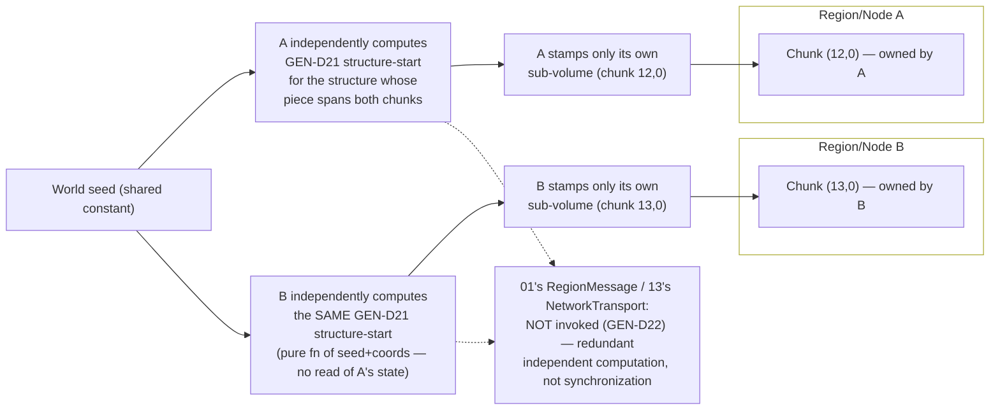

# Worldgen Parity

## Purpose

Defines how Rusty Clanker generates chunks: the RNG algorithms and seed-derivation hierarchy, the decision to implement vanilla's data-driven worldgen pipeline as an **interpreter over vanilla's own worldgen JSON** rather than a hand-ported algorithm, the noise/biome/surface/aquifer/ore-vein/carver/feature/structure subsystems that JSON drives, the legal handling of Mojang-authored worldgen data and structure templates, the execution model that runs generation off-tick on `01-server-architecture.md`'s `RC-WorkerPool`, and the verification strategy that turns "bit-identical to vanilla" from an aspiration into a mechanically checked property.

## Scope

**In scope:** the parity acceptance criterion and its one documented exception; both RNG families (legacy LCG, Xoroshiro128++) and the full seed-derivation hierarchy (world seed → structure/decoration/carver/random-sequence seeds); the vanilla worldgen JSON extraction, compilation, and interpretation pipeline (density functions, noise router, multi-noise biome source, climate parameters, surface rules, aquifers, ore veins, carvers, features and placement modifiers, structure sets, jigsaw structures, processor lists); structure NBT template acquisition and its legal handling; the execution model (off-tick generation stage pipeline, scheduling on `RC-WorkerPool`, determinism under parallel/region/cluster-partitioned generation); the verification strategy (direct vanilla-server diffing, golden corpora, engine-primitive differential oracles).

**Out of scope:** the in-memory chunk-section/palette representation and on-disk persistence format (`03-world-chunks-persistence.md` — this document treats a generated chunk as an opaque output value handed to `03`); game-mechanics business logic that consumes generated content post-placement (loot table rolls, mob spawning during play, redstone — `05-game-mechanics.md`); packet framing for delivering generated chunks to clients (`02-protocol-networking.md`); the final binding legal determination of the commit/distribution boundary for Mojang-derived data (`08-assets-auth-legal.md` — this document proposes a boundary, GEN-D23/GEN-D24, extending `02`'s NET-D10 precedent, pending that sign-off).

## Decisions

| ID | Decision | Rationale |
|---|---|---|
| GEN-D1 | **Hard acceptance criterion.** For a given world seed and the pinned target version (`02-protocol-networking.md` NET-D1, Java Edition 26.2 / protocol 776), Rusty Clanker's generated chunks are **bit-identical** to vanilla's for every subsystem this document owns — terrain density, biome placement, surface blocks, aquifers, ore veins, carvers, and structure geometry/placement — with exactly **one** documented, bounded exception: block-occupancy-dependent feature placement at chunk-decoration-window overlaps (GEN-D20). Parity is not a target to approximate; it is a CI-enforced property (GEN-D27) that blocks merge on any diff outside the GEN-D20 exception's own pinned, reproducible tie-break. | Mirrors the binding-decision style `01-server-architecture.md` already established for its own documented parity exceptions (ARCH-D14's per-chunk random-tick RNG, ARCH-D11's one-tick border latency) — a small number of explicitly bounded, justified deviations, never an unbounded "close enough." Worldgen is the one domain where vanilla's own reference behavior is a pure mathematical function of inputs, so "bit-identical" is achievable almost everywhere, which makes the one real exception worth stating precisely rather than hiding inside a vague fidelity target. |
| GEN-D2 | **Seed-string parsing** reproduces vanilla's exact two-path rule: a seed string that parses as a Java `long` (base-10, optional leading `+`/`-`, no embedded whitespace — `i64::from_str`'s accepted grammar is byte-for-byte compatible with `Long.parseLong`'s) is used directly; otherwise the seed is Java's `String.hashCode()` — the 31-multiplier polynomial hash `s[0]·31^(n−1) + s[1]·31^(n−2) + … + s[n−1]` computed over the string's UTF-16 code units as 32-bit wrapping arithmetic, sign-extended to `i64`. | An easy-to-miss vanilla-parity detail: a player who types a non-numeric seed (`"hello"`) expects the identical world Java Edition would produce. Getting the numeric-vs-hashed branch and the UTF-16-code-unit iteration (not UTF-8 byte iteration — matters for any non-ASCII seed string) wrong silently produces a wrong-but-plausible world with no error signal. |
| GEN-D3 | **Two RNG families, matching vanilla's own split.** `LegacyRandomSource` (the classic 48-bit Java LCG: `state' = (state · 0x5DEECE66D + 0xB) mod 2^48`, `next(bits)` returns the top `bits` of `state'`) is hand-implemented natively in a `RcLegacyRandom` type (≈20 lines, no crate — the algorithm is small, fixed, and a dependency would add nothing). `XoroshiroRandomSource` (Xoroshiro128++, vanilla's default for worldgen since 1.18) wraps the `rand_xoshiro` crate 0.8.1 (crates.io, published 2026-05-16)'s `Xoroshiro128PlusPlus` for the raw 128-bit-state/64-bit-output core only. | Reusing an audited, widely-deployed core (114M+ cumulative downloads per crates.io) for the raw xoroshiro128++ arithmetic (rotate/add/xor) avoids re-verifying bit-rotation and wraparound correctness ourselves, while the LCG is genuinely too small and too vanilla-specific (nobody else needs Java's exact multiplier/addend) to justify pulling a dependency for. |
| GEN-D4 | **Derived-value extraction methods (`nextInt`, `nextInt(bound)`, `nextLong`, `nextFloat`, `nextDouble`, `nextInt(0, n)` triangular-ish helpers used by specific worldgen call sites) are hand-implemented against Java's exact algorithms on top of each RNG's raw output stream — `rand_xoshiro`'s own `rand_core::RngCore` trait methods (`gen_range`, etc.) are never called for anything worldgen-facing.** | `rand`/`rand_core`'s bounded-integer algorithms (Lemire's method and similar) do not match Java's `nextInt(bound)` rejection-sampling algorithm bit-for-bit; calling `Rng::gen_range` instead of a hand-matched `next_int_bounded` is the single easiest way to silently break parity for every placement-count/random-choice call site in the entire worldgen pipeline, so it is called out here as a standing implementation rule, not left to be discovered per call site. |
| GEN-D5 | **128-bit seed upgrade & mixing**, exactly as vanilla's `RandomSupport`: `upgradeSeedTo128bit(seed)` produces `(lo, hi) = (seed XOR 0x6a09e667f3bcc909, lo + 0x9e3779b97f4a7c15)`; both halves are then passed through `mixStafford13` (`v ^= (v ^ (v >>> 30)) * 0xbf58476d1ce4e5b9; v ^= (v ^ (v >>> 27)) * 0x94d049bb133111eb; v ^= v >>> 31`) before becoming the Xoroshiro128++ state. Random-sequence seeds (post-1.20 world-settings-driven sequences, `/data/random_sequences.dat`-equivalent) additionally fold in a `salt` (config, default 0), an optional world-seed XOR, and an optional XOR with the MD5 hash of the sequence's namespaced ID, per the `include_sequence_id`/`include_world_seed`/`salt` world settings — all three default `true`/`true`/`0`. | Confirmed against the current `minecraft.wiki` "Random sequence format" article (constants quoted verbatim above). This is the single seeding primitive every derived seed in GEN-D6 ultimately routes through; getting it exactly right is a precondition for every other RNG-dependent decision in this document. |
| GEN-D6 | **Positional seed-derivation formulas**, hand-implemented from public reverse-engineering documentation and cross-validated by black-box comparison against a running vanilla server (per the project's allowed-source policy, ASSET-D18): **structure-set region grid** — `chunkRandom.setSeed(regionX·341873128712 + regionZ·132897987541 + worldSeed + salt)`, where `salt` is read directly from the structure set's own JSON (`placement.salt`) rather than hand-transcribed; **decoration/population seed** — `legacy.setSeed(worldSeed); a = legacy.nextLong() \| 1; b = legacy.nextLong() \| 1; seed = (chunkMinX·a + chunkMinZ·b) XOR worldSeed`; **carver source-chunk seed** uses the distinct large-feature formula, seeded with `worldSeed + carverIndex` — **not** plain `worldSeed`; the carver's own additive index is folded into the seed parameter itself before the call — `legacy.setSeed(worldSeed + carverIndex); a = legacy.nextLong(); b = legacy.nextLong(); seed = (sourceChunkX·a) XOR (sourceChunkZ·b) XOR (worldSeed + carverIndex)` — XOR-combined with multipliers **not** forced odd, unlike the decoration seed's add-combined `\|1` form (confirmed against the ASSET-D18(f) reference; derivation detail in `docs/research/mc-26.2/16-rng-internals.md` §7/§8), called once per `(source chunk, carver)` pair within the carver's own JSON-declared reach, with `carverIndex` reset to `0` for every source chunk (never a global index shared with the feature-seed's own `FeatureSorter` indexing); **known legacy-LCG holdouts** — e.g. slime-chunk determination, which vanilla deliberately keeps on the classic LCG for backward seed-compatibility with pre-1.18 "slime seed" tooling: `seed = worldSeed XOR 0x3ad8025f + (int)(x²·0x4c1906) + (int)(x·0x5ac0db) + (int)(z²·0x4307a7) + (int)(z·0x5f24f)`, chunk is a slime chunk iff `nextInt(10) == 0` — are enumerated individually rather than assumed to be a closed, memorized list; a blueprint-phase black-box audit against the reference vanilla server (GEN-D27) is the actual source of truth for completeness. | These specific integer constants are the concrete mechanism vanilla's structure spacing/decoration/carving actually run on; every one of them is publicly, widely mirrored reverse-engineering knowledge (chunk-generation-tooling and speedrunning-community documentation), cross-validated formula-by-formula against the ASSET-D18(f) reference — which is what caught the carver formula's large-feature variant. Treating "enumerate every legacy-LCG call site" as an open verification task rather than a closed list here is the honest position given this document's own research pass could not exhaustively re-derive every one from first principles. |
| GEN-D7 | **Vanilla worldgen JSON is extracted via an extension of `02-protocol-networking.md`'s NET-D9 pipeline**: `xtask fetch-worldgen-data <version>` unzips the vanilla datapack embedded in the same legally-obtained `server.jar` NET-D9 already downloads (`data/minecraft/worldgen/**`, `data/minecraft/dimension/**`, `data/minecraft/dimension_type/**` — noise settings, density functions, noise definitions, multi-noise biome-source parameter lists, surface rules, configured/placed carvers and features, structure sets/structures/template pools/processor lists), the same local, on-demand, never-CI, never-build-time step NET-D9 already runs. | These JSON files are **official Mojang data** shipped inside the same legally-obtained developer-local `server.jar` NET-D9 already treats as an allowed source under ASSET-D18(a) — not decompiled source, and not a separate acquisition path requiring new legal analysis; reusing NET-D9's exact mechanism (rather than inventing a second extraction pipeline) keeps "how we legally obtain Mojang data" a single, auditable answer across the whole project. |
| GEN-D8 | **Vanilla worldgen JSON is the executable specification: Rusty Clanker implements a data-driven interpreter over it, not a hand-ported reimplementation of any specific version's generation algorithm.** Only the interpreter's fixed, small set of primitive node-kind implementations (noise sampling math, spline evaluation, the `end_islands` algorithm, etc. — GEN-D12) is native Rust code; every composition graph, numeric constant, spacing/salt value, spline knot, climate parameter point, surface-rule condition tree, and feature-placement ordering is read from the extracted JSON (GEN-D7) with zero hand-transcription. | This is the single highest-leverage decision in this document, evaluated explicitly against hand-porting and decided in the interpreter's favor on four independent grounds: (1) **feasibility is proven, not speculative** — this is exactly Mojang's own architecture (`DensityFunctions`' Java `Codec`-deserialized graph registry reading this exact JSON at runtime), so building an interpreter is replicating a shipped, production-proven strategy, not inventing a risky one; (2) **independent community validation** — `misode/deepslate` (TypeScript, actively maintained, its companion `misode.github.io/worldgen` visualizer tracks the pinned-target-adjacent 26.1/26.2/26.3 releases as of this writing) is a second, independent implementation of the same "JSON is the spec" architecture, confirming it generalizes across host languages; (3) **hand-porting's failure mode is silent and unbounded** — every spacing constant, salt, spline knot, and climate parameter point would need manual transcription into Rust source, and a single transposed float or digit produces a subtly wrong result for that structure/biome/feature on *every* seed, with no compiler or type-system signal; (4) **hand-porting cannot survive a version bump** — NET-D2's policy is a deliberate, reviewed re-run per version; an interpreter re-runs GEN-D7's extraction and is correct by construction for any worldgen JSON shape it already parses, where a hand-port requires manually re-diffing and re-transcribing the entire dataset every time. Reading the vanilla JSON's *shape* (which fields exist, how nodes reference each other) is not "consulting decompiled source" under `08-assets-auth-legal.md`'s source policy any more than reading a protocol's packet JSON under NET-D9 is — it is reading official data-generator-adjacent output, the same allowed tier NET-D3 already established. |
| GEN-D9 | **Compiled data representation.** `xtask fetch-worldgen-data`'s output is parsed with `serde_json` (1.0.x, xtask/dev-time dependency only, never compiled into the release binary), canonicalized into the `serde`-deriving Rust structs GEN-D12/D13/D17/D18/D19/D21 define, and serialized with `postcard` 1.1.3 (already pinned by `13-cluster-architecture.md` CLUSTER-D12, reused here — zero new wire-format decision) into one binary blob per protocol version, `crates/worldgen/generated/<protocol-version>/data.postcard`, embedded via `include_bytes!` and lazily deserialized once behind a `std::sync::OnceLock` at process startup. The committed artifact is this compiled blob, never raw Mojang JSON (extending NET-D10's commit policy — GEN-D24). | Emitting the compiled dataset as literal Rust source (as NET-D9's packet codegen does for a comparatively small, hand-sized packet spec) does not scale here: thousands of deeply nested density-function node trees across dozens of biomes, carvers, and structure sets as Rust enum-literal AST would push `rustc` compile times into impractical territory. A `postcard`-encoded binary blob parsed once at startup sidesteps that entirely while keeping the "never commit raw Mojang JSON" policy intact — it is a processed, derived artifact by construction, exactly like NET-D10's generated-Rust packet tables. |
| GEN-D10 | **Floating-point determinism discipline (binding coding rule, not just an intent):** all worldgen arithmetic is IEEE 754 `f64`, evaluated in the exact operation order the JSON graph encodes (the interpreter's node-by-node evaluation order *is* the JSON's structure, so there is no separate "keep the order right" burden the way a hand-port would have). `f64::mul_add` and any other fused-multiply-add path are **never** used anywhere in the density-function/noise/spline evaluator, and no build profile enables LLVM FP-contraction (`-C target-feature`/`ffast-math`-equivalent flags) for the worldgen crate. | Java's `double` arithmetic performs `a*b+c` as two separately-rounded operations; an FMA instruction rounds once and produces a different low bit on a meaningful fraction of inputs. Rust/LLVM do not auto-contract FMA by default (unlike some C compilers' default `-ffp-contract`), so the risk is exclusively a developer explicitly reaching for `mul_add` as a "faster" rewrite of `a*b+c` — worth pinning as an explicit rule precisely because it is the kind of "obviously safe" micro-optimization that would otherwise pass code review while silently breaking bit-parity on a hard-to-notice fraction of blocks. The interpreter architecture (GEN-D8) also structurally forecloses the other common way this breaks: a hand-port's well-meaning algebraic simplification (reassociating or common-subexpression-eliminating two differently-shaped-but-mathematically-equal sub-expressions) changes rounding exactly the way FMA does; an interpreter has no occasion to "simplify" anything beyond the caching/memoization vanilla's own graph already declares (GEN-D12). |
| GEN-D11 | **No generic noise crate is used** (e.g. the `noise` crate) for any worldgen sampling. `ImprovedNoise` (Perlin, Ken Perlin's reference permutation-table algorithm, seeded per vanilla's specific octave-shuffle procedure), `PerlinNoise`/octave combination (fixed persistence/lacunarity, amplitude table read from JSON), `DoublePerlinNoise` (sum of two independently-offset `PerlinNoise` instances scaled by `(10/6)·len(amplitudes)/(len(amplitudes)+1)`), and the small set of natively-implemented non-JSON-configurable node kinds (notably `end_islands`, and `TheEndBiomeSource`'s fixed distance-based biome distribution, which vanilla itself implements as hardcoded Java logic rather than data — the JSON only carries the `minecraft:the_end` biome-source *type tag*) are hand-implemented natively against public documentation (`minecraft.wiki`) and validated by black-box comparison against vanilla output. | No published Rust noise crate implements Minecraft's specific seeded-permutation-table derivation, its exact octave/persistence combination, or Java-exact double rounding — a generic crate would need to be so heavily overridden it provides no real leverage, so (as with NET-D3's rejection of `valence_protocol`/`azalea-protocol`) the honest call is no dependency rather than a misleading one. Explicitly naming the End's biome source as one of a small, enumerable set of natively-hardcoded (not-further-JSON-driven) algorithms — mirroring what vanilla itself does — prevents GEN-D8's "JSON is the spec" framing from being read as "everything is data"; a full audit of this short list is a blueprint-phase task (Open Questions). |
| GEN-D12 | **Density-function interpreter data model:** a `DensityFunction` Rust enum with one variant per vanilla node kind — arithmetic (`Constant`, `Add`, `Mul`, `Min`, `Max`, `Abs`, `Square`, `Cube`, `HalfNegative`, `QuarterNegative`, `Clamp`), noise sampling (`Noise`, `OldBlendedNoise`, `ShiftA`/`ShiftB`, `ShiftedNoise`), interval selection (`IntervalSelect` — 26.2's replacement for the removed `WeirdScaledSampler`; linear-scan threshold selection over N+1 functions, see `docs/research/mc-26.2/17-noise-math.md`), mapping (`Spline`, `YClampedGradient`, `RangeChoice`), caching/marker nodes (`Interpolated`, `FlatCache`, `Cache2D`, `CacheOnce`, `CacheAllInCell`), and world-integration nodes (`BlendDensity`, `BlendAlpha`, `BlendOffset`, `Beardifier`, `EndIslands`) — evaluated by a `fn sample(&self, ctx: &EvalContext) -> f64` visitor. Caching/marker node kinds are implemented as **real memoization** (a per-evaluation-context cache keyed by `(NodeId, position-at-the-node's-declared-granularity)`), not treated as no-ops, because some sibling nodes structurally rely on a cached ancestor being evaluated at its own coarser lattice rather than at every caller's finer one. | Fixing this as a closed enum (derived once from GEN-D7's extracted node-kind vocabulary, re-verified — not assumed unchanged — on every NET-D2 version bump) is what makes GEN-D9's `serde`-derived compiled representation possible at all; treating the caching nodes as genuine memoization rather than pass-through is required for bit-parity, not just performance, since some vanilla density functions are only correct when a `flat_cache`/`cache_2d` ancestor is sampled at its own coarser grid. |
| GEN-D13 | **Noise router:** the fixed field set vanilla's `noise_settings` JSON declares — `final_density` (terrain shape: positive ⇒ solid, negative ⇒ air, subject to surface-rule replacement), `preliminary_surface_level`, `barrier`/`fluid_level_floodedness`/`fluid_level_spread`/`lava` (aquifers, GEN-D15), `vein_toggle`/`vein_ridged`/`vein_gap` (ore veins, GEN-D16), and `temperature`/`vegetation`/`continents`/`erosion`/`depth`/`ridges` (climate parameters feeding GEN-D14; these do not themselves shape terrain). Every field is one `DensityFunction` graph, sampled independently per block column (or coarser, per its own caching nodes) — **no field ever reads another chunk's already-generated block data**, only noise/spline math that is a pure function of absolute world coordinates plus GEN-D12's fixed, statically-bounded interpolation neighborhood (vanilla's fixed noise-interpolation cell, not an arbitrary chunk radius). | This is the concrete basis for this document's answer to the region/cluster-border generation-locality question (GEN-D21/GEN-D22): every noise-router field, and therefore terrain shape, biome placement, aquifers, and ore veins, is provably a pure function of coordinates with a small fixed sampling neighborhood — never a function of another chunk's materialized state — so no cross-region or cross-node message ever needs to be sent for any of these subsystems, regardless of how `01`'s region boundaries or `13`'s node boundaries happen to fall relative to a sample point. |
| GEN-D14 | **Multi-noise biome source:** each biome entry in the extracted `multi_noise_biome_source_parameter_list` JSON is a 7-dimension point (temperature, humidity/vegetation, continentalness, erosion, depth, weirdness, and weirdness's derived "offset") plus an `f32` fitness weight; biome selection at a column is the nearest point by weighted squared distance in that 7-space. Distance comparisons use vanilla's fixed-point quantized parameter representation (`Climate.Parameter`-equivalent, an integer-scaled `f64`/`i64` value rather than a raw `f64`) specifically so the search is exact-integer and traversal-order-invariant — the exact quantization scale factor is sourced from GEN-D7's extracted data / black-box verification rather than assumed (Open Questions). Search implementation (brute force vs. an accelerated spatial index) is a pure performance choice — vanilla itself accelerates this internally, but any implementation that returns the identical argmin is correct by GEN-D1's own definition; brute force over the parameter list (dozens to roughly a hundred entries at typical Overworld scale) is the default until profiling says otherwise. | Separating "what must be bit-identical" (the argmin, via the fixed-point comparison) from "how fast to find it" (search structure) keeps this decision honest about what is actually load-bearing for parity versus what is an internal implementation detail with no observable effect — the same posture `01`'s ARCH-D18 takes toward RC-WorkerPool's *internal* scheduling structure being free to differ from Folia's as long as the *externally observable* region-tick behavior matches. |
| GEN-D15 | **Aquifers** are implemented faithfully from the noise-router's `barrier`/`fluid_level_floodedness`/`fluid_level_spread`/`lava` fields plus a fixed per-chunk-section sampling grid (vanilla's own fixed aquifer-sample lattice, not a tunable) and a positional random draw per sample point (GEN-D6's derivation family). Fluid level and barrier separation are resolved purely from these noise samples and the column's own `final_density` — **never** by reading a neighboring chunk's already-placed blocks, even though the sampling grid's cells can straddle a chunk boundary (straddling is resolved by both neighboring chunks independently recomputing the identical grid-cell sample from coordinates, exactly as GEN-D21 does for structures). | Confirms, for the one worldgen subsystem most often assumed to need cross-chunk block reads (aquifers visibly connect across chunk boundaries in-game), that the actual algorithm never does — it is grid-sample interpolation over pure noise, which is the same "pure function of coordinates" property GEN-D13 establishes for the rest of the noise router. |
| GEN-D16 | **Ore veins** (the large copper/iron vein feature added in 1.18) are **not** a separate carver or feature step; they are resolved as part of `final_density`'s own composition via the noise router's `vein_toggle`/`vein_ridged`/`vein_gap` fields during the same noise-evaluation pass as terrain shape, exactly mirroring vanilla's own architecture. Vein type (copper vs. iron) and rarity are read from `vein_toggle`'s sign/magnitude, vein membership from `vein_ridged`'s threshold, and ore-vs-filler-block selection (plus the 2% raw-metal-block upgrade chance) from `vein_gap` combined with a positional random draw. Ordinary ore types (most ores, still placed via `minecraft:ore` configured/placed features) go through the entirely separate GEN-D19 features-and-placement pipeline — the two ore-placement mechanisms coexist in vanilla and are implemented as two entirely separate code paths here, matching that split exactly rather than unifying them. | Getting this classification right (density-function-integrated vs. feature-pipeline) is what makes ore-vein output as deterministic and cross-chunk-independent as the rest of the noise router (GEN-D13's rationale applies identically) — treating veins as a carver or a feature by mistake would both misrepresent vanilla's actual dependency structure and reintroduce an unnecessary ordering concern GEN-D13 otherwise eliminates. |
| GEN-D17 | **Surface rules** are a sequential condition-tree interpreter over the extracted `surface_rule` JSON (condition kinds: `y_above`, `water`, `biome`, `stone_depth`, `hole`, `noise_threshold`, `vertical_gradient`, `temperature`, `steep`, `not`/`and`/`or`; leaf rules: `block`, `sequence`, `bandlands`), evaluated top-down per block column immediately after that column's noise pass, first-match-wins exactly as vanilla's `sequence` combinator specifies. Inputs are the column's own just-generated block/fluid state, biome, and the noise-router's `depth`/`stone_depth`-adjacent samples — never another chunk's data. | Surface rules are the mechanism that turns raw `final_density` solid/air into grass/dirt/sand/sandstone/etc.; being a strictly sequential, per-column, self-contained evaluation (no cross-chunk reads, no cross-column state) it inherits the same pure-function-of-coordinates property as GEN-D13/D15/D16 with no additional argument needed. |
| GEN-D18 | **Carvers** (caves, canyons) are evaluated per target chunk by re-deriving GEN-D6's carver source-chunk seed for every candidate *source* chunk within the carver's own JSON-declared `distance`/reach, then carving into the target chunk wherever that source chunk's carved geometry (a pure function of the source chunk's coordinates and the shared world seed) overlaps it. This is a genuine multi-coordinate computation — unlike GEN-D13/D15/D16/D17's strictly single-column inputs — but remains a pure function of **coordinates only**: no carver ever reads a neighboring chunk's materialized block state, only re-derives that neighbor's own carve geometry from its coordinates. The reach radius itself is read from the extracted carver JSON, never hardcoded. | This is the one noise-adjacent subsystem where "no cross-chunk dependency" needs a more careful statement than GEN-D13's, since a chunk's caves really are influenced by its neighbors' carver seeds — the precise claim this decision fixes is that the dependency is on neighbor *coordinates*, recomputable by any worker with zero synchronization, never on neighbor *content*, which is exactly the distinction GEN-D21/GEN-D22 need to hold for cross-region/cross-node generation to require no messaging. |
| GEN-D19 | **Features & placement:** each biome's `worldgen/placed_feature` list is grouped into vanilla's 11 fixed decoration steps — `raw_generation`, `lakes`, `local_modifications`, `underground_structures`, `surface_structures`, `strongholds`, `underground_ores`, `underground_decoration`, `fluid_springs`, `vegetal_decoration`, `top_layer_modification` — executed in that fixed order; within a step, placed features execute in the JSON-declared list order, and within a placed feature, its `placement_modifiers` chain (`count`, `rarity_filter`, `in_square`, `height_range`, `biome`, `block_predicate_filter`, `carving_mask`, `environment_scan`, `heightmap`, `random_offset`, and others read generically from the extracted data rather than hand-enumerated as a closed list) applies in declared order, each stage narrowing/transforming the candidate position set the RNG (GEN-D6's decoration-seed-derived stream, advanced once per placement attempt in list order) draws from. | Reproducing vanilla's fixed 11-step order and per-step list order is what makes feature placement reproducible at all — the decoration-step enum and per-modifier semantics are exactly the kind of thing GEN-D8's interpreter approach gets for free from the extracted data (step names and per-feature list order are literally the JSON's own structure) rather than something to hand-encode as a parallel Rust ordering that could drift from the data. |
| GEN-D20 | **Documented, bounded parity exception: feature-placement occupancy checks at chunk-decoration-window overlaps.** Vanilla's own decoration step can read currently-placed block state as a placement precondition (e.g. "is this space air," "is this the correct block to sapling-grow on"), and a chunk's decoration pass writes into a small fixed radius around itself (matching vanilla's own `FEATURES`-status write margin) that overlaps its neighbors' decoration windows — so which of two overlapping chunks' decoration passes *runs first* can, in principle, affect the exact placement outcome at the seam, precisely the same category of ordering sensitivity `01`'s ARCH-D14 already documents for random ticks. Rusty Clanker resolves this by pinning a single **canonical decoration order** — ascending `(region-local chunk index, decoration step, placed-feature list index)` — as its own deterministic tie-break, verified by GEN-D27's direct-diff harness to match the reference vanilla server's default fresh-world generation order for the golden corpus. This canonical order is a **scheduling constraint local to the worldgen pipeline only** (GEN-D25/D26), never part of `01`'s ARCH-D8 tick-time conflict graph, since worldgen is not a tick stage. | Following the exact same pattern `01` already established (ARCH-D14's rationale: "no vanilla-observable mechanic depends on the cross-chunk order... only on correct... frequency, which a per-chunk seeded stream preserves exactly; this is a deliberate, documented parity exception") for the one place in worldgen where vanilla's own reference behavior genuinely has an ordering dependency (unlike every other subsystem GEN-D13–D18 establish as strictly order-free) keeps this document's one real exception as narrow, explicit, and precedented as possible rather than letting "mostly bit-identical" quietly leak into subsystems that do not need any exception at all. |
| GEN-D21 | **Structures — jigsaw and non-jigsaw — are a pure function of `(world seed, structure-set grid cell, noise-router biome/height samples at that cell)`, with no dependency on any chunk's materialized block content.** A structure-set's placement (`random_spread` or `concentric_rings`, both driven by JSON-declared spacing/separation and the set's own `placement.salt`) picks candidate origin chunks via GEN-D6's region-grid formula; a candidate is confirmed only after a pure biome/terrain-height check against the noise router (GEN-D13/D14), never against generated blocks. Confirmed jigsaw structures assemble their piece layout via weighted-random template-pool walks (`worldgen/template_pool`, `worldgen/processor_list`) seeded purely from the structure's origin and the world seed, up to the pool's declared `max_depth` — again with zero dependency on any other chunk's generation state, since terrain-fitting (`terrain_adaptation: beard_thin`/`beard_box`/`bury`/`encapsulate`) is applied afterward as a `Beardifier` density-function injection back into GEN-D13's noise router, not as a read of already-placed terrain. Only the final **block-stamping** step (writing a confirmed piece's NBT template into the world) touches materialized chunk state, and it writes only into whichever chunk(s) the piece's own bounding box overlaps. | This is this document's complete answer to the task's cluster-border question: because structure *layout* (which pieces, where, in what rotation) never depends on materialized chunk content, it is safe — indeed correct by construction — for it to be computed redundantly and independently wherever it is needed, which is exactly what GEN-D22 formalizes for the region/cluster case. |
| GEN-D22 | **Region- and cluster-border structure generation requires zero messaging.** When a structure's piece geometry spans a `01` region boundary or a `13` cluster node boundary, each owning region/node independently **recomputes** the identical GEN-D21 piece layout (cheap: pure seed/coordinate math, no simulation state, fully memoizable) and stamps only the sub-volume of chunks it itself owns. This is deliberately *redundant computation, not cross-partition synchronization* — there is no shared mutable structure-layout state to race on, so `01`'s `RegionMessage`/`Transport` substrate (ARCH-D24–D30) and `13`'s `NetworkTransport` are never invoked for structure generation. This is consistent with, and independently confirms, `13-cluster-architecture.md`'s CLUSTER-D4 ("no colocation constraints exist beyond region atomicity... any... long-range cross-region interaction [is] ordinary `RegionTransferRequest`/`BorderUpdateEvent` traffic... no special-casing is needed or added here") for the specific case of worldgen: worldgen adds *no* special-casing at all, not even the ordinary message traffic CLUSTER-D4 describes for other cross-region interactions, because generation itself is never a simulation-state read. | Directly answers the task's explicit ask ("structures spanning partition borders in cluster mode must still generate identically — state how generation locality guarantees this... verify the proto-chunk dependency radius story"): the dependency radius is not "however wide a structure happens to be," it is always zero in the cross-partition-messaging sense, because every input to structure placement (GEN-D21) is coordinate-and-seed-only. The only "radius" that exists is a bounded *recomputation* neighborhood (how far a piece's bounding box can extend from its origin, itself read from the structure-set's own JSON spacing value), never a *communication* neighborhood. |
| GEN-D23 | **Structure NBT templates are never committed to the repository or distributed with Rusty Clanker, and — unlike GEN-D7/GEN-D9's JSON data — are not even reduced to a processed/compiled form at dev time.** They are Mojang-authored creative content (specific room/building/ruin layouts — level design, not a functional ID table or an algorithmic parameter), so this document classifies them with textures/sounds/models under the project's "ship no Mojang assets" rule rather than with NET-D10's "functional data" carve-out. Because the *server* — not only the client — must be able to place structures during live gameplay (a chunk can be generated for the first time at any point during a running server, not just at a one-time dev build step), Rusty Clanker requires the **operator** to supply a legally-obtained vanilla `server.jar` (or its extracted `data/minecraft/structures/**` datapack) at server startup; Rusty Clanker reads gzip-compressed structure NBT template files directly from that operator-supplied path at chunk-generation time, via the already-adopted `flate2` (NET-D5) + `simdnbt` (NET-D5) stack — no new dependency. Rusty Clanker itself ships zero structure-template bytes, in any form, ever. This split is **confirmed as binding by `08-assets-auth-legal.md`'s ASSET-D25**, exactly mirroring NET-D10's own sign-off pattern (ASSET-D15). | This is the direct extension of the project vision's client-side rule ("client reads assets from the user's legally owned local `.minecraft` installation... we distribute an engine, not the game") to the server side, for the one worldgen input that is genuinely creative/artistic content rather than functional data: the *server* now also reads Mojang-authored content from a copy the operator is legally responsible for obtaining, rather than Rusty Clanker ever holding or shipping it. Treating this as materially different from GEN-D9/GEN-D24's JSON data (functional numeric/graph data, closer to NET-D10's registry-ID-table precedent) rather than lumping both under one commit policy is a deliberate, load-bearing distinction this document is making, not an oversight — it is exactly the kind of joint call NET-D10 already flags needing `08`'s binding sign-off for. |
| GEN-D24 | **Worldgen JSON (density functions, noise settings, biome parameter lists, surface rules, carvers, features, structure sets/structures, template pools, processor lists — everything GEN-D7 extracts *except* structure NBT templates) is classified as functional/structural data under NET-D10's existing framework, not creative expression** — the same category as NET-D10's packet-ID and registry tables — and so GEN-D9's compiled `postcard` blob (never raw JSON) may be committed under that policy. Processor lists (block-substitution rules for jigsaw pieces) are included in this functional-data classification, not GEN-D23's creative-content one, since they are substitution *rules*, not authored geometry. This classification is **confirmed as binding by `08-assets-auth-legal.md`'s ASSET-D25**, exactly as NET-D10 itself already is (ASSET-D15). | Extends, rather than re-litigates, NET-D10's existing provisional split to the worldgen-specific data this document introduces — density-function graphs, spline knots, and climate parameter points are numeric/structural specifications functionally necessary for interoperability (the same "facts, not copied creative expression" argument NET-D10 already makes for registry tables), which is a materially different case from GEN-D23's structure geometry and deserves a different resting place in the same still-provisional framework, not a blanket "treat all extracted worldgen data alike" shortcut. |
| GEN-D25 | **Execution model:** a `GenStage` pipeline mirroring vanilla's own `ChunkStatus` dependency graph — `Empty → StructureStarts → StructureReferences → Biomes → Noise → Surface → Carvers → Features → InitializeLight → Light → Full` (re-verified against the pinned 26.2 target at blueprint time, Open Questions) — runs entirely as background work on `01`'s `RC-WorkerPool` (ARCH-D18–D20), scheduled at lower priority than any in-tick stage exactly as `01`'s Tick Pipeline section already specifies ("worldgen... runs as background work on RC-WorkerPool at lower scheduling priority than any in-tick stage"). A completed chunk is delivered as an ordinary Stage-1 structural command (ARCH-D9) keyed by `ChunkKey`, routed to whichever `RegionId` the ARCH-D24 directory currently maps that key to — satisfying `01`'s explicitly flagged "Needs from `04`" interface item. Because generation never touches ECS `World` state or region-ownership bookkeeping until that single Stage-1 command, **a not-yet-generated chunk at a region's edge requires no provisional region ownership** — the other half of that same flagged interface item — any worker can generate any chunk at any time regardless of current region boundaries. | This is a direct, load-bearing fulfillment of two items `01` explicitly left as open dependencies on this document; resolving both here (rather than leaving them for a future revision) is exactly the kind of joint-interface closure the project's cross-document convention rewards, mirroring how `13-cluster-architecture.md` closed out `01`'s two flagged "Needs from `13`" items. |
| GEN-D26 | **Determinism under parallel generation:** every `GenStage` up to and including `Carvers` is a pure function of `(seed, coordinates, bounded static neighborhood)` per GEN-D13/D15/D16/D17/D18 — fully parallel, any interleaving, any worker count, zero synchronization, bit-identical output by construction. `Features` alone carries GEN-D20's pinned canonical-order tie-break, enforced as a **scheduler-level ordering dependency internal to the worldgen pipeline** (a chunk's `Features` stage task is not eligible for execution until its canonical-order predecessors among its decoration-window neighbors have completed theirs) — never as an ARCH-D8 conflict-graph entry, since worldgen runs off-tick and outside that graph entirely. Because generated output is a pure function of its inputs, a redundant or superseded generation request (e.g. two racing requests for the same `ChunkKey`, or a request that outlives an ARCH-D6 region split/merge) is **always safe to discard** — deduplication of in-flight requests by `ChunkKey` (first-completed-wins) is a pure performance optimization, never a correctness requirement. | States plainly what GEN-D13–D22 collectively established: parallel-generation determinism is not an aspiration requiring careful synchronization design, it is a structural consequence of every relevant subsystem being provably a pure function of bounded inputs, with exactly one narrow, already-pinned exception. The "safe to discard/redundantly compute" property is what makes GEN-D22's cross-region/cross-node answer (recompute, don't synchronize) sound at the single-node level too, not just across partitions. |
| GEN-D27 | **Verification strategy, two tiers.** **Primary (authoritative, version-current):** a `xtask verify-worldgen` harness runs a real vanilla dedicated server for the pinned NET-D1 target (the same legally-obtained `server.jar` GEN-D7/NET-D9 already use) headless against a golden corpus of seeds (0; a handful of well-known community reference seeds; several cryptographically random seeds; the `i64` extremes) and chunk-coordinate samples chosen to stress every subsystem (spawn-adjacent, biome-transition zones, deep ocean, extreme Y-slices, structure-dense regions, ore-vein-dense regions, all three dimensions), reads the vanilla server's own on-disk region files with a small **read-only, verification-only** NBT reader (reusing `simdnbt`/`flate2`, deliberately *not* `03-world-chunks-persistence.md`'s own persistence format or code — this is an external ground-truth fixture, not a round-trip of our own storage), and diffs block state, biome, and heightmap data column-by-column against Rusty Clanker's own generation for the same seed/coordinates. Any diff outside GEN-D20's pinned exception is a build-blocking defect. This suite runs on every worldgen-touching PR at reduced corpus size and nightly at full size. **Secondary (engine-primitive regression, dev/test-only):** a minimal, purpose-built FFI shim (via `bindgen`, vendoring the upstream `Cubitect/cubiomes` C sources — MIT-licensed — at a pinned commit under a `cfg(test)`-only crate never included in the release binary or its default workspace members) differentially tests the interpreter engine's *primitive* math (noise sampling, RNG derivation, spline evaluation — algorithms unchanged since 1.18) against cubiomes' independent implementation, for the version range cubiomes actually covers. As of this writing, `Cubitect/cubiomes`'s `master` branch's most recent commit is 2024-11-10 ("Renamed MC_1_21_2 to MC_1_21_3") — it supports only up to roughly Minecraft 1.21.2/1.21.3, a **21-month, multiple-major-release gap** behind the NET-D1-pinned 26.2 target, so cubiomes is explicitly **not** primary or dataset-level parity evidence for the pinned target; it validates only that the shared, version-stable primitives are implemented correctly, as a fast, cheap, always-available regression check. **Additionally**, GEN-D26's parallel-determinism claim is itself a CI invariant, not just an analytical argument: the same golden corpus is generated once single-threaded and once at the pool's hard-cap worker count (ARCH-D18) with randomized task-completion-order injection, and the two outputs must be byte-identical. | Direct vanilla-server diffing is what actually makes GEN-D1's "bit-identical" claim mechanically enforced rather than asserted; cubiomes is valuable exactly as far as its real, verified currency extends (checked here, not assumed — the same "verify, don't trust training-data-vintage claims about a competitor/tool" discipline `10-prior-art.md`'s verification-pass note already applied to Folia/Cuberite/azalea) and no further, so this document is explicit that it is a secondary, narrower-scope tool rather than overstating its coverage of the pinned version. Community forks exist that claim newer-version support (e.g. version-specific `cubiomes-viewer` forks observed during this research pass) but their provenance and maintenance are not independently vetted here, so they are deliberately not adopted even as a secondary oracle — a purpose-built shim over the known-provenance upstream MIT source is the lower-risk choice. |

## Generation Pipeline

```mermaid
flowchart TD
    subgraph DataPipe["Data pipeline (xtask, dev-time only, extends NET-D9)"]
        A["Legally-obtained server.jar\n(same copy NET-D9 downloads)"] --> B["fetch-worldgen-data:\nunzip data/minecraft/worldgen/**,\ndimension/**, dimension_type/**"]
        B --> C["serde_json parse\n+ canonicalize into\nDensityFunction/SurfaceRule/etc structs\n(GEN-D9)"]
        C --> D["postcard-encode\n-> data.postcard\n(committed: GEN-D24, provisional)"]
        B -.structures/**.nbt.-> X["NEVER committed, NEVER compiled\n(GEN-D23)"]
    end

    D --> E["include_bytes! + OnceLock\ndeserialize once at startup"]
    Op["Operator-supplied legal\nserver.jar / extracted datapack\n(runtime path, GEN-D23)"] -.read at generation time.-> Piece

    subgraph GenStage["GenStage pipeline — RC-WorkerPool, off-tick, below tick priority (01 ARCH-D18-D20)"]
        direction TB
        S1["StructureStarts / References\n(GEN-D21: pure fn of seed+grid cell\n+ noise-router sample)"] --> S2["Biomes\n(GEN-D14: multi-noise nearest-point)"]
        S2 --> S3["Noise\n(GEN-D12/13: density-function graph,\nincl. ore veins GEN-D16, aquifers GEN-D15)"]
        S3 --> S4["Surface\n(GEN-D17: sequential rule tree)"]
        S4 --> S5["Carvers\n(GEN-D18: bounded source-chunk radius)"]
        S5 --> S6["Features\n(GEN-D19, ordered 11 steps;\nGEN-D20 pinned canonical order)"]
        S6 --> Piece["Structure piece stamping\n(GEN-D21/D23: reads operator's\nlegal NBT templates)"]
        Piece --> S7["InitializeLight / Light / Full"]
    end

    E --> S1
    S7 --> Cmd["Stage-1 structural command,\nkeyed by ChunkKey\n(fulfills 01's Needs-from-04)"]
    Cmd --> Region["Region's World\n(routed via ARCH-D24 directory —\nno provisional ownership needed, GEN-D25)"]

    style DataPipe fill:transparent,stroke-dasharray: 3 3
    style GenStage fill:transparent
```

## Region/Cluster Border Locality



## Interfaces

**Provides to `01-server-architecture.md`:**
- Resolution of both items `01` explicitly flagged as "Needs from `04`": the completion-signaling mechanism for a finished chunk (GEN-D25's Stage-1 structural command, keyed by `ChunkKey`) and confirmation that not-yet-generated edge chunks require no provisional region ownership (GEN-D25's same rationale).
- The `GenStage` pipeline as the concrete background workload `01`'s RC-WorkerPool schedules at below-tick priority, and GEN-D26's pure-function-of-bounded-inputs property as the reason that workload needs no locking or region-affinity beyond ordinary work-stealing.

**Provides to `03-world-chunks-persistence.md`:**
- A generated chunk is handed off as an opaque output value (block/biome/heightmap data for one `ChunkKey`) at the GEN-D25 Stage-1 boundary; this document defines its *content* (everything GEN-D12–D21 produce) but not its in-memory palette/section representation, which is `03`'s call per `01`'s own interface split.
- Confirmation that generation never performs disk I/O itself — GEN-D23's operator-supplied structure-template path is read-only, off the persistence path entirely, and is a separate concern from `03`'s save/load format.

**Needs from `03-world-chunks-persistence.md`:** the canonical in-memory chunk-section/palette representation (same open item `01` already flagged) so GEN-D12–D21's output types can target it directly instead of an intermediate format; the chunk coordinate/grid convention (must align with `01` ARCH-D6, already required of `03` independently).

**Provides to `02-protocol-networking.md`:** none directly — chunk data reaches players via `03`'s stored representation and `02`'s own encoding path; this document has no direct interface with `02`.

**Provides to `05-game-mechanics.md`:**
- GEN-D3/D4's RNG algorithm choice and hand-matched Java-derivation-method implementations as the reusable primitive any gameplay system needing Java-exact randomness (loot table rolls, mob AI jitter) should build on, rather than re-deriving its own — though the specific *seed-derivation formulas* this document fixes (GEN-D5/D6) are worldgen-specific and not assumed to extend to `05`'s own seeding needs without `05`'s own decision.
- Structure NBT templates' block-entity payloads (loot tables, spawner configuration) arrive already embedded in the GEN-D23 template data placed during generation; `05` owns what happens when a player subsequently interacts with them, not this document.

**Needs from `05-game-mechanics.md`:** confirmation of whether any mechanic needs structure-associated metadata beyond placed blocks/block-entities (e.g. a mob spawn tied to structure generation rather than to a block-entity spawner already covered by GEN-D23's template data) — not yet answered by `05`'s existing decisions (flagged in Open Questions).

**Provides to `08-assets-auth-legal.md`:**
- Two commit/distribution-boundary proposals extending NET-D10's existing framework: GEN-D24 (worldgen JSON as functional data, compiled form committable) and GEN-D23 (structure NBT templates as creative content, never committed, operator-supplied at runtime) — both confirmed as binding by `08`'s ASSET-D25.

**Needs from `08-assets-auth-legal.md`:** resolved — `08`'s ASSET-D25 confirms GEN-D23/GEN-D24's classification split and GEN-D23's operator-supplied-legal-copy runtime architecture as a sound extension of the project's "ship no Mojang assets" rule to server-side data with no client-asset analogue.

**Provides to `13-cluster-architecture.md`:**
- GEN-D21/D22's complete answer to the region/cluster border-structure-generation question `13`'s own scope assumes but does not itself derive: worldgen requires zero cross-partition messaging of any kind (not even the ordinary `RegionMessage` traffic CLUSTER-D4 describes for other cross-region interactions), because every generation input is coordinate-and-seed-pure. This independently confirms CLUSTER-D4's "no colocation constraints beyond region atomicity" holds for the worldgen domain specifically.

**Needs from `docs/research/third-party/rng-parity-notes.md` (ASSET-D30 firewall research notes):** the bit-exact specification of `java.util.Random` and Minecraft's Xoroshiro128++ variant — seeding hierarchy, positional factories, population/decoration/feature/structure-seed formulas — plus Java→Rust porting pitfalls and RNG test vectors. This is the blueprint-phase implementation source for this document's RNG work (GEN-D3 area); no implementation agent consults third-party or Mojang code for it.

**Needs from `13-cluster-architecture.md`:** none currently — GEN-D22 is a self-contained consequence of this document's own decisions and does not depend on any of `13`'s node-assignment or transport specifics.

**Needs from `14-performance-engineering.md`:** none beyond optional extensions — `14` owns the SIMD safety extension to GEN-D10's bit-identity discipline and the opt-in worldgen JIT with its equivalence gate and audit requirements (PERF-D16, PERF-D20–D21), both additive to GEN-D8/D10/D12.

**Provides to `10-prior-art.md`:** two additional prior-art data points not currently covered by `10`'s stated scope (whole-server reimplementations only) — `misode/deepslate` (validates the JSON-interpreter architecture, GEN-D8) and the current, verified state of `Cubitect/cubiomes` (MIT-licensed, `master` last commit 2024-11-10, supports only up to ~1.21.2/1.21.3 — a real currency gap versus this project's 26.2 target, GEN-D27) — worth a future `10` entry if that document is ever revised, though such a revision is outside this document's file scope.

## Open Questions

- The exact `GenStage`/`ChunkStatus` list (GEN-D25) and the 11-step decoration-order list (GEN-D19) are confirmed against public documentation current as of this writing but must be re-verified against the pinned 26.2 target specifically (not just "1.18+ era" sources) once GEN-D7's extraction pipeline is actually run — a schema or step-list change between the sources consulted here and the pinned version's real data is possible and would only be caught by that extraction, not by this document's research pass.
- GEN-D6's legacy-LCG call-site list (slime chunks confirmed; others not) is explicitly incomplete; a systematic blueprint-phase black-box audit against the reference vanilla server is required before GEN-D3's "two RNG families" decision can be considered a closed, exhaustive mapping rather than a structurally-correct-but-partially-enumerated one.
- GEN-D11's "small, enumerable set of natively-hardcoded, non-JSON-driven algorithms" currently lists only `TheEndBiomeSource` and `end_islands`'s fixed parameters; whether any other vanilla subsystem is similarly hardcoded rather than data-driven (candidates to check: debug world type, any legacy/superflat special-casing beyond `flat_layers` data) needs a systematic audit at blueprint time, not an assumption that this document's list is exhaustive.
- GEN-D14's climate-parameter fixed-point quantization (the exact scale factor Mojang uses, referenced here only as "an integer-scaled representation") needs confirmation against GEN-D7's actually-extracted data or black-box behavioral testing before implementation — this document intentionally does not assert a specific constant it could not independently verify with confidence.
- GEN-D20's canonical decoration-order tie-break is pinned as a mechanism (ascending region-local-index/step/list-index) but its exact match to the reference vanilla server's own typical fresh-world generation order needs empirical confirmation via GEN-D27's harness at blueprint time, not analysis alone — if the reference server's real behavior turns out to depend on something this document's chosen order doesn't capture (e.g. genuine non-determinism from real-world chunk-loading-ticket timing rather than a fixed default order), GEN-D20 may need to widen from "match vanilla's order" to "define our own reproducible order and accept a narrower, explicitly-scoped deviation from vanilla's own occasionally load-order-sensitive edge cases."
- GEN-D23's exact operator-facing configuration surface (how the legally-obtained `server.jar`/datapack path is supplied, validated, and cached at server startup) is named as a requirement here but not specified as a config schema — likely belongs with a future deployment/ops planning document, or as a small addition to `13-cluster-architecture.md`'s CLUSTER-D27-style config table if one doesn't already exist for it.
- GEN-D18's carver bounded-radius recomputation is, by construction, redundant across many overlapping source chunks (GEN-D26's "safe to discard/recompute" property applies here too) — whether this needs an explicit memoization cache to avoid quadratic-in-radius redundant noise sampling is a performance question for the blueprint phase, not a correctness one.
