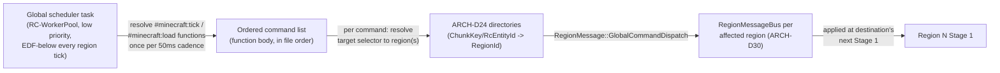
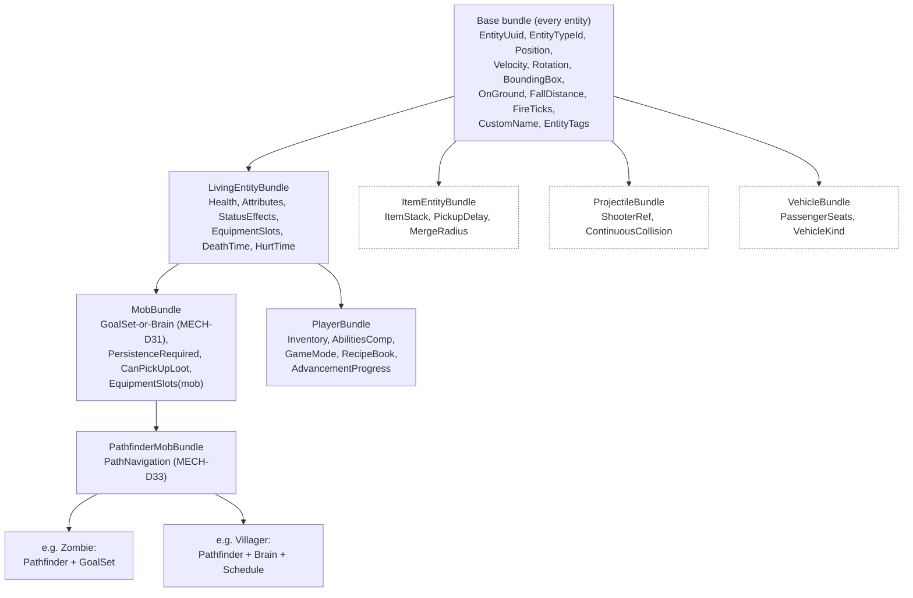

# Game Mechanics

## Purpose

Owns vanilla gameplay parity on the server: every subsystem a player or a redstone contraption can observe — block updates, redstone, fluids, fire/ice/crops/gravity blocks, entities (data, AI, pathfinding, spawning), physics, combat, items/inventories, data-driven content (recipes/loot/advancements/tags), player lifecycle, game rules/difficulty/dimensions/portals, and commands. Fixes the exact algorithm and the exact vanilla-observable behavior per subsystem, and maps every subsystem onto `01-server-architecture.md`'s domain groups (currently eight), eleven-stage tick pipeline, and message-passing substrate. This document is deliberately broad and decision-level; per-subsystem byte/field-level specs are a blueprint-phase deliverable built on top of the decisions fixed here.

## Scope

**In scope:** intra-tick phase ordering for every mechanic and its mapping onto `01`'s `ARCH-D8` domain groups and `ARCH-D12` pipeline stages; block update propagation (neighbor updates, shape updates, block events) and the explicit parity bar for redstone-relevant quirks (quasi-connectivity, locational/update-order behavior, reproduced bug-for-bug); the redstone wire power algorithm and the conditions under which an optimized backend (Alternate Current) may be offered as a non-default mode; cross-partition-border semantics for every mechanic that can reach across a region (or, in cluster mode, node) boundary, and the contract this document imposes on `13-cluster-architecture.md`'s border mechanism; fluids, fire, ice, crops, and gravity-affected blocks; the entity component model (mapping vanilla's Java entity class hierarchy and its NBT/metadata data onto ECS components and bundles), AI (goal selectors and the brain/memory system), pathfinding, and mob spawning (including per-player and cluster-safe global mob-cap accounting); vanilla movement/collision/knockback/projectile/vehicle physics, specified as a shared crate reused by the Phase-2 client; the 1.9+ attack-cooldown combat model, damage/armor/enchantment math, and status effects; items, inventories, container menus and click handling, and item entities; data-driven content (recipes, loot tables, advancements, tags) and its sourcing pipeline; player join/respawn lifecycle, abilities, block-breaking timing, server-authoritative reach/interaction validation; game rules, difficulty, dimensions, and portal linking (including the cluster cross-node teleport requirement); the initial command set and Brigadier-compatible command-tree parsing/serialization.

**Out of scope:** chunk data structures, palettes, and persistence format (`03-world-chunks-persistence.md`); world generation and noise/structure algorithms (`04-worldgen-parity.md`); client rendering (`07-client-architecture.md`); the cluster border-propagation *mechanism* itself, node/proxy topology, and handoff protocol internals (owned unmodified by `13-cluster-architecture.md`; this document states the *contract* mechanics need from that mechanism, not how it is built); packet framing, compression, encryption, and the version-data-generator plumbing (`02-protocol-networking.md`; this document consumes NET-D9's generator output, it does not redefine it); the ECS core, threading model, message substrate primitives, and tick-pipeline stage list themselves (`01-server-architecture.md`; this document is a consumer of `ARCH-D1`–`ARCH-D30`, not a redefiner).

## Decisions

### A. Tick Phase Order & Domain Mapping

| ID | Decision | Rationale |
|---|---|---|
| MECH-D1 | Vanilla's own per-tick phase order (verified against the pinned reference's `ServerLevel.tick()`: tick-counter increment → `#minecraft:tick`-tagged function execution → per-dimension: world border → weather advance → sleep check (the enough-players-sleeping check, which can wake all players and reset the weather cycle, runs before the daylight-cycle advance) → daylight cycle (`tickTime`, which also advances the `/schedule` command queue internally) → scheduled block ticks → scheduled fluid ticks → raids → chunk load-level updates → random-tick chunk iteration (mob spawning, ice/snow, random ticks) → block-change broadcast → POI updates → chunk unload → block-event execution → dragon fight → entity ticking → block-entity ticking → autosave-at-6000-ticks) is the canonical reference order every MECH subsystem's stage placement is checked against. | A single named reference order, cited once, is what every other decision in this document maps onto instead of restating "verified against minecraft.wiki" per row. |
| MECH-D2 | MECH-D1's phases map onto `ARCH-D12`'s eleven stages as: world border/weather/daylight/sleep → Stage 2; scheduled block+fluid ticks (+ the block-event queue, MECH-D11) → Stage 4; random-tick mob spawning/ice/snow/random ticks → Stage 5; entity ticking → Stage 6a/6b; block-entity ticking (furnaces, hoppers, brewing, beacons) → Stage 7; chunk load-level/unload/POI bookkeeping → Stage 9; block-change/broadcast → Stage 11. See [Tick Pipeline Mapping](#tick-pipeline-mapping) for the full table. | Directly discharges `01`'s explicit ask ("the authoritative component list... so RC-Executor's startup conflict graph can be validated against real system declarations") by anchoring every vanilla phase to one exact `ARCH-D12` stage, leaving no subsystem unplaced. |
| MECH-D3 | `#minecraft:tick`/`#minecraft:load` function-tag execution and the `/schedule` command's callback queue are **not** a per-region Stage-2 item. They run on a lightweight, low-priority global scheduler task (analogous to `04`'s worldgen background-work treatment under `ARCH-D20`'s EDF) at the same nominal 50 ms cadence, dispatching each command to whichever region(s) its selector/target resolves to via a new `RegionMessage::GlobalCommandDispatch` variant (see [Global Command Dispatch](#global-command-dispatch-tick-and-load-function-tags)), landing at each affected region's next Stage 1. | A `/scoreboard players add @a ...` inside a `#minecraft:tick`-tagged function must execute exactly once server-wide, not once per region; per-region Stage-2 placement would either require a global tick barrier (rejected by `ARCH-D7`/`CLUSTER-D25`) or silently duplicate/omit effects — routing through the existing message substrate avoids both. |
| MECH-D4 | Gameplay-action packets already decoded by `02` (attack, block-break start/cancel/finish, container click, item use, chat/command dispatch) are applied to World state during **Stage 3 (Network inbound apply)**, matching `ARCH-D12`'s own stage description ("player-parallel drain, deterministic merge by ascending player id") verbatim — not deferred into Stage 6. | Combat, container interaction, and block-breaking are player-triggered, not simulation-driven; Stage 3 is the one stage `01` already scoped to "gameplay-affecting event, applied once per tick," so no new stage or cross-stage plumbing is needed. |
| MECH-D5 | Every vanilla-observable random outcome (loot rolls, enchant-table results, mob loot drops, weather-duration rolls, per-block selection within `ARCH-D14`'s per-chunk random-tick stream, mob-pack-spawn species weighting) is drawn from a hand-implemented `RcRandom`, a bit-exact reproduction of Java's `java.util.Random` 48-bit linear congruential generator (multiplier `0x5DEECE66D`, increment `0xB`, 48-bit mask) — not any crate's default PRNG. `ARCH-D14`'s per-chunk seed `hash(world_seed, chunk_x, chunk_z, tick_counter)` is the seed fed to one `RcRandom` instance per chunk per tick; every other consumer seeds its own instance from vanilla's own documented seed derivation (e.g. position-hash seeding for structure/loot-table randomness) rather than sharing a single sequential stream. | Loot tables, enchanting, and dozens of other vanilla mechanics are specified only in terms of `java.util.Random`'s exact bit sequence; any other LCG or a cryptographic RNG produces a different, non-parity output stream for the identical seed even though the *distribution* would look statistically fine — this is a hard bit-exactness requirement, not a style preference. |
| MECH-D6 | Autosave-interval and per-region dirty-tracking triggers fire at the Stage-9 chunk-serialization snapshot boundary `01` already defines as I/O-free; MECH owns only the *trigger point and dirty-flag semantics* (a region is dirty if any of its Stage-1–Stage-9 systems structurally mutated a chunk or entity this tick), not the on-disk cadence or format, which is `03-world-chunks-persistence.md`'s call (see Interfaces). | Keeps the "who decides *when* to mark dirty" (a gameplay-mechanics judgment — did anything actually change) separate from "who decides *how often* to actually flush to disk" (a storage/durability judgment, sharpened further by `CLUSTER-D17`'s tighter cluster-mode interval). |

### B. Block Updates & Redstone

| ID | Decision | Rationale |
|---|---|---|
| MECH-D7 | **Parity level, stated explicitly:** every redstone-relevant quirk — quasi-connectivity (QC), locational/update-order-dependent behavior, and the specific update-count/ordering behavior underlying bugs like MC-11193 — is reproduced **bug-for-bug** by default. "Bug-for-bug" is scoped to the *documented, deterministic* order `ARCH-D13` already pins (post-placement fan-out west→east→north→south→down→up; neighbor-changed fan-out west→east→down→up→north→south), not to any Java-heap-iteration-order accident that was never specified anywhere — there is nothing to reproduce there because vanilla itself has no such artifact once `ARCH-D13`'s deterministic order is used as the reference. | The project vision names this explicitly; redstone is the one domain players build precision machines against (`ARCH-D13`'s own rationale), and "bug-for-bug" only has meaning relative to a pinned, specified order — `ARCH-D13` already supplies exactly that order. |
| MECH-D8 | **Quasi-connectivity is reproduced exactly, as the generic mechanism it actually is in vanilla — not a per-block special case.** QC falls directly out of vanilla's generic `SignalGetter` relay (`hasNeighborSignal`/`getSignal`/`getDirectSignalTo`): any block whose own activation check queries that relay against a conductor neighbor inherits QC for free, so a block being powered from *below* additionally counts as powered for the purpose of components resting *on top* of it, even though the powering block is not adjacent to the component itself. This project reproduces the relay, not a hand-maintained block list; the pinned reference's own block set exercising it includes at least pistons, dispensers, droppers, note blocks, TNT, `DoorBlock`, `TrapDoorBlock`, `FenceGateBlock`, `RedstoneLampBlock`, `HopperBlock` (inverted: `shouldBeOn = !hasNeighborSignal`), and `BaseRailBlock`. | QC is load-bearing for a large fraction of existing community redstone designs (flying-machine and 0-tick-pulse contraptions in particular); reproducing it as the generic relay vanilla actually implements — rather than a hand-maintained block enumeration — is what guarantees a block this document's authors didn't think to list still gets QC correctly instead of silently regressing it. |
| MECH-D9 | **Block event queue** (vanilla's `BlockEventData`: piston extend/retract, note-block play, chest/shulker-box/ender-chest open-count change, decorated-pot wobble-animation trigger, end-gateway trigger, bell ring, spawner spawn-effect trigger, and the Potent Sulfur Block's own event) is its own explicit sub-phase at the **end** of Stage 4, still inside `ARCH-D13`'s mandatory single-worker sequential collapse, executed after all scheduled block/fluid ticks for that stage have run. The sub-phase drains a **single, live, re-entrant queue** in a `while (!queue.is_empty())` loop, matching vanilla's own `ServerLevel.runBlockEvents()` exactly: a block event fired by another block event's handler during that same sub-phase (e.g. one piston's state change triggering a neighbor-changed check on an adjacent piston, which queues its own extend/retract event) is picked up and processed within the *same* pass, cascading same-tick — the only deferral vanilla applies is rescheduling an event whose target chunk is not currently ticking-with-entities-loaded.** | `ARCH-D12`'s eleven-stage table does not name a block-event stage explicitly; this decision is the concrete placement fixing that gap. Reproducing vanilla's actual same-tick re-entrant cascade — not an invented one-wave-per-tick deferral — is what keeps piston-chain and every other block-event's timing bit-exact against the pinned reference. |
| MECH-D10 | **Stage 4's block-state mutations are applied immediately, inline, block-by-block** — not deferred through `ARCH-D9`'s cross-stage `CommandQueue` sync points. `ARCH-D9`'s deferred-apply rule exists to protect *concurrent* readers across stages/workers; Stage 4 is already `ARCH-D13`-mandated single-worker sequential, so it provides the same-tick visibility guarantee `ARCH-D9`'s sync points exist to manufacture, for free, simply by finishing before Stage 5's `ARCH-D8` full-drain barrier opens. A piston-moved block, a redstone-lit torch, or a block-event's block replacement is therefore visible to Stage 5 onward within the *same* tick — matching vanilla's own single-threaded semantics exactly, and specifically making piston moves visible to Stage 6b's entity-collision resolution in the same tick they occur. | Without this clarification, a literal reading of `ARCH-D9` would put every piston move one full tick behind vanilla, which is an observable parity break large enough to break most piston contraptions; `01-server-architecture.md`'s ARCH-D9 has been amended to state this Stage-4 carve-out directly (see `01`'s Decisions table), so this document's inline-application rule and `01`'s text now agree rather than this being merely a flagged, unapplied suggestion. |
| MECH-D11 | **Redstone wire power algorithm — default backend:** a direct, faithful reproduction of vanilla's own recursive, locational algorithm. Each dust block's power level (0–15) is recomputed as the maximum of: (a) strong power received from an adjacent power source at up to 15, decreasing by exactly 1 per additional horizontal dust block traveled, capped at 0; (b) power received by climbing/descending exactly one block via a diagonal dust connection; (c) QC-derived power (MECH-D8). Recomputation is triggered by `ARCH-D13`'s exact deterministic neighbor-update fan-out order — including the property that a wire's own recomputation reads *possibly-stale* neighbor power values mid-propagation, which is precisely the source of vanilla's locational quirks and is preserved, not corrected. | This is the literal bug-for-bug reproduction MECH-D7 commits to; any "fix" to the staleness (e.g. computing the whole network's fixed point before emitting any update, which is exactly what Alternate Current does, MECH-D12) changes observable update count and timing and therefore fails the parity bar for the default backend. |
| MECH-D12 | **Alternate Current is explicitly not the default.** `SpaceWalkerRS/alternate-current` (GitHub, MIT license) is studied as a documented external algorithm (not consulted as decompiled game source — its own public repository, its architecture read as an allowed source under ASSET-D18(e)) but is **not observably identical** to vanilla by its own stated design goal: it builds the wire network as a whole, computes power via deterministic non-locational flow-direction ordering, and *deliberately* fixes bug MC-11193 by emitting fewer, differently-ordered block/shape updates than vanilla. Because a Block Update Detector (BUD) switch's entire mechanism is counting block updates, this difference is externally observable, not an implementation detail — so it fails the "permitted only if observably identical" bar this project sets. It is offered strictly as an explicit, non-default, world-level `fast_redstone` opt-in (mirroring the long-established Carpet-mod `fastRedstoneDust` rule as prior art for an accepted, clearly-labeled vanilla-fidelity trade-off), which server operators enable knowingly and which is documented as breaking BUD-switch- and update-order-dependent contraptions. | Directly answers the task's explicit permission clause: research shows AC is *not* observably identical, so it cannot be silently adopted as the default — the only compliant path is an opt-in, clearly-labeled deviation, not a hidden performance substitution. |
| MECH-D13 | Redstone component behaviors — repeater (2–8 game-tick configurable delay, in 2-tick increments — the `DELAY` block-state property itself ranges 1–4, but `RepeaterBlock.getDelay` doubles it before scheduling, so the actual scheduled-tick delay is `DELAY × 2`; lock via side-input rising edge, flip-flop-safe rapid-toggle handling), comparator (subtraction/comparison mode, container-fullness-to-signal-strength read using each container's data-driven capacity/fill rules, MECH-D48), redstone torch (burnout-after-rapid-toggle "toasting"), and piston (extend/retract, push/pull, max 12-block push chain, sticky-piston pull, honey-block adhesion, entity displacement) — are each their own Stage-4 system, sequenced within `ARCH-D13`'s single-worker pass in vanilla's own tick-priority-queue order (`EXTREMELY_HIGH`/`VERY_HIGH`/`HIGH`/`NORMAL`, FIFO within a level). Each behavior is exposed through an `Identifier`-keyed per-target behavior-dispatch registry (mirroring MOD-D6's convention) that a mod's MOD-D35 override/wrap call can target; the piston system's push/pull/classify logic specifically is registered on that seam as a public, generic entry point — never a private, non-generic helper — satisfying MOD-D45 Tier 2's structural precondition for contraption-mod support. | Reuses `ARCH-D13`'s already-pinned priority semantics rather than inventing a second ordering scheme; keeping each component's behavior as a separate system (rather than one monolithic "redstone" system) keeps `ARCH-D8`'s conflict-graph declarations honest per component type. |
| MECH-D14 | Piston pushes that would extend past the pushing region's own chunk ownership boundary are treated by the push algorithm as an impassable obstruction — an ordinary "blocked, cannot extend" failure, identical in kind to vanilla's own too-many-blocks/unmovable-block failure case. Cross-partition **block** movement (as opposed to entity movement, MECH-D19) is out of scope for Phase 1. | Region cells are 256×256 blocks (`ARCH-D6`); a 12-block-max push chain can only reach a border if a contraption is deliberately built within 12 blocks of a cell edge, and `CLUSTER-D8`'s co-location migration self-heals any such contraption onto one node once its own redstone activation generates border traffic — true cross-partition block ownership transfer would require Stage-8/Stage-9 agreement between two regions mid-tick, a materially harder problem not justified by this narrow, self-healing edge case. |
| MECH-D15 | Neighbor-update (`neighborChanged`-equivalent) and shape-update (`updateShape`-equivalent) are kept as two distinct, separately-dispatched signals exactly as vanilla does: a neighbor update tells a block "something adjacent changed, decide if you still make sense here" (may trigger the block to break, e.g. a torch on a removed wall) while a shape update tells a block "an adjacent block's *collision shape* changed, recompute your own connection/shape state" (e.g. a fence recomputing which sides it visually connects to) without necessarily implying the block should re-evaluate its own validity. Both ride `ARCH-D13`'s fan-out order. | Collapsing these into one signal (a common simplification in non-vanilla reimplementations) breaks specific vanilla behaviors where a block's shape changes without its validity being re-checked, or vice versa; keeping them distinct is a zero-cost fidelity choice at the decision level. |
| MECH-D16 | Leaf decay is **two distinct mechanisms**, not one scheduled-tick check: (a) a `DISTANCE` block-state property (graph-distance to the nearest log, range 0–7 — 0 means the block itself is a log or is tagged `PREVENTS_NEARBY_LEAF_DECAY`) is maintained by **scheduled-tick incremental relaxation** in Stage 4 — a neighbor shape-update schedules a 1-tick recheck, which recomputes `DISTANCE = min(6 face-neighbors' DISTANCE) + 1`, propagating one hop per scheduled tick rather than searching outward; the maximum log-to-leaf graph distance still safe from decay is therefore 6, not a fixed-radius search, and there is no BFS or 9×9×9-style per-tick recheck anywhere in the mechanism. (b) The actual decay — leaf removal and its item drop — is **ordinary Stage-5 random-tick** behavior, gated by `DISTANCE == 7 && !PERSISTENT`: only a non-persistent leaf block that relaxation has already pushed to the maximum distance is even eligible to roll decay on a random tick. | Vanilla's own `LeavesBlock` implements these as genuinely separate mechanisms — a cheap incremental graph-distance relaxation maintaining state every scheduled tick, and a normal random-tick probabilistic removal gated on that state — reproducing both, in their own stages, is what avoids both the cost of a per-tick radius search and a false parity claim that decay itself is scheduled-tick-driven. |

### C. Cross-Border Semantics (Cluster Mode)

| ID | Decision | Rationale |
|---|---|---|
| MECH-D17 | **General contract:** every mechanic whose effect can propagate across a region (monolithic mode) or node (cluster mode) boundary must be expressible as one of exactly two shapes: (a) a **point-propagation** mechanic — a single block/fluid/light update crossing one border cell at a time — carried by `ARCH-D11`'s existing `BorderUpdateEvent` halo mechanism with its documented one-tick delay, or (b) a **wide-read/wide-write** mechanic — one that must atomically read and/or mutate a multi-block radius that can extend past a single halo row — carried by a new, MECH-owned `RegionMessage` variant (see MECH-D18) applied at the destination's next Stage-4 sub-step, with the same one-tick delay contract. No mechanic is permitted to assume synchronous same-tick visibility across a border; any contraption whose *correctness* (not just its timing) requires that is expected to self-heal onto one partition via `ARCH-D6` (monolithic) or `CLUSTER-D8` (cluster) hot-border co-location, exactly as `ARCH-D11` already documents for redstone circuits. | This is the single organizing rule the rest of Section C instantiates; stating it once, up front, means every subsequent row is a one-line classification (point vs. wide) rather than a re-derivation. |
| MECH-D18 | **Wide-radius cross-border effects** (TNT/creeper/bed/respawn-anchor explosions, whose resistance-raycast and block-removal/entity-damage radius — up to 12 blocks for a charged creeper — can exceed the depth of `ARCH-D11`'s single-row border halo) are computed **entirely by the region containing the explosion's epicenter**, using its halo for READ-side resistance lookups, and are carried to every affected neighbor region via a new `RegionMessage::ExplosionEffect { epicenter, power, affected_blocks: Vec<(ChunkKey, BlockPos, RemovedBlockState)>, entity_damage: Vec<(RcEntityId, f32)> }` variant, applied as a Stage-4 sub-step at each destination region's next tick. This requires `ARCH-D11`'s border halo depth to widen from "outermost row" to a full 16-block (one-chunk) neighbor slice specifically for explosion-resistance reads — incorporated into `01-server-architecture.md`'s ARCH-D11 text (see Interfaces), since a single-row halo is insufficient for any explosion whose radius exceeds one block of cross-border depth. | A read-only halo alone cannot carry the *write* side of a cross-border explosion (block removal, entity damage in the neighbor's own territory); batching the whole explosion into one message — rather than one `BorderUpdateEvent` per destroyed block — keeps the +1-tick contract intact without spamming the message substrate with hundreds of tiny events for one explosion. |
| MECH-D19 | Hopper item-transfer chains crossing a region/node border reuse `ARCH-D17`'s already-specified mechanism unmodified: the border hop itself is carried by `BorderUpdateEvent`, adding exactly +1 tick of latency at that one hop on top of vanilla's own 8-tick base transfer cooldown per hop. This is accepted as a documented, bounded parity deviation. | Consistent with `ARCH-D17`'s own text ("Hopper chains crossing a region border use the ARCH-D11 border-event mechanism"); a hopper clock's own 8-tick granularity already dwarfs a single +1-tick deviation at one border hop, and `CLUSTER-D8` self-heals any contraption hot enough for the deviation to matter. |
| MECH-D20 | Piston-launched or otherwise-moving **entities** (as opposed to blocks, MECH-D14) crossing a region/node border are ordinary `ARCH-D10` cross-region entity transfers — no new mechanism. Fluid flow crossing a border is an ordinary chain of neighbor-block updates and therefore already covered by MECH-D17(a)/`ARCH-D11` — a flowing-water or lava front reaching a border is indistinguishable, mechanically, from a redstone signal reaching one. | Both cases are direct instantiations of mechanisms `01` already built generically (`ARCH-D10` for owned entities, `ARCH-D11`/`BorderUpdateEvent` for point-source block state propagation) — no new plumbing, only confirmation that MECH's specific mechanics ride the existing rails. |
| MECH-D21 | Minecart/boat physics and rail-network continuity across a border are treated identically to any other moving entity (MECH-D20): the vehicle entity transfers via `ARCH-D10` when its position crosses; rail block-state (powered rail activation, detector rail triggering) is a MECH-D17(a) point-propagation case riding `BorderUpdateEvent`. | No rail-specific mechanism is needed once vehicles are recognized as ordinary entities and rail power/detection as ordinary block state — this row exists to make that classification explicit rather than leave it implicit. |
| MECH-D22 | Redstone-adjacent cluster tuning: a border sustaining `>10 BorderUpdateEvent`/tick average over 40 ticks already triggers `ARCH-D6`'s monolithic merge or `CLUSTER-D8`'s cross-node co-location per `01`/`13`'s existing thresholds. MECH imposes no additional numeric threshold of its own — every mechanic in this section rides that same, single hot-border detector rather than each mechanic inventing its own sensitivity trigger. | One hot-border signal, reused by every mechanic, avoids N independently-tuned thresholds (redstone vs. hoppers vs. explosions) that could disagree with each other about whether a given border is "hot." |
| MECH-D23 | A contraption within 16 blocks of a region/node border is not guaranteed bit-identical to a contraption built entirely within one partition until it has generated enough cross-border traffic to trigger self-healing co-location (MECH-D22); this is a documented, bounded window, not an unbounded one — the trigger conditions are the same load-tested thresholds `01`/`13` already calibrate for their own purposes. | States the honest boundary of the parity guarantee explicitly rather than implying zero-latency correctness at every possible border position from tick one; matches the same honesty `ARCH-D11`'s own rationale already models ("no boundary-crossing behavior can be bit-identical by construction... this rule makes the deviation the smallest possible"). |

### D. Fluids, Fire, Ice, Crops, Gravity Blocks

| ID | Decision | Rationale |
|---|---|---|
| MECH-D24 | Fluids run on vanilla's own scheduled-tick cadence, not random tick: water schedules its next spread/equalize check 5 ticks out, lava 30 ticks out in normal dimensions and 10 ticks out wherever the dimension's `minecraft:gameplay/fast_lava` attribute (MECH-D66's data-driven `attributes` map, `true` for the Nether) is set — riding Stage 4's scheduled-tick queue (MECH-D11's same mechanism, different block category). Source-block conversion checks **only the four cardinal-adjacent neighbors** (never diagonals) for two-or-more same-fluid sources, additionally gated on the block directly below being solid or itself a same-type source, and on the `waterSourceConversion`/`lavaSourceConversion` gamerule — diagonal neighbors never trigger regeneration. Lava/water contact conversion is driven entirely by the **lava block's own state and flow direction**, not water's: source lava with water in any of its 4 horizontal neighbors or directly above converts itself in place to obsidian; flowing lava under the same condition converts to cobblestone; lava flowing downward into a water-occupied destination converts that destination to stone. Water still extinguishes fire and converts netherrack-adjacent lava per vanilla's own table. All of this is evaluated inline within that same scheduled tick, not as a separate pass. | Fluids and redstone share the identical scheduled-tick/priority-queue infrastructure (`ARCH-D13`) — no separate fluid-specific scheduler is needed, only a different default delay constant per fluid and dimension attribute; sourcing the fast-lava trigger from the dimension-type `attributes` map (rather than a removed boolean `ultrawarm` field) keeps this decision consistent with MECH-D66's corrected data model. |
| MECH-D25 | Fire tick (spread and burnout) is scheduled-tick-driven, with per-block-type flammability (catch-chance) and fire-spread-chance tables applied at each scheduled check (both tables are vanilla constants, sourced per MECH-D52's data pipeline rather than hand-transcribed here); fire damage to entities standing in fire/lava is applied during Stage 3's combat/interaction pass if player-caused this tick, otherwise during Stage 6b's physics pass as ordinary environmental damage. | Splitting "did a player's action just set this entity on fire" (Stage 3) from "is this entity still standing in fire this tick" (Stage 6b) matches MECH-D4's own Stage-3-for-player-actions / Stage-6-for-simulation split rather than inventing a third fire-specific stage. |
| MECH-D26 | Ice/snow **melting** is ordinary Stage-5 random-tick behavior (`ARCH-D14`'s per-chunk seeded stream), exactly like any other per-candidate-block random tick: biome temperature and light-level checks run per ice block hit by the random-tick draw. Ice/snow **formation** is a genuinely separate mechanism — vanilla's own `tickChunk()` runs a distinct precipitation step *before* the ordinary random-tick block loop, gated by its own independent roll (`random.nextInt(48) == 0`, once per `randomTickSpeed` iteration) and, on success, touches exactly **one column position** (the chunk heightmap's top block) rather than scanning per-candidate blocks; this document places that step as its own Stage-5 sub-phase, ordered before the random-tick block loop, not folded into it. Powder snow and frost-walker-enchant interactions are handled as ordinary Stage-6 (entity) and Stage-4 (block replace) events respectively, not folded into either ice/snow pass. | Vanilla implements melting via the same generic random-tick mechanism as crop growth and leaf decay's random-tick half, but formation via its own distinct, once-per-chunk-per-tick precipitation roll — collapsing both into one per-candidate-block random-tick pass would both mis-model formation's actual probability (a per-chunk roll, not a per-block one) and target the wrong block (the heightmap top, not an arbitrary candidate). |
| MECH-D27 | Crop growth (age-property increment, bonemeal-driven skip-ahead) is random-tick-driven (Stage 5); farmland hydration (moisture level 0–7, refreshed by scanning for water within the vanilla-documented volume — `BlockPos.betweenClosed(pos.offset(-4,0,-4), pos.offset(4,1,4))`, a 9×9×2 volume covering the farmland block's own Y-level and exactly one level *above* it, never below, with a Chebyshev/square horizontal reach — dx and dz each independently ranging -4..4, not a Manhattan-distance diamond) is checked as part of the same random-tick pass rather than a separate scheduled check, matching vanilla's own `FarmBlock` implementation shape. | Keeping hydration-refresh and growth-check in the same random-tick pass (rather than splitting them across stages) avoids a farmland block needing to coordinate two independently-scheduled passes that vanilla itself runs together. |
| MECH-D28 | Gravity-affected blocks (sand, gravel, anvils, concrete powder, dragon egg on right-click) are evaluated for "should I fall" via a **2-game-tick scheduled check** (vanilla's own `FallingBlock.onPlace`/`updateShape` default `getDelayAfterPlace()`, riding Stage 4's scheduled-tick queue, MECH-D11's same mechanism — not a same-tick/zero-tick check; the dragon egg overrides this to a 5-tick delay) rather than at Stage 6 or as a bolted-on special case: on a positive check, the block schedules the spawn of a `FallingBlockEntity`-equivalent — an ordinary ECS entity carrying `BlockState` + `FallDistance`, ticked by the normal Stage-6b physics pipeline like any other entity, and converted back to a placed block (or an item-entity drop, or anvil/landing damage to entities below) on landing during that same Stage-6b pass. **Scaffolding is a structurally separate mechanism**, not an instance of this pattern: it does not extend the falling-block behavior at all, instead maintaining its own per-block `distance` state (0–7, propagated from neighbors, re-evaluated every tick via a constant 1-tick reschedule — the same shape as MECH-D16's leaf-decay distance-graph relaxation) and spawning a `FallingBlockEntity`-equivalent only once that distance reaches 7. | Treating a falling block as "a block for exactly one scheduled-tick check, then an ordinary physics entity" reuses MECH-D36/D38's shared `rc-physics` movement/collision code unmodified instead of writing bespoke falling-block kinematics; matching vanilla's own always-scheduled, never-same-tick trigger — including the dragon egg's distinct 5-tick delay — and modeling scaffolding as its own distance-graph mechanism rather than forcing it through the falling-block path, is what keeps both families of gravity-affected blocks bit-exact rather than merely similar. |

### E. Entities: ECS Mapping, Data, AI, Pathfinding, Spawning

| ID | Decision | Rationale |
|---|---|---|
| MECH-D29 | Vanilla's deep Java entity class hierarchy (`Entity` → `LivingEntity` → `Mob` → `PathfinderMob` → concrete type, plus parallel branches for projectiles, vehicles, block/item entities) is mapped onto ECS **composition, not inheritance**: a fixed base component bundle applies to every entity, and each rung of the vanilla hierarchy contributes one additional component bundle, assembled per concrete vanilla entity type into the bundle `bevy_ecs::World::spawn` receives. See [Entity Composition Model](#entity-composition-model) for the bundle table and diagram. | ECS has no inheritance primitive and should not simulate one; composition over vanilla's hierarchy gives every entity exactly the components its vanilla capabilities require (and no others), which is both the idiomatic ECS approach and what makes `ARCH-D8`'s per-component `Access` declarations meaningful. |
| MECH-D30 | **Entity data has three independent serialization targets from one canonical component**, never three separately-maintained copies: NBT (save format, owned format-wise by `03-world-chunks-persistence.md`), entity metadata (protocol wire sync for client rendering, owned format-wise by `02-protocol-networking.md`), and neither (purely server-internal derived state, e.g. cached pathfinding search state). An in-repo derive-macro crate, `rc-entity-macros`, lets a component field declare `#[nbt(name = "...")]` and/or `#[net_metadata(index = N, kind = ...)]`; the base vanilla entity NBT field set (`Motion`, `Rotation` as `[Yaw, Pitch]`, `Fire`, `Air`, `OnGround`, `Invulnerable`, `PortalCooldown`, `UUID`, `CustomName`, `CustomNameVisible`, `Silent`, `NoGravity`, `Glowing`, `TicksFrozen`, `HasVisualFire`, `Tags`, `Passengers` — `FallDistance` is deliberately absent from this list: the pinned reference no longer persists it, having moved fall distance to a plain runtime-only field) becomes one base component bundle tagged accordingly. | This is the concrete mechanism answering "research how vanilla entity NBT + metadata map to components": a single source of truth per field, serialized two ways by attribute rather than by hand-written dual-maintenance code, is what eliminates save/network drift as a class of bug entirely. |
| MECH-D31 | **AI is two coexisting, architecturally distinct systems**, matching vanilla exactly rather than unifying them: (a) the legacy **Goal/GoalSelector** priority system (used by most hostile/passive mobs) — an ordered `GoalSet` component of goal entries, each with a priority number, a `Flags` bitset (`MOVE`/`LOOK`/`JUMP`/`TARGET`) for mutual exclusion, and `can_use`/`can_continue_to_use` predicates re-evaluated every Stage-6a tick; (b) the **Brain** memory/sensor/activity system (villagers, piglins, hoglins, axolotls, frogs, allays, goats, sniffers, and all other 1.14+-introduced mobs that use it in vanilla) — a `Brain` component holding an expiring `MemoryModuleType → value` store, a fixed list of `Sensor`s re-run on their own vanilla-specified cadence writing memories, and `Activity`/`Behavior` selection gated by both memory state and a time-of-day `Schedule` (e.g. villager's default schedule). Which system a given vanilla entity type uses is a fixed, per-type fact sourced from the same data pipeline as MECH-D52, not a per-instance choice. | Unifying these into one generic "AI system" would be a redesign, not a reimplementation — vanilla mobs' precise behavioral quirks (a villager's schedule-gated Brain vs. a zombie's flag-exclusive GoalSelector) are observably different in ways players and datapacks depend on, and both systems are well-documented enough (public wiki + black-box behavior) to reproduce faithfully as two systems rather than force-fit into one. |
| MECH-D32 | Both AI systems run entirely within **Stage 6a** (read-only, entity-parallel per `ARCH-D15`): goal/behavior *selection* (deciding what a mob wants to do this tick) is pure computation over a read-only snapshot of nearby entity/block state, producing a chosen-action command consumed by Stage 6b's movement/action integration — never mutating World state directly from within Stage 6a. | Directly instantiates `ARCH-D15`'s own split (6a read-only/parallel selection, 6b integration + sequential reconciliation) for the AI-specific case, keeping AI decision-making inside the parallelism budget `01` already allocated for it. |
| MECH-D33 | **Pathfinding** is A* over a navigation graph built from a `NodeEvaluator` trait mirroring vanilla's own `GroundPathNavigation`/`FlyingPathNavigation`/`WaterBoundPathNavigation`/`AmphibiousPathNavigation` split: one evaluator implementation per vanilla navigation category, each assigning a per-block-type cost/malus drawn from a `BlockPathTypes`-equivalent classification (e.g. `DANGER_FIRE`, `WALKABLE`, `TRAPDOOR`, `FENCE`, `DOOR_OPEN`, `DAMAGE_CACTUS`) sourced from the same MECH-D52 pipeline. Which evaluator a mob type uses, and any mob-specific override (spiders climbing, endermen's teleport-assisted repositioning, which is *not* modeled as A* at all but as its own targeted-teleport behavior), is a fixed per-type fact. | Reproducing vanilla's own multi-evaluator structure (rather than one generic pathfinder) is what reproduces vanilla's actual per-mob-type navigation quirks (why a strider paths over lava, why a bee paths through daylight-avoiding routes) instead of an approximation that merely "looks similar." |
| MECH-D34 | **Mob spawning** reproduces vanilla's dual-cap system exactly: **eight** categories (`monster` cap 70, `creature` cap 10, `ambient` cap 15, `water_creature` cap 5, `water_ambient` cap 20, `underground_water_creature` cap 5, `axolotls` cap 5 — split out from `water_creature` as its own natural-spawn category with its own per-player and global cap — `misc` uncapped) each with (a) a **per-player local cap** — non-persistent mobs within 128 blocks of a given player count against that player's own cap per category, and spawning proceeds in a chunk only if at least one player with that chunk in range has not filled their local cap — and (b) a **global cap** scaled by eligible-chunk count, `globalCap = categoryCap × (eligibleChunks / 289)`, where eligible chunks are counted within the 17×17-chunk (289-cell) square around each player exactly as vanilla's random-tick chunk-selection already does. Hostile/ambient/water categories attempt a spawn cycle every tick; `creature` attempts once per 400 ticks. Pack-spawn mechanics reproduce vanilla's own algorithm exactly: each pack member's position is a **cumulative random walk** from the *previous* member's position (`x += random.nextInt(6) - random.nextInt(6)`, independently per axis, each iteration) rather than an independent offset from one fixed pack center — producing vanilla's actual drifting cluster shape, not a tighter fixed-center scatter — plus opaque-full-cube pack cancellation and weighted species selection. | This is the exact, wiki-verified per-player-cap algorithm vanilla has used since 1.18 specifically to prevent one AFK player's local farm from starving spawns everywhere else on the server — reproducing anything simpler (e.g. a single global counter with no per-player locality, or a fixed-center pack-offset model that doesn't drift the way vanilla's cumulative random walk does) would be a materially different, exploitable gameplay experience. |
| MECH-D35 | **Cluster-safe mob-cap accounting:** the per-player local cap is computed entirely from the owning (and, for a player near a border, directly-bordering) region(s)' own live entity counts — no cross-cluster aggregation needed, since a player is owned by exactly one region/node at a time (`ARCH-D10`) and MECH-D18's border-halo widening already gives visibility into immediately adjacent territory. The **global** cap, by contrast, is a genuinely server-wide aggregate ("all non-persistent loaded mobs," per category) and is maintained as a new `RegionMessage::MobCensusReport { region: RegionId, counts: [u32; 7] }` variant, broadcast by every live region every 20 ticks (1 s) to a lightweight `GlobalMobCensus` resource that sums the latest report per region. Spawn decisions consult this resource's last-known aggregate, accepting up to ~1 s of staleness on the *global* cap only — the per-player local cap remains exact and immediate. In cluster mode this is the identical mechanism, routed over `NetworkTransport` instead of `InProcessTransport` with zero cluster-specific code. | Directly answers the task's explicit note that "mob caps are per-player, cluster-safe accounting via message substrate": the per-player half needs no new mechanism at all, and the global half is a natural, bounded-staleness extension of the existing `RegionMessage` substrate — exactly the extension point `ARCH-D25` reserves (see Interfaces, `01` currently frames that extension point as `13`'s alone; this document exercises it too). |

### F. Physics (Shared Crate)

| ID | Decision | Rationale |
|---|---|---|
| MECH-D36 | All movement/collision/knockback/projectile/vehicle physics lives in a standalone, no-ECS-dependency crate, `rc-physics` (`crates/physics/`), consumed by both `rc-server` (Stage 6b simulation, authoritative) and, in Phase 2, the client's local prediction/reconciliation loop. The crate's public API takes plain position/velocity/bounding-box/world-shape-query inputs and returns a new position/velocity — no `bevy_ecs::World` reference crosses its boundary, so the identical code compiles and runs unmodified in a client binary that has no ECS at all. | Directly satisfies the task's explicit requirement ("this code must live in a shared crate reused by the Phase-2 client for prediction"); a hard no-ECS boundary is what actually guarantees reuse rather than merely intending it — an API that took `&World` would silently couple client prediction to the server's ECS. |
| MECH-D37 | **Gravity/drag integration** (verified against community-maintained, wiki-cited movement-formula references, cross-checked against `mcpk.wiki`'s Horizontal/Vertical Movement Formulas pages): each tick, an airborne entity's vertical velocity is reduced by a per-entity-category gravity constant (0.08 blocks/tick² for players/most mobs; distinct, smaller constants for items, arrows, and other projectile categories — the full per-category table is a blueprint-phase deliverable, MECH-D37 fixes only the algorithm shape and the player/mob baseline), then multiplied by a drag factor (0.98 vertical for most entities). Horizontal velocity is multiplied by the slipperiness of the block the entity was standing on *before* this tick's move if grounded (0.6 default, 0.8 slime block, 0.98 ice, 0.989 blue ice), or by 0.91 if airborne. | These are the load-bearing constants for every physics-dependent parity claim (piston launches, TNT jumps, ice-boat racing, elytra flight all key off exact drag/friction values); citing the algorithm *shape* precisely now and deferring the full per-entity-category constant table to the blueprint phase matches this document's stated altitude ("detailed per-subsystem specs come later"). |
| MECH-D38 | **Collision** uses a `VoxelShape` representation identical in spirit to vanilla's: each block state owns a set of axis-aligned bounding boxes (not a single box — stairs, slabs, fences, and dozens of other shapes are multi-box). Movement resolution is a swept-AABB clip against every block shape overlapping the entity's motion-extended bounding box, axis-resolved sequentially (vanilla's own `Entity.collide` order — Y, then X, then Z — enabling smooth step-up onto slabs/stairs; exact axis order to be reconfirmed by black-box capture at blueprint time rather than asserted with false confidence here). | Multi-box shapes and sequential per-axis clipping (rather than a single combined-box or simultaneous-axis resolution) are what produce vanilla's actual "smoothly walk up a half-slab, catch on a full step" collision feel — a simplified single-AABB model is a common and immediately-noticeable non-parity shortcut this decision rules out. |
| MECH-D39 | **Block collision-shape source data** is sourced from (a) minecraft.wiki's per-block documented collision geometry as the primary reference for special-shaped blocks (stairs, slabs, fences, walls, trapdoors, etc., most of which already have pixel-precision documented shapes), and (b) an in-repo black-box shape-extraction harness, `xtask extract-shapes`, extending `02-protocol-networking.md`'s `NET-D9` pipeline: an automated test client, driven against a real, legally-run vanilla server, walks/collides against every block state and records the resulting bounding-box-clamped position deltas, resolving any disagreement with the wiki in favor of the harness's own live-measured behavior. Neither source touches decompiled game source. Output is committed only as generated Rust data, per `NET-D10`'s established commit policy. | Mojang's `--reports` data generator does not dump collision geometry; black-box behavioral observation against a legally-run server (an allowed source under ASSET-D18(d)) is the source used here, reusing `NET-D9`'s existing "local, developer-run, never-committed-raw" pipeline shape rather than inventing a parallel one. |
| MECH-D40 | **Knockback**: base horizontal knockback velocity is derived from the attacker's `attack_knockback` attribute plus any Knockback-enchantment levels on the weapon, applied along the horizontal vector from attacker to target, with a fixed vertical component (reduced if the target is already airborne) and a flat sprint-attack bonus. Exact constants (base 0.4 horizontal units, sprint bonus, vertical component, and their exact order of combination with resistance/knockback-resistance attribute reduction) are a blueprint-phase deliverable sourced from the same wiki + black-box-capture pair as MECH-D39, not hand-derived in this document. | Knockback constants have shifted subtly across versions historically and are exactly the kind of numeric-precision fact this document's own conventions push to the blueprint phase rather than risk transcribing from stale training data; fixing the *algorithm shape* (direction vector + fixed vertical + sprint bonus + attribute-based reduction) now is enough to unblock architecture work. |
| MECH-D41 | **Projectiles** (arrows, tridents, snowballs, fireballs, fishing bobbers) integrate under `rc-physics` with their own drag/gravity constants and vanilla's arc-trajectory shooting-power model (bow charge time → initial velocity), and use continuous (ray-based) collision detection against entity/block shapes rather than the discrete per-tick AABB overlap check used for living entities — matching vanilla's own `ProjectileUtil`-class distinction between the two collision styles, which exists specifically because fast-moving thin projectiles tunnel through a discrete per-tick check at typical arrow speeds. | Reusing the living-entity discrete-collision path for projectiles would produce observably wrong behavior (arrows passing through thin targets or walls at range) — this is a real algorithmic fork vanilla itself makes, not an optional refinement. |
| MECH-D42 | **Vehicles** (minecarts, boats, horses/other rideable mobs) reuse the same `rc-physics` collision/movement core with vehicle-specific input mapping (rider steering input replaces AI/network movement input) and vehicle-specific friction/speed-cap constants (rail-slope acceleration for minecarts, water-buoyancy for boats). A ridden entity's position is derived from its vehicle's position plus a fixed per-vehicle-type passenger-seat offset, computed once per tick after the vehicle's own movement resolves, never independently integrated. | Deriving passenger position from the vehicle (not integrating it separately) is what prevents a passenger's own physics step from ever disagreeing with their vehicle's — the exact class of bug an independent-integration design would risk. |

### G. Combat

| ID | Decision | Rationale |
|---|---|---|
| MECH-D43 | **Attack cooldown (1.9+ model)** is reproduced exactly: every weapon has an `attack_speed` attribute-derived cooldown period `T` (in ticks); `t` ticks after the previous attack, a new attack's damage multiplier is `0.2 + ((t + 0.5) / T)² × 0.8`, clamped to `[0.2, 1.0]` in effect since `t` cannot exceed `T` under normal input. A critical hit requires: falling (`fallDistance > 0`), not on ground, not on a ladder/vine, not in water, not a passenger, not sprinting, the target is a `LivingEntity`, and the attacker is not restricted by Blindness (vanilla's mobility-restricted check is exactly `hasEffect(MobEffects.BLINDNESS)` — there is no elytra/gliding check anywhere in vanilla's crit path); the attack-strength threshold is `attackStrengthScale > 0.9` (strict greater-than, exactly `0.9`, not an approximate value needing later pinning). A critical hit multiplies post-cooldown-scaled damage by 1.5 and applies extra upward knockback; enchantment bonus damage (Sharpness/Smite/Bane of Arthropods) is affected by the same cooldown scaling but "not as severely" as base damage, per vanilla's documented split. | This is the exact formula (verified against minecraft.wiki's Damage article) underlying every PvP and mob-farm timing expectation since the 1.9 Combat Update; approximating it (e.g. a flat damage-per-hit with no cooldown scaling) would be one of the single most noticeable parity failures a player could hit. |
| MECH-D44 | **Damage order of operations**, per hit: base weapon damage → add Strength/Weakness potion flat modifiers → apply the critical-hit ×1.5 (if applicable) → add enchantment bonus damage (Sharpness et al., cooldown-scaled per MECH-D43) → apply MECH-D43's attack-cooldown multiplier to the *player-caused melee* portion → reduce via armor-toughness (MECH-D45's armor formula) → reduce via Resistance status effect (flat percentage per level) → reduce via enchantment protection (MECH-D45's EPF formula) — Resistance is applied strictly before enchantment protection, never simultaneously or in the reverse order — → apply Absorption as an additional health buffer consumed before real health, tracked and depleted separately. | Order matters for edge cases (a critical hit interacting with a barely-charged attack, Resistance stacking with armor, or a Protection-enchanted piece interacting with an active Resistance potion) that vanilla's own implementation resolves in a fixed sequence — stating the sequence explicitly, including exactly where enchantment-protection reduction falls relative to Resistance, is what makes this reproducible rather than "approximately similar." |
| MECH-D45 | **Armor formula** (verified against minecraft.wiki's Armor article): effective armor points `EA = min(20, max(armor / 5, armor − 4 × damage / (toughness + 8)))`; damage after armor `= damage × (1 − EA / 25)`. Enchantment protection (Protection, Blast/Projectile/Fire Protection, Feather Falling — each contributing an Enchantment Protection Factor, EPF, summed across all worn armor pieces and capped at 20) is applied as a second, independent multiplicative reduction `× (1 − min(20, EPF) / 25)`. | This is the exact, wiki-cited formula (both the armor-toughness interaction and the separate 20-point-capped enchantment-protection factor) — armor's diminishing effectiveness against high-hit damage specifically because of the toughness term is a well-known, players-rely-on-it mechanic that a simplified flat-percentage model would silently break. |
| MECH-D46 | **Status effects** are a `StatusEffects` component holding a list of `(EffectType, amplifier, remaining_duration_ticks, ambient, show_particles, show_icon)` entries, applied/removed via the same Stage-3 (player-caused, e.g. potion drink/splash) or Stage-6 (environmental, e.g. wither-rose contact, beacon-radius application) split MECH-D25 already uses for fire. Instant effects (Instant Health/Harm, and any other zero-duration effect) apply their full effect once, immediately, on the same stage they were granted, rather than entering the duration-ticking list at all. | Reuses the already-established player-caused-vs-environmental stage split instead of inventing a status-effect-specific one, and explicitly separating instant from duration-based effects avoids a whole class of "why did this Instant Damage potion tick twice" bug that a naive unified representation invites. |

### H. Items, Inventories, Container Menus

| ID | Decision | Rationale |
|---|---|---|
| MECH-D47 | **Item stack data** uses the post-1.20.5 **data component** model (`minecraft:` namespaced structured components — `enchantments`, `custom_data`, `damage`, `unbreakable`, `food`, `attribute_modifiers`, etc. — replacing the legacy free-form NBT `tag` compound that predates it), matching NET-D1's pinned protocol 776 target exactly. An `ItemStack` is a `(ItemId, count, ComponentMap)` value where `ComponentMap` is a sparse, type-erased map keyed by a data-generator-sourced component-type registry (MECH-D52's pipeline), not a hand-maintained enum — new vanilla components added in a future version-bump (`NET-D2`) require only a data re-run, not new match arms. | Item NBT-as-freeform-tags is obsolete as of the very protocol version this project targets; modeling `ItemStack` around the current data-component system (rather than the legacy format, which would be simpler to reason about but wrong for 26.2) is a direct, load-bearing consequence of `NET-D1`'s already-pinned version. |
| MECH-D48 | **Inventories** are a fixed-capacity slot-array component per container kind (player: 36 main + 4 armor + 1 offhand + 1 body-armor slot (slot 41, `EquipmentSlot.BODY`) + 1 saddle slot (slot 42, `EquipmentSlot.SADDLE`) — 43 total slots — + 2×crafting-grid-with-result; chest: 27/54; furnace: 3; brewing stand: 5; etc.), each slot an `Option<ItemStack>`. A container **menu** (the transient, per-open-session view combining a block/entity's own inventory with the opening player's inventory, e.g. a crafting-table menu) is a separate, non-persistent component created on open and destroyed on close — it is never itself saved, only the underlying inventories it references are. | Mirrors vanilla's own `Container`(inventory)/`AbstractContainerMenu`(open-session view) split exactly — collapsing them into one persisted structure would either lose the "menu closes, state doesn't" behavior or accidentally persist transient UI state. |
| MECH-D49 | **Click handling** reproduces vanilla's exact `ClickType` state machine: `PICKUP` (left/right click a slot, or click outside the menu to drop the cursor stack), `QUICK_MOVE` (shift-click, vanilla's own slot-priority search order per container type), `SWAP` (hotbar-key 0–8 or the offhand key F), `CLONE` (middle-click, creative-mode only, duplicates up to max stack), `THROW` (drop key Q on a hovered slot, or with an empty hover to drop the full cursor stack), `QUICK_CRAFT` (click-drag distribution across multiple slots, itself a three-phase start/add-slot/end sub-state-machine, further split by button into even-split/one-each/creative-fill modes), and `PICKUP_ALL` (double-click a slot to collect every matching stack in the open menu into the cursor, up to max stack size) — **seven** `ClickType` values in total, matching vanilla's own enum exactly. Every click is server-validated (slot bounds, item legality, current menu type) — the server never trusts a client-echoed resulting inventory state, because none is ever sent; only the click intent is. | This is vanilla's actual, non-obvious click-handling contract (seven ClickTypes, QUICK_CRAFT's own three-phase sub-machine) — a simplified "click = move one item" model cannot reproduce shift-click distribution order, creative-mode cloning, or drag-splitting, all of which are directly observable to any player. |
| MECH-D50 | **Container desync recovery** reproduces vanilla's `stateId` mechanism: every open container menu carries a monotonically incrementing revision counter; each `Container Click` packet echoes the `stateId` the client believes is current, and the server applies the click only if it matches its own current counter — a mismatch (packet loss, lag, or a server-side change from another cause, e.g. a hopper feeding the same chest mid-click) triggers a full `Set Container Content` resync carrying the new authoritative `stateId`, rather than silently applying a click against stale state. | This is the actual anti-desync/anti-duplication mechanism vanilla added specifically to fix "ghost item" bugs from applying a click computed against stale server state — omitting it reopens exactly that historical bug class. |
| MECH-D51 | **Item entities** merge with another compatible item-entity stack whose bounding box overlaps the entity's own bounding box inflated by `(0.5, 0.0, 0.5)` — horizontal-only (X/Z) inflation, zero vertical inflation, an AABB-overlap test rather than an isotropic radius (two stacks offset vertically beyond the item's own small bounding-box height do not merge even at zero horizontal separation) — up to max stack size, carry a default 10-tick pickup-delay after being dropped by a player or spawned from a block break, and despawn after 6000 ticks (5 minutes) unless persistent (named, or a category vanilla exempts). Merge/pickup/despawn checks run in Stage 6b alongside ordinary entity physics — an item entity is an ordinary entity, not a special-cased object. | These are the stable, long-unchanged vanilla constants governing item-entity behavior; treating item entities as ordinary Stage-6b-ticked entities (rather than a separate pass) keeps them inside `ARCH-D15`'s existing parallelism model. |

### I. Data-Driven Content

| ID | Decision | Rationale |
|---|---|---|
| MECH-D52 | Recipes, loot tables, advancements, and tags are sourced by **extending `02-protocol-networking.md`'s `NET-D9` pipeline**: alongside the existing `server.jar --reports` invocation, `xtask fetch-data` additionally runs the same legally-obtained `server.jar` in vanilla's data-generator dump mode (`net.minecraft.data.Main`, full-datapack output) to produce the complete vanilla `data/minecraft/{recipe,loot_table,advancement,tags,...}` tree, which `xtask codegen` compiles into generated Rust static data under `crates/mechanics/generated/<protocol-version>/` — never shipped or committed as raw Mojang JSON, mirroring `NET-D10`'s committed-derived-not-raw policy exactly. | Recipes/loot tables/tags are Mojang-authored game-design data in a materially similar category to the block-state/registry ID tables `NET-D10` already resolved a commit policy for; reusing that exact policy (compiled-Rust-only, raw-JSON-never-committed) rather than inventing a second one keeps one consistent legal posture across every category of generator-sourced data. |
| MECH-D53 | This split — like `NET-D10` itself — is **confirmed as binding by `08-assets-auth-legal.md`'s ASSET-D26**, which classifies recipe/loot-table/advancement/tag content as functional/structural game-design data in the same category NET-D10/ASSET-D15 and GEN-D24/ASSET-D25 already cover, not Mojang creative/design expression. | Consistent with the project's own established pattern of routing exactly this kind of "functional data vs. creative expression" line through `08`'s binding sign-off rather than this document unilaterally asserting a legal conclusion outside its competence. |
| MECH-D54 | **Recipes** are matched via a `RecipeManager` resource indexed by recipe type (`crafting_shaped`, `crafting_shapeless`, `smelting`, `blasting`, `smoking`, `campfire_cooking`, `stonecutting`, `smithing_transform`, `smithing_trim`, the `crafting_special_*` built-in matchers for armor-dye/book-cloning/firework-star/map-cloning/map-extending/repair-item/shield-decoration/tipped-arrow/suspicious-stew, and `crafting_decorated_pot`) plus an ingredient-hash index for fast crafting-grid/recipe-book lookup, built once at data load (and rebuilt on `/reload`). | Indexing by type-then-ingredient-hash (rather than a linear scan) is what keeps the crafting-grid "does any recipe match this arrangement" check cheap enough to run every time a player moves an item in a crafting menu, which vanilla's own client-side recipe book assumes is instant. |
| MECH-D55 | **Loot tables** are compiled into an in-memory AST (pools → entries [`item`/`tag`/`loot_table`/`empty`/`group`/`alternatives`/`sequence`] → functions [`set_count`, `enchant_randomly`, `set_damage`, `looting_enchant`, `furnace_smelt`, etc.] → conditions/predicates [`random_chance`, `killed_by_player`, `entity_properties`, `match_tool`, `table_bonus` for Fortune/Luck, etc.]) and interpreted at the point of drop (block break, mob death, chest generation, fishing), drawing every random decision from MECH-D5's `RcRandom`. | Loot tables are a real, Turing-incomplete-but-nontrivial mini-language vanilla ships as data specifically so server operators and datapacks can modify drop behavior without recompiling the game — an interpreter over the compiled AST (not a hardcoded per-loot-table function) is what preserves that same extensibility. |
| MECH-D56 | **Advancements** are event-driven: each vanilla trigger type (`minecraft:killed_by_player`, `minecraft:consume_item`, `minecraft:enter_block`, `minecraft:tick`, `minecraft:player_interacted_with_entity`, etc.) is mapped to an ECS event the tick pipeline already emits for other reasons wherever possible (e.g. `EntityDeathEvent`, already required for loot-table triggering, also feeds the `player_killed_entity` advancement trigger) rather than a bespoke, redundant observation system per trigger. The advancement tree (parent/child structure, criteria, rewards, display metadata) is sent to clients via the same tree-structure shape as vanilla's `Update Advancements` packet. | Reusing events the loot/combat/interaction systems already produce (instead of a second, parallel "advancement watcher" walking the same state) avoids double bookkeeping for the same underlying game events. |
| MECH-D57 | **Tags** (`#namespace:id` sets over blocks/items/entity types/fluids/game events/biomes/structures/functions) are resolved once at data load (and on `/reload`) into flat per-tag `HashSet`/bitset membership tables for O(1) hot-path checks (crafting-ingredient matching, block-behavior dispatch by tag, mob spawn-eligibility checks) rather than resolved lazily per query. Function tags specifically (`#minecraft:tick`, `#minecraft:load`) feed directly into MECH-D3's global command-dispatch mechanism. | Resolving once at load avoids repeated tag-set-union work on every hot-path check (crafting matching runs on essentially every player action); function tags are singled out because they are the one tag category with runtime *behavior* attached, not just membership. |

### J. Player Lifecycle

| ID | Decision | Rationale |
|---|---|---|
| MECH-D58 | **Join flow**, gameplay half (packet mechanics owned by `02`'s `NET-D4` state machine): on entering `Play`, the server resolves the player's respawn position (persisted last-logout position if valid, else world spawn), assembles and sends the initial spawn-chunk batch (server-configured view-distance radius around that position), syncs inventory/attributes/active-effects/advancements/recipe-book unlock state, and only then marks the connection eligible for Stage-3 gameplay-action processing — a player mid-join never has actions applied against a World it hasn't finished observing. | Matches vanilla's own join-completeness guarantee (a client that hasn't finished loading its surroundings cannot yet act on them) and gives an explicit, checkable gate ("eligible for Stage 3") rather than an implicit assumption. |
| MECH-D59 | **Respawn**: on death, if `keepInventory` is off, inventory contents are dropped as item entities (thrown with vanilla's documented randomized velocity spread) and experience is dropped as orbs up to a level-scaled cap (exact non-linear cap formula deferred to blueprint verification); on the respawn packet, the server re-checks bed/respawn-anchor validity (unobstructed, still present, correct dimension — respawn anchors function only in the Nether) at resolution time rather than trusting a cached "last set spawn," falling back to world spawn if invalidated, exactly as vanilla re-validates on every respawn. | Bed/anchor invalidation-at-respawn-time (not invalidation-at-set-time) is a real, sometimes-surprising vanilla behavior (a bed destroyed after being slept in doesn't clear the spawn point until the *next* respawn attempt fails) worth stating explicitly rather than "fixing" as an apparent bug. |
| MECH-D60 | **Abilities** (`invulnerable`, `flying`, `may_fly`, `instabuild`, base walk speed 0.1, base fly speed 0.05) are gamemode-derived defaults (creative: may-fly + instabuild + invulnerable; spectator: flying + no-collision/noclip + invisible-to-hostile-targeting; survival/adventure: none of the above) synced via the same abilities-packet shape vanilla uses, re-sent whenever gamemode changes. | Abilities are a pure function of gamemode plus explicit per-player overrides (e.g. an operator's `/gamerule`-independent fly grant) — deriving them rather than hand-toggling per feature keeps a gamemode switch from ever leaving a stale ability flag behind. |
| MECH-D61 | **Block-breaking timing**: expected break duration is `hardness × material_speed(tool material)⁻¹`, where `material_speed` is the tool material's own per-block-type speed table; the correct-tool-for-drops check applies as a **separate flat divisor** on top of that — the reference's own progress formula is `player_destroy_speed(state) / state_destroy_speed(level, pos) / modifier`, where `modifier` is exactly `30` when the player holds the correct tool for that block's drops and `100` otherwise — further divided by the Efficiency-enchantment bonus and any Haste effect multiplier. Mining Fatigue applies via a **hardcoded 4-entry amplifier table**, not a power formula: amplifier 0 → ×0.3, amplifier 1 → ×0.09, amplifier 2 → ×0.0027, amplifier ≥3 → ×0.00081. The whole result is divided by 5 if the player is in water without Aqua Affinity or airborne without ground contact — hardness-0 blocks break instantly, hardness-(−1) blocks never break. The server independently computes this expected duration from its own authoritative world/inventory/effect state and validates the client's `Start`/`Cancel`/`Finish Digging` `Player Action` packet timing against it with a small tolerance band; it never trusts a client-reported elapsed time. **M3 shipped a `0.3^(mining_fatigue_level)` approximation for the Mining Fatigue term; that is a known parity deviation, corrected as an M4 item since status effects first exist in M4.** | States the exact vanilla formula shape — including the correct/wrong-tool ×30/×100 divisor as its own term, never folded into the material-speed table — so a "how long should this take" implementation is checkable against a known reference, and makes explicit the server-authoritative validation the task calls for — the server recomputing its own expectation (rather than trusting the client's claim) is what prevents a trivially-hacked client from insta-mining. |
| MECH-D62 | **Reach and interaction-range validation** uses vanilla's attribute-driven model with vanilla's own *box-distance* server check — **never a server-side raycast and never a line-of-sight test**. Attributes (verified against the ASSET-D18(f) reference): `block_interaction_range` default 4.5 and `entity_interaction_range` default 3.0, with per-tick creative-mode modifiers of +0.5 (block) and +2.0 (entity). Server validation for every block-interaction packet: squared euclidean distance from the player's pose-correct eye position (1.62 standing / 1.27 crouching) to the *nearest point of the claimed block's full 1×1×1 cell* (never its real collision shape, never its centre), accepted iff `< (attribute + buffer)²` with the fixed verification buffers `1.0` (block) / `3.0` (entity) — effective block thresholds 5.5 survival / 6.0 creative. The buffer exists so the server is never stricter than the client's own local check; a rejection is silent (no disconnect), corrected through the sequence-acknowledgement mechanism and, for placement, vanilla's unconditional post-use-item-on block-update resend (MECH-D78). | Vanilla performs exactly this check and nothing more; anything stricter (a re-cast ray, an exact-cell match) provably rejects legitimate play at block edges and under client/server look-state skew — observed live in the M3 field test — while not stopping cheats, whose look angles are client-supplied anyway (hardening is MECH-D81's separate, opt-in concern). |
| MECH-D63 | **Interaction sequencing**: reproduces vanilla's per-player monotonic `sequence` acknowledgment number (carried on block-modifying action packets since the block-prediction-desync fix) — the server increments and echoes back the sequence a client's action was validated against, letting the client's local block-change prediction reconcile against the exact server tick its action landed on rather than guessing. Packet field ownership is `02`'s; the rule for *when* the counter advances (any Stage-3-or-later block change visible to that player) is MECH's. | This is a real, already-shipped vanilla anti-desync mechanism (distinct from container `stateId`, MECH-D50, which is menu-scoped) — omitting it reintroduces exactly the block-prediction-desync class of bug it was added to fix. |

### K. Game Rules, Difficulty, Dimensions, Portals

| ID | Decision | Rationale |
|---|---|---|
| MECH-D64 | **Game rules** are a single, world-global `GameRules` resource — not per-region, per vanilla's own semantics (gamerules are shared across every dimension of one world). Every region reads it read-only during a tick; mutation (via `/gamerule`) is routed through MECH-D3's same global-command-dispatch mechanism and applied at a safe point between region ticks rather than requiring a synchronous cross-region barrier. | Gamerules being genuinely global (unlike per-region tick state) makes them a natural second consumer of the already-decided global-command-dispatch path, rather than a reason to introduce a new synchronization primitive. |
| MECH-D65 | **Difficulty** (peaceful/easy/normal/hard, plus the `hardcore` flag) is likewise a single world-global value, feeding spawn-rate/hostile-mob-damage/hunger-damage/potion-duration/zombie-reinforcement tables exactly as vanilla's difficulty-scaling tables specify. Hardcore mode locks difficulty to hard and converts a player's death into a forced spectator-mode transition instead of an ordinary respawn. | Same globality argument as MECH-D64; calling this out separately because difficulty (unlike most gamerules) feeds numeric scaling tables touched by several other sections of this document (combat, spawning) and is worth a single named source of truth those sections can cite. |
| MECH-D66 | **Dimensions** are data-driven from day one (`dimension_type` registry entries: `ambient_light`, `coordinate_scale`, `has_ceiling`, `monster_spawn_light_level`, effects-renderer id, plus a generic, data-driven `attributes` map — the pinned reference's `DimensionType` record has **no** `ultrawarm`, `natural`, `bed_works`, `respawn_anchor_works`, `piglin_safe`, or `has_raids` boolean fields; those behaviors are each looked up instead as a keyed attribute, e.g. `minecraft:gameplay/fast_lava` (`true` for the Nether, `false` for the Overworld), which drives MECH-D24's lava fast-tick trigger), not hardcoded to exactly Overworld/Nether/End — `DimensionId` is already an opaque key inside `ARCH-D24`'s `ChunkKey`, and this document adds no new addressing requirement, only the data-driven property table each `DimensionId` resolves to. Custom/modded dimensions register additional `dimension_type` entries through the same data-driven path the three vanilla dimensions use; the isomorphic mod-loading *mechanism* itself is the modding-API document's call. | `ARCH-D24` already made dimension an orthogonal addressing axis; keeping dimension *properties* data-driven rather than a hardcoded three-way match is what makes that already-general addressing scheme actually pay off for modded dimensions later, at zero cost to vanilla parity today. |
| MECH-D67 | **Nether portal linking**: search for an existing valid portal frame within a 128-block search radius (vanilla's documented `PORTAL_RANGE`) of the ×8-or-÷8 coordinate-scaled target position (`coordinate_scale` from MECH-D66's dimension-type data, not a hardcoded "8"), preferring the nearest match; if none exists, auto-build a minimal valid frame at the target if space permits. **End portal**: fixed stronghold-generated frame linking to a deterministically-placed spawn platform. **End gateway**: teleport destination computed from the exit gateway's own stored/derived exit-position data exactly as vanilla specifies. Respawn anchors are explicitly **not** part of this section — they set a spawn point and can explode outside the Nether, but perform no teleport. | Sourcing the coordinate-scale factor from dimension-type data (MECH-D66) rather than hardcoding 8 is what keeps a future custom dimension's differently-scaled portal linking correct without a special case; explicitly excluding respawn anchors avoids a category error some naive implementations make (treating "portal-like block" and "portal" as the same thing). |
| MECH-D68 | **Cluster-mode portal/gateway teleport requirement:** a portal or gateway teleport whose destination `RegionId` differs in `DimensionId` from the source is, mechanically, an ordinary `ARCH-D10` cross-region entity transfer — no new transfer mechanism. `13-cluster-architecture.md`'s `CLUSTER-D22` handoff sequence must cover this case identically to a spatial border crossing, but `CLUSTER-D24`'s pre-warming optimization (proactively opening a QUIC path to spatially-*neighboring* nodes) does not apply, since a portal's destination node is generally non-adjacent and unpredictable — a portal-triggered cross-node handoff should be expected to pay full QUIC connection-setup latency rather than the warmed-path floor `CLUSTER-D24` gives ordinary walking crossings. Flagged to `13` as a requirement this document imposes (see Interfaces), since editing `13` is out of this document's file scope. | This is the direct payoff of `ARCH-D24`'s dimension-orthogonal addressing plus `CLUSTER-D10`'s decision to reuse `RegionTransferRequest` unmodified: portals need zero new cross-node mechanism, only an explicit acknowledgment that one existing optimization (pre-warming) doesn't apply to them, which is exactly the kind of gap this document exists to surface before a future revision of `13` hits it as a bug. |

### L. Commands

| ID | Decision | Rationale |
|---|---|---|
| MECH-D69 | Command parsing/dispatch is a hand-written, in-repo crate, `rc-brigadier`, implementing the grammar and node-graph model of Mojang's own **publicly released** `Mojang/brigadier` library (`github.com/Mojang/brigadier`, MIT license — a standalone library Mojang ships separately from the game itself, not decompiled game source, and an allowed source under ASSET-D18(b) alongside public protocol documentation and packet captures) — not a dependency on `azalea-brigadier` (crates.io, MIT, latest published `0.16.0+mc26.1`). Literal/argument node types, the fixed vanilla `ArgumentType` parser-ID registry, and the actual vanilla command tree are sourced from `reports/commands.json`, an existing output of the same `server.jar --reports` invocation `NET-D9` already runs — no new generator invocation is needed, only an additional consumed output file. | Consistent with `NET-D3`'s established precedent (hand-write protocol-adjacent logic rather than depend on azalea's project-coupled, single-maintainer-cadence crates) while still grounding the grammar in Mojang's own legitimately-public specification rather than reinventing Brigadier's semantics from scratch; discovering `commands.json` as an already-produced `NET-D9` output means this costs zero new pipeline work. |
| MECH-D70 | **Initial command-set scope, Tier 1 (day-one, required):** `execute` (full: `as`/`at`/`store`/`if`/`unless`/`run`/`positioned`/`rotated`/`anchored`/`align`/`facing`/`in`/`on`), `function`, `schedule`, `tag`, `scoreboard`, `team`, `gamerule`, `difficulty`, `time`, `weather`, `setblock`, `fill`, `clone`, `summon`, `kill`, `give`, `clear`, `effect`, `enchant`, `experience`/`xp`, `teleport`/`tp`, `gamemode`, `defaultgamemode`, `spawnpoint`, `setworldspawn`, `worldborder`, `say`, `tellraw`, `title`, `playsound`, `particle`, `data` (`get`/`merge`/`modify`/`remove`), `advancement`, `recipe`, `damage`, `kick`, `ban`/`ban-ip`/`pardon`/`pardon-ip`/`banlist`, `op`/`deop`, `whitelist`, `save-all`/`save-off`/`save-on`, `stop`, `list`, `seed`, `reload`, `forceload`, `locate`, `loot`, `spectate`, `ride`, `item`. **Tier 2 (deferred past Phase 1):** `bossbar`, `trigger`, `attribute` (fine-grained runtime attribute-modifier manipulation beyond effect/base-value coverage), `datapack` (dynamic enable/disable — Phase 1 loads packs statically at boot only), `debug`/`jfr`/`perf` (profiling commands), `random`, `return`, and any additional 26.x-era commands surfaced by diffing `commands.json` against the wiki's command list, resolved case-by-case as they're found rather than enumerated speculatively here. | `execute` and `function`/`schedule`/`tag` are Tier 1 specifically because they are load-bearing for datapack-driven redstone/technical builds and for MECH-D3's own global-command-dispatch mechanism (which literally executes `#minecraft:tick`-tagged functions) — deferring them would leave a core mechanic this document itself depends on unimplemented; Tier 2 items are genuinely separable operator/debug conveniences whose absence blocks nothing else in this document. |
| MECH-D71 | **Command tree serialization** matches vanilla: the full node graph (root/literal/argument nodes, parser IDs, `executable`/`redirect`/`suggestions-type` flags) is sent to each client via the same tree-shaped packet vanilla uses (wire format owned by `02`), **filtered server-side per connecting player's current permission/op level** before serialization — a node the player cannot currently use is omitted from the tree they receive, exactly matching vanilla's per-player `CommandNode.requirement` evaluation — and re-sent whenever that player's op level changes. | Sending an unfiltered tree to every player (letting the client merely hide but still parse-attempt restricted commands) is a different, weaker, and observably non-vanilla behavior — command permission gating happens at tree-construction time in vanilla, not at execution time only, and reproducing that is what makes tab-completion for a non-op player look correct rather than showing commands they can't run. |
| MECH-D72 | **Suggestions/tab-completion** splits exactly as vanilla's `SuggestionProvider` registry does: argument types with a fixed, enumerable value set (booleans, enum-like literals) carry static suggestions baked into the parser type itself, resolved client-side with no round trip; argument types whose valid values depend on live server state (player/entity names, resource locations, recipe/loot-table/function IDs) are `ASK_SERVER`-flagged and resolved via the existing `Command Suggestions Request`/`Response` packet pair. | This split is what keeps tab-completion latency-free for the common case (literal keywords) while still giving correct, live suggestions for state-dependent arguments (a currently-online player's name) — collapsing everything to server round-trips would make every keystroke in a command laggy; collapsing everything to static suggestions would make player/entity-name completion wrong or empty. |
| MECH-D73 | **Every vanilla block/item/fluid/entity-type behavior this document specifies dispatches through an `Identifier`-keyed, per-target behavior-dispatch registry** — MECH-D13's redstone/piston seam is one instance; every other per-target behavior this document owns (block interaction, item use, fluid behavior, entity-type behavior) uses the identical convention — that a mod's `06-modding-api.md` MOD-D35 override/wrap call targets directly, closing MOD-D35's registry-existence gap beyond block behavior. | Ratifying one dispatch convention document-wide, rather than per-mechanic, is what makes MOD-D33's "no special position for vanilla" anchor true for every behavior this document owns, not redstone alone. |
| MECH-D74 | **Every native system this document places into an `ARCH-D8` domain group exports a stable `Identifier`** (`rc:<domain>/<system>`, e.g. `rc:redstone/piston`) at RegistryBuild, closing `06`'s MOD-D36 gap ("no stable name for an existing native system") for this document's own systems; a mod's `native:<domain>/<system>` ordering anchor and MOD-D37's system-level replace/disable resolve against these identifiers. | One export convention across every Stage-4/5/6/7 system this document names avoids a second, undocumented naming scheme mods would have to reverse-engineer per system. |
| MECH-D75 | **This document owns growing `06`'s MOD-D39 cancellable-event catalog**: each mechanic specified here registers its own event points into that catalog as it lands (this revision and every future one), using `06`'s event-point contract — never a separate, `05`-owned event mechanism. | The document that specifies a mechanic's internals is the only one that can correctly decide where its event points sit; leaving this to `06` would require it to know mechanic internals it deliberately doesn't own. |
| MECH-D76 | **Broadcast interest sets are vanilla's, not "all connected players."** Level events are sent to same-dimension players within a fixed 64-block radius of the event position; sounds use each sound event's own volume-derived range; the block-break level event (2001) and the block-destroy-stage packet additionally *exclude the acting player*, whose client predicts both locally (block updates themselves are never excluded — the state resync is unconditional). M1–M3's broadcast-to-every-connected-player shape is a documented bounded exception that **M4 closes** alongside its entity-tracking interest sets, which need per-player distance bookkeeping anyway. | The 64-block constant, the per-sound range, and both actor exclusions are verified reference behavior; keeping the all-players simplification past M4 would both diverge observably (duplicate self-effects, cross-dimension leakage) and scale as O(players) per event. |
| MECH-D77 | **Placement occupancy uses vanilla's per-block-state `replaceable` property, not an is-air check**: the clicked cell accepts placement iff its current state is replaceable (air, liquids, tall grass, snow layers below full height, fire, …), evaluated from the generated block-state property registry (WS-D15), with vanilla's held-item-same-block exception. The M3 air-only gate is a documented bounded exception that **M4 closes** when WS-D15's registry lands. | Verified reference behavior; the air-only gate observably forbids building into grass/snow/fluids, which a real client's own prediction permits — every such placement currently ghosts back. |
| MECH-D78 | **Use-item-on always answers with block-update resends for both the clicked cell and the placement-direction cell, on success and failure alike** — vanilla's unconditional post-placement resync, and the actual corrective mechanism for rejected placements (reach, obstruction, replaceability). M4 replaces M3's actor-only-on-rejection correction with this shape. | Verified reference behavior; it is what guarantees a mispredicting client reconverges without any bespoke rejection protocol. |
| MECH-D79 | **Placement obstruction tests the collision shape of the exact resulting block state against every "blocks building" entity** — all living entities (the placing player expressly included; vanilla pillaring requires the jump precisely because of this) plus non-marker armor stands, falling blocks, and primed TNT; items/projectiles/XP orbs/vehicles never obstruct. An empty collision shape short-circuits to unobstructed *before any entity lookup* (which is exactly why torches and wire place inside bodies — a consequence of the shape rule, never a block-kind special case). No gamemode exemption. M3 ships the players-only subset (the only entities that exist); **M4 extends the entity set** as those entities land, keyed off the same blocks-building classification. | Verified reference behavior, already field-proven in M3: its absence let players entomb themselves in stone. |
| MECH-D80 | **Movement-validation completeness items owed by M4**: (a) the crouch pose falls back to standing when the crouch bounding box itself does not fit (vanilla's headroom fit-check; M3 ships `shift && !flying` only), and (b) the speed check scales by the count of movement packets received in the tick (M3 ships a fixed 1.0 multiplier, per M3-B02's own recorded constraint). Both are bounded, documented M3 exceptions with no observed field symptom; both close in M4's entity/movement wave. | Keeps two known small parity gaps from silently becoming permanent; both need entity-adjacent machinery (pose dimensions, per-tick packet accounting) that M4 builds anyway. |
| MECH-D81 | **Parity validation and anti-cheat hardening are separate layers, and only the first exists by default.** Server-side validation replicates vanilla exactly (MECH-D62's buffered box-distance, MECH-D53's movement checks) and is *never made stricter than vanilla* — stricter checks provably reject legitimate play while not stopping cheats whose inputs (look angles, timings) are client-supplied. A dedicated hardening layer (break-rate limits, rotation/movement plausibility, optional line-of-sight) may be added later strictly as: config-gated, default-off, its own module behind a seam, zero effect on any parity path when off — and is primarily mod-API territory (M8+), not engine scope before M7. No milestone before M8 implements any of it. | Settles the owner's M3 anti-cheat question with the correct division: vanilla's own answer to nuker-class cheats is dig timing (MECH-D63), not geometry; a hardening layer that silently changed parity behavior would violate the project's bit-identical default. |

## Tick Pipeline Mapping

The full mapping of vanilla's phase order (MECH-D1) onto `01`'s `ARCH-D12` eleven-stage pipeline, per MECH-D2:

| ARCH Stage | Vanilla phase(s) it carries | MECH subsystem(s) | Parallel axis (per `01`) |
|---|---|---|---|
| 1 — Pre-tick sync | Inbound cross-region transfers apply | Entity arrivals (MECH-D29 bundles land fully-formed) | None |
| 2 — World/environment | World border, weather advance, daylight cycle, sleep check | Game rules/difficulty read (MECH-D64/D65 as inputs), weather-driven mechanics | None |
| 3 — Network inbound apply | Player action packets | Combat (MECH-D43–D46), container clicks (MECH-D49/D50), block-break finish (MECH-D61/D63), item use, chat/command dispatch | Player-parallel |
| 4 — Scheduled block tick | Scheduled block + fluid ticks, block-event queue (MECH-D9) | Redstone (MECH-D9–D16), fluids (MECH-D24), fire scheduling (MECH-D25), gravity-block fall check (MECH-D28) | None — sequential (`ARCH-D13`) |
| 5 — Random block tick | Random-tick chunk iteration: mob spawning, ice/snow, random ticks | Mob spawning (MECH-D34/D35), ice/snow (MECH-D26), crop growth/hydration (MECH-D27) | Chunk-parallel |
| 6a — Entity AI/selection | Entity AI decision-making | Goal/GoalSelector + Brain (MECH-D31/D32), pathfinding (MECH-D33) | Entity-parallel, read-only |
| 6b — Entity physics/integration | Entity movement | `rc-physics` (MECH-D36–D42), falling-block landing (MECH-D28), status-effect environmental application (MECH-D46) | Parallel + sequential reconciliation |
| 7 — Block entity tick | Block-entity ticking | Furnaces, hoppers (MECH-D19), brewing, beacons | Chunk-parallel, sequential per chunk |
| 8 — Lighting | (folded into vanilla's chunk processing) | No MECH-owned logic; consumes block-state changes from Stages 4/6b | Chunk-parallel (full) |
| 9 — Chunk snapshot | Chunk load-level updates, POI updates, chunk unload | Dirty-flag trigger (MECH-D6) | Chunk-parallel |
| 10 — Post-tick flush | Block-change broadcast prep | — | None |
| 11 — Network outbound encode | Block-change broadcast to players | Entity metadata diffing (MECH-D30) | Player-parallel, read-only |

Autosave-at-6000-ticks and dragon-fight ticking are vanilla phases with no MECH-owned mechanic in this document's scope — autosave cadence is `03-world-chunks-persistence.md`'s call (MECH-D6 fixes only the dirty-flag trigger point), and the dragon fight is an End-dimension-specific structure/mechanic left to a future revision if this document's scope is extended.

## Global Command Dispatch (Tick and Load Function Tags)

This is a background task, not a pipeline stage — it never blocks or is blocked by any region's own tick clock (`ARCH-D7`), matching how `04-worldgen-parity.md`'s chunk generation is already treated as background work under `ARCH-D20`'s EDF scheduling. A command whose selector resolves to entities/blocks spanning multiple regions is split into one `GlobalCommandDispatch` message per affected region, each carrying only the sub-selector relevant to that region's own owned chunks — this is what prevents a `/kill @e[type=zombie]` from executing once per region against the *same* global entity set; each region only ever receives the slice of the command that applies to entities it actually owns. The unavoidable consequence, stated plainly: a global command's effects land across the whole world over a span of up to one region-tick (~50 ms), not atomically in a single instant — a deliberate, bounded, documented parity exception in the same spirit as `ARCH-D11`'s one-tick border latency.

## Entity Composition Model

Composition over inheritance (MECH-D29): every concrete vanilla entity type is a `Bundle` assembled from the building-block bundles below, one per rung of the vanilla hierarchy it descends from.

A concrete type's spawn bundle is a fixed, data-driven composition (which building blocks + which leaf-level fields, e.g. a zombie's baby/converting/breaking-doors flags) resolved from the same `NET-D9`/MECH-D52 data pipeline that supplies every other piece of vanilla-authored data this document consumes — the *architecture* (which bundles exist, how they compose) is fixed here; the *per-type manifest* (exactly which optional components a Piglin gets that a Zombie doesn't) is a blueprint-phase data table, not hand-enumerated in this document.

## Cross-Border Mechanic Contract Summary

Consolidates Section C (MECH-D17–D23) into one lookup:

| Mechanic | Border strategy | Mechanism | Added latency at border |
|---|---|---|---|
| Redstone wire / component signal | Point-propagation | `BorderUpdateEvent` (`ARCH-D11`) | +1 tick |
| Fluid flow | Point-propagation | `BorderUpdateEvent` (`ARCH-D11`) | +1 tick |
| Leaf decay search | Point-propagation | Border-halo read (widened depth, MECH-D18) | 0 (read-only) |
| TNT / creeper / bed / anchor explosion | Wide-read/wide-write | New `RegionMessage::ExplosionEffect` (MECH-D18) | +1 tick |
| Hopper chain | Point-propagation | `BorderUpdateEvent` (`ARCH-D17`, reused) | +1 tick at that hop |
| Piston push/pull — entities | Ordinary entity crossing | `ARCH-D10` transfer | +1 tick (ordinary) |
| Piston push/pull — blocks | Not supported cross-border | Treated as blocked/obstruction (MECH-D14) | N/A — push fails |
| Minecart / boat / mob entity movement | Ordinary entity crossing | `ARCH-D10` transfer | +1 tick (ordinary) |
| Rail power/detection | Point-propagation | `BorderUpdateEvent` (`ARCH-D11`) | +1 tick |
| Portal/gateway teleport (incl. cross-dimension) | Ordinary entity crossing | `ARCH-D10` transfer, no `CLUSTER-D24` pre-warm (MECH-D68) | +1 tick + full handoff setup |
| Mob-cap global census | Aggregate, not point | New `RegionMessage::MobCensusReport` (MECH-D35) | ≤1 s staleness (global cap only) |
| `#minecraft:tick`/`#minecraft:load` functions | Broadcast fan-out | New `RegionMessage::GlobalCommandDispatch` (MECH-D3) | ≤1 region-tick skew |

Every row above rides `01`'s existing `Transport`/`RegionMessage` substrate; none requires a change to `ARCH-D25`'s envelope or `ARCH-D26`'s trait signature, and every new `RegionMessage` variant this document introduces (`ExplosionEffect`, `MobCensusReport`, `GlobalCommandDispatch`) satisfies `ARCH-D25`'s `serde::Serialize`/`Deserialize` requirement exactly as `13-cluster-architecture.md`'s own cluster-only variants do — this document is a second, non-`13` exerciser of the same extension point.

## Interfaces

**Provides to `01-server-architecture.md`:**
- The authoritative component list and per-component read/write pattern `01`'s Interfaces section explicitly asked for (see [Tick Pipeline Mapping](#tick-pipeline-mapping) and [Entity Composition Model](#entity-composition-model)): every mechanic's components are now placed against a specific `ARCH-D12` stage and `ARCH-D8` domain group, closing `01`'s "Needs from `05`" item.
- Three new `RegionMessage` variants exercising `ARCH-D25`'s stated extension point independently of `13`: `ExplosionEffect` (MECH-D18), `MobCensusReport` (MECH-D35), `GlobalCommandDispatch` (MECH-D3) — all serde-derived, none touching the envelope or `Transport` trait.
- Confirmation that `ARCH-D9`'s text now carries the Stage-4 carve-out this document needed (MECH-D10): Stage 4's mandated single-worker sequential execution (`ARCH-D13`) already provides same-tick cross-stage visibility without needing the two-sync-point deferral `ARCH-D9` otherwise mandates — incorporated into `01`'s Decisions table, not merely flagged.
- Confirmation that `ARCH-D11`'s border halo now widens from "outermost row" to a full 16-block (one-chunk) neighbor slice specifically to support explosion resistance/removal reads (MECH-D18) — incorporated into `01`'s Decisions table, and `13-cluster-architecture.md`'s CLUSTER-D6 has been updated to match.
- Confirmation that no mechanic in this document requires forced colocation beyond ordinary region atomicity — directly answers `CLUSTER-D4`'s and `01`'s shared open item asking `05` to confirm or contradict this; **confirmed, with the sole caveat that MECH-D14 declines cross-border block-ownership transfer for piston-pushed blocks specifically (not a colocation requirement — a scope limitation that self-heals via `CLUSTER-D8`)**.

**Needs from `01-server-architecture.md`:** the two flagged amendments above (Stage-4 visibility clarification, border-halo depth) folded into a future revision of `01`; confirmation that `bevy_ecs`'s dynamic-component registration path (`ARCH-D4`) is sufficient for `rc-entity-macros`' (MECH-D30) dual-NBT/metadata field-attribute model without further ECS-level primitives.

**Provides to `02-protocol-networking.md`:**
- The Stage-3 gameplay-action classification for every packet type this document names (combat, container click, block-break, item use) — all Stage-3, none out-of-band — closing part of `01`'s own still-open "Needs from `02`" item from the other direction.
- The `stateId` container-desync field (MECH-D50) and the interaction-`sequence` field (MECH-D63) as required packet fields, if not already scoped by `02`'s current packet definitions.
- The entity-metadata half of MECH-D30's dual-serialization model: which component fields need a metadata index, deferred to `02`'s wire-codec ownership for the actual index/type assignment.
- Confirmation that `reports/commands.json` (consumed by MECH-D69/D71) is within the same `--reports` output `NET-D9` already fetches — no new generator invocation requested of `02`.

**Needs from `02-protocol-networking.md`:** the exact `Commands` packet ID and field layout at protocol 776 (MECH-D71); confirmation of the data-component (not legacy NBT `tag`) item-stack wire shape at protocol 776, since MECH-D47's `ItemStack` model assumes it.

**Provides to `03-world-chunks-persistence.md`:**
- The base vanilla entity NBT field set (MECH-D30) as the schema `03`'s save format must round-trip.
- The Stage-9 dirty-flag semantics (MECH-D6) as the trigger `03`'s save-interval logic reads.
- The block collision-shape and movement-formula generated data (MECH-D37/D39) as an example of the kind of derived-data artifact `03`'s persistence layer is not responsible for (this is compile-time/startup data, not per-world save data) — stated for scope clarity, not as a requirement.

**Needs from `03-world-chunks-persistence.md`:** confirmation of the exact on-disk entity/block-entity NBT schema version this document's field set must match; the autosave cadence default and its interaction with MECH-D6's dirty-flag trigger.

**Needs from `04-worldgen-parity.md`:** confirmation that structure-placement-driven loot-table population (chest loot in generated structures) and the End dimension's dragon-fight state machine are either in `04`'s scope or explicitly deferred — currently unowned by any existing document (see Open Questions).

**Provides to `08-assets-auth-legal.md`:** the recipe/loot-table/advancement/tag sourcing-and-commit policy (MECH-D52/D53), confirmed as binding by `08`'s ASSET-D26 — the broader, "is game-design data itself copyrightable/reusable as functional data" question `NET-D10` didn't have to answer for bare ID tables.

**Provides to `13-cluster-architecture.md`:**
- The full cross-border mechanic contract ([Cross-Border Mechanic Contract Summary](#cross-border-mechanic-contract-summary)) — directly answers `13`'s own open item asking `05` to confirm or contradict any forced-colocation requirement beyond `CLUSTER-D4`; answered above (none, with the one piston-block scope limitation noted).
- The portal/gateway cross-node teleport requirement (MECH-D68): reuses `CLUSTER-D10`'s `RegionTransferRequest` path unmodified, but explicitly does **not** benefit from `CLUSTER-D24`'s neighbor-prewarming optimization — a requirement `13`'s handoff-latency assumptions should account for.
- The three new `RegionMessage` variants (`ExplosionEffect`, `MobCensusReport`, `GlobalCommandDispatch`) for `13`'s awareness, since `NetworkTransport` must carry them identically to `13`'s own variants with zero special-casing (per `CLUSTER-D11`'s per-`(from,to)`-pair QUIC stream mapping, which is payload-agnostic by design).

**Needs from `13-cluster-architecture.md`:** confirmation that `CLUSTER-D7`'s ≤30 ms p99 latency budget and `CLUSTER-D8`'s co-location-migration trigger are sufficient in practice for the widened-halo explosion case (MECH-D18), whose message payload (a batch of block/entity changes) is larger than an ordinary `BorderUpdateEvent` and may interact with `CLUSTER-D3`'s migratability-ceiling sizing differently than a single-entity `RegionTransferRequest` does.

**Needs from `docs/research/third-party/rng-parity-notes.md` (ASSET-D30 firewall research notes):** the bit-exact RNG specification this document's loot evaluation depends on — in particular vanilla's `random_sequences` system (per-loot-table deterministic sequences seeded from world seed + sequence resource id) and the exact RNG draw order during a loot evaluation (pools in order → roll-count number provider → per-entry conditions/functions), which bit-identical loot outcomes require alongside the data-driven tables (MECH-D52 ff.).

**Provides to `06-modding-api.md`:** the per-target behavior-dispatch registry (MECH-D13/D73) MOD-D35's override/wrap call targets, for block/item/fluid/entity-type behavior alike; MECH-D74's stable per-system `Identifier` export as MOD-D36's ordering-anchor and MOD-D37's replace/disable target; this document's ownership of growing MOD-D39's event catalog (MECH-D75); the piston push/pull/classify seam (MECH-D13) as MOD-D45 Tier 2's now-satisfied structural precondition.

**Needs from `14-performance-engineering.md`:** none beyond optional extensions — `14` owns the general parity-gated fast-path framework MECH-D11/D12's Alternate Current instantiates (PERF-D1–D6), plus a further eight-candidate subsystem fast-path catalog and a binding forbidden list extending MECH-D33/D34/D38 (PERF-D32–D39).

## Open Questions

- Exact per-entity-category gravity/drag constants beyond the player/mob baseline (items, arrows, tridents, fireworks, boats, minecarts — MECH-D37), exact knockback constants and their combination order with knockback-resistance (MECH-D40), exact critical-hit cooldown threshold (MECH-D43), and exact XP-drop cap formula (MECH-D59) are all deferred to blueprint-phase verification against minecraft.wiki plus the `xtask extract-shapes`-style black-box capture harness (MECH-D39) — this document fixes algorithm shape, not every numeric constant, per its own stated altitude.
- The exact axis-resolution order for swept-AABB collision (MECH-D38, stated as "vanilla's own Y-then-X-then-Z order" but flagged as needing black-box reconfirmation) should be locked before `rc-physics` implementation begins, since getting this wrong produces subtly-wrong step-up/slab-climbing behavior that is easy to miss in casual testing.
- The dragon-fight state machine and structure-generated loot-table population currently have no clearly-assigned owning document between `04-worldgen-parity.md` and this one; needs joint resolution once `04` is authored (see Interfaces, Needs from `04`).
- `MECH-D18`'s `ExplosionEffect` batching strategy (one message per explosion vs. per affected region) and its interaction with `CLUSTER-D3`'s migratability-ceiling sizing is sketched at decision level but not fully specified — needs a blueprint-phase message-size worst-case analysis (a charged-creeper-power explosion straddling a border, at maximum affected-block count).
- The full per-vanilla-entity-type bundle manifest (which optional components each of the ~100+ concrete entity types receives) is explicitly deferred to a blueprint-phase, data-generator-driven table (MECH-D29's diagram fixes the architecture, not the manifest).
- `MECH-D69`'s decision to hand-write `rc-brigadier` against Mojang's public `Mojang/brigadier` specification rather than depend on `azalea-brigadier` should be revisited if `azalea-brigadier`'s publish cadence materially improves (mirroring the same conditional-revisit posture `10-prior-art.md` already takes toward `azalea`/`azalea-protocol`), though the current recommendation stands independent of cadence for the reasons stated in MECH-D69.
- The exact vanilla `commands.json`/`registries.json` field names needed to auto-derive `rc-brigadier`'s parser-ID table and `ItemStack`'s data-component registry (MECH-D47/D69) are not pinned here — first-contact verification against a real `--reports` run is a blueprint-phase, not planning-phase, task.

