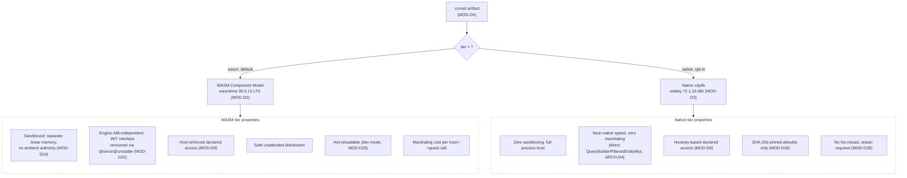
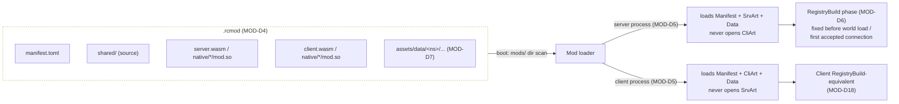
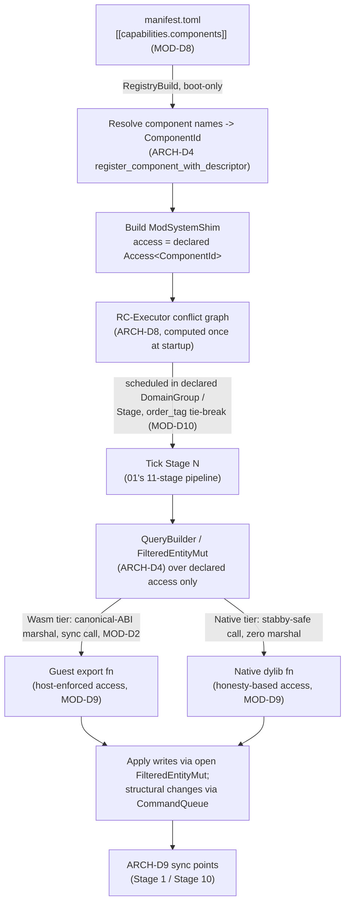
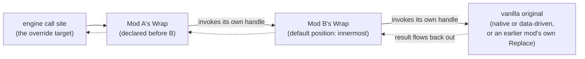
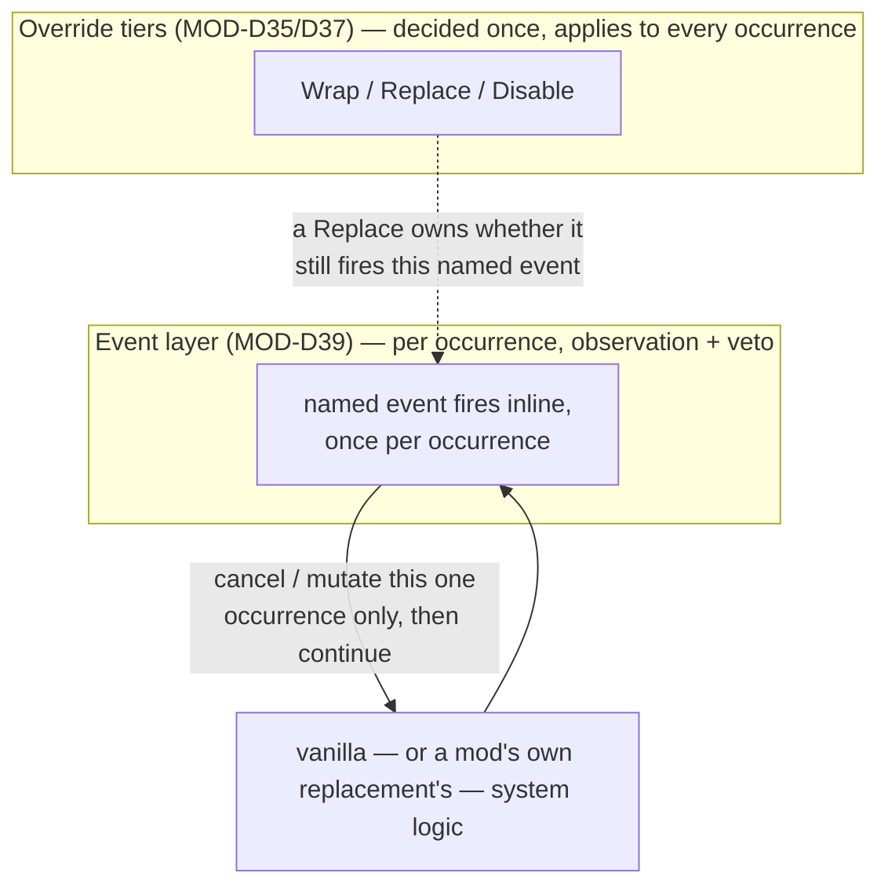
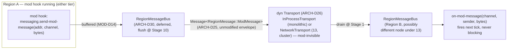

# Modding API

## Purpose

Defines the isomorphic modding system: one Rust-based mod API whose single compiled artifact carries shared, server, and client logic, loaded automatically on whichever side(s) apply, with hooks that integrate natively into `01-server-architecture.md`'s ECS/threading model and that remain correct, unmodified, in both `01`'s monolithic mode and `13-cluster-architecture.md`'s cluster mode. Target feature scope is comparable to Fabric/Forge/NeoForge (registries, data-driven content, a full gameplay/networking/lifecycle hook catalog, client rendering/GUI extension points, custom commands and worldgen) delivered through a two-tier execution model chosen specifically to solve problems those ecosystems have never solved — engine-version ABI breakage every release, no sandboxing, and no safe way to run a third party's compiled mod without trusting it with the whole process.

## Scope

**In scope:** mod execution/delivery model and its ABI-stability, sandboxing, and distribution-safety tradeoffs; isomorphic mod packaging (artifact format, manifest schema, dependency resolution, per-side load selection); ECS integration (manifest-declared access sets, how a mod system is slotted into `01`'s `ARCH-D8` conflict graph and its current domain-group pipeline, whatever `01` currently enumerates, ordering constraints, exclusive-world-access handling); cluster compatibility of the mod-facing API surface (location transparency, cross-partition messaging, migration behavior) built strictly on `01`'s existing message substrate (`ARCH-D24`–`D30`) and `13`'s existing cluster model, adding no new cross-boundary mechanism of its own; the API surface catalog (registries, data-driven content, event/hook catalog structure, custom network channels, client and server extension points) at the *contract* level; the override/replacement model by which a mod may wrap, override, replace, or disable any vanilla-registered behavior, named system, or data-registry entry, and the resulting parity-guarantee scoping (MOD-D33–D40); the cancellable/mutable event layer and its relationship to that override model (MOD-D39); component attachment to vanilla entities/blocks/chunks and per-chunk/region/world mod-data storage, including persistence and cluster-migration semantics (MOD-D41–D44); mod-API versioning/stability/deprecation policy; the mod security/capability/resource-limit model; developer experience (project template, hot-reload stance, test harness).

**Out of scope:** the ECS core, scheduler, tick pipeline, and message substrate themselves (owned by `01-server-architecture.md`; this document only consumes their extension points — `ARCH-D4`'s dynamic-component-registration primitive, `ARCH-D8`'s conflict graph, `ARCH-D25`'s `RegionMessage` extension point); the client rendering pipeline's internals (owned by `07-client-architecture.md`; this document fixes only the *existence and shape* of the extension points mods reach it through, not how a frame is actually drawn); cluster node/proxy/raft/QUIC internals (owned by `13-cluster-architecture.md`; this document only states what a mod may and may not assume is true across a partition boundary, using `13`'s already-decided mechanisms unmodified); the wire protocol's packet framing/compression/encryption and the online-mode flow (owned by `02-protocol-networking.md`; this document's custom network channels ride on top of `02`'s existing Custom Payload packet infrastructure, not a new transport); world generation algorithms and concrete game-mechanics component definitions (owned by `04-worldgen-parity.md`/`05-game-mechanics.md`; this document fixes only the registration *contract* mods use to contribute to them); the legal/licensing determination of what a mod may bundle or how a mod marketplace would be licensed (owned by `08-assets-auth-legal.md`).

## Decisions

| ID | Decision | Rationale |
|---|---|---|
| MOD-D1 | **Two delivery tiers, not one.** Tier 1 ("WASM", default, primary): WebAssembly Component Model modules run under `wasmtime`, sandboxed, capability-secure, engine-ABI-independent. Tier 2 ("native", opt-in, trusted): native Rust `cdylib`s loaded in-process via a stable-ABI boundary, full native speed, zero sandboxing. A mod declares its tier in its manifest; the two are mutually exclusive per mod (no mod ships both a WASM and a native implementation of the same entrypoint). | The five weighed criteria (tick-hot performance, sandboxing, cross-engine-version ABI stability, isomorphic loading, distribution safety) do not have one winning answer — WASM wins four of five (sandboxing, ABI stability via WIT, isomorphic client/server symmetry, safe unattended distribution) and loses only raw per-call performance; native wins performance and loses everything else. Rather than compromise the whole API on the weakest tier, both are offered honestly, mirroring the project's own dual-mode precedent (`ARCH-D26`'s `Transport` trait: one interface, two implementations, chosen by config) applied to mod execution instead of message transport. |
| MOD-D2 | **WASM tier toolchain:** `wasmtime` **36.0.13** (crates.io, published 2026-07-31 — the current Bytecode Alliance LTS release line: LTS lines ship every 12th monthly release and carry 24-month guaranteed security backports, vs. 2 months for an ordinary release; 36.x is the most recent established LTS line as of this writing, ahead of the 47.x current-monthly train) together with matching `wasmtime-wasi` 36.0.13, plus `wit-bindgen` 0.60.0 (crates.io, 2026-07-22, independent of wasmtime's version line) for guest-side binding generation. Mods compile with `cargo build --target wasm32-wasip2` (Tier-2 rustc target since Rust 1.82, emits a Component-Model component directly — no post-processing step). In-tick hook calls use wasmtime's **synchronous** embedding (`Config::async_support` left `false`); a mod capability granting async I/O (MOD-D24) executes under a *separate* `Store` with async support enabled, scheduled on `01`'s already-isolated Tokio runtime (`ARCH-D21`), never on RC-WorkerPool. | Pinning the LTS line rather than the monthly train is a deliberate stability choice for wasmtime *specifically* (distinct from `02-protocol-networking.md`'s NET-D7 choice to track tokio's current-stable release) because wasmtime is the sandbox boundary around untrusted third-party code — a long, security-audited support window matters more here than staying current. Synchronous embedding for the tick-hot path is required because the Component Model's async task-call machinery currently adds roughly 3.5x overhead even on purely synchronous call paths (Bytecode Alliance's own stated WASI-P3 performance goal is to eliminate this, not yet shipped) — paying that tax inside a 50 ms tick budget is unacceptable, so async is reserved for genuinely async work and routed through the runtime `01` already isolated for exactly that class of workload. |
| MOD-D3 | **Native tier ABI:** `stabby` **72.1.16** (crates.io, published 2026-07-20; dual `EPL-2.0 OR Apache-2.0` — the project selects the `Apache-2.0` branch), *not* `abi_stable` (last published 0.11.3 in October 2023 — effectively unmaintained, ~3 years stale as of this document). Native mods are compiled as `cdylib` crates depending on a thin, versioned `rc-mod-abi-native` crate whose public surface is exclusively `#[stabby::stabby]`-annotated types and `#[stabby::export]` functions — no raw `bevy_ecs` type ever crosses the dylib boundary directly. | `stabby` is the only currently-maintained crate solving Rust's lack of a stable ABI across compiler/crate versions (verified: works on stable Rust ≥1.72, supports traits/trait objects/enums/generics via its own `#[repr(stabby)]`/`#[repr(C)]` layouts, explicitly targets "plugins and other dynamic linkage based programs" as a primary use case). `abi_stable`'s multi-year-stale status makes it an unacceptable dependency for a boundary the whole native tier's ABI stability rests on. |
| MOD-D4 | **Mod artifact: `.rcmod`**, a plain zip container (via the `zip` crate) holding `manifest.toml` at the root, plus any subset of: `shared/` (ordinary Rust source consumed by both `server.wasm`/`server`-native and `client.wasm`/`client`-native builds at *compile time* — it is not itself a runtime artifact), `server.wasm` / `client.wasm` (WASM tier), `native/<target-triple>/<mod_id>.{dll,so,dylib}` (native tier, one binary per supported host triple), `assets/data/<namespace>/...` (vanilla-datapack-shaped data-driven content, MOD-D7) and `assets/textures|sounds|models/...` (the mod's own original, non-Mojang assets — permitted and common; distinct from the project's own "ship no Mojang assets" rule, which governs the engine, not third-party mod content). `manifest.toml` fields: `[mod]` id/version/display_name/authors/license; `[api] requires` (semver range against `rc-mod-api`) and `unstable_features`; `[compat] engine`/`mc_parity` ranges; `[dependencies]` (mod_id → semver range); `[entrypoints] tier`, `shared`, `server`, `client`, `native.<triple>`; `[capabilities]` (MOD-D8/MOD-D24). | Zip is universally tooled (no bespoke archive format to maintain), and the field set mirrors — deliberately, at the architecture level only, no code or text copied — the shape every established loader ecosystem (Fabric's `fabric.mod.json`, Forge/NeoForge's `mods.toml`, both public, well-known conventions) has independently converged on, because the underlying problem (identify a mod, its version, its deps, its entrypoints) has one well-understood shape. `shared/` being source, not a runtime component, avoids inventing a third component/dylib load path for code that never needs to cross a process/sandbox boundary by itself. |
| MOD-D5 | **Per-side load selection is automatic and exclusive.** The dedicated server process loads only `manifest.toml` + `server.wasm`/`native.<triple>` server entry (if present) for every mod in its `mods/` directory; it never opens `client.wasm` or client-only assets. The client process loads only the client entry plus shared assets. A mod with only a `client` entrypoint (a pure visual mod) is silently a no-op on a server that loads it; a mod with only a `server` entrypoint is a no-op on a client. | This is the literal meaning of "isomorphic": one artifact, automatic per-side resolution, zero mod-author bookkeeping for "am I on the server." Never loading the other side's artifact at all (not loading-then-ignoring) keeps a malicious or buggy client-only mod entirely outside the server's process and vice versa — a distribution-safety property that falls out of MOD-D1's sandboxing intent even before a single capability check runs. |
| MOD-D6 | **Registries** are `Identifier`-keyed (`namespace:path`, matching vanilla's own resource-location convention, e.g. `minecraft:stone`, `example_ores:ruby_ore`) generic stores, one per registrable kind (blocks, items, entity types, block-entity types, biomes, dimension types, enchantments, particle types, recipe types, loot-table types, container/GUI types, entity attributes, status effects, commands (MOD-D19), worldgen feature/biome-source types, network channels (MOD-D20)). Every registry goes through exactly one lifecycle phase, **RegistryBuild**, running once at boot before the world loads and before any connection is accepted (the same "resolved before the server accepts connections" timing `ARCH-D8` already fixes for native domain systems); mod registration calls (native or WASM) run during this phase only. Once RegistryBuild completes, every registry is frozen — immutable for the rest of the process's life — giving every RC-WorkerPool thread lock-free concurrent read access with zero runtime synchronization, matching vanilla's own registry-freeze-at-startup behavior. | Reuses `ARCH-D8`'s existing "system list fixed before connections are accepted, no changes mid-run" discipline for registries instead of inventing a second mutability policy; freeze-after-boot is what lets every tick-hot system read a registry through a plain `Res<Registry<T>>`-shaped reference with no lock, exactly as cheap as reading any other engine-owned resource. |
| MOD-D7 | **Data-driven content reuses the vanilla datapack format and directory convention exactly** (`assets/data/<namespace>/recipe/`, `loot_table/`, `tag/`, `advancement/`, `dimension_type/`, `worldgen/`, etc. — documented via minecraft.wiki, an allowed source under ASSET-D18(b)) rather than inventing a mod-specific data schema. A mod's `assets/data/` tree is intended to merge into the same data-pack overlay resolution `05-game-mechanics.md` will need for stacking multiple vanilla datapacks (parity requires this regardless of modding), ordered by the mod's position in the resolved dependency/load order (MOD-D31) — **`05` does not yet define that overlay/merge-order algorithm** (see Interfaces, Needs from `05`); until it does, this is a joint open item this document rides on, not an existing mechanism it merges into. | The server will have to parse this exact JSON/RON schema anyway for vanilla parity, so giving mods the identical, already-necessary parser will cost nothing extra and gets mod authors a well-documented, tool-supported format (existing vanilla datapack editors/validators work unmodified) instead of a bespoke one nobody else's tooling understands; the schema itself is Mojang's own public, functional (non-creative-expression) data format, not an asset, and citing/parsing its documented shape does not touch the project's asset-custody boundary (ASSET-D13/D16). |
| MOD-D8 | **ECS access is manifest-declared, not code-introspected.** Every hook a mod registers into one of `ARCH-D8`'s domain groups (Block/Redstone, Random Tick, Entity AI Selection, Entity Physics Integration, Block Entity, Lighting, Chunk Serialization, Network Encode/Decode — this document tracks `01`'s domain-group enumeration rather than fixing a count of its own, so this list tracks whatever `01` currently enumerates) carries a `[[capabilities.components]]` manifest entry: `{ name, access: "read"\|"write", group }`. **Entity AI Selection is structurally read-only** (ARCH-D15's Stage 6a dispatch never applies deferred structural changes, `01`'s own text): a manifest entry declaring `access: "write"` against that group is rejected at RegistryBuild/manifest-validation time with a named diagnostic, never silently accepted and silently discarded at dispatch — the same "loud boot-time error over silent fallback" posture MOD-D10/D31 already establish elsewhere in this document. At RegistryBuild, the mod loader resolves each declared component name to a `ComponentId` (registering new mod-defined components via `ARCH-D4`'s `World::register_component_with_descriptor`, MOD-D13) and constructs one host-side **mod-system shim** per hook — an ordinary Rust value implementing `bevy_ecs::system::System` whose `component_access()` returns exactly the declared set (hand-built from the manifest, not derived from `SystemParam` introspection, since neither a WASM guest's exports nor a native dylib's stable-ABI surface is visible to that machinery). This shim is registered into `RC-Executor`'s startup conflict graph identically to a native engine system. | This is the concrete mechanism that fulfills the task's "declared access sets so the ARCH scheduler slots them into the parallel domain model safely": a mod system gets exactly the same conflict-graph citizenship as native code, computed once at startup (`ARCH-D8`'s own "computed once, reused for every tick" property, unchanged), with zero per-tick scheduling overhead — the shim *is* a `SystemHandle` in every way RC-Executor cares about, differing only in what runs inside `System::run`. Rejecting a mismatched-access declaration at boot rather than discarding the write at dispatch avoids exactly the silent-failure class this project's own philosophy forbids, and matches the honest-boundary precedent `01` already sets for Stage 6a's own native systems. |
| MOD-D9 | **Declared-access enforcement differs by tier, both honestly documented.** WASM tier: the host, not the guest, performs every field read/write (the guest only ever sees canonical-ABI-lowered copies passed as WIT call arguments/results) — so the host trivially **denies** any attempt to reference a component the manifest didn't declare, at zero additional guest trust cost; this is a genuine sandboxing property, not just a startup-time promise. Native tier: the mod shares the process address space, so enforcement is **honesty-based**, identical to `ARCH-D8`'s own stated caveat for native engine code ("the only enforcement — no runtime aliasing checks in release builds") — a native mod that lies about its declared access can corrupt engine state exactly as badly as a bug in engine code could. | States plainly, per tier, exactly what "declared access" buys a server operator — this asymmetry is the single clearest illustration of MOD-D1's tradeoff and must not be glossed over: choosing the native tier is choosing to extend the same trust boundary the engine itself lives inside. |
| MOD-D10 | **Ordering constraints:** a mod hook may declare `before`/`after` relative to another mod's hook id or a reserved `native:<domain>` marker for the corresponding native engine stage. These resolve into `ARCH-D8`'s existing `order_tag` (declaration-index tie-break) at startup. An unresolvable ordering or access conflict (including a `before`/`after` cycle) is a **hard boot-time error** — the server refuses to start with that mod set — reusing `ARCH-D8`'s own policy verbatim ("a conflict at startup is a hard boot-time error, not a runtime fallback") rather than defining a separate, more lenient fallback for mods. | One conflict-resolution policy for the whole engine (native systems and mod systems alike) is simpler to reason about and test than two, and a silently-reordered mod hook is a strictly worse failure mode for a server operator than a loud boot failure naming the exact conflicting pair. |
| MOD-D11 | **A mod hook registered into Stage 4 (Scheduled Block Tick) inherits `ARCH-D13`'s fully-sequential, single-worker constraint unconditionally** — RC-Executor never offers it parallelism regardless of its declared access set, because `ARCH-D13` already established no parallelization axis is safe there for *any* code. Its declared priority must map onto one of vanilla's four tick-priority levels (`EXTREMELY_HIGH`..`NORMAL`) or a fifth, mod-reserved tier ordered strictly after `NORMAL`, preserving deterministic FIFO ordering against native scheduled ticks. | Extends the one domain the project treats as non-negotiable for parity (redstone) to mods without carving out a special case — a mod that adds new redstone-adjacent block behavior must play by the exact same sequential rule real redstone already plays by, or vanilla-observable ordering breaks the moment that mod is installed. |
| MOD-D12 | **Exclusive world access is an explicit, discouraged opt-in** (`exclusive_world_access = true` in the manifest, only meaningful outside Stage 4 where `ARCH-D13` already forces full sequentiality). Such a hook conflicts, by construction, with every other system in its stage/group — RC-Executor wraps it in a full-drain barrier (the same mechanism `ARCH-D8` already uses *between* groups, applied *within* one group for this single system), logs a warning, and emits a per-mod duration metric so a mod abusing this is directly visible in observability. | Some legitimate mod use cases genuinely need it (an admin/debug tool that walks the whole region, a one-shot world-editing command) and forbidding it outright would just push authors toward worse workarounds; making it maximally visible (loud default warning, dedicated metric, opt-in-only) is the honest way to allow it without pretending it's free. |
| MOD-D13 | **Mod-defined `ComponentDescriptor`s must be POD/self-contained** (`ARCH-D4`'s existing "size, alignment, drop fn — no static Rust type required" contract extended with the explicit, binding constraint that no field may hold a raw pointer, engine handle, or `NodeId`/host-identity value that would be invalid after the component's underlying bytes are relocated). WASM-tier component payloads additionally must be representable as WIT records (bounded by what canonical-ABI lifting/lowering can express) since they cross the linear-memory boundary on every access. | This is what makes MOD-D17's "mod state travels for free through `ARCH-D10`'s entity snapshot / `CLUSTER-D16`'s region snapshot" claim actually true rather than aspirational — a component holding a dangling pointer would silently corrupt state the instant it crossed a region transfer, chunk merge/split, or cluster migration boundary, all of which already move raw component bytes today without asking the component's type anything about its own validity. |
| MOD-D14 | **Cross-partition mod effects use one new `RegionMessage` variant, `ModMessage { mod_id: ModId, channel: String, payload: Vec<u8> }`**, carrying an opaque, mod-serialized payload the engine never interprets. A mod hook calls `messaging.send-mod-message(address, channel, payload)` (WIT) / the native-tier equivalent; this is buffered into that region's `RegionMessageBus` (`ARCH-D30`) exactly like any native `.send()` call, flushed at Stage 10, delivered through whichever `dyn Transport` is wired (`ARCH-D26` — `InProcessTransport` in monolithic mode, `13`'s `NetworkTransport` in cluster mode, with zero mod-visible difference), and drained at the destination region's Stage 1, firing that mod's `on-mod-message` export if present. | This is the direct instantiation of `ARCH-D25`'s stated extension point ("`13` may add cluster-only variants... without this document's involvement, provided they satisfy `ARCH-D25`'s serde requirement") applied to mods instead of cluster control traffic — same pattern `13` already used for its own extension, envelope and trait completely unmodified, and it is the *only* way any mod effect is ever allowed to cross a partition boundary (see MOD-D16). |
| MOD-D15 | **A mod may persist only `ChunkKey`/`RcEntityId`/`RegionId`-scoped addresses in its own component/data state — never a `NodeId`, hostname, PID, or any other host-identity value.** | These are exactly the addresses `ARCH-D24` already made location-transparent for the whole engine; a mod embedding host identity in its persisted state would silently break the moment `CLUSTER-D16` reassigns that region to a different node on failure takeover — the same portability guarantee the engine's own directories already provide is extended to mods by construction, by simply never exposing a `NodeId`-shaped type to mod code anywhere in the API surface. |
| MOD-D16 | **No mod-facing API ever blocks a tick waiting on another partition.** Every cross-region/cross-node mod interaction (MOD-D14) is fire-and-forget from the sending hook's point of view; a response, if any, arrives as a later `on-mod-message` callback invocation on a subsequent tick, never as a return value the calling hook waits on. Any mod-implemented timeout logic must be tick-count-based, never wall-clock-based. | Mirrors `ARCH-D29`'s own guarantee text verbatim ("a region never blocks its own tick waiting on another region's inbox") — a mod is not a special case, and letting one block would reintroduce, at the mod layer, precisely the single-slow-partition-stalls-everyone failure mode the whole region/message-passing architecture exists to eliminate. Tick-count timeouts stay correct under `CLUSTER-D7`/`D8`'s graceful latency degradation, where wall-clock assumptions would silently misfire. |
| MOD-D17 | **All authoritative mod state must live in ECS components (native `#[derive(Component)]`-equivalent or `ARCH-D4` dynamic descriptors) — never in a WASM guest instance's linear memory or a native dylib's process-global/`static` state.** A long-lived `wasmtime::Store`/`Instance` kept resident for performance (MOD-D30) is a **discardable host-side cache only**: the engine may drop and respawn it at any time (including mid-session, across a hot reload, or after a region migrates to a different node) with zero expectation that anything inside it survives, because nothing authoritative was ever stored there. | This single rule is what makes migration, hot-reload, and node failover all "just work" for mod state with zero mod-specific code: since a mod's data is just more `ComponentId`s in the same `World`, `ARCH-D10`'s entity-transfer snapshot and `CLUSTER-D16`'s region-failure-takeover snapshot already carry it automatically, exactly as they carry every native component today, without either of those mechanisms needing to know a mod exists. |
| MOD-D18 | **Client extension points are thin, capability-shaped interfaces whose concrete data (mesh formats, texture-atlas handles, GUI widget trees) is entirely `07-client-architecture.md`'s to define.** This document fixes only that the interface exists and is reached the same way server registries are: `register-model-provider`, `register-block-renderer`, `register-gui-screen`, `register-hud-overlay`, `register-input-binding`, exposed on the `client` half of a mod's manifest-declared entrypoints. | Keeps this document's promise not to touch rendering internals while still fixing the one fact `07` needs from here: that a symmetric, registry-shaped extension mechanism exists on the client side and is populated at the same RegistryBuild-equivalent client boot phase MOD-D6 defines server-side. |
| MOD-D19 | **Server extension — commands:** mods register commands through `05-game-mechanics.md`'s existing `rc-brigadier` crate (MECH-D69) — the same node-graph tree-builder API native commands use, including its permission predicates and suggestion-provider hooks. This document does not implement or reimplement Brigadier's node-graph model itself; `rc-brigadier` (hand-written against Mojang's public `Mojang/brigadier` specification and `reports/commands.json`, per MECH-D69) is `05`'s crate end-to-end, including the client-tab-completion tree-serialization concern. **Server extension — worldgen:** mods contribute custom biome-source layers, feature placement, and structure templates through a registration interface whose implementation is entirely `04-worldgen-parity.md`'s; this document fixes only that the registration contract exists and runs during RegistryBuild (MOD-D6). | Reuses `05`'s already-decided `rc-brigadier` crate (MECH-D69) instead of building a second, competing command-graph implementation — one command-tree representation for both native and mod-registered commands keeps the `Commands` packet's tree serialization (owned by `02`) working against a single graph, and avoids the exact kind of duplicated-effort/diverging-implementation risk `05`'s MECH-D69 rationale itself flags for `azalea-brigadier`. Worldgen stays a thin contract here because `04` owns the actual generation pipeline the contract must plug into. |
| MOD-D20 | **Custom network channels reuse vanilla's own Custom Payload packet** (`minecraft:custom_payload`, Play-state, both directions — real, standardized vanilla protocol infrastructure, not a Forge/Fabric invention, per public protocol documentation) rather than inventing a new packet or transport. This document owns only the mod-facing **channel registry and dispatch layer** on top: `register-channel(id)`, `send(channel, target, bytes)`, and an `on-channel-message(channel, sender, bytes)` hook — `02-protocol-networking.md` owns the packet's wire shape, framing, and Stage-3/Stage-11 tick-pipeline classification. | No new transport is needed because vanilla already ships exactly this mechanism; building the mod-facing registry as a thin layer over an existing, already-necessary packet type avoids a second network code path with its own framing/compression/encryption concerns duplicating `02`'s. |
| MOD-D21 | **`rc-mod-api` follows strict SemVer, versioned independently of `NET-D1`'s pinned Minecraft parity target.** A parity-version bump (`NET-D2`'s "deliberate, reviewed event") that adds a mod-visible registry entry or interface is a mod-API **minor** bump (additive); one that renames or removes a mod-visible surface is a mod-API **major** bump. A single mod-API major version may span multiple Minecraft parity-version bumps. | Decoupling the two version lines is the same trade every established loader ecosystem (Fabric, Forge/NeoForge — public, well-known fact about how those projects are structured, no code consulted) has independently made, because coupling mod-API stability to MC's own release cadence would force every mod to rebuild on every parity bump regardless of whether anything mod-visible actually changed. |
| MOD-D22 | **Stability tiers are expressed with WIT's own native `@since`/`@unstable`/`@deprecated` gates** (Component Model spec feature, confirmed current: `@unstable`-gated interfaces are not exposed to a mod unless it opts in) on every `rc-mod-api` WIT interface function. A mod opts into an `@unstable` feature explicitly via `[api] unstable_features = [...]` in its manifest (MOD-D4); the engine enforces this at load time (refusing to bind an unstable import the manifest didn't opt into), not merely as documentation. The native tier, lacking WIT, mirrors this with an `#[rc_mod_api::unstable(feature = "...")]` attribute macro gating the symbol behind a matching Cargo feature the mod's `Cargo.toml` must enable. | Using the Component Model's own real, spec-level stability mechanism rather than inventing a parallel one means the engine enforces API-surface stability tiers the same way every other WIT-based ecosystem does, and the native-tier mirror keeps the two tiers' stability *semantics* identical even though their mechanisms necessarily differ (WIT gate vs. Cargo feature). |
| MOD-D23 | **Deprecation policy:** an item marked `@deprecated(since = X.Y.Z)` remains fully functional for at least **2 mod-API minor versions or 6 months, whichever is longer**, before it may be removed — and removal only ever happens at the next mod-API **major** version bump, never in a minor or patch. | A fixed minimum window (not "eventually") gives mod authors a concrete upgrade budget, and confining removal strictly to major bumps is the one guarantee that makes MOD-D21's SemVer promise meaningful rather than nominal. |
| MOD-D24 | **Security model: manifest-declared capabilities, enforced via WASI's own no-ambient-authority model for the WASM tier.** A mod's `[capabilities]` table declares everything it needs beyond ECS component access (MOD-D8): `filesystem` (grants only a mod-private data directory as a `wasi:filesystem` preopen — never the host filesystem generally), `network` (grants outbound sockets via `wasi:sockets`/`wasi:http`; **denied by default**, and even when declared, requires an explicit server-operator approval step at mod-install time — never silently granted, consistent with the project's own posture toward network trust, `NET-D6`'s Mojang session calls being entirely outside any mod's reach regardless), and `network_channels` (which custom channel IDs, MOD-D20, it may register). Undeclared capabilities are simply absent from the mod's WIT world/instantiation — there is no ambient way to reach them, not merely a runtime check. | WASI Preview 2/3's capability model (verified: explicit, non-ambient authority — nothing is reachable unless handed in at instantiation) is exactly the security property a from-scratch modding system should be built on rather than reinvented; requiring operator approval specifically for `network` (rather than a manifest declaration alone) closes the gap where a mod could otherwise phone home or exfiltrate data the moment a server operator drops a `.rcmod` file in a folder. |
| MOD-D25 | **Resource limits (WASM tier):** `Config::consume_fuel` fuel metering bounds total instructions per hook invocation (default budget, seed value pending calibration: 10,000,000 fuel units per call), `Config::epoch_interruption` is a coarse-grained wall-clock backstop killing a hook that somehow evades fuel accounting, and `Store::limiter`/`ResourceLimiter` caps linear memory (default 256 MiB/instance) and table growth. A mod exceeding its budget for a sustained window (mirroring `ARCH-D6`/`D19`'s hysteresis-gated style, exact window a blueprint-phase calibration) is **auto-disabled** by default (`mod_fault_policy = "disable"`) — the world keeps ticking without it, logged and metriced — with an operator-configurable `"halt"` policy for stricter deployments. | All three mechanisms are real, current `wasmtime` embedder APIs (verified: `Config::consume_fuel`, `Config::epoch_interruption`, the `ResourceLimiter` trait via `Store::limiter`), so this decision adds no new primitive, only the policy wrapping them. Defaulting to disable-and-continue extends the same philosophy `ARCH-D7` already applies at the region level ("only a region that cannot keep up degrades its own TPS") to the mod level: one runaway mod must not be able to take the whole world down by default. |
| MOD-D26 | **Native tier trust model:** a native `.rcmod` loads only if its `native/<triple>/<mod_id>.{dll,so,dylib}` file's SHA-256 hash matches an entry the operator explicitly listed in server config (`[mods.native.trusted]`, hash → mod id). A hash mismatch (a rebuilt, updated, or tampered binary) refuses to load with a clear error, never a silent fallback. Native mods are **never** eligible for any future unattended fetch-and-install convenience feature — only WASM-tier mods, whose sandboxing justifies unattended execution, are. | Loading a native dylib grants it the same trust level as the engine binary itself (full process memory, filesystem, network, syscalls) — a content-hash allowlist is the minimum viable defense against a silent supply-chain swap (a compromised mod-hosting site serving a different binary than the one the operator reviewed), and refusing unattended native installation entirely is the honest consequence of MOD-D9's own "honesty-based, zero sandboxing" admission for this tier. |
| MOD-D27 | **Dev experience: a `cargo generate` template** (`rusty-clanker/mod-template`) scaffolds a Cargo workspace: `shared/` (plain lib crate), `server/` and `client/` (each compiled to `wasm32-wasip2` by default, or a `native/` `cdylib` crate depending on `rc-mod-abi-native` if `--tier native` is passed at generation time), plus a pre-filled `manifest.toml` (MOD-D4) with placeholder capability declarations the author edits to match what they actually use. | A single official template covering both tiers and the shared/server/client split removes the most common source of isomorphic-modding friction (getting the workspace/build-target wiring right) before a mod author writes a line of gameplay code. |
| MOD-D28 | **Hot reload is supported for the WASM tier only, and only in a dev-mode opt-in** (`dev_hot_reload = true`, off by default in any production configuration). A filesystem watch (the `notify` crate) on the mod's build output directory tears down the old `Store`/`Instance` and spins up a fresh one on change; this is safe *only* because MOD-D17 already guarantees no authoritative state lives in that instance to lose. The native tier gets **no** hot reload — a full server restart is required to pick up a rebuilt native mod. | Rust dylib unload/reload at runtime is well-known unsound territory (static/TLS state, dangling vtable pointers — the platform loader and Rust's own runtime give no safety guarantee for `dlclose`/`FreeLibrary` here), so the native tier simply doesn't get the feature rather than getting an unsound approximation of it; the WASM tier can offer it safely and for free specifically because MOD-D17's state-authority rule was already designed to make an instance fully disposable. |
| MOD-D29 | **Test harness: `rc-mod-test`.** For the WASM tier, it spins a real `wasmtime::Engine`/`Store` against a mocked, in-memory host implementation of the `rc-mod-api` WIT world's imports (backed by a lightweight, standalone `bevy_ecs::World` fixture — not a full `RC-Executor`/region), letting a mod author unit-test their compiled `.wasm` component's hook behavior against scripted ECS states with no running server. For the native tier, a thin harness `dlopen`s the just-built `cdylib` on the developer's own machine (same rustc toolchain that just built it, so MOD-D3's cross-version ABI concern doesn't apply locally) against the same mocked host. | One test harness crate covering both tiers against the same mocked-host abstraction keeps the developer-facing testing story consistent regardless of which tier a mod author chose, and reusing a plain `bevy_ecs::World` fixture (rather than a full region/scheduler) keeps the harness fast and independent of `01`'s scheduling internals. |
| MOD-D30 | **Precompiled component caching:** the engine calls `Engine::precompile_component` once per `.wasm` on first load and caches the resulting compiled artifact on disk, keyed by `(content hash of the .wasm, wasmtime version, target triple)`; a matching cache entry is deserialized directly on subsequent boots, skipping recompilation. | Avoids paying Cranelift compilation cost on every server boot for every installed mod — a real, current `wasmtime` embedder capability (`Engine::precompile_component`/component deserialization) that costs nothing to adopt and materially improves cold-start time on a server with a non-trivial mod list. |
| MOD-D31 | **Dependency resolution:** `[dependencies]` manifest entries (mod_id → semver range) are resolved into a topological load order at boot, before RegistryBuild. A missing dependency, an unsatisfiable version range, or a dependency cycle is a **hard load failure** for the affected mod(s) — reported by name and reason, never a partial/best-effort load of a mod with unmet dependencies. | Partial loading of a mod whose dependency didn't resolve is a worse failure mode than refusing to load it at all (silent missing registrations, confusing downstream errors) — an explicit, named boot-time failure matches the same "hard error over silent fallback" philosophy `ARCH-D8`/MOD-D10 already apply to scheduling conflicts. |
| MOD-D32 | **Native-tier crash isolation:** `rc-mod-host` wraps every native-mod hook invocation in `catch_unwind` at the FFI boundary. A caught panic **auto-disables** the offending mod for the remainder of the run — logged and metriced, the world keeps ticking without it — mirroring MOD-D25's WASM-tier `mod_fault_policy = "disable"` default, with the same operator-configurable `"halt"` escape hatch. This mechanism requires the workspace panic strategy to be `unwind`, never `abort` (`14-performance-engineering.md`'s PERF-D46 pins that requirement at the build-profile level); `catch_unwind` catches nothing under an `abort` strategy. | Native-tier code shares the engine's process (MOD-D9's honesty-based trust boundary), so an unhandled native-mod panic is otherwise a whole-process crash rather than a contained failure — this decision is what makes MOD-D1's "one runaway mod must not take the whole world down" promise hold for the native tier too, not only the WASM tier's sandboxed one, and is the mechanism `12`'s WS-D10 rationale already assumes exists when it notes `rc-mod-host`'s crash-isolation tests deliberately trigger panics. |
| MOD-D33 | **No special position for vanilla — the anchor decision.** Every vanilla gameplay behavior this project ships is implemented through the exact same mechanisms this document exposes to mods: vanilla's own block/item/fluid/entity-type behaviors dispatch through the identical registry-shaped seam a mod's own behavior registration uses (MOD-D6), vanilla's own tick-domain systems are ordinary participants in `ARCH-D8`'s conflict graph exactly as a `ModSystemShim` is (MOD-D8), and vanilla's own recipes/loot tables/worldgen features are themselves data-driven entries in the identical datapack-shaped format MOD-D7 already gives mods (never a hand-wired exception to it). Consequently: anything vanilla registers through one of these seams, a mod may **wrap** (call the original, then act), **override** (re-register with new logic), **replace** (fully supersede), or **disable** (suppress entirely) through that same seam — never a parallel, more-restricted mod-only surface (MOD-D35, MOD-D37). This holds bounded by three engine invariants, unconditionally, for every tier this document defines: (1) **stage/domain discipline is inherited, never opted out of** — an override, wrap, or replacement targeting a Stage-4 system still runs single-worker, fully sequential, under `ARCH-D13`'s mandatory collapse (MOD-D11 already establishes this for hooks; MOD-D37 extends it verbatim to replacements), and a replacement targeting a chunk-parallel stage still runs chunk-parallel — a mod supplies different logic, never a different concurrency contract for the stage it runs in; (2) **the scheduler alone owns parallelism** — every override/replacement system declares its own `Access<ComponentId>` set exactly as MOD-D8 already requires of any hook and is slotted into `ARCH-D8`'s conflict graph by the identical mechanism (MOD-D37) — no primitive in this document ever hands a mod a raw thread, a manual lock, or a scheduling decision of its own; (3) **determinism duties are inherited, not waived** — `ARCH-D9`'s sync-point discipline and MOD-D14–D17's cross-partition rules apply identically to a replacement system's structural mutations and persisted state as to an additive one. | The task mandate is structural, not aspirational: Rust has no mixin/bytecode-injection escape hatch, so the only way to give mods the same reach Fabric/Forge's mixin system gives Java mods is for vanilla's own implementation to already be a client of the registries/behavior-traits/system-registration seams this document exposes — never a separate, privileged vanilla-only code path a mod cannot reach. This decision states that requirement as binding, current-state truth rather than leaving it implicit across MOD-D6/D7/D8's independently-written text. |
| MOD-D34 | **Parity scoping: the bit-identical guarantee applies per touched surface, and modded status is discoverable, never hidden.** `00-overview.md`'s "bit-identical vanilla parity everywhere" guarantee and every CI parity gate `09-testing-quality.md` enforces bind unconditionally to the unmodded configuration, and, within a modded configuration, to every vanilla-owned surface (a registry entry, behavior, or system) no currently-loaded mod has wrapped, overridden, replaced, or disabled this run (MOD-D33's four verbs). A surface a mod touches is, by construction, that mod's deliberate, informed opt-out from the parity guarantee for exactly that surface — never silent, and never broadened beyond what the loaded mod set actually touches: a mod that only adds new content through MOD-D6/D7's purely additive path opts out of nothing, and every vanilla surface it never touches remains bit-identical and CI-gated exactly as in the unmodded case. **Discoverability:** whenever any loaded mod has engaged a behavior-level or system-level override/replace/disable (MOD-D35, MOD-D37) or a data-registry replacement (MOD-D40) this run — never merely the event layer's own observation-only reach (MOD-D39), which by MOD-D33's own model never replaces vanilla logic — the server's `minecraft:brand` response (vanilla's own real Custom Payload channel, ridden unmodified per MOD-D20's reuse, wire-format owned by `02-protocol-networking.md`) carries a documented suffix marking the server as running with active vanilla overrides, and the Server List Ping status response gains a small, equivalently documented indicator — both purely informational, never a connection gate. | Scoping the guarantee per surface, not per boolean "is this server modded," keeps the promise meaningful for the overwhelming majority of a lightly-modded server's own untouched content, while the discoverability requirement makes the opt-out honest and visible rather than a fact only discoverable by reading a mod's source — reusing `minecraft:brand`, a real, already-standard vanilla self-identification mechanism, costs zero new wire mechanism, consistent with MOD-D20's reuse-not-reinvent posture. |
| MOD-D35 | **Behavior-level override: `Identifier`-targeted, `Wrap` or `Replace`, call-original as a first-class capability.** A mod may register an override against an existing block, item, fluid, or entity-type's own vanilla (or previously-mod-registered) behavior, targeting it by its `Identifier` (`minecraft:water`, never a raw numeric id — resolved against whichever registration currently owns that name at RegistryBuild time, MOD-D31's load order) rather than by a state/entry id it would otherwise have no way to know in advance. Two modes only: **`Wrap`** — the new behavior receives a live, callable handle to whatever currently occupies that target (vanilla native logic, vanilla data-driven logic, or an earlier mod's own prior registration), which its own logic may invoke before, after, conditionally, or not at all, the direct call-original/`@Inject` equivalent the task mandate names explicitly; **`Replace`** — the new behavior is installed with no such handle, fully superseding whatever it targeted. This extends whichever per-target behavior-dispatch registry `03`/`05` expose for the corresponding vanilla content (flagged as a required exposure, see Interfaces — this document assumes such a registry-shaped seam exists per target kind, since MOD-D33 requires vanilla's own content to already dispatch through one) with a second, override-only insertion path that is the only legal way to occupy an already-occupied target — the ordinary additive registration path (new mod content) keeps rejecting accidental id/range collisions unchanged. **Call-original is tier-transparent:** for the native tier, the handle is an ABI-stable closure (mirroring the same `#[stabby::stabby]` boundary discipline MOD-D3 already fixes) capturing whatever the previous layer's dispatch actually was; for the WASM tier, the handle is an opaque host-issued token resolved through a synchronous host-import call, consistent with MOD-D2's synchronous tick-hot-path rule — a WASM-tier mod may transparently wrap a native-tier mod's prior `Replace`, and vice versa, with neither side needing to know the other's tier. | Targeting by `Identifier` rather than a raw id follows directly from MOD-D33 (a mod cannot be expected to know vanilla's own internal numeric ids to override vanilla content) and reuses MOD-D6's own resource-location convention rather than a second addressing scheme; tier-transparent call-original is what keeps MOD-D1's two-tier split from leaking into mod-to-mod and mod-to-vanilla compatibility. |
| MOD-D36 | **Native systems gain stable public identifiers, exported explicitly by whichever document owns them.** MOD-D8's own "the mod loader resolves each declared component name to a `ComponentId`" mechanism is extended, identically in shape, to native **systems**: a domain document (`05-game-mechanics.md` for its own Stage-4/5/6/7 mechanic systems, `01`/`03` for engine-owned systems) may explicitly opt a native system into being mod-addressable under a stable `Identifier` — an un-exported system remains unreachable for override, replace, disable, or fine-grained ordering, the same honest boundary MOD-D8 already implies for components a mod declares but the engine never exported. The existing `native:<domain>` ordering marker (MOD-D10) keeps its exact current meaning — before/after the whole domain group as one block — as the default, backward-compatible case; a future `rc-scheduler` blueprint may additionally let a hook or override reference `native:<domain>/<system>` to anchor itself between two specific named native systems within that group once both are exported, narrowing the ordering-anchor-granularity gap the coarse, whole-group marker alone cannot — **this document fixes only the planning-level intent**, not a concrete mechanism: M8's own shipped blueprint corpus (`M8-B01`'s `NativeDomainMarker`, `M8-B03`'s `resolve_hook_order`, `M8-B06a`'s `resolve_override_order`) implements the coarse, whole-group `native:<domain>` anchor only, and none of the three implements per-system resolution yet (see Open Questions). | Generalizing MOD-D8's already-proven "name it explicitly, or it isn't reachable" shape to systems, rather than inventing a second exposure mechanism, keeps exactly one "opt something in for mod addressing" idiom in the whole document; keeping the bare `native:<domain>` marker's meaning unchanged as the default case means every existing use of MOD-D10's ordering mechanism keeps working exactly as specified — this is a strict widening, never a breaking change, whenever the concrete per-system resolution mechanism is eventually built. |
| MOD-D37 | **System-level replace and disable, both riding MOD-D36's export mechanism; hook reach widens with `01`'s own domain-group set.** A mod may disable a named native system entirely (MOD-D36) — it is never scheduled this run, contributing no `Access` declaration and no conflict-graph entry — or replace it with a mod-supplied system that declares its own `Access<ComponentId>` set and is slotted into the identical group/stage the disabled original occupied, inheriting every stage-specific constraint that group carries per MOD-D33's first invariant: a Stage-4 replacement is single-worker sequential unconditionally (MOD-D11 unchanged), a chunk-parallel stage's replacement stays chunk-parallel. Both are legal only against a system MOD-D36's export mechanism resolves. A redundant disable on an already-replaced target is a harmless no-op, never an error — a replacement already implies the original no longer runs (MOD-D38 covers the one case that *is* a genuine conflict: two competing replacements). **Hook reach widens to track `01`'s own domain-group set, whatever it currently enumerates** — this document does not itself pin a fixed group count (see the amended MOD-D8 row); once `01`'s own text names Random Tick and Block Entity as addressable domain groups, a mod hook may target Stage 7 for genuine, mutation-capable custom block-entity tick logic (distinct from, and no longer forced through, Stage-4's scheduled-block-tick seam, matching `05`'s own MECH-D2 Stage-4/Stage-7 distinction) and Stage 5 for custom random-tick behavior. | Reusing MOD-D36's export mechanism for both replace/disable and for fine-grained ordering, rather than a separate targeting primitive for each, keeps exactly one "name a native system" idiom in the document; treating a redundant disable-on-replaced-target as a no-op avoids punishing two independently-authored mods for expressing the identical intent two different ways, while MOD-D38 still catches the one case where silent resolution would hide a real authorial conflict. |
| MOD-D38 | **Cross-mod override/replace conflict resolution extends MOD-D10's existing before/after mechanism — never a second ordering model.** Two or more mods' `Wrap` declarations (MOD-D35) against the same override target — a behavior `Identifier` or a named native system (MOD-D36) — resolve via the identical deterministic ordering MOD-D10 already establishes for tick-domain hooks: `before`/`after` references (now able to name another mod's own override on that same target) resolve into a linear order, with an unresolvable ordering — including a cycle — remaining MOD-D10's identical hard boot-time error, naming every mod/target still stuck. That linear order **is** the wrap call chain, outermost-first; a `Wrap` with no explicit ordering defaults to innermost — closest to whatever it targets — mirroring MOD-D10's own existing declaration-order tie-break rather than a second default rule. **`Replace`-vs-`Replace` on one target has no compositional default** — two full replacements cannot be composed, only ordered — and is therefore always a hard boot-time error unless the two mods explicitly order themselves against each other for that specific target; resolving that explicit ordering selects the winner deterministically, the loser rejected at boot with a diagnostic naming both mods and the shared target, never silently dropped. **A `Replace` truncates any `Wrap` ordered innermost of it** — legal, since a mod may deliberately replace a target another mod's wrap depended on, but produces a loud, non-fatal boot-time warning naming the replacing mod, the target, and every shadowed wrap, matching MOD-D12/D25/D32's established "loud warning, never a silent default" posture. | Extending MOD-D10's existing mechanism rather than inventing a second conflict-resolution algorithm keeps exactly one ordering/cycle-detection/diagnostic model across this document; requiring an explicit tie-break for `Replace`-vs-`Replace` fulfills the task's own "deterministic priority, loud diagnostics" requirement for the one override scenario with no natural composition — every other shape (wrap composition, wrap-vs-replace shadowing) already has one, stated above. |
| MOD-D39 | **Cancellable/mutable events: observation and per-occurrence veto, layered underneath — never a substitute for — the override tiers.** A named event fires once per occurrence (one block-break attempt, one damage instance, one block-place attempt — the initial catalog; growing it per-mechanic as `05` lands each system is that document's job, mirroring MOD-D8's own "concrete hook enumeration is blueprint-phase work" precedent applied here to events) at a point the owning system's own dispatch calls into inline, synchronously, on whichever worker/stage is already executing it. An event listener is **not** a `ModSystemShim` and enters no new `ARCH-D8` conflict-graph node: it runs inside the emitting system's own already-validated access, exposed only through whatever fixed capability that event point defines, never general `World` access — the identical "host mediates, mod never gets a raw handle" discipline MOD-D9 already establishes elsewhere in this document. Listener priority is five ordered tiers (highest to lowest, FIFO-within-tier by declaration order — the same shape well-documented event-driven modding ecosystems have long converged on, architecture only, no code consulted) run in fixed order every occurrence, plus a sixth, always-last, always-read-only monitor tier that observes the event's final, possibly-cancelled outcome and cannot itself cancel or mutate. Any non-monitor listener may cancel the occurrence's default effect; every remaining listener, including lower-priority ones, still runs and may reverse or further adjust that outcome. **Relationship to the override tiers, stated explicitly:** events are observation and veto over a system that still runs its own logic and merely consults listeners at specific points; MOD-D35/D37's tiers are replacement of the logic itself — the two compose freely (a replaced system may, at the replacing mod's own discretion, keep firing the same named events other mods listen for) but a replacement is never obligated to keep firing any event, since replacing a system means owning whether it still does — the same honest "you own it now" consequence MOD-D33 already states for full replacement. | This closes the single most explicitly named gap against the task's own Create-caliber bar: without a per-occurrence, priority-ordered, cancellable event model, no mod can veto or lightly adjust one occurrence without owning that occurrence's entire surrounding algorithm via a full override — exactly the missing middle ground between passive observation and total replacement. Keeping listeners inline within the emitting system's own access envelope, rather than a separately-scheduled shim, avoids inventing a second, redundant conflict-graph citizenship for what is fundamentally a synchronous callback. |
| MOD-D40 | **Data-registry replacement: deterministic mod-priority ordering, extending MOD-D7's overlay.** A mod's `assets/data/<namespace>/...` content (MOD-D7) may reuse an already-occupied resource-location `Identifier` — a vanilla recipe/loot-table/worldgen-feature id, or another mod's own prior entry — to fully replace that entry; vanilla's own datapack model has no field-level partial-merge concept for these content types, so this document defines whole-entry replacement only, never a patch semantics vanilla itself lacks. **Ordering is fixed now, independent of the merge-*algorithm*'s own still-open joint-resolution status with `05`** (Open Questions): the overlay priority list is exactly MOD-D31's resolved dependency load order, then manifest-declaration order within one mod — the identical order MOD-D6 already uses for dense id allocation — with vanilla's own data always first/lowest-priority, so any loaded mod can override vanilla by default, and a later-loaded mod's entry for one `Identifier` always wins over an earlier one's. Every such replacement is logged at boot by `Identifier`, replacing `ModId`, and replaced-over `ModId`-or-vanilla — loud, never silent, extending this document's established diagnostic posture to data content. | Fixing the ordering key now while leaving the full resolution algorithm to `05` mirrors MOD-D7's own already-established partial-resolution posture ("this document rides on, not merges into, a mechanism 05 doesn't yet define") — a mod author can already reason today about which of two conflicting mods wins, even though the mechanical merge pass itself remains pending joint work. |
| MOD-D41 | **Persistence: a reserved `ModComponents` NBT side-channel, byte-exact by construction, never silently dropped; uninstalling a mod never deletes its data.** Every chunk-column, block-entity, and entity NBT record (`03`'s WORLD-D1/D6/D29) gains one reserved, optional compound tag, `ModComponents`, whose child entries are keyed `<namespace>:<component>` (MOD-D6's own `Identifier` convention) holding that component's exact raw bytes plus a sibling schema-version integer a mod author owns and increments on layout change. Raw byte-exact serialization needs no per-component (de)serialize function because MOD-D13's POD/self-contained constraint already forbids any field that would be invalid after a save/load round-trip — the identical guarantee that already makes MOD-D17's "travels automatically through `ARCH-D10`/cluster takeover" claim true is what makes "round-trips automatically through NBT" true here, by the same mechanism, for free. **Version-mismatch and uninstalled-mod data are both preserved, never migrated, never dropped** — extending WORLD-D16's own "refuse rather than silently misinterpret" philosophy to per-entry granularity: an entry whose version doesn't match the currently-loaded component's own, or whose namespace names a mod not currently loaded (no descriptor exists to interpret it against, since RegistryBuild never registered it), stays on disk byte-for-byte, invisible to any live query this run, and round-trips losslessly through every subsequent save until either the matching mod/version is reinstalled — data becomes live again with zero migration step — or an operator explicitly runs a future, not-yet-specified prune pass (Open Questions). **This is the complete answer to removal-on-uninstall semantics: uninstalling never deletes data, only makes it dormant.** Region-scoped and world-scoped mod data (MOD-D43, MOD-D44) reuse this identical tag/versioning convention, differing only in where the compound lives. | Raw-byte serialization sound-by-construction from MOD-D13's own existing constraint is the cheapest possible mechanism — no new per-component codegen, no derive macro, no mod-author-written NBT conversion code, unlike WORLD-D6's own hand-written `BlockEntityCodec` (which exists specifically because vanilla's own schema doesn't match a derive-friendly layout, a constraint a mod's own component never inherits). "Preserve, never drop" is the same standing philosophy WORLD-D16/D27 already apply elsewhere, extended to the finer, per-entry case a changing mod set introduces. |
| MOD-D42 | **World-query resolution for the chunk entity at a `ChunkKey`, and the block entity at a `BlockPos`.** This document's world-query surface (MOD-D6) gains two resolution calls: one resolving a `ChunkKey` to its owning chunk entity (WORLD-D1 — always present for any loaded chunk), one resolving a `BlockPos` to its placed block entity if one exists at that position (WORLD-D6) — an ordinary, non-block-entity position resolves to nothing, by construction, since it has no entity of its own, never an error. | MOD-D6/D13 already let a mod define a component and attach it to any `bevy_ecs::Entity` generically, but named no way to actually obtain the entity id for a vanilla chunk or block entity in the first place — closing that gap is what makes MOD-D17's own "attach a component to a vanilla entity/block/chunk" claim reachable from mod code, not merely true in principle. |
| MOD-D43 | **Region-scoped mod data: an ordinary dynamic component on a reserved, always-present singleton entity — no new storage primitive.** Every region's `World` gains exactly one always-present, never-despawned, specially-tagged entity, spawned automatically at region construction alongside `01`'s existing per-region bootstrap. A mod registers region-scoped data as an ordinary MOD-D13 component and attaches it to that entity via a third, always-resolvable case of MOD-D42's resolution surface — inheriting, for free, every mechanism that already treats an entity in a region's `World` as portable: `ARCH-D6` split/merge and cluster-mode migration/takeover, with no new mechanism of its own. **Split/merge default (a named, honest limitation):** on an `ARCH-D6` split, the singleton's component set is byte-cloned — always well-defined under MOD-D13's POD guarantee — into each resulting region's own new singleton; on a merge, the surviving region's own data is kept and the merged-away region's is discarded. A mod whose region-scoped semantics need something other than duplicate-on-split/keep-one-on-merge must design its own data shape to tolerate the default, pending a future mod-supplied split/merge callback this document does not yet add (Open Questions). **Persistence** rides MOD-D41's identical `ModComponents` convention, stored as a distinguished top-level tag in the NBT of that region's deterministically-lowest-owned `ChunkKey` — an anchor chosen only for storage-location determinism. | Reusing the entity+component mechanism instead of inventing a region-scoped resource store sidesteps whether a `bevy_ecs` resource participates in the same access/conflict-graph space a mod can declare against at all — a still-open internal question this document has no need to enter, since an ordinary entity is already proven to work through every mechanism this decision needs. |
| MOD-D44 | **World-scoped mod data piggybacks on `05`'s own game-rules/difficulty mechanism (MECH-D64, MECH-D65) exactly, rather than inventing a second global store.** A mod may register world-scoped data keyed by `Identifier` at RegistryBuild; exactly one authoritative copy exists server-wide, never per-region, read via a per-region read-only mirror refreshed at each region's first tick stage — the identical "single global value, read-only per-region mirror" shape MECH-D64 already establishes for gamerules, reused unmodified. Writes are funneled through the same single-writer global-dispatch mechanism MECH-D3 already runs, applied at that mechanism's own already-established safe point between region ticks — no new global addressing primitive, and no extension to `ARCH-D25`'s envelope, is introduced; a mod's world-scoped write is a new kind of job on an existing global task, never a new cross-partition mechanism. The concrete storage primitive backing the one authoritative copy is left to whichever future work implements MECH-D64 itself — this document fixes only the mod-facing contract, at the same decision-level altitude `05` keeps for its own analogous mechanism (flagged, see Interfaces). **Persistence** rides `level.dat`'s `Data` compound (WORLD-D15) under a reserved compound, using MOD-D41's identical key/version-tag convention. | A genuinely world-scoped store has no natural home inside any one region's `World` — reusing `05`'s own already-established global-scoped-value pattern, rather than forcing world data into a per-region entity (semantically wrong) or inventing a new global-addressing envelope extension (more invasive than this document's own scope justifies), is the resolution costing zero new cross-cutting mechanism while giving mods a real, working primitive today. |
| MOD-D45 | **Moving-block/contraption machinery: an honest, three-tier roadmap, not a single mechanism.** **Tier 1 (available today):** MOD-D35's behavior-level override already lets a mod wrap or replace vanilla's own piston behavior, and MOD-D39's event layer lets a mod veto or adjust individual piston-extend/retract occurrences — sufficient for incremental customization (new push-class predicates, custom adhesion rules) but explicitly not sufficient for genuine multi-block rigid-group movement, since `05`'s own piston mechanic (MECH-D13) is specified only as "its own Stage-4 system" at the decision level, with no registered, generalizable multi-block structure-resolution seam described anywhere in this corpus yet. **Tier 2 (lands at `M8`, alongside Tier 1 — PLAN-D8):** `05`'s own MECH-D13/D73 already specify its piston-structure push/pull/classify logic as a registered, `Identifier`-addressable seam reachable through MOD-D35/D37's existing override mechanism, satisfied from `05`'s first implementation at `M3` — no new mod-API mechanism is needed, the identical override tier already covers it the moment `M8`'s MOD-D35 override mechanism exists. **Tier 3 (post-`M10`, full contraption support — genuinely new engine capability, not yet designed anywhere in this corpus):** requires, named explicitly: (a) a real structure-entity concept generalizing MECH-D28's `FallingBlockEntity` precedent from one block to an arbitrary connected, detachable block group — `05`'s call; (b) custom collision shapes for that structure sourced through `rc-physics`'s existing shape abstraction (MECH-D38/D39), generalized to a composite, structure-computed shape — `05`'s call, `rc-physics`'s no-ECS crate boundary (MECH-D36) unchanged; (c) client-side rendering of the moving structure through `07`'s eventual renderer, reachable via a new extension point mirroring MOD-D18's existing five once `07` defines the concrete data shape behind it. None of (a)–(c) exists today; this document commits to no speculative API surface with no engine mechanism behind it, matching MOD-D18's own established honesty about client extension points. | This is the most consequential named gap against the task's own Create-mod bar, and the most honest answer available is a tiered map naming exactly what exists, what is one document's prerequisite away, and what is genuinely unbuilt — inventing Tier-3 API now, with no `05`/`rc-physics`/`07` mechanism to back it, would create exactly the promised-but-unbacked surface this project's own "best possible result, never approximate" principle argues against. |
| MOD-D46 | **Mod-to-mod synchronous services: native tier only, via ordinary Rust crate dependencies plus a `stabby`-safe runtime lookup.** A native-tier mod publishing a service defines it as an ordinary `#[stabby::stabby]`-annotated trait in its own separate library crate (not its `cdylib` entrypoint) — nothing prevents another native-tier mod's own crate from depending on that library directly for the trait definition, exactly as any two ordinary Rust crates share an interface. At runtime, the providing mod publishes an instance under an `Identifier` at RegistryBuild; a consuming mod, which must declare a `[dependencies]` entry on the providing mod (MOD-D31), guaranteeing registration-before-lookup by construction, resolves it by that `Identifier` from server-init onward. **WASM-tier mods are neither eligible providers nor consumers of this mechanism** — a WASM guest cannot hold a live native trait object across the sandbox boundary at all — and continue to use MOD-D14's `ModMessage` byte-channel exclusively for mod-to-mod communication, an explicit, documented tier asymmetry mirroring MOD-D26's own "native trades sandboxing for capability" framing, never a silent gap. | Reusing `stabby`'s already-adopted ABI-stable capability (MOD-D3) for mod-to-mod calls, instead of a second dynamic-dispatch mechanism, costs nothing new to the dependency graph; requiring an explicit `[dependencies]` declaration to consume a service reuses MOD-D31's own hard-failure-on-missing-dependency guarantee to make "the service exists when I look it up" a boot-time-checked property, never a runtime maybe. |

## Delivery Model & Runtime Tiers



Both tiers implement the same conceptual mod-hook contract (lifecycle, ECS hooks, messaging, networking, registries) — the difference is entirely in *how* a hook crosses into engine code, never in *what* it is permitted to do once there (both are bound by the identical ECS-access, cluster-locality, and messaging rules below). A server operator who never enables the native tier gets a fully-sandboxed mod ecosystem end to end; enabling it is a deliberate, per-mod, hash-pinned trust decision (MOD-D26), never a default.

## Isomorphic Packaging



`shared/` is ordinary Rust source, compiled twice — once into `server.wasm`/native-server, once into `client.wasm`/native-client — exactly as any Rust library crate is compiled once per dependent target; it is never itself packaged as a runtime component and never crosses a process/sandbox boundary on its own. This mirrors, at the architecture level only, the "common source set compiled into both distributions" shape every established multi-loader mod ecosystem has independently converged on for the same reason (no direct code or text consulted).

## ECS Integration & Scheduling

Every mod hook that touches simulation state becomes a **mod-system shim** at RegistryBuild time — a value satisfying `bevy_ecs::system::System` whose `component_access()` is the manifest-declared set (MOD-D8), not one derived by `SystemParam` introspection:

```rust
/// Host-side representation of one mod hook, built once at RegistryBuild
/// from its manifest [[capabilities.components]] entries. Slotted into
/// RC-Executor's conflict graph exactly like ARCH-D8's native SystemHandle.
struct ModSystemShim {
    mod_id: ModId,
    group: DomainGroup,                          // one of ARCH-D8's current domain groups (01 tracks the count, MOD-D8)
    access: bevy_ecs::query::Access<bevy_ecs::component::ComponentId>,
    order_tag: u32,                               // resolved from before/after, MOD-D10
    invoke: ModInvoke,                             // Wasm(Store, Func) | Native(stabby fn ptr)
}

impl bevy_ecs::system::System for ModSystemShim {
    type In = ();
    type Out = ();
    fn component_access(&self) -> &Access<ComponentId> { &self.access }
    // run(): builds a QueryBuilder/FilteredEntityMut (ARCH-D4) scoped to `access`,
    // marshals matching entities into WIT records (Wasm) or stable-ABI structs
    // (Native), invokes the guest/dylib, applies returned writes through the
    // already-open FilteredEntityMut handles and structural changes through
    // CommandQueue, deferred to ARCH-D9's sync points exactly like any system.
}
```



**Ordering and conflicts** resolve exactly as `ARCH-D8` already resolves them for native systems (MOD-D10): declared access sets that are disjoint, or read/read, may run concurrently on RC-WorkerPool; anything else is either ordered by `order_tag` (same group) or by the fixed inter-group sequence (different groups); an unresolvable conflict is a hard boot-time error. Stage 4 hooks inherit `ARCH-D13`'s mandatory full sequentiality (MOD-D11) with no exception. A mod needing genuinely exclusive world access opts in explicitly and pays for a full-drain barrier around just that one system (MOD-D12) — this is the only place a mod system is allowed to conflict with *everything* in its group by declaration rather than by an honest per-component access list.

## Override & Replacement Model

MOD-D33 states the anchor principle; MOD-D35–D38 are its concrete mechanism. Two independent tiers exist, and a mod picks whichever fits the job:

- **Behavior-level** (MOD-D35): re-register an existing block/item/fluid/entity-type's own behavior, targeted by `Identifier`, in one of two modes — `Wrap` (receives a live, callable handle to whatever it targeted) or `Replace` (fully supersedes it, no handle). This is the direct, per-target `@Inject`/call-original equivalent.
- **System-level** (MOD-D36/D37): disable or replace a whole named native *system* (not one block/item's behavior, but an entire tick-domain system, e.g. a whole redstone-wire-propagation pass), reachable only once the owning document (`05`, `01`, or `03`) has explicitly exported that system's stable `Identifier` (MOD-D36) — the identical "opt it in, or it's unreachable" honesty MOD-D8 already applies to components.

Both tiers reuse MOD-D10's existing before/after-into-`order_tag` ordering mechanism for conflict resolution (MOD-D38), rather than a second algorithm. For `Wrap`, the resolved order *is* the call chain — outermost declared runs first, and each layer's own logic decides when (or whether) to invoke the handle to the layer beneath it:



A `Replace` at any layer consumes the chain beneath it — it receives no handle at all, so nothing further inward is ever reachable from that point. Two competing `Replace`s on the same target have no compositional default and are a hard boot-time error unless the two mods explicitly order themselves against each other (MOD-D38); a `Replace` that shadows an existing `Wrap` declared innermost of it is legal but produces a loud boot-time warning naming every hook it silences.

## Event Layer

MOD-D39 defines a second, independent mechanism sitting *underneath* the override tiers above: per-occurrence observation and veto, never logic replacement. An event listener never enters `ARCH-D8`'s conflict graph — it runs inline, on whatever worker is already executing the emitting system's own declared access, through a fixed capability bundle that event point defines:

| Priority | Mutates / cancels? | Runs |
|---|---|---|
| Highest | yes | first |
| High | yes | |
| Normal | yes | default |
| Low | yes | |
| Lowest | yes | last mutating tier |
| Monitor | no — read-only | always last, observes the final, possibly-cancelled outcome |



A mod choosing to `Replace` a system (top tier) owns whether it still calls out to any named event at all — this document encourages, but cannot and does not enforce, a replacement preserving the events other mods may depend on (MOD-D33's "you own it now" consequence, restated concretely).

## Cluster Compatibility

The mod-facing API is **location-transparent by construction**, because it is built entirely on interfaces `01` and `13` already made location-transparent — this document adds no new cross-boundary mechanism, only a typed extension point on top of the existing one (MOD-D14).



**A mod may assume:** its hooks see a fully shared-memory `bevy_ecs::World` view within its own owned region/partition, exactly as any native domain system does (`ARCH-D8`'s boundary rule, unchanged); its own persisted component state travels automatically and losslessly through `ARCH-D10` entity transfers, `ARCH-D6` region splits/merges, and `13`'s `CLUSTER-D2`/`D16` rebalancing and failure takeover, with zero mod-specific code (MOD-D13, MOD-D17); cross-partition messages it sends are FIFO and exactly-once per `(from, to)` pair (`ARCH-D29`, unchanged), whether the destination is same-process or a different cluster node.

**A mod may never assume:** synchronous, blocking access to any entity, chunk, or region it does not currently own (MOD-D16) — there is no mod-facing "get any entity anywhere" call, only the region-scoped query surface plus the async `ModMessage` path; that a `ModMessage` it sent arrives within any particular wall-clock bound — `CLUSTER-D7`'s ≤30 ms p99 budget is a co-located-deployment topology target, not a protocol guarantee, and a topology violation degrades gracefully (`CLUSTER-D8`) rather than failing, so mod timeout logic must be tick-count-based (MOD-D16); that any host-identity value (`NodeId`, hostname, PID) is meaningful or even observable — none is ever exposed to mod code (MOD-D15); that its WASM guest's linear memory or its native dylib's process-global state survives a migration, a hot reload, or even an ordinary instance-pool recycle — only ECS component state is authoritative (MOD-D17).

## Custom World Data

Three distinct scopes, none inventing a new storage primitive — every one is an ordinary ECS component attached to an ordinary entity, differing only in *which* entity and where its NBT side-channel lives (MOD-D41):

| Scope | Attachment | Split/merge & cluster-migration behavior | Persistence |
|---|---|---|---|
| Per-chunk | `ARCH-D4` dynamic component on the chunk's own entity (WORLD-D1, MOD-D13) | Travels automatically with the chunk through `03`'s existing snapshot/migration paths | `ModComponents` side-channel on that chunk's own NBT record (MOD-D41) |
| Per-region (MOD-D43) | `ARCH-D4` dynamic component on a reserved, always-present per-region singleton entity | Default: byte-cloned into each child on `ARCH-D6` split; surviving region's copy kept on merge; travels with the region's own cluster migration/takeover exactly as any other entity in that `World` | `ModComponents` side-channel on the region's deterministically-lowest-owned `ChunkKey` |
| Per-world (MOD-D44) | Single authoritative value alongside `05`'s GameRules/difficulty (MECH-D64/D65); read-only per-region mirror | Not owned by any one region/node — no migration concern, globally readable by construction | `level.dat`'s `Data` compound, reserved `ModWorldData` entry |

Component attachment to a vanilla entity/block/chunk (MOD-D42's resolution calls) uses the identical mechanism as the per-chunk row above — MOD-D42 only adds the missing "how do I get the entity id in the first place" step MOD-D6/D13 left implicit.

## Moving-Block Machinery Roadmap

MOD-D45's own honest, three-tier answer to Create-caliber contraption feasibility:

| Tier | What it gives a mod | Owner | Milestone |
|---|---|---|---|
| 1 — incremental piston customization | `Wrap`/`Replace` vanilla piston behavior (MOD-D35); veto/adjust individual extend/retract occurrences (MOD-D39) | This document — available now | M8 alpha |
| 2 — override-reachable structure resolver | No new mod-API mechanism; MOD-D35/D37's existing override tier reaches it the moment the seam below is registered | `05-game-mechanics.md` — its own MECH-D13/D73 already specify the piston push/pull/classify logic as a registered, `Identifier`-addressable seam (the structural precondition, satisfied from `05`'s first implementation at `M3`) | `M8`, alongside Tier 1 (PLAN-D8) — `05`'s MECH-D13/D73 precondition is already satisfied |
| 3 — full contraption support (structure entities, custom collision, client rendering) | Genuinely new engine capability: (a) a structure-entity concept generalizing `MECH-D28`'s `FallingBlockEntity`; (b) composite collision shapes through `rc-physics`'s existing shape abstraction; (c) client rendering via a new extension point mirroring MOD-D18's existing five | `05` (a, b), `07-client-architecture.md` (c) | Post-`M10` |

## API Surface

**Registries** (MOD-D6): one `Registry<T>` per kind — blocks, items, entity types, block-entity types, biomes, dimension types, enchantments, particle types, recipe types, loot-table types, container/GUI types, entity attributes, status effects, commands, worldgen feature/biome-source types, custom network channels — `Identifier`-keyed, populated during RegistryBuild, frozen thereafter.

**Data-driven content** (MOD-D7): vanilla-datapack-shaped JSON/RON under `assets/data/<namespace>/...`, intended to merge into a datapack overlay resolution `05-game-mechanics.md` does not yet define (see Interfaces), ordered by MOD-D31's resolved load order once it does.

**Event/hook catalog structure** (concrete hook enumeration is blueprint-phase work; this document fixes the *catalog's shape*): hooks are namespaced by `01`'s domain groups (a hook fires inside the group/stage it's registered against, MOD-D8; see the amended MOD-D8 row for this document's stance on tracking `01`'s own group count rather than pinning one) plus three cross-cutting categories — **Lifecycle** (per-side mod init, world load/unload; region create/split/merge/destroy are surfaced as read-only notifications only, since mods never control region policy directly — that stays `01`'s), **Networking** (custom channel message received, connection join/leave), and **Client-only** (thin extension points, MOD-D18). A mod only implements the exported WIT functions it needs; the host checks for each export's presence once at load and skips calling any hook a mod didn't export, at zero per-tick cost for unused hooks — a real, standard Component Model idiom (sparse exports), not an engine-specific convention.

**Custom network channels** (MOD-D20): `register-channel(id)` / `send(channel, target, bytes)` / `on-channel-message(channel, sender, bytes)`, riding vanilla's own Custom Payload packet.

**Client extension points** (MOD-D18): `register-model-provider`, `register-block-renderer`, `register-gui-screen`, `register-hud-overlay`, `register-input-binding` — shapes owned by `07-client-architecture.md`.

**Server extension points** (MOD-D19): `rc-brigadier` (`05-game-mechanics.md`, MECH-D69) tree-builder command registration; worldgen feature/biome-source/structure registration into `04-worldgen-parity.md`'s pipeline.

**Override & replacement surface** (MOD-D35/D36/D37/D40): a behavior-level override call, `Identifier`-targeted, `Wrap`-or-`Replace`-moded (MOD-D35); a system-level disable/replace call against a named, exported native system (MOD-D36/D37); a data-registry replacement path riding MOD-D7's existing datapack-shaped ingestion, priority-ordered per MOD-D40. **Event surface** (MOD-D39): an event-listener registration (`event: Identifier`, `priority`, `monitor: bool`) parallel to, but structurally distinct from, the `[[hooks]]` tick-domain registration MOD-D8 already defines. **World-data surface** (MOD-D41–D44): a component-attachment resolution pair for vanilla chunk/block-entity targets (MOD-D42), a region-scoped registration reusing the identical component-attachment call against a reserved per-region singleton (MOD-D43), and a world-scoped keyed registration mirrored read-only per region (MOD-D44). **Mod-to-mod surface** (MOD-D46, native tier only): a service-publish call and an `Identifier`-keyed, dependency-gated resolution call.

A representative WIT sketch pinning the shape (illustrative, not exhaustive — the full interface catalog is blueprint-phase work):

```wit
package rc:mod-api@3.2.0;

interface world-query {
  use types.{entity-id, chunk-key, rc-address};

  @since(version = "1.0.0")
  get-component: func(entity: entity-id, component: string) -> option<list<u8>>;

  @since(version = "1.0.0")
  set-component: func(entity: entity-id, component: string, value: list<u8>);

  @unstable(feature = "bulk-query")
  query-chunk: func(chunk: chunk-key, components: list<string>) -> list<u8>;
}

interface messaging {
  use types.{rc-address};

  @since(version = "1.0.0")
  send-mod-message: func(address: rc-address, channel: string, payload: list<u8>) -> result<_, string>;
}

world rc-mod-server {
  import world-query;
  import messaging;
  import commands;
  export lifecycle;
  export tick-hooks;
  export on-mod-message: func(channel: string, sender: string, payload: list<u8>);
}
```

## Versioning & Stability

`rc-mod-api` is strict SemVer, decoupled from `NET-D1`'s parity-version pin (MOD-D21). Stability tiers are the Component Model's own native `@since`/`@unstable`/`@deprecated` gates, opt-in-enforced at load time, mirrored for the native tier via a Cargo-feature-gated attribute macro (MOD-D22). A `@deprecated` item stays functional for the greater of 2 minor versions or 6 months before it may be removed, and removal happens only at a major bump (MOD-D23). A mod-API major version may span several `NET-D1` parity bumps; a parity bump that changes mod-visible surface is itself a minor (additive) or major (breaking) mod-API bump, never a silent, undocumented change.

## Security Model

Capability declaration is manifest-based and enforced at instantiation via WASI's no-ambient-authority model for the WASM tier (MOD-D24): a mod gets exactly the ECS access it declared (MOD-D8, host-enforced per MOD-D9), a mod-private filesystem directory if it declared `filesystem`, outbound network only if it declared `network` *and* the operator separately approved it, and only the custom channel IDs it declared. Resource limits — fuel metering, epoch interruption, memory/table caps — bound a runaway mod's CPU and memory unconditionally, with a default disable-and-continue fault policy so one broken mod cannot take the world down (MOD-D25). The native tier trades all of this away for performance: full process trust, honesty-based access declarations, no resource caps possible, and is gated behind an explicit content-hash allowlist an operator must maintain by hand, never eligible for unattended distribution (MOD-D26).

## Developer Experience

A `cargo generate` template scaffolds the shared/server/client (or native) workspace plus a starter manifest (MOD-D27). The WASM tier supports dev-mode hot reload, safe by construction because no authoritative state can live in a disposable `Store`/`Instance` (MOD-D17, MOD-D28); the native tier requires a full restart, an explicit, documented tradeoff of choosing that tier. `rc-mod-test` provides a mocked-host unit-test harness for both tiers against a lightweight standalone `bevy_ecs::World` fixture, independent of a running server (MOD-D29). Precompiled-component disk caching keyed by content hash keeps cold-start boot time proportional to changed mods only, not the full installed set (MOD-D30).

## Interfaces

**Provides to `00-overview.md`:** four new glossary terms this revision introduces as binding, project-wide vocabulary — **wrap** (call the original, then act before/after/around it — MOD-D35), **override** (re-register a vanilla-owned behavior with new logic — MOD-D35), **replace** (fully supersede a behavior or system with no reference to the original — MOD-D35/D37), **disable** (suppress a named native system entirely — MOD-D37) — and the parity-scoping statement itself (MOD-D34): the bit-identical guarantee (`00`'s own Foundational Decisions entry for `GEN-D1`/the glossary's "Parity level / parity exception" term) applies per vanilla-owned surface, not per server, once any mod is loaded. `00` should fold MOD-D33/D34 into its Foundational Decisions table alongside `MOD-D1` and extend its glossary's "Parity level / parity exception" entry to name a mod-triggered exception as a third kind, alongside `GEN-D20`/`ARCH-D14`.

**Needs from `01-server-architecture.md`:** the exact public method(s) for hand-constructing a `bevy_ecs::system::System` implementation outside the `SystemParam`-derive path (MOD-D8's `ModSystemShim` requires this — flagged as an open item in `01` itself, "Exact public-API method name(s)... for extracting a system's `Access<ComponentId>`"); confirmation that RC-Executor accepts a manually-constructed `SystemHandle`/`Access<ComponentId>` pair rather than requiring one derived through its own introspection path — `01` explicitly deferred isomorphic-modding hook injection into `ARCH-D8`'s groups to this document, and this section is that answer; `01` should confirm no objection remains. **Resolved:** `01`'s own `ARCH-D8` text is now reconciled against its own domain-group count (eight groups, Entity AI Selection and Entity Physics Integration named individually per ARCH-D15's split) — this document's MOD-D8/D37 track "whatever `01` currently enumerates" rather than repeating a fixed count, so this document does not go stale the next time `01` widens that set; `01`'s ARCH-D31 confirms `RcExecutorBuilder`-equivalent construction supports the engine-system export mechanism MOD-D36 needs.

**Provides to `01-server-architecture.md`:** the mod-system shim contract (MOD-D8) as the concrete mechanism `01`'s own deferred open question asked for; confirmation that no mod mechanism requires any change to `ARCH-D8`'s conflict graph, `ARCH-D9`'s sync-point discipline, or `ARCH-D24`–`D30`'s addressing/envelope/transport — every mod-facing mechanism in this document is additive (one new `RegionMessage` variant, MOD-D14) or a pure consumer of an existing extension point; confirmation that MOD-D35/D37's override/replace/disable primitives introduce no new concurrency-safety mechanism of their own — every replacement system is an ordinary `ModSystemShim`-shaped conflict-graph participant, and MOD-D33's own invariant (2) states plainly that no mod-facing mechanism this document defines, override tiers included, ever bypasses `ARCH-D8`'s scheduler.

**Needs from `02-protocol-networking.md`:** the Custom Payload packet's (`minecraft:custom_payload`) exact Stage-3/Stage-11 classification and field shape (MOD-D20 assumes it exists and is classified as an ordinary tick-bound gameplay packet, per `NET-D8`'s stated classification contract, but `02`'s current decision table does not yet name it explicitly). **New in this revision:** the `minecraft:brand` channel's own exact field shape/timing (MOD-D34 assumes this real vanilla channel exists and is ridden the same way MOD-D20 already rides Custom Payload) and confirmation that a documented suffix/status-response indicator is an acceptable, non-breaking extension of whatever `02` defines for the Status Response and brand payload.

**Provides to `02-protocol-networking.md`:** the mod-facing channel-registry contract (MOD-D20) that must sit cleanly on top of whichever packet shape `02` defines for Custom Payload, so `02`'s classification work can be validated against a real consumer.

**Needs from `03-world-chunks-persistence.md`:** confirmation that a mod's `ComponentDescriptor`-registered components (MOD-D13) are captured by whatever persistence format `03` defines for chunk/entity data with the same POD/self-contained constraint this document already imposes — i.e., that `03`'s serialization path does not assume a fixed, engine-known component set. **New in this revision:** ratification of the `ModComponents`/`#version` NBT side-channel convention (MOD-D41) as a reserved tag on `03`'s own `ChunkColumn`/`BlockEntityRecord`/`EntityRecord` NBT schemas (WORLD-D1/D6/D29); confirmation that `03`'s fast migration/handoff snapshot format (WORLD-D20's `ChunkSnapshot`, postcard-encoded) carries this side-channel losslessly on the fast path too, not only the slow NBT path; and confirmation that a region's full-`World`-slice cluster-migration serialization (the mechanism `13`'s CLUSTER-D2/D16 rely on) also captures MOD-D43's reserved per-region singleton entity, which is not tied to any one `ChunkKey` — this document names the gap but the concrete snapshot-coverage mechanism is `03`'s (jointly with `13`) to confirm or extend.

**Provides to `03-world-chunks-persistence.md`:** the concrete `ModComponents` compound/`#version`-tag shape (MOD-D41) as the schema extension `03`'s NBT (de)serialization path must reserve and pass through untouched for any namespace it does not itself interpret; confirmation that this side-channel's own byte-exactness rests entirely on MOD-D13's existing POD constraint, requiring no new (de)serialize code `03` would otherwise have to write per mod component.

**Needs from `04-worldgen-parity.md`:** the concrete registration contract shape for mod-contributed biome-source layers, feature placement, and structure templates (MOD-D19); this document only asserts such a contract exists and runs during RegistryBuild.

**Provides to `04-worldgen-parity.md`:** the RegistryBuild lifecycle timing (MOD-D6) that any worldgen-facing mod registration API must run inside.

**Needs from `05-game-mechanics.md`:** the datapack overlay/merge-order algorithm mod content (MOD-D7) must plug into as an additional layer (not yet defined by `05` — see Open Questions); the permission-level/permission-predicate representation `05`'s `rc-brigadier` (MECH-D69) already exposes, which mod-registered commands (MOD-D19) reuse directly rather than defining their own. **New in this revision:** a per-target, registered behavior-dispatch seam for each vanilla block/item/fluid/entity-type behavior `05` specifies, so MOD-D35's `Identifier`-targeted override/wrap call has a real registry to hook into (today `05` specifies redstone component behaviors only as "their own Stage-4 system," MECH-D13 — a one-line ratification that these systems (and their per-block-type behavior dispatch) are exposed through a registry a mod can target closes this); stable, exported `Identifier`s for `05`'s own native systems per domain group (MOD-D36), so fine-grained ordering anchors (`native:<domain>/<system>`) and system-level replace/disable (MOD-D37) have real targets; ownership decision on growing MOD-D39's cancellable-event catalog alongside each mechanic `05` specifies. **Resolved:** `05`'s own MECH-D13/D73 already promote its piston-structure push/pull/classify logic to a registered, override-reachable seam, satisfying MOD-D45 Tier 2's structural precondition from `05`'s first implementation at `M3`.

**Provides to `05-game-mechanics.md`:** confirmation that mod-contributed datapack content uses the identical on-disk schema vanilla datapacks use (MOD-D7), so `05`'s datapack parser needs no mod-specific branch. **New in this revision:** the deterministic mod-priority ordering key (MOD-D40) `05`'s own datapack overlay/merge-order algorithm must honor once built, so `05` does not need to invent an independent priority scheme; the world-scoped mod-data contract (MOD-D44) that piggybacks directly on `05`'s own GameRules/difficulty mechanism (MECH-D64/D65) unmodified, at the identical decision-level altitude `05` itself keeps for that mechanism's own concrete storage primitive.

**Needs from `07-client-architecture.md`:** the concrete data shapes (mesh/material description, texture-atlas handle, GUI widget-tree representation, HUD draw-call shape, input-binding representation) behind MOD-D18's thin extension-point names; this document fixes only that the extension points exist and are reached through a mod's client entrypoint.

**Provides to `07-client-architecture.md`:** the client-side per-mod load/RegistryBuild-equivalent timing (MOD-D5, MOD-D6) and the isomorphic-artifact boundary (a client never sees a mod's `server.wasm`/server-native binary at all, MOD-D5) that any renderer-facing extension mechanism must be reachable through.

**Needs from `08-assets-auth-legal.md`:** a binding policy on third-party mod content licensing/distribution (mods may bundle their own original, non-Mojang assets per MOD-D4 — confirmation this stance is legally sound). Resolved: `08`'s ASSET-D27 confirms `stabby`'s `EPL-2.0 OR Apache-2.0` dual license (MOD-D3 selects the Apache-2.0 branch) has no conflict with the project's own licensing.

**Needs from `13-cluster-architecture.md`:** confirmation that `ModMessage` (MOD-D14), as an ordinary new `RegionMessage` variant, requires no special handling anywhere in `NetworkTransport`, the co-location migration trigger (`CLUSTER-D8`), or the handoff protocol (`CLUSTER-D22`) beyond what any other `RegionMessage` variant already gets — this document assumes none is needed, consistent with `13`'s own stated extension point, but `13` should confirm. **New in this revision:** joint confirmation, with `03`, that CLUSTER-D2/D16's "full ECS-`World`-slice serialize" step for planned rebalancing and failure takeover actually captures MOD-D43's reserved per-region singleton entity (not tied to any one `ChunkKey`, so not automatically covered by a purely per-chunk snapshot mechanism) — this document names the requirement, `13`/`03` jointly own confirming or extending the mechanism that satisfies it.

**Provides to `13-cluster-architecture.md`:** confirmation that no mod mechanism requires forced colocation of two regions beyond ordinary region atomicity — directly answering `13`'s own flagged "no mechanic requires forced colocation... beyond region atomicity" question from the mod-API side (MOD-D15/D16/D17 collectively establish that a mod can neither observe nor depend on two regions being co-located). MOD-D43's region-scoped mod data is likewise confirmed to introduce no new colocation requirement — it travels with its owning region exactly as any other component would.

**Needs from `14-performance-engineering.md`:** none beyond optional extensions — `14` pins the binding workspace-wide `panic = "unwind"` build requirement MOD-D32's native-tier crash-isolation model depends on (PERF-D46), and recommends `tinyvec` for mod-dylib-boundary code (PERF-D10). **New in this revision:** one-line confirmation that `14`'s own `PERF-D1` fast-path trait seam (an engine-authored, observationally-equivalent backend swap, selected once at startup, never bypassing `ARCH-D8`'s conflict graph) and this document's MOD-D37 system-replacement primitive (a mod-authored, deliberately-divergent swap, same startup-only/same-conflict-graph shape) remain two distinct, non-conflicting mechanisms sharing the same underlying scheduler discipline — neither document's seam needs to know about the other's existence, but `14` should confirm no future fast-path candidate assumes a subsystem has exactly one alternate implementation slot in a way MOD-D37's own replacement would violate.

## Open Questions

- MOD-D25's specific numeric budgets (fuel units/hook-call, memory cap, sustained-overage window before auto-disable) are seed defaults, exactly as `01`'s `ARCH-D6`/`D19` and `13`'s `CLUSTER-D2`/`D3` thresholds were — real calibration needs a reference server with representative mods under load, not analysis alone.
- Whether the native tier ships in the initial release at all, or is deferred to a later phase, is unresolved — MOD-D3's `stabby`-safe query surface over `ARCH-D4`'s dynamic component APIs is real engineering work with no upstream precedent to build from, unlike the WASM tier's much more standard wasmtime-embedding path.
- WASI P3's async component-call path is expected to close most of the ~3.5x sync-vs-async overhead gap MOD-D2 currently avoids by staying fully synchronous on the tick-hot path; once P3 ships and that number is verified in practice, MOD-D2's sync-only rule for tick hooks should be revisited — it may become safe to relax for hooks that need occasional async capability access without a second `Store`.
- The exact interaction between hot reload (MOD-D28) and RegistryBuild's "frozen after boot" rule (MOD-D6) is not fully specified: a reloaded mod that wants to add a *new* registry entry (not just change hook behavior) cannot, since registries don't reopen — needs a blueprint-phase decision on whether hot reload is scoped to "hook behavior only" explicitly, or whether a constrained, additive-only registry reopen is safe to add later.
- Whether sustained `ModMessage` (MOD-D14) traffic across a cluster-mode region border should feed `ARCH-D11`'s existing `>10 events/tick` merge-trigger signal (and, cross-node, `CLUSTER-D8`'s co-location-migration trigger) or needs its own independent threshold is unresolved — left for joint calibration with `13` once real mod cross-region traffic patterns exist to measure.
- An official mod distribution channel/marketplace (discovery, update checking, install UX) is entirely out of this document's scope and unaddressed; if one is ever built, MOD-D26's "native mods never eligible for unattended fetch-and-install" constraint is binding on its design from day one.
- The datapack overlay/merge-*algorithm* itself (walking datapack directories, actually building the merged final registry) has no owner yet at either level: neither the single-source case (`05-game-mechanics.md` stacking multiple *vanilla* datapacks) nor the further multi-*mod* case has a defined mechanical resolution pass. MOD-D40 now fixes the *ordering key* that algorithm must honor once built (MOD-D31's load order, vanilla always lowest-priority) — only the mechanical merge pass itself remains an open item, needing joint resolution with `05-game-mechanics.md`.
- MOD-D43's region-scoped split/merge default (byte-clone on split, keep-surviving-region on merge) is a documented, honest limitation, not a full answer: whether a future mod-supplied split/merge callback is worth adding, and what its signature would be, is deferred to a future revision once real region-scoped mod-data use cases exist to design against.
- MOD-D39's initial event catalog (one block-break-attempt, one damage-instance, one block-place-attempt example) is illustrative only, mirroring MOD-D8's own "concrete hook enumeration is blueprint-phase work" precedent; unlike hooks, no procedural workflow yet states *who* adds a new event point when a new `05` mechanic lands — needs a decision, most naturally as a `05`-side authoring convention once the first non-illustrative event points are specified.
- MOD-D34's exact `minecraft:brand` suffix string and Server List Ping status-response indicator format are unpinned pending `02-protocol-networking.md`'s ratification of the underlying channel/response field shapes (see Interfaces).
- MOD-D41's "future, not-yet-specified prune/GC pass" for dormant, uninstalled-mod-owned NBT data has no owner, trigger mechanism, or operator-facing command surface yet — deferred explicitly rather than designed prematurely with no real operator workflow to validate against.
- MOD-D35's override mechanism is specified in full for block behavior; parity for item, fluid, and entity-type behavior depends on `05-game-mechanics.md` (or `03`/`04` where relevant) exposing an equivalent, `Identifier`-targetable per-target registry for each — not yet confirmed to exist for anything beyond block behavior, flagged to `05` (see Interfaces).
- MOD-D36's `native:<domain>/<system>` per-system ordering anchor is planning-level intent only, not yet a concrete mechanism: `M8`'s shipped blueprints (`M8-B01`'s `NativeDomainMarker`, `M8-B03`'s `resolve_hook_order`, `M8-B06a`'s `resolve_override_order`) resolve ordering against the coarse, whole-domain-group `native:<domain>` marker only, with no per-exported-system node in any of the three. Widening `HookOrderRef`/`NativeDomainMarker` to a per-exported-system reference and extending `resolve_hook_order`/`resolve_override_order`'s graphs accordingly is deferred to a future `rc-scheduler` blueprint, once a real mod exercising the finer anchor exists to design against.
