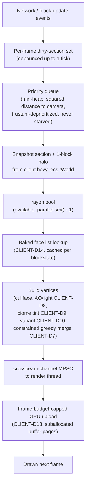
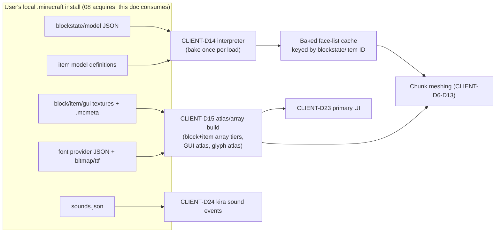
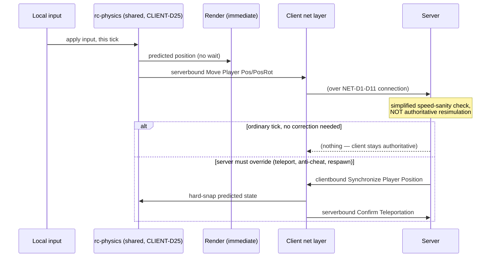
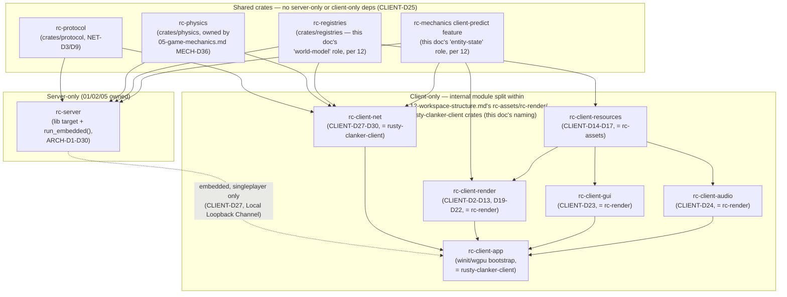

# Client Architecture

## Purpose

Defines the Phase 2 native client: the `wgpu`/`winit` render stack and render graph; the vanilla-parity chunk meshing and resource-interpretation pipelines; the entity-geometry re-authoring pipeline; particles/sky/weather/world-border/item-frame/map rendering; the GUI/text and audio systems; the netcode (client-side prediction, remote-entity interpolation, tick/clock sync) that rides on the vanilla wire protocol from `02-protocol-networking.md`; the client's own ECS/world architecture; and singleplayer's embedded-server design. Also fixes the shared-crate boundary between Phase 1 (server) and Phase 2 (client) so both sides of the workspace can depend on identical movement-physics and world-model code without either pulling in the other's server-only or client-only dependencies — the concrete mechanism behind the project vision's "shared logic crates with the server."

## Scope

**In scope:** the `wgpu`/`winit` stack and version pins; render graph architecture and frame pipelining; bindless-vs-texture-array capability tiering; the vanilla-faithful shading model; chunk-section meshing (granularity, vertex format, constrained greedy meshing, cullface, smooth lighting/AO, biome tinting, random model variant selection, animated-texture handling); the meshing threading pipeline and GPU upload/streaming strategy; the blockstate/model JSON interpreter; texture atlas/array build strategy (block/item, GUI, glyphs); item models and display transforms; font-provider interpretation and text rendering; `sounds.json` interpretation and the audio engine; entity geometry's re-authoring pipeline and procedural/keyframe animation model; particles; sky/clouds/weather/world border; item frames and maps; the GUI framework split (vanilla-faithful primary UI vs. tooling); the client's own ECS/local-world architecture and its shared-crate boundary with the server; singleplayer as an embedded server; client-side prediction, remote-entity interpolation, and tick/clock synchronization within the constraints of the vanilla wire protocol; performance targets.

**Out of scope:** asset acquisition and the Microsoft/Mojang login flow (`08-assets-auth-legal.md` — this document only *consumes* assets already present in the user's local installation and consumes an already-validated identity for the singleplayer path; it never acquires assets or performs auth itself); server-side simulation, ECS threading, and region architecture (`01-server-architecture.md`); concrete game-mechanics algorithms and constants beyond the shared `rc-physics`/`rc-world-model` crate boundary this document fixes (`05-game-mechanics.md` — this document only pins *where* movement/physics code lives, not its full algorithm, and `rc-physics`'s algorithm content itself is `05`'s MECH-D36–D42, not redefined here); wire protocol framing, packet codec, encryption, and connection lifecycle themselves (`02-protocol-networking.md` — this document consumes `rc-protocol` unmodified); chunk storage/persistence format (`03-world-chunks-persistence.md`); cluster-mode internals, proxy routing, and sector-handoff mechanics (`13-cluster-architecture.md` — this document only confirms client-side transparency to that design, CLIENT-D31).

## Decisions

| ID | Decision | Rationale |
|---|---|---|
| CLIENT-D1 | **Visual parity tiers.** Tier A (mechanically load-bearing, must be observably identical to vanilla): block/item appearance including cullface/AO/tint/animation-frame selection, GUI layout and text, hitbox-relevant geometry, and any visual state a player uses to make gameplay decisions (redstone lamp lit/unlit, potion swirl color, map contents). Tier B (cosmetic-only, visually-equivalent is sufficient, bit-matching is explicitly not pursued): star field placement, fine-grained cloud/weather procedural noise beyond the actual `clouds.png` data, minor entity idle-animation phase offsets. | Makes every subsequent decision's fidelity bar explicit and keeps Tier B items from ever tempting a source consult beyond the project's allowed-source list (ASSET-D18) — no gameplay or player-facing correctness depends on them. |
| CLIENT-D2 | **Windowing & GPU API:** `winit` 0.30.13 (crates.io, 2026-03-02) for window/surface/input events; `wgpu` 30.0.0 (crates.io, 2026-07-01, current stable major as of 2026-08-20) as the sole GPU abstraction — no direct Vulkan/DX12/Metal calls. Backend priority: Vulkan (primary, all platforms where available) > DX12 (Windows fallback) > Metal (macOS/iOS) > GL (last-resort compatibility, reduced feature set per CLIENT-D4). | `wgpu` is the only cross-platform, memory-safe-Rust, actively maintained GPU abstraction with a native (non-C-core) safety story, mirroring ARCH-D1's ECS reasoning; `winit` is its standard pairing and the only maintained cross-platform windowing crate at this maturity. |
| CLIENT-D3 | **Render graph & frame pipelining:** a custom, in-repo, lightweight render graph declares each frame's passes as a DAG of `{reads, writes, execute}` nodes over named GPU resources, topologically sorted once per graph-shape-change (not per frame) — the same static-conflict-graph-computed-once-and-reused pattern ARCH-D8 uses for the server's domain scheduler, applied to GPU passes. Frame pipelining depth = 2 (CPU records frame N+1 while the GPU executes frame N), matching `wgpu`'s default surface presentation depth. Fixed pass order: Sky → Opaque Terrain → Cutout Terrain → Opaque/Cutout Entities → Non-blended Particles → Translucent Terrain (per-section back-to-front sort, re-sorted on camera movement, **section granularity only** — matches vanilla's own well-documented per-chunk-section-only translucency sort, not per-triangle) → Translucent Particles/Weather → World Border → First-person viewmodel → HUD/GUI → optional TAA/FXAA post-process (off by default, Tier B) → optional debug overlay (`egui`, CLIENT-D23). | Fixed pass order matches vanilla's own opaque-then-translucent-by-section behavior closely enough to preserve Tier A parity for translucency edge cases players already know from vanilla; a real render graph (not a hand-ordered frame function) is what keeps the future isomorphic-mod render-pass-extension hooks inject-able without engine-core changes. |
| CLIENT-D4 | **Bindless / texture-array capability tiering:** `wgpu` 30's `TEXTURE_BINDING_ARRAY`/`BUFFER_BINDING_ARRAY`/`PARTIALLY_BOUND_BINDING_ARRAY` features (WGSL `binding_array<T>`) are used, where the runtime backend reports support (Vulkan and DX12, per `wgpu`'s current backend feature-support matrix as of 2026-08), for the block/item texture arrays (CLIENT-D15) and the animation table (CLIENT-D12), collapsing per-draw-call bind groups into one bindless bind group for the whole terrain pass. Backends without full support (Metal has no `STORAGE_RESOURCE_BINDING_ARRAY` path per current `wgpu` limitations; GL has none) fall back to the identical draw path using tiered fixed-size `texture_2d_array` bindings (one bind group per resolution tier), selected once at startup via `Adapter::features()`, never a per-frame branch. | Bindless is a real draw-call win on Vulkan/DX12 but is not universally available across `wgpu` 30's backends (Metal storage-resource bindless remains unsupported); gating behind feature detection rather than assuming universal availability is the only currently-correct choice. |
| CLIENT-D5 | **Shading model:** a vanilla-faithful forward renderer, not deferred/PBR. Terrain and entities are lit exclusively by the baked 16×16 block-light × sky-light lightmap lookup (CLIENT-D9), matching vanilla's gamma-curved brightness response, with no real-time shadow mapping and no physically-based material model. The render graph (CLIENT-D3) keeps Sky/Lighting as independently swappable passes so a future optional "enhanced" shading path (comparable to a Sodium/Iris-class shader pipeline) can be added later without restructuring the engine, but none is built in Phase 2's initial scope. | The project vision's "modern rendering pipeline" language describes implementation technology (`wgpu`, render graph, bindless), not a mandate to change vanilla's observable look; "identical player experience" is binding and takes precedence for the default path. |
| CLIENT-D6 | **Meshing granularity & vertex format:** one mesh job per 16×16×16 chunk section (matches vanilla's own storage/render-chunk granularity; current world height −64..319, 384 blocks = 24 sections/column, per minecraft.wiki). A job reads a read-only snapshot of its section plus a 1-block halo in all 6 directions (needed for cullface/AO/light sampling across section boundaries) copied out of the client `bevy_ecs::World` before submission, so mesh workers (CLIENT-D11) never touch the live `World` — reusing ARCH-D9's "no mid-stage direct `World` access from off-thread work" discipline client-side. Packed 16-byte vertex: `struct Vertex { pos_and_face: u32, uv: u32, material: u32, light_and_ao: u32 }` (`pos_and_face`: x:5 y:5 z:5 face:3, local coords 0..17 cover the halo; `material`: texture-array tier:4 layer:16 tint_index:8; `light_and_ao`: block_light:4 sky_light:4 ao:2 per corner, packed per vertex). | Section granularity matches vanilla's own boundary for lighting/chunk-update packets so no cross-boundary re-derivation is needed; the packed format bounds GPU memory/upload bandwidth at high render distance (CLIENT-D32). |
| CLIENT-D7 | **Constrained greedy meshing:** adjacent coplanar faces are merged into larger quads (per-axis greedy sweep) **only** when every merge-relevant attribute is bit-identical across the run: texture-array tier+layer, tint index, all 4 corner AO values, all 4 corner light values, and model-variant selection (CLIENT-D9/D10). This is a pure vertex-count optimization with a formal correctness invariant, not a visual approximation — a merged run renders identical pixels to a fully unmerged mesh, since merging never crosses an attribute boundary. Unconstrained greedy meshing (merge by block-type alone) was evaluated and rejected: incompatible with per-vertex AO/light, per-block biome tint, and per-position random variants — exactly the three properties this document must preserve exactly. | The common case (large uniform-light flat expanses — stone walls, ocean floors, superflat, roof undersides) still collapses to a handful of quads, delivering most of greedy meshing's win, with a guaranteed zero Tier A cost. |
| CLIENT-D8 | **Cullface & smooth lighting (AO):** a face is emitted only if the adjacent block does not fully occlude it (per-face `cullface` direction from the block model JSON, CLIENT-D15). With "smooth lighting" enabled (vanilla's own default-on graphics option), each face corner's light/AO is computed by sampling the 3 blocks adjacent to that corner (two edge-adjacent blocks plus the diagonal corner block) and averaging light levels, applying an AO darkness step per the well-documented, independently-published corner-sampling algorithm for voxel ambient occlusion (general public technique, not sourced from Minecraft source; vanilla's exact darkness-step constants are cross-checked via minecraft.wiki and black-box screenshot comparison during the blueprint phase — Open Question). Disabled, each face uses one flat light value with zero AO ("fast" lighting). | The single most visually load-bearing (Tier A) per-vertex computation in the meshing pipeline; the algorithm's general shape is public/independent, only vanilla-exact constants need live verification. |
| CLIENT-D9 | **Biome tinting:** a `tintindex`-flagged model element's color is looked up per-biome from the resource pack's `textures/colormap/grass.png`/`foliage.png` (grass/foliage) or a small fixed table (water, redstone, other fixed-formula tints), indexed by the biome's registry-declared temperature/downfall via the documented clamped-coordinate lookup (`x = (1 − clamp(temperature,0,1)) × 255`, `y = (1 − clamp(temperature,0,1) × clamp(downfall,0,1)) × 255`, floored, colormap pixel read bottom-to-top — sourced from minecraft.wiki's biome-color documentation, an allowed source per ASSET-D18(b)). Per-vertex tint is box-blurred across the vanilla "Biome Blend" radius (configurable 1×1/3×3/…/15×15, default 3×3), recomputed when a neighboring column's biome data changes. | Matches vanilla's own two-stage (per-biome lookup, then spatial blend) tinting pipeline exactly, using only publicly documented formulas. |
| CLIENT-D10 | **Random model variant selection:** for a blockstate with multiple weighted variant models (or a `multipart` weighted pool), the selected variant/rotation is chosen deterministically from a position-derived seed, `fn variant_seed(pos: BlockPos) -> u64`, so a given world position always renders the same variant across remeshes (no flicker), matching vanilla's own deterministic selection. The exact bit-mixing formula is not pinned here — sourced from minecraft.wiki's model-variant documentation where published, cross-validated during the blueprint phase against a black-box screenshot survey of live vanilla worlds (Open Question). Getting it wrong only changes *which* of several visually-equivalent variants appears — Tier B, not Tier A. | Deterministic-by-position is the load-bearing property; the exact seed formula is an appropriately deferred verify-don't-guess item given no gameplay distinguishability is at stake. |
| CLIENT-D11 | **Animated textures (`.mcmeta`):** each animated texture's frames (from its sibling `<texture>.png.mcmeta`: frame order, per-frame `frametime` overrides, `interpolate` flag) are baked at atlas-build time into consecutive array layers within its texture-array tier (CLIENT-D4/D15). A small per-material animation table (a `binding_array`-eligible storage buffer on the bindless path, a small uniform array on the fallback path) holds `{base_layer, frame_count, ticks_per_frame_default, interpolate}` plus optional per-frame overrides; the current `(frame_a, frame_b, blend_t)` is recomputed **once per simulation tick** (not per render frame) from the client's tick counter and uploaded as a small buffer write; the fragment shader lerps `frame_a`/`frame_b` by `blend_t` when `interpolate` is set. | Once-per-tick recomputation matches vanilla's own tick-driven animation cadence and keeps GPU-side cost to one small buffer write regardless of render distance. |
| CLIENT-D12 | **Meshing threading pipeline:** chunk-section mesh jobs run on a dedicated `rayon` 1.12.0 thread pool sized to `available_parallelism() − 1` (reserving one core for the main/render thread) — separate from the network Tokio runtime (NET-D7) and from the singleplayer embedded server's RC-WorkerPool (ARCH-D18) when running in-process; the three pools never share threads. Dirty sections (block/light updates, newly-received chunk data) collect into a per-frame dirty set drained once per frame (debounce up to 1 tick / 50 ms), avoiding remesh storms during explosions or long redstone/piston chains. Drained jobs are ordered by a min-heap keyed on squared distance to camera; sections outside the view frustum are deprioritized but never starved (avoids pop-in on fast turns). Completed meshes return via a `crossbeam-channel` 0.5.16 MPSC (same crate ARCH-D22/D27 use server-side, for dependency-graph consistency only — entirely separate channel instances). | Matches the required "meshing threading + remesh-on-update pipeline" while staying deliberately simpler than the server's elastic RC-WorkerPool (ARCH-D18–D20) — a single client has no per-region hotness variance to schedule around. |
| CLIENT-D13 | **GPU mesh upload & buffer suballocation:** completed section meshes upload via `wgpu::Queue::write_buffer` into slabs suballocated from large (16–64 MB, configurable) persistent `wgpu::Buffer` pages managed by an in-repo free-list suballocator, rather than one `wgpu::Buffer` per section — bounding per-draw driver/descriptor overhead at high render distance. Uploads are capped per frame (a configurable byte budget, default tuned so upload time never exceeds ~15% of the CLIENT-D32 frame budget); excess completed meshes queue for the next frame rather than blocking. | The concrete mechanism realizing "streaming without hitches": a burst of newly-meshed sections (post-teleport, fast flight) cannot itself cause a frame-time spike. |
| CLIENT-D14 | **Blockstate & model JSON interpreter:** a from-scratch interpreter (`rc-client-resources`) parses vanilla blockstate JSON (`variants` map; `multipart` case list with `when`/`OR`/`AND` predicates over block-state properties) and model JSON (`parent` inheritance chains up to vanilla's builtin roots, interpreted as data using their publicly documented element/face layout; `elements` cuboid list with `from`/`to`/`rotation`/per-face `uv`/`texture`-variable/`cullface`/`tintindex`; `textures` variable-reference resolution), fully resolving each reachable blockstate+property combination into a flattened baked face list (geometry, UV rect, tint index, cullface direction, AO flag) **once per resource-pack load**, cached by blockstate ID (from `rc-world-model`, CLIENT-D26) — never re-parsed per chunk or per mesh job. | Pre-baking once at load time keeps CLIENT-D12's per-section meshing cost to "read the pre-baked face list and sample block-context," matching vanilla's own bake-once model system. |
| CLIENT-D15 | **Texture build strategy — three atlas types matched to access pattern:** (1) block/item textures: uniform-tile `texture_2d_array`s, one array per distinct tile resolution present in the resolved resource pack (default single tier at 16×16; higher-resolution packs get additional tiers; smaller textures in a mixed pack are nearest-neighbor upsampled to their tier's resolution to satisfy `texture_2d_array`'s uniform-dimension requirement) — consumed via CLIENT-D4's bindless/tiered-fallback path. (2) GUI textures (`textures/gui/sprites/**`, individually-sized since the 1.20 GUI-sprite split): packed once at load time into a rectangle-packed 2D atlas via `etagere` 0.3.0 (guillotine packer, production-used by Servo/WebRender) — heterogeneous sizes make `texture_2d_array` a poor fit. (3) glyph atlas (fonts, CLIENT-D17): a separate `etagere`-packed, dynamically LRU-evicting atlas, since glyph coverage is session/locale-dependent rather than fixed at load. | Matching packing strategy to actual access/size pattern (uniform+static vs. heterogeneous+static vs. heterogeneous+dynamic) avoids forcing one atlas strategy onto three different workloads. |
| CLIENT-D16 | **Item models, display transforms & special renders:** item appearance resolves through the current (post-1.21.2, still current at NET-D1's 26.2 target) **item model definition** format at `assets/<namespace>/items/*.json` (`minecraft:model`/`composite`/`condition`/`select`/`range_dispatch`/`empty`/`bundle/selected_item`/`special` node types dispatching on data-component values such as `minecraft:custom_model_data`, damage, or block-item block-state) — the older per-model `overrides` predicate array is not implemented, since it is superseded, not merely deprecated, as of the pinned target. Resolved `minecraft:model` leaves reuse the block-model interpreter (CLIENT-D14). The model JSON `display` object's per-context transforms (`thirdperson_righthand`/`thirdperson_lefthand`/`firstperson_righthand`/`firstperson_lefthand`/`gui`/`head`/`ground`/`fixed`) parse into `struct ItemDisplayTransforms { contexts: HashMap<DisplayContext, Mat4> }`, selected per render context. `minecraft:special` leaves (player heads, shields, banners, tridents, bundles, chests, decorated pots, shulker boxes) render through the entity/block-entity geometry pipeline (CLIENT-D18), not the flat item-quad path. | The item-model-definition rework is a hard format break, not additive; NET-D2's single-pinned-version policy applies to data formats as well as wire protocol — implement the current format only. |
| CLIENT-D17 | **Font pipeline:** interprets vanilla's font-provider chain (`assets/minecraft/font/*.json`, `providers` list, first-match-wins per codepoint): `bitmap` (fixed pixel-grid glyph sheet sliced per its `ascent`/`height`/`chars` grid, blitted directly into the glyph atlas, nearest-neighbor, no rasterization), `ttf` (`size`/`oversample`/`shift`/`skip` per vanilla's spec, rasterized on demand via `cosmic-text` 0.19.0 — which wraps `swash` 0.2.10 for shaping/rasterization and handles complex-script shaping/BiDi for chat/sign/book text in any locale — cached into the dynamic glyph atlas, CLIENT-D15), `legacy_unicode` (Unifont hex-bitmap fallback), `space` (zero-glyph advance-width entries), and `reference` (chain inclusion). | Reproducing the full provider chain, not just Latin bitmap glyphs, is required for Tier A parity across any locale/resource-pack; `cosmic-text` is the only actively maintained pure-Rust crate combining shaping, BiDi, and rasterization at production maturity as of 2026-08. |
| CLIENT-D18 | **Entity geometry — re-authoring pipeline.** Vanilla entity geometry (cuboid part hierarchies, per-part pivot/rotation) is hardcoded Java, never shipped as external data; the pinned version's decompiled jar may be consulted as a local reference (ASSET-D18(f)), but Mojang expression is never copied verbatim (ASSET-D19). Geometry is independently re-authored, once per entity type, in **Blockbench** (`blockbench.net`, GPL-3.0, actively maintained, independent third-party cuboid-model tool with no Mojang-source lineage — used purely as an offline authoring tool, exactly as GIMP/Blender are used elsewhere in the project; exported model *data* is this project's own content, not a derivative of Blockbench's GPL'd source, and carries no GPL obligation onto the engine), driven by: (a) **hitbox dimensions** (bounding-box only) sourced from the NET-D9 `--reports` output, committed as processed facts under the same policy as NET-D10; (b) **visual proportions** from black-box observation (reference screenshots, in-game measurement) and, where independently published, community-documented model-part descriptions on minecraft.wiki (ASSET-D18(b)). Humanoid skin **UV layout** (the 64×64 Steve/Alex grid) is treated as published, standardized, independently-reverse-engineered interoperability data (documented by many independent skin-editor tools/wikis — functional mapping, not creative expression) and is safe to hardcode exactly. Exported Blockbench models convert via an in-repo importer into this project's own entity-model schema (a cuboid+pivot+UV-rect superset of Blockbench's export), consumed by CLIENT-D14's bake step. **Confirmed by `08-assets-auth-legal.md`'s ASSET-D28:** (i) `--reports` hitbox dimensions under NET-D10's factual-data reasoning, (ii) humanoid skin UV layout as safe-to-hardcode interoperability data, (iii) community-published model-part measurements vetted through `08`'s existing source-by-source ASSET-D18–D20 process. | The one domain where "read the file and reproduce it" (every other asset type's strategy) is categorically unavailable — the production *pipeline* itself, not just the output, has to be the auditable, source-policy-compliant artifact. |
| CLIENT-D19 | **Entity animation:** matches vanilla's mostly-procedural model rather than baked clips — idle limb swing, walk/run cycle, and head look-at are computed each frame from closed-form functions (sine-wave limb swing driven by movement speed and a per-entity time accumulator, matching vanilla's well-known continuous, speed-reactive procedural-animation behavior — general technique, no specific implementation consulted) over the re-authored part hierarchy (CLIENT-D18). Discrete scripted actions (eating, bow draw, attack swing, elytra glide pose, sleeping) are driven by a small keyframe system layered on top, triggered by the shared `rc-entity-state` (CLIENT-D26) fields already exposed over the wire (item-use progress, attack cooldown, pose enum) — the same protocol fields a vanilla client uses, no custom packets required. | Procedural-first matches vanilla's actual visual behavior far better than a baked-clip system would, and concentrates authoring effort only on genuinely discrete actions. |
| CLIENT-D20 | **Particles:** data-driven per-type texture reference(s) (including animated multi-frame particles via CLIENT-D11's mechanism), physics parameters (gravity scale, drag, lifetime/size ranges) resolved from the local install, rendered as GPU-instanced camera-facing billboards (one instanced draw per particle type per frame) in CLIENT-D3's particle passes. Spawned two ways: server-authoritative (`Particle` clientbound packet, exact position/count/spread) for anything gameplay-relevant, and client-predicted (block-break/step/swim particles keyed off shared movement state, CLIENT-D26/D28) for the immediate local feedback vanilla itself also predicts client-side (exact predicted-vs-authoritative particle-type list — Open Question). | Instanced billboards are the standard cheap approach at vanilla's particle density; predicting only purely-cosmetic particles (never anything gameplay-consequential) avoids visible feedback lag without risking any Tier A desync. |
| CLIENT-D21 | **Sky, clouds, weather, world border:** sky is a per-dimension gradient (biome-fog-blended, time-of-day-driven, per the dimension type's registry-declared fog/sky behavior) with a sun/moon billboard and a procedurally generated star field — per CLIENT-D1, the star field uses an engine-chosen fixed (non-world) seed at startup, explicitly not pursued to bit-identical placement (no gameplay significance; pinning an exact vanilla constant here is unnecessary provenance risk for zero value). Clouds render the local install's `environment/clouds.png` as a boolean height-field grid at native pixel resolution, extruded ("fancy") or flat scrolling quads ("fast") per the current graphics option; layer Y-height is read from dimension-type registry data where the `--reports` schema exposes it, else a documented fallback constant (Open Question). Weather renders as column-aligned precipitation particles, density/type driven by dimension/biome weather state and temperature. World border renders as a vertical wall on the border polygon, textured with the local install's `misc/forcefield.png`, UV-scrolling, alpha-blended, red-tinted as warning thresholds are crossed. | Every Tier A element here (actual cloud texture data, world-border geometry/warning behavior) is read directly from local assets or server-sent state per doc 08's boundary; only the explicitly flagged Tier B star field is treated more loosely. |
| CLIENT-D22 | **Item frames & maps:** item frames render their attached item via the standard item-model path (CLIENT-D16) at fixed small scale/rotation on the mounting face, plus the frame's own border geometry via the entity/block-entity pipeline (CLIENT-D18). Maps render as a dynamic 128×128 `wgpu::Texture` per active map ID, updated incrementally from each `Map Data` clientbound packet's partial-update rectangle (never a full re-upload), decoding vanilla's documented fixed map-color palette (base color ID × 4 brightness shades → RGB, published functional data) into pixels; cached by map ID, evicted when no loaded item stack or in-view item-frame references it. | Incremental partial-rectangle updates match the wire format's own update granularity, avoiding unnecessary full-texture uploads. |
| CLIENT-D23 | **GUI framework split** — two systems, deliberately not unified. (1) **Vanilla-faithful primary UI** (HUD, inventory/container screens, menus, chat): a custom in-repo retained-mode widget system driven by the GUI sprite atlas (CLIENT-D15) and vanilla's integer `gui_scale` pixel-snapping model, since vanilla's container/menu screens are fixed-position-texture layouts (specific arrangements of 9-slice panel sprites and slot positions), not a flexible flow/constraint layout — a general-purpose immediate-mode toolkit cannot reproduce this without fighting the toolkit at every screen. (2) **`egui`** 0.36.1 (+ `egui-wgpu`/`egui-winit` 0.36.1, sharing the same `wgpu` device/surface) for engine-internal and mod-tooling surfaces where vanilla fidelity is explicitly not required — the debug/F3-equivalent overlay, a mod manager/settings screen, crash/diagnostic dialogs — rendered as an additional CLIENT-D3 pass layered above the primary UI. | The same split real-world "vanilla-plus-tooling" clients use, because the two UI classes have genuinely incompatible layout requirements, not a technology preference. |
| CLIENT-D24 | **Audio:** `kira` 0.12.3 (crates.io, 2026-08-09) as the audio engine, not `rodio` — `kira`'s clock/tween system and built-in spatial-audio and mixer-track (category) primitives map directly onto vanilla's own sound model (per-category volume sliders: master/music/record/weather/block/hostile/neutral/player/ambient/voice; per-sound pitch/volume ranges and falloff from `sounds.json`), where `rodio` (0.21.1, also current) would require hand-rolling all of that on top of a lower-level playback-only API. Every sound event resolves through the local install's `assets/<namespace>/sounds.json` (event name → weighted sound list, each entry with volume/pitch/weight/stream flag and category) exactly as vanilla defines it; positional sounds use `kira`'s spatial emitter attached to the source position with distance attenuation matching vanilla's own falloff curve; non-positional sounds (music, most UI) play on their category's mixer track directly. | `kira` is purpose-built for exactly this "game with mixer categories, spatial emitters, tweened parameters" shape, at current production maturity as of 2026-08. |
| CLIENT-D25 | **Shared crate layout & workspace boundaries.** The client shares three crate *roles* with the server, unmodified, none of which may depend on anything server-only (Tokio, RC-Executor/RC-WorkerPool, region logic) or client-only (`wgpu`, `winit`, `kira`) — per `12-workspace-structure.md`'s WS-D2/WS-D3, these roles are realized as three of that document's existing crates, not new ones: `rc-protocol` (`crates/protocol`, NET-D3/D9 — the packet codec itself); `rc-physics` (`05-game-mechanics.md`'s MECH-D36, `crates/physics/` — pure kinematics/collision-sweep functions over a plain `MovementState` struct: gravity, drag, fluid physics, sneak/sprint/jump speed modifiers, block-collision resolution, zero ECS/I-O dependency, so it runs identically inside the server's Stage 6b (ARCH-D15) and inside the client's per-tick prediction step, CLIENT-D28 — `05` owns the crate and its algorithm content; this document only fixes that the client links it unmodified); the "world-model" role (block-state/biome/registry static data generated by the NET-D9 `xtask codegen` pipeline: block-state IDs and `is_full_cube`/opacity/light-emission properties, biome temperature/downfall/color data, dimension-type registry fields — consumed server-side for game logic and client-side for meshing/AO/tint/sky, CLIENT-D8/D9/D21) is `rc-registries` (`crates/registries/`, `12`'s existing crate — not a separate `rc-world-model`); the "entity-state" role (the subset of entity components that are both simulation- and render/animation-relevant: position/velocity/rotation, pose flags, health/damage-flash timers, item-use/attack-cooldown progress — deliberately excludes server-only AI/pathfinding types) is `rc-mechanics`'s `client-predict` feature (`12`'s WS-D5(c) — not a separate `rc-entity-state` crate). **Requires `01-server-architecture.md`'s eventual concrete crate layout to expose its top-level engine as a library crate (an `rc-server` lib target with a `pub fn run_embedded(...)` entry point), not solely a `main.rs` binary**, so CLIENT-D27's singleplayer mode can embed it in-process — resolved: `12-workspace-structure.md`'s `rusty-clanker-server` manifest entry now states exactly this bin+lib split. | The concrete realization of "planning now ensures Phase-1 code splits into shared crates correctly" — fixing this boundary before either side's implementation exists is what prevents an accidental server-only or client-only dependency from leaking into code that must compile for both; reusing `12`'s existing crates for the world-model/entity-state roles instead of proposing two more keeps the workspace's crate manifest closed and singly-owned per `12`'s own WS-D2 rule. |
| CLIENT-D26 | **Client ECS & local-world architecture.** The client runs its own `bevy_ecs::World` (same `bevy_ecs` 0.19.1, same `default-features = false, features = ["std"]` as ARCH-D1/D2) as its "client world," populated by translating inbound protocol packets into entities/components built from `rc-registries` (world-model) and `rc-mechanics`'s `client-predict` feature (entity-state) — both per CLIENT-D25. Unlike the server, it has no regions, no RC-Executor, and no ARCH-D8/D9-style multi-stage sync-point pipeline — its per-tick workload runs as a short, fixed, single-threaded ordered system list each 50 ms simulation tick: apply-network-events → local-player prediction (CLIENT-D28, via `rc-physics`) → remote-entity interpolation (CLIENT-D29) → animation-state update (CLIENT-D19). At tick end, a plain-old-data **render snapshot** (positions/rotations/poses/animation-blend-state for everything in view) is extracted and handed to the render thread via a double-buffered slot, so the render thread — running at its own uncapped/vsync-paced frame rate, decoupled from the fixed tick (CLIENT-D30) — never touches the live `World` directly (a general "sim world vs. render-facing snapshot" split, architecture-only reference, no code consulted). | The client's ECS workload has none of the concurrency/region complexity ARCH-D5–D23 exists to solve, so reusing `bevy_ecs` itself (shared component types, query ergonomics) without reusing any server scheduling machinery is the correctly-scoped amount of reuse. |
| CLIENT-D27 | **Singleplayer = embedded server.** Singleplayer starts the full server engine (the `rc-server` lib target, CLIENT-D25) on a background thread inside the client process, running ordinary MONOLITHIC mode (ARCH-D26/D27, `InProcessTransport`) exactly as a dedicated deployment would — no client-specific server code path. The client's network layer connects over a new **Local Loopback Channel**: a `tokio::io::duplex` (in-process `AsyncRead`/`AsyncWrite` pair, Tokio `io-util` feature) substituted for the `TcpStream` half in NET-D7's per-connection reader/writer tasks — the identical framing/compression codec (NET-D5) runs unmodified, only the byte transport changes from a socket to a memory copy. Two NET-D6 steps are skipped for this path only, mirroring vanilla's own local/LAN behavior: AES encryption (no untrusted network segment exists inside one process) and Mojang session-server `hasJoined` validation (the player's identity was already established by the client's own prior Microsoft/Mojang login, owned by `08-assets-auth-legal.md`, and is passed pre-validated into the embedded server's login handshake). | Maximizing shared code path (same codec, same ECS, same everything except transport and the two skipped auth steps) keeps singleplayer from becoming a second, divergently-maintained implementation; the skip list matches exactly what vanilla itself also skips for local play. |
| CLIENT-D28 | **Client-side prediction & reconciliation.** The local player's movement is computed **locally, immediately, every tick** by the shared `rc-physics` crate (CLIENT-D25), fed the same input state the corresponding server-side Stage 6b (ARCH-D15) integration would use, and rendered without waiting on any server round-trip — this reproduces vanilla's actual protocol design (the client is the position-computing authority for its own movement and reports the result via the standard serverbound movement packet family, while the server runs a simplified movement/speed-sanity check rather than authoritative resimulation), not a predict-then-reconcile-against-server-authority model. Reconciliation happens **only** when the server explicitly overrides position: a clientbound `Synchronize Player Position` (teleport) packet, answered with `Confirm Teleportation` (echoing the teleport ID) before the server accepts further movement reports; on receipt the client hard-snaps predicted state and resumes local prediction from there. Because both sides run the byte-identical `rc-physics` crate against byte-identical `rc-registries` (world-model, CLIENT-D25) collision data, a teleport correction should be rare in the ordinary case. | The only netcode model that stays wire-compatible with the vanilla Java Edition protocol (which has no server-authoritative-movement packet shape to opt into) while still getting prediction correctness "for free" from the shared crate rather than a second, client-only movement reimplementation. |
| CLIENT-D29 | **Remote entity interpolation:** every non-local entity's position/rotation is interpolated, never snapped, across a short fixed buffer window (default 3 ticks, matching vanilla's well-known short interpolation window for regular entity movement — exact vanilla step count cross-checked via black-box replay comparison during the blueprint phase, Open Question) fed by the vanilla delta-position packet family (`Move Entity Pos`/`PosRot`/`Rot`, fixed-point deltas at the documented 1/4096-block granularity per minecraft.wiki) plus the periodic absolute `Teleport Entity` packet as a hard resync point; rotation interpolates via shortest-arc angle lerp, position via linear lerp over the buffer window. | Reproducing vanilla's own interpolation window (not a larger, smoother one) is Tier A — players' read of a mob's speed/distance depends on the same visual latency vanilla gives them. |
| CLIENT-D30 | **Tick/render decoupling & clock sync:** simulation (CLIENT-D26/D28/D29) runs a fixed 50 ms accumulator step matching the server's 20 TPS target (ARCH-D7); rendering runs at its own frame rate (vsync-paced or uncapped, CLIENT-D32), interpolating between the last two simulation snapshots via a `partial_ticks` alpha — the same render/tick split vanilla has always had, reproduced. Since the vanilla wire protocol carries no explicit server tick-number field, the simulation clock synchronizes to the server's cadence purely by observation: an exponentially-smoothed inter-packet-arrival estimate (a jitter buffer) plus round-trip time from the standard `Keep Alive` pair, tolerant of ordinary network jitter. When both endpoints are Rusty Clanker (detected via standard `minecraft:register` plugin-channel negotiation during `Configuration`), an additional namespaced channel, `rustyclanker:tick_sync`, carries the server's authoritative tick counter and timing metadata as a pure enhancement tightening the estimate — the observation-based path remains the correctness baseline and the sole path against a vanilla server or for a vanilla client connecting to our server, which must ignore the unrecognized channel per the plugin-channel spec's own unknown-channel-is-ignorable contract. | Plugin channels are the protocol's own sanctioned extension point for exactly this same-implementation-only enhancement, staying wire-compatible (NET-D2) rather than diverging the protocol. |
| CLIENT-D31 | **Cluster transparency:** the client has **zero** cluster awareness and no code conditioned on monolithic-vs-cluster deployment. `13-cluster-architecture.md`'s proxy (CLUSTER-D20–D23) terminates NET-D6 encryption/session-validation exactly once and is, from the client's view, an ordinary Java Edition server on one continuous TCP connection for the whole session; sector-ownership handoffs are buffered/forwarded by the proxy inside its documented ≤2-tick budget with no client-visible disconnect, reconnect, loading screen, or protocol signal. The vanilla `Transfer` packet (NET-D4) — a distinct, player-visible feature for moving between independently operated servers — is never used by intra-cluster handoff, which must be seamless precisely because it avoids this mechanism. | Directly confirms the vision's "crossing a sector border is completely seamless" from the client side; this document's only obligation is to not add any assumption that would break it, which the rest of this document (one persistent connection, jitter-tolerant clock sync) already satisfies. |
| CLIENT-D32 | **Performance targets:** frame budget 16.6 ms (60 FPS) on a "recommended" hardware profile (mid-range discrete GPU + 6+ CPU cores, roughly the pinned protocol version's release era — deliberately left relative rather than a specific model that would age immediately, Open Question) as default, render thread uncapped/adaptive-vsync beyond that; simulation stays fixed at 20 TPS regardless of render rate (CLIENT-D30). Render distance: sustain the full vanilla slider range (2–32 chunks) at target frame budget on the recommended profile; a Distant-Horizons-class beyond-32-chunk LOD system is explicitly deferred out of Phase 2's initial scope (noted, not committed). Streaming: mesh building (CLIENT-D12) and GPU upload (CLIENT-D13) are both off the render thread and frame-budget-capped, so a burst of newly-visible chunks (fast flight, teleport, elytra) degrades to briefly-reduced edge detail rather than a frame-time spike — no synchronous "wait for chunk mesh" stall is ever on the render thread's critical path. | The concrete, testable numbers "frame budget, render distance targets, streaming without hitches" resolve into; render-distance parity with vanilla's slider is the binding Tier A floor, with headroom explicitly reserved as noted-not-committed rather than silently scoped out. |

## Render Architecture

```mermaid
flowchart LR
    Sky --> OpaqueTerrain["Opaque Terrain"]
    OpaqueTerrain --> CutoutTerrain["Cutout Terrain\n(alpha-tested foliage etc.)"]
    CutoutTerrain --> Entities["Opaque/Cutout Entities"]
    Entities --> ParticlesOpaque["Non-blended Particles"]
    ParticlesOpaque --> TranslucentTerrain["Translucent Terrain\n(per-section back-to-front)"]
    TranslucentTerrain --> ParticlesBlend["Translucent Particles / Weather"]
    ParticlesBlend --> Border["World Border"]
    Border --> Viewmodel["First-person Viewmodel"]
    Viewmodel --> HUD["HUD / GUI\n(CLIENT-D23 primary UI)"]
    HUD --> Post["Optional TAA/FXAA\n(Tier B, off by default)"]
    Post --> Debug["Optional egui overlay\n(CLIENT-D23 tooling)"]
```

Each node is a render-graph pass (CLIENT-D3) declaring its resource reads/writes; the graph is built once at startup (fixed pass list) and only its per-frame resource bindings vary. Frame pipelining depth is 2, matching the diagram in `01-server-architecture.md`'s treatment of statically-computed conflict graphs, applied here to GPU passes instead of ECS systems.

## Chunk Meshing Pipeline

## Resource Interpretation Pipeline

## Client-Side Prediction & Reconciliation

## Shared-Crate & Client-Only Crate Layout

Node labels above are this document's descriptive names for its extension points; `12-workspace-structure.md`'s WS-D2 is the authority on actual crate boundaries — `rc-world-model` and `rc-entity-state` are not separate crates (they are `rc-registries` and `rc-mechanics`'s `client-predict` feature, respectively), and the six `rc-client-*` boxes are internal modules inside `12`'s `rc-assets`/`rc-render`/`rusty-clanker-client`, not six additional crates.

## Process & Thread Topology

The main thread owns the `winit` event loop, the fixed-tick accumulator (CLIENT-D30), and render command-buffer recording/submission — the standard `winit`+`wgpu` game-loop shape, unchanged from how every native `wgpu` application structures itself. Around it: the `rayon` mesh-worker pool (CLIENT-D12); a Tokio multi-thread runtime for network I/O, sized and isolated the same way NET-D7 isolates the server's runtime from its worker pool; `kira`'s own internal audio-callback thread; and, in singleplayer only, the fully separate embedded server (its own Tokio runtime plus RC-WorkerPool, ARCH-D18/D21, entirely unaware it is embedded) connected only through the Local Loopback Channel (CLIENT-D27). None of these five thread groups share a work queue with any other; every hand-off between them is an explicit bounded channel.

## Interfaces

**Needs from `01-server-architecture.md`:** the eventual concrete workspace crate layout must expose the server engine as a library crate (`rc-server` lib target, `pub fn run_embedded(...)`), not solely a `main.rs` binary, so CLIENT-D27's singleplayer mode can embed it in-process; the layout should also honor the shared/server-only crate boundary CLIENT-D25 draws (`rc-physics`, `rc-registries`, `rc-mechanics`'s `client-predict` feature must never gain a Tokio/RC-Executor/region dependency) — resolved: `12-workspace-structure.md`'s `rusty-clanker-server` manifest entry now fixes exactly this bin+lib split.

**Needs from `02-protocol-networking.md`:** NET-D7's per-connection reader/writer task implementation should be generic over `AsyncRead + AsyncWrite` (not hardcoded to `TcpStream`) so CLIENT-D27's Local Loopback Channel can substitute `tokio::io::duplex` — flagged for 02's next revision. Also needs 02 to reserve `rustyclanker:tick_sync` (CLIENT-D30) as a first-party namespaced plugin channel so no future engine feature collides with it.

**Needs from `05-game-mechanics.md`:** resolved in part — `05` owns `rc-physics` outright (MECH-D36–D42 fix its crate location, API shape, and collision/physics algorithm; MECH-D36's own rationale was written specifically to satisfy this document's client-reuse requirement), so CLIENT-D25/D28 consume it unmodified rather than co-owning it. Still open: `05` has not yet stated whether any mechanic requires server-authoritative resimulation of the local player's own movement — nothing in `05` today contradicts CLIENT-D28's model, but an affirmative confirmation is still needed.

**Needs from `08-assets-auth-legal.md`:** resolved — `08`'s ASSET-D28 confirms all three of CLIENT-D18's flagged items (hitbox-dimension committing under NET-D10's factual-data reasoning, humanoid skin UV-layout hardcoding, and the community-sourced model-part-measurement vetting process, which reuses `08`'s existing ASSET-D18–D20 allowed/forbidden-source and PR-attestation policy rather than needing a bespoke one); confirms 08 remains sole owner of asset acquisition and the Microsoft/Mojang login flow whose resulting identity CLIENT-D27 consumes pre-validated.

**Needs from `13-cluster-architecture.md`:** none beyond what is already resolved — CLIENT-D31 confirms this document's assumptions (one continuous connection, jitter-tolerant clock sync) already satisfy CLUSTER-D20–D23's seamless-handoff requirement with no client-side change.

**Provides to `06-modding-api.md`:** the concrete data shapes behind MOD-D18's five thin client extension-point names, closing `06`'s flagged "Needs from `07`" item — `register-model-provider` takes a mesh/material description shaped like CLIENT-D14's baked face list (geometry, UV rect, tint index, cullface direction, AO flag); `register-block-renderer` takes a texture-atlas handle into CLIENT-D15's block/item texture-array tiers; `register-gui-screen`/`register-hud-overlay` take a GUI widget-tree representation over CLIENT-D23's primary-UI widget system; `register-input-binding` takes an input-binding representation over the same input layer CLIENT-D26/D30's tick loop reads. Also: the additional client-side hook injection points this document's own architecture exposes beyond MOD-D18 — render-graph pass extension (CLIENT-D3) and custom entity-renderer registration (CLIENT-D18/D19) — for `06` to fold into its client extension-point catalog if it grows one.

**Provides to `03-world-chunks-persistence.md`:** none directly — the client does not persist world data itself in multiplayer; CLIENT-D27's embedded singleplayer server uses 03's ordinary persistence unmodified (local-disk default, per CLUSTER-D17's monolithic-mode default).

**Needs from `14-performance-engineering.md`:** none beyond optional extensions — `14` owns client rendering performance depth beyond meshing itself (mesh-build SIMD, GPU-driven Hi-Z occlusion culling with its dedicated correctness test class, buffer-mapping strategy, shader-permutation/pipeline-cache policy; PERF-D40–D44), extending CLIENT-D3/D4/D6–D14, and resolves CLIENT-D32's frame-budget/reference-hardware Open Question (PERF-D63–D64).

## Open Questions

- Exact vanilla AO darkness-step constants for smooth lighting (CLIENT-D8) — verify via minecraft.wiki plus a black-box screenshot comparison pass during the blueprint phase.
- Exact position-seed bit-mixing formula for random model variant selection (CLIENT-D10) — source from minecraft.wiki where published, cross-validate statistically against live vanilla worlds.
- Exact vanilla remote-entity interpolation step count if it is not 3 ticks (CLIENT-D29) — confirm via black-box packet-capture/replay comparison.
- Cloud layer Y-height source: confirm whether the current dimension-type `--reports` schema exposes it, or pin the historical fallback constant (CLIENT-D21).
- NET-D7 reader/writer task genericization over `AsyncRead + AsyncWrite` for the Local Loopback Channel — needs a follow-up revision of `02-protocol-networking.md` (flagged in Interfaces).
- ~~A concrete "recommended hardware profile" spec for CLIENT-D32's frame-budget target~~ is resolved by `14-performance-engineering.md`'s PERF-D63 (per-phase frame-budget breakdown) and PERF-D64 (a concrete, each-cycle-recalibrated reference hardware profile, framed as an illustrative class rather than a permanent GPU-model pin).
- `wgpu` 30's Metal bindless/storage-resource-binding-array gap (CLIENT-D4) should be re-checked against `wgpu`'s changelog when client implementation begins, since this is an area of active upstream development.
- The exact set of client-side-predicted (vs. server-authoritative-only) particle types (CLIENT-D20) is deferred to a black-box observation pass rather than enumerated now.
- Whether a Distant-Horizons-class beyond-32-chunk LOD terrain system becomes an actual Phase 2 (or Phase 2.x) commitment is explicitly left open (CLIENT-D32 only notes it as a deferred stretch, not a scoped-out rejection).
