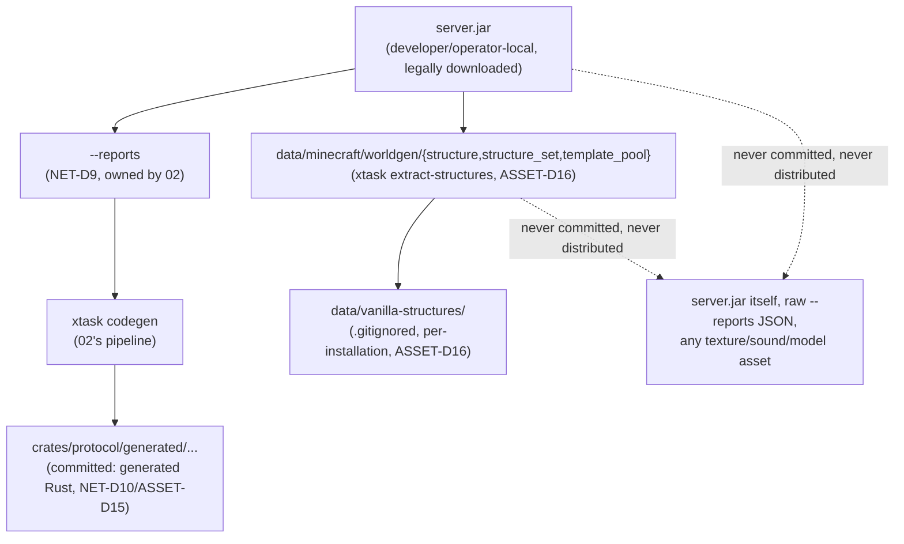

# Assets, Authentication & Legal

## Purpose

Defines three tightly-linked policy surfaces that together let this project legally exist: (1) how the Phase 2 native client authenticates a player against Microsoft/Xbox/Mojang identity services and proves game ownership before it is allowed to join any server; (2) how both the client and the Phase 1 server acquire the Mojang-authored data and assets they need to function, and the strict legal-custody boundary on what of that data may ever be committed to this repository or shipped in a release artifact; (3) the source-reference engineering rules binding every contributor, and the branding/trademark/EULA posture the project takes toward Mojang and Microsoft.

**This document is engineering policy, written by and for engineers implementing this project. It is not legal advice, has not been reviewed by a lawyer, and must not be treated as a substitute for qualified legal counsel before any commercial release.** Every "DECIDE conservatively" instruction this document executes on is a risk-minimization engineering default, not a legal opinion about what the law permits.

## Scope

**In scope:** the Phase 2 client's own implementation of the Microsoft OAuth device-code flow through Xbox Live (XBL) and XSTS to `api.minecraftservices.com`, including the Azure AD app-registration and Minecraft-API-scope approval process third-party launchers must complete; game-ownership entitlement enforcement and profile retrieval; the client-side half of the online-mode "join" call and how it hands off to `02-protocol-networking.md`'s server-side session validation (NET-D6); the cluster-mode placement reconciliation with `13-cluster-architecture.md`'s proxy-termination decisions; the `.minecraft` local-installation layout and the verified split of which game resources live in the version client jar versus the hash-addressed asset-object store; the strict policy on whether the client may ever fetch assets from a Mojang/Microsoft CDN itself; the legal-custody policy (commit vs. locally-regenerate) for server-side Mojang-derived data, jointly with `02`'s NET-D10, extended here to worldgen structure NBT templates; a survey of comparable open-source projects' data-custody practices; the binding contributor source policy (allowed/forbidden sources, vetting); project naming, required disclaimers, and EULA/Usage-Guidelines compatibility analysis; the project's top legal/technical risks and their mitigations.

**Out of scope:** how the Phase 2 client renders or loads assets into GPU-consumable form once acquired (owned by `07-client-architecture.md`); the wire-level packet formats, framing, compression, and encryption *algorithm* of the online-mode handshake, and the server's own `hasJoined` verification call (owned by `02-protocol-networking.md`, NET-D5/NET-D6 — this document supplies the client-side counterpart and the identity data that feeds it, not the algorithm itself); cluster topology, proxy scaling, and the handoff protocol themselves (owned by `13-cluster-architecture.md` — this document only confirms that its authentication chain is unaffected by where in that topology NET-D6 executes); world-generation's *consumption* of structure templates (owned by `04-worldgen-parity.md` — this document only sets the legal-custody rule for the template files themselves); chunk/region persistence format (owned by `03-world-chunks-persistence.md`).

## Decisions

| ID | Decision | Rationale |
|---|---|---|
| ASSET-D1 | **Only the Phase 2 native client performs Microsoft/Xbox authentication.** The Phase 1 server — in both monolithic and cluster mode — never contacts any Microsoft or Xbox Live endpoint and requires zero Azure credentials of its own; per `02`'s NET-D6, the server's entire involvement is an unauthenticated `GET` to Mojang's public `hasJoined` endpoint. Any Java Edition-protocol-compliant client (vanilla or ours) that has already completed its own Microsoft login may connect. | The vanilla online-mode handshake was designed so the server never sees a Microsoft credential at all — it only verifies, after the fact, that *some* client already proved ownership to Mojang. Preserving that separation keeps every Phase 1 server operator free of any Microsoft/Azure registration burden, which matters directly for the "simple as a single Docker container" promise (`01`). |
| ASSET-D2 | **Azure AD app registration:** one public-client (no client secret) OAuth 2.0 application is registered under the **`consumers`** Azure AD audience (personal Microsoft accounts only — the `common` audience or a work/school tenant ID both fail for the `XboxLive.signin` scope), no redirect URI required (the device-code grant needs none). Its client ID is submitted through Microsoft's Minecraft-API access-review form (`https://aka.ms/mce-reviewappid`) — required for every Azure app created after Microsoft locked the API behind approval; `api.minecraftservices.com` returns HTTP 403 for any unapproved app ID regardless of an otherwise-correct token. Approval routes through Microsoft's ID@Xbox independent-developer program. The officially-distributed client binary embeds the project's own approved client ID (embedding a public client's ID is not a secret-leak — it is how every Microsoft public client, including the vanilla launcher, works); a self-built binary may override it via `[auth] client_id` in config, so the project's own approval status is never a single point of failure for anyone building from source. | The `consumers`-audience and no-secret requirements are Microsoft platform constraints, not a project choice. The approval gate is a genuine, documented 2026 requirement (see ASSET-Risk-1) with an opaque timeline — the config-overridable client ID is the concrete mitigation: it decentralizes the approval dependency instead of hard-blocking every self-built binary on this project's own review outcome. |
| ASSET-D3 | **Full client-side token chain**, implemented in a new `rc-auth` crate, hand-written against public documentation (minecraft.wiki's *Microsoft authentication* page and Microsoft identity-platform docs) and reusing `02`'s/`12-workspace-structure.md`'s already-pinned `reqwest` 0.13.4 stack (rustls backend) plus `serde_json` — no `oauth2` crate (crates.io `oauth2` 5.0.0, last published January 2025, has no confirmed device-code-grant support and would be the only consumer of it in this codebase) and no Minecraft-specific auth crate (see ASSET-D4's rejection of `azalea-auth`): <br>1. **Device code:** `POST https://login.microsoftonline.com/consumers/oauth2/v2.0/devicecode` with `client_id`, `scope=XboxLive.signin offline_access` → `{device_code, user_code, verification_uri, expires_in, interval}`. <br>2. **User consent:** client displays `user_code` + `verification_uri`; player completes sign-in in their own browser. <br>3. **Token poll:** `POST https://login.microsoftonline.com/consumers/oauth2/v2.0/token` with `grant_type=urn:ietf:params:oauth:grant-type:device_code`, `device_code`, `client_id`, repeated every `interval` seconds until `access_token`+`refresh_token` (honoring `authorization_pending` / `slow_down` / `expired_token` / `authorization_declined` per RFC 8628). <br>4. **Xbox Live (XBL):** `POST https://user.auth.xboxlive.com/user/authenticate`, body `RpsTicket = "d=<MSA access_token>"` → XBL token + user hash (`uhs`). <br>5. **XSTS:** `POST https://xsts.auth.xboxlive.com/xsts/authorize`, `RelyingParty = "rp://api.minecraftservices.com/"` → XSTS token, or an `XErr` failure code (ASSET-D5). <br>6. **Minecraft login:** `POST https://api.minecraftservices.com/authentication/login_with_xbox`, `identityToken = "XBL3.0 x=<uhs>;<xsts_token>"` → a Minecraft-scoped bearer `access_token` (opaque to us; treated as a plain string, valid 86400 s, never decoded/verified client-side). | Mirrors NET-D3's already-established philosophy exactly: implement a well-documented external protocol from public docs and generic supporting crates, never adopt a framework-fused, Minecraft-specific third-party crate whose release cadence and architecture we do not control. |
| ASSET-D4 | **`azalea-auth` (crates.io, latest `0.16.0+mc26.1`, published 2026-03-28) is explicitly not adopted**, despite being an actively-maintained, narrowly-scoped candidate. Reading its *architecture* for inspiration is permitted (as `02`'s NET-D3 already establishes for other independent reimplementations), but its code may not be consulted or copied (ASSET-D19's third-party-code rule); Authlib's decompiled form inside the official unobfuscated jar is consultable as reference under ASSET-D18(f), yet `rc-auth` (ASSET-D3) is deliberately written only from minecraft.wiki and Microsoft's own OAuth documentation — this security-sensitive surface gains auditability from documented-protocol provenance, not from mirroring Mojang's client code. `minecraft-msa-auth` (crates.io, `0.5.0`, published 2026-08-13 — a standalone, framework-decoupled crate scoped to exactly this token chain) was evaluated and also not adopted, purely to keep this narrow, security-relevant surface as auditable in-tree code rather than a third-party dependency, consistent with `rc-protocol`'s (NET-D3) same posture. | A "port of Authlib" is exactly the kind of description that must trigger clean-room scrutiny rather than casual adoption; declining to even inspect its source removes any ambiguity about provenance. Keeping a security-sensitive, small surface in-tree (rather than as an external dependency) is a defensible engineering choice independent of the clean-room question. |
| ASSET-D5 | **XSTS failure codes surface actionable, specific errors** to the player rather than a generic "login failed": `2148916233` (no linked Xbox account — direct the player to sign in once at minecraft.net to create one), `2148916235` (Xbox Live unavailable in the account's country), `2148916236`/`2148916237` (adult age-verification required, the latter South-Korea-specific), `2148916238` (child account not yet added to a Microsoft Family group — noted as occurring specifically with third-party/custom Azure app registrations, i.e. relevant to us and not to the vanilla launcher). | These codes are stable, publicly documented Xbox platform behavior (verified against current community launcher implementations and Microsoft Q&A threads), not decompiled-source knowledge; surfacing them concretely is a meaningful support-burden reduction for a project shipping its *own* Azure app registration rather than piggybacking on the vanilla launcher's. |
| ASSET-D6 | **Entitlement (ownership) check is enforced, not advisory:** after obtaining the Minecraft bearer token, the client calls `GET https://api.minecraftservices.com/entitlements/mcstore` (Bearer auth) and refuses to proceed to server connection if the response contains no valid Java Edition ownership entitlement. This is a second, independent gate on top of `02`'s NET-D6 server-side `hasJoined` check (which only verifies *this specific join*, not that the account owns the game) and is not skippable by any client-side configuration flag in the officially-distributed binary. | Directly executes the project vision's "legitimate Microsoft login + purchased game account required for online play." Because we distribute an engine and never touch Mojang's asset pipeline ourselves, this entitlement check is the one place our own code affirmatively confirms the player is a paying customer rather than merely inferring it from a successful protocol handshake. |
| ASSET-D7 | **Profile retrieval:** `GET https://api.minecraftservices.com/minecraft/profile` (Bearer auth) → `{id (UUID), name, skins[], capes[]}`. These fields are the canonical player identity `rc-auth` hands to the rest of the client (window title, local player-list UI, and the client-side join call, ASSET-D8) — never re-derived elsewhere. | Single source of truth for identity on the client side, matching `02`'s own "resolved player identity... handed to whichever domain owns player-profile/identity state" interface commitment (NET-D6/NET-D8). |
| ASSET-D8 | **Client-side join call** (the step that completes the loop into `02`'s NET-D6): once the client has received an `Encryption Request` from the server (RSA public key DER, verify token, server ID string — NET-D5/NET-D6 wire fields, owned by `02`) and generated its AES shared secret, it computes the Notchian server hash (SHA-1 of `serverId ++ sharedSecret ++ serverPublicKey`, signed-BigInteger hex encoding — identical algorithm to the server's own hash computation in NET-D6, executed independently on both ends) and calls `POST https://sessionserver.mojang.com/session/minecraft/join` with `{accessToken, selectedProfile: <uuid, no dashes>, serverId: <hash>}` **before** sending its `Encryption Response` packet. Only after this call succeeds does the server's own `hasJoined` check (NET-D6) find a matching record. | This is the one step of the online-mode handshake that happens on the client, so it belongs to this document's "full token chain" rather than to `02`'s server-side-only NET-D6 — but it consumes wire-protocol fields `02` owns and feeds a check `02` performs, so it is documented here strictly as the client-side completion of that shared exchange, not a redefinition of it. |
| ASSET-D9 | **Cluster mode changes nothing about ASSET-D1–D8.** The entire chain is client-to-Microsoft/Mojang-cloud traffic that never touches Rusty Clanker's own network stack in either mode; the client cannot distinguish, and does not need to, whether the peer on the other end of its TCP/QUIC-fronted connection is a monolithic server or a cluster proxy (`13`, CLUSTER-D20). The one placement fact this document depends on from `13`: in cluster mode, the `Encryption Request`/`Encryption Response` exchange and the server-side `hasJoined` call execute exactly once, at the proxy (CLUSTER-D20) — never per-node, never re-run on a handoff (CLUSTER-D22) — so from ASSET-D8's perspective there is exactly one join call per client connection lifetime regardless of how many regions/nodes that player later crosses. | Directly reconciles this document's client-auth chain with `13`'s CLUSTER-D20/D21/D22/D23: because encryption terminates once at a stable proxy identity rather than per-node, the client never re-runs ASSET-D8's join call mid-session, which is exactly the precondition CLUSTER-D22's zero-disconnect handoff requires ("if each node independently re-ran NET-D6 per connection, a handoff would require a full reconnect" — `13`'s own stated rationale). No cluster-specific behavior is added to `rc-auth` itself. |
| ASSET-D10 | **Refresh-token persistence:** the MSA `refresh_token` (and, if present, the XSTS/Minecraft token pair for the remainder of their validity) is persisted **locally on the player's own machine only**, via the `keyring` crate (crates.io `4.1.6`, published 2026-08-01) — Windows Credential Manager, macOS Keychain, or the Linux Secret Service, per platform. It is never transmitted to, logged by, or stored on any Rusty Clanker server or proxy, monolithic or cluster. | OS-native credential storage is the correct-by-construction answer to "don't roll your own encryption for a bearer credential"; explicitly ruling out server-side storage removes an entire class of server-side credential-theft risk this project has no reason to accept, since the server never needs to see this token at all (ASSET-D1). |

| ID | Decision | Rationale |
|---|---|---|
| ASSET-D11 | **`.minecraft` local installation is a hard prerequisite for the Phase 2 client**, never created, populated, or repaired by Rusty Clanker itself. Standard per-OS locations: Windows `%APPDATA%\.minecraft`, macOS `~/Library/Application Support/minecraft`, Linux `~/.minecraft` (all three are the official Mojang launcher's own conventions, unchanged for over a decade). Relevant subtree: `versions/<id>/<id>.jar` + `versions/<id>/<id>.json` (the version manifest, carrying an `assetIndex{id, url, sha1, size, totalSize}` object plus `downloads.client{...}`), `assets/indexes/<assetIndexId>.json` (the asset index), `assets/objects/<hash[0:2]>/<hash>` (hash-addressed objects). | Establishes the filesystem contract `07`'s asset loader is built against; stating exact per-OS paths and the version-manifest→asset-index→objects chain up front removes ambiguity for any implementation derived from this document. |
| ASSET-D12 | **Verified resource split (client jar vs. asset index), checked live against Java Edition 26.2's actual asset index** (`id "32"`, fetched from `piston-meta.mojang.com`, matching `02`'s NET-D1 pin exactly): <br>**Lives in the version client jar** (`assets/minecraft/...` inside the `.jar`) — block/item **models** (`models/block/`, `models/item/`), **blockstates** (`blockstates/`), the overwhelming majority of **textures** (block/item/entity/gui, including the title-screen panorama backgrounds — confirmed **absent** from the live index), the **`sounds.json`** sound-event manifest (which maps event names to object-store paths but is itself jar-resident), and particle/font *metadata*. <br>**Lives in `assets/indexes/`+`assets/objects/` (hash-addressed)** — confirmed present in the live index: **sound files** (`sounds/**/*.ogg`, the large majority of the index's entries by count), **all locale language JSON files** (`lang/<locale>.json`, 100+ locales), **unicode font glyph-sheet data**, launcher application **icons**, and a small number of bundled **resource-pack archives**. Confirmed **absent** from the index: any `textures/block/`, `textures/item/`, `models/block/`, or `blockstates/` keys. <br>The client must therefore resolve two independent lookup paths per resource: models/blockstates/most-textures/`sounds.json` resolve directly against the version jar's `assets/minecraft/` tree; sounds/lang/font-glyph lookups resolve the logical path against the local asset index to obtain a hash, then read `assets/objects/<hash[0:2]>/<hash>`. | The task's own premise ("VERIFY... the client must read BOTH") is treated literally: rather than relying on general knowledge of pre-1.13-era asset layout (which changed materially when models/textures moved into the jar), this was checked against a live fetch of the exact pinned version's real asset index, which is definitive over any secondary source. |
| ASSET-D13 | **Strictly local-only asset acquisition — no Mojang/Microsoft CDN fetch, ever, by any Rusty Clanker client code or bundled tooling.** The client only reads files already present under ASSET-D11's `.minecraft` tree; it never issues an HTTP request to `resources.download.minecraft.net`, `piston-data.mojang.com`, `piston-meta.mojang.com`, or any other Mojang/Microsoft asset-serving host for game content, under any circumstance. If the required protocol-pinned version (`02`'s NET-D1, currently 26.2) is not present under `versions/`, or a referenced asset-index object is missing or fails its declared SHA-1, the client aborts startup with a diagnostic naming the missing version/object and instructing the player to launch that exact version once via the official Minecraft Launcher — it never attempts to download, repair, or substitute the missing data itself. | This is the conservative reading the task explicitly asked for, and the only one consistent with the project vision's core legal posture ("we distribute an engine, not the game"): the moment our own code fetches copyrighted game content from Mojang's CDN on a user's behalf, we become an active party retrieving that content rather than a passive reader of files the user's own, separately-authenticated official launcher already placed there under Microsoft's own terms — the same distinction NET-D9 already draws for `server.jar` ("a local, on-demand developer step... never a network fetch performed by CI or at build time"). It also gets a second, filesystem-level ownership signal for free: a populated `.minecraft/versions/26.2/` only exists because the official launcher's own Microsoft-authenticated flow put it there. |
| ASSET-D14 | **SHA-1 integrity verification without repair:** every asset-index object the client reads is hashed and compared against the index's declared `hash` before use; a mismatch is treated identically to "missing" under ASSET-D13 (fail-fast diagnostic, no silent re-fetch). | Cheap defense against a corrupted local cache without reintroducing any network dependency; keeps the "never fetch" rule in ASSET-D13 absolute rather than conditional on integrity failures being an exception to it. |

| ID | Decision | Rationale |
|---|---|---|
| ASSET-D15 | **Server-side Mojang-derived numeric/structural data is jointly governed with `02`'s NET-D9/NET-D10, unmodified by this document:** `xtask fetch-data` downloads `server.jar` locally (developer-run, never CI, never at build time in a released artifact), runs `--reports` locally, and only the **hand-authored field-layout spec plus generated Rust source** derived from it is committed — never raw `--reports` JSON, never the jar itself. This document's sign-off (flagged as pending in `02`'s Interfaces section) is now given: **NET-D10's split is confirmed as binding**, unchanged. | Closes the one explicitly joint, provisional item `02` left open for this document; no change was warranted, since NET-D10's reasoning (commit processed/generated facts, never raw Mojang bytes) already matches this document's own conservative posture applied elsewhere. |
| ASSET-D16 | **Worldgen structure NBT templates and their datapack-registry JSON (`data/minecraft/worldgen/{structure,structure_set,template_pool}/...` inside `server.jar`) are never committed to this repository and never shipped in any release artifact — full stop, no generated-Rust exception.** Unlike `--reports`' output (numeric IDs and names, treated as functional facts under NET-D10), structure templates are Mojang's own hand-authored or curated creative content (village house layouts, ruined-portal pieces, ship/outpost geometry) — squarely inside the project's "ship no Mojang assets" rule. A new `xtask extract-structures --server-jar <path>` developer/operator tool extracts this subtree from a legally-obtained `server.jar` into a local, `.gitignore`d directory (`data/vanilla-structures/`, exact contract owned by `04-worldgen-parity.md` once written) that world generation reads from at **runtime**, on every installation independently — analogous to how the client reads `.minecraft` (ASSET-D11), but for the server side. A Rusty Clanker server that has never had this tool run against a legally-obtained `server.jar` locally can run custom/flat/superflat-style generation but cannot produce vanilla-parity structures until it does. | Structure templates fail the "functional fact vs. creative expression" test NET-D10 draws for block/item IDs — a specific desert-pyramid room layout is exactly the kind of copyrightable creative arrangement the project's clean-asset rule exists to keep out of the repository and the binary. Runtime-local extraction (rather than dev-time-only codegen baked into the binary) is the only structure that keeps every distributed artifact (repo and release binary alike) permanently free of this content while still allowing full vanilla parity for an operator willing to supply their own legally-obtained `server.jar`, exactly mirroring the client-asset philosophy already fixed for `.minecraft`. |
| ASSET-D17 | **Survey of comparable projects' data-custody practice, and this project's resulting position relative to them:** `PrismarineJS/minecraft-data` (MIT, JS ecosystem) commits per-version **processed** structural JSON (blocks/items/entities/protocol/recipes/etc.), sourced from the official data generator plus wiki cross-reference, and deliberately keeps raw asset redistribution in a **separate** repository (`minecraft-assets`) — a repo which itself, verified live, ships extracted textures/sounds/models with **no license file, no Mojang disclaimer, and no legal caveat of any kind**, making it this survey's clearest cautionary example of what this project's own asset policy (ASSET-D13/D16) exists to avoid. `Pumpkin-MC/Pumpkin` (Rust) commits processed structural JSON directly in-repo (`assets/blocks.json`, `items.json`, `packets.json`, `recipes.json`, `en_us_java.json`, and more — verified via a live repository-contents listing), sourced from their own Fabric-mod extractor (`Pumpkin-MC/Extractor`) — no raw jar, no textures, no sounds, no structure NBTs found in that tree. `valence-rs/valence` (Rust, `bevy_ecs`-based, this project's closest architectural relative per `10-prior-art.md`) used the same Fabric-mod-extractor → JSON → build-time-codegen pipeline in its original architecture (a `valence_generated` crate), later replaced by runtime JSON loading in its rewrite. **This project's own policy (ASSET-D15) sits at the conservative end of this spectrum**: unlike Pumpkin, we commit neither raw nor lightly-processed JSON at all — only fully-generated Rust source derived from it — and unlike all three surveyed projects, we extend the never-commit rule explicitly to structure templates (ASSET-D16), which none of the three appear to address as a distinct category. | Directly answers the task's instruction to survey comparable projects before setting policy; the `minecraft-assets` finding is strong, concrete evidence for why ASSET-D13's strict local-only stance is the right conservative default rather than an overcautious one — it is not a hypothetical risk, it is an existing, unaddressed exposure in a widely-depended-upon sibling ecosystem. |

| ID | Decision | Rationale |
|---|---|---|
| ASSET-D18 | **Allowed-sources list (binding on every contributor; decided 2026-08-20):** (a) official Mojang data-generator output (`server.jar --reports`, per `02`'s NET-D9, run locally by the contributor against their own legally-obtained jar); (b) public protocol/format documentation, specifically minecraft.wiki (including its merged former wiki.vg protocol pages) and Microsoft's own identity-platform/Xbox documentation; (c) the contributor's own packet captures against a legitimately-licensed, legitimately-owned game client/server pair they operate; (d) black-box behavioral observation (running vanilla and comparing externally-visible behavior); (e) reading the **architecture** (not code) of other independent reimplementations for inspiration, exactly as `02`'s NET-D3 already establishes for `valence_protocol`/`azalea-protocol`, and as ASSET-D4 applies to `azalea-auth`; (f) **decompiled source of the officially-distributed, unobfuscated jars of the pinned version** (26.2 ships with readable class/member names and no published obfuscation mappings), obtained legally and consulted strictly as a local reference — the decompiled tree itself never enters the repository, and Mojang expression is never copied from it (verbatim method bodies are forbidden everywhere: repository, docs, generated code); names, signatures, constants, data layouts, and algorithms described in our own words are the permitted derivative; (g) the project-authored firewall research notes in `docs/research/third-party/` produced under the ASSET-D30 process — readable by every role, including implementation and blueprint agents; (h) Mojang's official Bedrock-side reference materials — `Mojang/bedrock-protocol-docs` and `Mojang/bedrock-samples` — Bedrock-side analogs of (a)/(f), consulted locally under the same EULA-gated terms ASSET-D23 already analyzes for `server.jar`, per `15-crossplay.md`'s CROSS-D27; never committed, Mojang expression within them never copied verbatim (ASSET-D19, unmodified). The project consequently no longer claims clean-room provenance; this is a knowing, accepted trade of provenance-independence for reference precision. | Consolidates the source list into one binding, contributor-facing enumeration referenced by every other document that touches Mojang-derived data (`02`, this document); (f) records the deliberate 2026-08-20 abandonment of the former clean-room rule. |
| ASSET-D19 | **Forbidden-sources list:** any leaked or unofficially-distributed Mojang source; any third-party reimplementation's source code outside the two sanctioned channels — reading its public architecture/documentation, and the ASSET-D30 designated-researcher firewall (to every implementation/blueprint role its *code* remains off-limits regardless of that project's own license — no other project's code is ever taken as a dependency or template); and **verbatim copying of Mojang expression** from the ASSET-D18(f) reference into any project artifact — the reference may inform, never supply, the project's own text and code. | States the negative space explicitly rather than leaving it implied by the positive list (ASSET-D18) — a binding policy needs both; with decompiled reference consultation now permitted, the load-bearing line moves from "never look" to "never copy," and the list names exactly that. |
| ASSET-D20 | **Contribution vetting:** every pull request touching protocol field layouts, block/item/registry data, world-generation logic, or authentication carries a required PR-template attestation ("I did not copy Mojang code verbatim and did not consult leaked Mojang source or another reimplementation's source code while writing this change; sources used: ___") before merge; a maintainer performing review cross-checks any suspiciously literal implementation detail (method bodies structurally identical to the decompiled reference, comments or naming lifted wholesale from it) against ASSET-D18/D19 and requests rewrite-in-own-words if the change reads as transcription rather than reimplementation. Consulting the ASSET-D30 firewall notes is an allowed source and is named as such in the attestation template. | A lightweight, always-applied gate (attestation) backed by a judgment-based escalation path (maintainer spot-check) is the standard, proportionate pattern — with the clean-room rule retired, the gate now polices the copy-vs-reimplement boundary, which is the project's remaining load-bearing legal claim. |
| ASSET-D30 | **Third-party reference firewall (decided 2026-08-20):** another reimplementation's source code (first instance: Pumpkin, GPL-3.0, consulted for its solved Java→Rust RNG port) may be examined ONLY by a designated research role, never by an implementation or blueprint role. The research role produces original English notes in `docs/research/third-party/` that describe behavior, mathematics, constants, and porting pitfalls in the project's own prose and own-named pseudocode — never verbatim code, copied identifiers/comments, or a structure mirroring the examined project's file/code organization. Implementation and blueprint agents consume only these notes and never open the examined code. Primary-source hierarchy is binding: every claim in the notes is grounded in ASSET-D18 sources (Java SE specification, minecraft.wiki, the D18(f) reference, own observation) wherever possible; the third-party code serves solely for cross-validation and pitfall harvesting. Every notes file carries a provenance header (sources consulted; statement that it contains no verbatim third-party or Mojang expression). First artifact: `docs/research/third-party/rng-parity-notes.md`. | Copyright protects expression, not algorithms or constants; role separation keeps GPL-licensed expression out of the codebase while capturing already-solved porting knowledge. Residual risk that highly detailed notes could be argued derivative of the examined work is accepted knowingly and mitigated by the primary-source hierarchy (the notes lean on sources the project may already consult directly). |

| ID | Decision | Rationale |
|---|---|---|
| ASSET-D21 | **Project name and branding: "Rusty Clanker" carries no Mojang trademark reference whatsoever** — not as primary name, not as a secondary/descriptive qualifier, not in any release artifact's product name, icon, or default window title. This is stricter than Mojang's own published Usage Guidelines minimum (which permit "Minecraft" as a non-dominant descriptive qualifier, e.g. their own example "*The Shaft — a Minecraft podcast*" is compliant), adopted deliberately as headroom rather than a bare-minimum compliance target. | Zero trademark surface area is strictly safer than minimum-compliant surface area and costs nothing — there is no engineering or product reason to spend any of the "Minecraft" naming allowance Mojang's guidelines do technically permit. |
| ASSET-D22 | **Required disclaimer**, verbatim, shown on first launch of the Phase 2 client, in the server's default MOTD/status-response text, and in the repository's README and release notes: *"Rusty Clanker is not an official Minecraft product. It is not approved by or associated with Mojang or Microsoft."* — matching the exact required-language pattern from Mojang's published Usage Guidelines. | Directly satisfies the Usage Guidelines' explicit disclaimer requirement for any third-party product/service built around the Minecraft name or protocol; placing it in three separate user-facing surfaces (not just a buried LICENSE file) reflects the guidelines' own stated intent — preventing confusion about official status — rather than treating it as a legal-checkbox formality. |
| ASSET-D23 | **EULA-compatibility analysis and resulting position:** Mojang's *Minecraft End User License Agreement* is a software license governing **Mojang's own distributed `server.jar`/client binaries specifically**; it is invoked, narrowly, only at the one point this project's tooling runs that binary — a contributor's or operator's own local, on-demand `--reports`/asset-extraction step (NET-D9, ASSET-D15/D16), where **that individual** accepts it exactly as any other user of the official jar would. **It does not extend to Rusty Clanker's own engine binary**, which contains no Mojang code — no verbatim copying, ever (ASSET-D18/D19) — and is never a patched or recompiled form of `server.jar`. The project sits between the fully independent clean-room reimplementations (Cuberite, Valence, Pumpkin — surveyed in `10-prior-art.md` and ASSET-D17) and the CraftBukkit/Spigot/Paper lineage: unlike Paper/Spigot, whose servers **are** Mojang's own compiled server code obtained via a decompile-and-patch pipeline and are consequently EULA-bound as derivative distributions, Rusty Clanker ships only its own hand-written Rust; but because the pinned version's unobfuscated official source is consulted as a reference (ASSET-D18(f)), the project can no longer claim provenance-independence, and a residual derivative-work argument against closely-reference-informed reimplementation is a knowingly accepted legal risk rather than one engineered away. Separately, Mojang's broader **Usage Guidelines** (trademark/brand policy, distinct from and wider in scope than the narrow server-jar EULA) do apply to this project as the *author* of Minecraft-protocol-compatible software (ASSET-D21/D22 already comply) and, independently, to any third party who *operates* a public Rusty Clanker server — their own monetization/conduct choices are their own responsibility under those guidelines, not a condition this project's engineering can enforce upstream of them. | This is the single most consequential legal-posture judgment call in this document, so it is stated with its full reasoning chain rather than as a bare conclusion: the EULA-vs-Usage-Guidelines distinction, and the ships-Mojang-code vs. ships-own-code distinction, are both necessary to explain *why* this project's legal exposure still differs materially from Paper/Spigot's even after the 2026-08-20 reference-source decision — the engine binary's freedom from Mojang-authored code is what remains engineered, while provenance-independence is the part deliberately given up. Non-legal-advice caveat (Purpose section) applies in full here. |
| ASSET-D24 | **Distribution stance, restated as a binding release-engineering rule:** every official release artifact (repository tarball, compiled binaries, container images) is scanned in CI for accidental inclusion of any file under a `data/vanilla-structures/`-equivalent path, any `.jar`, `.ogg`, `.png`/texture-shaped binary blob, or any raw `--reports` JSON — build fails closed (refuses to publish) on a match, rather than relying on `.gitignore` discipline alone. | Turns ASSET-D13/D15/D16's *policy* into a *mechanically enforced* release gate — the same "don't trust process alone for your single most load-bearing legal claim" reasoning as ASSET-D20's contribution vetting, applied to the release pipeline instead of the PR pipeline. |

| ID | Decision | Rationale |
|---|---|---|
| ASSET-D25 | **Worldgen data-custody split (`04-worldgen-parity.md`'s GEN-D23/GEN-D24) is confirmed as binding, unchanged**, mirroring the ASSET-D15 pattern used to close out `02`'s NET-D10: **GEN-D23** (structure NBT templates — Mojang-authored creative content, never committed/shipped in any form, read at runtime from an operator-supplied legal `server.jar`) is correctly classified alongside textures/sounds/models under this document's "ship no Mojang assets" rule, not NET-D10's functional-data carve-out. **GEN-D24** (worldgen JSON — density functions, noise settings, biome parameters, surface rules, structure sets/processor lists) is correctly classified as functional/structural data under NET-D10/ASSET-D15's existing framework, so its compiled `postcard` form may be committed. | Both classifications independently apply the same "functional fact vs. Mojang creative expression" test ASSET-D15/NET-D10 already established — GEN-D23's specific room/structure geometry is exactly the kind of authored-content case that test was built to catch, and GEN-D24's numeric/graph data is exactly the kind it was built to clear, so no new test is needed, only its application to worldgen's specific data categories. |
| ASSET-D26 | **Data-driven mechanics content commit policy (`05-game-mechanics.md`'s MECH-D52/D53) is confirmed as binding, unchanged**: recipes, loot tables, advancements, and tags are functional/structural game-design data in the same category GEN-D24/ASSET-D25 already covers for worldgen JSON and NET-D10/ASSET-D15 already covers for registry/block-state ID tables — the compiled Rust source `05`'s `xtask codegen` output produces may be committed; the raw `--reports`/data-generator JSON, and the `server.jar` itself, never may. | Recipe/loot/advancement/tag *content* (which items combine, which loot rolls at what weight) is a functional specification a server must interoperate with correctly, not creative prose or artwork — materially the same distinction ASSET-D15 already drew for numeric ID tables, applied here to a structurally richer but still non-creative data shape. |
| ASSET-D27 | **`stabby`'s dual `EPL-2.0 OR Apache-2.0` license (`06-modding-api.md`'s MOD-D3) is confirmed compatible with this project's licensing posture**: the project takes the Apache-2.0 branch, a permissive license already on `09-testing-quality.md`'s TEST-D35 `cargo-deny` allow-list, with no GPL/AGPL/LGPL-family conflict and no obligation this project's own (as-yet-undecided) engine license would need to accommodate specially. | Apache-2.0 is one of the most common permissive licenses in the Rust ecosystem and imposes no copyleft/reciprocal-licensing obligation — this is a straightforward compatibility check, not a judgment call requiring the extended reasoning ASSET-D23's EULA analysis needed. |
| ASSET-D28 | **`07-client-architecture.md`'s CLIENT-D18 three flagged clean-room items are confirmed:** (i) hitbox-dimension data sourced from `--reports` is a factual measurement, covered by the identical reasoning NET-D10/ASSET-D15 already applied to registry/block-state ID tables — safe to commit as generated data; (ii) the humanoid skin UV layout (64×64 Steve/Alex grid) is confirmed safe to hardcode as published, independently-documented interoperability data (ASSET-D18(b)'s allowed-sources category covers minecraft.wiki and comparable independent documentation directly); (iii) community-published model-part measurements are vetted by the same allowed/forbidden-source list and PR-attestation process ASSET-D18–D20 already bind every contributor to — no separate, entity-geometry-specific vetting process is needed. | All three items reduce to allowed-sources questions this document already has binding policy for (ASSET-D15's factual-data test, ASSET-D18's interoperability-data category, ASSET-D18–D20's vetting process); confirming rather than inventing new policy keeps one consistent clean-room standard across every domain document instead of a per-document variant. |
| ASSET-D29 | **`09-testing-quality.md`'s TEST-D38 CI-environment vanilla `server.jar` handling is confirmed as a sound extension of NET-D10's policy, resolved in the same pass as NET-D10 (ASSET-D15):** the project's own CI runner, fetching under the project's own authorization via the identical NET-D9 mechanism a developer's machine uses, and caching only in the CI provider's ephemeral per-workflow job cache (never a persistent artifact store, never a published container layer), satisfies the same legal basis ASSET-D15 already confirmed for a developer's local machine — "the CI job" is simply another instance of "a legally-authorized party's own machine," not a materially different case. | TEST-D38 proposed exactly this boundary already; this decision is confirmation, not new policy — keeping the CI case resolved by the same reasoning as the developer-machine case (rather than a bespoke CI-specific rule) is consistent with this document's general practice of extending one settled test (ASSET-D13's "who is legally responsible for this fetch") to each new execution context rather than re-litigating it per context. |

## Authentication Sequence

```mermaid
sequenceDiagram
    participant U as Player
    participant C as Rusty Clanker client (rc-auth)
    participant MS as login.microsoftonline.com<br/>(consumers tenant)
    participant XBL as user.auth.xboxlive.com
    participant XSTS as xsts.auth.xboxlive.com
    participant MC as api.minecraftservices.com
    participant Srv as Rusty Clanker server<br/>(or proxy, cluster mode — CLUSTER-D20)

    C->>MS: POST /consumers/oauth2/v2.0/devicecode<br/>(client_id, scope=XboxLive.signin offline_access)
    MS-->>C: device_code, user_code, verification_uri, interval
    C->>U: display user_code + verification_uri
    U->>MS: (own browser) sign in, enter user_code
    loop poll every `interval`s (ASSET-D3)
        C->>MS: POST /consumers/oauth2/v2.0/token (device_code)
        MS-->>C: authorization_pending | access_token+refresh_token
    end
    C->>XBL: POST /user/authenticate (RpsTicket=d=<MSA token>)
    XBL-->>C: XBL token + user hash (uhs)
    C->>XSTS: POST /xsts/authorize (RelyingParty=rp://api.minecraftservices.com/)
    XSTS-->>C: XSTS token (or XErr code, ASSET-D5)
    C->>MC: POST /authentication/login_with_xbox<br/>(identityToken="XBL3.0 x=uhs;XSTS")
    MC-->>C: Minecraft bearer access_token (24h)
    C->>MC: GET /entitlements/mcstore (Bearer)
    MC-->>C: ownership entitlement (ASSET-D6, enforced)
    C->>MC: GET /minecraft/profile (Bearer)
    MC-->>C: uuid, username, skins[], capes[] (ASSET-D7)
    Note over C: rc-auth's job ends here — client now "logged in"
    C->>Srv: Handshake -> Login (NET-D4)
    Srv-->>C: Encryption Request (RSA pubkey, verify token — NET-D5/D6)
    C->>C: compute serverId hash (ASSET-D8)
    C->>MC: POST sessionserver.mojang.com/session/minecraft/join<br/>{accessToken, selectedProfile, serverId}
    C->>Srv: Encryption Response
    Srv->>MC: GET hasJoined?username&serverId (NET-D6, server-side)
    Note over Srv: cluster mode: this entire box executes once,<br/>at the proxy only (CLUSTER-D20) — unchanged from<br/>the client's perspective (ASSET-D9)
```

## `.minecraft` Local Installation

```
.minecraft/                     Windows: %APPDATA%\.minecraft
│                                macOS:   ~/Library/Application Support/minecraft
│                                Linux:   ~/.minecraft
├── versions/
│   └── 26.2/                   (NET-D1's pinned protocol target version)
│       ├── 26.2.jar             client jar — see ASSET-D12 for its assets/minecraft/ contents
│       └── 26.2.json            version manifest: assetIndex{id,url,sha1,size}, downloads.client{...}
├── assets/
│   ├── indexes/
│   │   └── 32.json               asset index for this client version (ASSET-D12)
│   └── objects/
│       ├── 3f/3fa3c1e9...        hash-addressed object (sound / lang / font-glyph / icon file)
│       └── ...
└── launcher_accounts.json        the OFFICIAL launcher's own MSA session cache —
                                   never read by Rusty Clanker (ASSET-D10's rationale:
                                   we run our own registered app, we do not borrow theirs)
```

| Resource category | Resolved from | Verified against live 26.2 asset index |
|---|---|---|
| Block/item models | client jar, `assets/minecraft/models/{block,item}/` | absent from index |
| Blockstates | client jar, `assets/minecraft/blockstates/` | absent from index |
| Block/item/entity/GUI textures, title panorama | client jar, `assets/minecraft/textures/` | absent from index |
| `sounds.json` (sound-event → object-path manifest) | client jar, `assets/minecraft/sounds.json` | manifest itself is jar-resident |
| Sound files (`.ogg`) | asset index → `assets/objects/` | present — bulk of index entries |
| Language files, all locales | asset index → `assets/objects/` | present — 100+ locale files |
| Unicode font glyph sheets | asset index → `assets/objects/` | present |
| Launcher/app icons, bundled resource-pack archives | asset index → `assets/objects/` | present, gameplay-irrelevant |

## Server-Side Mojang Data Flow



## Interfaces

**Provides to `02-protocol-networking.md`:**
- The client-side join call (ASSET-D8): endpoint, payload shape, and its dependency on `02`'s `Encryption Request` fields — the piece of the online-mode handshake that happens client-side, completing the loop into NET-D6's server-side `hasJoined` check.
- The resolved player-identity fields (UUID, username, skins/capes — ASSET-D7) that populate NET-D6's "resolved player identity... handed to whichever domain owns player-profile/identity state" commitment.
- Binding confirmation of NET-D10's provisional commit/regenerate split (ASSET-D15) — the sign-off `02` flagged as pending from this document is now given, unchanged.

**Provides to `13-cluster-architecture.md`:**
- Confirmation (ASSET-D9) that the full client-auth chain (ASSET-D1–D8) is topology-agnostic and requires no cluster-specific behavior — it is pure client↔Microsoft/Mojang-cloud traffic regardless of monolithic vs. cluster mode.
- Confirmation (ASSET-D1) that Phase 1 server/node/proxy operators need zero Microsoft/Azure credentials of their own in either mode, since only the client authenticates.

**Provides to `04-worldgen-parity.md`:** the legal-custody contract for worldgen structure templates (ASSET-D16) — never committed, never shipped, extracted per-installation by `xtask extract-structures` into a local directory whose exact path/format contract `04` owns; binding sign-off on GEN-D23/GEN-D24's classification split (ASSET-D25).

**Provides to `05-game-mechanics.md`:** binding sign-off on the recipe/loot-table/advancement/tag data-driven-content commit policy (MECH-D52/D53, confirmed by ASSET-D26).

**Provides to `06-modding-api.md`:** confirmation that `stabby`'s `EPL-2.0 OR Apache-2.0` dual license (MOD-D3) is compatible with this project's licensing posture (ASSET-D27).

**Provides to `07-client-architecture.md`:** the verified client-jar-vs-asset-index resource split (ASSET-D12) its asset loader must implement against, and the hard boundary (ASSET-D13/D14) that loader must never cross (no CDN fallback, fail-fast on missing/corrupt data instead); binding sign-off on CLIENT-D18's three flagged clean-room items (ASSET-D28).

**Provides to `09-testing-quality.md`:** binding sign-off on TEST-D38's CI-environment vanilla-`server.jar` handling, resolved jointly with NET-D10 in the same pass (ASSET-D29).

**Provides to `15-crossplay.md`:** the two new ASSET-D18(h) allowed-sources entries and confirmation that the ASSET-D30 firewall's licensing-independence explicitly covers the GeyserMC/CloudburstMC/gophertunnel ecosystem (CROSS-D29).

**Needs from `15-crossplay.md`:** the Bedrock-side identity/authentication chain (CROSS-D11/D12) as the Bedrock counterpart to this document's Java auth chain (ASSET-D1).

**Needs from `02-protocol-networking.md`:** the exact byte layout of `Encryption Request` (server public key DER encoding, verify-token length, server ID string framing) that ASSET-D8's serverId-hash computation consumes; the exact wire shape of CLUSTER-D20's forwarded-player-identity envelope (flagged by `13` as `02`'s to specify), since this document supplies the profile fields (ASSET-D7) that envelope must carry.

**Needs from `03-world-chunks-persistence.md`:** none currently identified.

**Needs from `04-worldgen-parity.md`:** the canonical on-disk path/format `04` expects `data/vanilla-structures/` (ASSET-D16) to expose, so `xtask extract-structures`'s output layout can be pinned precisely rather than left as a placeholder.

## Open Questions

- Real-world timeline and outcome of the Azure Minecraft-API access-review submission (ASSET-D2) — the config-overridable client ID is the mitigation, but the project's own officially-distributed binary still wants its own approved ID; revisit once a submission has actually been filed.
- Whether a future, explicitly opt-in convenience feature should let the client read the *official* Minecraft Launcher's own cached MSA session (`launcher_accounts.json` or its successor format) instead of running its own device-code flow — deliberately not decided here: it would reduce login friction but depends on an undocumented, launcher-version-specific file format and sits in tension with ASSET-D2's "our own registered app" posture; needs explicit product-scope buy-in before being added.
- Concrete backoff/retry policy for the MSA/XBL/XSTS endpoints' undocumented rate limits (distinct from Mojang's documented `hasJoined` limits already noted in `02`'s NET-D6) — left for the blueprint phase pending real usage telemetry.
- Formal legal review of ASSET-D23's EULA/Usage-Guidelines analysis before any commercial release or public marketing push — this document's analysis is an engineering-team risk assessment, not a substitute for that review.

## Risk Register

| Risk | Impact | Mitigation |
|---|---|---|
| Azure Minecraft-API app-review approval is opaque, undocumented in timeline, and could be denied or revoked | Blocks the officially-distributed Phase 2 client's own-branded login | ASSET-D2's config-overridable client ID decentralizes the dependency; apply for review as early as possible in the project timeline (process risk, not purely technical) |
| Accidental redistribution of Mojang creative assets (textures/sounds/structure NBTs) via a careless commit or release artifact | Copyright claim / DMCA takedown against the repository or release; direct contradiction of the project's core "ship no Mojang assets" claim | ASSET-D13/D16's local-only custody rules plus ASSET-D24's CI scan that fails the build closed on a match, rather than relying on `.gitignore` discipline alone |
| A contributor transcribes Mojang expression verbatim from the ASSET-D18(f) decompiled reference (or pastes a public snippet of it) instead of reimplementing in their own words | Direct copyright exposure in the affected subsystem, potentially forcing a rewrite of everything derived from the transcription | ASSET-D18/D19's explicit copy-vs-reimplement line plus ASSET-D20's PR-attestation-and-spot-check vetting process |
| Player's Microsoft/Xbox account hits a regional or age-verification restriction (XSTS error codes) specifically through this project's own Azure app, even though the same account works fine in the vanilla launcher | Support burden; a legitimate owner cannot log into the Phase 2 client | ASSET-D5's specific, actionable per-error-code messaging; no engine-side workaround exists for genuine Xbox-platform-level account restrictions |
| Microsoft/Mojang unilaterally changes or deprecates an auth-chain endpoint (precedent: past migrations of various session-related endpoints toward `api.minecraftservices.com`) | Breaks the Phase 2 client's login until `rc-auth` is updated | Same accepted-drift posture `02`'s NET-D2 already applies to protocol versioning: monitor minecraft.wiki and Microsoft identity-platform changelogs, ship a deliberate, reviewed `rc-auth` update rather than attempting silent multi-endpoint compatibility |
| A fork or third-party redistribution removes ASSET-D21/D22's disclaimer or rebrands to imply official status | Reputational/legal exposure toward the upstream project even though the conduct is a third party's | Disclaimer is baked into default UI/MOTG/README text as documentation, not a technical enforcement mechanism — inherent limit of open-source distribution, out of engineering's power to fully close |
| Operators running public Rusty Clanker servers violate Mojang's Usage Guidelines' server-monetization norms (e.g. pay-to-win sales), believing those norms don't apply to a non-Mojang engine | Community/brand friction directed at this project for a third party's independent operational choice | Document operator-facing guidance (README/legal notice) recommending voluntary alignment with Mojang's published server guidelines; not a condition this project's engineering can enforce upstream (ASSET-D23) |
