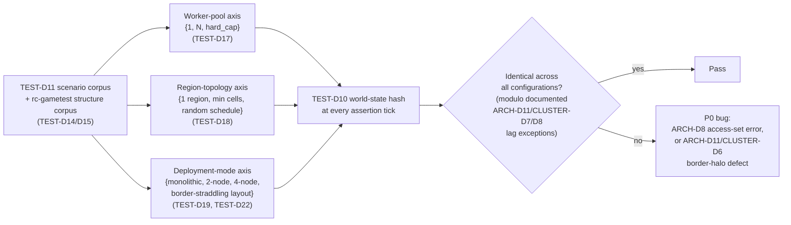
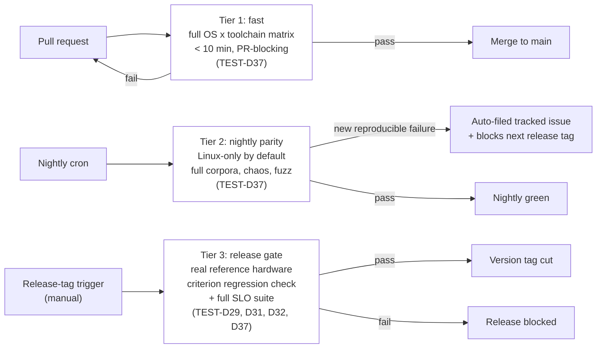
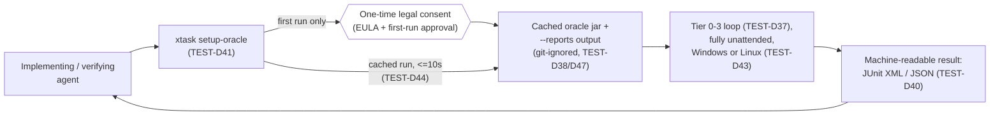
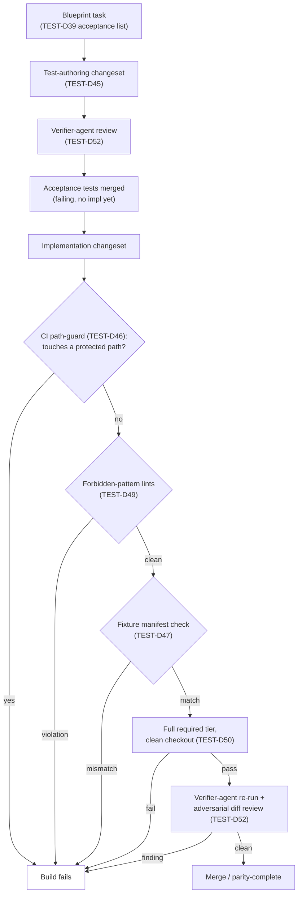

# Testing & Quality

## Purpose

Defines how every parity, correctness, and performance claim made elsewhere in this project's planning documents is *verified* — for a wire-compatible reimplementation, the test suite is not a supporting artifact, it is the specification made executable. Owns: the layered parity-verification methodology (golden data, differential testing against real vanilla, worldgen chunk-hash comparison, in-world structure-based GameTest-style testing); determinism testing across worker-pool sizes, region topologies, and monolithic-vs-cluster deployment; cluster-specific correctness testing (handoff, border contraptions, chaos, proxy routing); fuzz/property testing; the benchmark/profiling/load-testing performance program and its concrete SLOs; the CI pipeline (matrix, gates, tiers); and the acceptance-test obligation every future implementation blueprint inherits from this document.

## Scope

**In scope:** test-harness architecture and the concrete crates/tools that implement it; the vanilla-differential testing methodology (bot driver, packet/world-state comparison); the worldgen seed-corpus methodology; the `rc-gametest` in-world structure-test framework and its redstone regression corpus; determinism test design across all three axes (worker-pool size, region topology, deployment mode); cluster-specific test suites (handoff, border-straddling contraptions, chaos/fault injection, proxy routing); fuzz and property-based testing targets and toolchain; the benchmark/profiling/load-test program and numeric tick-time SLOs (monolithic and a reference cluster topology); the GitHub Actions CI matrix, quality gates, toolchain/MSRV policy, and test-tier structure; the acceptance-test mandate binding every future implementation blueprint.

**Out of scope:** the domain logic being tested — game mechanics (`05-game-mechanics.md`), chunk/Anvil storage format (`03-world-chunks-persistence.md`), worldgen algorithms (`04-worldgen-parity.md`), protocol wire format details (`02-protocol-networking.md`), ECS/threading internals (`01-server-architecture.md`), cluster protocol internals (`13-cluster-architecture.md`) — this document only imposes verification *requirements* on those domains and defines the mechanism that checks them, never their behavior. The binding legal determination of what may be downloaded/cached/committed in CI regarding Mojang's `server.jar` (owned by `08-assets-auth-legal.md`; this document's TEST-D38 proposed a boundary, now confirmed by `08`'s ASSET-D29, mirroring `02`'s NET-D10). Isomorphic-mod-API test tooling (deferred to the modding-API planning doc, which should build on this document's `rc-gametest`/fuzz/CI foundations rather than reinventing them).

## Decisions

| ID | Decision | Rationale |
|---|---|---|
| TEST-D1 | Testing lives in dedicated workspace crates under `crates/testing/`: `rc-test-harness` (shared process orchestration, world-state hashing/diffing, the synchronous test-mode tick driver), `rc-golden-data` (fixture export + fixture tests), `rc-paritybot` (azalea-based differential-scenario runner, reused for load testing), `rc-gametest` (structure-based in-world test framework, proc-macro + runner), `rc-chaos` (cluster fault-injection harness). Ordinary unit/integration tests live in each domain crate's own `tests/` per standard Cargo convention. `xtask` gains subcommands (`golden-export`, `parity-run`, `worldgen-hash`, `gametest run`, `fuzz run`, `loadtest`, `bench`) wiring all of the above into one developer/CI entry point, alongside `02`'s existing `fetch-data`/`codegen` subcommands (NET-D9). | Cross-cutting harness code (process orchestration, hashing, the gametest runner) is a distinct concern from any one domain's unit tests and would otherwise end up duplicated or awkwardly homed inside whichever domain crate happened to need it first; one `xtask` entry point matches the precedent `02` already set for developer tooling. |
| TEST-D2 | Test runner: `cargo-nextest` 0.9.137 (crates.io, verified current) replaces `cargo test` for all unit/integration test execution, locally and in CI. Doctests still run via plain `cargo test --doc` (nextest does not execute doctests). Nextest's per-test process isolation, configurable per-test timeout, and JUnit XML output are used for CI reporting; nextest's retry feature is enabled *only* for the nightly parity tier (TEST-D37) against externally-flaky conditions (a cold-started vanilla `server.jar` occasionally needing a few extra seconds to bind its port), never for fast-tier or determinism tests, where a retry would mask a real bug (TEST-D37's flaky-test policy). | Nextest's process-per-test isolation is specifically valuable here because `rc-test-harness` spins up real OS subprocesses (vanilla `server.jar`, Rusty Clanker instances) per differential/cluster test — a hung or leaked subprocess in one test must never corrupt or block a sibling test's run, which `cargo test`'s in-process model does not guarantee as cleanly. |
| TEST-D3 | Snapshot/golden-value assertions use `insta` 1.48.0 (crates.io, verified current) wherever a test's expected output is a large structured value better reviewed as a diff than asserted field-by-field: golden registry dumps (TEST-D5), generated packet-layout summaries, and `rc-gametest` failure diagnostics. Reviewed snapshots are committed under each crate's `tests/snapshots/`; `cargo insta review` is the required local workflow for accepting an intentional change — no snapshot is ever accepted by blind `insta accept` in CI. | Insta's curated-diff review workflow is the right tool specifically for the golden-data class of test (TEST-D5/D6), where the *interesting* signal is "what changed," not a single boolean pass/fail. |
| TEST-D4 | Golden fixture data is exported by a new `xtask golden-export` step layered on `02`'s existing version-data pipeline (NET-D9): after `--reports` produces raw JSON and `xtask codegen` produces generated Rust, `golden-export` normalizes (stable key ordering, no incidental whitespace/formatting drift) and writes deterministic JSON/RON fixtures per protocol version under `crates/testing/rc-golden-data/fixtures/<protocol-version>/` — one file per registry category (blocks, items, entities, biomes, sounds, particles), plus recipes, loot tables, and the block-state property tables. Only IDs and structural facts are exported, following the exact commit boundary NET-D10 already draws — never raw `--reports` JSON, never assets. | Reusing NET-D9's pipeline output rather than re-deriving fixture data independently means there is exactly one place version-data drift can enter the project, and the NET-D10 commit-boundary question is answered once, not twice. |
| TEST-D5 | Fixture tests (`rc-golden-data`'s test suite): one table-driven test per registry category asserting that Rusty Clanker's own runtime-loaded registry (populated by NET-D9's generated code) is field-for-field identical to TEST-D4's golden fixture for the pinned protocol version (NET-D1). Any drift is a hard failure, not a warning. This is the cheapest, fastest parity signal in the whole suite: no server process, no network, sub-second wall time, runs in the fast CI tier (TEST-D37) on every PR. | Registry-identity is a precondition for every other layer's validity — a differential test comparing packet streams is meaningless if the two servers do not even agree on what item ID 47 means — so this is deliberately the first, cheapest gate, not folded into a slower integration suite. |
| TEST-D6 | Recipe and loot-table *logic* fixtures go one level past structural equality: a small in-process interpreter (no full ECS, no running server) evaluates each shaped/shapeless recipe and each loot table against a fixed input set (a specific crafting-grid item arrangement; a fixed loot context — tool used, fortune/looting level, luck, explosion flag) and asserts the output item stack(s) match a golden expected result. Golden expected results are derived once, by hand, by cross-referencing `--reports`' raw recipe/loot-table JSON against minecraft.wiki's documented behavior for that recipe/table, then committed as an `insta` snapshot (TEST-D3). | Structural ID equality (TEST-D5) does not catch a logic bug in *how* Rusty Clanker's own recipe/loot resolver interprets a correctly-loaded table (e.g. a fortune-multiplier off-by-one); a small interpreter test is orders of magnitude cheaper than a full differential run for catching that class of bug early. |
| TEST-D7 | **Differential harness architecture:** `rc-test-harness` launches an unmodified, legally-downloaded vanilla `server.jar` (NET-D1's pinned version, fetched the same way NET-D9 fetches it — see TEST-D38) as an OS subprocess, launches a Rusty Clanker server instance with matching seed/config as a second subprocess, drives both through an identical scripted action sequence via one or more bot connections (TEST-D8), and captures from each: (i) the raw clientbound packet stream, and (ii) periodic authoritative world-state dumps. Comparison of both capture kinds is TEST-D9/TEST-D10's job; this decision fixes only the harness shape (two real server processes, one script, two capture streams, one comparator). | Comparing against a *running* vanilla server (not a static fixture) is the only methodology that catches genuine behavioral drift, including drift Mojang itself introduces between versions — a golden-data fixture (TEST-D5/D6) only catches drift in *data*, never in *emergent packet/world-state behavior* from server-side logic. |
| TEST-D8 | **Bot driver: azalea** (`azalea` + `azalea-client` + `azalea-protocol`, tracking git `main`, `0.16.0+mc26.2` as of this writing — matching NET-D1's protocol target exactly, per `10-prior-art.md` PRIOR-D7), consumed exclusively as a **workspace dev-dependency of `rc-paritybot` and `rc-loadtest`**, never as a dependency of any shipped runtime crate. Azalea's own multi-bot "swarm" feature drives multi-actor scenarios (two players trading; one player triggering a piston while another observes its effect) from a single test process. This is enforced mechanically, not just by convention, via `cargo-deny`'s `bans` config (TEST-D35): `azalea*`/`valence_protocol` may appear in the dependency graph only under those two crates' `[dev-dependencies]`. | This does not contradict NET-D3's ban on depending on `azalea-protocol`/`valence_protocol` for the server's *own* wire codec — NET-D3 governs what the shipped server speaks the protocol *with*; TEST-D8 is a test-only consumer using azalea *as a client* to validate what NET-D3's own hand-written codec produces, an entirely different role. Azalea's own project positioning as of 2026 (bot swarms for automating server checks, catching breaking changes before players do) is exactly this use case, independently validating the choice. |
| TEST-D9 | Packet-stream comparison is **semantic, not byte-exact**: each captured clientbound packet is decoded via `rc-protocol` (NET-D3/D9's own codec — the thing under test, ensuring the comparator exercises the real decode path) into a typed value and compared field-by-field against the same packet type from vanilla's stream, against an explicit per-packet-type allowlist of expected non-parity fields (entity IDs — the two servers allocate independently; timestamps; keep-alive nonces; UUIDs generated fresh per test run). Ordering of packet *types* within one tick-equivalent window is compared with a small tolerance window (vanilla defines no public contract on intra-tick packet emission order); resulting *world state* (TEST-D10) must match exactly, with no tolerance. | Byte-exact comparison would fail on every run purely from allocation-order noise (entity IDs, UUIDs) that carries zero parity meaning; semantic comparison with an explicit, reviewed allowlist keeps the signal (did the *content* diverge) separate from expected, harmless noise. |
| TEST-D10 | World-state comparison canonicalizes each loaded chunk into a content hash over `(block-state palette-indexed array, block-entity NBT, biome array)` — **explicitly excluding lighting**, since lighting is derived state recomputed by a BFS fixed point (ARCH-D16), not authoritative input/output state — and diffs hash-by-hash across the scenario's loaded area at each of TEST-D11's assertion ticks. A hash mismatch triggers an automatic full-fidelity dump-and-diff (not just the hash) written as a CI artifact for debugging, never just a pass/fail bit. | Hashing first keeps the common case (everything matches) cheap across potentially thousands of chunks per scenario; falling back to full dumps only on mismatch keeps CI artifact volume proportional to actual failures, not every run. Excluding lighting from the authoritative hash matches ARCH-D16's own framing of it as order-independent derived state, not input. |
| TEST-D11 | Differential scenarios are versioned RON scripts under `crates/testing/rc-paritybot/scenarios/*.ron`: bot spawn parameters, a fixed input-action sequence with tick-relative timing, and a list of assertion ticks (which trigger TEST-D10 dumps). Scenarios are hand-authored one-per-mechanic-domain against `05-game-mechanics.md`'s Section A–L mechanic list (a Needs-from-`05` interface item — `05`'s Decisions table, MECH-D1 onward, is that list) and grow as mechanics land — a mechanic is not "differentially verified" until at least one scenario covers it. | A fixed, versioned, diffable script format (rather than ad hoc test code per scenario) keeps the corpus reviewable and lets `05`'s mechanic checklist map 1:1 onto scenario-file existence — a concrete, auditable coverage signal. |
| TEST-D12 | **Worldgen chunk-hash corpus:** a fixed, committed seed corpus (seed default: 64 seeds spanning the `i64` range, including `0`, `-1`, and a handful of community-known "interesting" seeds chosen for biome/structure edge density) is generated by both vanilla `server.jar` (generation-only mode via TEST-D7's harness — requesting chunks with no player present) and Rusty Clanker, over a fixed spawn-centered 33×33 chunk window (matching vanilla's own default simulation-distance framing), and compared with TEST-D10's per-chunk content hash computed **pre-any-tick** (raw generation output only — no random-tick or entity drift folded in). | A fixed, committed seed list makes worldgen parity regressions bisectable (which seed, which chunk, which commit) rather than a fuzzy "generation looks different" report; pre-tick hashing isolates the generation algorithm itself from every other system that might touch a chunk afterward. |
| TEST-D13 | A worldgen hash mismatch against TEST-D12's corpus is **triaged by `04-worldgen-parity.md`'s own determinism/approximation decisions**, not unilaterally treated as a bug by this document — `04` may document a deliberate, bounded generation approximation (this document does not require bit-exact worldgen a priori), in which case the corpus's job is narrowed to catching *undocumented* drift against whatever `04` does commit to. `04`'s GEN-D1 already answers this for the pinned target: bit-identical output is the hard acceptance criterion, with exactly one documented, bounded exception (GEN-D20's decoration-order tie-break at chunk-overlap seams) — this document's corpus enforces that exception as the sole permitted deviation. | Testing strategy cannot itself decide how faithful worldgen must be — that is a domain call `04` owns — but the detection mechanism (the corpus) must exist regardless of where `04` draws that line, so this document fixes the mechanism and now binds it to `04`'s actual, existing acceptance criterion rather than an open threshold. |
| TEST-D14 | **`rc-gametest`: a native, from-scratch Rust structure-based test framework**, architecturally inspired only by publicly documented concepts (Bedrock Edition's GameTest Framework's structure-block-plus-scripted-assertions model, and NeoForge/Forge's Java-side Game Test API's test-registration pattern — public docs only, never code, consistent with the project's allowed-source policy (ASSET-D18/D19)), built entirely against Rusty Clanker's own ECS. Each test: (1) loads a structure using the same NBT structure-file schema vanilla's own structure blocks produce (documented on minecraft.wiki), (2) pastes it into a dedicated, isolated single-purpose test region (parallel-runnable across RC-WorkerPool, ARCH-D18, since each test region is an independent ARCH-D5 partition), (3) advances that region's tick clock via a **synchronous test-mode tick driver** that calls the same 11-stage pipeline (ARCH-D12) directly, bypassing RC-Executor's real-time EDF admission (ARCH-D20) entirely, (4) asserts block/entity/redstone-signal state at specified ticks via a `TestContext` API (sketch below). Tests are grouped into batches mirroring ARCH-D8's domain groups (currently eight; redstone dominates given ARCH-D13's zero-parallelism mandate) and run via `xtask gametest run [--batch redstone] [--filter <name>]`. | GameTest-style structure tests are the only methodology in this document that directly exercises *emergent, multi-tick, stateful* behavior at the block/redstone level — differential testing (TEST-D7) catches the same class of bug only if a scenario happens to script the exact interaction, while a `rc-gametest` corpus can grow densely around known-tricky mechanics. Building it from scratch against Rusty Clanker's own ECS (not consuming any Bedrock/Forge code) keeps the clean-room boundary intact while still benefiting from a validated *design pattern*. |
| TEST-D15 | The community redstone regression corpus feeding `rc-gametest` is sourced by **re-building** well-known, publicly documented redstone designs (BUD switches, T-flip-flops, hopper clocks, piston doors, documented item-sorter/duplication edge cases — the *mechanic*, described in community wiki/tutorial text, not a downloadable file) fresh inside a legally-owned vanilla client's creative-mode world, exported via a real structure block, and committed as `rc-gametest` structure fixtures. Pre-built schematic/map files from third-party sites are never downloaded or used as a structure source. MCHPRS (`github.com/MCHPR/MCHPRS`, actively maintained, redstone-focused, multithreaded, `Redpiler`-compiler server — noted in `10-prior-art.md`'s survey scope) is consulted only as a **source of test-case ideas** (which mechanics the redstone technical community treats as load-bearing or notoriously timing-sensitive) via its public documentation — never as a code, structure-data, or asset dependency. | This is the same provenance discipline `02`'s NET-D9/D10 already applies to protocol data, extended to structure fixtures: the *idea* of "this mechanic is worth testing" is unrestricted public knowledge, but the concrete NBT bytes must always originate from the developer's own legally-owned client session, never a third party's file. |
| TEST-D16 | The `rc-gametest` corpus is the **primary regression gate** for ARCH-D13's "redstone is sequential, bit-identical, no parallelism" guarantee and for ARCH-D14/D17's documented, bounded parity exceptions (per-chunk-seeded random tick; block-entity/hopper chain ordering). Every `05-game-mechanics.md` decision that touches redstone or block-entity timing must ship with at least one passing `rc-gametest` case before that mechanic is considered implementation-complete (TEST-D39's blueprint acceptance-test mandate is where this is enforced procedurally). | Ties the one domain the project vision singles out as precision-sensitive (redstone — "the one domain vanilla players build machines against," `01`'s own ARCH-D13 rationale) to a concrete, non-optional test-existence requirement rather than leaving redstone parity to differential testing's scenario-coverage luck. |
| TEST-D17 | **Determinism class 1 — worker-pool-size invariance:** every scenario in TEST-D11's corpus additionally runs three times under forced RC-WorkerPool baseline sizes `{1, available_parallelism(), hard_cap}` (ARCH-D18), asserting TEST-D10-style world-state hashes are identical across all three runs at every assertion tick. A mismatch is treated as a **P0 correctness bug** against ARCH-D8's static conflict-graph/`Access<ComponentId>` model, not a performance issue — it is the sharpest available test of "a system's declared access set is actually correct," since a wrong access declaration only misbehaves under contention that varies with worker count. | This is the direct verification mechanism for `01`'s central safety claim (ARCH-D8's startup conflict check plus ARCH-D9's sync-point discipline together guarantee determinism); a worker-count-triggered mismatch is precisely the failure mode that check exists to prevent, so this test class is the check's own empirical audit. |
| TEST-D18 | **Determinism class 2 — region-topology invariance:** every scenario also runs under forced region layouts `{single region covering the whole test area, minimum-size regions (one ARCH-D6 grid cell each), a randomized merge/split schedule injected via a test-only scheduler hook}`, asserting identical world-state hashes **modulo the documented ARCH-D11 one-tick border-crossing exception** — assertion ticks are chosen at least 4 ticks after any border-crossing event specifically to let that documented, bounded exception settle before comparison. | Verifies ARCH-D6/D11's region-boundary machinery does not leak topology into observable behavior beyond the one documented, bounded exception `01` itself defines — the "modulo" clause is not a loophole, it is testing exactly the guarantee `01` actually makes, not a stronger one it never claimed. |
| TEST-D19 | **Determinism class 3 — deployment-mode invariance (the cluster-correctness backbone):** every scenario also runs once under monolithic mode (`InProcessTransport`, ARCH-D27) and once each under 2-node and 4-node cluster topologies (`NetworkTransport`, CLUSTER-D11), including at least one forced `RegionId -> NodeId` layout that deliberately places a scenario's test structure straddling a node boundary, asserting identical world-state hashes modulo ARCH-D11/CLUSTER-D7/D8's documented cross-boundary lag exceptions. This is the direct, empirical test of the project vision's central cluster claim — that CLUSTER mode is observationally equivalent to MONOLITHIC mode for players. | Every other cluster decision (CLUSTER-D1–D28) is *architecture* asserting equivalence; this is the one test class that actually *measures* it, end to end, rather than trusting the architecture's internal consistency arguments alone. |
| TEST-D20 | All three determinism classes (TEST-D17–D19) run against the **full** TEST-D11 scenario corpus in the nightly tier (TEST-D37) — breadth matters more here than for ordinary unit tests, since determinism regressions are exactly the class of bug that manifests only under specific interleavings or topologies a narrow smoke test would miss. A single-scenario smoke instance of each class also runs in the fast CI tier for quick feedback on gross breakage (e.g. a newly-added system with an obviously wrong `Access` declaration). | Balances CI wall-clock cost (full-corpus × 3 determinism axes × N topologies is expensive) against detection power by putting the expensive, high-power run on the nightly cadence and keeping only a cheap canary on the PR-blocking path. |
| TEST-D21 | **Handoff correctness suite:** an azalea bot (TEST-D8) crosses a region border under three synthetic load conditions `{idle, moderate, saturated}` (load injected via a test-only tick-time inflator on source/destination nodes) and asserts: (i) the client's TCP/QUIC-fronted connection is never closed; (ii) client-observable rubber-banding stays within CLUSTER-D22's 2-tick budget (measured from the bot's own received-packet timestamps); (iii) post-crossing entity/inventory/effect state matches a pre-crossing snapshot exactly; (iv) the CLUSTER-D22 `HandoffBegin`/`HandoffReady`/`HandoffComplete` sequence completes in the documented order, verified via CLUSTER-D28's tracing spans (not by inspecting wire bytes directly). | Directly verifies CLUSTER-D22's "zero disconnect, zero loading screen, ≤2-tick budget" claim under the specific condition (load) most likely to break a timing budget, not just the idle happy path. |
| TEST-D22 | **Border-contraption parity suite:** extends `rc-gametest` (TEST-D14) with a cluster-mode variant that positions a test structure straddling a forced `RegionId -> NodeId` partition boundary (via a test-only rebalancer override bypassing CLUSTER-D2's normal load-driven policy) and runs the structure's identical assertions as its single-node counterpart; results must match modulo CLUSTER-D7/D8's documented lag-until-co-location-migration exception. This is `rc-gametest`'s answer to "GameTest structures deliberately straddling partition borders." | A redstone contraption is the sharpest possible probe of CLUSTER-D6's claim that the ARCH-D11 border-halo mechanism works unmodified across a node boundary — reusing `rc-gametest`'s existing structure corpus (rather than a separate cluster-only structure set) means every redstone regression case doubles as a cross-node parity case for free. |
| TEST-D23 | **Chaos testing, two tiers:** (1) a fast, fully deterministic tier using `turmoil` 0.7.2 (crates.io, verified current; `tokio-rs`-maintained deterministic network/host simulator that shims `tokio::net` behind a `#[cfg]` swap) drives simulated multi-node scenarios — latency injection, packet drop, symmetric/asymmetric network partition, simulated host crash — inside `rc-chaos`, single-threaded and seed-reproducible, running every PR in the fast tier against a reduced node count (2–3 simulated nodes). (2) A heavier, real-process tier (nightly only, Linux runner) launches an actual multi-node test cluster and injects real `SIGKILL` node death and real `tc`/`netem`-based network partition between specific node pairs, verifying CLUSTER-D15/D16/D19's raft-driven failure-detection, takeover, and epoch-fencing behavior end to end (not just as simulated by `turmoil`'s model of the network). | Turmoil's determinism and seed-reproducibility make it ideal for catching race conditions cheaply and reproducibly on every PR; a real-process tier is still required because raft leader election timing, actual OS scheduling jitter, and real QUIC/TLS handshake behavior under packet loss are exactly the class of thing a simulated network model can under-represent — the two tiers are complementary, not redundant. |
| TEST-D24 | **Proxy routing tests:** a test harness spins up a proxy instance (CLUSTER-D21) against a controlled, test-injected `RegionId -> NodeId` table (bypassing real raft consensus for speed/determinism where the test's purpose is routing logic, not consensus itself — CLUSTER-D13's consensus correctness is exercised separately by TEST-D23's chaos suite) and asserts: a connecting player's packets are forwarded to the node currently owning their region; a table update (simulated rebalance) results in the proxy's forwarding table flipping atomically with no packet loss; multiple proxy instances sharing the same raft-committed directory route a given player identically regardless of which proxy they connect through (CLUSTER-D21's "no Redis, share the raft directory" claim). | Proxy routing correctness is logically separable from raft consensus correctness and from handoff timing (TEST-D21) — isolating it behind a controlled/injectable directory keeps this test class fast and lets it pinpoint routing-table-application bugs specifically, rather than conflating them with consensus or handoff-protocol bugs. |
| TEST-D25 | **Fuzzing toolchain:** `cargo-fuzz` 0.13.2 + `libfuzzer-sys` 0.4.13 (both crates.io, verified current) as the harness generator/runtime, with `arbitrary` 1.4.2 (crates.io, verified current) deriving `Arbitrary` on every fuzzed input type so `fuzz_target!` closures take structured values directly rather than raw byte slices — the modern idiomatic `cargo-fuzz` pattern, letting the fuzzer explore the input *type's* structure (valid VarInt ranges, plausible NBT tag nesting) rather than only raw bytes. | Deriving `Arbitrary` on the same types `rc-protocol`'s codec and `simdnbt`'s NBT layer already define means no separate "fuzz-only" input model has to be hand-maintained in parallel with the real decode types — one source of truth for shape, per fuzz target. |
| TEST-D26 | **Fuzz target inventory (minimum, one crate each under `crates/*/fuzz/`):** (1) `rc-protocol` packet decode — every generated `Deserialize` impl (NET-D9's codegen output) for the pinned protocol version, entry point = raw frame bytes post-decompression; (2) NBT decode — `simdnbt`'s zero-copy borrowed-buffer decode entry point (NET-D5), since it parses untrusted network bytes directly; (3) Anvil chunk round-trip — `decode(encode(x)) == x` for arbitrary valid in-memory chunk values, plus "decode never panics on arbitrary bytes claiming to be a region file," against `03-world-chunks-persistence.md`'s WORLD-D12 `rc-anvil` `.mca` format (header tables, per-chunk length/compression-tag/payload framing, `.mcc` external-file overflow) and its WORLD-D13 Zlib/LZ4/GZip compression choices; (4) cluster message decode — `postcard`'s `Message<RegionMessage>` deserialization (CLUSTER-D12) over the internal QUIC link, defense-in-depth against a corrupted or compromised peer despite CLUSTER-D11's mutual-TLS assumption. Seed corpora for (1)/(2) are bootstrapped from real captured bytes recorded by TEST-D7's differential harness (real, valid protocol traffic makes a far better fuzzing seed than an empty corpus). | These four targets are exactly the boundaries where untrusted bytes (network peers, on-disk files written by a possibly-older/corrupted version, or a compromised cluster peer) cross into typed Rust state — the class of surface where a decode-time panic or memory-safety bug has the highest real-world blast radius (a crashable server process, a crashable cluster node) and where property-style round-trip/never-panics assertions are cheapest to state precisely. |
| TEST-D27 | Structured property tests (distinct from raw-byte fuzzing) use `proptest` 1.11.0 (crates.io, verified current) for properties expressible directly over the domain types rather than raw bytes: VarInt/NBT/packet round-trip (`decode(encode(x)) == x` for generated valid `x`), `ComponentDescriptor`-based dynamic component registration (ARCH-D4) never producing unsound layouts for generated size/alignment/drop-fn combinations, and `Message<RegionMessage>` postcard round-trip (CLUSTER-D12) for every `RegionMessage` variant. Proptest tests run in the fast CI tier (bounded case count per run); `cargo-fuzz` targets (TEST-D26) run only in the nightly/release tiers (open-ended, time-boxed). | Proptest and `cargo-fuzz` are complementary, not redundant: proptest is cheap enough to gate every PR and is best at "does this documented invariant hold for structured, mostly-valid inputs," while `cargo-fuzz`'s coverage-guided byte-level search is what actually finds the pathological/malicious-input crashes proptest's generators are unlikely to stumble into. |
| TEST-D28 | Every crash or panic found by fuzzing (TEST-D26) is minimized (`cargo fuzz tmin`) and the minimized input is committed as a permanent regression unit test under the owning crate's `tests/fuzz_regressions/` — standard `cargo-fuzz` practice. A regression test is never removed once committed, even after the underlying bug is fixed, except as part of a deliberate corpus-pruning pass reviewed like any other change. | Turns every fuzzer-found bug into a permanent, fast-tier-running guardrail instead of a one-time fix that could silently regress; this is the same "every found bug becomes a fixture" discipline TEST-D6's golden data and TEST-D15's redstone corpus both apply, extended to fuzzing. |
| TEST-D29 | **Benchmark suite:** `criterion` 0.8.2 (crates.io, verified current) with a `benches/` directory per domain crate covering identified hot paths: packet encode/decode throughput (NET-D5/D9), NBT decode throughput (NET-D5), chunk palette read/write (`03`'s WORLD-D2 paletted-container format), ECS query iteration cost over representative entity counts, RC-Executor's startup conflict-graph computation (ARCH-D8), and `RegionMessageBus` send/flush overhead (ARCH-D30). Criterion's statistical regression detection is the release-gate mechanism (TEST-D37 Tier 3): any tracked benchmark regressing ≥5% against the previous tagged release's committed baseline fails the release gate and requires an explicit, reviewed justification to override. | Criterion is the de facto standard Rust micro-benchmarking tool with built-in statistical significance testing, which is exactly what a regression *gate* (as opposed to an informational number) needs to avoid false-positive failures from ordinary run-to-run noise. |
| TEST-D30 | **Continuous profiling:** `tracing` spans already authored for CLUSTER-D28's observability requirements (tick stages per ARCH-D12, message send/receive, handoff steps) are made visualizable "for free" via `tracing-tracy` 0.11.4 (crates.io; last published December 2024 but still the current released version) bridging to `tracy-client` 0.18.4 (crates.io, verified current) implementing the Tracy frame-profiler protocol. Enabled only behind a `tracy` Cargo feature, **never in the default release build** (matches CLUSTER-D28's "no bundled observability backend" stance — Tracy is a developer-run desktop tool, not a shipped dependency). Developers connect the separately-installed Tracy desktop application (from `github.com/wolfpld/tracy`) to a `tracy`-featured build for live nanosecond-resolution flame-graph profiling. | Reusing spans already required for OTLP tracing (CLUSTER-D28) rather than hand-instrumenting a second, profiler-specific set of markers means Tracy visualization costs nothing beyond the observability instrumentation the project needs anyway; feature-gating keeps the zero-overhead default-build promise (ARCH-D2's "no unused crate enters the graph" discipline extended to profiling). |
| TEST-D31 | **Bot-swarm load testing:** `rc-loadtest`, built on `rc-paritybot`'s azalea integration (TEST-D8), spawns hundreds to thousands of simultaneous bot connections executing scripted idle/movement/interaction behavior against a target deployment (monolithic or a full cluster reference topology, TEST-D32), collecting CLUSTER-D28's own metric feed (per-region tick-duration histograms, message latency, handoff counters) plus connection-level metrics (packet round-trip latency, backpressure-triggered disconnect count — required to be zero under every SLO in TEST-D32). Runs only in the Tier 3 release gate (TEST-D37), never in ordinary CI, against real reference hardware. | Azalea's own bot-swarm feature (already adopted for TEST-D8) directly supports scaling to hundreds/thousands of concurrent connections from one process, avoiding a second, purpose-built load-generation tool; reusing CLUSTER-D28's existing metrics feed means load testing produces no new observability surface to maintain. |
| TEST-D32 | **Tick-time SLOs — concrete numeric targets, seed defaults pending real-hardware calibration** (same "seed default, needs a load-testing harness to calibrate" status `01`'s ARCH-D6/D19 thresholds already carry): see the SLO table below. Reference hardware: Monolithic reference = 16-core/32-thread x86_64 (e.g. AMD Ryzen 9 9950X-class or equivalent cloud instance), 64 GB RAM, NVMe SSD, Ubuntu 24.04 — chosen to match ARCH-D18's baseline-pool-size-from-`available_parallelism()` policy at a realistic dedicated-hobbyist/small-studio scale. Cluster-node reference = 8-core/16-thread, 32 GB RAM, NVMe SSD, same OS, reflecting that cluster mode's value proposition is horizontal scale-out across modest nodes rather than requiring cluster nodes as large as the monolithic reference. | Setting concrete numbers now — even as explicitly-flagged seed defaults — gives the performance program something falsifiable to run against from the start of implementation, rather than deferring "what does good even mean" to an undefined later date; every other numeric threshold in `01`/`13` already follows this exact pattern. |
| TEST-D33 | Code coverage is tracked via `cargo-llvm-cov` 0.9.0 (crates.io, verified current), reported as a CI artifact/summary comment on every PR (fast tier), but is **informational, never a hard percentage gate** — a coverage-threshold gate is a known anti-pattern that rewards shallow tests padding the number over targeted, high-value tests (exactly the kind TEST-D5/D14/D26 already mandate by content, not by percentage). A sustained coverage *drop* of more than 2 points on a previously well-covered crate without accompanying justification in the PR description is flagged for reviewer attention, not auto-blocked. | Keeps the useful signal (a coverage report as a discovery tool, "this branch has literally never been exercised") without the perverse incentive a hard gate creates. |
| TEST-D34 | **CI matrix:** GitHub Actions, OS legs `{ubuntu-24.04, windows-2025}` (both current GitHub-hosted labels as of this writing; `windows-2025` has carried the Visual Studio 2026 toolchain image since GitHub's June 2026 migration) — no macOS leg, matching the project's Windows/Linux-only target platforms. Toolchain leg = the pinned stable version from `rust-toolchain.toml` (TEST-D36). Fast-tier jobs (TEST-D37) run the full OS × toolchain matrix; nightly/release-tier jobs run Linux-only by default for cost/practicality (vanilla `server.jar` plus two Rusty Clanker processes plus a bot swarm per scenario is expensive to run twice per platform every night), with an explicit opt-in Windows nightly leg reserved for platform-specific investigation, not routine execution. | Full-matrix coverage on the fast/PR-blocking tier catches platform-specific regressions (path handling, socket behavior, thread/affinity differences) at the point they're introduced; concentrating the expensive nightly tier on one OS keeps its wall-clock/cost budget sane without giving up cross-platform correctness coverage where it matters most (every PR). |
| TEST-D35 | **Static gates, required status checks on every PR:** `cargo clippy --workspace --all-targets --all-features -- -D warnings`; `cargo fmt --check`; `cargo-deny` 0.20.2 (crates.io/GitHub, verified current) covering all four of its check categories — `advisories` (RUSTSEC via the `advisory-db`), `licenses` (allow-list: MIT, Apache-2.0, BSD-2/3-Clause, Zlib, ISC, Unicode-3.0; `MPL-2.0` requires explicit per-crate review before allow-listing; any GPL/AGPL/LGPL family license is a hard deny, extending PRIOR-D1/D9's copyleft-avoidance stance from "don't copy their code" to "don't depend on copyleft code" project-wide), `bans` (duplicate-version warnings, plus the explicit machine-enforced dependency-boundary rule from TEST-D8: `azalea*`/`valence_protocol` permitted only as `[dev-dependencies]` of `rc-paritybot`/`rc-loadtest`), and `sources` (crates.io only; no unpinned git dependencies without an explicit, reviewed exception entry). | `cargo-deny`'s `bans` mechanism turns TEST-D8's dependency-boundary *policy* into something CI actually enforces on every PR rather than something that can silently erode as new code is added — the same "structural isolation, not discipline" philosophy `01`'s ARCH-D22 already applies to the sync/async boundary, applied here to the dependency graph. |
| TEST-D36 | **Toolchain/MSRV policy:** the exact compiler version is pinned via a repo-root `rust-toolchain.toml` to current Rust stable — `1.97.1` as of this writing (GitHub API-verified release date 2026-07-16; matches `01`'s ARCH-D1 `bevy_ecs` MSRV floor of 1.95.0 with headroom) — mirroring NET-D7's "track current stable, not a frozen LTS/MSRV line" stance, appropriate for a pre-1.0 project with no external MSRV promise to third parties. The pin is bumped roughly every stable release (~6-week cadence) as a routine, low-risk PR gated only by full CI passing — never bumped mid-release-cycle for a specific feature need without also re-running the full nightly-tier suite once against the new toolchain before merging. | A single explicit pin (not a range) makes every CI run and every developer's local build reproducible byte-for-byte in terms of compiler behavior, and routine bumping keeps the project from silently drifting years behind stable Rust the way `10-prior-art.md` documents several surveyed projects' *protocol* versions drifting (Cuberite, PRIOR-D4) — the same anti-stagnation discipline, applied to the toolchain instead of the protocol. |
| TEST-D37 | **Test tiers:**<br>**Tier 0 (local, optional, unenforced):** `xtask check` — clippy + fmt + fast unit tests only, target <30s, a developer convenience, never a CI gate itself.<br>**Tier 1 (fast, PR-blocking, full OS×toolchain matrix, target <10 min wall clock):** `cargo-nextest` unit/integration tests workspace-wide; TEST-D5/D6 golden-data fixtures; a curated `rc-gametest` smoke subset (TEST-D14); a single-scenario smoke instance of each determinism class (TEST-D17–19); TEST-D27's proptest suite; TEST-D28's committed fuzz-crash regressions (replay only, no open-ended fuzzing); TEST-D23's `turmoil`-based deterministic chaos tier; `rc-mod-api`'s documentation verification (MOD-D51 in `06-modding-api.md`) — `cargo doc --no-deps` under `rc-mod-api`'s `#![deny(missing_docs)]` plus `RUSTDOCFLAGS="-D warnings"`, `cargo test --doc -p rc-mod-api`, `examples/`'s own `cargo build --workspace`/`cargo test --workspace` membership, and `xtask doc-guide test` (wrapping `mdbook test`, MOD-D49) — none expensive enough to threaten this tier's budget; static gates (TEST-D35). Zero tolerance for flakiness: a flaky Tier-1 test is a bug (in the test or in real nondeterminism) filed immediately and quarantined behind an explicit, tracked `#[ignore]` within one business day if not fixed sooner — never silently retried into green.<br>**Tier 2 (nightly, scheduled cron, not PR-blocking, Linux-only by default per TEST-D34):** the *full* TEST-D11 differential corpus (TEST-D7); the full TEST-D12 worldgen seed corpus; the full `rc-gametest` corpus including TEST-D22's border-straddling variants; all three determinism classes at full breadth (TEST-D20); TEST-D21's handoff suite; TEST-D23's real-process chaos tier; TEST-D24's proxy-routing suite; a 10-minute-per-target time-boxed `cargo-fuzz` run per TEST-D26 target. A new, reproducible nightly failure blocks the next release tag (TEST-D37 Tier 3) but does not block same-day unrelated PRs — it opens a tracked issue automatically. A once-only failure that does not reproduce on immediate re-run is logged as infra flakiness (permitted exactly one automatic nextest retry at this tier only, per TEST-D2), never silently ignored.<br>**Tier 3 (release gate, manually triggered before cutting a version tag, real reference hardware — never GitHub-hosted shared runners, which are not representative for performance decisions):** everything in Tier 2, plus TEST-D29's criterion regression check against the previous release's committed baseline, plus the full TEST-D32 SLO suite via TEST-D31's load-test harness. | A single flat test suite cannot serve both "fast enough to run on every PR" and "thorough enough to catch determinism/cluster/worldgen regressions," which are fundamentally in tension on cost; four tiers with clearly different blocking behavior and cadence is the standard resolution, applied here with tier boundaries chosen specifically around this project's most expensive test classes (real vanilla-jar processes, multi-node clusters, real hardware performance runs). |
| TEST-D38 | **Vanilla `server.jar` in CI (confirmed as a sound extension of NET-D10's policy by `08-assets-auth-legal.md`'s ASSET-D29, resolved jointly with NET-D10 in the same pass):** the jar is downloaded fresh by whichever CI job needs it (Tier 2/3), using the exact same NET-D9 mechanism (Mojang's public `piston-meta` manifest), cached only in the CI provider's own ephemeral per-workflow job cache (never a persistent, cross-workflow artifact store, never a container image layer the project publishes), and is never committed to the repository at any point — identical in spirit to NET-D10's "developer-local, legally obtained, never distributed" rule, with "the CI job" standing in for "the developer" as the entity holding a legal basis to download and run it for testing purposes. | Extends NET-D10's already-established asset-handling discipline to the one new context CI introduces (an automated job standing in for a human developer) rather than inventing a separate policy, keeping exactly one Mojang-derived-data policy surface for `08` to sign off on instead of two. |
| TEST-D39 | **Blueprint-phase quality gate:** every future implementation blueprint derived from this project's planning documents must define, for each decision/feature it blueprints, a concrete acceptance-test list referencing this document's layers by decision ID (e.g. "this blueprint's piston-timing feature requires: one new `rc-gametest` case under TEST-D14/D16; one new differential scenario under TEST-D11; inclusion in the TEST-D17–19 determinism corpora"). A feature is **mergeable to `main`** only once its blueprint's Tier-1-reachable acceptance tests (TEST-D37) pass; a feature is **parity-complete** (not merely functionally present) only once its full acceptance-test list — including any nightly-tier determinism/differential/gametest requirements — passes. Redstone/block-entity features specifically require passing under all three determinism classes (TEST-D17–19) before being considered parity-complete, per TEST-D16. | This is the mechanism that keeps "testing is the product definition" true in practice rather than only in this document's framing — without a binding per-blueprint acceptance-test obligation, later implementation work could silently under-test a feature relative to the layered methodology this document defines, defeating the purpose of having defined it centrally. |
| TEST-D40 | **Uniform machine-readable tier output.** Every xtask verb that participates in a CI tier (TEST-D37) — `test` (nextest, WS-D9), `parity-check`/`parity-run`, `golden-export`, `worldgen-hash`, `gametest run`, `fuzz run`, `loadtest`, `bench` (TEST-D1/WS-D9) — emits, alongside any human-oriented terminal output, a machine-parseable pass/fail result: nextest's own JUnit XML (TEST-D2) for the nextest-driven tier, and a JSON summary (`{"tier": ..., "status": "pass"\|"fail", "cases": [...]}`) written to a fixed, documented path for every other verb, with the process exit code always the authoritative pass/fail signal. No tier's completion status may ever require reading prose terminal output to determine pass/fail. | An agent driving the whole verification loop end-to-end needs a stable, parseable contract for every tier's result, not only the nextest-driven ones TEST-D2 already covers — extending the same machine-readable-output discipline to the non-nextest verbs closes the one gap that would otherwise force a human into the loop just to interpret console text. |
| TEST-D41 | **`xtask setup-oracle`: one-command oracle bootstrap.** A new xtask verb, added to the same subcommand surface TEST-D1/WS-D9 already establish, that (1) downloads the pinned vanilla `server.jar` via NET-D9's Mojang `piston-meta` mechanism — the same SHA-pinned download TEST-D38 already specifies for CI — (2) runs its `--reports` data generator, and (3) lays out the differential-test environment (working directories, default scenario/seed config) TEST-D7/TEST-D11/TEST-D12's harnesses expect. The jar and every generated output are cached outside the repository, git-ignored, never committed, the same custody discipline TEST-D38/WS-D10 already apply. The **only** one-time interactive step across the whole verification loop is a single legal-consent prompt (EULA acceptance plus first-run download approval, satisfying `08-assets-auth-legal.md`'s legal-consent requirement) — every subsequent invocation, and every other tier, runs fully unattended. | A zero-human test loop is only as good as its most human-dependent step; naming that one unavoidable step explicitly (legal consent, which no automated agent may accept on a human's behalf) and mechanically confining every other step to be non-interactive is what actually makes the rest of the loop's "fully autonomous" claim true rather than aspirational. |
| TEST-D42 | **Code/data-authored gametest structures.** In addition to TEST-D15's hand-captured-NBT corpus, `rc-gametest` (TEST-D14) accepts structures authored directly as versioned RON block-placement lists (position + block-state + optional block-entity NBT per entry), compiled at test-build time into the same in-region paste primitive TEST-D14's NBT path already targets — an equally valid structure source, not a replacement for TEST-D15's existing corpus. A new redstone/mechanic test case may therefore be authored entirely as code/data by an agent, with no human required to open a vanilla client, place blocks, and export a structure block; that workflow remains available (TEST-D15) but is no longer the only path. | TEST-D15's manual-capture workflow is still the right way to seed the corpus from real, community-known designs, but requiring a human at a vanilla client for *every* new test case is exactly the kind of human-in-the-loop bottleneck the project cannot tolerate at its actual authoring velocity — a code-native structure format removes that requirement for any case an agent can already describe precisely enough to write as data. |
| TEST-D43 | **End-to-end agent operability, Windows and Linux alike.** The full verification loop — TEST-D41's oracle bootstrap, TEST-D7's differential harness (via TEST-D8's bot driver), TEST-D12's worldgen chunk-hash corpus, and `rc-gametest` (TEST-D14/D42) — is startable and its outcome fully evaluable by an agent from a single `xtask` invocation per tier on **either** `windows-2025` or `ubuntu-24.04` (TEST-D34's own matrix legs), producing identical pass/fail semantics and machine-readable output (TEST-D40) to what CI produces on the same leg. No differential/gametest/worldgen tier step may depend on a Linux-only tool absent from the Windows leg, or vice versa, without an explicit documented exception. | The project's binding "the user must never be required to run tests manually" constraint has no OS carve-out — a verification path only an agent on Linux could drive end-to-end would silently reintroduce a human bottleneck for every Windows-only contributor/agent session, which TEST-D34's existing full-matrix Tier-1 policy already implicitly rejects for the fast tier; this decision extends that same expectation to the oracle-dependent tiers. |
| TEST-D44 | **Oracle-bootstrap timing budget, layered onto TEST-D37's existing tiers.** `xtask setup-oracle` (TEST-D41) is a one-time-per-cache-invalidation setup cost, not a per-run cost of any tier: first run (jar download plus `--reports` generation) completes in ≤ 5 minutes on a broadband connection; every subsequent run against an already-cached jar/report set completes in ≤ 10 seconds (cache-hash verification only, TEST-D47). Because it is amortized, it does not count against Tier 1's < 10 min wall-clock budget (TEST-D37) and never blocks Tier 0's < 30 s local convenience run; Tier 2/3's already-established budgets (TEST-D37) are unaffected, since they already assume a freshly-fetched jar per TEST-D38. | Concrete numbers matter here for the same reason TEST-D32's SLOs do — an unbounded "downloads a jar" step would silently blow through Tier 1's budget the first time any agent runs it locally, and stating explicitly that it is a cached, amortized cost rather than a recurring one prevents that from ever being mistaken for a tier-budget regression. |
| TEST-D45 | **Test-first at task granularity.** For every blueprint task (TEST-D39's per-feature acceptance-test list), the acceptance tests it specifies are authored and committed in their own dedicated **test-authoring changeset** before the corresponding implementation task starts — never written alongside, or after, the implementation that makes them pass. A test-authoring changeset is reviewed by the independent verifier-agent role (TEST-D52), never by the same agent that will subsequently implement against it. | Writing the test after the implementation lets an implementer's understanding of "correct" silently collapse onto "whatever my code currently does" — authoring and committing the acceptance test first, from the blueprint's specification alone, is what keeps the test an independent check rather than a mirror of the implementation it is meant to verify. |
| TEST-D46 | **CI path-guard: implementation changesets cannot touch protected paths.** Every changeset is labeled, by the blueprint/task-tracking convention the blueprint phase defines, as either test-authoring or implementation; a required CI job computes the changeset's full changed-file list and mechanically fails the build if an implementation-labeled changeset touches any protected path: any crate's `tests/` directory or `tests/snapshots/` (TEST-D3) — **except `examples/<NN>-<slug>/`'s own `tests/` trees**, which `06-modding-api.md`'s MOD-D51 classifies as ordinary, implementation-changeset-editable content, since an example crate's tests exist to prove its own teaching code correct, not to gate the engine's own behavior, so an `rc-mod-api` signature change and the matching fix to the example crate that calls it belong in one changeset, not two — `rc-golden-data`'s fixture tree (TEST-D4) or its manifest (TEST-D47), `rc-paritybot`'s scenario RON files (TEST-D11), `rc-gametest`'s structure corpus (TEST-D14/D15/D42), the fuzz-regression corpus (TEST-D28), the verification-verb source itself (the `xtask` code and `rc-test-harness`/`rc-golden-data`/`rc-paritybot`/`rc-gametest`/`rc-chaos` comparison/assertion logic, TEST-D1), or this document's Performance SLO table (TEST-D32) and TEST-D29's committed criterion baselines. Only a test-authoring changeset (TEST-D45) or a dedicated, separately-reviewed governance changeset (TEST-D49) may touch these paths. | This is the mechanical enforcement that makes TEST-D45's role separation real rather than a code-review convention an implementer could quietly ignore under deadline pressure — exactly the same "structural isolation, not discipline" philosophy `01`'s ARCH-D22 and `12`'s WS-D3 already apply to the sync/async boundary and the dependency graph, applied here to the test/implementation boundary. The `examples/` carve-out is named explicitly, not left implicit, because the clause's own general wording ("any crate's `tests/` directory") would otherwise sweep in `examples/<NN>-<slug>/` too — those are ordinary Cargo workspace members (`12-workspace-structure.md`'s WS-D8) — and silently make `06`'s own rot-proofing design (a rename and its example-call-site fix landing in one changeset) impossible to execute as a single implementation changeset. |
| TEST-D47 | **Fixture integrity manifest.** Every golden fixture (TEST-D4), `rc-gametest` structure (TEST-D14/D15/D42), and worldgen seed-corpus entry (TEST-D12) is recorded in a committed manifest — one row per fixture: relative path, SHA-256 of the fixture's own bytes, the generator/tool version that produced it, and the source vanilla-jar hash it was derived from (TEST-D38). A required CI job recomputes every listed fixture's SHA-256 and fails the build on any mismatch — a fixture edited by hand, outside its owning generator pipeline (TEST-D4's `xtask golden-export`, TEST-D15's client-capture-then-structure-block-export workflow, TEST-D42's RON-compile step, or TEST-D12's corpus-generation run), is indistinguishable from corruption to this check and fails identically. | A path-guard alone (TEST-D46) stops an *implementation* changeset from touching a fixture, but says nothing about a fixture being quietly hand-edited within a nominally correct test-authoring changeset — the manifest's job is to make *any* out-of-pipeline edit to a fixture's bytes detectable regardless of which changeset it arrived in, closing the loop TEST-D46 alone leaves open. |
| TEST-D48 | **Oracle integrity: always the live jar, never a stand-in.** TEST-D38's hash-pinned vanilla `server.jar` is the sole source of differential-testing ground truth: every differential run (TEST-D7), worldgen hash comparison (TEST-D12), and border-contraption parity check (TEST-D22) executes against the live, running oracle process for that run — never against a previously-recorded "expected" packet stream or world-state dump substituted for a fresh oracle run. Any trace captured from a live oracle run and reused afterward (e.g. as a fuzz seed corpus, TEST-D26) is itself a fixture under TEST-D47's manifest, hashed and pipeline-provenanced like any other. | A committed "expected vanilla output" fixture standing in for the real oracle would be exactly the kind of golden value a compromised or careless implementation changeset could quietly edit to make its own drift disappear — requiring the *live process* every time removes that entire class of tampering, since there is no static expected-value artifact to edit in the first place. |
| TEST-D49 | **Forbidden-pattern CI lints.** A required CI job scans every changeset's diff and fails the build on: an added `#[ignore]` lacking a linked open-issue reference (extends TEST-D37's Tier-1 quarantine rule from a process expectation into a mechanical check); a trivially-true assertion (`assert!(true)` and syntactic equivalents); a test function with an empty or no-op body; `cfg`/feature-gating that removes a test from a tier TEST-D37 requires it to run in, without an accompanying, reviewed tier-membership change; and, within any implementation-labeled changeset (TEST-D46), either a deleted test or a net reduction in a module's assertion count, or any edit to a perf budget or SLO number (TEST-D29's criterion baselines, TEST-D32's SLO table) outside a dedicated governance changeset reviewed specifically for that purpose. | Enumerates, as mechanically checkable patterns rather than review guidance, the concrete ways an implementation agent under pressure to show green CI could make a test suite lie about coverage instead of fixing the code it covers — every item on this list is a known, real-world test-gaming pattern, not a hypothetical one. |
| TEST-D50 | **CI is the sole authority on completion.** A blueprint task or feature (TEST-D39) is done, and a feature is parity-complete, only when its full required tier is green in a CI run against a clean checkout — never on the strength of an agent's local run, however faithfully reproduced. Agent-reported local test results are advisory context for a human or reviewing agent, never a substitute for, and never sufficient grounds to merge ahead of, CI's own from-clean-checkout run. This binds the blueprint/implementation phase exactly as TEST-D39 already binds it to a concrete acceptance-test list. | A local run can pass for reasons a clean-checkout CI run would catch — a stale cache, an uncommitted fixture, an environment difference — and an implementation agent has a direct incentive to trust its own green local run over a slower, less convenient CI wait; naming CI as the sole authority removes that incentive by removing the choice. |
| TEST-D51 | **Flakiness quarantine, never silent, never deleted.** Extends TEST-D37's Tier-1 flaky-test policy: the required tracked `#[ignore]` quarantine action mechanically auto-files an issue at the moment of quarantine (satisfying TEST-D49's linked-open-issue requirement for the `#[ignore]` it adds, rather than merely being expected to), and a quarantined test blocks that test's owning tier from counting toward release-tag promotion (Tier 3, TEST-D37) until it is either fixed and un-quarantined or explicitly, reviewedly retired via a governance changeset (TEST-D49) — never simply deleted or left `#[ignore]`d indefinitely. | Quarantine-without-auto-filing degrades into a silent, permanent skip in practice the same way an unenforced "file an issue" convention degrades under deadline pressure everywhere else in this cluster — automating the filing step, and gating release promotion on resolution, is what keeps a quarantined test a tracked liability instead of a forgotten one. |
| TEST-D52 | **Independent verifier-agent role.** A verifier agent — a distinct agent identity from whichever agent authored the changeset under review, never the same context/session — re-runs the changeset's full required tier from a clean checkout (never trusting the implementer's reported result, per TEST-D50) and adversarially reviews every diff touching `tests/`, fixtures, or verification code within the changeset window (TEST-D46's protected paths), specifically checking for every TEST-D49 pattern plus any test whose assertions were weakened without a corresponding, justified specification change. Only after the verifier agent's own from-clean-checkout run is green, and its adversarial review raises no unresolved finding, may the changeset merge. | This is the concrete "who checks the checker" answer role separation (TEST-D45) requires — a path-guard (TEST-D46) and forbidden-pattern lints (TEST-D49) catch mechanically expressible gaming patterns, but a genuinely weakened-but-still-passing assertion (a narrowed input range, a loosened tolerance dressed as a fix) needs a second reviewing intelligence, not just a second mechanical pass, which is exactly the role no purely mechanical CI check in this cluster can fill alone. |
| TEST-D53 | **Client-side GPU test policy** (`rc-render`, `rusty-clanker-client`), three tiers, ratifying M9-B01's own binding local resolution as the general rule rather than a one-blueprint exception: **Tier 1** (fast CI, every PR, full OS matrix, TEST-D37 Tier 1) — pure-logic headless tests only; zero test constructs a real `winit::event_loop::EventLoop`/`Window` or a real `wgpu::Instance`/`Adapter`/`Device`/`Surface`, achieved structurally (every window/GPU-touching code path stays trivial glue delegating to independently-tested pure logic), never by discipline alone.<br>**Tier 2** (CI, nightly by default per TEST-D37's cadence — real GPU-context bootstrap is too slow/heavy for Tier 1's <10 min budget) — render-correctness tests that need an actual `wgpu::Device` run against a software rasterizer: the Linux leg via Mesa `lavapipe` (Vulkan, `wgpu::Backends::VULKAN`) or `llvmpipe` (GL, `wgpu::Backends::GL`); the Windows leg via the DX12 WARP adapter (`wgpu::Backends::DX12`, `force_fallback_adapter: true`) already built into the Windows D3D12 runtime present on `windows-2025` — no extra runner software needed on that leg. This mirrors `wgpu`'s own upstream CI strategy (WARP on Windows today; `lavapipe`/`llvmpipe` on Linux) and is the tier PERF-D42's occlusion-culling pixel/indirect-draw-survivor-set equivalence corpus runs under. Honest limit, stated for the record: a software rasterizer proves *rendered-output correctness*, never real-driver quirks or real frame timing — Tier 2 produces no performance number and settles no TEST-D32/PERF-D63 budget.<br>**Tier 3** (reference-GPU, manual or self-hosted-runner, never GitHub-hosted shared runners — the same rule TEST-D37 Tier 3 already applies to the SLO suite) — the actual visual acceptance pass and any GPU-timing-sensitive assertion, via a documented manual reference-host procedure (`docs/MANUAL-VERIFICATION-*.md`, M9-B01's own precedent) until/unless a self-hosted real-GPU runner is provisioned. | A software rasterizer is cheap, deterministic, and genuinely proves the class of bug PERF-D42 exists to catch (missing/wrong geometry, not a slow frame) — but it is not, and must never be mistaken for, a stand-in for real GPU hardware on the one axis (timing/performance) TEST-D32 already reserves for reference hardware; splitting "renders correctly" (automatable, Tier 2) from "renders fast enough" (real hardware only, Tier 3) keeps that boundary structural rather than a convention a later blueprint could quietly blur. |

## Parity Verification Architecture

```mermaid
flowchart TB
    subgraph Layer_A["(a) Golden data — cheapest, fastest"]
        GD["xtask golden-export\n(TEST-D4, on top of NET-D9)"] --> GDT["Registry + recipe/loot fixture tests\n(TEST-D5, TEST-D6)"]
    end

    subgraph Layer_B["(b) Differential testing vs. real vanilla"]
        VJ["vanilla server.jar\nsubprocess (TEST-D7, TEST-D38)"]
        RC["Rusty Clanker\nsubprocess (TEST-D7)"]
        Bot["azalea bot driver\n(TEST-D8)\nscenario = TEST-D11 RON script"]
        Bot --> VJ
        Bot --> RC
        VJ --> Cap1["packet stream +\nworld-state dump"]
        RC --> Cap2["packet stream +\nworld-state dump"]
        Cap1 --> Cmp["Comparator\nTEST-D9 semantic packet diff\nTEST-D10 world-state hash diff"]
        Cap2 --> Cmp
    end

    subgraph Layer_C["(c) Worldgen chunk-hash corpus"]
        Seeds["64-seed corpus\n(TEST-D12)"] --> WGHash["pre-tick chunk hash,\nvanilla vs Rusty Clanker\nvia the same Layer-B harness"]
        WGHash -. "deviation triaged by 04\n(TEST-D13)" .-> WGTriage["04-worldgen-parity.md"]
    end

    subgraph Layer_D["(d) rc-gametest — in-world structure tests"]
        Struct["Structure NBT\n(hand-rebuilt, TEST-D15)"] --> GT["Paste into isolated test region,\nsynchronous tick driver\n(TEST-D14)"]
        GT --> Assert["TestContext assertions\n(block/entity/redstone state)"]
    end

    Layer_A --> Gate["CI tiers (TEST-D37)"]
    Layer_B --> Gate
    Layer_C --> Gate
    Layer_D --> Gate

    Gate --> Det["Determinism classes\n(TEST-D17-20)\nrun every Layer-B/D case\nunder varied worker-pool size,\nregion topology, deployment mode"]

    style Layer_A fill:transparent
    style Layer_B fill:transparent
    style Layer_C fill:transparent
    style Layer_D fill:transparent
```



Layers (a)–(d) are deliberately ordered cheapest-and-narrowest to most-expensive-and-broadest. A parity claim is only as strong as the deepest layer that has actually exercised it: registry identity (a) says nothing about emergent behavior (b), emergent behavior in a scripted scenario (b) says nothing about generation fidelity (c) or sustained multi-tick redstone state (d). All four layers, plus every determinism class (TEST-D17–19), are required — none is a substitute for another.

## Determinism & Cluster Testing

Determinism testing (TEST-D17–20) and cluster testing (TEST-D21–24) share one execution model: the *same* TEST-D11 scenario corpus and the *same* `rc-gametest` structure corpus are re-run under different runtime configurations, with world-state-hash equality (TEST-D10) as the pass/fail criterion in both cases. This is a deliberate design choice — a second, cluster-specific scenario language was considered and rejected in favor of parameterizing the existing corpus over `{worker_pool_size, region_topology, deployment_mode}`, so that writing one new differential scenario or `rc-gametest` structure automatically buys coverage across every determinism/cluster axis, rather than requiring separate authoring effort per axis.



## Continuous Integration Pipeline



## Client-Side GPU Test Policy

TEST-D53's three tiers extend the tier structure above (TEST-D37) rather than defining a parallel test framework for `rc-render`/`rusty-clanker-client`: Tier 1 *is* TEST-D37 Tier 1, unchanged; Tier 2 is a new nightly-by-default CI job riding TEST-D37 Tier 2's existing cadence, adding a Mesa software-rasterizer install step to the `ubuntu-24.04` leg and relying on the DX12 WARP adapter already present on `windows-2025` (no install needed there); Tier 3 stays exactly the non-CI, real-hardware category TEST-D37 Tier 3 and ASSET-D3/TEST-D41 already carve out for the one class of thing automation cannot close. M9-B01 (`blueprints/M9/M9-B01-client-shell.md`, §Context 9) is this policy's first concrete instance — its own Tier-1 test suite constructs zero real window/GPU object, and `docs/MANUAL-VERIFICATION-M9-B01.md` is a Tier-3 pass — but exercises no Tier-2 content itself, since M9 ships no rendering pipeline to test against a software device; the first real Tier-2 consumer is PERF-D42's occlusion-culling correctness corpus, once a render graph exists for it to drive.

## Agent-Executable Verification (Zero-Human Test Loop)

The project is executed almost entirely by AI agents, and the human is never in the test-execution loop by design, not merely by convenience — every tier this document defines (TEST-D37) must be startable, and its result fully interpretable, by an agent alone. TEST-D40–D44 close the remaining gaps in the layers and pipeline already described above: a uniform machine-readable result contract across every xtask verb, not only the nextest-driven ones TEST-D2 already covers (TEST-D40); a single bootstrap command for the one resource every deeper layer depends on — the vanilla oracle — reduced to exactly one unavoidable, clearly named human step, legal consent (TEST-D41); a code-native path for authoring new `rc-gametest` cases that does not require a human at a vanilla client (TEST-D42, additive to TEST-D15); identical operability on both of TEST-D34's OS legs, not only whichever one CI happens to run nightly on (TEST-D43); and a concrete timing budget so the one setup cost never silently blows through Tier 1's existing wall-clock target (TEST-D44).



## Test-Integrity Guardrails

CI-is-green is a target an implementation agent can satisfy two ways: by fixing the code, or by weakening the test — and absent structural prevention, the second path is often the cheaper one under time pressure. TEST-D45–D52 exist to foreclose the second path mechanically, not to discourage it by convention. Each named cheating vector this project's guardrail requirement calls out maps onto a specific enforcement mechanism:

| Cheating vector | Foreclosed by |
|---|---|
| Editing a test to make it pass | TEST-D46 (implementation changesets cannot touch `tests/`) + TEST-D52 (verifier-agent re-run and adversarial diff review) |
| Hand-editing a golden/committed fixture | TEST-D47 (a manifest hash mismatch fails the build regardless of which changeset touched it) |
| Hardcoding an expected value in place of real computation | TEST-D48 (differential/worldgen ground truth is always the live oracle process, never a static stand-in) |
| Ignoring or skipping a failing test | TEST-D49 (an unlinked `#[ignore]` fails the build) + TEST-D51 (quarantine auto-files an issue and blocks release promotion) |
| Weakening an assertion | TEST-D49 (net assertion-count reduction in an implementation changeset fails the build) + TEST-D52 (adversarial review of the diff itself) |
| Silently loosening a perf budget or SLO number | TEST-D46 (the SLO/budget tables are a protected path) + TEST-D49 (edits outside a governance changeset fail the build) |

TEST-D45 and TEST-D50 close the two angles the mechanical checks above cannot: TEST-D45 fixes *when* a test is authored relative to its implementation (before, in its own reviewed changeset), and TEST-D50 fixes *what counts* as done (a from-clean-checkout CI run, never an agent's self-reported local result) — together they remove both the timing and the self-attestation routes an implementer could otherwise use to route around every check in the table above.



## Performance SLOs

Reference hardware and status per TEST-D32. All numeric values below are seed targets for the blueprint phase, calibrated by analysis against ARCH-D7's 50 ms tick budget and CLUSTER-D7/D22's latency budgets — not yet validated against a real implementation (see Open Questions).

| SLO | Deployment | Configuration | Target |
|---|---|---|---|
| SLO-1: distributed load | Monolithic (16c/32t reference) | 500 concurrent players across ≥10 separate regions, no more than 50 players in any one region, vanilla-default view/simulation distance (10/10), 30-minute soak | p99 per-region tick time ≤ 50 ms (ARCH-D7's own budget: no region misses its deadline on more than 1% of ticks); p99 chunk-load latency ≤ 500 ms; p99 input-to-visible-ack latency ≤ 100 ms (2 ticks); zero ARCH-D29 backpressure-triggered disconnects |
| SLO-2: single-region hot spot | Monolithic (16c/32t reference) | 100 players packed into one region (worst case for ARCH-D13's mandatory-sequential redstone stage), same view/simulation distance | p95 TPS ≥ 15 (a deliberately degraded-but-playable floor for the worst case a single region can face, per ARCH-D7's "only the overloaded region degrades" principle — this SLO quantifies the floor, not a 20 TPS claim) |
| SLO-3: cluster reference topology | Cluster: 4 nodes + 1 proxy (8c/16t reference each) | 2,000 concurrent players across ≥40 regions spread roughly evenly across all 4 nodes | Same per-region tick-time SLO as SLO-1; CLUSTER-D7's p99 ≤ 30 ms one-way cross-node border/transfer latency; CLUSTER-D22's ≤ 2-tick handoff budget holding at p95; zero backpressure disconnects |
| SLO-4: cluster scale-out linearity (informational, not a hard gate) | Cluster: SLO-3's topology + 1 additional node (5 total) | Same player count/region spread as SLO-3, rebalanced across 5 nodes | Median per-node CPU utilization drops by within 20% of the ideal 1/5 reduction — a horizontal-scaling sanity check, flagged informational since perfect linearity is not architecturally promised anywhere in `13` |

## Illustrative Type Sketches

`rc-gametest`'s assertion API (TEST-D14) and its test-declaration macro:

```rust
pub struct TestContext<'w> {
    world: &'w mut World,
    origin: BlockPos,   // structure's placement origin in the isolated test region
    region: RegionId,
}

impl<'w> TestContext<'w> {
    pub fn assert_block(&self, rel: BlockPos, expected: BlockState) -> TestResult;
    pub fn assert_redstone_power(&self, rel: BlockPos, expected: u8) -> TestResult;
    pub fn assert_entity_count(&self, area: BlockBounds, ty: EntityKind, expected: usize) -> TestResult;
    pub fn tick(&mut self, n: u32);          // drives the synchronous test-mode pipeline (TEST-D14)
    pub fn succeed(&self);
    pub fn fail(&self, msg: impl Into<String>);
}

#[rc_gametest(structure = "redstone/bud_switch", max_ticks = 40, batch = "redstone")]
fn bud_switch_toggles_on_neighbor_update(ctx: &mut TestContext) {
    ctx.tick(1);
    ctx.assert_redstone_power(BlockPos::new(1, 0, 0), 0).unwrap();
    // trigger the neighbor update the structure is designed to test...
    ctx.tick(2);
    ctx.assert_redstone_power(BlockPos::new(1, 0, 0), 15).unwrap();
    ctx.succeed();
}
```

A differential scenario (TEST-D11), illustrative RON shape:

```ron
Scenario(
    name: "hopper_chain_basic_transfer",
    seed: 12345,
    bots: [ Bot(name: "bot_a", spawn: (0, 64, 0)) ],
    actions: [
        (tick: 0,  action: PlaceBlock(pos: (0, 63, 0), block: "minecraft:hopper")),
        (tick: 1,  action: PlaceBlock(pos: (0, 64, 0), block: "minecraft:chest")),
        (tick: 2,  action: DepositItem(container: (0, 64, 0), item: "minecraft:redstone", count: 5)),
    ],
    assert_ticks: [10, 20, 40],
)
```

A `cargo-fuzz` target using a derived `Arbitrary` input (TEST-D25/D26), illustrative:

```rust
#![no_main]
use libfuzzer_sys::fuzz_target;
use arbitrary::Arbitrary;

#[derive(Arbitrary, Debug)]
struct FuzzPacketInput {
    protocol_version: u32,
    raw: Vec<u8>, // post-decompression frame body
}

fuzz_target!(|input: FuzzPacketInput| {
    // Must never panic, never UB, regardless of input; a successful decode
    // must additionally round-trip through re-encode (TEST-D27's property).
    let _ = rc_protocol::decode_any_play_packet(input.protocol_version, &input.raw);
});
```

## Interfaces

**Provides to `01-server-architecture.md`:**
- The empirical verification mechanism for ARCH-D8's static conflict-graph/access-set correctness claim (TEST-D17's worker-pool-size invariance class) and for ARCH-D9's sync-point discipline (implicitly exercised by every determinism class).
- A concrete calibration mechanism for ARCH-D6/D19's numeric thresholds, which `01` itself flags as "seed defaults... requir[ing] a reference server and load-testing harness to calibrate" — TEST-D31/D32's load-test harness and SLO suite is that harness.
- Verification of ARCH-D11's one-tick border-crossing exception as a *bounded* deviation, not an open-ended one (TEST-D18).

**Provides to `02-protocol-networking.md`:**
- The differential packet-stream comparison methodology (TEST-D9) as the verification mechanism for NET-D2/D3/D9's protocol-fidelity claims, and fuzz coverage (TEST-D26) for `rc-protocol`'s decode path and the NBT layer (NET-D5).
- Explicit resolution of the apparent NET-D3-vs-azalea tension: TEST-D8 scopes azalea strictly to test-only dev-dependency use, mechanically enforced (TEST-D35), never touching the shipped codec NET-D3 governs.

**Provides to `13-cluster-architecture.md`:**
- The direct empirical test of the project's central cluster claim — CLUSTER mode observationally equivalent to MONOLITHIC mode — via TEST-D19's deployment-mode determinism class.
- Verification mechanisms for CLUSTER-D5/D9 (routing correctness, TEST-D24), CLUSTER-D6/D8 (border-halo-across-nodes, TEST-D22), CLUSTER-D15/D16/D19 (failure detection/takeover/fencing, TEST-D23), and CLUSTER-D22 (handoff timing/correctness, TEST-D21).
- CLUSTER-D7's cross-node latency budget and CLUSTER-D22's handoff timing budget both gain concrete pass/fail SLOs (SLO-3 in the Performance SLOs table) rather than remaining architecture-only assertions.

**Needs from `03-world-chunks-persistence.md`:** resolved — TEST-D26's round-trip fuzz target and TEST-D10's world-state hash canonicalization are implemented against `03`'s actual WORLD-D12 Anvil `.mca` format and WORLD-D2's paletted-container block-state/biome encoding, no longer a placeholder.

**Needs from `04-worldgen-parity.md`:** resolved — TEST-D13 defers to, and now cites, `04`'s actual acceptable-deviation policy (GEN-D1's bit-identical criterion with GEN-D20's single documented exception).

**Needs from `05-game-mechanics.md`:** resolved — the authoritative mechanic list TEST-D11's differential-scenario corpus and TEST-D15/D16's `rc-gametest` redstone/block-entity corpus must achieve coverage against is `05`'s Decisions table (Sections A–L, MECH-D1 onward); this document's TEST-D39 acceptance-test mandate in turn feeds back into `05`'s own per-mechanic "done" definition.

**Needs from `06-modding-api.md`:** resolved — MOD-D51's doc-verification steps (`cargo doc --no-deps` under `#![deny(missing_docs)]`/`RUSTDOCFLAGS="-D warnings"`, `cargo test --doc -p rc-mod-api`, `examples/`'s own workspace-member build/test, `xtask doc-guide test`) are now named members of TEST-D37's Tier 1 enumeration above, so their PR-blocking status is this document's own text. TEST-D46's protected-path clause is now amended with an explicit `examples/<NN>-<slug>/` carve-out matching MOD-D51's own classification: `crates/mod-api/tests/ui/*.rs`/`*.stderr` (MOD-D48's `trybuild` fixtures per MOD-D51) remain protected — an ordinary crate's `tests/` tree under TEST-D46's general rule, no exception applies — while `examples/<NN>-<slug>/`'s own `tests/*.rs` files are explicitly not, matching MOD-D51's "ordinary, implementation-changeset-editable content" classification exactly. The two documents now agree on precisely where the protected-path line falls, with no remaining enumeration gap.

**Needs from `08-assets-auth-legal.md`:** resolved — `08`'s ASSET-D29 confirms TEST-D38's CI-environment vanilla-`server.jar` handling, exactly mirroring and resolved jointly with NET-D10's identical item (both are the same underlying question — does the *organization's* CI count as a legally-authorized "developer machine" — applied to two different execution contexts).

**Needs from `14-performance-engineering.md`:** none beyond optional extensions — `14` owns the observational-equivalence promotion-suite/CI-matrix mechanism (PERF-D4–D5) that operationalizes CLAUDE.md's fast-path testing requirement on top of TEST-D12/D17/D29/D30, two new continuous-verification tools (an `iai-callgrind` Tier-1 gate and a Tracy overhead ceiling, PERF-D51–D52), a third VPS reference-hardware profile (PERF-D58), and additive SLO-5/SLO-6 entries (PERF-D60).

## Open Questions

- TEST-D12/D32's seed-corpus size (64 seeds) and SLO numeric targets are seed defaults, consistent with `01`/`13`'s own established pattern for their numeric thresholds — final values require a working reference implementation and real load-testing runs, not analysis alone.
- Whether external OSS-Fuzz continuous integration (Google-run, free for qualifying open-source projects) is worth onboarding once the project reaches sufficient maturity/visibility for its eligibility criteria — not decided, revisit post-1.0.
- `rc-gametest`'s structure-authoring workflow depends on a real structure-block export path existing in *some* client during pre-1.0 bootstrapping, before Rusty Clanker itself necessarily supports one — early structures will need to be authored in a real vanilla client; whether/when Rusty Clanker's own structure-block support becomes the primary authoring path is a blueprint-phase sequencing question.
- Whether `cargo-mutants` 27.1.0 (crates.io, verified current) is worth adopting as an additional quality gate specifically for redstone/determinism-critical code paths, once enough of the codebase exists to mutate meaningfully — noted as a candidate, not adopted here.
- Real hardware provisioning for Tier 3's release-gate SLO runs (dedicated lab machines vs. reserved cloud instances matching TEST-D32's reference specs) is a project-operations decision outside this document's scope.
- TEST-D34's Windows-nightly-leg opt-in criteria (what specifically triggers running the expensive nightly tier on Windows rather than only on demand) is left unspecified pending real experience with how often Windows-specific nightly-tier bugs actually occur.
- The exact reproducibility bar for TEST-D23's `turmoil`-based chaos tier (which seeds are committed as permanent regression cases once a bug is found there, mirroring TEST-D28's fuzz-crash policy) is not yet fixed — likely the same "minimize and commit" discipline, but not formally decided.
