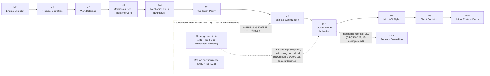

# Roadmap & Milestones

## Purpose

Sequences the entire project — Phase 1 (server) then Phase 2 (client) — into milestones `M0`…`M10`, each with a goal, a scope, and measurable, automatable acceptance criteria, plus `M11` (Bedrock Cross-Play, `15-crossplay.md`) appended as a Phase-1-server-only extension gated on `M0`–`M7` and independent of `M8`–`M10`. Fixes the build order so that every later milestone's scope can assume every earlier milestone's acceptance criteria already hold, states the top technical risks and their mitigations against the domain docs that own them, and records the project's current phase and the phase transition that follows planning.

## Scope

**In scope:** the ordered milestone sequence for Phase 1 and Phase 2; per-milestone goal, scope bullets, and measurable acceptance criteria; the sequencing rules that justify the chosen order (in particular: message substrate and partition model as foundational-from-`M0` vs. cluster mode as a later activation milestone; modding-API placement); a risk register of the project's top technical risks with mitigations and owning-doc references; the explicit statement of current phase (planning) and next phase (blueprint derivation).

**Out of scope:** the internal implementation content of any milestone (that is what the blueprint-derivation phase produces, per PLAN-D6, and it does not exist yet); numeric threshold calibration (ARCH-D6/D19/CLUSTER-D2/D3's seed defaults remain seed defaults here — a milestone's acceptance criteria *measure* against them, this document does not recalibrate them); CI/tooling mechanics (owned by `12-workspace-structure.md`'s WS-D9–D11); project management concerns not already covered by the milestone/acceptance-criteria structure (staffing, calendar dates, cost) — this is a sequencing and readiness-gate document, not a schedule.

## Decisions

| ID | Decision | Rationale |
|---|---|---|
| PLAN-D1 | **Phase 1 (server) precedes Phase 2 (client).** No Phase 2 client milestone (`M9`, `M10`) begins in earnest before Phase 1 reaches `M8` (Mod API Alpha). | Phase 2's shared-crate reuse (`12-workspace-structure.md`'s WS-D3 rule 1: `rc-core`, `rc-nbt`, `rc-registries`, `rc-protocol`(`-macros`), `rc-mod-api`, `rc-mod-host`) needs those crates' contracts to have already stabilized against a working server before the client starts depending on them — building both sides of a shared contract simultaneously from scratch would let the contract drift under both sides' pressure at once instead of the client conforming to an already-proven one. |
| PLAN-D2 | **Milestone order:** `M0` Engine Skeleton → `M1` Protocol Bootstrap → `M2` Persistent World Storage → `M3` Mechanics Tier 1 (Redstone Core) → `M4` Mechanics Tier 2 (Entities/AI/Combat) → `M5` World Generation Parity → `M6` Scale & Optimization → `M7` Cluster Mode Activation → `M8` Mod API Alpha → `M9` Client Bootstrap → `M10` Client Feature Parity. Each milestone's acceptance criteria (see [Milestones](#milestones)) must hold in a reference environment before the next milestone's scope is considered startable; this is a sequential *readiness* gate on scope, not a prohibition on parallel prep work (e.g. `04-worldgen-parity.md` may be drafted in parallel with `M3`'s implementation, since worldgen implementation itself only starts at `M5`). | This is the "best possible result" ordering the project brief asked for: protocol bootstrap first because nothing else is observable without a client able to connect; storage before mechanics because mechanics tier 1's redstone-parity corpus needs persisted, reloadable world state to be a meaningful regression suite rather than a single-session fluke; mechanics before worldgen because worldgen parity testing (`M5`) needs the block/biome placement mechanics that consume generated chunks to already exist to validate against; scale/optimization before cluster because clustering multiplies a single-node performance bug across N nodes — fix it once, single-node, first; cluster before mod API because a mod hook injected into an engine whose partition/transport story is still changing would need to be re-validated after every such change; mod API before client because the client's isomorphic mod loader (`M10`) should conform to an already-proven server-side hook contract, not co-design it blind. |
| PLAN-D3 | **Foundational vs. activation milestones.** The message-passing substrate (ARCH-D24–D30: addressing, envelope, `Transport` trait, `RegionMessageBus`) and the region partition model (ARCH-D5–D23: regions, the domain-group tick pipeline, RC-Executor/RC-WorkerPool) are not their own milestone — they are foundational, fully exercised starting at `M0` in monolithic form (`InProcessTransport`, `12-workspace-structure.md`'s `rc-transport-inproc`). `M7` (Cluster Mode Activation) does not build or revisit either: it adds `NetworkTransport`, the raft-backed `RegionId -> NodeId` directory, and the proxy — swapping which struct sits behind `dyn Transport` (ARCH-D26) and adding one addressing hop (CLUSTER-D1) — without touching `M0`–`M6`'s ECS, tick-pipeline, or domain logic. | Directly implements the project brief's explicit constraint: "the message substrate and partition model are foundational... but multi-node cluster mode is activated as its own later milestone — monolithic correctness first." This is also `01`'s own design intent made concrete on the roadmap: ARCH-D26's rationale is that no domain system changes between monolithic and cluster deployment, so there is no engineering reason for `M0`–`M6` to wait on cluster-mode work, and every tick/redstone/entity correctness property `M3`–`M6` establish is proven once and inherited unchanged by `M7`, not re-proven. |
| PLAN-D4 | **Mod API placement rationale.** The ECS-level primitive isomorphic modding depends on — `World::register_component_with_descriptor` (ARCH-D4) — is foundational from `M0` like the rest of `01`'s ECS decisions, not deferred. The full mod-API-*alpha* milestone (`M8`: a real dylib loader, hook injection, crash isolation, a working reference mod) is deliberately sequenced after `M3`–`M7` stabilize the engine's tick/storage/worldgen/scale/cluster behavior — so the hook surface targets a settled contract, not a moving one — but strictly before any client milestone (`M9`/`M10`), so the client's isomorphic mod loader validates against an already-proven server-side hook contract instead of being designed in parallel from a blank slate. | This is the concrete resolution of the project brief's "place the modding API deliberately (early enough that hooks shape the engine, per vision)": the engine-*shaping* decision (ARCH-D4's dynamic-registration primitive) is genuinely early — encoded into `01` before this roadmap existed — while the *validation* milestone (`M8`) is placed where it does the most good: after the surface it hooks into has stopped changing, and before the one downstream consumer (the client) that needs it to already work. |
| PLAN-D5 | **Milestone completion is gated exclusively by its measurable acceptance criteria** (see each milestone's Acceptance Criteria list) — never a subjective "feels done" call. Every acceptance criterion is either an automated test/corpus-comparison result or a documented, reproducible manual procedure with a pass/fail threshold; `12-workspace-structure.md`'s WS-D11 CI policy is what actually runs the automated ones. | Matches the project's own "current-state, measurable, no ambiguity" documentation discipline, extended from decision records to milestone gates; a criterion that cannot be automated or reproduced is not a criterion, it is an aspiration, and this project's planning docs do not record aspirations as decisions. |
| PLAN-D6 | **Current phase: PLANNING.** This document and its sibling planning docs (`01`–`13`, all in `docs/planning/`) are the entirety of the project's output to date — no `cargo init`, no source crate, no code exists yet, per the project's binding planning-only constraint. **Next phase: blueprint derivation**, performed *per milestone*, not once for the whole project — `M0`'s blueprint is derived from `01`, `02`, `12`, and this document once `M0` is the active milestone, `M1`'s blueprint is derived once `M0`'s acceptance criteria pass, and so on. A milestone's blueprint document is what `12-workspace-structure.md`'s reserved `blueprints/` directory holds, one file per milestone, populated only when that milestone's derivation actually starts. | States the phase boundary explicitly so that any AI model or contributor deriving an implementation blueprint from this document series knows precisely what exists (fifteen-ish Markdown planning docs, zero code) and what does not (any blueprint, any crate, any line of Rust) — and that blueprint derivation is deliberately staged per-milestone rather than attempted for the whole roadmap at once, so a blueprint is always derived against the most current state of the docs it depends on, not a stale snapshot from project start. |
| PLAN-D7 | **Risk register** (see [Risk Register](#risk-register) below) enumerates the project's top technical risks with mitigations and the owning decision IDs/docs each mitigation depends on. | Required so that a reader deriving a blueprint for any given milestone knows which of that milestone's design choices exist specifically *because* of a named risk, rather than appearing to be an arbitrary addition to scope. |
| PLAN-D8 | **`06-modding-api.md`'s MOD-D45 contraption-mod tiers, milestone assignment.** Tier 1 (behavior override + event veto over individual piston occurrences) is already inside `M8`'s scoped Tier-1 hook/override capability — no additional milestone. **Tier 2** (mod-reachable piston push/pull/classify override) needs no milestone of its own either: `05-game-mechanics.md`'s MECH-D13/D73 already specify that logic as a registered, `Identifier`-targetable seam from its first implementation at `M3` (Mechanics Tier 1), so it becomes mod-exercisable the moment `M8`'s MOD-D35 override mechanism exists — Tier 2 lands at `M8`, alongside Tier 1. **Tier 3** (a generalized structure-entity concept, composite collision shapes, and client-side moving-structure rendering — MOD-D45's three genuinely-new engine mechanisms, none designed anywhere in this corpus yet) is assigned **no milestone in this revision**: it falls outside the current `M0`–`M11` set, deferred to a future roadmap revision once `05`/`rc-physics`/`07` have each scoped their own named prerequisite. | Recording "no milestone" honestly for Tier 3, rather than inventing a placeholder with no acceptance criteria behind it, matches this document's own PLAN-D5 discipline; Tier 2 needing no milestone of its own falls directly out of `05`'s already-current MECH-D13/D73 text, not a new commitment made unilaterally here. |
| PLAN-D9 | **M4 entry gate: verification hardening lands first.** M4 implementation begins only after (a) the TEST-D54 protocol-differential harness is blueprinted and implemented with a first meaningfully green scheduled run over the existing M1–M3 packet surface, (b) WS-D15’s generated block-state property registry lands and M3’s placeholder-id tables are retired against it, (c) TEST-D55’s case-matrix lint and TEST-D57’s reference-verification gate are active, (d) the block-event re-entrancy parity fix (MECH-D9 — replacing M3’s double-buffered queue-then-flush model with vanilla’s actual single-buffered re-entrant drain) lands before any redstone-corpus capture run, and (e) the world-save folder-layout correction (WORLD-D14 — replacing M3’s legacy layout with the real `dimensions/<namespace>/<path>/` scheme) lands, with M4’s blueprints having passed the TEST-D57 pass. This work is scheduled as a short hardening milestone **M3.5** (blueprints to be derived; same changeset discipline as every milestone), not folded silently into M4. | M3’s field test surfaced four defect classes the automated suite structurally could not see; entering M4 — the largest mechanics surface so far — with the same blind spots would multiply them. Each gate item removes a proven escaped-defect class rather than adding speculative process. |
| PLAN-D10 | **M3 field-report closure scope (owner play test of tag `m3.5-final`, 2026-09-04).** The player-facing interaction surface of the tier-1 redstone set is part of M3's parity claim and closes as `M3 field-report` changesets on `main` before M4 wave 3 starts: block-use dispatch with repeater delay cycling and comparator mode cycling incl. the click sound (MECH-D82), the lever as tier 1's manual input (MECH-D13), the `block_event` broadcast for piston animation (MECH-D83), the per-face support predicate (MECH-D84), MECH-D78's dual-cell resend, and the confirmed parity defects from that test (wall-torch strong signal axis, extended-piston-base shapes). Button and pressure plate are tier 2 (M4, blueprint `M4-B10`). Every fix ships test-first (TEST-D45/D46) with corpus fixtures captured from the oracle where the behaviour is engine-observable, and the owner receives a fresh pinned binary from the closing commit; the `m3.5-final` tag stays as the field-report baseline. | The findings are gaps in what a player can do with the components M3 already claims as bit-exact, not new tier-2 mechanics; closing them now keeps the owner's play test — the only real-client oracle this project has — able to exercise redstone at all, and keeps M4's own field reports attributable. |
| PLAN-D11 | **M5 entry gate: the worldgen blueprints flagged by the TEST-D57 pass are re-authored before M5 implementation starts.** The 2026-09-05 research pass verified 1,242 claims across the nineteen M5 blueprints; 411 were wrong and every correction is applied, but for eight blueprints the corrections replaced core algorithms rather than details — `M5-B06` (cave/canyon carver config and RNG draw order), `M5-B11` (trunk placers, vines), `M5-B12a` (dripstone/geode/sculk mechanisms), `M5-B12b` (every nether-geology kind), `M5-B12c` (root system and eleven other kinds), `M5-B12d` (fossil and template placement control flow), `M5-B13a` (desert pyramid/jungle temple/swamp hut are procedural pieces, not templates), `M5-B13c` (ocean monument room grid, mansion). Each is re-authored from the reference by the blueprint-authoring role (Opus), re-verified by a fresh TEST-D57 pass, and audited, before any `M5-B` implementation changeset; the other eleven M5 blueprints proceed on their corrected text. | A blueprint whose algorithm was reconstructed from memory cannot be implemented bit-exact by correction alone; the design consequences the correction agents recorded (`docs/findings-for-planning.md`, M5 entry) show the acceptance tests and draw-count criteria of those eight rest on facts now known to be false. |

## Milestones

### M0 — Engine Skeleton & Workspace Bootstrap

**Goal:** the Cargo workspace exists per `12-workspace-structure.md` and empty regions tick at 20 TPS on the real scheduler, with no network and no chunks yet.

**Scope:**
- Workspace scaffold: all 27 library crates + 2 binaries + `xtask` created per `12`'s Crate Manifest, `[workspace.dependencies]` pinned per `12`'s Workspace Dependency Versions table.
- `rc-core`, `rc-messaging`, `rc-scheduler` implemented to the point of ARCH-D1–D9, D12, D18–D23: a `bevy_ecs::World` per region, RC-Executor/RC-WorkerPool driving the 11-stage tick pipeline (stages that have no mechanics content yet are no-ops), region build/merge/split (ARCH-D5–D6) exercised against synthetic load.
- `rc-transport-inproc`'s `InProcessTransport` (ARCH-D27) wired between two artificially-split regions.
- `12`'s CI gates (WS-D11: `fmt-check`, `lint`, `lint-deps`, `test`) green on every push from the first commit onward.

**Acceptance criteria:**
- A debug build ticks 8 synthetic regions (no chunks, no players, no mechanics content) at a stable 20 TPS ± 1% for a continuous 10-minute soak test with zero panics.
- Two regions exchange a synthetic `BorderUpdateEvent`-shaped message across `InProcessTransport`, and an automated test confirms it is applied at the correct Stage-1 boundary on the destination region's next tick (ARCH-D11's timing rule) — not the same tick, not two ticks later.
- `xtask fetch-data 26.2` and `xtask codegen` (NET-D9) run successfully against a locally supplied, legally obtained `server.jar` and produce compiling generated code under `crates/registries/generated/v776/` (WS-D13).
- `xtask lint-deps` (`12`'s WS-D3 dependency-graph rule checker) passes with zero forbidden edges.
- The agent-executable verification loop and the test-integrity guardrails (`09-testing-quality.md`'s TEST-D40–D52) — machine-readable tier output, the CI path-guard, and the CI-is-authority rule — are wired and enforced from the first commit onward.

### M1 — Protocol Bootstrap: Status & Login

**Goal:** an unmodified vanilla Java Edition 26.2 client can ping the server and log into a minimal placeholder world.

**Scope:**
- `rc-protocol` + `rc-protocol-macros`: framing/compression (NET-D5), encryption + online-mode session validation via `rc-auth` (NET-D6), the connection state machine through `Configuration` (NET-D4), Server List Ping/Status (NET-D11).
- Minimal Play-state: a player spawns into a single hardcoded region holding a hand-built superflat placeholder world (real chunk storage is `M2`'s scope, not this milestone's — chunks here are synthetic and thrown away, never persisted).
- Keep-alive handling and clean disconnect/timeout behavior.

**Acceptance criteria:**
- An unmodified vanilla Java Edition 26.2 client completes Handshake→Status→Pong against the server, and separately completes Handshake→Login→Configuration→Play, spawns into the superflat placeholder world, and **stays connected for a continuous 30-minute idle session with zero disconnects or timeouts**.
- A raw TCP probe (not a Minecraft client) confirms the `Status Response` JSON carries the correct protocol number (776, NET-D1), version name, online/max player count, and MOTD.
- Online-mode session validation (NET-D6) succeeds against Mojang's real session server for a genuine purchased account in a manual verification pass (this one step cannot be fully automated — it depends on a live third-party account).

### M2 — Persistent World Storage

**Goal:** `M1`'s placeholder world is replaced by real, persisted chunk storage; player state survives a restart.

**Scope:**
- `rc-chunk-storage` (owned by `03-world-chunks-persistence.md`): on-disk region-file format, palette/section representation, the Stage-9 snapshot handoff (ARCH-D12 stage 9) wired to real asynchronous disk I/O outside the tick budget.
- Player data persistence (position, inventory, health) via `rc-nbt`.
- Configurable per-region save interval, firing off the tick thread.

**Acceptance criteria:**
- A player places and breaks blocks, logs off, the server process restarts cleanly, the player rejoins: every block change and inventory item is present and byte-identical in block/item state to what was there before restart.
- An automated soak test performs 10,000 synthetic chunk write/read round trips with zero checksum mismatches.
- The configured save interval is measured, over a 30-minute run, to fire within ±1 tick of its configured cadence — this is the knob `13-cluster-architecture.md`'s CLUSTER-D17 will later override tighter for cluster mode, so its correctness here is a direct prerequisite for `M7`.

### M3 — Mechanics Tier 1: Movement, Blocks, Redstone Core

**Goal:** the first vanilla-parity mechanics slice, proving ARCH-D13's mandatory-sequential redstone domain is bit-exact.

**Scope:**
- `rc-mechanics` (owned by `05-game-mechanics.md`) tier 1: player movement/collision, block placement/breaking, block-update propagation, core redstone components (wire, repeater, comparator, torch, piston) under ARCH-D13's sequential Stage 4, plus that set's player-facing interaction surface (block use, lever, `block_event` broadcast — PLAN-D10, closed as M3 field-report changesets after the M3.5 gate).
- Random block tick (ARCH-D14) and block-entity tick (ARCH-D17) for the small tier-1 set (chest, furnace, hopper).
- The `corpus/` redstone-trace fixture set (`12`'s WS-D10) populated for the first time via `xtask fetch-corpus`.

**Acceptance criteria:**
- A corpus of at least 50 known redstone contraptions (pulse generators, clocks, piston doors, a hopper clock) captured from vanilla and replayed tick-for-tick produces a bit-identical redstone-component state sequence to the recorded vanilla reference trace, checked automatically by `xtask parity-check redstone` on every scheduled CI run (`12`'s WS-D11).
- 20 TPS sustained for 10 minutes with 20 simulated bot clients performing continuous movement and block interaction concentrated within a single region (a single-region scale baseline — multi-region/hot-region scaling is `M6`'s scope, not this one's).

### M3.5 — Verification Hardening

**Goal:** remove, structurally, the defect classes M3's real-client field tests proved the automated suite could not see (PLAN-D9), before M4 widens the mechanics surface.

**Scope:**
- WS-D15's generated block-state property registry in `rc-registries`, and the retirement of every hand-authored state-id table it replaces (redstone component constants, `rc-physics` shape rows, dispatch ranges, oriented placement table, replay ranges), guarded by a `lint-tests` rule against new literal state ids outside the generated crate.
- TEST-D54's protocol-differential harness (`xtask protocol-diff`): one scripted bot session plus the redstone corpus driven over the wire against both the pinned oracle and `rusty-clanker-server`, normalized clientbound streams diffed per packet type at byte level, as its own scheduled CI tier.
- TEST-D55's case-matrix lint, TEST-D56's spec-citation check, and TEST-D57's claims-list artifact, applied retroactively to the M3 test files and as a hard gate for M4's blueprints.
- WORLD-D14's `dimensions/<namespace>/<path>/` save layout and WORLD-D6's block-entity records/codec for the tier-1 block entities.
- The findings-ledger backlog from M3's field-report waves: `SectionBlocksUpdate` with per-viewer view-distance filtering for tick broadcasts, hopper `ENABLED` re-evaluation on neighbor change, concurrent drains for every piped `xtask` subprocess, the corpus fixture prose batch.

**Acceptance criteria:**
- Zero hand-authored block-state id tables remain outside the generated registry (lint-enforced); `parity-check redstone` 52/52 and `placement-diff` 85/85 unchanged.
- `xtask protocol-diff`'s first scheduled run is green over the M1–M3 packet surface (session script + redstone corpus over the wire).
- `lint-tests` enforces the TEST-D55 header/waiver on every mechanic test file; the TEST-D57 claims list exists for every M4 blueprint before any M4 implementation changeset.
- A chest, furnace and hopper with contents survive a clean server restart under the `dimensions/<namespace>/<path>/` layout, verified by an automated restart round-trip.
- Tier-1 CI green on the final commit; hard gate — M4 starts only on the owner's explicit go.

**Blueprints:** `blueprints/M3.5/` (B00 index, B01–B06).

### M4 — Mechanics Tier 2: Entities, AI, Combat, Items

**Goal:** broaden mechanics coverage to entities, exercising the parallel Stage 6/7/8 domains fully and proving cross-region entity transfer for the first time with real players.

**Scope:**
- Entity AI/pathfinding/physics (ARCH-D15's 6a/6b split), mob spawning, combat/damage, item entities and pickup, liquid flow (water/lava), lighting exercised at real scale (ARCH-D16), hopper item-transfer chains crossing chunk borders (ARCH-D17).
- Cross-region entity transfer (ARCH-D10) exercised with real players and mobs crossing a live region boundary for the first time (previously only synthetic messages, per `M0`'s acceptance criteria).
- Tier-2 input components: button (auto-off scheduled tick) and pressure plate (entity-presence trigger) — the two inputs M3-B04 §H excluded alongside the lever that PLAN-D10 pulled into M3; blueprint `M4-B10` (implemented in M4 wave 3 alongside M4-B04/B05/B08).
- Build-order note: `rc-rng` (`crates/rng/`, WS-D14) is authored by blueprint `M5-B01` but consumed by `M4-B02`'s loot rolls — when implementation reaches `M4-B02`, the `rc-rng` crate portion of `M5-B01` is implemented first, a deliberate bounded forward-pull that changes no milestone acceptance gate.

- Entry gate: PLAN-D9 — M4 implementation starts only after the M3.5 hardening milestone (TEST-D54 differential harness, WS-D15 block-state property registry, TEST-D55/D57 gates, MECH-D9 block-event re-entrancy parity fix, WORLD-D14 save-folder-layout correction) is green.

**Acceptance criteria:**
- A player walks across a live region boundary (two independently-ticking regions, still monolithic — no cluster mode) with position-delta logging on the client showing no observable discontinuity beyond ARCH-D10's documented one-tick transfer budget.
- An automated test confirms a hopper chain crossing a chunk border within one region transfers items at vanilla's correct tick cadence.
- A scripted scenario suite confirms mob AI pathfinding routes around obstacles and engages in combat consistent with vanilla behavioral expectations — this criterion is qualitative/behavioral parity, explicitly distinguished from `M3`'s bit-exact redstone-trace standard, since entity AI has no equivalent public bit-exact reference to compare against.

### M5 — World Generation Parity

**Goal:** `rc-worldgen` reproduces vanilla terrain generation for the pinned protocol/data version.

**Scope:**
- Noise pipeline, biome placement, structure generation, decoration passes (owned by `04-worldgen-parity.md`), sourced from public data-generator output, protocol/format documentation, black-box observation, and — per ASSET-D18(f) — the pinned version's decompiled jar consulted as reference, never copied verbatim.
- Confirmation that worldgen remains background work at lower-than-tick scheduling priority (ARCH-D12's worldgen note), delivered as a Stage-1 structural command per completed chunk, never inserted mid-tick.
- The `corpus/` worldgen chunk-hash fixture set populated via `xtask fetch-corpus`.
- Full per-kind coverage of vanilla's `Feature`/trunk-placer/foliage-placer/hand-coded-structure-family taxonomies ships in two tiers within this milestone: a first tier covering every family class with a representative implementation, then the remaining individual kinds as a tracked, bounded follow-on tier — both tiers are this milestone's own scope, tracked by name at the implementation-blueprint level (`blueprints/M5/M5-B00-index.md`); acceptance criterion 1 below is exercised for real only once both tiers have landed, never against the first tier alone.

- Entry gate: PLAN-D11 — the eight re-authoring-flagged blueprints are rewritten and re-verified before M5 implementation begins.

**Acceptance criteria:**
- For a fixed world seed, 10,000 generated chunks' block-state arrays hash-match a vanilla-server-generated reference corpus for **at least 99.9%** of chunks, checked by `xtask parity-check worldgen`; any exceptions are documented, bounded, and attributable to a specific, named source of non-determinism (never silent drift) — a missing `Feature`/structure-family implementation is not such an exception (it is closed by this milestone's own second coverage tier above, never redefined as a sanctioned parity gap).
- Worldgen throughput sustains chunk generation fast enough to keep 20 simulated players spread across the server at render distance 12 from ever exhausting their loaded-chunk radius, while concurrently-ticking regions' p99 tick duration stays within the 50 ms budget (ARCH-D20's EDF admission never yields tick-stage work to worldgen ahead of an overdue region, confirmed by observing zero overdue-region admission violations during the run).

### M6 — Scale & Optimization: Multi-Region Throughput

**Goal:** prove the "quiet regions batched, hot regions scale out" thesis under real multi-region load, and replace `01`'s seed threshold defaults with calibrated values.

**Scope:**
- A bot-swarm load-testing harness driving many concurrently-ticking regions at deliberately varied hotness.
- RC-WorkerPool elastic grow/shrink (ARCH-D19) and EDF admission (ARCH-D20) calibrated against real measurements.
- Region merge/split hysteresis (ARCH-D6) thresholds calibrated against real measurements.
- A documented reference host specification these measurements are pinned against (`12`'s Open Questions flags this as not yet fixed — it is fixed as part of this milestone's own execution, not before).
- `14-performance-engineering.md` owns this milestone's concrete Tier-3 release-gate content (the PGO/BOLT build pipeline, PERF-D45–D52) and the per-stage/memory/SLO budget tables (Section I) usable directly as measurable acceptance-criteria inputs below.

**Acceptance criteria:**
- 20 TPS sustained across all regions for a 15-minute run with 200 simulated bots distributed across at least 8 independently-ticking regions at view distance 10, on the milestone's documented reference host, with RC-WorkerPool utilization staying under its hard cap (ARCH-D18).
- A region with 0 players coalesces onto a shared worker (ARCH-D19's coalesced-tick path) and is measured, via per-region CPU attribution metrics, to contribute near-zero dedicated CPU.
- A fault-injection test deliberately overloads one region: sibling regions hold 20 TPS while only the overloaded region's own TPS degrades (ARCH-D7's "only a region that cannot keep up degrades its own TPS"), confirmed automatically.

### M7 — Cluster Mode Activation

**Goal:** CLUSTER mode works end-to-end — multiple node processes plus a proxy computing one shared world — with zero regression to `M6`'s monolithic-mode results.

**Scope:**
- `rc-cluster` (`openraft` + `redb`), `rc-transport-net` (`quinn`/`postcard`), the `rc-proxy` role (`12`'s WS-D6: linked into `rusty-clanker-server`, not a separate binary), the shared-storage backend wired against `rc-chunk-storage`'s abstraction (CLUSTER-D18).
- Node discovery/bootstrap (CLUSTER-D14), the rebalancer (CLUSTER-D2), failure takeover (CLUSTER-D16), the six-step handoff protocol (CLUSTER-D22), pre-warming (CLUSTER-D24).
- Per PLAN-D3: no changes to `M0`–`M6`'s ECS/tick-pipeline/domain code — only the `Transport` implementation swap and the new `RegionId -> NodeId` hop.

**Acceptance criteria:**
- A player crosses a region border whose two sides are owned by two different node processes, mediated by the proxy, with **zero client-visible disconnect and zero loading screen**, end-to-end handoff time measured at ≤ 2 ticks (100 ms) in a co-located test topology matching CLUSTER-D7/D22's budget.
- Killing a node process mid-session triggers takeover: the failed node's regions resume ticking on a surviving node within the raft election-timeout-plus-takeover window, and players connected to unaffected regions observe zero interruption.
- A 3-node + 2-proxy cluster sustains `M6`'s same 200-bot/8-region/20-TPS profile with no correctness regression: `M3`'s redstone-trace corpus, replayed with the two contraptions under test split across a node boundary, remains bit-identical within each node's own owned region (cross-node border latency is explicitly allowed its documented N-tick degradation per CLUSTER-D8, not required to be zero).
- `M6`'s full acceptance criteria still pass, unmodified, on the same build with no `[cluster]` config present — confirming monolithic mode is genuinely unaffected (CLUSTER-D26/D27).

### M8 — Mod API Alpha

**Goal:** the first working isomorphic mod loads and hooks the engine on both server and client sides without any engine source change.

**Scope:**
- `rc-mod-api`'s hook trait surface and `ComponentDescriptor` builder (wrapping ARCH-D4), `rc-mod-host`'s dylib loader (`libloading`), hook injection points into `01`'s current `ARCH-D8` domain groups (`01` now enumerates eight; this milestone tracks whatever `01` currently names, per `06`'s MOD-D8/D37, not a fixed count restated here).
- A reference mod: one new block type with custom tick behavior, one new item, one client-side render hook — built as a real showcase, not a stub.
- Crash isolation: the mod-host boundary catches a panicking hook via `catch_unwind` rather than crashing the server process.
- The Mod Developer Guide's documentation infrastructure (`06`'s MOD-D47's three-part CI wiring — rustdoc reference, mdBook build/hosting per MOD-D49, `examples/` workspace crates) plus every guide chapter whose underlying capability `M8` itself ships natively (MOD-D50's chapter outline: Getting Started, Core Concepts, Blocks & Behaviors, Items, Custom Systems & Ordering Anchors, Events, Override & Wrap Vanilla, Components on Vanilla Entities & Persistence, Mod Networking Channels, Isomorphic Packaging, Testing Your Mod, Publishing/Versioning & ABI Compatibility, and Migration Notes Policy) — each chapter backed by its own `examples/` crate exercising exactly the `M8`-shipped native tier (MOD-D48). Custom World/Chunk Data (chapter 9) and Client-Side (chapter 11) are explicitly out of `M8`'s own scope, deferred per MOD-D52.

**Acceptance criteria:**
- The reference mod's dylib loads at server startup with zero engine source changes, registers a new component via `register_component_with_descriptor`, and that component correctly participates in ARCH-D8's startup conflict-graph check — proven by a second, deliberately conflicting test mod being rejected at boot with a clear diagnostic, not a silent misbehavior.
- A mod-crash isolation test: the reference mod's tick hook is made to panic deliberately; the engine catches it at the `rc-mod-host` boundary, logs the failure, disables only that mod, and the tick pipeline continues at 20 TPS for every other region and every unaffected system without crashing the server process.
- The reference mod's hook contract is verified via a headless test harness proving each hook fires at the correct pipeline point with correct data — full visual verification of its client-side render hook is explicitly deferred to `M10`, since the native client does not exist yet at this point in the sequence (PLAN-D2).
- Per MOD-D52's binding definition-of-done rule: none of `M8`'s own mod-API capabilities is considered done on engine-side tests alone — each requires its guide chapter and its tested `examples/` entry to both exist and pass Tier 1 CI (TEST-D37) before `M8` itself is considered complete.

### M9 — Client Bootstrap: Connect & Render a Static World

**Goal:** `rusty-clanker-client` connects using `rc-protocol`, receives a world, and renders it via `rc-render`, reading assets from the player's own local `.minecraft` installation.

**Scope:**
- `rc-render` (`wgpu` 30.0.0 pipeline, CLIENT-D2): chunk mesh generation from received chunk-section data, camera and movement, a texture atlas built from the player's local assets.
- `rc-assets`: locates and parses the player's `.minecraft` installation (client jar + resource packs) into engine-usable textures/models at runtime — never bundled, never distributed, per the project's asset-custody policy (ASSET-D13).
- The client speaks the exact same `rc-protocol` codec (protocol 776) the server targets — no client-specific protocol fork.

**Acceptance criteria:**
- The native client connects to a Rusty Clanker server (an `M1`–`M6`-feature-complete build), authenticates via a real Microsoft/Mojang account, and renders a generated world's terrain correctly textured from the player's legally-owned local assets, with block placement matching server state 1:1.
- Camera movement and basic input round-trip to the server (movement sent, server-authoritative position reflected back) at a stable, documented frame rate on a reference GPU for a continuous 10-minute session with zero crashes.
- A release-artifact content audit confirms **zero** PNG/OGG/model/Mojang-derived binary assets anywhere in the client binary or its build archive — every visual/audio asset present at runtime was loaded from the player's own local installation, never shipped.

### M10 — Client Feature Parity: Entities, UI, Isomorphic Mods

**Goal:** the client reaches feature parity with vanilla's core play loop, and closes the isomorphic mod API's client-side loop opened by `M8`.

**Scope:**
- Entity rendering/animation, inventory/HUD UI, sound playback from local assets, chat.
- `rc-mod-host` client-side integration: the `M8` reference mod's client-side render hook, deferred at `M8`, is completed and verified here.
- The Mod Developer Guide's Client-Side chapter (mdBook chapter 11: Models, Renderers, GUI, HUD, Input — MOD-D50/D52) lands here, tied to the same `M8`-reference-mod client-hook completion this milestone's own acceptance criteria already require — it cannot land earlier, since `M10` is the milestone that first proves the hook renders correctly at all.

**Acceptance criteria:**
- A full play session — join, move, build, fight a mob, open inventory, chat — is completable start to finish using only the native client against a Rusty Clanker server, no Java client involved, for a continuous 30-minute session with zero crashes.
- The `M8` reference mod's client-side hook — identical Rust mod source, compiled once for the server target and once for the client target (the isomorphic-modding promise) — renders its custom visual behavior correctly in the native client, closing the loop `M8` deliberately left open.
- A `cargo tree` audit (`12-workspace-structure.md`'s WS-D3 rule 1) confirms `rc-core`, `rc-nbt`, `rc-registries`, `rc-protocol`, `rc-mod-api` resolve to the **same compiled dependency versions** in both `rusty-clanker-server`'s and `rusty-clanker-client`'s dependency graphs — no drift, no forked copies.

### M11 — Bedrock Cross-Play

**Goal:** a pinned-version (CROSS-D6) Bedrock Edition client joins the same world a Java client is connected to, sees the server's real worldgen-parity terrain, plays alongside the Java client with Tier-1 behaviors verified bit-for-bit consistent, and every Tier-2/3 deviation is documented and bounded, not silent — with `crossplay = false` producing zero bound Bedrock listener and zero measurable performance cost.

**Scope:**
- `rc-bedrock-raknet`, `rc-bedrock-protocol`, `rc-bedrock-auth`, `rc-bedrock-translator`, `rc-bedrock-mappings` (CROSS-D2) implemented to CROSS-D9–D20.
- Monolithic-mode in-process listener and cluster-mode proxy/node placement (CROSS-D3) both implemented and tested.
- `crossplay` Cargo feature and `[crossplay]` config surface (CROSS-D4/D10).
- The mapping-data pipeline (`xtask fetch-bedrock-data`, `xtask codegen-bedrock-mappings`, CROSS-D19–D21) run successfully against a legally obtained BDS + `bedrock-samples` checkout for the pinned version pair.
- `09-testing-quality.md`'s `rc-paritybot` gains a Bedrock-bot capability (CROSS-D23) and the cross-edition consistency scenario corpus (CROSS-D24).

**Acceptance criteria:**
- `crossplay = false` (or absent): an automated test confirms no UDP socket is bound on the configured RakNet port; a `criterion` benchmark shows no measurable tick-time regression against a `crossplay`-feature-stripped build (CROSS-D26).
- `crossplay = true`, monolithic mode: an unmodified, pinned-version Bedrock client completes the full connection lifecycle (RakNet handshake, JWT-chain login, encryption handshake, resource-pack negotiation) and spawns into the server's real, `M5`-generated terrain — not a placeholder or superflat world.
- A scripted `both-simultaneously` cross-edition scenario (CROSS-D24) confirms a block placed by the Java client is observed by the Bedrock client, and vice versa, within a bounded tick window, with resulting world state identical regardless of which edition performed the action.
- The full CROSS-D15 Tier-1 behavior set passes the cross-edition consistency suite (CROSS-D24) with world-state hashes identical to the Java-only baseline (`09`'s TEST-D10).
- The full CROSS-D16/D17 Tier-2/3 set is asserted present-and-bounded via a dedicated fixed test matrix — any newly discovered Bedrock-side limitation is added to the tier table (CROSS-D18) before the affected feature is considered acceptance-complete.
- `crossplay = true`, cluster mode: a Bedrock client's session survives a cross-node region-boundary handoff within `M7`'s already-proven CLUSTER-D22 ≤2-tick, zero-disconnect budget, verified by a Bedrock-bot variant of `09`'s TEST-D21 handoff suite.
- A real, unmodified pinned-version Bedrock game client manually joins, renders, and plays a continuous session against a full-featured (`M0`–`M7`) Rusty Clanker build (CROSS-D25's one manual-verification carve-out).

**Dependency:** requires `M0`–`M7`'s acceptance criteria (engine skeleton through cluster mode activation); independent of `M8` (Mod API Alpha) and fully independent of `M9`/`M10` (Phase 2 client) — see CROSS-D22.

## Risk Register

| Risk | Description | Mitigation | Owning decisions/docs |
|---|---|---|---|
| Parity drift | Behavioral or bit-exact mismatches against vanilla accumulate over time as the reimplementation grows, undetected until a player notices. | Automated, CI-gated parity corpora with numeric thresholds (`M3`'s ≥50-contraption bit-exact redstone trace, `M5`'s ≥99.9% worldgen chunk-hash match), re-run on every scheduled CI job (`12`'s WS-D11), not just once at milestone completion. | `01` ARCH-D13/D14/D16/D17; `12` WS-D10/D11; this doc `M3`/`M5` |
| Protocol version churn | Mojang ships a new full release (e.g. `26.3`) mid-development, and NET-D1's pinned target goes stale before Phase 1 finishes. | NET-D2's deliberate, reviewed version-bump gate (three explicit sub-steps, never silent); the `xtask fetch-data`/`codegen` pipeline (NET-D9) is built for repeatable re-runs against a new version rather than a one-time script. | `02` NET-D1/D2/D9 |
| Cross-play mapping/tier staleness | Bedrock's own faster patch cadence (CROSS-D6) means the Java↔Bedrock mapping-data pipeline output or the translation-tier table can silently fall behind a newer Bedrock client build, reintroducing an undocumented parity gap on the Bedrock-facing side. | CROSS-D21 ties the mapping-pipeline re-run to *either* edition's version pin moving; CROSS-D18 treats the tier table as a living document reviewed at every Bedrock version-bump gate, never left stale — the same "no silent drift" discipline this register's Parity drift/Protocol version churn rows already apply to the Java-only surface. | `15-crossplay.md` CROSS-D6/D7/D18/D21; this doc `M11` |
| Determinism under parallelism | An undiscovered edge case in the per-stage parallelization guarantees (ARCH-D13–D17) — especially at chunk/region boundaries — produces observable non-determinism vanilla does not have. | ARCH-D8's startup conflict-graph hard-error catches declared-access violations at boot, not at runtime; `M3`'s bit-exact redstone corpus is specifically chosen because redstone is the domain with zero tolerance for this risk (ARCH-D13); `12`'s `cargo-nextest`-isolated test policy (WS-D10) keeps a discovered non-determinism bug from masking others. | `01` ARCH-D8/D13-D17; `12` WS-D10; this doc `M3` |
| Cluster border semantics | CLUSTER-D7's ≤30 ms p99 cross-node latency budget is a *deployment-topology* requirement, not a protocol guarantee this project can enforce — an operator who deploys nodes cross-region rather than co-located will see degraded behavior the engine cannot prevent. | CLUSTER-D8's self-healing co-location migration collapses a hot cross-node border back toward zero latency automatically; `M7`'s acceptance criteria explicitly test the graceful-degradation path, not just the happy path; CLUSTER-D28's required observability metrics make a topology violation visible to the operator rather than silently degrading. | `13` CLUSTER-D7/D8/D28; this doc `M7` |
| Handoff complexity | CLUSTER-D22's six-step handoff protocol has several interacting timing assumptions (proxy buffering, atomic forwarding-table flip, dual in-flight messages across old/new node); a missed edge case could drop or duplicate a player's packets during a border crossing. | `M7`'s acceptance criteria require a fault-injection test (node killed mid-handoff), not only the happy-path crossing; CLUSTER-D24's pre-warming reduces the real-world frequency of the failure window by removing connection-setup latency from the critical path; CLUSTER-D23's structurally separate control channel keeps handoff signaling from ever being confused with ordinary `RegionMessage` traffic. | `13` CLUSTER-D22/D23/D24; this doc `M7` |
| Entity-geometry / behavior reference-precision gap | Entity hitboxes, animation timing, and some AI behavioral details are not fully specified by public protocol docs or `--reports` output; closing the gap draws on the pinned version's decompiled jar as a local reference (ASSET-D18(f)), carrying the residual derivative-work risk `08-assets-auth-legal.md`'s ASSET-D23 already accepts knowingly. | Black-box behavioral observation and the allowed-source reference (ASSET-D18) against a real vanilla server/client pair, exercised concretely starting at `M4` (mechanics tier 2) and stress-tested by `M9`/`M10`'s client rendering work, which is the forcing function most likely to surface a remaining gap early, while it is still cheap to fix. | project vision; `08-assets-auth-legal.md` ASSET-D18/D19/D23; this doc `M4`/`M9`/`M10` |
| Mod ABI fragility | `rc-mod-api`'s dynamic `ComponentDescriptor` crossing a separately-compiled dylib boundary (ARCH-D4) is inherently sensitive to Rust's non-stable ABI — a toolchain mismatch between engine and mod could corrupt state instead of failing loudly. | `12`'s WS-D4 toolchain pin (exact `channel`, not `"stable"`) gives mods a single, precisely known build target to compile against; `M8`'s conflict-graph rejection test and crash-isolation test are the first real proof the boundary fails safely rather than silently; the full ABI-compatibility enforcement policy is explicitly deferred to the modding-API planning doc (`12`'s Open Questions) rather than assumed solved here. | `01` ARCH-D4; `12` WS-D4; this doc `M8` |
| Worldgen parity ceiling | Some vanilla generation behavior may be genuinely unrecoverable even after consulting the allowed sources, including the pinned version's decompiled jar (ASSET-D18) (undocumented edge cases in structure placement or noise sampling with no public specification). | `M5`'s acceptance criterion is deliberately a **bounded** ≥99.9% threshold with required, documented exceptions, not a silent 100% claim — any gap is visible and attributable rather than hidden inside an aggregate pass/fail, and is revisited on every future protocol-version bump (NET-D2). | `04-worldgen-parity.md` GEN-D1/D20; this doc `M5` |
| Legal sign-off dependency | NET-D10's commit-vs-regenerate policy for Mojang-derived `--reports` data, and its extensions to worldgen/mechanics data (GEN-D23/D24, MECH-D52/D53), are now binding per `08-assets-auth-legal.md`'s ASSET-D15/D25/D26 — several milestones (`M0`'s codegen, `M3`/`M5`'s corpus fixtures) depend on that policy being settled correctly, which it now is. | `12`'s WS-D10 already applies the *strictest* plausible reading of NET-D10 to test fixtures (git-ignored, regenerated locally, never committed), consistent with `08`'s now-settled determination. | `02` NET-D10; `08-assets-auth-legal.md` ASSET-D15/D25/D26; `12` WS-D10 |

## Interfaces

**Provides to every domain doc:** the milestone at which that domain's decisions first become load-bearing and testable — `01`'s ARCH-D1–D23 and D24–D30 at `M0`; `02`'s NET-D1–D11 at `M1`; `03-world-chunks-persistence.md`'s decisions at `M2`; `05-game-mechanics.md`'s at `M3`/`M4`; `04-worldgen-parity.md`'s at `M5`; `13`'s CLUSTER-D1–D28 at `M7`; `06-modding-api.md`'s at `M8`; `07-client-architecture.md`'s at `M9`/`M10`. Also provides the risk register's mitigation obligations, several of which name a specific milestone as the point that mitigation must already be in place.

**Needs from other domains:** resolved — every domain doc this roadmap depends on (`03`, `04`, `05`, `06`, `07`, `08`) is now written, and each one's own Scope section fits inside the milestone this roadmap already assigned it (`03`'s chunk/persistence scope inside `M2`; `04`'s worldgen scope inside `M5`; `05`'s mechanics scope split across `M3`/`M4`; `06`'s mod-API scope inside `M8`; `07`'s client scope inside `M9`/`M10`; `08`'s asset/auth/legal scope threaded through `M0`'s codegen and `M9`'s client-auth criteria) — no domain doc's content overflowed its assigned milestone's acceptance-criteria budget, so no reordering is needed.

## Open Questions

- Numeric acceptance-criteria thresholds that depend on a reference host specification (`M6`'s 200-bot/8-region figure, `M7`'s cluster-scale figures) are stated as targets here; the actual reference host spec is fixed as part of `M6`'s own execution (see `M6`'s Scope), not before — so these numbers may be revisited once real hardware is chosen, exactly as `01`'s ARCH-D6/D19 and `13`'s CLUSTER-D2/D3 thresholds are already flagged as seed defaults pending calibration.
- Whether `M4`'s "qualitative AI behavioral parity" acceptance criterion should eventually be tightened toward something more bit-exact if a public bit-exact AI reference is ever identified — `05-game-mechanics.md` is now written (MECH-D31/D33) and confirms no such reference is used or currently known to exist for vanilla mob AI, so this stays open on that basis, not on `05` being unwritten.
- Whether a milestone should exist between `M7` and `M8` specifically for cluster-mode observability/operations tooling maturity (CLUSTER-D28's metrics), or whether that maturity is better folded into `M7`'s own acceptance criteria in a future revision of this document — currently folded into `M7`.
- Resolved — the client's Microsoft/Mojang authentication flow (distinct from and simpler than `02`'s server-side NET-D6 online-mode validation) has its own decision record: `08-assets-auth-legal.md`'s ASSET-D1–D10 (`rc-auth`), not `07-client-architecture.md`'s scope. `M9`'s acceptance criteria already reference "authenticates via a real Microsoft/Mojang account," which is `08`'s chain.
- This document's own milestone numbering (`M0`–`M10`) is not yet cross-referenced by `01`, `02`, `10`, or `13`, since those documents predate it; a future revision of any of them could usefully cite the specific milestone a given decision first becomes load-bearing at, mirroring what this document's own Interfaces section already does in the other direction.
