# Workspace Structure

## Purpose

Defines the Cargo workspace every other planning document's decisions compile into: the full crate list and each crate's single responsibility, the dependency graph and the hard rules that keep client/server sharing logic without simulation ever depending on render or network code, the Rust edition/toolchain policy, the feature-flag strategy (monolithic-vs-cluster, server-vs-client), the `xtask`-based build tooling, and the on-disk repository layout. Every crate named elsewhere in the planning corpus (`rc-protocol`, `rc-protocol-macros` from `02-protocol-networking.md`; the implicit ECS/executor/message-substrate code from `01-server-architecture.md`; `NetworkTransport`, the coordination store, and the proxy from `13-cluster-architecture.md`) is placed here, precisely once, with a stable path.

## Scope

**In scope:** the complete workspace member list and each member's one-line responsibility; the dependency graph between members and the hard architectural rules it must never violate; the Rust edition, MSRV/toolchain-pin policy, and target-platform notes; the Cargo feature-flag strategy for monolithic-vs-cluster and server-vs-client builds; the `[workspace.dependencies]` version-pinning table (completing, at the exact-version level, every external crate `01`/`02`/`13` already named but did not all pin to a patch version); the `xtask` developer-tooling crate and the commands it exposes; the on-disk repository layout (`docs/`, `crates/`, `xtask/`, `blueprints/`); the testing and benchmarking tooling policy (test runner, benchmark harness, parity-corpus storage convention).

**Out of scope:** the internal module structure *within* any one crate (owned by that crate's domain doc, or left to the blueprint phase); CI/CD pipeline definitions, container images, and hosting infrastructure (a future ops/deployment planning doc, referenced but not written by `13-cluster-architecture.md`'s Open Questions); the modding API's actual hook-injection contract and dylib ABI-compatibility guarantees (the crate boundary is fixed here; the contract inside it is `06-modding-api.md`'s); Phase 2 client rendering-pipeline internals beyond the crate boundary (`07-client-architecture.md`'s); game-mechanics, chunk-storage, and world-generation algorithm content itself (owned by `05-game-mechanics.md`, `03-world-chunks-persistence.md`, `04-worldgen-parity.md` — this doc only fixes where their code lives).

## Decisions

| ID | Decision | Rationale |
|---|---|---|
| WS-D1 | **Naming convention.** Every library crate is named `rc-<domain>` (`rc-` = Rusty Clanker), directory `crates/<domain>/` with the `rc-` prefix dropped from the directory name — except `crates/protocol/` and `crates/protocol/spec/`, `crates/protocol/generated/<protocol-version>/`, which are literal paths already fixed by `02-protocol-networking.md` (NET-D9) and are reused unchanged. The two shipped executables are named after the project itself, not the internal prefix: `rusty-clanker-server` (`crates/server/`) and `rusty-clanker-client` (`crates/client/`). The dev-only tooling binary is `xtask` (`xtask/`, workspace root, sibling to `crates/`, not under it). | A short internal prefix keeps `Cargo.toml` dependency lists and `use rc_scheduler::...` paths compact across ~20 library crates; the two binaries keep the full project name because that is what an operator or player actually types/sees (`rusty-clanker-server --config ...`), where brevity is not the priority. |
| WS-D2 | **Crate manifest.** The workspace has exactly the members listed in the [Crate Manifest](#crate-manifest) table below — 29 library crates (including `rc-mod-test`, `crates/mod-test/`, MOD-D29 — a pre-existing gap `06-modding-api.md` did not introduce but that its MOD-D47 now depends on directly via a `[dev-dependencies]`-only edge, WS-D3 rule 4), 2 binary crates, 1 dev-tooling binary (`xtask`), plus a growing set of dev/test-only workspace members under `crates/testing/` (never shipped, same category as `xtask` — `09-testing-quality.md`'s TEST-D1 names the full eventual set: `rc-test-harness`, `rc-golden-data`, `rc-paritybot`, `rc-gametest`, `rc-chaos`; each is added to this table, one row at a time, by whichever blueprint first needs it — `M1-B06` adds `rc-test-harness`/`rc-paritybot` below; the remaining three stay reserved paths, per `M0-B08`'s `PROTECTED_PATHS` table, until their own first-needed milestone). No crate outside this list may be added without revising this document first. This revision ratifies `15-crossplay.md`'s CROSS-D2 addition of five server-only crates — `rc-bedrock-protocol`, `rc-bedrock-raknet`, `rc-bedrock-auth`, `rc-bedrock-translator`, `rc-bedrock-mappings` — gated behind the new `crossplay` Cargo feature (WS-D5(e)) per CROSS-D5's dependency rules. Two extension points other domain docs independently proposed are deliberately **not** separate crates: `07-client-architecture.md`'s `rc-world-model` is this document's existing `rc-registries` (already shared client+server, WS-D3 rule 1) under a different name in that document, and its `rc-entity-state` is `rc-mechanics`'s existing `client-predict` feature (WS-D5(c)) — both already provide exactly the data `07` describes. `07`'s six-way client-only crate split (`rc-client-resources`/`-render`/`-gui`/`-audio`/`-net`/`-app`) folds into this document's existing `rc-assets` (resources: `rc-client-resources`) and `rc-render` (render/GUI/audio: `rc-client-render`/`-gui`/`-audio` — internal module split within `rc-render` is `07`'s call per this document's Scope) and `rusty-clanker-client` (composition-root bootstrap and the client tick/prediction/net loop: `rc-client-app`/`-net`). | A closed, explicit member list is what lets the dependency-graph hard rules (WS-D3) be checked mechanically (`cargo tree`/`xtask lint-deps`) rather than relying on convention; it is also the single authoritative answer to "which crate does my domain's code belong in" for every other planning doc's author. Folding `07`'s finer-grained proposal into this document's coarser one rather than adding six new crates keeps the member count closed without losing any of `07`'s content — every one of its extension points still has exactly one crate home, per module boundaries `07` itself remains free to define internally. |
| WS-D3 | **Dependency-graph hard rules**, enforced in CI by `xtask lint-deps` (a `cargo metadata`-driven check that fails the build on any forbidden edge), not by convention alone: (1) **Shared logic.** `rc-core`, `rc-nbt`, `rc-registries`, `rc-protocol-macros`, `rc-protocol`, `rc-mod-api`, `rc-mod-host`, `rc-physics` are depended on by *both* `rusty-clanker-server` and `rusty-clanker-client`, compiled as the same dependency versions in both binaries' graphs — never forked or duplicated. (2) **No simulation → render/network.** `rc-scheduler` and `rc-mechanics` (the simulation crates) may never appear as a dependent of, nor depend on, `rc-render`, `rc-protocol`, `rc-transport-inproc`, `rc-transport-net`, `rc-auth`, `rc-cluster`, or `rc-proxy`. (3) **Message-substrate core has no network dependency.** `rc-messaging` depends only on `rc-core`, `serde`, and `thiserror` — never on `crossbeam-channel`, `quinn`, or any I/O crate; `Transport` implementations (`rc-transport-inproc`, `rc-transport-net`) are separate crates that depend *on* `rc-messaging`, never the reverse. (4) **Mod API is a leaf**, in its *production* dependency graph. `rc-mod-api` depends only on `rc-core` (plus `bevy_ecs` for the `ComponentDescriptor` types ARCH-D4 requires) — nothing about the engine's scheduler, storage, network, or render internals leaks into it; every other crate that supports modding (`rc-mod-host`, `rc-scheduler`, `rc-mechanics`, both binaries) depends *upward* on it. **Sanctioned exception, `[dev-dependencies]`-only:** `rc-mod-api → rc-mod-test` (MOD-D47 in `06-modding-api.md`) is a `[dev-dependencies]`-only edge back onto `rc-mod-test`'s own mocked-host fixture, used solely to construct values for `rc-mod-api`'s runnable rustdoc doctests. Cargo excludes `[dev-dependencies]` from the graph used when a crate is compiled as *another* crate's dependency, so this is not a production cycle and does not violate this rule's leaf requirement — `xtask lint-deps` scopes this rule's edge check to each crate's normal (non-dev) dependencies specifically so this sanctioned edge is never misclassified as a violation. | These four rules are the literal build-graph enforcement of the project vision's "interface-first" mandate and of `01`'s ARCH-D26 trait-boundary rationale ("no domain system... changes between monolithic and cluster deployment — only which struct is behind the `dyn Transport` pointer changes"): none of that holds if the crate graph itself lets a simulation crate casually import a socket type. Checking it in CI rather than trusting review catches a violation at the same commit that introduces it. |
| WS-D4 | **Rust edition & toolchain.** Workspace-wide `edition = "2024"` (required by `bevy_ecs` 0.19.1's own edition per ARCH-D1). A committed `rust-toolchain.toml` pins `channel = "1.97.0"` (current stable as of this document, released 2026-08-20; comfortably above `bevy_ecs`'s stated MSRV of 1.95.0) with `components = ["rustfmt", "clippy", "rust-src"]`. Edition 2024 selects Cargo's resolver v3 automatically — no explicit `resolver` field is needed at the workspace root. The toolchain pin is bumped deliberately (a reviewed commit, same discipline as NET-D2's protocol-version bump), never silently by CI picking up a newer "stable" alias. | Pinning the exact channel (not `"stable"`) makes every contributor's and every CI runner's build byte-identical in toolchain terms, which matters for a project whose acceptance criteria (see `11-roadmap-milestones.md`) include bit-exact parity corpora — a compiler version drift is one fewer variable to rule out when a corpus comparison fails. |
| WS-D5 | **Feature-flag strategy.** Three independent axes, all resolved by Cargo features on the two binary crates, plus one library-crate-local axis: **(a) Cluster activation** — `rc-transport-net`, `rc-cluster`, `rc-proxy` are `optional = true` dependencies of `rusty-clanker-server`, unified under one Cargo feature `cluster`, which is in `rusty-clanker-server`'s `default` feature list (CLUSTER-D26's "on by default in the officially distributed binary"); a from-source minimal build passes `--no-default-features --features monolithic` to strip them, where `monolithic` pulls in only `rc-transport-inproc`. Runtime selection between `InProcessTransport`/`NetworkTransport` behind `dyn Transport` remains config-presence-driven (CLUSTER-D26/D27) regardless of which features were compiled in — the Cargo feature controls binary size/attack surface, config controls runtime behavior. **(b) `bevy_ecs` feature surface** — pinned once, centrally, in `[workspace.dependencies]` as `default-features = false, features = ["std"]` (ARCH-D2); every crate that needs `bevy_ecs` inherits this via `bevy_ecs.workspace = true` rather than re-declaring features, preventing feature-union drift from an unrelated crate accidentally enabling `bevy_reflect` or `multi_threaded`. **(c) Client-side mechanics subset** — `rc-mechanics` exposes a default feature `server-systems` (pulls in `rc-scheduler` and every ARCH-D8 tick system) and a non-default `client-predict` feature (component *type* definitions and the client-side prediction subset only, no `rc-scheduler` dependency); `rusty-clanker-server` depends on `rc-mechanics` with defaults, `rusty-clanker-client` depends on it with `default-features = false, features = ["client-predict"]`. **(d) `rc-chunk-storage`'s `io_uring` feature** (`optional = true`, off by default) gates the `IoUringAnvilDiskBackend` (`14-performance-engineering.md`'s PERF-D23); enabling it is a per-crate, build-time opt-in independent of the (a)/(b)/(c) axes above, resolved at the `rc-chunk-storage` manifest level rather than on either binary crate. **(e) Crossplay activation** — `rc-bedrock-protocol`, `rc-bedrock-raknet`, `rc-bedrock-auth`, `rc-bedrock-translator`, `rc-bedrock-mappings` are `optional = true` dependencies of `rusty-clanker-server`, unified under one Cargo feature `crossplay`, in `rusty-clanker-server`'s `default` feature list (`15-crossplay.md`'s CROSS-D4, mirroring (a)'s `cluster` treatment exactly); a from-source minimal build strips them via `--no-default-features`. Runtime activation of the Bedrock listener stays config-presence-driven (CROSS-D4/D10), independent of which features were compiled in. | (a) directly implements CLUSTER-D26's compilation/activation split at the actual Cargo-manifest level. (b) is what makes WS-D3's rule (4)-adjacent guarantee — "one ECS feature set everywhere" — actually true instead of aspirational; Cargo unions features across a build by default, so a single stray `features = [...]` elsewhere would otherwise silently pull rendering/reflection code into the server. (c) is the concrete mechanism by which `rc-mechanics` is shared (WS-D3 rule 1) without forcing the client binary to link the entire server-side worker-pool machinery it will never run. (d) keeps PERF-D23's Linux-only, optional `io_uring` backend an explicit per-crate opt-in rather than something either binary's feature set silently carries. (e) reuses (a)'s already-proven compilation/activation split verbatim for a second optional server-only subsystem rather than inventing a second pattern, exactly as CROSS-D4 itself specifies. |
| WS-D6 | **Proxy is not a separate crate or binary.** Despite "proxy router" being a natural candidate for its own executable, `rc-proxy` is a **library** crate, linked into `rusty-clanker-server` and activated at runtime by `role = "proxy"` in cluster config — exactly as CLUSTER-D21 already fixed ("The proxy is the same engine binary as a node... not a separate crate or executable"). This document's crate list follows that binding decision rather than introducing a second binary. | Stated explicitly because a workspace-structure doc is exactly the place a reader would otherwise expect to find a `crates/proxy-bin/` — recording the deviation from the naively expected shape, and its source decision (CLUSTER-D21), avoids the ambiguity of a silent omission. |
| WS-D7 | **`[workspace.dependencies]` is the single version source of truth** for every external crate — no member crate declares its own version string for a dependency also listed there; it inherits via `<crate>.workspace = true`. The full pinned table is in [Workspace Dependency Versions](#workspace-dependency-versions) below, verified against crates.io as of this document's date (2026-08-20) for every crate `01`/`02`/`13` named without a patch version, plus every new crate this document introduces. | One version per external crate across the whole workspace eliminates duplicate-version bloat in the dependency tree (relevant for `serde`, `bytes`, `rustls` which several crates pull independently) and gives future version bumps one edit site instead of a grep-and-replace across 20 manifests. |
| WS-D8 | **Repository layout** is the tree in [Repository Layout](#repository-layout) below: `docs/planning/` (this document series, current-state only, no code), `crates/` (all 29 library + 2 binary members), `xtask/` (dev tooling, workspace member but never shipped), and a reserved, currently-empty `blueprints/` directory — one Markdown file per milestone (see `11-roadmap-milestones.md`), populated only once a milestone enters its blueprint-derivation phase, never during planning. Two further top-level entries, added by `06-modding-api.md`: `examples/<NN>-<slug>/` (sibling to `crates/`, `mods/`, `xtask/`; one workspace member per Mod Developer Guide curriculum chapter, MOD-D48) and `docs/mod-guide/` (mdBook source, sibling to `docs/planning/` and `docs/research/`; MOD-D49), whose build output `docs/mod-guide/book/` is git-ignored, matching this document's own already-established "generated, never committed" posture for `corpus/` (WS-D10). | Keeping `blueprints/` reserved-but-empty at this stage is the literal embodiment of the binding planning-only constraint: this repository currently contains no code and no per-milestone implementation detail, only the plan and the empty slot the next phase fills. `examples/` and `docs/mod-guide/` follow the identical reasoning that already justifies every other top-level entry in this table — each is a distinct build/publish unit (a workspace-member crate set; a documentation build) that does not belong inside `crates/` or `docs/planning/`'s own current-state-only scope. |
| WS-D9 | **`xtask` commands.** `fetch-data <version>` and `codegen` are NET-D9's pipeline, unchanged and owned by `02-protocol-networking.md` — this document only fixes that they live in `xtask/` and are invoked as `cargo run -p xtask -- fetch-data 26.2` / `cargo run -p xtask -- codegen`. This document adds five workspace-wide commands with no protocol-specific knowledge: `test` (wraps `cargo nextest run --workspace`), `bench` (wraps `cargo criterion --workspace`), `lint` (wraps `cargo clippy --workspace --all-targets -- -D warnings`), `fmt-check` (wraps `cargo fmt --all -- --check`), `lint-deps` (WS-D3's dependency-graph rule checker), and `parity-check <corpus>` (runs a milestone's parity comparison — redstone-trace or worldgen chunk-hash — against a corpus directory; the corpus format itself is `05-game-mechanics.md`'s/`04-worldgen-parity.md`'s call, this command only standardizes the invocation surface). | A single `cargo run -p xtask -- <cmd>` entry point (aliased to `cargo xtask <cmd>` via `.cargo/config.toml`'s `[alias]` table) means a contributor never needs to remember which underlying tool (`nextest` vs `criterion` vs `clippy`) a given check uses — one command surface for the whole workspace, matching the discipline NET-D9 already established for the two protocol-specific commands. |
| WS-D10 | **Testing & benchmarking tooling.** Test runner: `cargo-nextest` 0.9.143 (installed dev tool, not a `Cargo.toml` dependency — pinned via `cargo install cargo-nextest --locked --version 0.9.143` in the CI setup step and documented in `xtask`'s own README, since nextest is not itself a library dependency of any workspace member). Benchmark harness: `criterion` 0.8.2 (`[workspace.dependencies]`, `dev-dependencies` only), benchmark targets live under each crate's own `benches/` directory (e.g. `crates/scheduler/benches/tick_throughput.rs`, `crates/protocol/benches/codec_throughput.rs`). Large parity-test fixtures (the redstone-trace corpus and the worldgen chunk-hash corpus `11-roadmap-milestones.md`'s M3/M5 acceptance criteria require) live under a git-ignored top-level `corpus/` directory, populated on demand by `xtask fetch-corpus` (regenerated locally against a legally-obtained `server.jar`, never committed) — this mirrors NET-D10's already-established rule that derived Mojang-adjacent facts are committed only as processed, code-generated output, never as raw captured data, applied here to test fixtures rather than shipped game data. | `cargo-nextest`'s process-per-test isolation matters specifically for this workspace because `rc-mod-host`'s crash-isolation tests (see `11-roadmap-milestones.md` M8) deliberately trigger panics — nextest's isolation prevents one such test's panic handling from corrupting unrelated tests' state the way a single-process `cargo test` harness risks. Keeping the parity corpus git-ignored and regenerated (not committed) extends NET-D10's legal-data-handling discipline to test fixtures, which is the same category of "derived from a legally-obtained `server.jar`, reproducible, never redistributed" data. |
| WS-D11 | **CI gate policy.** Every push/PR runs, and must pass: `fmt-check`, `lint`, `lint-deps`, `test` (`nextest`, workspace default features, and again with `--no-default-features --features monolithic` to guarantee the cluster-feature split in WS-D5(a) never bit-rots). The parity corpora (`parity-check`) and the throughput/scale acceptance criteria (`11-roadmap-milestones.md`'s M3/M5/M6/M7 measurements) run on a scheduled/nightly job against a fixed reference host, not on every commit — they are milestone-acceptance gates, not per-commit correctness gates, and their pass/fail is what `11-roadmap-milestones.md`'s milestone-completion rule (PLAN-D5) reads. | Running multi-thousand-chunk parity corpora and multi-bot throughput tests on every commit would make the inner development loop unusably slow; splitting "does it compile and pass unit/integration tests under every feature combination" (every commit) from "does it still meet a milestone's measured acceptance bar" (scheduled) matches how the milestones themselves are gated in `11-roadmap-milestones.md`. |
| WS-D12 | **Engine release versioning** is independent SemVer, starting at `0.1.0`, declared once via `[workspace.package] version = "0.1.0"` and inherited by every member crate (`version.workspace = true`) and both binaries. It is unrelated to NET-D1's pinned Minecraft protocol version (776 / Java Edition 26.2) — the two numbers are reported together (engine SemVer plus tracked MC version) in the `Status Response`'s version-name field (NET-D11) and in `--version` binary output, but neither is derived from the other. | Coupling the engine's own version number to Mojang's versioning scheme would force a version bump on every protocol-target change even when nothing in the engine itself changed, and vice versa; keeping them independent and reporting both together gives operators/players the actually-useful pairing without conflating "which engine build" and "which protocol it speaks." |
| WS-D13 | **Generated-output homes.** All `xtask codegen` registry-data output — registry entry ID↔name tables, block-state ID tables, registry-entry string lists, and their TEST-D47 `MANIFEST.json` — lives in `rc-registries` at `crates/registries/generated/<protocol-version>/`, wired into that crate's module tree as `rc_registries::generated_v<protocol-version>`; `crates/protocol/generated/<protocol-version>/` holds only NET-D9's packet codegen (the field-layout-spec merge consumed by `rc-protocol-macros`). | Registry data must be reachable by crates that may never depend on `rc-protocol` (WS-D3 rule 2 bars `rc-scheduler`/`rc-mechanics`, and the dependency graph likewise keeps `rc-render` off it), while every registry-data consumer — `rc-protocol` itself included, via its existing `rc-registries` edge — can depend on `rc-registries`, making it the only home from which one copy of the tables serves all of them. |
| WS-D14 | **Shared bit-exact Java-RNG core.** The bit-exact Java-RNG primitives both loot `random_sequence` support and worldgen's full GEN-D2–D6 RNG stack need — the 48-bit legacy LCG (`next(bits)` and its derived-value formulas), the Xoroshiro128++ core-step wrapper around `rand_xoshiro`, `mixStafford13`/`upgradeSeed128` seed mixing, MD5-based seed derivation, positional-factory hashing (`mth_get_seed`, `java_string_hash_code`), and `random_sequence` seeding (`create_random_sequence`) — live in one new crate, `rc-rng` (`crates/rng/`), depended on by both `rc-mechanics` and `rc-worldgen` instead of each independently reimplementing the same algorithms. `rc-rng` depends only on the already-pinned `rand_xoshiro`/`md-5` `[workspace.dependencies]` entries — no `rc-core` edge, since none of its primitives need `rc-core`'s coordinate/addressing types — and sits in the `SimServer` dependency-graph group (server-simulation-only content; neither `rc-mechanics`'s `client-predict` feature nor any client crate needs it). At the blueprint level, `M5-B01` (Milestone 5) is `rc-rng`'s sole author and `M4-B02` (Milestone 4) only consumes it — a cross-milestone forward reference `PLAN-D2`'s sequential milestone-readiness gate does not otherwise permit, flagged explicitly in both blueprints (`M4-B02`'s own Prerequisites) rather than silently left implicit; resolving the ordering itself (e.g. moving `rc-rng`'s creation into `M4-B02`, or re-sequencing) is `11-roadmap-milestones.md`'s own call, not decided here. | A dedicated crate, not a module folded into `rc-core`, keeps the unrelated crates that merely need `rc-core`'s coordinate/error types (`rc-render`, `rc-protocol`, `rc-auth`, …) from also compiling `md-5`/`rand_xoshiro`; it also follows this document's own one-crate-per-domain convention (WS-D1), the same way `rc-physics` already does for a different shared computational core, and gives `rc-mechanics`/`rc-worldgen` one bit-exact implementation to jointly verify against the research corpus's published vectors instead of two independently-maintained ones that could silently drift apart. |

## Crate Manifest

| Crate | Path | Responsibility | Used by |
|---|---|---|---|
| `rc-core` | `crates/core/` | Foundational shared types with zero I/O: `ChunkKey`, `DimensionId`, block/chunk coordinate math, `RcEntityId` (ARCH-D24's addressing primitives' concrete types), workspace-wide error/result conventions. The graph's root leaf. | server, client, everything |
| `rc-nbt` | `crates/nbt/` | Thin wrapper over the `simdnbt` crate (NET-D5) adding RC's derive-friendly (de)serialization glue for engine types, plus an SNBT (stringified-NBT) text reader/writer for command arguments and data-tag literals. | server, client |
| `rc-registries` | `crates/registries/` | Canonical Rust types plus `xtask`-generated tables (NET-D9) for block-state, item, biome, entity-type, and dimension registries, emitted under `crates/registries/generated/<protocol-version>/` (WS-D13); hand-authored static data (recipes, loot tables — `05-game-mechanics.md`'s content) layers on top of the generated base. This is `07-client-architecture.md`'s CLIENT-D25 `rc-world-model` — same block-state/biome/registry data, one crate, not a second one — consumed client-side for meshing/AO/tint/sky. | server, client |
| `rc-physics` | `crates/physics/` | No-ECS-dependency movement/collision/knockback/projectile/vehicle physics (`05-game-mechanics.md`'s MECH-D36–D42): plain position/velocity/bounding-box/world-shape-query in, new position/velocity out. Consumed by `rc-mechanics` (server Stage 6b, authoritative) and directly by `rusty-clanker-client` (local prediction/reconciliation, CLIENT-D28) — the same compiled code, unmodified, on both sides. | server, client |
| `rc-entity-macros` | `crates/entity-macros/` | Proc-macro crate: `#[nbt(name = "...")]`/`#[net_metadata(index = N, kind = ...)]` derive attributes (`05-game-mechanics.md`'s MECH-D30) letting one canonical entity component field serialize to NBT (save) and/or protocol metadata (wire) without duplicated hand-written code. | rc-mechanics |
| `rc-brigadier` | `crates/brigadier/` | Hand-written command-tree parser/dispatcher implementing the node-graph model of Mojang's public `Mojang/brigadier` library, sourced from `reports/commands.json` (`05-game-mechanics.md`'s MECH-D69). Native commands and mod-registered commands (`06-modding-api.md`'s MOD-D19) both register through this crate's one tree-builder API. | server only |
| `rc-protocol-macros` | `crates/protocol-macros/` | Proc-macro crate: `#[derive(RcPacket)]` and field-encoding attribute macros (NET-D3) consumed by `rc-protocol`'s generated packet code. | rc-protocol |
| `rc-protocol` | `crates/protocol/` | Wire codec: VarInt/NBT/text-component encode-decode, the hand-authored packet field-layout spec (`crates/protocol/spec/*.ron`, NET-D9) and generated packet enums (`crates/protocol/generated/<protocol-version>/`, NET-D3/D9 — packet codegen only; generated registry tables are `rc-registries`' per WS-D13). Pure data/codec — no sockets, no Tokio. | server, client |
| `rc-mod-api` | `crates/mod-api/` | The isomorphic mod API contract: hook trait signatures, a `ComponentDescriptor` builder wrapping ARCH-D4's dynamic-registration primitive, the mod manifest schema. Minimal deps; a leaf both mods and the engine build against (WS-D3 rule 4). | server, client, mod authors |
| `rc-mod-host` | `crates/mod-host/` | Engine-side mod loader: `libloading`-based dylib loading, the ABI boundary, `catch_unwind`-based crash isolation, generic hook-slot registration that `rc-scheduler` (server-side domain groups) and `rc-render` (client-side frame hooks) each pull from independently. | server, client |
| `rc-mod-test` | `crates/mod-test/` | Mod-testing harness (`06-modding-api.md`'s MOD-D29): for the WASM tier, a mocked in-memory host implementing the `rc-mod-api` WIT world's imports over a lightweight standalone `bevy_ecs::World` fixture, letting a mod author unit-test a compiled `.wasm` component's hook behavior with no running server; for the native tier, a thin harness `dlopen`s the just-built `cdylib` against the same mocked host. Depends on `rc-mod-api`. Consumed as an ordinary `[dev-dependencies]` entry by mod authors' own test suites, and — as the one sanctioned `[dev-dependencies]`-only exception to WS-D3 rule 4's leaf requirement — by `rc-mod-api` itself, for the runnable doctests MOD-D47 requires. | mod authors (dev-dependency); `rc-mod-api` (dev-dependency only) |
| `rc-messaging` | `crates/messaging/` | Location-transparent addressing (`RegionId`, `Address`), the `Message<RegionMessage>` envelope, the `Transport` trait, the `RegionMessage` enum (`RegionTransferRequest`, `BorderUpdateEvent`), the `RegionMessageBus` ECS resource (ARCH-D24–D26, D29–D30). No transport implementation, no network dependency (WS-D3 rule 3). | server only |
| `rc-transport-inproc` | `crates/transport-inproc/` | `InProcessTransport`: the `crossbeam-channel`-backed monolithic-mode `Transport` impl plus the `SegQueue` slot-pool allocator for large payloads (ARCH-D27–D28). | server only (monolithic default) |
| `rc-transport-net` | `crates/transport-net/` | `NetworkTransport`: `quinn`/QUIC + `postcard`-backed cluster-mode `Transport` impl, per-pair QUIC stream mapping (CLUSTER-D9/D11/D12). Gated behind the `cluster` feature. | server only, cluster feature |
| `rc-chunk-storage` | `crates/chunk-storage/` | Chunk/section/palette data structures, on-disk region-file format, save scheduling, and a storage-backend abstraction satisfiable by local disk (monolithic) or shared S3/POSIX (cluster, CLUSTER-D18). Owned by `03-world-chunks-persistence.md`. | server only |
| `rc-rng` | `crates/rng/` | Bit-exact Java-RNG primitives shared by loot and worldgen (WS-D14): the 48-bit legacy LCG, the Xoroshiro128++ core-step wrapper (`rand_xoshiro`), `mixStafford13`/seed-upgrade mixing, MD5-based seed derivation (`md-5`), positional-factory hashing, and `random_sequence` seeding. No `rc-core` dependency — pure computation only. | `rc-mechanics`, `rc-worldgen` (server only) |
| `rc-worldgen` | `crates/worldgen/` | Noise pipeline, biome/structure/decoration generation, delivered as Stage-1 structural commands (ARCH-D12's worldgen note). Owned by `04-worldgen-parity.md`. | server only |
| `rc-scheduler` | `crates/scheduler/` | RC-Executor, RC-WorkerPool (`crossbeam-deque` work-stealing), the 11-stage tick pipeline driver, region lifecycle (build/merge/split), the ARCH-D8 startup conflict graph, the Tokio↔RC-WorkerPool boundary types (ARCH-D3, D6–D23). Depends on `dyn Transport` only, never a concrete transport. | server only |
| `rc-mechanics` | `crates/mechanics/` | Concrete domain systems/components for every ARCH-D8 group. Owned by `05-game-mechanics.md`. `server-systems` feature (default) pulls tick systems + `rc-scheduler`; `client-predict` feature (client's choice) pulls component definitions + prediction only — this is `07-client-architecture.md`'s CLIENT-D25 `rc-entity-state` (the simulation-and-render-relevant component subset), not a second crate. | server (full), client (predict subset) |
| `rc-auth` | `crates/auth/` | NET-D6's encryption handshake (RSA/AES-CFB8) and Mojang online-mode `hasJoined` session validation, rate-limit-aware. Used directly by the server binary in monolithic mode and by `rc-proxy` in cluster mode (CLUSTER-D20). | server only |
| `rc-cluster` | `crates/cluster/` | `RegionId -> NodeId` raft-committed directory (`openraft` + `redb`), the rebalancer, node discovery/membership, failure detection/takeover, epoch/lease fencing (CLUSTER-D1–D5, D13–D19). Gated behind the `cluster` feature. | server only, cluster feature |
| `rc-proxy` | `crates/proxy/` | Proxy-role logic: NET-D6's cluster-mode execution site, the connection forwarding table, the handoff buffering state machine, the proxy↔node control channel (CLUSTER-D20–D24). A library (WS-D6), not a binary. | server only, cluster feature |
| `rc-assets` | `crates/assets/` | Locates and parses the player's local `.minecraft` installation (client jar + resource packs: zip/JSON/PNG/OGG) into engine-usable textures/models/sounds at runtime; never bundles or distributes any Mojang asset. | client only |
| `rc-render` | `crates/render/` | `wgpu`-based rendering pipeline: chunk meshing, entity rendering, particles/sky/weather, the vanilla-faithful primary UI plus the `egui` tooling overlay (`07`'s CLIENT-D23), and the `kira`-based audio engine (`07`'s CLIENT-D24). Owned by `07-client-architecture.md`, whose CLIENT-D2–D24 map onto this one crate's internal module split (`rc-client-render`/`-gui`/`-audio` in `07`'s own finer-grained naming — see WS-D2). | client only |
| `rc-bedrock-protocol` | `crates/bedrock-protocol/` | Bedrock's own wire codec: packet framing, its own little-endian/varint "network NBT" variant, the JWT-chain types; pure data/codec, no sockets, mirroring `rc-protocol`'s shape (`15-crossplay.md` CROSS-D2). | server only, `crossplay` feature |
| `rc-bedrock-raknet` | `crates/bedrock-raknet/` | Hand-written RakNet/UDP transport: datagram framing, the reliability/ordering layer, the offline/online RakNet connection handshake (CROSS-D2/D9). | server only, `crossplay` feature |
| `rc-bedrock-auth` | `crates/bedrock-auth/` | Local verification of the client-presented Xbox-Live/Mojang identity chain, XUID/identity extraction, the internal-UUID derivation scheme (CROSS-D11/D12), username prefixing, account-linking storage. | server only, `crossplay` feature |
| `rc-bedrock-translator` | `crates/bedrock-translator/` | The protocol-translation layer: consumes `rc-bedrock-protocol` packets inbound and produces `02`'s NET-D8 typed ECS ingress events; consumes the Stage-11 dirty-generation change stream outbound and produces Bedrock-shaped, shared-encoded packets; owns the CROSS-D15–D18 tier logic. | server only, `crossplay` feature |
| `rc-bedrock-mappings` | `crates/bedrock-mappings/` | Generated Java↔Bedrock block/item/biome/entity ID and property correspondence tables (CROSS-D19/D20), analogous in role to `rc-registries`. | server only, `crossplay` feature |
| `rusty-clanker-server` | `crates/server/` | Server composition-root binary: wires every server-side crate, owns the Tokio runtime (ARCH-D21), loads config and resolves the monolithic/cluster/proxy role split (CLUSTER-D26/D27). Exposes both a `main.rs` binary target and a `lib.rs` library target (`pub fn run_embedded(...)`) under the same crate — the library target is what `rusty-clanker-client` embeds for singleplayer (`07`'s CLIENT-D25/D27). | — |
| `rusty-clanker-client` | `crates/client/` | Client composition-root binary (Phase 2): wires `rc-protocol`, `rc-core`, `rc-registries`, `rc-nbt`, `rc-assets`, `rc-render`, `rc-physics`, `rc-mechanics` (predict subset), `rc-mod-host`; owns the `winit`/`wgpu` bootstrap, the client's own `bevy_ecs::World` and fixed-tick prediction/interpolation/clock-sync loop, and singleplayer's in-process embedding of `rusty-clanker-server`'s library target over the Local Loopback Channel (`07`'s CLIENT-D26–D30, its `rc-client-app`/`-net` in `07`'s own finer-grained naming — see WS-D2). | — |
| `rc-test-harness` | `crates/testing/test-harness/` | Dev/test-only (TEST-D1): shared process orchestration for spawning/waiting-ready/tearing-down a `rusty-clanker-server` subprocess under test; the raw-TCP Server-List-Ping status probe (library + `status_probe` binary target, NET-D11); the in-process scripted "fake server" test double (`fake_server` module) both this crate's own tests and `rc-paritybot`'s tests drive a real protocol client against. World-state hashing/diffing and the synchronous test-mode tick driver (TEST-D14's other named responsibilities) remain unimplemented placeholders reserved for the milestone that first needs them (M2+) — added by M1-B06. Never shipped. | dev/CI only |
| `rc-paritybot` | `crates/testing/paritybot/` | Dev/test-only (TEST-D1/TEST-D8): the azalea-based bot driver and scenario runner — a real Java Edition protocol client (`azalea`, git dependency, TEST-D35's reviewed exception) drives Handshake→Login→Configuration→Play against a target host:port and asserts spawn + idle-stability, reused unmodified as the differential/load-testing bot driver starting at `M3`+. Depends on `rc-test-harness` for process orchestration and the fake-server test double. Added by M1-B06. Never shipped. | dev/CI only |
| `xtask` | `xtask/` | Dev-only tooling binary: NET-D9's `fetch-data`/`codegen`, plus `test`/`bench`/`lint`/`fmt-check`/`lint-deps`/`parity-check`/`fetch-corpus` (WS-D9/D10), plus `09-testing-quality.md`'s verification-loop verbs and (from M1-B06) `m1-report`. Never shipped. | dev/CI only |

## Dependency Graph

```mermaid
flowchart TB
    subgraph Shared["Shared logic — client AND server (WS-D3 rule 1)"]
        core["rc-core"]
        nbt["rc-nbt"]
        reg["rc-registries"]
        pmacros["rc-protocol-macros"]
        proto["rc-protocol"]
        modapi["rc-mod-api"]
        modhost["rc-mod-host"]
        physics["rc-physics"]
    end

    subgraph SimServer["Server simulation — never depends on render/network (WS-D3 rule 2)"]
        msg["rc-messaging\n(no network dep, WS-D3 rule 3)"]
        sched["rc-scheduler"]
        mech["rc-mechanics"]
        storage["rc-chunk-storage"]
        gen["rc-worldgen"]
        emacros["rc-entity-macros"]
        brigadier["rc-brigadier"]
        rng["rc-rng\n(WS-D14)"]
    end

    subgraph NetServer["Server networking / cluster"]
        tinproc["rc-transport-inproc"]
        tnet["rc-transport-net\n(cluster feature)"]
        cluster["rc-cluster\n(cluster feature)"]
        proxy["rc-proxy\n(cluster feature)"]
        auth["rc-auth"]
    end

    subgraph ClientOnly["Client only"]
        assets["rc-assets"]
        render["rc-render"]
    end

    subgraph Bedrock["Bedrock cross-play — crossplay feature (CROSS-D2/D5, 15-crossplay.md)"]
        bproto["rc-bedrock-protocol"]
        braknet["rc-bedrock-raknet"]
        bauth["rc-bedrock-auth"]
        btrans["rc-bedrock-translator"]
        bmap["rc-bedrock-mappings"]
    end

    subgraph Bins["Binaries"]
        serverbin["rusty-clanker-server"]
        clientbin["rusty-clanker-client"]
    end

    nbt --> core
    reg --> core
    reg --> nbt
    proto --> core
    proto --> nbt
    proto --> reg
    proto --> pmacros
    modapi --> core
    modhost --> core
    modhost --> modapi
    physics --> core

    msg --> core
    sched --> core
    sched --> msg
    sched --> modhost
    storage --> core
    storage --> nbt
    storage --> reg
    gen --> core
    gen --> storage
    gen --> reg
    gen --> rng
    mech --> core
    mech --> sched
    mech --> storage
    mech --> reg
    mech --> modapi
    mech --> physics
    mech --> emacros
    mech --> brigadier
    mech --> rng
    brigadier --> core

    tinproc --> msg
    tnet --> msg
    cluster --> msg
    cluster --> tnet
    proxy --> cluster
    proxy --> tnet
    proxy --> auth
    proxy --> proto
    auth --> core

    assets --> core
    assets --> reg
    render --> core
    render --> reg
    render --> assets
    render --> modhost

    bproto --> core
    bproto --> bmap
    braknet --> core
    bauth --> core
    bmap --> core
    bmap --> reg
    btrans --> core
    btrans --> reg
    btrans --> bmap
    btrans --> bproto

    serverbin --> sched
    serverbin --> reg
    serverbin --> mech
    serverbin --> storage
    serverbin --> gen
    serverbin --> proto
    serverbin --> tinproc
    serverbin --> auth
    serverbin --> modhost
    serverbin -. "cluster feature" .-> cluster
    serverbin -. "cluster feature" .-> tnet
    serverbin -. "cluster feature" .-> proxy
    serverbin -. "crossplay feature" .-> bproto
    serverbin -. "crossplay feature" .-> braknet
    serverbin -. "crossplay feature" .-> bauth
    serverbin -. "crossplay feature" .-> btrans
    serverbin -. "crossplay feature" .-> bmap

    clientbin --> proto
    clientbin --> core
    clientbin --> reg
    clientbin --> nbt
    clientbin --> assets
    clientbin --> render
    clientbin --> physics
    clientbin --> mech
    clientbin --> modhost
    clientbin -. "embeds lib target,\nsingleplayer only (CLIENT-D27)" .-> serverbin

    style Shared fill:transparent
    style SimServer fill:transparent
    style NetServer fill:transparent,stroke-dasharray: 3 3
    style ClientOnly fill:transparent
    style Bedrock fill:transparent,stroke-dasharray: 3 3
    style Bins fill:transparent
```



Note the two load-bearing absences: no arrow anywhere leads from `sched` or `mech` into `NetServer`, `ClientOnly`, or `Bedrock` (WS-D3 rule 2, extended to `rc-bedrock-translator` unmodified by CROSS-D5 rule 6), and `msg`'s only incoming... outgoing edge is to `core` (WS-D3 rule 3) — every network-carrying crate (`tinproc`, `tnet`, `cluster`) depends *on* `rc-messaging`, never the other way. `rc-physics` sits in `Shared` (WS-D3 rule 1 addition) since `mech` and `clientbin` depend on the identical compiled crate, never a forked copy.

## Workspace Dependency Versions

All versions verified against crates.io as of 2026-08-20. Crates already version-pinned by `01-server-architecture.md`, `02-protocol-networking.md`, or `13-cluster-architecture.md` are marked with their owning decision ID; this document adds the exact patch version for the handful `02` named without one, plus every new crate it introduces for `rc-assets`/`rc-render`/`rc-mod-host`/`xtask`.

```toml
# Cargo.toml (workspace root, excerpt)
[workspace]
resolver = "3"   # implied by edition = "2024"; declared explicitly for clarity
members = ["crates/*", "xtask"]

[workspace.package]
version = "0.1.0"      # WS-D12 — independent of NET-D1's tracked protocol version
edition = "2024"        # WS-D4
rust-version = "1.95.0"  # bevy_ecs 0.19.1's stated MSRV floor (ARCH-D1); toolchain pin is newer (WS-D4)

[workspace.dependencies]
bevy_ecs          = { version = "0.19.1", default-features = false, features = ["std"] }  # ARCH-D1/D2
crossbeam-deque   = "0.8.7"    # ARCH-D18
crossbeam-utils   = "0.8.22"   # ARCH-D18
crossbeam-channel = "0.5.16"   # ARCH-D22/D27
crossbeam-queue   = "0.3.13"   # ARCH-D28
parking_lot       = "0.12.5"   # ARCH-D23
tokio             = { version = "1.53.1", features = ["rt-multi-thread", "net", "time", "sync", "macros"] }  # ARCH-D21/NET-D7
bytes             = "1.12.1"   # ARCH-D22
flate2            = { version = "1.1.9", features = ["zlib-ng"] }  # NET-D5
simdnbt           = "0.10.0"   # NET-D5
rsa               = "0.9.10"   # NET-D6
aes               = "0.9.2"    # NET-D6
cfb8              = "0.9.1"    # NET-D6
sha1              = "0.11.0"   # NET-D6
md-5              = "0.11.0"   # rc-auth offline-mode UUID derivation (NET-D6, M1-B03); rc-rng shared Java-RNG MD5 seed derivation (WS-D14), consumed via rc-mechanics (M4-B02) and rc-worldgen (M5-B01)
reqwest           = { version = "0.13.4", default-features = false, features = ["rustls-tls"] }  # NET-D6
rustls            = "0.23.43"  # NET-D6, CLUSTER-D11 (shared TLS stack)
quinn             = "0.11.11"  # CLUSTER-D11
postcard          = "1.1.3"    # CLUSTER-D12
openraft          = "0.9.25"   # CLUSTER-D13
redb              = "4.2.0"    # CLUSTER-D13
serde             = { version = "1.0.229", features = ["derive"] }
serde_json        = "1.0.151"  # xtask --reports parsing; rc-assets resource-pack JSON
toml              = "1.1.4"    # cluster/general config (CLUSTER-D27)
ron               = "0.12.2"   # NET-D9 field-layout spec files
thiserror         = "2.0.20"
tracing           = "0.1.44"   # CLUSTER-D28 (tracing-opentelemetry + OTLP exporter versions pinned when D28 is implemented)
tracing-subscriber = { version = "0.3.23", features = ["env-filter"] }  # rusty-clanker-client terminal `fmt`+`EnvFilter` diagnostics, M9-B01 (sanctioned per-blueprint pin, folded back per 00-blueprint-spec.md)
syn               = { version = "3.0.3", features = ["full"] }    # rc-protocol-macros/rc-entity-macros derive implementation, NET-D3
quote             = "1.0.47"    # rc-protocol-macros/rc-entity-macros derive implementation, NET-D3
proc-macro2       = "1.0.107"   # rc-protocol-macros/rc-entity-macros derive implementation, NET-D3
libloading        = "0.9.0"    # rc-mod-host dylib loading
wgpu              = "30.0.0"   # rc-render, CLIENT-D2
winit             = "0.30.13"  # rc-render windowing/input, CLIENT-D2
image             = "0.25.10"  # rc-assets texture decode
zip               = "8.6.0"    # rc-assets resource-pack archive reading
lz4_flex          = "0.14.0"   # rc-chunk-storage, WORLD-D13
object_store      = "0.14.1"   # rc-chunk-storage, WORLD-D17
rand_xoshiro      = "0.8.1"    # rc-rng (WS-D14), GEN-D3
wasmtime          = "36.0.13"  # rc-mod-host, MOD-D2
wasmtime-wasi     = "36.0.13"  # rc-mod-host, MOD-D2
wit-bindgen       = "0.60.0"   # rc-mod-host/rc-mod-api, MOD-D2
stabby            = "72.1.16"  # rc-mod-host, MOD-D3 (dual EPL-2.0 OR Apache-2.0; project takes the Apache-2.0 branch)
kira              = "0.12.3"   # rc-render, CLIENT-D24
cosmic-text       = "0.19.0"   # rc-render, CLIENT-D17
swash             = "0.2.10"   # rc-render, CLIENT-D17 (pulled in by cosmic-text)
etagere           = "0.3.0"    # rc-render, CLIENT-D15
egui              = "0.36.1"   # rc-render, CLIENT-D23
egui-wgpu         = "0.36.1"   # rc-render, CLIENT-D23
egui-winit        = "0.36.1"   # rc-render, CLIENT-D23
rayon             = "1.12.0"   # rc-render, CLIENT-D12
keyring           = "4.1.6"    # rc-auth, ASSET-D10

# 15-crossplay.md additions
p384              = "0.14.0"   # rc-bedrock-auth ES384 chain verification, CROSS-D11
base64            = "0.23.1"   # rc-bedrock-auth JWT chain decoding, CROSS-D11
uuid              = { version = "1.24.0", features = ["v4", "v5"] }  # rc-bedrock-auth UUIDv5 derivation, CROSS-D12; "v4" for M1-B04's LoginSuccess.session_id

# 14-performance-engineering.md additions
mimalloc          = "0.1.52"   # global allocator, PERF-D7
bumpalo           = "3.20.3"   # per-worker arena scratch allocation, PERF-D8
smallvec          = { version = "1.15.2", features = ["union"] }  # PERF-D10
arrayvec          = "0.7.8"    # PERF-D10
tinyvec           = "1.12.0"   # mod-dylib-boundary code, PERF-D10
lasso             = "0.7.3"    # mod/dynamic identifier interning, PERF-D12
core_affinity     = "0.8.3"    # RC-WorkerPool thread pinning, PERF-D14
pulp              = "0.22.3"   # portable-SIMD-with-dispatch, PERF-D15
wide              = "1.6.1"    # fixed-width SIMD fallback, PERF-D15
cranelift-codegen = "0.134.3"  # worldgen JIT, PERF-D20-D21
cranelift-frontend = "0.134.3" # worldgen JIT, PERF-D20-D21
cranelift-jit     = "0.134.3"  # worldgen JIT, PERF-D20-D21
io-uring          = "0.7.14"   # rc-chunk-storage `io_uring` feature, PERF-D23
rstar             = "0.13.0"   # alternate EntitySpatialIndex backend, PERF-D36
windows           = "0.62.2"   # Windows tick-pacing timer/thread priority, PERF-D53
nix               = "0.31.3"   # Linux SCHED_RR/madvise, PERF-D55

[workspace.dev-dependencies]
criterion         = "0.8.2"    # WS-D10 benchmark harness

# xtask-only (not workspace.dependencies — xtask is dev tooling, kept out of the shipped-binary version set)
clap    = { version = "4.6.6", features = ["derive"] }
xshell  = "0.2.7"

# rc-paritybot-only (TEST-D8's reviewed git-dependency exception to TEST-D35's "no unpinned git
# dependencies" rule — azalea has no crates.io release tracking protocol 776 as of this writing,
# so this project tracks its `main` branch directly): pinned to an exact commit `rev`, never a
# floating branch reference, bumped as its own small, reviewed commit whenever `rc-paritybot`
# needs a newer azalea fix — mirrors WS-D4's toolchain-pin discipline applied to one dependency.
azalea = { git = "https://github.com/azalea-rs/azalea", rev = "<pin to the exact commit tracking mc26.2/protocol 776 at implementation time>" }  # TEST-D8

[profile.release]   # 14-performance-engineering.md's PERF-D45-D50, adopted verbatim (no release profile was set here before)
lto = "fat"
codegen-units = 1
opt-level = 3
panic = "unwind"              # binding correctness requirement (PERF-D46), not merely this profile's default
debug = "line-tables-only"
strip = false                  # debug info split via -Csplit-debuginfo=packed instead, kept out of the shipped binary
```

`cargo-nextest` 0.9.143 is a CI/dev tool, not a manifest dependency (WS-D10) — installed via `cargo install cargo-nextest --locked --version 0.9.143`, pinned in CI config rather than `Cargo.toml`. `cargo-pgo` 0.2.9 (PERF-D48) and `iai-callgrind` 0.16.1 (PERF-D51) are the same kind of installed CI/dev tool, added by `14-performance-engineering.md` for the PGO build pipeline and the Tier-1 instruction-count regression gate respectively. `mdbook` 0.5.4 (`06-modding-api.md`'s MOD-D49) joins this same pinned-external-CLI-tool category — installed via `cargo install mdbook --locked --version 0.5.4`, **never** a `[workspace.dependencies]` entry, so its MPL-2.0 license (real, allow-listable only after the explicit per-crate review TEST-D35's license gate already requires for MPL-2.0) never enters the shipped-binary dependency graph that gate scans; it wraps into `xtask doc-guide build`/`xtask doc-guide test` exactly as `cargo-nextest` wraps into `xtask test`. `09-testing-quality.md` adds two more entries to the `xtask` verb surface WS-D9 defines — `setup-oracle` (TEST-D41) and the CI path-guard/forbidden-pattern-lint checks (TEST-D46/D49) — both owned and specified there, sequenced into this same command surface rather than introducing a second one.

## Repository Layout

```
Rusty Clanker/
├── Cargo.toml                # workspace manifest, [workspace.dependencies] (WS-D7)
├── rust-toolchain.toml        # channel = "1.97.0" (WS-D4)
├── .cargo/
│   └── config.toml            # [alias] xtask = "run -p xtask --"
├── docs/
│   ├── planning/               # this document series — current-state only, no code
│   └── mod-guide/               # mdBook source (book.toml, src/*.md) — mod-author-facing guide (MOD-D49);
│                                  # docs/mod-guide/book/ build output is git-ignored, regenerated by `xtask doc-guide build`
├── crates/
│   ├── core/                   # rc-core
│   ├── nbt/                    # rc-nbt
│   ├── registries/             # rc-registries (generated/<protocol-version>/ inside, WS-D13)
│   ├── protocol-macros/        # rc-protocol-macros
│   ├── protocol/                # rc-protocol (spec/, generated/<protocol-version>/ — NET-D9 packet-codegen paths)
│   ├── mod-api/                 # rc-mod-api
│   ├── mod-host/                # rc-mod-host
│   ├── mod-test/                 # rc-mod-test (MOD-D29, dev-dependency only)
│   ├── messaging/                # rc-messaging
│   ├── transport-inproc/         # rc-transport-inproc
│   ├── transport-net/            # rc-transport-net (cluster feature)
│   ├── chunk-storage/            # rc-chunk-storage
│   ├── rng/                       # rc-rng (shared Java-RNG core, WS-D14)
│   ├── worldgen/                 # rc-worldgen
│   ├── scheduler/                 # rc-scheduler
│   ├── physics/                    # rc-physics (shared, WS-D3 rule 1)
│   ├── entity-macros/               # rc-entity-macros
│   ├── brigadier/                    # rc-brigadier
│   ├── mechanics/                  # rc-mechanics
│   ├── auth/                       # rc-auth
│   ├── cluster/                     # rc-cluster (cluster feature)
│   ├── proxy/                       # rc-proxy (cluster feature)
│   ├── assets/                       # rc-assets (client only)
│   ├── render/                        # rc-render (client only)
│   ├── bedrock-protocol/               # rc-bedrock-protocol (server only, crossplay feature)
│   ├── bedrock-raknet/                  # rc-bedrock-raknet (server only, crossplay feature)
│   ├── bedrock-auth/                     # rc-bedrock-auth (server only, crossplay feature)
│   ├── bedrock-translator/                # rc-bedrock-translator (server only, crossplay feature)
│   ├── bedrock-mappings/                   # rc-bedrock-mappings (server only, crossplay feature)
│   ├── server/                              # rusty-clanker-server (binary)
│   ├── client/                               # rusty-clanker-client (binary)
│   └── testing/                               # dev/test-only workspace members (TEST-D1), never shipped
│       ├── test-harness/                        # rc-test-harness (process orchestration, status probe)
│       └── paritybot/                            # rc-paritybot (azalea bot driver, from M1-B06)
├── examples/                       # curriculum example mod crates, one workspace member per guide chapter (MOD-D48)
│   └── <NN>-<slug>/                  # e.g. 03-blocks/ — a short-form slug, not the guide chapter file's own full slug
│                                        #   (docs/mod-guide/src/03-blocks-and-behaviors.md); real manifest.toml + Cargo.toml workspace member
├── xtask/                        # dev tooling binary (WS-D9), workspace member, never shipped
├── corpus/                        # git-ignored parity fixtures (WS-D10) — never committed
└── blueprints/                     # reserved, empty during planning (WS-D8) — one file per milestone,
                                     # populated only once that milestone's blueprint-derivation phase starts
```

## Interfaces

**Provides to every domain doc:**
- The exact crate (and path) each domain's decisions compile into: `01-server-architecture.md`'s ARCH-D1–D23 → `rc-scheduler`; ARCH-D24–D30 → `rc-messaging` (+ `rc-transport-inproc` for ARCH-D27). `02-protocol-networking.md`'s NET-D → `rc-protocol` / `rc-protocol-macros` / `rc-auth`. `13-cluster-architecture.md`'s CLUSTER-D → `rc-transport-net` / `rc-cluster` / `rc-proxy`. `03-world-chunks-persistence.md` → `rc-chunk-storage`. `04-worldgen-parity.md` → `rc-worldgen`. `05-game-mechanics.md` → `rc-mechanics` + `rc-physics` + `rc-entity-macros` + `rc-brigadier`. `06-modding-api.md` → `rc-mod-api` + `rc-mod-host` (+ `rc-brigadier` for MOD-D19's command registration). `07-client-architecture.md` → `rc-render` + `rc-assets` + `rc-physics` + `rusty-clanker-client` (see WS-D2 for how `07`'s finer-grained crate proposal folds into these).
- The dependency-graph hard rules (WS-D3's four rules plus CROSS-D5's three-rule extension for the Bedrock crates) every future domain doc's design must respect when it proposes new types or new cross-crate calls.
- `11-roadmap-milestones.md`'s Scope bullets reference these exact crate names.
- `15-crossplay.md`'s CROSS-D2 → `rc-bedrock-protocol` / `rc-bedrock-raknet` / `rc-bedrock-auth` / `rc-bedrock-translator` / `rc-bedrock-mappings`, ratified into this document's manifest, dependency graph (CROSS-D5), `[workspace.dependencies]` (`p384`/`base64`/`uuid`), and feature-flag strategy (WS-D5(e)) as requested by `15`'s own Needs-from-`12` item.

**Needs from other domains:**
- Resolved — `03-world-chunks-persistence.md`'s WORLD-D1 answers this document's own previously-open question: chunk/section data **is** modeled as `bevy_ecs` components (one `Entity` per loaded chunk column, decomposed into `BlockStateColumn`/`BiomeColumn`/`LightColumn`/etc.), so `rc-chunk-storage` depends on `bevy_ecs` directly, not an opaque data structure.
- From `06-modding-api.md`: the real hook-injection contract and dylib ABI-compatibility policy that will fill `rc-mod-api`'s and `rc-mod-host`'s current placeholder responsibility descriptions with concrete trait signatures.
- From `08-assets-auth-legal.md`: confirmation that the `corpus/` directory's "regenerate locally, never commit" policy (WS-D10) is consistent with whatever binding data-handling rule `08` ultimately sets for NET-D10.
- Resolved — `14-performance-engineering.md` names every new external crate it introduces for this document's `[workspace.dependencies]` table (WS-D7) to absorb, and its `[profile.release]` block (PERF-D45–D50) for this document's Workspace Dependency Versions section, which previously set no release profile at all; both are now reflected above.
- Resolved — `06-modding-api.md`'s MOD-D47–D52 documentation deliverable's three requests are now reflected above: two new top-level Repository Layout entries (`examples/<NN>-<slug>/`, MOD-D48; `docs/mod-guide/`, MOD-D49), `mdbook` `0.5.4` recorded as a pinned external CLI tool alongside `cargo-nextest`/`cargo-pgo`/`iai-callgrind`, a new `rc-mod-test` Crate Manifest row (MOD-D29), and the `rc-mod-api → rc-mod-test` `[dev-dependencies]`-only cycle (MOD-D47) recorded as a WS-D3 rule 4 sanctioned exception scoped strictly to dev-dependencies.

## Open Questions

- The exact ABI-compatibility enforcement mechanism for mod dylibs (matching rustc version/build-id at load time, a versioned C-compatible shim layer, or something else) is not fixed here — `rc-mod-host`'s responsibility is named, its internals are the modding-API planning doc's.
- A concrete reference-host hardware specification for WS-D11's scheduled throughput/parity CI job (and for `11-roadmap-milestones.md`'s M6/M7 measured acceptance criteria) is not fixed here; needs a benchmarking/ops note once real target hardware is chosen.
- Whether `corpus/`'s fixtures should be fetched via a bespoke `xtask fetch-corpus` regeneration step (assumed here) or via Git LFS pointing at a private artifact store, once corpus size is known from real M3/M5 runs.
- `tracing-opentelemetry` and the specific OTLP-exporter crate CLUSTER-D28 requires are named conceptually but not version-pinned in this document's dependency table — deferred until that decision is actually implemented, since pinning a version now with no consuming code yet would go stale before use.
