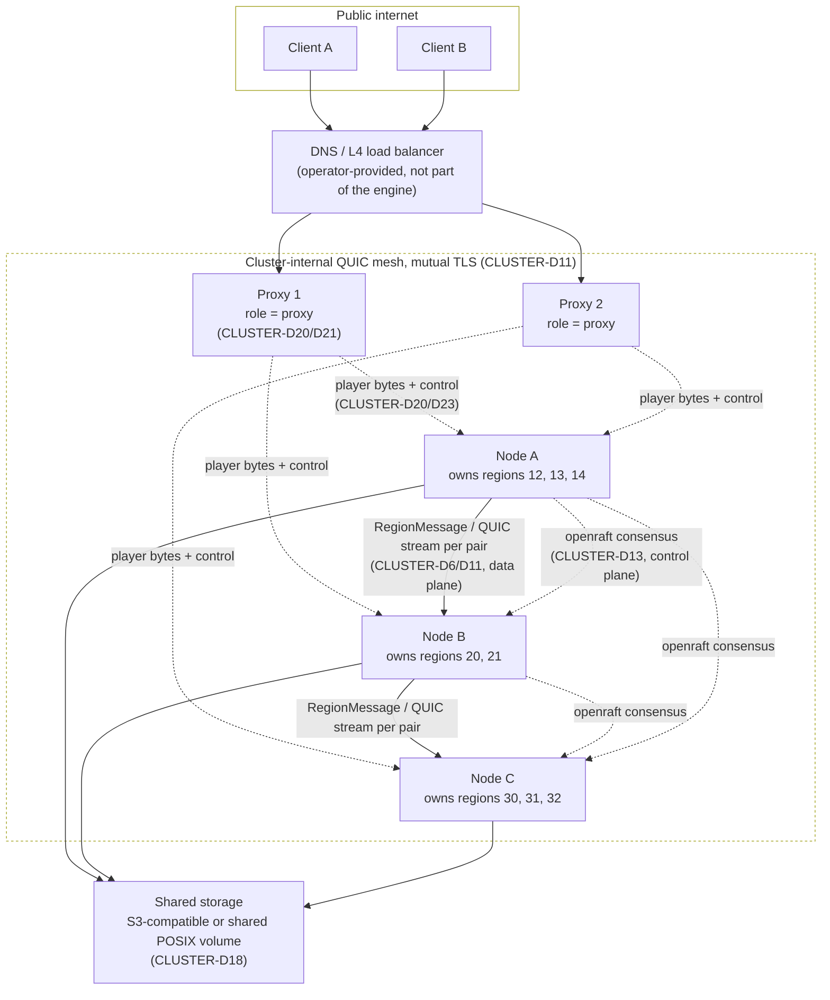
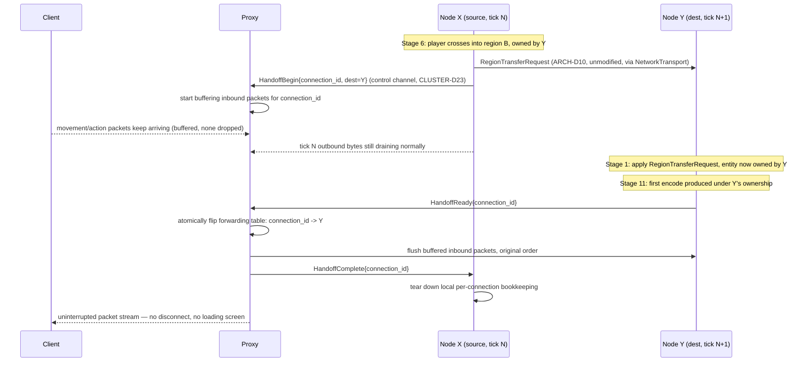

# Cluster Architecture

## Purpose

Defines CLUSTER mode: multiple dedicated Rusty Clanker node processes computing one shared world via spatial partitioning, the intelligent proxy router that terminates player connections and routes them to the owning node, and the seamless cross-node player handoff protocol. Extends `01-server-architecture.md`'s `Transport` trait, addressing scheme, and message envelope with a network-backed implementation (`NetworkTransport`) and a `RegionId -> NodeId` directory hop; does not alter their signatures.

## Scope

**In scope:** the `RegionId -> NodeId` assignment and its rebalancing/migration policy; cross-node chunk/entity ownership authority and border reconciliation (extending `01`'s `ARCH-D11` halo mechanism across node boundaries); `NetworkTransport`'s transport (QUIC), wire serialization, node discovery/membership, coordination/metadata store, health/failure detection, and node-failure takeover/durability model; the proxy router (connection termination, encryption/session-validation placement, packet routing, horizontal scaling); the precise player-handoff protocol (state serialization, operation ordering across old node/new node/proxy, in-flight packet handling, timing budget); cluster-mode tick-synchronization philosophy; cluster-mode persistence ownership (shared storage requirement) and split-brain protection; monolithic↔cluster binary/config symmetry; cluster observability requirements.

**Out of scope:** the in-process message substrate itself — addressing types, envelope, `Transport` trait, `InProcessTransport`, allocation strategy, base delivery guarantees (all owned unmodified by `01-server-architecture.md`, ARCH-D24–D30); client-facing packet formats, framing, compression, encryption algorithm choice, and the online-mode session-validation *algorithm* (owned by `02-protocol-networking.md`; this document only decides *where in the cluster topology* NET-D6 executes); chunk data layout, palette format, and on-disk region-file format (owned by `03-world-chunks-persistence.md`; this document only imposes a shared-reachability requirement on whatever storage backend `03` defines); world generation and game-mechanics business logic.

## Decisions

| ID | Decision | Rationale |
|---|---|---|
| CLUSTER-D1 | The cluster's assignable unit of node ownership is exactly the **Region** (`01`, ARCH-D5/D6) — no separate cluster-specific partitioning scheme exists. The `ChunkKey -> RegionId` / `RcEntityId -> RegionId` directories (ARCH-D24) gain one additional hop, `RegionId -> NodeId`, stored and replicated as described in CLUSTER-D13. | Reusing the existing partition unit means cluster mode adds exactly one lookup hop to an addressing scheme `01` already made location-transparent by design (ARCH-D24's rationale) — no new spatial data structure, no dual bookkeeping. |
| CLUSTER-D2 | Node-level rebalancing is **dynamic and load-driven**, not a static grid assignment: every 30 s, the raft leader (CLUSTER-D13) evaluates each node's aggregate load (sum of its owned regions' ARCH-D19 tick-duration EWMAs) and reassigns individual regions from the most-loaded to the least-loaded node using a least-loaded-node placement strategy, hysteresis-gated (a reassignment is proposed only if the load delta between busiest and quietest node exceeds 40% of cluster mean for 3 consecutive evaluation windows, 90 s). | 30 s / 3-window hysteresis is deliberately an order of magnitude coarser than ARCH-D6's 5 s/2 s intra-node windows, because a cross-node region migration costs a full ECS-`World`-slice serialize + shared-storage flush + remote bootstrap (CLUSTER-D16's takeover path, reused for planned migration), not the near-free in-process cell reassignment ARCH-D6 performs; thrashing at this cost tier would be far more damaging. Least-loaded placement mirrors Akka Cluster Sharding's default `LeastShardAllocationStrategy` (verified against current Akka docs), a validated pattern for exactly this "which node gets the next unit of work" decision. |
| CLUSTER-D3 | A region above a configurable **migratability ceiling** (default: entity count > 4,096 or serialized `World`-slice size > 64 MiB) is never chosen as a cross-node rebalancing candidate directly. If such a region is also hot, the rebalancer instead requests an ordinary ARCH-D6 split first (on its current node, at near-zero cost) and re-evaluates the resulting smaller regions for migration on the next window. | Keeps the expensive cross-node migration path (CLUSTER-D16) bounded in cost by construction, and reuses ARCH-D6's already-proven splitting mechanism rather than inventing a second one — a region too large to migrate cheaply is, by definition, also a good ARCH-D6 split candidate. |
| CLUSTER-D4 | **No colocation constraints exist beyond region atomicity** (a region is always wholly owned by exactly one node; ownership is never split mid-tick). Because ARCH-D24's addressing is already location-transparent, portal pairs, ender-pearl/projectile flight, and any other long-range cross-region interaction are ordinary `RegionTransferRequest`/`BorderUpdateEvent` traffic (ARCH-D10/D11) regardless of whether the crossing happens to be intra-node or inter-node — no special-casing is needed or added here. **Confirmed by `05-game-mechanics.md`'s Interfaces section:** no mechanic defines a colocation invariant beyond ordinary region atomicity, with the sole caveat that MECH-D14 declines cross-border block-ownership *transfer* for piston-pushed blocks specifically (a scope limitation self-healing via CLUSTER-D8, not a colocation requirement). | This is a direct payoff of `01`'s interface-first design: a boundary that was already made abstract at the region level requires zero additional cluster-specific plumbing. `05`'s confirmation closes what was this decision's one open question. |
| CLUSTER-D5 | The raft-committed `RegionId -> NodeId` table (CLUSTER-D13) is the **sole cluster-wide source of truth** for region ownership. A node may tick a region's `World` only while holding a currently-valid epoch-fenced lease for it (CLUSTER-D19); the proxy (CLUSTER-D20/D21) and every node route exclusively by the current raft-committed value, never by a locally cached belief about "who owns what" once that cache is known stale. | Single-writer enforcement must have exactly one arbiter or it is not enforced at all; raft's single-leader property (verified: `openraft`, CLUSTER-D13) is the textbook mechanism for that arbiter, and it is the same authority CLUSTER-D9's mid-migration message routing and CLUSTER-D16's failure takeover both key off — one fact, one owner. |
| CLUSTER-D6 | The ARCH-D11 border-halo mechanism (read-only mirror of a full 16-block, one-chunk slice of a neighbor region's bordering chunks — widened from an original outermost-row design to cover wide-radius reads like MECH-D18's explosion-resistance lookups; `BorderUpdateEvent` applied at the neighbor's next Stage 4) is reused **unmodified** across a node boundary. The only change cluster mode introduces is that `BorderUpdateEvent` now travels over `NetworkTransport` (CLUSTER-D11) instead of `InProcessTransport` — the payload type, application point, and self-heal-via-merge intent are identical to the intra-node case. | `01` already built ARCH-D11 as a message-substrate consumer specifically so a future network `Transport` impl would not require new domain logic — honoring that is the entire point of the trait boundary (ARCH-D26's rationale). Reusing the same widened halo depth unmodified (rather than re-narrowing it for cluster mode) keeps this document's promise that cluster-mode behavior is observationally identical to monolithic-mode behavior. |
| CLUSTER-D7 | **Cross-node latency budget** (resolves `01`'s flagged "Needs from `13`" item): `NetworkTransport` must deliver `RegionTransferRequest` and `BorderUpdateEvent` traffic at p99 one-way latency ≤ 30 ms between any two nodes that own adjacent regions, leaving headroom inside ARCH-D10/D11's 50 ms (one-tick) assumption without requiring either threshold to be revised. This is a **deployment topology requirement**, not a protocol guarantee this document can manufacture: cluster nodes serving one world must be co-located in the same datacenter/availability zone or connected by an equivalent low-latency backbone (reference figure: same-AZ round-trip is typically <2 ms; cross-region-of-a-continent commonly exceeds 30 ms one-way and is explicitly **not** a supported topology for one world's node set under this budget). Under a topology violation, ARCH-D11 traffic degrades gracefully to N-tick propagation lag (see CLUSTER-D8) — it never corrupts state, because ARCH-D29's per-pair exactly-once/FIFO guarantee (upheld by CLUSTER-D11's stream mapping) is independent of latency. | Resolving this was explicitly handed to this document by `01`'s Interfaces section rather than left ambiguous; pinning it as a *topology* requirement (not a threshold rewrite) keeps `01`'s already-calibrated ARCH-D10/D11 numbers untouched, which is the lower-risk resolution given those numbers are load-test-calibration targets, not values this document has grounds to second-guess. |
| CLUSTER-D8 | A cross-node region-border pair sustaining `BorderUpdateEvent` traffic above ARCH-D11's own `>10 events/tick average over 40 ticks` merge-trigger threshold — which cannot literally merge across a node boundary — instead triggers a **co-location migration**: the rebalancer (CLUSTER-D2) moves the quieter of the two regions onto the same node as its hot neighbor, out of band from the normal 30 s window. Once co-located, ARCH-D11's existing same-node merge policy applies unmodified and collapses the circuit to zero cross-boundary latency. | Extends ARCH-D11's self-healing intent ("any circuit hot enough to matter" — `01`'s own wording) to the cluster case using a mechanism (CLUSTER-D2's rebalancer) this document already defines, rather than inventing a second hot-border policy. |
| CLUSTER-D9 | **Mid-migration message routing** (resolves `01`'s other flagged "Needs from `13`" item): when a `Message<RegionMessage>` is emitted for a destination `RegionId` whose owning `NodeId` changes between the sender's directory read and delivery, `NetworkTransport` resolves this **entirely internally** — it holds its own soft cache of the raft-committed directory (CLUSTER-D5), refreshed on every raft directory-change notification and on any routing failure signal from a peer; a stale-routed message is transparently redialed to the newly-committed node within the same tick if possible, or surfaces the existing `TransportError::Backpressure` (ARCH-D29's already-defined retry-next-tick signal) if not. **No change is made to the `Transport` trait signature or to `TransportError`'s existing variants** — this is an internal `NetworkTransport` implementation detail, per the task boundary that `01`'s envelope/trait are extended only with new `RegionMessage` variants, never modified. | Keeps the ARCH-D26 trait boundary exactly as `01` fixed it; all cluster-specific complexity (directory staleness, redial, partial-tick-window races) is absorbed on the sending side of one already-abstract interface rather than leaking into a trait signature every call site depends on. |
| CLUSTER-D10 | Cluster-mode entity handoff **reuses ARCH-D10's `RegionTransferRequest` mechanism completely unmodified** for the entity/ECS-state half of a cross-node player (or any entity) crossing — same message variant, same Stage-6-emit/Stage-10-flush/Stage-1-apply timing, same `RcEntityId -> RegionId` directory update. No new entity-transfer message type exists. The only genuinely new mechanism cluster mode adds is the player-*connection* handoff (CLUSTER-D22), which is a proxy/network-routing concern layered on top, not a replacement for ARCH-D10. | `01` designed ARCH-D10 specifically so its whole entity-transfer contract need not change when the destination becomes cross-node (ARCH-D24's rationale, verbatim); this decision is the direct fulfillment of that design intent, and keeping it unmodified is what lets CLUSTER-D22's handoff protocol treat the ECS-state transfer as an already-solved sub-problem. |
| CLUSTER-D11 | **Transport: QUIC via the `quinn` crate, version 0.11.11** (crates.io, published 2026-06-22, MSRV Rust 1.85; verified current as of this writing), rustls backend, one persistent multiplexed QUIC connection per (node, node) pair and per (proxy, node) pair — never per player. Every ordered `(from: RegionId \| ConnectionId, to: Address)` pair that ARCH-D29 requires FIFO/exactly-once for is mapped to its **own QUIC stream** within that shared connection, opened lazily on first message and closed on region merge/split/migration. Connections are mutually authenticated via TLS 1.3 client+server certs issued by one operator-supplied cluster-internal CA (config-provided cert/key paths; distribution/rotation mechanics are an operational concern, not specified further here). | QUIC stream semantics (reliable, ordered per-stream, no head-of-line blocking *across* unrelated streams on the same connection) give ARCH-D29's exact "FIFO/exactly-once per `(from, to)` pair, no ordering guarantee across different pairs" contract **natively**, for free, with zero hand-rolled sequence-number/reorder-buffer logic — a plain TCP link would force one global order across all region pairs sharing a node link (reintroducing exactly the head-of-line blocking ARCH-D29 was written to avoid), and raw UDP would require reimplementing reliability QUIC already provides. QUIC's built-in TLS 1.3 also removes the need for a second encryption layer on the internal link (see CLUSTER-D20). A cluster's realistic region-pair count per node-link (tens to low hundreds even at a hot border) is well within QUIC's supported concurrent-stream range. |
| CLUSTER-D12 | **Wire serialization: `postcard` 1.1.3** (crates.io, published 2025-07-24, stable documented wire format since 1.0; verified current as of this writing) for every `Message<RegionMessage>` value crossing `NetworkTransport`. Every `RegionMessage` variant (including this document's cluster-only additions, CLUSTER-D23) already derives `serde::Serialize`/`Deserialize` per ARCH-D25 — `postcard` consumes those derives directly with zero additional derive burden and no modification to `01`'s types. | `postcard`'s compact varint-based encoding suits the common case (small, frequent `BorderUpdateEvent` payloads) well, and reusing the existing `serde` derives (rather than adopting a zero-copy framework like `rkyv`, which would require adding a *second*, `rkyv`-specific set of derives to every type ARCH-D25 already fixed) is the only choice that respects the "extend with new variants, don't modify the envelope" boundary this document was given. |
| CLUSTER-D13 | **Coordination/metadata store: embedded `openraft` 0.9.25** (crates.io, published 2026-07-28 — the last release on the `release-0.9` branch, which accepts bug fixes only and has a frozen API surface; the `0.10.0-alpha.34` line, published 2026-08-14, remains pre-stabilization and is explicitly not adopted yet, see Open Questions), compiled directly into the same engine binary (feature-gated, CLUSTER-D26), backed by `redb` 4.2.0 (crates.io, published 2026-08-17; pure-Rust embedded ACID key-value store, no C-FFI) for local raft-log and state-machine persistence on each node. The raft log's state machine holds **only small, low-churn control-plane metadata**: the `RegionId -> NodeId` table, cluster node membership, and partition-boundary bookkeeping — updated only at rebalance/migration/failure events (seconds-to-minutes cadence). It **never** carries per-tick simulation data, chunk contents, or entity state — that is exclusively `NetworkTransport`/QUIC data-plane traffic (CLUSTER-D11), which never touches raft consensus latency. **No external coordination service (etcd, Consul, ZooKeeper) is used.** | Directly weighs "built-in raft vs. external dependency" against the project's simple-deployment promise, per this document's task brief, and comes down decisively on embedded: an external etcd/Consul/ZooKeeper cluster would force an operator to deploy and operate a *second* distributed system just to run CLUSTER mode, breaking the same-binary, single-container symmetry `01`'s vision and this document's CLUSTER-D26/D27 establish. The control-plane/data-plane split mirrors Kubernetes' etcd-for-control-plane/CNI-for-data-plane separation and Akka Cluster Sharding's cluster-singleton `ShardCoordinator` vs. direct actor messaging split (both verified as established patterns) — raft governs a workload orders of magnitude smaller and lower-frequency than what it would need to if it also carried simulation traffic, which is exactly the workload `openraft` is validated for in production (Databend's meta-service cluster, verified). `redb`'s pure-Rust, no-C-FFI profile matches the same "memory-safe Rust core" bar `01`'s ARCH-D1 already set for the ECS choice. |
| CLUSTER-D14 | **Node discovery/bootstrap:** cluster config carries a static `seeds` list of peer addresses (CLUSTER-D27). A joining node contacts a seed; if that seed's raft cluster already has a leader, the join is proposed as an `openraft` joint-consensus membership change. The very first node of a brand-new cluster is started with `bootstrap = true` (used exactly once, self-votes into a single-member raft cluster) and is never set on any subsequent node. | `openraft`'s native joint-consensus membership-change support removes any need for a separate discovery/gossip protocol (e.g. SWIM) at the cluster sizes this project targets (tens of nodes serving one world, not thousands) — one mechanism serves both consensus and membership. |
| CLUSTER-D15 | **Health/failure detection** is raft's own leader-driven heartbeat (`AppendEntries`) and election-timeout mechanism — no separate gossip/phi-accrual/SWIM layer is added. A node that misses heartbeats past the election timeout is treated as failed by the raft leader, which is the trigger for CLUSTER-D16's takeover. | Adding a second failure-detection system on top of one raft already provides would be redundant complexity at the cluster sizes this project targets; Akka Cluster's own architecture (verified: coordinator-driven handoff notification, not a separate detector for shard-coordinator purposes) supports leader-heartbeat-only detection as sufficient at comparable scales. |
| CLUSTER-D16 | **Node failure takeover:** on raft-detected node failure, the leader proposes and commits reassignment of the failed node's owned regions to other live nodes (CLUSTER-D2's least-loaded strategy, invoked immediately rather than waiting for the next 30 s window). Each newly-assigned node loads its new region(s) from the last durably-persisted snapshot on **shared storage** (CLUSTER-D18) — never from the dead node's memory, which is gone — and begins ticking once its epoch-fenced lease (CLUSTER-D19) is granted. | This is the direct consequence of CLUSTER-D18's shared-storage requirement: takeover is possible at all only because region state lives somewhere every node can reach, not on the failed node's local disk. |
| CLUSTER-D17 | **Durability model:** cluster mode's acceptable data-loss window on node failure is bounded by **time since that region's last successful persisted save**, not by any stronger guarantee — resolving `01`'s ARCH-D29 deferred call ("any cluster-mode guarantee across node restarts is `13`'s call"). `NetworkTransport` provides ARCH-D29's exactly-once/FIFO guarantee only while both endpoints remain alive; an in-flight `Message<RegionMessage>` (e.g. a `RegionTransferRequest` mid-network-transit) whose source or destination node hard-crashes is lost with **no cross-restart delivery guarantee** — recoverable only up to whatever was last persisted. Cluster deployments should configure a materially tighter save interval than a single-box monolithic deployment's default (recommended ≤ 30 s per dirty region in cluster mode, vs. vanilla's own 5-minute/6000-tick baseline), because node failure is a realistically more frequent event across N machines than on one box. | Synchronously replicating every `RegionMessage` for crash-durability would reintroduce exactly the cross-node latency tax this whole architecture exists to avoid (the same reasoning ARCH-D28 used to reject a design that added per-message overhead to the hot path); bounding data loss by persistence cadence instead is the same trade-off a vanilla server's own crash-recovery story already makes, just with a tighter interval justified by cluster mode's larger failure surface. The exact interval and per-region dirty-tracking mechanism are `03-world-chunks-persistence.md`'s to implement; this document only sets the requirement (flagged as Needs-from-`03`). |
| CLUSTER-D18 | **Persistence ownership:** in cluster mode, the current owning node is the **sole writer** for its regions' chunk data (single-writer-per-partition, consistent with CLUSTER-D5), but writes must land on a **shared storage backend reachable by every node** — an S3-compatible object store (e.g. AWS S3, Cloudflare R2, Backblaze B2, or a self-hosted MinIO instance) or an equivalent shared POSIX volume (NFS or similar) — never node-local disk. Monolithic mode is unaffected and keeps local disk. The concrete storage-backend trait/abstraction is `03-world-chunks-persistence.md`'s to define; this document imposes only the shared-reachability and single-writer requirements as a contract `03` must satisfy for cluster mode to function. | Local-disk persistence would make CLUSTER-D16's takeover impossible (a new owner cannot read a dead node's local filesystem), so shared reachability is a hard cluster-mode requirement, not a preference; keeping single-writer semantics (rather than allowing any node to write) avoids needing storage-layer write conflict resolution on top of raft's already-authoritative ownership table. |
| CLUSTER-D19 | **Split-brain protection:** raft's single-leader property (verified property of the Raft algorithm and `openraft`'s implementation) guarantees the `RegionId -> NodeId` table itself never has two simultaneously-committed conflicting values. The residual risk — a "zombie" old owner that has not yet noticed it lost ownership (GC pause, transient network partition) continuing to act — is closed with an **epoch/lease fencing token**: every raft-committed ownership entry carries a monotonic epoch number; a node may write to shared storage (CLUSTER-D18) or be routed to by the proxy (CLUSTER-D20) only while presenting the current epoch, and the storage backend rejects a write tagged with a stale epoch via a conditional-write check. | This is the standard Raft-leader-lease/fencing-token pattern for closing the "network partition, not process death" split-brain gap that leader election alone does not close (a well-established distributed-systems pattern, e.g. Chubby/ZooKeeper fencing tokens) — necessary because CLUSTER-D16's takeover must be safe even when the old owner is merely unreachable-but-alive, not provably dead. |
| CLUSTER-D20 | The proxy is the **sole place `02-protocol-networking.md`'s NET-D6 (encryption handshake + Mojang online-mode session validation) executes** in cluster mode — backend nodes never see a raw client socket, never perform the RSA/AES handshake, and never call Mojang's session server themselves. The internal proxy↔node link carries plaintext application data over QUIC's own TLS 1.3 transport encryption (CLUSTER-D11) plus a signed forwarded-player-identity envelope (validated username/UUID/skin properties, established once at the proxy) that a node trusts without re-validating — the same "modern forwarding" shape Velocity uses for its own trusted backend links (verified current architecture). Monolithic mode is unaffected: a directly-connected client still performs NET-D6 exactly as `02` defines it, unchanged, since no proxy exists in that mode. | Terminating encryption once, at the single component that owns the client's persistent TCP/UDP-facing session, is what makes CLUSTER-D22's zero-disconnect handoff possible at all — if each node independently re-ran NET-D6 per connection, a handoff would require a full reconnect/re-handshake, defeating the seamlessness requirement. Double-encrypting the internal link (Mojang AES/CFB8 *and* QUIC's TLS) would be pure overhead with no additional security benefit once the internal network is already mutually authenticated (CLUSTER-D11). |
| CLUSTER-D21 | The proxy is **the same engine binary** as a node, selected by `role = "proxy"` in cluster config (CLUSTER-D27) — not a separate crate or executable. It is horizontally scalable: any number of proxy instances may run behind an operator-provided DNS/L4 load balancer, each independently subscribing to the same raft-committed directory (CLUSTER-D5) via a lightweight watch stream to any live node, so proxies coordinate with each other through **no additional mechanism** — no Redis, no separate proxy-sync service. A proxy instance is otherwise stateless aside from its soft-cached directory copy and any connections currently mid-handoff (CLUSTER-D22). | Explicitly avoids the pattern both surveyed prior art projects use for multi-proxy state sync — Velocity's own ecosystem recommends RedisBungee for cross-proxy player-list/routing sync (verified), and Mammoth's architecture depends on a separate Redis instance for inter-server coordination alongside its PostgreSQL-backed WorldQL store (verified) — because this project already has one coordination substrate (CLUSTER-D13) and introducing a second one for proxies alone would be redundant infrastructure contradicting the "zero user-facing complexity" / single-binary promise. "Same binary, role flag" is required by CLUSTER-D26/D27's symmetry decision. |
| CLUSTER-D22 | **Handoff protocol**, precise operation order (see the Handoff Sequence diagram below), triggered when ARCH-D10's Stage-6 cross-region-transfer detection resolves a destination `RegionId` whose owning `NodeId` (per the live directory) differs from the source node's own: (1) Tick N, source Node X Stage 10: emits the entity's `RegionTransferRequest` via the ordinary ARCH-D10/CLUSTER-D10 path (unchanged), **and** sends `HandoffBegin{connection_id, dest_node, dest_region, tick_stamp}` to the proxy over the dedicated control channel (CLUSTER-D23); X's per-connection outbound channel keeps draining tick N's already-encoded Stage-11 bytes normally. (2) Proxy, on `HandoffBegin`: begins **buffering** (never dropping) new inbound packets from that client rather than forwarding them to X, and opens/reuses its QUIC path to Node Y; the client's TCP/encryption session (CLUSTER-D20) is never touched. (3) Tick N+1, Node Y Stage 1: applies the `RegionTransferRequest` exactly as ARCH-D10 specifies; Y's Stage 10 sends `HandoffReady{connection_id}` to the proxy once Y's Stage-11 encode has produced this player's first packet batch under Y's ownership (guaranteeing something is ready to send before the switch). (4) Proxy, on `HandoffReady`: atomically flips its forwarding-table entry for `connection_id` from X to Y, flushes the buffered inbound packets to Y in original receipt order, and sends `HandoffComplete{connection_id}` to X. (5) Node X, on `HandoffComplete`: tears down its local per-connection bookkeeping (the entity itself is already gone from X's `World` as of tick N's ARCH-D9 sync point). **Timing budget:** ≤ 2 ticks (100 ms) end-to-end from crossing detection to proxy switch-over in the common case (co-located nodes, CLUSTER-D7's latency budget); no packet is ever dropped on either side during the window. | This sequences directly off two mechanisms this document already established as unmodified (ARCH-D10's entity transfer, CLUSTER-D11's per-pair QUIC ordering) plus one new, narrowly-scoped control protocol (CLUSTER-D23) — buffering rather than dropping inbound packets during the switch is the same pattern Akka Cluster Sharding uses for shard handoff (`ShardRegion` buffers incoming messages for a shard mid-handoff rather than failing them, verified against current Akka docs), and is what makes "zero disconnect, zero loading screen" a real guarantee rather than a best-effort one: the client-visible socket never closes, and no input is ever silently discarded, only delayed by at most two ticks — within vanilla's own normal input-lag envelope. |
| CLUSTER-D23 | The proxy↔node **control channel** (`HandoffBegin`/`HandoffReady`/`HandoffComplete`, plus CLUSTER-D5's directory-watch subscription) is a **separate protocol from the `RegionMessage` substrate entirely** — it is not wrapped in `Message<RegionMessage>`, not addressed via ARCH-D25's `Address` enum (which has no "proxy" variant and is not extended with one), and does not flow through `RegionMessageBus`. It rides its own dedicated QUIC stream per active connection within the same proxy↔node QUIC connection CLUSTER-D11 already opens. | `01` scoped the `RegionMessage` substrate exclusively to region↔region simulation traffic ("the message substrate exists exclusively for communication across partition ownership boundaries" — `01`'s own text); proxy↔node control traffic is a control-plane concern between a fundamentally different pair of roles (connection-routing vs. world-simulation), so giving it a separate, purpose-built channel respects that scoping instead of overloading `01`'s envelope with a use case it was never designed for. |
| CLUSTER-D24 | **Handoff pre-warming (binding optimization):** a node proactively opens (but does not use) its QUIC control-channel path to each spatially-neighboring node for every player within 2 chunks of that neighbor's region boundary, before any crossing occurs. | Removes QUIC connection/stream setup latency from the handoff's critical path entirely for the common case (a player walking toward a border), keeping the realized handoff time close to the network-RTT floor rather than the RTT-plus-connection-setup ceiling; cheap because QUIC streams are lightweight and this only pre-opens paths already known to exist between adjacent-region node pairs. |
| CLUSTER-D25 | **Tick synchronization: fully independent per region, across nodes exactly as across regions on one node** — there is no cluster-wide lockstep barrier and no global logical clock. ARCH-D25's envelope `tick_stamp` field remains region-local (each region's own monotonic tick counter), unchanged by cluster mode. Wall-clock phase alignment across nodes (recommended: NTP/chrony, standard OS-level service) is an **operational recommendation, not a protocol-level guarantee** — it bounds the worst case of CLUSTER-D7's graceful-degradation latency contribution from tick-phase misalignment between two neighboring regions, but no region's correctness depends on any other region's (same-node or cross-node) phase. | Directly extends ARCH-D7's "only a region that cannot keep up degrades its own TPS" principle to cluster scale — introducing a cluster-wide tick barrier would reintroduce, at cluster scale, precisely the single-slowest-component-stalls-everyone problem this entire project's region-threading design exists to eliminate at single-node scale. Vanilla itself has no cross-region ordering concept to preserve beyond what ARCH-D11 already defines (`01`'s own rationale for ARCH-D11, reaffirmed here), so no stronger cross-node guarantee is needed. |
| CLUSTER-D26 | **Compilation/activation split:** the message-passing substrate (addressing, envelope, `Transport` trait, `InProcessTransport`) stays exactly as `01` fixed it — always compiled in, unconditionally. `NetworkTransport`, `openraft`/`redb` integration, `quinn`/QUIC, and the proxy role's code path are gated behind a Cargo feature (`cluster`), **on by default in the officially distributed binary** (so "one binary for everyone" holds), but a from-source minimal build may disable the feature to strip the dependency/attack-surface footprint entirely. At runtime, the choice of which `Transport` impl is wired behind `dyn Transport` (ARCH-D26's `TransportFactory`, whose selection rule `01` left to this document) is decided purely by **config presence**: no `[cluster]` section (or no config file at all) selects `InProcessTransport`; a present `[cluster]` section selects `NetworkTransport`. | This is the concrete mechanism realizing the project vision's "dual operation mode... zero user-facing complexity": the *capability* to run in cluster mode ships in every official binary (matching "the same engine binary serves both modes" verbatim), but nothing about it activates, executes, or adds attack surface unless an operator deliberately writes cluster config — monolithic hosting remains exactly as simple as `01` designed it to be. |
| CLUSTER-D27 | **Configuration surface:** monolithic mode is the **zero-config default** — absence of a `[cluster]` table (or absence of any config file) is sufficient; nothing else is required, preserving the single-Docker-container deployment story unchanged. Cluster mode's config shape (TOML, matching `02`'s NET-D9 RON/TOML precedent for structured config): `[cluster]` `role = "node"  # "node" \| "proxy"` `node_id = "node-a"  # stable identity, persisted across restarts` `bind = "0.0.0.0:7777"  # QUIC listen address for inter-node/proxy traffic` `bootstrap = false  # true only on the very first node of a brand-new cluster` `seeds = ["node-b.internal:7777", "node-c.internal:7777"]` `shared_storage = "s3://bucket/world-a/"  # or an nfs:// / equivalent shared-volume URI` `ca_cert = "/etc/rustyclanker/cluster-ca.pem"` | One flat, explicit table keeps the config surface legible and matches the "current-state, no hidden modes" documentation discipline this project already applies to its docs; every field maps directly to a decision fixed elsewhere in this document (`role`→CLUSTER-D21, `bootstrap`/`seeds`→CLUSTER-D14, `shared_storage`→CLUSTER-D18, `ca_cert`→CLUSTER-D11/D20). |
| CLUSTER-D28 | **Observability:** the `tracing` crate ecosystem (already the implied Rust-standard choice given the project's async/sync-boundary design in `01`) with OpenTelemetry OTLP export; **no observability backend is bundled** into the engine or its container image — operators point their own OTLP-compatible collector (Prometheus/Grafana, or any other OTLP consumer) at each node/proxy, preserving simple-deployment symmetry. Required metrics, minimum: per-node per-region tick-duration histograms (reusing ARCH-D19's EWMA feed as the underlying signal); message-latency histograms per `(from_node, to_node)` pair tagged by `RegionMessage` variant; handoff count/duration/failure-rate counters (CLUSTER-D22); raft leader/term/commit-index gauges (CLUSTER-D13); QUIC connection/stream-count and retransmission-rate gauges (CLUSTER-D11); proxy inbound-buffer-depth-during-handoff histogram (CLUSTER-D22 step 2). Distributed-trace correlation reuses ARCH-D25's existing envelope tuple `(from, to, tick_stamp, seq)` as the trace-context correlation key — no new field is added to the envelope. | Not bundling a backend is the same "bring your own infrastructure, we only emit the standard interface" stance CLUSTER-D13 already takes toward coordination — consistent, and keeps the container image lean. Reusing the existing envelope tuple as a correlation ID (rather than adding a trace-id field) again respects the "extend with new variants, don't modify the envelope" constraint this document operates under everywhere else. |

## Reference Deployment Topology

Monolithic-mode deployment is unchanged from `01`'s vision statement: one container, no `[cluster]` config, `InProcessTransport` selected automatically (CLUSTER-D26), no proxy, no raft, no shared-storage requirement.

## Handoff Sequence

## Interfaces

**Provides to `01-server-architecture.md`:**
- `NetworkTransport`, implementing ARCH-D26's `Transport` trait signature unmodified, satisfying ARCH-D29's minimum delivery/ordering guarantee by construction (CLUSTER-D11's per-pair QUIC stream mapping) rather than by additional bookkeeping.
- Resolution of both items `01` flagged as "Needs from `13`": the cross-node latency budget as a deployment-topology requirement rather than a threshold rewrite (CLUSTER-D7), and the mid-migration in-flight-message policy absorbed entirely inside `NetworkTransport` with zero trait/envelope change (CLUSTER-D9).
- The `RegionId -> NodeId` hop and its owning coordination mechanism (CLUSTER-D1, D5, D13), which is the concrete mapping ARCH-D24 reserved for this document.
- Cluster-only `RegionMessage` payload variants are not introduced by this document's core handoff path (CLUSTER-D10 deliberately reuses `RegionTransferRequest`/`BorderUpdateEvent` unmodified); if a future revision needs one, it is added as a new variant only, per ARCH-D25's stated extension point.

**Provides to `02-protocol-networking.md`:**
- The cluster-mode placement of NET-D6 (encryption + online-mode session validation): executes exactly once, at the proxy, never per-node (CLUSTER-D20). Monolithic mode is confirmed unaffected — NET-D6 runs exactly as `02` already specifies.
- Confirmation that NET-D4's `Transfer` packet / `Play -> Configuration` reconfigure machinery is **not** used for intra-cluster region-boundary crossings (those are invisible to the client entirely, per CLUSTER-D22); NET-D4's `Transfer` remains available for the proxy to redirect a client to a different cluster or service outside this one world.

**Needs from `02-protocol-networking.md`:** the exact shape of the forwarded-identity envelope the proxy hands to a node post-validation (username/UUID/skin-property serialization) — CLUSTER-D20 assumes such data exists from NET-D6's join flow but its wire representation is `02`'s to specify.

**Provides to `15-crossplay.md`:** confirmation that CLUSTER-D20's proxy-side connection-termination pattern and CLUSTER-D22's handoff protocol both extend to Bedrock connections unmodified (CROSS-D3/D14) — RakNet/auth termination joins NET-D6 at the proxy; the forwarded-player-identity envelope (CLUSTER-D20) gains `edition`/`xuid`/derived-UUID/`display_name` fields; the handoff sequence needs no Bedrock-specific branch since it only ever forwards opaque bytes.

**Provides/receives from `03-world-chunks-persistence.md`:** resolved — `03` supplies exactly the three items this document needed. The storage-backend abstraction (CLUSTER-D18's requirement for a shared, network-reachable implementation) is `03`'s WORLD-D17 `ChunkStorageBackend` trait, whose `ObjectStoreBackend` implementation (built on `object_store` 0.14.1) covers both the S3-compatible and shared-POSIX shapes in one dependency. The configurable per-region save-interval knob (which CLUSTER-D17 overrides tighter for cluster mode) is `03`'s WORLD-D23 Stage-9 save pipeline's autosave-interval setting. The exact dirty-region tracking mechanism the takeover path (CLUSTER-D16) reads from on load is `03`'s WORLD-D19 `RegionManifest` — whose own rationale confirms it "directly fulfills the exact dirty-region tracking mechanism `13-cluster-architecture.md`'s CLUSTER-D16 takeover path flagged as needed."

**Needs from `05-game-mechanics.md`:** resolved — `05`'s Interfaces section confirms no mechanic defines a hard colocation invariant beyond region atomicity (CLUSTER-D4), with the sole caveat that MECH-D14 declines cross-border block-ownership transfer for piston-pushed blocks specifically (a scope limitation, not a colocation requirement).

**Needs from `08-assets-auth-legal.md`:** none currently — cluster mode introduces no additional Mojang-derived data or asset-handling concern beyond what `02`'s NET-D10 already governs.

**Needs from `14-performance-engineering.md`:** none beyond optional extensions — `14` owns cross-node application-level message-batching tactics beneath `quinn-udp`'s own GSO batching (PERF-D30–D31), extending CLUSTER-D8/D11 without altering them.

## Open Questions

- `openraft`'s `0.10.0-alpha.34` line (pre-stabilization as of this writing) should be re-evaluated for adoption once it reaches a stable `0.10.0` release; CLUSTER-D13 deliberately pins the frozen `0.9.25` line for now.
- CLUSTER-D2/D3's specific numeric thresholds (30 s window, 40%/3-window hysteresis, 4,096-entity/64 MiB migratability ceiling) are seed defaults for the blueprint phase, exactly as `01`'s analogous ARCH-D6/D19 thresholds were — calibration requires a real multi-node load-testing harness, not analysis alone.
- The exact bytes of the proxy↔node control-channel protocol (CLUSTER-D23: `HandoffBegin`/`HandoffReady`/`HandoffComplete` framing, the directory-watch subscription's wire shape) are named and sequenced here but not byte-specified; that belongs to the blueprint phase once `postcard`/`quinn` integration specifics are being implemented.
- Cluster-internal CA certificate issuance, distribution to newly-joining nodes, and rotation policy (CLUSTER-D11/D20's `ca_cert` config field assumes an operator-supplied CA already exists) is deliberately left as an operational/deployment concern, not an engine-level decision, pending a dedicated ops/deployment planning document if one is added later.
- Cross-AZ or cross-region node topologies (violating CLUSTER-D7's ≤30ms p99 assumption) are explicitly unsupported for one world's node set today; whether a future revision should support them via a relaxed-consistency mode for border reconciliation (accepting a wider ARCH-D11 lag deliberately, rather than as an unplanned degradation) is unresolved.
- First-join node resolution — which node a brand-new (never-before-seen) player connection should initially be routed to, before any position/region is known — is sketched in this document's Handoff-adjacent Proxy discussion but its concrete lookup path (last-logout region from persisted player data, falling back to a configured spawn region) depends on `03`/`05` data this document does not yet have visibility into; needs joint resolution once those are written.
- Whether CLUSTER-D28's required-metrics list needs additions once real cluster load-testing surfaces failure modes not yet anticipated here (e.g. raft snapshot/log-compaction pauses under a very large membership-change rate) is left for the blueprint phase.
- MultiPaper (`github.com/MultiPaper/MultiPaper`) and Mammoth/WorldQL (`github.com/WorldQL/mammoth`, now explicitly unmaintained per its own README, which recommends MultiPaper instead) are cluster-relevant prior art this document draws on directly (CLUSTER-D2, D21) but which `10-prior-art.md`'s current scope does not cover (that document is scoped to whole-server reimplementations, not clustering layers) — worth a future entry there if `10` is ever revised, though that revision is outside this document's file scope.
