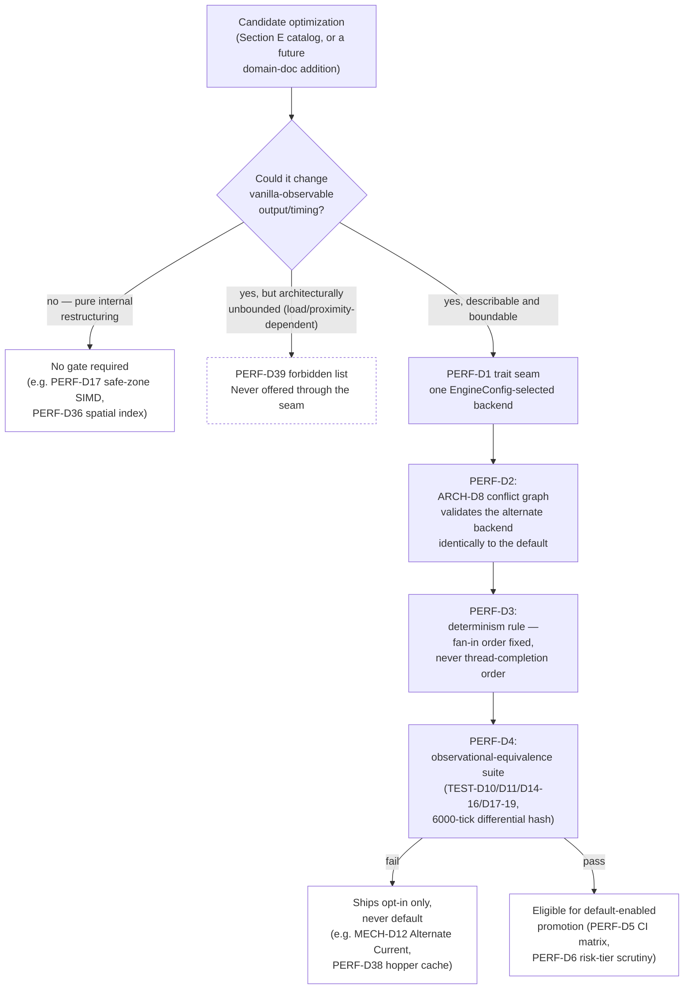
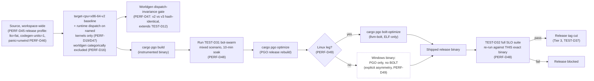

# Performance Engineering

## Purpose

Owns every cross-cutting performance concern that no domain document already decided: the mechanism by which a performance optimization is permitted to change vanilla-observable behavior at all (the parity-gated fast-path framework required by this project's own PARITY RED LINE), general-purpose memory/allocation policy, SIMD and worldgen-compilation policy, network- and disk-I/O syscall-level tactics, a concrete catalog of gated subsystem fast paths (with an explicit forbidden list), client rendering performance depth beyond meshing, the release build pipeline (LTO/PGO/BOLT/dispatch), OS- and deployment-level tuning, concrete numeric budgets and reference hardware, and the continuous performance-verification tooling layered on top of `09-testing-quality.md`'s test infrastructure. Every domain document keeps its own existing performance-adjacent decisions unchanged; this document never restates or renumbers them, only references them by ID and closes the gaps between them.

## Scope

**In scope:** the general trait-seam mechanism and observational-equivalence test gate that CLAUDE.md's PARITY RED LINE requires before any optimized fast path may ship, and the concrete `EngineConfig`/CI surface that mechanism runs on; global allocator selection and arena/pool/fixed-capacity-collection policy for both binaries; SIMD abstraction-crate selection, the positive policy for where SIMD is safe versus forbidden (extending, never relaxing, `04-worldgen-parity.md`'s GEN-D10 bit-identity discipline), and worldgen JIT-compilation policy; network syscall-batching tactics (extending `02-protocol-networking.md`), disk-I/O and `io_uring` tactics (extending `03-world-chunks-persistence.md`), and cross-node message-batching tactics (extending `13-cluster-architecture.md`); a concrete catalog of candidate gated fast paths for server subsystems, each with a stated equivalence risk tier, plus an explicit list of optimizations forbidden outright; client-side rendering performance beyond chunk meshing (SIMD in the mesh-build hot loop, GPU-driven occlusion culling, buffer-mapping strategy, shader-permutation/pipeline-cache policy); the release build profile, target-cpu/runtime-dispatch policy, PGO, and BOLT; Windows/Linux OS-level tuning (timer resolution, thread priority/scheduling class, transparent huge pages) and container/cgroup-aware resource sizing; concrete numeric budgets (per-stage tick time, memory footprint, client frame-time) and reference hardware profiles, including additive SLO entries layered onto `09-testing-quality.md`'s existing SLO table; and the continuous micro-benchmark/profiling tooling that closes the gap between `09-testing-quality.md`'s release-gate-only `criterion` tier and every commit.

**Out of scope:** the ECS core, region/domain parallelism model, tick pipeline, work-stealing scheduler, and message substrate themselves (`01-server-architecture.md` — this document assumes and extends ARCH-D1–D30, never redefines them); the wire protocol, packet codec, and connection lifecycle themselves (`02-protocol-networking.md`); chunk data structures, the light engine, and the Anvil/object-store persistence formats themselves (`03-world-chunks-persistence.md`); worldgen algorithms and the parity acceptance criterion itself (`04-worldgen-parity.md`); concrete gameplay-mechanic algorithms and constants (`05-game-mechanics.md`); the modding API surface and sandboxing model (`06-modding-api.md`); the render graph, meshing algorithm, and asset-interpretation pipelines themselves (`07-client-architecture.md`); the parity-verification methodology, CI tier structure, and SLO ownership (`09-testing-quality.md` — this document adds to, never restructures, that methodology); milestone sequencing (`11-roadmap-milestones.md`); the crate manifest and dependency-graph hard rules themselves (`12-workspace-structure.md` — this document names new dependencies for `12`'s table to absorb, never redefines the graph rules); cluster topology, consensus, and the handoff protocol themselves (`13-cluster-architecture.md`).

## Decisions

### A. Performance Philosophy & Parity-Gated Fast-Path Framework

This section is the doc's centerpiece: it operationalizes CLAUDE.md's binding rule — "optimized fast paths are allowed ONLY behind an observational-equivalence test gate" — into a concrete, reusable mechanism every later fast-path decision in this document (Section E) and every future domain-doc revision builds on. `05-game-mechanics.md`'s MECH-D11/D12 (Alternate Current redstone) is the one fast path that already exists in the corpus; it is the first instance of this framework, not a special case outside it.

| ID | Decision | Rationale |
|---|---|---|
| PERF-D1 | **Fast-path trait seam.** Any optimization whose algorithm could alter vanilla-observable output — block/shape-update count or order, entity/RNG effect sequence, or player-visible timing — is expressed as a second implementation of a subsystem-specific trait (e.g. `RedstoneBackend`, `ScheduledTickStore`, `EntitySpatialIndex`, `HopperCacheBackend`) whose default implementation is the domain document's already-specified reference algorithm. RC-Executor selects exactly one implementation per subsystem from `EngineConfig` at server startup only — never re-selected mid-run, never branched per call site. Backends carrying zero design-level behavioral trade-off (their entire risk is implementation-bug risk, not an intentional deviation — Section E tags each candidate's risk tier accordingly) are still expressed through this same seam; the seam's cost is one enum field and one trait object, paid once at startup. | One flag-plumbing mechanism, reused for every future gated subsystem, avoids each domain reinventing its own ad hoc toggle the way MECH-D12's standalone `fast_redstone: bool` did before this document existed; startup-only selection eliminates an entire class of "flag changed mid-flight" correctness bugs by construction. |
| PERF-D2 | **Backend selection never bypasses the conflict graph.** `01-server-architecture.md`'s ARCH-D8 startup static conflict-graph computation runs against whichever trait object `EngineConfig` installs, so an alternate backend's own `Access<ComponentId>` declarations are validated identically to the default's. A backend that fails the startup conflict check is a hard boot-time error, exactly as for any other system — there is no fast-path exemption from ARCH-D8. | Exempting fast paths from the conflict check would let an optimization silently reintroduce the exact data race ARCH-D8's whole safety argument exists to prevent — the seam (PERF-D1) must sit entirely inside ARCH-D8's model, never route around it. |
| PERF-D3 | **Determinism interaction rule.** Every fast-path backend must satisfy the same cross-worker-count invariance `09-testing-quality.md`'s TEST-D17 requires of the default backend: its emitted sequence of block/entity/RNG effects is independent of which RC-WorkerPool worker performed which sub-computation or the order tasks were stolen from the work-stealing `Injector` (ARCH-D18). Any fan-in/merge step inside a fast-path backend combines partial results in a stable, pre-declared key order (ascending `ChunkKey`, ascending `RcEntityId`, or the default backend's own already-declared tie-break, e.g. `01`'s ARCH-D13 redstone fan-out order) — never thread-completion order, never `HashMap` iteration order. A backend whose correctness would vary with wall-clock latency of a background computation (Section E's PERF-D38(b) is the one candidate this rules out outright) fails this rule categorically and may never be offered through the PERF-D1 seam at all, gated or not. | Stating this once here means no later candidate in Section E has to re-derive it; it is the specific, checkable form TEST-D17's existing guarantee takes for a selection axis (which backend is installed) TEST-D17 did not originally anticipate, and it is the rule that makes "gated" mean something stronger than "flagged as risky." |
| PERF-D4 | **Observational-equivalence promotion suite.** Promoting a subsystem's alternate backend from opt-in to default-enabled requires it to pass the entire existing verification stack `09-testing-quality.md` already defines for that subsystem's default backend, run under the alternate backend — never a separate, narrower suite authored just for the fast path. Concretely: (a) the full applicable slice of TEST-D11's differential scenario corpus plus TEST-D14/D15's `rc-gametest` corpus, same assertion ticks and expected values, no allowlist loosening — TEST-D16's redstone/block-entity requirement is non-negotiable for any candidate touching those domains; (b) TEST-D17–D19's three determinism classes, run specifically against the alternate backend as a fourth selection axis alongside worker-pool-size/region-topology/deployment-mode, not inherited from the default backend's pass; (c) an N-tick differential state-hash run — TEST-D10's canonicalized world-state hash compared tick-by-tick, not only at scenario assertion ticks, between default-backend and alternate-backend runs from an identical seed/action-script, for at least 6000 ticks (one `03`'s WORLD-D23 autosave interval) per scenario, to catch slow-accumulating divergence a sparse assertion-tick sample would miss. A single hash mismatch anywhere in (a)–(c) fails the suite; there is no partial-credit tier. | Reusing the default backend's own full verification stack, rather than authoring a parallel, cheaper suite per fast path, is what keeps "passes the equivalence suite" meaning the same thing as "is actually observationally equivalent" — a narrower suite would let a fast path ship having only proven it "looks fine on a smoke test." |
| PERF-D5 | **CI matrix and runtime-flag surface for gated subsystems.** An `xtask --backend {default,alternate}` parameter threads through `parity-run`/`gametest run`/`worldgen-hash` (`09`'s `xtask` subcommands, TEST-D1). Tier 1 (PR-blocking) stays default-backend-only for unrelated PRs; a path-based CI trigger requires both-backend Tier 1 for any PR touching a gated subsystem's own crate. Tier 2 (nightly) always exercises both backends for every currently-gated subsystem, folded into its existing full-corpus run (TEST-D37). Each gated subsystem's backend selection is exactly one `EngineConfig` field (PERF-D1's enum, e.g. `redstone_backend: RedstoneBackend::{Vanilla, AlternateCurrent}` — this is the concrete shape MECH-D12's standalone `fast_redstone: bool` already instantiates one member of, restated here only as the general pattern, not amended in `05`), settable only at server startup from world/server config, never a live in-game toggle, and logged at boot alongside every other loaded-config summary. `xtask`'s `--backend` flag sets this identical `EngineConfig` field on the launched test-subject process rather than using a second, parallel selection path. | Tying the "run both backends" cost to the tier already budgeted for expensive, broad-corpus runs (TEST-D37 Tier 2) avoids doubling every contributor's PR-blocking wall-clock regardless of what they touched; one selection mechanism used by both operators and the test harness means the harness can never validate a code path an operator cannot actually reach, and vice versa. |
| PERF-D6 | **No fast path may ship without a stated risk tier and a named forbidden-comparison baseline.** Every candidate in Section E's catalog, and every future gated subsystem a domain document adds, must state (a) whether its risk is implementation-bug-dominated (a green PERF-D4 run is expected to be the norm, e.g. PERF-D33's tick-wheel storage swap) or design-deviation-dominated (a green run does not eliminate an intentional, operator-disclosed trade-off, e.g. MECH-D12's Alternate Current), and (b) which of `09`'s existing corpora is the actual acceptance bar — never a vaguer "seems fine in testing" standard. Section E's PERF-D40 forbidden list is the standing negative instance of this same rule: a technique named there may never be introduced through the PERF-D1 seam at all, regardless of how favorably it might test, because its risk is architecturally unbounded (load- or proximity-dependent), not a single describable deviation an operator can be told about. | Distinguishing implementation-risk from design-deviation-risk is what makes "gated" actionable rather than a single vague label applied uniformly — the former is fully closed by a green PERF-D4 run, the latter remains an operator-facing trade-off even after the suite passes, and conflating the two would either over-scrutinize safe storage swaps or under-scrutinize real behavioral trade-offs. |

### B. Memory & Allocation

| ID | Decision | Rationale |
|---|---|---|
| PERF-D7 | **Global allocator: `mimalloc` 0.1.52** (crates.io, published 2026-05-22), set via `#[global_allocator]` independently in both `rusty-clanker-server`'s and `rusty-clanker-client`'s `main.rs` (Rust's global-allocator attribute is binary-scoped, pinned once as `mimalloc.workspace = true` per `12-workspace-structure.md`'s WS-D7 convention). `tikv-jemallocator` is not usable at all — its own binding gates its allocator implementation behind `cfg(not(target_env = "msvc"))`, making it structurally unavailable on the Windows/MSVC target this project ships for. `snmalloc-rs` (crates.io, current) is architecturally interesting — its message-passing design mirrors RC-WorkerPool's own cross-thread allocate-here/free-there pattern — but its Rust binding's real-world adoption is thin next to mimalloc's; it is recorded as the benchmark/fallback candidate to revisit once real M6/M7 throughput data exists (`11-roadmap-milestones.md`), never the default absent that data. | mimalloc is a from-scratch, non-libc allocator with first-class native Windows support (designed specifically to beat Windows' own default allocator) plus strong Linux numbers, the most widely deployed alternative Rust allocator by download count, and its free-list-sharding design fits the work-stealing cross-thread allocate/free pattern ARCH-D28 already reasons about for `RegionTransferRequest` snapshots — the only candidate satisfying "one allocator, both platforms, no per-platform branching." |
| PERF-D8 | **Arena allocation via `bumpalo` 3.20.3** (crates.io, published 2026-05-22) is permitted only for allocations whose entire lifetime is confined to a single synchronous call frame executed by one OS thread within one RC-WorkerPool work item — Stage 6a AI/pathfinding scratch state for one entity batch, Stage 4's single-threaded redstone-pass BFS/neighbor-fanout scratch, a worldgen job's per-chunk noise scratch buffers — never for anything placed into a `CommandQueue` (ARCH-D9), sent through `RegionMessageBus` (ARCH-D24–D30), or stored into a long-lived component. Implementation pattern: a small pool of resettable `Bump` arenas keyed to each RC-WorkerPool worker slot, re-mapped (not destroyed) when ARCH-D19 grows/shrinks the pool, reset via `Bump::reset()` at each work item's completion — never a fresh `Bump` allocated per item. | This generalizes, rather than contradicts, ARCH-D28's own rejection of a per-worker bump arena for cross-region `RegionTransferRequest` messages: that rejection holds specifically because RC-WorkerPool is work-stealing, so the allocating and consuming threads for a cross-region message are not guaranteed to be the same, which a single-threaded-reset arena requires and a lock-free pool does not. The constraint that actually matters is "does the allocation ever need to be read by another thread or survive past this work item" — for genuinely local, single-frame scratch data (the majority of per-tick transient allocation) that constraint is satisfied and bump allocation is a pure O(1)-alloc, O(1)-bulk-reset win. |
| PERF-D9 | **Object/buffer pooling** for packet write-buffers, chunk-snapshot staging buffers, and client mesh vertex/index buffers all reuse ARCH-D28's already-pinned `crossbeam-queue` 0.3.13 lock-free slot-pool pattern — no second pooling crate is introduced. Bounded `ArrayQueue<bytes::BytesMut>` recycles per-connection packet write-buffers (extending NET-D5/NET-D7's framing path) and `03`'s RC-IoPool-side NBT-encode staging buffers (WORLD-D21/D23) once a snapshot has flushed; a `crossbeam-channel` return-path — the same crate CLIENT-D12 already uses for its mesh-completion channel — recycles client vertex/index mesh buffers back to the mesher pool once a completed mesh's GPU upload finishes (CLIENT-D13), instead of allocating a fresh `Vec` on every remesh. | One pooling primitive, already justified once by ARCH-D28, applied uniformly to every other per-tick large-buffer-churn site this document's research identified avoids a second pooling dependency for no added benefit and keeps the discipline consistent with this corpus's established "one crate, one job, shared across the engine" pattern (e.g. `flate2`/`simdnbt` shared between `02` and `03`). |
| PERF-D10 | **Fixed-capacity collection policy**, three crates each with a distinct, non-overlapping role: `smallvec` 1.15.2 (crates.io, 2026-06-11, `union` feature enabled) is the default container for "usually small, occasionally large" hot-path lists — per-chunk block-entity index lists, neighbor/adjacency lists, event queues. `arrayvec` 0.7.8 (crates.io, 2026-07-02) is reserved for structures with a genuine hard-capacity invariant worth enforcing at the type level — ARCH-D13's fixed 6-neighbor fan-out order, ARCH-D28's ≤128-byte inline `RegionMessage` payload representation. `tinyvec` 1.12.0 (crates.io, 2026-07-10, 100% safe, no `unsafe` anywhere in the crate) is reserved specifically for code compiled at or behind the `06-modding-api.md` mod-dylib ABI boundary (MOD-D2/D3's `rc-mod-api`/`rc-mod-host`), a defense-in-depth pick where extra audit assurance against unsafe-related UB is worth a small performance cost given an untrusted-ish mod dylib is in the loop. | Matching each crate's actual design trade-off to a distinct role — spill-capable general default vs. hard-bounded invariant vs. safety-audited mod-boundary code — gives every future domain-doc author one unambiguous answer instead of three interchangeable options, mirroring this corpus's established style of picking exactly one crate per job and stating why. |
| PERF-D11 | **Debug-only allocation-counting instrumentation** is a small, in-house thread-local counting `GlobalAlloc` wrapper (not a crates.io dependency — every pre-built option surveyed is stale: `assert_no_alloc` last released 2021, `alloc_counter` 2019, `allocation-counter` 2023, `stats_alloc` 2022), compiled only under `cfg(debug_assertions)`/nextest integration-test builds, with zero cost in release builds. RC-Executor reads-and-resets the counter around each `01`'s ARCH-D8 stage boundary so a stage's allocation volume is individually attributable, not just the tick's total. Section I's `PERF-D62` states the numeric per-tick allocation budget this instrumentation checks against. | Depending on abandoned code for a correctness-adjacent debug tool is a worse risk than hand-rolling a ~40-line thread-local counter; this matches `01`'s own already-stated philosophy (no runtime aliasing checks in release builds, debug-only cost for hot-path discipline checks) applied to allocation volume instead of aliasing. |
| PERF-D12 | **String-free hot-path policy.** Extending `03-world-chunks-persistence.md`'s WORLD-D3/D4 codegen'd dense-ID discipline (`BlockStateId`/`BiomeId`, already string-free for all vanilla content), no `String`/`&str`-keyed lookup may occur inside `01`'s ARCH-D8 Stages 3–11 for any identifier, vanilla or mod-registered. Mod-registered/dynamic identifiers not covered by codegen are interned once at a cold boundary — `06-modding-api.md`'s mod-registration window, before the server accepts connections — using `lasso` 0.7.3 (crates.io, published 2024-08-19, most-adopted general-purpose Rust interner by download count despite being roughly two years stale relative to this document's date; re-verify its maintenance status at blueprint time): a single-threaded `Rodeo` during the mutable registration window, promoted to a read-only `ThreadedRodeo` for the rest of the process lifetime, read by every hot-path system thereafter as a plain integer key. Packet decode (`01`'s ARCH-D22 "fully decoded before crossing the boundary" rule) must resolve any wire-level string identifier to its interned/registry ID before an event crosses into RC-WorkerPool. | Closes the one gap WORLD-D3/D4 leave open — dynamic/mod content has no codegen'd dense ID — using the same cold/hot boundary discipline the rest of the architecture already relies on (ARCH-D9's sync points, ARCH-D22's decode-before-crossing rule) rather than inventing a new pattern; `lasso`'s explicit mutable-Rodeo/read-only-ThreadedRodeo split maps directly onto the mod-registration-then-frozen access pattern `06` already describes. |
| PERF-D13 | **Cache-line padding via `crossbeam-utils` 0.8.22 `CachePadded<T>`** (already pinned by ARCH-D18, no new dependency) is applied only to shared, multi-writer-contended atomic/counter state that many RC-WorkerPool OS threads touch concurrently every tick — per-worker steal/backlog counters and RC-Executor's per-region tick-duration EWMA (ARCH-D19) — never to per-entity or per-chunk component data. Hot `bevy_ecs` components stay small and single-purpose, following `03`'s already-established practice of splitting chunk data along domain-group lines (`BlockStateColumn`/`BiomeColumn`/`LightColumn`/etc., WORLD-D1), rather than hand-padding individual component structs. | `bevy_ecs`'s Table storage is SoA (column-contiguous per component type), so ordinary per-entity component fields are already naturally partitioned across cache lines by `bevy_ecs`'s own disjoint parallel iteration — false sharing is not the real risk there. The real risk is the small set of genuinely shared cross-thread counters RC-Executor's own scheduler maintains, which is exactly the case `CachePadded` is already available and justified for. |
| PERF-D14 | **NUMA/thread-pinning policy: `core_affinity` 0.8.3** (crates.io, published 2025-03-01) pins each RC-WorkerPool worker OS thread to one distinct logical core, round-robin across `available_parallelism()` cores, re-mapped (not torn down) whenever ARCH-D19 grows or shrinks the pool. The Tokio runtime (ARCH-D21) and RC-IoPool (WORLD-D21) threads are left unpinned — pinning is for RC-WorkerPool's cache-affinity stability only, not exclusive physical-core partitioning across all three pools, since pinning all three to disjoint physical-core sets would silently shrink RC-WorkerPool's effective parallelism below ARCH-D18's own baseline on small hosts (ARCH-D21/WORLD-D21 already independently reserve `clamp(available_parallelism()/4, 2, 8)` cores each). No hyperthread-sibling avoidance in v1: the baseline worker count already equals `available_parallelism()` (ARCH-D18), which already counts logical/HT cores; ARCH-D19's elastic-growth headroom is left free to land on HT-sibling logical cores. Deeper NUMA-node-aware placement (grouping workers by NUMA node, pinning region ownership to a node) is deferred — `hwlocality`, the only actively-maintained Rust NUMA-topology-discovery crate, remains pre-1.0 (`1.0.0-alpha.12`) and pulls in the C library `libhwloc`, not worth adopting yet given ARCH-D1's own no-C-FFI-core preference. | Pinning for affinity stability without changing the throughput math ARCH-D18/D19/D21/WORLD-D21 already commit to is the lighter-touch policy that avoids double-reserving cores across pools; full NUMA-node placement is a real future lever but the topology-discovery tooling to do it safely in pure Rust is not yet mature enough to depend on. |

### C. SIMD & Worldgen Compilation

| ID | Decision | Rationale |
|---|---|---|
| PERF-D15 | **No dependency on `std::simd`/`core::simd` (`portable_simd`) anywhere in the project.** It remains nightly-only as of this writing (tracking issue open since 2021 with unresolved design blockers — lane-count trait ergonomics, mask-element-type mismatch, swizzle API limitations) and adopting it would force a nightly toolchain, directly violating `12-workspace-structure.md`'s WS-D4 pinned-stable-channel policy — a hard blocker, not a preference. `pulp` 0.22.3 (crates.io, published 2026-06-20) is the primary portable-SIMD-with-runtime-dispatch abstraction for stable Rust, chosen over `multiversion` (last published 2024-12-08, roughly 20 months stale relative to this document's date) because it is actively maintained and provides built-in multiversioning plus a safe abstraction layer without needing to be paired with a second dispatch crate. `wide` 1.6.1 (crates.io, published 2026-08-07) is the fallback for cases needing a single fixed-width portable type with no per-call dispatch overhead (a NEON-or-nothing aarch64-only build, or WASM) — this is the crate PERF-D41's client mesh-building hot loop uses, since that loop has no non-x86_64 dispatch requirement to justify `pulp`'s extra machinery. `multiversion` is recorded as a documented fallback only, never the primary mechanism. | `portable_simd`'s nightly-only status is a structural, not a preference-level, disqualifier given WS-D4; `pulp` over `multiversion` is a currency call (active June-2026 release vs. a ~20-month-stale one), and both `pulp`/`wide` keep the door open to a future aarch64 target (no committed requirement today, per `09`'s TEST-D34 CI matrix naming only `ubuntu-24.04`/`windows-2025`) without a hand-rolled-intrinsics rewrite later. |
| PERF-D16 | **Worldgen SIMD is safe only as lane-parallel batching across independent positions, never as a horizontal reduction within one position's computation chain — this extends, and never relaxes, `04-worldgen-parity.md`'s GEN-D10.** A SIMD lane executing one position's Perlin/spline chain is architecturally identical to a separate CPU core executing that same chain: each lane is an independent instruction stream over the identical scalar op sequence, so per-lane IEEE-754 round-to-nearest-even results are bit-identical to the scalar reference by the same guarantee GEN-D10 already leans on for Java-vs-Rust, applied one level deeper (SIMD-lane-vs-scalar-lane on the same hardware FPU, not merely "same standard, different vendor"). Two binding preconditions apply to any worldgen SIMD kernel: (1) GEN-D10's "never emit or contract an FMA" rule extends verbatim to hand-written kernels — no `_mm256_fmadd_pd`-family intrinsics anywhere in the worldgen call graph; (2) the process must never enable flush-to-zero/denormals-are-zero (FTZ/DAZ) MXCSR/FPCR control bits globally, since that is a common habit elsewhere in the workspace (physics/audio code) that would silently corrupt near-zero worldgen density values if it ever leaked process-wide. Vectorizing a *reduction* (summing many samples into one output) is categorically different — it reassociates operation order and is forbidden in worldgen regardless of lane-independence elsewhere. | Every noise-router field is already established (`04`'s GEN-D13/D26) as a pure function of bounded inputs, safe for any interleaving or worker count — a SIMD lane is just one more form of "any interleaving," so this decision states the existing safety argument's natural extension rather than inventing a new one, while drawing the one distinction (lane-parallel vs. reduction) that actually matters and must never be confused. |
| PERF-D17 | **Non-parity-sensitive SIMD/autovectorization safe zones, requiring no equivalence gate beyond ordinary correctness testing:** light propagation (`03`'s WORLD-D9/`01`'s ARCH-D16 — integer max-with-neighbor-minus-one, already documented as order-independent by construction and excluded from `09`'s TEST-D10 strict-parity hash), paletted-container pack/unpack (WORLD-D2) and heightmap bit-packing (WORLD-D5, whose max-scan is additionally safe as a horizontal SIMD reduction since integer max is associative), and packet VarInt/NBT encode-decode (`02`'s NET-D5) — none of these involve floating-point rounding, so no operation-order-preservation constraint applies. Implementation hygiene for these hot paths: monomorphize a small closed set of fixed bit-widths (the same 4/5/6/8/15-bit set vanilla's own paletted-container format already uses) into specialized inner loops rather than one generic variable-width loop; use `chunks_exact`/`array_chunks` to give LLVM a compile-time-visible fixed stride; keep small leaf helpers (bit-extract, byte-swap, VarInt-length) `#[inline]` (not blanket `#[inline(always)]` on larger functions, which can bloat code size and hurt the vectorizer's own cost-model decisions); hoist rare, data-dependent branches (e.g. an infrequent palette-resize path) out of the hot loop body entirely. Collision broadphase (an AABB-overlap candidate test, PERF-D37, feeding `05`'s MECH-D38 narrowphase) is likewise safe: a single comparison expression per candidate pair has no multi-step float chain to reorder. | Integer bit operations and order-independent BFS fixed points are exact and have no rounding-order sensitivity, so any SIMD implementation reproducing the identical per-index value is trivially bit-identical — this is the positive counterpart to GEN-D10/PERF-D16's negative constraint, and stating both explicitly is what operationalizes the project's own principle ("SIMD/JIT only where bit-identical results are guaranteed") as a checkable rule instead of a slogan. |
| PERF-D18 | **Collision narrowphase / axis-sequential resolution is explicitly out of scope for SIMD and must remain scalar and sequential.** `05-game-mechanics.md`'s MECH-D38 resolves collision axis-by-axis sequentially (Y, then X, then Z), each axis's resolved position feeding the next axis's test — vectorizing "across axes" would compute all three axes from the same pre-collision position instead of the correct sequential dependency chain, an observable-behavior change forbidden outright by the PARITY RED LINE, not merely a bit-identity risk to gate through Section A's framework. | Distinct from PERF-D16's floating-point-rounding concern: this is an ordering-dependency concern, where vanilla's own resolution order is itself part of observable behavior (MC-11193-class step-up/slab-climb feel), so no equivalence gate could ever make an axis-parallel narrowphase implementation pass — it is forbidden by construction, the same status Section E's PERF-D40 forbidden list gives categorically unbounded techniques. |
| PERF-D19 | **Compile the default release binary at `-C target-cpu=x86-64-v2`** (SSE4.2 + POPCNT baseline, universally present on x86_64 hardware from 2009 onward) as the floor for every hot integer loop's autovectorization headroom, with AVX2/AVX-512 code paths reached only via explicit runtime dispatch (`pulp`, or hand-written `is_x86_feature_detected!` branches) around a small, explicit allow-list of hot kernels: protocol VarInt/NBT decode (`rc-protocol`), chunk palette read/write (`rc-chunk-storage`), and client mesh vertex packing (`rc-render`, PERF-D41) — never as a compile-time default target-cpu, and never reaching into worldgen (PERF-D16's exclusion). `aarch64` builds compile against the mandatory baseline NEON (unconditional on that ISA, no feature-detection or dispatch needed). Section G's PERF-D46 states this as part of the concrete release-profile decision alongside LTO/PGO/BOLT. | AVX-512 in particular must stay dispatch-gated rather than a compile-time default because its availability is inconsistent across 2026 consumer/laptop x86_64 CPUs and some server parts downclock under sustained AVX-512 use — a compile-time AVX-512 baseline would either crash on unsupported hardware or introduce unacceptable variance, neither compatible with shipping one binary that runs on any current CPU. |
| PERF-D20 | **Worldgen JIT: an optional, feature-gated Cranelift backend, admitted only behind an extended equivalence gate.** `04-worldgen-parity.md`'s GEN-D8 density-function tree-walking interpreter remains the sole reference implementation and ground truth. An opt-in Cranelift-based JIT (`cranelift-codegen`, `cranelift-frontend`, `cranelift-jit`, all 0.134.3, crates.io, published 2026-07-31, lockstep-versioned as part of the bytecodealliance/wasmtime release train — a separate dependency from `06`'s wasmtime-bundled Cranelift, since a worldgen JIT needs its own direct pin) may compile the identical GEN-D12 node graph 1:1 to Cranelift IR — no algebraic simplification, no additional CSE beyond GEN-D12's own declared caching nodes, no FMA emission (Cranelift's IR follows IEEE 754-2008 semantics with no automatic FMA contraction and no fast-math-flag family, so GEN-D10/PERF-D16's discipline extends verbatim with no separate opt-out to accidentally leave enabled). This backend is admitted only behind a new **worldgen dispatch-invariance equivalence class**: `09`'s TEST-D12 seed corpus runs once interpreted and once JIT-compiled per seed, asserting byte-identical chunk hashes, folded into Section A's PERF-D4/PERF-D5 promotion-suite mechanism as a fourth execution-strategy axis (interpreted vs. JIT'd) alongside worker-pool-size/region-topology/deployment-mode. | Cranelift is production-mature specifically as Wasmtime's WASM JIT backend, and because IEEE-754 round-to-nearest-even defines a unique correctly-rounded result for every basic op regardless of which conformant backend computes it, and the JIT compiles the identical node-by-node graph GEN-D12 already fixes as the interpreter's own evaluation order, bit-identity between the two backends is a structurally sound claim for every op in GEN-D12's closed enum — the same argument GEN-D10 already makes for Java-vs-Rust, applied one level deeper for LLVM-vs-Cranelift, but still requiring the empirical proof PERF-D4's gate exists to provide rather than being assumed. |
| PERF-D21 | **Two Cranelift-specific risks are tracked as binding blueprint-phase audit requirements, not assumed resolved.** (a) Cranelift's own IR documentation states that arithmetic producing NaN results yields a nondeterministic sign bit and trailing-significand bits other than the MSB — before PERF-D20's JIT backend may ship, every GEN-D12 node kind must be audited to confirm no worldgen density-function path ever surfaces a NaN's raw payload bits as an observable decision (as opposed to only ever testing "is NaN," which is payload-independent and safe). (b) Any transcendental math call (`sin`/`cos`/`exp`/`log`/`pow`) is not covered by IEEE-754's tight single-correctly-rounded-result guarantee the way add/sub/mul/div/sqrt are, since library implementations of transcendentals can differ in their last bit across vendors/backends; if GEN-D7's pinned-version extraction surfaces any such call, the interpreter and the JIT must be confirmed to route through the identical transcendental implementation, not merely "some IEEE-754-conformant one," before PERF-D20 may be enabled for that node kind. Additionally, `cranelift-codegen`/`-frontend`/`-jit`'s public embedding API is explicitly described upstream as "not yet considered stable" even though semver is nominally followed, so the three crates are pinned to an exact version (0.134.3) in `[workspace.dependencies]` and bumped only via `12-workspace-structure.md`'s WS-D7 reviewed-bump discipline, never a routine/automatic bump. | Both caveats are drawn from Cranelift's own documentation rather than assumed away; stating them as named, trackable audit requirements keeps PERF-D20 honest about where "bit-identical to the interpreter" is a structurally sound claim (ordinary arithmetic) versus an empirically-required audit (NaN payloads, transcendentals) — the same "triaged, not asserted" posture `09`'s TEST-D13/TEST-D27 already hold every other parity claim to. |

### D. Network & Disk I/O Tactics

| ID | Decision | Rationale |
|---|---|---|
| PERF-D22 | **`io_uring` is not adopted for the client-facing network connection layer in Phase 1.** `tokio-uring` has had no changelog update since 2022; `glommio` is effectively unmaintained; `monoio` is actively released but is a competing thread-per-core runtime whose adoption would mean either running two runtimes side by side or forking `02-protocol-networking.md`'s NET-D7 tokio-based connection layer onto a thread-per-core model — disproportionate cost for a syscall-count win tokio's own native integration is already working toward (`tokio-rs/tokio` discussion #7684, per-worker-thread `io_uring` design, active as of late 2025). `io_uring` also carries a real, ongoing CVE history (use-after-free and local-root-chain classes) and a rising share of production Linux hosts disable it via `kernel.io_uring_disabled`, so any future adoption must keep the current epoll-based tokio path as an always-available fallback regardless. Track tokio's own stable `io_uring`-backed socket support as the reactivation trigger, revisited no sooner than that ships — this is a post-1.0 candidate, not a Phase 1 commitment, framed the same way `13-cluster-architecture.md`'s CLUSTER-D13 already defers `openraft` 0.10's pre-stabilization line. | Every current `io_uring`-native async runtime candidate would require replacing NET-D7's whole connection-layer architecture, not swapping one socket type, for a win tokio itself is already positioned to deliver natively and without a migration; the CVE/sysctl trend independently means any future adoption must ship a fallback path regardless of maturity, so there is no version of this decision that avoids also maintaining the epoll path. |
| PERF-D23 | **`io_uring` IS adopted, optionally, for `03-world-chunks-persistence.md`'s region-file I/O on RC-IoPool.** A new `IoUringAnvilDiskBackend`, using the `io-uring` crate (`tokio-rs/io-uring`, crates.io, 0.7.14, published 2026-08-11) directly and synchronously — one `io_uring` instance owned per RC-IoPool worker thread, submitting batched `IORING_OP_READ`/`WRITE`/`WRITEV`/`FSYNC` operations — is a Cargo-feature-gated (`io_uring`), Linux-only, runtime-probed (kernel `io_uring_disabled` sysctl check plus a successful `io_uring_setup` at startup) alternate implementation of WORLD-D17's `ChunkStorageBackend` trait, with automatic fallback to the existing synchronous `AnvilDiskBackend` whenever the probe fails. Because WORLD-D17's trait is already synchronous and called exclusively from RC-IoPool, this is purely additive behind an existing seam — it requires no new async runtime and touches neither the network runtime nor RC-WorkerPool. | This captures `io_uring`'s real win for exactly this workload (batched multi-sector region-file writes, registered buffers) without the whole-runtime-architecture conflict PERF-D22 identifies for the network case, since `ChunkStorageBackend`'s existing synchronous, RC-IoPool-only seam is precisely where a lower-level syscall-batching library slots in cleanly. |
| PERF-D24 | **Writer-task drain batching and socket tuning.** `02`'s NET-D7 writer-task drain loop pulls up to a cap (256 jobs, seed default) of currently-queued outbound work per wake, or until the channel reports empty, builds a `Vec<IoSlice>`, and issues exactly one `AsyncWrite::poll_write_vectored` call (`writev(2)` on Linux) instead of one write per packet — tokio already exposes this natively, so this is a drain-loop implementation detail on top of NET-D7, not a new dependency. `TCP_NODELAY` is set on every accepted connection; `TCP_CORK`/`MSG_MORE` are never used, since the writer task's own per-drain-cycle `writev` batching already performs the same application-layer coalescing `TCP_CORK` targets, with precise tick-boundary control a 200 ms kernel-side auto-uncork ceiling cannot match. `SO_SNDBUF`/`SO_RCVBUF` are not set explicitly by default, leaving Linux's own dynamic buffer autotuning in control (an explicit `setsockopt` call disables that autotuning for the socket's whole lifetime); an off-by-default operator override exists for high-view-distance deployments whose initial chunk-burst would benefit from a larger starting window. | Reduces `write()` syscalls from O(packets) to O(drain cycles) using a mechanism tokio already exposes; `TCP_NODELAY` on with no `TCP_CORK` avoids the kernel-side Nagle coalescing delay fighting the application-layer batching the writer task already performs deliberately, and leaving buffer autotuning alone generally outperforms a static guess across the wide bandwidth-delay-product range a public server's players present. |
| PERF-D25 | **Flush cadence** ties the writer-task drain-and-`writev` cycle to whichever comes first: the encode worker pool's per-tick dispatch boundary (`02`'s NET-D8 pushing a connection's newly-encoded batch), or a >1 ms-idle wake on a non-empty channel, so out-of-band traffic (chat, plugin messages) is never held hostage to the full ~50 ms tick while ordinary tick-aligned traffic still batches. | Ties syscall batching to the natural tick boundary NET-D8 already establishes for encoding while providing a latency escape hatch for traffic that is not tick-aligned, avoiding both one-write-per-packet flooding and unbounded out-of-band latency. |
| PERF-D26 | **Cross-tick encoded-chunk/entity cache and static packet-template caching, extending `02`'s NET-D8.** NET-D8 already shares one tick's encode across every same-tick subscriber via its dirty-generation counter; this decision retains that same buffer across ticks: each chunk carries `EncodedChunkCache { generation: u64, bytes: Arc<[u8]> }`, and a player subscribing to an already-encoded, still-current-generation chunk on a *later* tick than the one that produced it (a teleport, a new login, a late view-range entry) reuses the cached `Arc<[u8]>` directly — zero re-encode, zero re-compress. Single-slot (overwrite on new generation) suffices because vanilla's own `Level Chunk with Light` packet is always a full resend, never a diff. Separately, static, connection-independent packet templates (Configuration-state Registry Data, Update Tags, and other boilerplate identical for every joining client at a given protocol-version/server-config) are precomputed once at server boot or config-reload as `Arc<[u8]>`, shipped directly via PERF-D24's writev path to every new connection. | Retaining NET-D8's encode buffer across ticks (not only within one) captures every case that occurs on a different tick than the one that produced the encode, at zero additional parity risk since it is the same deterministic encode output, just retained longer; precomputing boilerplate once at boot removes CPU-bound encode/compress work from the connection-establishment hot path entirely, most valuable during login bursts. |
| PERF-D27 | **Compression tactics.** It is protocol-legal and parity-safe to send a packet at/above `02`'s NET-D5 compression threshold uncompressed (`Data Length = 0`) — the Notchian client never enforces "packets above threshold must be compressed," only the Notchian server's inbound path rejects compressed packets below threshold, and NET-D5's own wire framing already carries this case. High-frequency, single-recipient, not-cached packets just above the default 256-byte threshold (per-tick entity velocity/rotation, sound/particle triggers) skip compression by default; PERF-D26's cached bulk path (chunk/light/entity-batch data) always compresses. Two `flate2` `Compression` profiles apply: `Compression::new(6)` (zlib's own default, matches vanilla's `Deflater.DEFAULT_COMPRESSION`) for the bulk/shared-encode-pool path, since its cost is shared across every subscribed viewer via PERF-D26's cache; `Compression::new(1)` (fastest) for connection-local, not-cached, high-frequency packets, since that cost is paid once per viewer per tick with nothing to amortize against. Preset zlib/DEFLATE dictionaries are never used: a preset dictionary requires the decompressor to be given the identical dictionary via `inflateSetDictionary`, and the Notchian client's plain `java.util.Inflater` usage has no such mechanism — this is a hard client-compatibility break, not a ratio/CPU tradeoff, and is excluded outright, not as a tunable. | Compression choice and level only affect the compressed byte layout, never the decompressed logical content the client observes, so both are fully invisible to any observer and carry zero parity risk (unlike a preset dictionary, which breaks decoding outright and is therefore a protocol constraint ruling the technique out entirely, not a design preference); routing more CPU budget to the shared bulk path and less to the per-connection path matches where the amortization actually exists. |
| PERF-D28 | **Region-file save batching, extending `03`'s WORLD-D12/D21/D23 (syscall tactic only — save cadence is untouched, still WORLD-D23/CLUSTER-D17's call).** When a Stage-9 dirty-chunk snapshot contains multiple chunks belonging to the same `(RegionId, RegionFileKind)` file, they are grouped under one acquisition of WORLD-D12's existing per-open-handle `parking_lot::Mutex`: all sector (re)allocations are computed together, the writes are issued as one batched operation (multiple `IORING_OP_WRITE`/`WRITEV` submissions in one `io_uring_enter` batch on PERF-D23's backend; sector-offset-sorted back-to-back writes within one lock hold on the synchronous fallback), and the region file's 8 KiB location/timestamp header tables are rewritten exactly once per batch, not once per chunk. Durability uses `fdatasync(2)` rather than `fsync(2)` — crash-recovery only needs sector data durable, never the inode's mtime/metadata, since `03`'s WORLD-D19 `RegionManifest` (the takeover path's actual dirty-region-tracking mechanism) is content/version-keyed, never mtime-keyed. | The Anvil header tables cover the whole region file, not per-chunk, so batching amortizes both the lock acquisition and the header rewrite across every dirty chunk touched in one save cycle instead of paying both costs per chunk; `fdatasync` gives an identical data-durability guarantee to `fsync` while skipping the metadata-flush half of the syscall's work, at zero cost to `03`'s existing durability model. |
| PERF-D29 | **Open-region-file-handle LRU cache**, filling a sizing gap `03`'s WORLD-D17/D21 leave open: `AnvilDiskBackend` caches up to 256 concurrently-open handles (one per `(RegionId, RegionFileKind)`, up to 3 kinds per region — a seed default, comfortably under typical Linux server `RLIMIT_NOFILE`), evicting least-recently-touched at the cap and proactively closing any handle idle more than 60 s even below the cap. | Opening/closing a handle per access is wasteful, but an unbounded handle cache risks exhausting file descriptors on a large multi-region world; 256 comfortably covers a busy server's active-region working set while staying well under typical raised `RLIMIT_NOFILE` values, pending real load-test calibration like every other numeric seed default in this corpus. |
| PERF-D30 | **QUIC transport requires no engine-level GSO/`sendmmsg` code**, confirming rather than changing `13-cluster-architecture.md`'s CLUSTER-D11: `quinn-udp` already batches UDP sends transparently via Generic Segmentation Offload, which it deliberately prioritizes over `sendmmsg` because GSO gives superior performance with diminishing returns from combining both, auto-probed and gracefully disabled when the NIC/driver lacks support (at the cost of a brief startup packet-loss window while `quinn-udp` detects that absence). This is already automatic behavior of the already-pinned `quinn` 0.11.11 dependency; the only engine-level obligation is not to disable it. | Recording this explicitly closes the "does the cluster transport need syscall-batching work" question the way PERF-D22–D29's answer closes it for TCP/disk — the answer here is "no, it is already handled," which is worth stating so a future implementer does not duplicate `quinn-udp`'s own optimization. |
| PERF-D31 | **Cross-node application-level message packing, extending `13`'s CLUSTER-D8/D11.** All `RegionMessage` values a region emits during one tick that are destined for the same `(from: RegionId, to: Address)` pair are buffered and flushed as one `postcard`-encoded (CLUSTER-D12), length-prefixed batch within that pair's existing dedicated QUIC stream (CLUSTER-D11) via a single `stream.write_all()` call at the same tick-boundary dispatch point `02`'s NET-D8 already uses for player-facing traffic, instead of one write per message. A single flushed batch is capped at a configurable byte budget (16 KiB, seed default) — if exceeded mid-tick, the batch flushes early and a new one starts, rather than growing an unbounded in-memory backlog. CLUSTER-D11's per-pair stream mapping and ARCH-D29's FIFO/exactly-once guarantee are unaffected, since messages within a batch are still written in emission order on that pair's own stream — this is a call-count optimization layered on top of, and independent of, `quinn-udp`'s own further GSO batching of the resulting stream-frame bytes. | A hot region border can emit many small `BorderUpdateEvent`s to the same neighbor within one tick — exactly the traffic pattern CLUSTER-D8's own `>10`-events/tick co-location-migration trigger already measures — so batching per-pair reduces `AsyncWrite` call count and buffer-copy/wakeup overhead from O(messages) to O(active hot pairs) per tick, with the byte cap providing a pure memory-safety bound on one tick's buffered-but-unsent backlog rather than a correctness requirement. |

### E. Subsystem Fast-Path Catalog

Every candidate below is expressed through Section A's PERF-D1 trait seam and requires a PERF-D4 promotion-suite pass before default-enabled status, scaled to the risk tier PERF-D6 requires each candidate to state. This catalog is additive to, and does not restate, `05-game-mechanics.md`'s MECH-D11/D12 (Alternate Current), which remains the corpus's first and only currently-adopted instance.

| ID | Decision | Rationale |
|---|---|---|
| PERF-D32 | **Scheduled-tick storage (risk: MEDIUM, implementation-correctness-dominated).** A hand-implemented `ScheduledTickWheel<T>` (no external crate — a self-contained structure, matching this corpus's precedent of hand-rolling small load-bearing structures such as `05`'s `RcRandom`) is an alternate `ScheduledTickStore` backend for `01`'s Stage 4 scheduled-tick queue (ARCH-D13/`05`'s MECH-D11/D13): a `Vec<VecDeque<TickEntry<T>>>` of 256 buckets indexed by `scheduled_tick mod 256`, each bucket internally ordered by ARCH-D13's existing `(priority, insertion-counter)` tie-break, plus one overflow `BinaryHeap` for entries scheduled ≥256 ticks out, merged into the wheel as it rotates past the overflow's due bucket each revolution. Cancellation and NBT persistence/reload (`03`'s chunk tick-list storage) must reconstruct into the wheel deterministically regardless of load order. | This is a pure storage-structure swap for the identical ordered multiset ARCH-D13/MECH-D13 already specify, not a designed behavioral approximation — its entire risk surface is implementation-bug risk in the tie-break and overflow-merge paths, exactly what PERF-D4's gate exists to catch even for a change with zero *intended* deviation; once green, it is a reasonable eventual default-promotion candidate. |
| PERF-D33 | **Random-tick sampling optimization (risk: LOW on RNG-observability, MEDIUM on bitset-invalidation correctness).** A per-chunk-section bitset, data-driven from `05`'s registry of which block states have any random-tick behavior at all, refreshed synchronously on any block-state write to that section (reusing `05`'s MECH-D10 same-tick Stage-4 visibility guarantee), lets a section whose bitset is entirely empty be skipped for that tick's random-tick pass — its `random_tick_speed` RNG draws are never consumed. This is safe specifically because `01`'s ARCH-D14 already scopes each chunk's random-tick RNG stream as `hash(world_seed, chunk_x, chunk_z, tick_counter)`, freshly derived per chunk per tick with nothing downstream reading from the same seeded instance — skipping one section's draws has no observable effect elsewhere, a dependency this decision flags explicitly against any future revision of ARCH-D14. | Vanilla itself produces a no-op for a random-tick draw landing on air or a non-random-tickable block inside an all-empty section, so skipping the draw changes no observable outcome given ARCH-D14 holds; the real failure mode PERF-D4's gametest/differential layers must catch is a bitset missing an edge case (a piston moving a crop into a previously-empty section, a structure paste introducing leaves), which would silently stop a section from ever random-ticking again. |
| PERF-D34 | **Entity AI memoization / goal-selector short-circuiting (risk: MEDIUM-HIGH — the one candidate in this catalog with no vanilla analogue to diff against).** A `05`'s Goal/GoalSelector (MECH-D31) goal declares its full read set at registration via a `GoalInputs` descriptor mirroring ARCH-D8's own `Access<ComponentId>` pattern — the goal's own local component state, a bounded PERF-D37 spatial-index range query within the goal's documented search radius, and any world-global state it consults (time of day, difficulty, gamerules). A goal's `can_use`/`can_continue_to_use` re-evaluation is skipped and the prior tick's decision reused only when every declared input is unchanged since last evaluation (a per-tick change-epoch counter); a goal that cannot conservatively bound its input set is excluded from memoization entirely rather than memoized with a best-effort guess. `05`'s Brain/memory system (MECH-D31's second AI architecture) is explicitly excluded — its Sensors already run on vanilla's own specified cadence and its Activity/Behavior gating already uses vanilla's own memory-expiry staleness mechanism, so a second memoization layer on top would double-gate an already-gated system for no benefit. | Vanilla's GoalSelector has no "skip if unchanged" concept at all — every tick recomputes fresh — so this candidate's entire correctness burden is the `GoalInputs` declaration being exactly complete; an incomplete declaration manifests as a mob silently failing to react to a stimulus outside its declared set (e.g. not fleeing a newly-arrived threat), a bug class easy to miss casually and with no vanilla behavior to diff the memoization mechanism itself against — mandating per-opted-in-goal-type `rc-gametest` coverage (not just per-mechanic) before promotion, per PERF-D6's stricter-scrutiny clause, is the appropriate response. |
| PERF-D35 | **Pathfinding, split into two classes.** (a) **Same-tick path-result reuse (risk: LOW, near-default-eligible):** when a mob's target position is bit-identical to its last A* invocation and the searched region's navigation-relevant state is unchanged (PERF-D34's same change-epoch mechanism) and none of `05`'s MECH-D33 own path-invalidation triggers fired, the previous path is reused rather than re-run — this is precise transcription of vanilla's own already-existing "don't recompute every tick" behavior, not a novel shortcut, so this candidate's entire job is faithfully reproducing MECH-D33's actual recompute-trigger conditions. (b) **Cross-tick async offload is categorically excluded from this framework, not merely defaulted off:** computing an A* search on a background worker such that its result may not be ready by the end of the same Stage-6a window is a load-dependent, non-deterministic latency change that fails Section A's PERF-D3 determinism rule outright — the same search would take a different number of ticks depending on RC-WorkerPool contention, so no PERF-D4 equivalence suite could ever certify it as a bounded, describable deviation the way MECH-D12's Alternate Current is. The only sanctioned pathfinding parallelism is ordinary intra-tick, same-Stage-6a data-parallelism across different mobs' independent searches, already implied by `01`'s ARCH-D15 — not a fast path requiring this framework at all. | Distinguishing "reproduce vanilla's own laziness precisely" (safe, low-risk, and actually required for parity) from "offload work across a tick boundary" (unsafe by construction, since it turns a fixed vanilla computation into a load-variable one) is the load-bearing distinction PERF-D3's determinism rule exists to enforce, and (b) is the concrete instance that rule was written to rule out. |
| PERF-D36 | **Spatial index for entity queries (risk: LOW — default-on eligible from day one, the only candidate in this catalog with no vanilla-behavior trade-off to disclose).** A uniform grid (cell size matched to typical AI-sensing radii, ~8–16 blocks; keyed by chunk or sub-chunk cell, rebuilt incrementally on entity move/spawn/despawn) is the default `EntitySpatialIndex` backend, scoped one-per-region matching `01`'s ARCH-D6 ownership, and covering intra-region range queries only: every entity is, by construction, owned by exactly one region at a time per `01`'s ARCH-D10 transfer mechanism, and no existing decision gives one region read-only visibility into a neighbor's live entity set — `01`'s ARCH-D11 border halo that `05`'s MECH-D18 widens mirrors only block/chunk state, never entity positions, so it cannot back a cross-border entity query. Whether near-border AI/targeting queries need a new read-only entity-halo mechanism is unresolved (see Open Questions). An R*-tree backend (`rstar` 0.13.0, crates.io, MIT OR Apache-2.0) is offered as an alternate backend for the same trait if profiling later shows entity clustering (large stacked mob farms) makes the uniform grid's worst case costly — not adopted speculatively now. The query contract is "returns exactly the entity set within range, in no guaranteed order"; every consumer needing a deterministic result (target selection among equidistant candidates) applies its own stable sort (ascending `RcEntityId`, or vanilla's documented tie-break) on the returned set — the index itself never determines observable order. | Vanilla already partitions entities spatially for lookup internally, so this candidate changes only which internal structure answers "entities near P," never which entities exist or how ties resolve, provided every caller — not the index — owns determinism; that is exactly the property that makes it eligible to run through PERF-D1's seam as a genuinely default-on-from-day-one pick rather than an opt-in one. |
| PERF-D37 | **Collision broadphase acceleration (risk: LOW-MEDIUM, verified by a property test rather than the full PERF-D4 suite).** A broad-phase step, reusing PERF-D36's grid at block-shape granularity or a dedicated block-AABB-sweep grid, returns a conservative superset of block/entity shapes whose AABB could overlap an entity's motion-swept bounding box; `05`'s MECH-D38 exact swept-AABB narrow-phase (unmodified, and per PERF-D18 never itself vectorized) then resolves the real collision against exactly that candidate set. The hard invariant — broad-phase candidate set ⊇ true candidate set, for every tested motion vector — is verified by a `proptest` (`09`'s TEST-D27 toolchain) property test generating random entity AABBs/velocities against random block-shape configurations and asserting no candidate is ever missed relative to a naive full-scan baseline, a cheaper and more targeted check than routing this specific invariant through the full PERF-D4 differential/gametest suite. | A missed broad-phase candidate is a silently-wrong collision result (an entity clipping through a block) — a property test stating the superset invariant directly is the right-sized verification tool for this specific failure mode, while `05`'s MECH-D38 own step-up/slab-climbing gametest cases remain the acceptance gate for the narrow-phase behavior this feeds, unaffected by the broadphase's own internal structure. |
| PERF-D38 | **Hopper/inventory lookup caching (risk: HIGH-scrutiny by design — the strictest promotion bar in this catalog).** Each hopper's cached "target inventory handle + emptiness bit" is checked against a per-block-entity change-epoch counter (any `Container` mutation or target-facing block-state change bumps the epoch) before reuse each tick, recomputed from scratch on any mismatch, never trusted across an epoch boundary — an independently-designed architecture, consulted only against a public, plain-English description of the optimization *class* (caching whether an adjacent inventory is a valid transfer target, invalidated on content change) that prior Java-ecosystem optimization mods are publicly known to implement; no such project's source or any LGPL-licensed crate is ever a dependency or a code-lineage source, per `08-assets-auth-legal.md`'s ASSET-D19 forbidden-sources policy and `09`'s TEST-D35 `cargo-deny` license-ban enforcement. Ships opt-in (`hopper_backend: {Vanilla, Cached}`) even after passing Tiers 1/2, gated additionally on a Tier 3 sustained soak run (`09`'s TEST-D32 SLO harness, hopper-clock load specifically) before any default-on promotion is considered. | `01`'s ARCH-D17 already singles out hoppers as famously timing-sensitive, and a stale cache here risks item duplication or loss — a categorically worse failure mode than a timing hiccup — which justifies the strictest promotion bar in this catalog: PERF-D4's suite plus a dedicated soak run, not PERF-D4 alone. |
| PERF-D39 | **Explicit forbidden list — never offered through the PERF-D1 seam at all, gated or opt-in, regardless of test results:** entity activation/tick-freezing ranges based on player proximity (Spigot/Paper-style); reduced tick rates or skipped ticks for distant entities/chunks; any redstone signal-propagation approximation beyond `05`'s single already-adopted, explicitly-labeled Alternate Current deviation (MECH-D12) — no second, looser redstone tier; changes to `05`'s MECH-D34 mob-cap category definitions, thresholds, or formula for performance reasons (a gameplay-balance decision, not an implementation detail); any change to `05`'s MECH-D5 `RcRandom` algorithm, seeding, or draw sequence for performance reasons (every RNG-touching candidate in this catalog works by changing *when* draws happen with no observable effect, e.g. PERF-D33, or by reusing a cached result under vanilla's own trigger conditions, e.g. PERF-D35(a) — never by altering the RNG itself). | Unlike Alternate Current — one bounded, documented, operator-disclosed deviation — these categories are open-ended and load/proximity-dependent, which is precisely what the project's own PARITY RED LINE already names as categorically excluded ("no Spigot-style entity activation ranges, no redstone approximations"), not merely defaulted off; PERF-D6's risk-tier requirement has no tier that could ever certify an unbounded technique, so these are excluded from the framework itself, not failed by it. |

### F. Client Rendering Performance Depth

Extends `07-client-architecture.md`'s CLIENT-D3–D14 meshing/render-graph decisions with the performance depth beyond chunk meshing itself: CPU-side SIMD in the mesh-build hot loop, GPU-driven visibility determination, buffer-mapping strategy, and shader-permutation caching.

| ID | Decision | Rationale |
|---|---|---|
| PERF-D40 | **Client mesh-building SIMD uses `wide`** (PERF-D15's stable-Rust fallback crate) in CLIENT-D6/D7/D8's innermost per-face-corner AO/light-sampling and packed-vertex-construction loop — not `std::simd`, which remains nightly-gated per PERF-D15's blocking constraint, and not `pulp`, since this loop has no non-x86_64 runtime-dispatch requirement to justify `pulp`'s extra dispatch machinery. This is the one client-side hot loop dense enough (four corners × up to hundreds of thousands of faces per render-distance-worth of sections, per CLIENT-D12's `rayon`-parallel mesh jobs) to benefit meaningfully from explicit lane-parallel packing math, and — unlike PERF-D16's worldgen restriction — carries zero bit-identical-floating-point obligation: CLIENT-D1 already classifies AO darkness as a general public technique with vanilla-*exact constants*, not vanilla-exact arithmetic order, cross-checked by screenshot comparison, so SIMD adoption here has none of PERF-D16's parity risk. | The correctness invariant this SIMD adoption must preserve — CLIENT-D7's "a merged run renders identical pixels... never crosses an attribute boundary" — is unchanged by using `wide`, since the vectorization only changes *how fast* per-corner AO/light values are computed, never their result; picking `wide` over `pulp` here is a complexity-vs-need call, not a capability one. |
| PERF-D41 | **GPU-driven indirect terrain rendering with two-phase Hi-Z occlusion culling, capability-gated extending `07`'s CLIENT-D3/D4.** Where the runtime backend reports both `MULTI_DRAW_INDIRECT_COUNT` and `INDIRECT_FIRST_INSTANCE` (Vulkan 1.2+/DX12 per `wgpu` 30's feature-support matrix — Metal lacks the `_count` indirect variant, GL lacks both), the opaque/cutout terrain passes build a per-frame Hi-Z depth pyramid via a compute-shader mip-chain reduction from the *previous* frame's depth buffer, run a Phase-1 compute pass testing every candidate chunk-section's AABB against the frustum and Hi-Z, indirect-multi-draw the Phase-1 survivors, rebuild a fresh Hi-Z from that partial depth result, then run a Phase-2 compute pass re-testing only the Phase-1-culled sections against the fresh Hi-Z (catching same-frame disocclusion) and indirect-multi-draws any Phase-2 survivors as a second draw call. Backends without the required feature pair fall back to the existing CPU frustum-only culling path (CLIENT-D12) unchanged — no GPU occlusion, no indirect draw-count buffer. Gated exactly the way CLIENT-D4 already gates bindless texturing: selected once at startup via `Adapter::features()`, never a per-frame branch. | Two-phase Hi-Z occlusion culling is a publicly documented, widely-published GPU-rendering technique (independent of any specific game's source, matching the sourcing bar CLIENT-D8/D9/D18 already apply to other rendering algorithms) whose entire purpose is guaranteeing no under-draw within one extra frame of disocclusion lag — a pure-performance addition with a hard correctness invariant rather than a Tier-B visual approximation (CLIENT-D1), so gating it on the same capability-detected axis CLIENT-D4 already established is the module's own precedent, extended rather than replaced. |
| PERF-D42 | **A dedicated correctness test class for the GPU-driven path, distinct from a performance benchmark.** Because a Phase-1/Phase-2 implementation bug manifests as literally missing (invisible) geometry rather than a slow frame, `09`'s TEST-D14 `rc-gametest`-style structure-fixture framework renders a small corpus of deliberately occlusion-heavy scenes (a fully enclosed room viewed through a single doorway; a dense forest column) from multiple camera angles/positions with PERF-D41's path forced on vs. forced off, asserting the rendered pixel output (or, cheaper, the per-section indirect-draw-survivor set) is identical between the two paths for every frame of a short scripted camera sweep. | `07`'s CLIENT-D1 Tier A/Tier B framing already treats any player-visible correctness gap as load-bearing, and "a block that should be visible silently isn't" is exactly that category of bug, not a Tier-B cosmetic approximation — mirroring how `09`'s TEST-D16 already requires `rc-gametest` coverage before a redstone-adjacent optimization is considered complete, applied here to a client-rendering optimization instead of a server-simulation one. |
| PERF-D43 | **GPU buffer upload for chunk mesh streaming uses `wgpu`'s `MAPPABLE_PRIMARY_BUFFERS` feature where available** (Vulkan/DX12/Metal, absent on GL, per `wgpu` 30's documented feature-support matrix), mapping suballocated page regions from `07`'s CLIENT-D13 buffer-page suballocator directly for host-visible write and skipping `write_buffer`'s internal staging-buffer copy, falling back to `wgpu::util::StagingBelt`'s ring-buffer suballocation — already a close conceptual match to CLIENT-D13's own page/suballocator design — on backends lacking the feature. `wgpu` 30 provides no Vulkan-style indefinitely-held persistent mapping across frames; both paths remain per-upload map/unmap or belt-managed, differing only in whether an intermediate staging copy occurs. | This resolves "persistent mapped buffers" honestly rather than claiming a capability `wgpu`'s safety-oriented API model does not expose: the real, available win is skipping the staging-buffer copy on unified/shared-memory-capable backends, tiered exactly like CLIENT-D4/PERF-D41's other backend-capability splits, with `StagingBelt` — already `wgpu`'s own recommended mechanism for CLIENT-D13's "many small suballocated writes per frame" shape — as the correct fallback, not merely an acceptable one. |
| PERF-D44 | **Shader permutation policy and persistent pipeline cache.** The permutation key space is kept small, fixed, and enumerated explicitly at startup — `{bindless \| tiered-fallback (CLIENT-D4)} × {smooth-lighting-AO \| fast-lighting (CLIENT-D8)} × {opaque \| cutout \| translucent (CLIENT-D3's pass list)}` — every reachable combination is compiled once during `07`'s CLIENT-D14 bake-once resource-load phase, never as runtime uber-shader dynamic branching on the terrain hot path (rejected specifically there, the highest fill-rate/highest-invocation-count passes in the frame). Compiled pipelines persist across launches via `wgpu::PipelineCache`, keyed by `util::pipeline_cache_key` (adapter/driver-scoped) under a per-adapter cache directory; a cache-key mismatch (driver update) is an ordinary cache miss requiring recompilation, never a hard error — a corrupted (not merely stale) cache file is a blueprint-phase validation gap flagged in Open Questions. | Enumerating the permutation matrix explicitly, rather than growing it ad hoc, keeps first-launch/post-driver-update shader-compile stutter bounded and predictable, mirroring CLIENT-D14's own "bake once at load time, never re-derive per frame" philosophy applied to pipeline objects instead of mesh face lists. |

### G. Build Pipeline

| ID | Decision | Rationale |
|---|---|---|
| PERF-D45 | **Release profile:** `[profile.release]` in the workspace root `Cargo.toml`, inherited by every crate and both binaries per `12-workspace-structure.md`'s WS-D7 single-source-of-truth pattern — `lto = "fat"`, `codegen-units = 1`, `opt-level = 3`, `panic = "unwind"` (PERF-D46 states this as a correctness requirement, not merely this profile's default), `debug = "line-tables-only"`, `strip = false`, with debug info split via `-Csplit-debuginfo=packed` into a separate artifact rather than `strip = true`, so crash reports/panic backtraces stay symbolized without bloating the shipped binary. | Fat LTO plus `codegen-units = 1` is the standard maximum-optimization Rust release configuration, appropriate given CLAUDE.md's "best possible result over lowest effort" principle and given `12`'s WS-D11/`09`'s TEST-D37 already isolate expensive builds to scheduled/release-tier jobs, not every PR. |
| PERF-D46 | **Panic strategy is bindingly `unwind`, never `abort`, workspace-wide — including every native-tier mod `cdylib` (`06`'s MOD-D3).** This is a correctness requirement inherited from `06`, not an independent performance tradeoff: `rc-mod-host`'s native-tier crash isolation (`06`'s MOD-D32 `catch_unwind`-at-the-FFI-boundary auto-disable-on-panic mechanism, and `12`'s WS-D10 rationale explicitly naming "`rc-mod-host`'s crash-isolation tests... deliberately trigger panics") requires `catch_unwind` at the FFI boundary around every native-mod hook invocation, and `catch_unwind` catches nothing if the panic runtime is compiled `abort` — an abort strategy would silently turn MOD-D32's auto-disable-on-fault promise into "any native-mod panic kills the whole server process." | The isolation model is architecturally load-bearing (`06`'s MOD-D32 native-tier `catch_unwind` mechanism assumes a panic is catchable, not fatal), so this decision pins the build-profile prerequisite that mechanism depends on; the small code-size/inlining cost of unwind tables is the accepted price. |
| PERF-D47 | **`target-cpu`/runtime-dispatch policy is Section C's PERF-D19, restated here as part of the concrete release-profile decision this section owns:** `x86-64-v2` baseline for both shipped binaries, `-C target-cpu=native` never used for distributed builds (a local-only opt-in `dev-native` cargo profile for self-compiling operators), runtime dispatch via `multiversion`/`pulp` on PERF-D19's named allow-list only, worldgen categorically excluded per PERF-D16. A new **worldgen dispatch-invariance CI gate** extends `09`'s TEST-D12 corpus: the same seed corpus runs once compiled at the `x86-64-v2` baseline and once at a forced higher tier (`x86-64-v3`, AVX2), asserting identical chunk hashes; a mismatch is a P0 parity bug under `09`'s TEST-D13 triage process, the same status any other worldgen hash mismatch carries. | This is the direct build-pipeline consequence of the PARITY RED LINE: PERF-D19's runtime dispatch elsewhere is exactly the kind of "SIMD/JIT only where bit-identical results are guaranteed" the binding principles demand *proof* for, not assumption of, and this CI axis is the concrete proof mechanism, modeled on `09`'s TEST-D17 worker-pool-size-invariance pattern applied to a compiled-ISA-tier axis TEST-D12 does not otherwise cover. |
| PERF-D48 | **PGO workflow uses `cargo-pgo` 0.2.9** (crates.io, current) with `rustup component add llvm-tools-preview`. Profile collection reuses `09`'s TEST-D31 `rc-loadtest` bot-swarm harness against a purpose-built "representative mixed" scenario — roughly 200 azalea bots split across ~15 regions performing, in parallel, idle standing, sustained movement/chunk-streaming, block-break/place bursts, a running hopper-clock redstone contraption (exercising Stage 4's sequential path), and simultaneous entity combat (exercising Stage 6a/6b) — for a fixed 10-minute soak, chosen specifically to exercise every one of `01`'s 11 pipeline stages under realistic contention rather than any single mechanic in isolation. This is a **Tier-3 release-gate-only** step (`09`'s TEST-D37), never per-PR or nightly: `xtask pgo-profile` → optimized rebuild → BOLT pass (PERF-D49, Linux only) runs on `09`'s TEST-D32 real reference hardware as part of cutting a release tag, and TEST-D32's full SLO suite is re-run **against this exact PGO+BOLT+LTO binary**, not a separate plain `--release` build, so the SLO gate measures the actual shipped artifact. | Reusing TEST-D31's already-built bot-swarm infrastructure for profile collection means the profiling workload and the load-testing workload are one maintained artifact, and a mixed-not-single-mechanic scenario avoids the classic PGO footgun of over-fitting hot-path selection to one narrow workload; checking SLOs against a differently-optimized binary than the one actually shipped would make the release gate measure the wrong thing, so folding PGO/BOLT into TEST-D32's existing real-hardware cadence is required, not merely convenient. |
| PERF-D49 | **BOLT post-link optimization is Linux-only**, invoked via `cargo pgo bolt-build`/`cargo pgo bolt-optimize` for `rusty-clanker-server` on `09`'s TEST-D34 `ubuntu-24.04` CI leg only, matching `rustc`'s own bundled LLVM version. No Windows equivalent is offered — `llvm-bolt` operates on ELF binaries via `perf`-collected LBR profiles and has no PE/COFF support; the Windows binary ships with PGO only (PERF-D48), not BOLT. This platform asymmetry is recorded explicitly as an accepted tradeoff, not silently absorbed into "the build pipeline," so it does not read as platform parity that does not actually exist. | BOLT's post-link code-layout reordering is a genuine additional win on top of PGO — `rustc` itself is BOLT-optimized for its own distributed builds via the Rust project's `opt-dist` tooling, independent confirmation BOLT is production-used for exactly this shape of workload — but the tool's ELF-only design makes a Windows equivalent a non-starter rather than a gap to close later. |
| PERF-D50 | **`-Z build-std` is not adopted.** It remains a nightly-only, unstable Cargo feature, which directly conflicts with `12`'s WS-D4/`09`'s TEST-D36 binding stable-toolchain-only policy — adopting it for a project that has explicitly and repeatedly chosen stable-only would be a policy inconsistency for a benefit already obtained for free: rustup-distributed `std` ships LLVM-bitcode-embedded rlibs, so PERF-D45's `lto = "fat"` already performs cross-crate LTO into `std` without `build-std`. Revisit only if/when `build-std` reaches stable, and only as a deliberate, reviewed toolchain-policy change under WS-D4's own bump discipline. | No version of this decision trades away WS-D4's stable-toolchain commitment for a marginal LTO benefit fat LTO already delivers through the ordinary rustup-distributed `std`. |
| PERF-D51 | **A Tier-1, PR-blocking instruction-count regression signal via `iai-callgrind`** (crates.io, `0.16.1`, published 2025-07-30 — the current released version despite being roughly a year stale relative to this document's date), on a subset of `09`'s TEST-D29 hot-path benchmark targets that are single-threaded and allocation-light: packet codec, NBT decode, ECS query iteration, RC-Executor's conflict-graph computation. This runs Linux-leg only within `09`'s TEST-D34 OS×toolchain matrix (Valgrind/Callgrind has no native Windows execution path — an explicit, accepted platform gap, not silently patched over), with a tracked benchmark's instruction count regressing ≥3% against its committed baseline failing the PR-blocking job. Anything I/O-bound, allocator-bound, or genuinely multi-threaded (RC-WorkerPool throughput, `RegionMessageBus` send/flush) stays exclusively on TEST-D29's `criterion` at Tier 3 — Valgrind's single-threaded emulation cannot represent contention/scheduling behavior meaningfully, so the two tools are scoped as complementary, never overlapping on the same target. | TEST-D29's existing `criterion` check runs only at Tier 3 specifically because wall-clock benchmarking is too noisy on `09`'s shared CI runners to gate every PR on — leaving a multi-week gap between a hot-path regression landing and Tier 3 catching it; `iai-callgrind`'s Valgrind-instruction-count measurement is noise-immune even on a shared, virtualized runner because it counts executed instructions rather than wall-clock time, making it the one micro-benchmarking approach that can safely gate every PR. |
| PERF-D52 | **Tracy overhead ceiling, extending `09`'s TEST-D30 (which already fixes that Tracy is feature-gated and never in the default release build) with a bound on how much overhead is acceptable *within* that feature build.** The `tracy` Cargo feature build must stay within a 5% aggregate tick-time overhead ceiling versus the same commit's non-`tracy` release build, measured via TEST-D29's own `criterion` suite run twice (feature on/off) as a Tier-3 informational check, not a hard gate, since the feature is dev-only and never ships. A sustained breach is a signal to prune span granularity (e.g. per-entity Stage-6a spans becoming per-batch) rather than a release blocker. | A developer profiling session that itself distorts tick timing by more than 5% risks the classic observer-effect trap of "fixing" a bottleneck that was an artifact of the profiler, not the real workload — TEST-D30 fixes *that* Tracy is feature-gated but not *how much* overhead is acceptable within it, a gap this decision closes without altering TEST-D30's existing stance. |

### H. OS & Deployment Tuning

| ID | Decision | Rationale |
|---|---|---|
| PERF-D53 | **Windows tick-pacing timer uses `CreateWaitableTimerExW` with `CREATE_WAITABLE_TIMER_HIGH_RESOLUTION`** (available since Windows 10 1803, ~0.5 ms achievable precision) via the `windows` crate (0.62.2, crates.io, published 2025-10-06, Microsoft's official idiomatic-Rust bindings), not `timeBeginPeriod`/`timeEndPeriod`. This is the sole tick-pacing primitive for `01`'s ARCH-D7 fixed 50 ms tick accumulator and `07`'s CLIENT-D30 matching client-side fixed-step accumulator, on Windows. | `timeBeginPeriod` is explicitly documented as deprecated by Microsoft, its global-resolution semantics changed unpredictably across Windows 10 2004+, and — most relevantly for a headless dedicated server — Windows 11 no longer guarantees elevated resolution for a window-owning process once occluded/minimized, a caveat that does not apply to the per-timer `CreateWaitableTimerExW` mechanism at all. |
| PERF-D54 | **Windows thread priority:** RC-WorkerPool (`01`'s ARCH-D18) and the Tokio network runtime (ARCH-D21) threads call `SetThreadPriority` (via PERF-D53's `windows` crate) to `THREAD_PRIORITY_ABOVE_NORMAL` at spawn — never `THREAD_PRIORITY_TIME_CRITICAL`, which risks starving the OS's own input/audio/driver threads and is explicitly discouraged by Microsoft for application code. `ABOVE_NORMAL` requires no administrator privilege or `SeIncreaseBasePriorityPrivilege`, unlike higher tiers. | `ABOVE_NORMAL` is the highest priority tier that gives the tick threads a real scheduling edge over background OS/user processes without the classic "game freezes the whole desktop" failure mode a naive `TIME_CRITICAL` setting risks, and without requiring elevation this project's deployment model cannot assume. |
| PERF-D55 | **Linux `SCHED` policy is plain `SCHED_OTHER` by default for every thread.** An operator opt-in-only config flag (`scheduling.realtime = true`, off by default, matching `06`'s MOD-D25 "off by default, operator escalates" pattern) applies `sched_setscheduler(SCHED_RR, priority)` via the `nix` crate (0.31.3, crates.io, published 2026-05-11) to RC-WorkerPool tick-hot workers only, at a moderate priority (10–20 of the 1–99 range, never 90+) — never to the Tokio network runtime, which must stay preemptible so a stuck syscall cannot starve the OS. A missing `CAP_SYS_NICE` (`sched_setscheduler` returning `EPERM`) logs a clear warning and falls back silently to `SCHED_OTHER`, never a fatal error. | Real-time scheduling requires elevated privilege most container/cloud deployments — including this project's own single-container monolithic mode — do not grant by default, so a hard failure on missing capability would make the default config unusable in exactly the deployment mode the project prioritizes; opt-in-with-graceful-fallback matches `06`'s MOD-D25 disable-not-halt precedent rather than inventing a new failure philosophy. |
| PERF-D56 | **No host-wide Transparent Huge Pages policy is demanded of operators** — Ubuntu 24.04/RHEL's default `madvise` setting (matching `09`'s TEST-D32 reference OS) is explicitly accepted as-is, never a required `always`/`never` override. Instead, `03`'s `rc-chunk-storage` large, long-lived paletted-container arena allocations and `rc-registries`' generated static tables opt in explicitly via `madvise(MADV_HUGEPAGE)` (through PERF-D55's `nix` crate) on their own backing allocations at creation time; short-lived per-tick scratch allocations are never THP-advised. | The 2026 operational consensus is that host-wide `always` is the actual latency risk (page-fault-time compaction stalls), while `madvise`-scoped, allocation-site-specific opt-in on data that is both large and long-lived captures THP's TLB-pressure benefit with none of the global-policy downside, requiring no cooperation from the deployment environment beyond the already-common `madvise` default. |
| PERF-D57 | **Container CPU-quota-aware worker-pool sizing**, resolving `01-server-architecture.md`'s own recorded Open Question ("behavior of `available_parallelism()` under containerized/virtualized deployment... is unresolved"). A startup step reads cgroup v2's `/sys/fs/cgroup/cpu.max` (`$QUOTA $PERIOD`, or literal `max`), falling back to cgroup v1's `cpu.cfs_quota_us`/`cpu.cfs_period_us` if v2 is absent, computes `cgroup_cores = ceil(quota / period)` when a finite quota is set, and uses `min(std::thread::available_parallelism(), cgroup_cores)` as ARCH-D18's baseline pool size instead of `available_parallelism()` alone; ARCH-D18's hard cap (baseline × 2) is likewise clamped to this cgroup-aware value, never the raw host core count. Windows Containers (Job Objects, not cgroups) and WSL2-hosted Docker Desktop's virtualization layer are not covered by this mechanism — flagged in Open Questions as needing an explicit equivalent or an explicit unsupported-for-quota-awareness statement. | `std::thread::available_parallelism()` still does not read cgroup CPU quotas as of this document's date, so an explicit override is not optional if ARCH-D18/D19's elastic pool sizing is to behave correctly (not oversubscribe and get CFS-throttled) inside the project's own stated single-container deployment mode — this is a direct resolution of a gap `01` itself already flagged as needing a deployment/ops decision, which this document is. |

### I. Budgets & Reference Hardware

All numeric values in this section are seed defaults for the blueprint phase, carrying the identical "requires a reference server and real load-testing harness to calibrate, not analysis alone" status `01`'s ARCH-D6/D19 and `09`'s TEST-D32 already establish as this corpus's house style for unvalidated numeric thresholds — none are final.

| ID | Decision | Rationale |
|---|---|---|
| PERF-D58 | **A third reference hardware profile extends `09-testing-quality.md`'s TEST-D32** (whose existing monolithic 16c/32t and cluster-node 8c/16t profiles are unchanged): a **VPS reference** — 4 vCPU (shared/burstable core, a common budget cloud-VPS tier), 8 GB RAM, network-attached SSD, Ubuntu 24.04, cgroup v2 CPU quota actually *enforced* (not just core-count-limited) — deliberately the noisy-neighbor, quota-throttled case PERF-D57's cgroup-awareness logic exists for, standing in for the self-hosted-hobbyist deployment the project vision targets alongside dedicated/cluster deployments. | TEST-D32 already flags its two existing profiles as calibration-pending seed defaults; the VPS tier gives the performance program a concrete, distinctly-different-failure-mode profile (CPU-quota throttling and shared-tenancy jitter, not just raw core count) neither existing profile exercises, directly informing PERF-D57's cgroup logic and this section's SLO-6 (PERF-D60). |
| PERF-D59 | **Per-stage tick budget table**, expressed as target milliseconds per `01`'s ARCH-D12 stage at nominal (not worst-case) region load, on each PERF-D58 reference profile, summing to ≤35 ms — deliberately capped at ARCH-D19's own existing 35 ms/70%-of-50ms "hot" threshold, so these totals are the point at which ARCH-D19's elastic-growth policy is already designed to react, not a new competing ceiling. Columns ordered monolithic-16c32t / cluster-node-8c16t / VPS-4vCPU: Stage 1 (0.3/0.4/0.6 ms), Stage 2 (0.1/0.1/0.2 ms), Stage 3 (0.5/0.7/1.2 ms), Stage 4 — sequential redstone — (3.0/3.5/5.0 ms, flat across all three profiles since it is single-worker and core-count-invariant per ARCH-D13), Stage 5 (1.0/1.5/2.5 ms), Stage 6a (4.0/6.0/9.0 ms), Stage 6b (3.0/4.5/7.0 ms), Stage 7 (1.5/2.0/3.0 ms), Stage 8 (3.0/4.5/7.0 ms), Stage 9 (1.0/1.5/2.5 ms), Stage 10 (0.3/0.4/0.6 ms), Stage 11 (1.0/1.5/2.5 ms). | Stage 4's flat, non-scaling budget directly encodes `01`'s own architectural fact (ARCH-D13) that it is fully sequential and therefore core-count-invariant, while every parallel stage's budget grows on lower-core profiles reflecting less available steal-work parallelism — giving blueprint-phase implementers a concrete, profile-specific per-stage target to instrument against from day one, closing the gap that `01`'s tick-time budget was previously only ever set at the region-aggregate level. |
| PERF-D60 | **SLO-5 and SLO-6, additive extensions to `09-testing-quality.md`'s existing SLO-1..4 table** (which this document does not restate or renumber). **SLO-5 (per-stage attribution, monolithic reference):** p99 duration for each of `01`'s 11 stages individually must stay within 1.5× its PERF-D59 nominal budget even under `09`'s SLO-1 500-player/50-region load, turning the existing aggregate-only p99-tick-time SLO into a stage-attributable one so a regression's cause is diagnosable from the SLO signal itself. **SLO-6 (VPS/quota-throttled, informational — mirroring SLO-4's existing non-hard-gate status):** under PERF-D58's VPS reference profile at a reduced 50-player/5-region load (proportionally scaled from SLO-1), p99 per-region tick time ≤ 50 ms holds with cgroup CPU-quota throttling (PERF-D57) actively engaged, validating that PERF-D57's quota-aware pool sizing actually prevents CFS-throttle-induced tick misses rather than merely avoiding oversubscription in the unthrottled case. | SLO-5 exists because none of TEST-D32's current SLOs can distinguish "Stage 6 physics regressed" from "Stage 8 lighting regressed" when both only ever surface as the same aggregate p99 miss; SLO-6 exists because none of the existing SLOs test the specific failure mode (CFS quota throttling, not raw core scarcity) that motivated PERF-D57's cgroup-awareness fix in the first place, so without it that fix would ship uncalibrated. |
| PERF-D61 | **Memory budget table** (a genuinely new numeric surface — neither `01` nor `09` states one today): per-loaded-chunk-column steady-state RSS ceiling ≤115 KiB (derived from `03`'s already-fixed bit-packing rules — WORLD-D2's palette bit-width ceilings, WORLD-D5's exact heightmap packing math, WORLD-D8's `LightColumn` shape with its `Option`-based lazy-materialization shortcut flagged as the single highest-leverage memory lever chunk storage has), per-loaded-region fixed overhead ≤8 MiB (region metadata, message-bus queues, ARCH-D19 EWMA tracking state), per-connected-player overhead ≤6 MiB (4 MiB client-visible-entity tracking + 2 MiB protocol encode/decode buffer pool), and an engine-baseline floor of 400 MiB (registries, protocol codegen tables, `06`'s mod-host `wasmtime::Engine` instance). PERF-D11's per-tick allocation-volume budget: steady-state (no chunk load/gen, no player join/leave) per-region per-tick heap allocation ≤64 KiB, warn past 256 KiB. A companion container-memory sizing formula for operators: `engine_baseline (400 MiB) + loaded_regions × 8 MiB + max_players × 6 MiB`, plus an explicit 25% headroom multiplier for allocator fragmentation and non-heap OS/thread-stack overhead. | This is the missing quantitative half of the existing tick-time-only performance program (`09`'s TEST-D32 covers CPU time exclusively, and `03`'s WORLD-D26 budgets only chunk memory, not the region/player/engine terms) and a precondition for a real container-sizing formula being more than a placeholder shape — every number here is analytically derived from already-fixed structural decisions (WORLD-D2/D5/D8), not measured, since no code exists yet, and carries the same re-validation-pending status this section's header states. |
| PERF-D62 | **Per-entity memory footprint targets:** ≤256 B/entity for "simple" entities (item stacks, arrows/thrown projectiles, XP orbs — Position/Velocity/Rotation/AABB/`EntityTypeId`/UUID plus `bevy_ecs` Table-storage bookkeeping/padding), ≤1 KiB/entity for "complex" entities (mobs with AI/pathfinding/goal-selector state via PERF-D10's `SmallVec`/`ArrayVec`-backed goal-selector block, equipment slots, target-tracking refs), with an explicit no-hard-cap exception for boss-class/high-goal-count entities (Ender Dragon, Warden) whose AI state is intrinsically larger. | Grounded in `bevy_ecs`'s Table (SoA/archetype) storage model, where per-entity marginal cost is the sum of that archetype's component sizes plus small per-entity archetype-row bookkeeping — not a fixed per-object header the way a Java `Entity` base class carries — which is the structural reason this project's entity memory footprint should be meaningfully smaller than vanilla's own JVM-object-model footprint at equivalent entity counts; a 100,000-simple + 20,000-complex-entity cross-check (~46 MB) confirms chunk/world data (PERF-D61), not entity data, is where memory-budget discipline actually matters. |
| PERF-D63 | **Client frame-budget breakdown, extending `07`'s CLIENT-D32 single 16.6 ms (60 FPS) target with a per-phase allocation:** CPU command-buffer recording ≤3.0 ms, GPU opaque+cutout terrain pass ≤4.5 ms, GPU entity pass ≤2.0 ms, GPU translucent terrain+particles ≤2.0 ms, GPU HUD/GUI (CLIENT-D23 primary UI) ≤1.5 ms, GPU optional `egui` debug overlay ≤1.0 ms (dev/tooling builds only, excluded from the player-facing budget), frame-pipelining slack (CLIENT-D3's depth-2 pipelining headroom) ≤2.6 ms — summing to 15.6 ms of CLIENT-D32's existing 16.6 ms ceiling, leaving 1.0 ms headroom. Mesh-build/upload (CLIENT-D12/D13) is explicitly not in this per-frame table, unchanged from CLIENT-D13's existing ~15%-of-16.6ms framing, since it already runs off the render thread on its own frame-budget-capped schedule, orthogonal to this table's render-thread phases. | CLIENT-D32 states one aggregate number with no internal breakdown, giving blueprint-phase implementers no way to attribute a frame-budget miss to a specific pass; a phase-level table is the same falsifiable-target discipline PERF-D59 provides server-side, applied to the render graph CLIENT-D3 already fixes the pass order for. |
| PERF-D64 | **A concrete client reference hardware profile, resolving `07`'s CLIENT-D32 Open Question**, framed the same "example-class, not a rigid pin" way `09`'s TEST-D32 already frames server reference hardware (e.g. "AMD Ryzen 9 9950X-class or equivalent"), so it does not contradict CLIENT-D32's own stated reason for leaving this relative (a specific GPU model ages immediately): 8 CPU cores at a ~4.5 GHz single-thread boost class, a discrete GPU with ≥8 GB VRAM at a mid-2020s-mid-range compute-capability tier (illustratively, an RTX 4060 / RX 7600-class or later part), 16 GB system RAM, NVMe SSD. Recalibrated as an explicit seed default each blueprint-phase cycle rather than pinned once and left to age. | CLIENT-D32 deliberately left the hardware profile relative to avoid aging immediately — this decision keeps that intent while still giving `09`'s eventual client-side benchmark/SLO program a concrete, testable floor to validate the 60 FPS target against, the same way TEST-D32's own "e.g. Ryzen-9950X-class" phrasing gives a concrete illustrative class without being a permanent hardware pin. |

### J. Continuous Performance Verification

This section points at, and narrowly extends, `09-testing-quality.md`'s existing performance-testing mechanics (TEST-D29 `criterion`, TEST-D30 `tracing-tracy`, TEST-D31 bot-swarm load testing, TEST-D32 SLOs, TEST-D37 tiers) — it does not restructure that methodology. PERF-D48 (PGO), PERF-D51 (`iai-callgrind`), and PERF-D52 (Tracy overhead ceiling) are this document's three additions to it; they are listed here as a pointer, not restated.

## Fast-Path Framework Flow

## Release Build Pipeline

## Interfaces

**Provides to `01-server-architecture.md`:**
- The fast-path trait-seam mechanism (PERF-D1–D3) that every future ARCH-level performance optimization must route through, and the resolution of `01`'s own recorded Open Question on container-CPU-quota-unaware `available_parallelism()` (PERF-D57).
- The general-purpose global-allocator, arena, pooling, fixed-capacity-collection, cache-line-padding, and NUMA/thread-pinning policy (PERF-D7–D14) generalizing, without contradicting, ARCH-D28's own narrower bumpalo rejection.
- Windows/Linux OS-level tuning for `01`'s ARCH-D7 tick clock and ARCH-D18/D21 thread pools (PERF-D53–D55), and the per-stage tick-budget table (PERF-D59) subdividing `01`'s region-aggregate tick budget for the first time.

**Provides to `02-protocol-networking.md`:**
- Network syscall-batching tactics extending NET-D5/D7/D8: vectored-write batching, socket tuning, flush cadence, cross-tick encoded-packet caching, and compression tactics (PERF-D24–D27).
- The `io_uring`-for-network non-adoption decision and its reactivation trigger (PERF-D22).

**Provides to `03-world-chunks-persistence.md`:**
- The optional `io_uring`-backed `ChunkStorageBackend` implementation, region-file save batching, `fdatasync` durability tactic, and open-handle LRU cache sizing (PERF-D23, PERF-D28–D29), all additive to WORLD-D12/D17/D19/D21/D23.
- The chunk-column and region-overhead terms of the memory budget table (PERF-D61), extending WORLD-D26's chunk-only budget to a full accounting.

**Provides to `04-worldgen-parity.md`:**
- The binding SIMD safety rule for worldgen (PERF-D16), extending GEN-D10's FMA/fp-contraction prohibition to lane-parallel SIMD without relaxing it.
- The worldgen JIT framework (PERF-D20–D21) as an opt-in Cranelift backend behind an extended equivalence gate, and the worldgen dispatch-invariance CI gate (PERF-D47) that empirically backstops PERF-D19's claim that runtime ISA dispatch never reaches worldgen code.

**Provides to `05-game-mechanics.md`:**
- The subsystem fast-path catalog (PERF-D32–D39), each expressed through the PERF-D1 seam, extending MECH-D11/D12's Alternate Current pattern to eight further candidates plus a binding forbidden list.
- Collision broadphase/narrowphase SIMD scoping (PERF-D17/D18) directly bearing on MECH-D38.

**Provides to `06-modding-api.md`:**
- The binding `panic = "unwind"` workspace-wide requirement (PERF-D46), pinning at the build-profile level the prerequisite MOD-D32's native-tier crash-isolation model depends on.
- `tinyvec`'s reservation for mod-dylib-boundary code (PERF-D10) as a concrete collection-type recommendation for `rc-mod-api`/`rc-mod-host`.
- Confirmed: PERF-D1's fast-path trait seam (engine-authored, observationally-equivalent, startup-only backend swap) and MOD-D37's system-replacement primitive (mod-authored, deliberately-divergent swap, same startup-only/same-ARCH-D8-conflict-graph shape) are two distinct, non-conflicting mechanisms; no PERF-D1 candidate in this document's catalog, present or future, assumes a subsystem has exactly one alternate-implementation slot in a way MOD-D37's own replacement would violate.

**Provides to `07-client-architecture.md`:**
- Client rendering performance depth beyond meshing (PERF-D40–D44): mesh-build SIMD, GPU-driven Hi-Z occlusion culling with its dedicated correctness test class, buffer-mapping strategy, and shader-permutation/pipeline-cache policy — extending CLIENT-D3/D4/D6–D14 without altering their existing content.
- The client frame-budget breakdown table and a concrete (recalibrated-each-cycle) reference hardware profile (PERF-D63–D64), resolving CLIENT-D32's Open Question.

**Provides to `09-testing-quality.md`:**
- The observational-equivalence promotion suite and CI matrix (PERF-D4–D5) as the concrete mechanism CLAUDE.md's "optimized fast paths... ONLY behind an observational-equivalence test gate" principle requires and that `09` did not itself define.
- Two new Tier-1/Tier-3 continuous-performance-verification additions (PERF-D51 `iai-callgrind`, PERF-D52 Tracy overhead ceiling) and the worldgen dispatch-invariance and execution-strategy CI axes (PERF-D20, PERF-D47) as extensions of TEST-D12/D17/D29/D30.
- Additive SLO-5/SLO-6 entries (PERF-D60) layered onto TEST-D32's existing SLO-1..4 table without restating or renumbering it, and the third VPS reference hardware profile (PERF-D58) extending TEST-D32's existing two.

**Provides to `11-roadmap-milestones.md`:**
- Concrete Tier-3 release-gate content (PGO/BOLT, PERF-D48–D49) and the budget/SLO tables (Section I) as measurable acceptance-criteria inputs for whichever milestone `11` designates as the throughput/performance-hardening milestone.

**Provides to `12-workspace-structure.md`:**
- Every new external crate this document introduces, for `12`'s `[workspace.dependencies]` table (WS-D7) to absorb: `mimalloc`, `bumpalo`, `smallvec`, `arrayvec`, `tinyvec`, `lasso`, `core_affinity`, `pulp`, `wide`, `cranelift-codegen`/`cranelift-frontend`/`cranelift-jit`, `io-uring`, `rstar`, `windows`, `nix`, plus the dev-tool additions `cargo-pgo` and `iai-callgrind` (installed dev tools, not manifest dependencies, per WS-D10's existing `cargo-nextest` precedent).
- The `-C target-cpu`, LTO/PGO/BOLT release-profile block (PERF-D45–D50) that `12`'s `[profile.release]` section — currently unset — should adopt verbatim.

**Provides to `13-cluster-architecture.md`:**
- Cross-node message-batching tactics (PERF-D31) extending CLUSTER-D8/D11 with an application-level packing layer beneath `quinn-udp`'s own GSO batching (confirmed unmodified, PERF-D30).

**Needs from other domains:** none beyond what is already fixed — this document is purely additive on top of already-committed decisions in `01`–`13`, and every numeric seed default in Section I is flagged for the same blueprint-phase, real-hardware recalibration every analogous threshold elsewhere in this corpus already requires.

## Open Questions

- Every numeric value in Section I (per-stage budgets, memory budgets, SLO-5/SLO-6 targets, the client reference hardware profile) is an analytically-derived seed default with no code yet to measure — real profiling against a reference implementation is required before any of them are treated as final, exactly as this section's own header states.
- PERF-D20's worldgen JIT and PERF-D41's GPU-driven occlusion culling each require a CI gate (PERF-D47's dispatch-invariance axis; PERF-D42's rendered-output equivalence corpus) that does not yet exist as working CI configuration — both are proposed mechanisms, not verified-running ones, and neither optimization may ship until its gate is actually built and green.
- PERF-D57's container-CPU-quota-aware pool sizing covers Linux cgroup v1/v2 only; Windows Containers (Job Objects) and WSL2-hosted Docker Desktop's virtualization layer have no defined equivalent yet — needs either a Windows-container-specific detection path or an explicit "unsupported for quota-awareness" statement before this project's Windows deployment story is complete.
- PERF-D44's `wgpu::PipelineCache` persistence assumes a *stale* cache key degrades gracefully to a cache miss; a *corrupted* (not merely stale) cache file's behavior has not been verified against `wgpu` 30's actual implementation and needs a blueprint-phase validation step (a checksum or version-tag on the cache file's own container format, independent of `wgpu`'s internal key) before it can be relied on for crash-free startup.
- PERF-D7's `snmalloc-rs` fallback-candidate status and PERF-D36's `rstar` alternate spatial-index backend are both named but not adopted; revisiting either is contingent on real M6/M7 throughput data this document cannot produce during the planning phase.
- `lasso` 0.7.3 (PERF-D12) is roughly two years stale relative to this document's date despite remaining the most-adopted general-purpose Rust interner by download count; its maintenance status should be re-verified at blueprint time, alongside a check of whether `ustr`/`string-cache`/`internment` have since become better-positioned alternatives.
- PERF-D34's `GoalInputs` declaration and PERF-D38's hopper change-epoch invalidation-trigger set are both hand-authored completeness claims with no vanilla mechanism to diff against for the optimization technique itself (only for its end-to-end observable effect) — under-scoping either is a silent bug class only PERF-D4's differential/gametest suites can catch, and both should carry the per-feature-type (per-goal-type, per-container-type) acceptance-test granularity PERF-D6 calls for, not merely `09`'s blanket per-mechanic mandate.
- PERF-D36's `EntitySpatialIndex` is scoped to intra-region queries only; no read-only entity-halo mechanism analogous to `01`'s ARCH-D11 block/chunk border halo exists yet for a near-border AI/targeting query that needs visibility into a neighboring region's entities. Whether such a mechanism is needed at all, and if so whether it belongs in `01` (as an ARCH-D11-style halo) or here as a PERF-owned addition, is unresolved pending real M6/M7 gameplay data on how often near-border cross-region entity queries actually matter.
