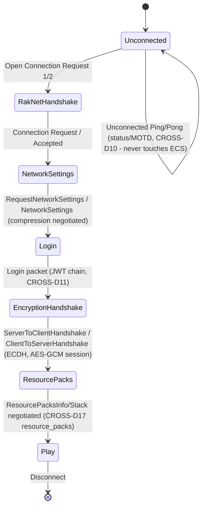
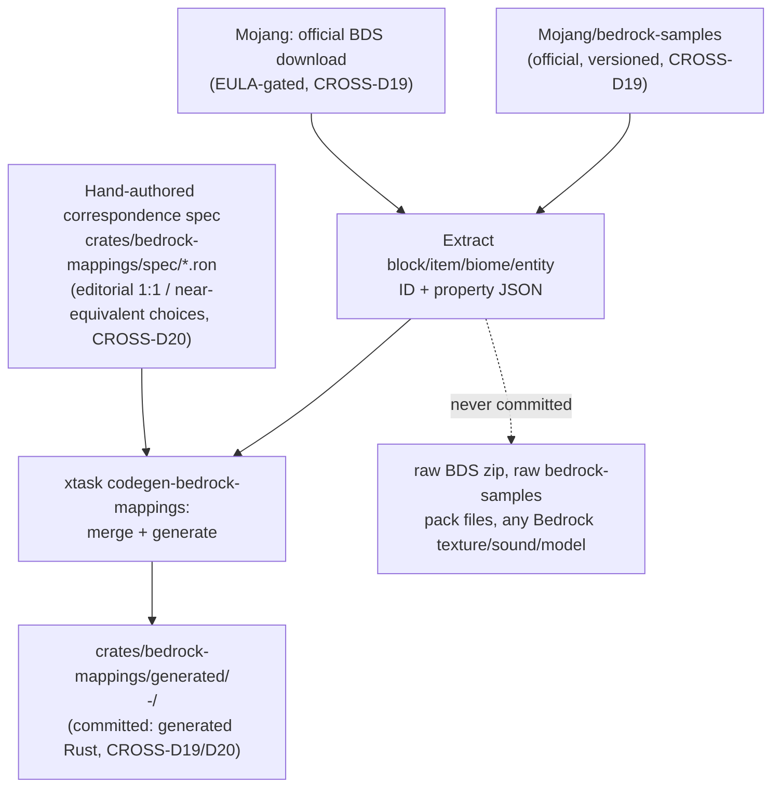

# Bedrock Cross-Play

## Purpose

Defines Bedrock Edition cross-play: a config-activated, default-off feature letting Bedrock Edition clients join the same world as Java Edition clients on a Rusty Clanker server. **Java Edition semantics are authoritative without exception** — the simulation core, world state, and every mechanic continue to be exactly what `01`–`14` already define; Bedrock is never a second thing the engine simulates, only a second wire protocol adapted at the connection boundary. A Bedrock client is translated *into* Rusty Clanker's existing Java-protocol-shaped internal interface, never the reverse, and the ECS/tick pipeline never learns a connection's edition. This document owns the translation layer's architecture and crate placement, the pinned Bedrock protocol version and its own bump process, the RakNet transport and its config surface, the Bedrock-side identity/auth chain and how it composes with `08`'s Java auth chain and `13`'s proxy, the translation-scope tier list (parity / degraded / unsupported) against Java's authoritative behavior, the block/item/biome/entity mapping-data generation pipeline, cross-play's milestone placement, its test methodology, and its legal posture toward Mojang's Bedrock-side materials and the GeyserMC ecosystem.

## Scope

**In scope:** the protocol-translation layer's architecture and where it runs in monolithic vs. cluster mode; the new crates it is implemented in and their dependency-graph placement; the pinned Bedrock protocol version and its own version-bump process (parallel to, but independent of, NET-D2); the RakNet/UDP transport, its default port, and the `[crossplay]` config block; the Bedrock-side identity/authentication chain (Xbox-Live-issued, Mojang-signed JWT chain), its identity model (XUID, Bedrock-space identity UUID, derived internal UUID, username prefixing), its premium-ownership-enforcement stance, and how it composes with `08-assets-auth-legal.md`'s Java auth chain and `13-cluster-architecture.md`'s proxy-side encryption termination; the translation-scope tier list (parity-translated / gracefully-degraded-and-documented / unsupported) for gameplay-visible behavior differences between the two editions; the block/item/biome/entity mapping-data sourcing and generation pipeline, and its legal-custody boundary; cross-play's milestone (`M11`, appended to `11-roadmap-milestones.md`'s sequence) with goal/scope/acceptance criteria and its dependency point in the existing milestone sequence; cross-play's test methodology; the legal posture toward Mojang's official Bedrock-side reference materials and toward the GeyserMC/CloudburstMC/gophertunnel ecosystem under the `ASSET-D30` firewall.

**Out of scope:** Java Edition's own protocol, connection lifecycle, or online-mode chain (owned unmodified by `02-protocol-networking.md` and `08-assets-auth-legal.md` — this document adds a second, independent connection path, never alters the first); the ECS/tick-pipeline/domain-parallelism internals a Bedrock connection's translated events flow into (owned unmodified by `01-server-architecture.md` — a Bedrock connection produces exactly the same typed ECS ingress events a Java connection does, at the exact seam `02`'s NET-D8 already defines); cluster topology, rebalancing, and the handoff protocol themselves (owned unmodified by `13-cluster-architecture.md` — this document only fixes where Bedrock's connection-termination and translation work sit relative to that topology); the Phase 2 native client (out of scope for the whole project's Bedrock posture — Rusty Clanker never *acts as* a Bedrock client, only as a server adapting Bedrock clients that connect to it; `07-client-architecture.md`'s client remains Java-only); NetherNet/WebRTC transport and Xbox Live session hosting/matchmaking (CROSS-D7 places this out of scope entirely, not merely deferred); automatic Java-to-Bedrock resource-pack conversion (CROSS-D17 places this in the unsupported tier); isomorphic mods' client-side render hooks reaching a Bedrock client (CROSS-D17 — a Bedrock client is a closed, non-Rust binary with no mod-host boundary to hook into).

## Decisions

| ID | Decision | Rationale |
|---|---|---|
| CROSS-D1 | **Java Edition semantics are authoritative without exception; the simulation core never learns about Bedrock.** Cross-play is implemented as a protocol-translation layer sitting entirely outside `01`'s ECS/tick pipeline and `02`'s Java wire codec: on the inbound side it produces exactly the same typed ECS ingress events/commands NET-D8 already defines for a Java connection (never a Bedrock-specific parallel event type); on the outbound side it is a second consumer at NET-D8's Stage-11 encode-worker-pool seam, subscribing to the same per-chunk/per-entity dirty-generation-keyed change stream the Java encode path already reads, producing its own Bedrock-shaped shared-encode cache rather than modifying or wrapping the Java one. A Bedrock player is, from Stage 1 through Stage 10 of `01`'s tick pipeline, indistinguishable from a Java player — no mechanic, no redstone timing, no worldgen output, no data-driven content differs by one bit because a Bedrock client happens to be observing it. | This is the direct extension of the project's own binding "vanilla parity is bit-identical by default... never silent or approximate" principle to a second protocol: the moment the simulation itself branched on client edition, two different games would exist under one binary. Reusing NET-D8's exact seam (rather than inventing a parallel one) means `02`'s already-designed inbound/outbound boundary absorbs a second protocol family for free, exactly as it was built to (NET-D8's own framing: "the network layer performs no game-state mutation itself"). |
| CROSS-D2 | **New crates**, named per `12-workspace-structure.md`'s WS-D1 convention: `rc-bedrock-protocol` (`crates/bedrock-protocol/`) — Bedrock's own wire codec (packet framing, its own little-endian/varint "network NBT" variant, the JWT-chain types), pure data/codec, no sockets, mirroring `rc-protocol`'s shape. `rc-bedrock-raknet` (`crates/bedrock-raknet/`) — the RakNet/UDP transport: datagram framing, the reliability/ordering layer, the offline/online RakNet connection handshake. `rc-bedrock-auth` (`crates/bedrock-auth/`) — local verification of the client-presented Xbox-Live/Mojang identity chain, XUID/identity extraction, the internal-UUID derivation scheme (CROSS-D11), username prefixing, account-linking storage. `rc-bedrock-translator` (`crates/bedrock-translator/`) — the actual protocol-translation layer: consumes `rc-bedrock-protocol` packets inbound and produces NET-D8's typed ECS ingress events; consumes the Stage-11 dirty-generation change stream outbound and produces Bedrock-shaped, shared-encoded packets; owns the CROSS-D15–D18 tier logic. `rc-bedrock-mappings` (`crates/bedrock-mappings/`) — generated Java↔Bedrock block/item/biome/entity ID and property correspondence tables (CROSS-D19/D20), analogous in role to `rc-registries`. All five are additions to `12`'s closed crate manifest (WS-D2), flagged for that document to ratify. | Five single-responsibility crates, each mirroring an existing Java-side counterpart 1:1 (`rc-protocol`↔`rc-bedrock-protocol`, `rc-transport-inproc`/`-net`↔`rc-bedrock-raknet`, `rc-auth`↔`rc-bedrock-auth`, `rc-registries`↔`rc-bedrock-mappings`, with `rc-bedrock-translator` as the one genuinely new role — NET-D8's encode/ingress boundary made into an explicit crate rather than inline server code) keeps the crossplay surface exactly as legible as the Java-only surface `12` already established, and makes WS-D3's dependency-graph hard rules trivially extensible (CROSS-D5) rather than requiring a bespoke exception. |
| CROSS-D3 | **Placement:** in **monolithic mode**, `rusty-clanker-server` optionally binds a second listener — `rc-bedrock-raknet`'s UDP socket alongside `02`'s existing Java TCP listener — feeding `rc-bedrock-auth` and `rc-bedrock-translator` directly, in-process, exactly where `rc-auth`/`rc-protocol` already run. In **cluster mode**, the RakNet socket, the identity-chain verification (`rc-bedrock-auth`), and the AES-GCM encryption termination bind to the **proxy role**, at exactly the place CLUSTER-D20 already runs NET-D6 for Java — backend nodes never see a raw Bedrock socket either. The actual translation (`rc-bedrock-translator`'s inbound-event production and outbound Bedrock-shaped encoding) runs on the **owning node**, at the same place NET-D8's Stage-11 Java encode already runs, because that is where the canonical chunk/entity state the translator reads actually lives — the proxy remains stateless beyond its directory cache and mid-handoff buffering (CLUSTER-D21), exactly as it already is for Java. A node ships its Bedrock-encoded bytes to the proxy over the **same proxy↔node QUIC connection** CLUSTER-D11 already opens, as an opaque payload tagged by client edition — the proxy never decodes or re-encodes it, only forwards it to the right RakNet connection, precisely mirroring how it already forwards opaque Java-encoded bytes today. | Placing auth/encryption termination at the proxy (mirroring CLUSTER-D20) and translation at the owning node (mirroring NET-D8's own Stage-11 placement) is not two independent choices — it is the same "terminate the connection where it is stable, compute from state where the state lives" split `13` already made for Java, applied to a second protocol without inventing a second split. It is also what keeps CLUSTER-D22's handoff protocol untouched: the handoff sequence only ever moves an opaque byte stream between old and new node through the proxy — it was never protocol-aware, so it needs no Bedrock-specific branch. |
| CROSS-D4 | **Compilation/activation split**, mirroring CLUSTER-D26/D27 exactly: `rc-bedrock-*` are `optional = true` dependencies of `rusty-clanker-server`, unified under one Cargo feature `crossplay`, **on by default in the officially distributed binary** (so "download once, everything available" holds, matching the cluster feature's own default), strippable via `--no-default-features` on a from-source minimal build. Runtime activation is **purely config-presence-driven**: no `[crossplay]` section (or `enabled = false` within it) means no RakNet socket is bound, no Bedrock ECS-ingress adapter is registered, and `rc-bedrock-translator` never subscribes to the Stage-11 dirty-generation stream — genuinely zero runtime cost, not merely "present but idle," verified by M11's acceptance criteria (CROSS-D26). A present `[crossplay]` section with `enabled = true` activates the second listener. | Directly reuses CLUSTER-D26/D27's already-proven pattern rather than inventing a second compilation/activation philosophy — the project already has exactly one validated answer to "how does an optional, potentially-heavy subsystem ship in every binary but cost nothing when unused," and crossplay is architecturally the same shape of problem cluster mode was. |
| CROSS-D5 | **Dependency-graph rules, extending `12`'s WS-D3:** (5) `rc-bedrock-protocol`, `rc-bedrock-raknet`, `rc-bedrock-auth` depend only on `rc-core` (plus `rc-bedrock-protocol`→`rc-bedrock-mappings` for registry-shaped constants where needed) — server-only, `crossplay`-feature-gated, mirroring `rc-transport-net`/`rc-auth`'s own minimal-dependency shape. (6) `rc-bedrock-translator` depends on `rc-core` (for NET-D8's typed ECS ingress event/command types — flagged as a Needs-from-`01` confirmation of that type's exact crate home), `rc-registries` (canonical Java-side IDs), `rc-bedrock-mappings`, and `rc-bedrock-protocol` — **never** on `rc-scheduler` or `rc-mechanics` directly, satisfying WS-D3 rule 2's "no simulation → network" boundary the identical way `rc-protocol` itself already does (translation happens at an edge, handed across a channel boundary, never a direct type-level dependency into simulation crates). (7) `rc-bedrock-mappings` depends only on `rc-core` and `rc-registries`, mirroring `rc-registries`' own "graph's root leaf, plus one hop" shape. | Every one of these rules is a direct restatement of a rule `12` already enforces for the Java-side crate with the same role — no new dependency *philosophy* is introduced, only its mechanical extension to five new nodes in the same graph, keeping `xtask lint-deps` (WS-D3) a single enforcement mechanism for both protocol families rather than needing a Bedrock-specific carve-out. |
| CROSS-D6 | **Pin Bedrock Edition target to protocol version 2168** (Bedrock Edition **26.44**, hotfixed 2026‑08‑14/18, verified against minecraft.wiki as of 2026‑08‑21 — the latest full Bedrock release). This is the same "Chaos Cubed" content generation NET-D1 pins on the Java side (Java 26.2, released 2026‑06‑16): Bedrock shipped the matching content drop as **26.30** (protocol 1001) that same day, 2026‑06‑16. Bedrock's post-drop patch cadence is materially faster than Java's for the identical content generation — 14 point releases (26.31…26.44) against Java's three (26.1→26.1.1→26.1.2 before 26.2) — carrying the protocol number to **2168 by 26.40** (2026‑08‑04, itself noted as shipping "experimental features for the third drop of 2026," Bedrock's own analog to Java 26.3 being in snapshot per NET-D1), stable through 26.44. The two editions' version pins are tracked **independently** — this decision always targets "the latest stable Bedrock release as of the current review," never a value arithmetically derived from NET-D1 — and both are re-verified together at every version-bump review. | Mirrors NET-D1's own methodology exactly (a live, dated, wiki-verified pin with its lineage stated, not asserted from memory) rather than assuming Bedrock and Java version numbers move in lockstep, which the research explicitly disproved — Bedrock's 14-point-release cadence for one content drop is a real, load-bearing fact CROSS-D18's tier-review cadence and CROSS-D21's mapping-pipeline re-run trigger both depend on. |
| CROSS-D7 | **Single pinned Bedrock protocol version, no multi-version compatibility layer, bump process extends NET-D2's:** an older/newer Bedrock client is rejected at RakNet-login with an explicit disconnect reason, exactly as NET-D2 already does for Java. A version bump is gated on: (a) CROSS-D19/D20's mapping-data pipeline re-run against the new Bedrock release, (b) `rc-bedrock-protocol`'s hand-maintained field-layout spec reviewed against `wiki.bedrock.dev`/Mojang's own protocol docs (CROSS-D27) and fresh packet captures, (c) CROSS-D15–D18's translation-tier table re-verified against the new client build (a behavior that was Tier-1-parity may have shifted; Geyser's own current-limitations list is re-checked as a reality baseline at this step), (d) the full crossplay parity suite (CROSS-D24) passing. Snapshots/betas are never tracked. | Extends rather than duplicates NET-D2's already-justified single-version discipline (validated by every actively-maintained Rust MC reimplementation surveyed in `10`) — Bedrock gets its own gate with its own steps because its data (mappings) and its own faster patch cadence (CROSS-D6) genuinely differ from Java's, but the *policy shape* — deliberate, reviewed, never silent, never multi-version — is identical. |
| CROSS-D8 | **Transport: RakNet over UDP only. NetherNet (WebRTC) is explicitly out of scope, not merely deferred.** Verified against `wiki.bedrock.dev` and Mojang's own `Mojang/bedrock-protocol-docs`: Bedrock speaks two transports — RakNet/UDP is "the main protocol used for external servers" (the PC/mobile "Add Server" direct-IP path, and the path every third-party community server, including console players' BedrockConnect-style server-browser workaround, ultimately connects over); NetherNet/WebRTC is used exclusively for **Xbox Live session-hosted** connections (first-party console matchmaking/friend-invite flows), requiring the server to register as an Xbox Live session host through Microsoft's own session-directory service. Rusty Clanker targets the direct-connect use case exclusively — the same "any protocol-compliant client that has already authenticated may connect, the engine touches zero Microsoft/Xbox session APIs" posture ASSET-D1 already holds for Java is what CROSS-D14/D28 extend to Bedrock, and NetherNet's session-hosting requirement would break that posture outright. | RakNet is the only transport a self-hosted, non-Xbox-Live-registered Rusty Clanker server can realistically be reached over — NetherNet is not "a harder version of the same problem," it is a different problem (becoming an Xbox Live session host) this project has no reason to take on, since it would reintroduce exactly the Microsoft-platform-credential burden ASSET-D1/D2 deliberately keep off every server operator. |
| CROSS-D9 | **`rc-bedrock-raknet` is hand-written from scratch**, informed by public documentation (`wiki.bedrock.dev`'s RakNet page, the original openly-published RakNet protocol specification) — **no dependency on any third-party Rust RakNet crate** (`rust-raknet`, `raknet-rs`, `ruknet`, `raknet-rust` — all surveyed, all permissively licensed (MIT/Apache-2.0), none adopted). | Mirrors NET-D3's and ASSET-D3/D4's already-established reasoning verbatim, applied to a third protocol-adjacent surface: these are small, single/few-maintainer crates whose long-term release cadence and architecture this project does not control, and RakNet sits at the same security-relevant network boundary NET-D3 already treats as worth owning outright — the fact that all four surveyed crates are license-clean (unlike Pumpkin) confirms licensing was never the blocking concern for this class of dependency in the first place; control and auditability are. |
| CROSS-D10 | **Port and config surface.** Default RakNet listen address `0.0.0.0:19132` (UDP), matching the community-standard Bedrock server port; an IPv6 companion port (`19133`, community convention) is not separately required by this decision but may be bound by the same config value if the operator's `bind` address is IPv6. Bedrock's own **status/ping path** — a RakNet "unconnected pong" carrying a semicolon-delimited MOTD string (edition, MOTD, protocol version, version name, player count/max, server GUID, sub-MOTD, game mode) — is answered by `rc-bedrock-raknet` directly, without touching the ECS, mirroring NET-D11's Java Status/Ping path exactly (same "shares framing, never the play-state event bus" shape). Config block (TOML, matching `13`'s CLUSTER-D27 precedent):<br>`[crossplay]`<br>`enabled = false  # CROSS-D4 — default OFF`<br>`bind = "0.0.0.0:19132"  # RakNet/UDP listen address`<br>`auth_mode = "online"  # "online" \| "offline" — offline is LAN/local-testing only, never the operator-facing default (CROSS-D11)`<br>`username_prefix = "*"  # prepended to a Bedrock player's Java-space display name (CROSS-D11)`<br>`allow_account_linking = false  # CROSS-D13 — off by default, deferred past M11 baseline`<br>`resource_packs = []  # paths to Bedrock-native .mcpack files served only to crossplay connections` | One flat table, same discipline CLUSTER-D27 already established for cluster config — every field maps to a decision fixed elsewhere in this document, and `enabled = false` as the very first key makes the default-off posture impossible to miss in a config file. |
| CROSS-D11 | **Server-side identity verification: local cryptographic chain validation, no live HTTP call — architecturally different from NET-D6, functionally equivalent in intent.** A Bedrock client's `Login` packet carries a JWT chain (typically three claims) where each claim is signed with the public key embedded in the previous one, terminating in a claim signed by **Mojang's own long-lived ES384/secp384r1 key**, whose public key is a published constant `rc-bedrock-auth` verifies against locally — no network call to any Mojang or Microsoft endpoint is ever made, unlike NET-D6's `hasJoined` request. The verified chain's final (Mojang-issued) claim carries `extraData`: **XUID** (the player's stable Xbox Live user ID), **identity** (a Bedrock-space UUID, stable for as long as the account stays signed into Xbox Live — a wholly separate namespace from a Java UUID), and **displayName**. `auth_mode = "online"` (default) rejects any connection whose chain does not validate to the known Mojang root key; `auth_mode = "offline"` skips that validation for LAN/local testing only, mirroring NET-D6's own offline-mode carve-out (never the shipped default, no anti-piracy guarantee) — wire encryption itself (the ECDH-derived AES-GCM session, established via the client/server handshake claims) is independent of `auth_mode` and always runs. | This is the direct Bedrock-side analog of NET-D6, documented with its actual mechanism rather than assumed identical to Java's — Bedrock's security model puts the trust anchor in a locally-verifiable signature chain rather than a live session-server lookup, which is a materially different implementation but serves the identical purpose NET-D6 serves for Java: proving the connecting client was issued its identity by Mojang's own infrastructure, not forged by an arbitrary client. |
| CROSS-D12 | **Identity model: XUID is the stable primary key; a deterministic UUIDv5 derivation maps it into Rusty Clanker's internal Java-shaped UUID space; the Bedrock-space `identity` UUID is stored but never used as the internal player key.** `rc-bedrock-auth` computes `Uuid::new_v5(&RC_BEDROCK_NAMESPACE, xuid.as_bytes())` — a fixed, project-defined namespace UUID minted once in `rc-bedrock-auth`'s own source — giving every Bedrock account a stable internal UUID across sessions and restarts, usable identically to a Java UUID everywhere else in the engine (player data persistence, permissions, `rc-mod-api` player-identity hooks). Because UUIDv5 always sets the version nibble to `5` while Mojang's real Java profile UUIDs are version `4` (random), a derived Bedrock UUID can **never** collide with, or be mistaken for, a genuine premium Java UUID — a stronger collision guarantee than an ad hoc prefix scheme alone provides. The player's **display name** is shown with a configurable prefix (`username_prefix`, default `"*"`, CROSS-D10) to avoid same-name ambiguity with an unrelated Java account, informed by — not copied from — Floodgate's own publicly documented prefixing convention (ASSET-D18(e)'s architecture-reading allowance; Floodgate's code is never opened outside the ASSET-D30 firewall). | Reusing the UUID version nibble as a structural collision guard is a small, independent improvement over Floodgate's own ad hoc-prefix-only scheme (learned from its public behavior, not adopted verbatim) — deterministic derivation from a stable Microsoft-account-tied XUID (rather than e.g. a random UUID minted at first join) is what lets a returning Bedrock player's world data, permissions, and mod-visible identity stay stable exactly the way a returning Java player's does. |
| CROSS-D13 | **Account linking (a Bedrock session claiming a real premium Java UUID instead of its derived one) is a named design direction, deliberately deferred past `M11`'s baseline scope.** `allow_account_linking` (CROSS-D10) defaults to `false`; when a future revision implements it, the shape is expected to mirror Floodgate's own publicly observed flow (link command issued from one edition, confirmed from the other) without adopting its code. | Keeping `M11`'s baseline scope to "a Bedrock account gets a stable, collision-free internal identity" (CROSS-D12) is sufficient for cross-play to function correctly end-to-end; account linking is a genuine UX nicety with real design surface (storage, security of the linking handshake, interaction with `08`'s Java auth chain) that does not gate cross-play's core acceptance criteria and should not inflate `M11`'s scope to reach it. |
| CROSS-D14 | **Composition with `08-assets-auth-legal.md` and `13-cluster-architecture.md`: the server touches zero Microsoft/Xbox/Azure endpoints for Bedrock, exactly as ASSET-D1 already holds for Java; cluster-mode placement mirrors CLUSTER-D20 exactly, extended.** ASSET-D1's "only the Phase 2 client authenticates with Microsoft; the server calls only Mojang's public, unauthenticated session surface" is preserved and, for Bedrock, tightened further — CROSS-D11's local chain verification means the server calls **no** external endpoint at all, Mojang's or Microsoft's, for Bedrock join validation. In cluster mode, CLUSTER-D20's forwarded-player-identity envelope (proxy → owning node, over the internal mutually-authenticated QUIC link) gains Bedrock-specific fields — `edition` tag, `xuid`, the derived internal UUID (CROSS-D12), `display_name` — alongside its existing Java username/UUID/skin-property fields, flagged as a Needs-from-`02` wire-shape item exactly as CLUSTER-D20 already flags for Java's own envelope. | Stating explicitly that cross-play *tightens* rather than merely preserves ASSET-D1's server-side credential-free posture closes what could otherwise look like an open question the moment a second, unfamiliar auth chain enters the picture; extending CLUSTER-D20's already-designed envelope (rather than inventing a parallel cluster-mode identity-forwarding path) keeps `13`'s "one proxy, one trusted forwarding mechanism" property true for both editions. |
| CROSS-D15 | **Translation tier 1 — parity (bidirectional, no documented deviation):** movement/collision, block placement/breaking and their block-update propagation, core redstone **observation** (wire/repeater/comparator/piston visual and signal state — Bedrock renders these natively), basic combat and damage, plaintext chat, day/night and weather, basic survival/creative inventory manipulation excluding CROSS-D16's offhand carve-out, and joining/spawning into the server's real, worldgen-parity (`04`/`M5`) terrain — never a synthetic or reduced world for Bedrock clients. A Java client and a Bedrock client performing the identical scripted action against the same world state produce identical resulting Java-authoritative world state, verified by CROSS-D24's cross-edition consistency suite. | This is the floor the project's binding "vanilla parity is bit-identical by default" principle demands for anything not explicitly, individually carved out below — Tier 1 is deliberately the default classification, with Tiers 2/3 requiring their own named, bounded justification per item, not the other way around. |
| CROSS-D16 | **Translation tier 2 — gracefully degrades, every item individually documented, bounded, and re-verified at every version bump (CROSS-D7/D18):** (a) **Offhand** — Bedrock natively restricts the offhand slot to shield/map/arrow/firework; a Java-side item placed in offhand by another player or by data-driven content is shown to a Bedrock client as empty or force-migrated to main hand, matching Geyser's documented behavior, our own implementation. (b) **Sign editing** — Bedrock's sign-editing UI has different line-count/character-limit behavior than Java's; text beyond Bedrock's limit is truncated client-side, never lost server-side. (c) **Banner layers** — Bedrock cannot render layers past its own hard cap; excess layers are stored (Java-authoritative) but not rendered to Bedrock viewers. (d) **Potion/particle visuals** — `PotionContents`-driven custom potion colors, the glowing effect, and a subset of particles have no Bedrock-native rendering equivalent and are omitted from what a Bedrock client sees, never from authoritative state. (e) **World height** — Bedrock's own per-dimension height limits (Overworld roughly ±512, other dimensions 0–256 per current Bedrock behavior) are narrower than Java's; blocks outside a Bedrock client's renderable height are simply not sent to it, remaining fully present in Java-authoritative state. (f) **Movement/combat timing** — client-side prediction/reconciliation differences between the two engines' netcode produce bounded, latency-correlated rubber-banding under high-latency conditions, never desync of authoritative position. | Every item here is drawn from Geyser's own current, published limitations list (research-verified against its live documentation as of 2026‑08‑21) — reusing an already-battle-tested reality baseline rather than guessing which gaps exist keeps this tier accurate on day one instead of accumulating as post-launch bug reports; each item is stated as a *documented, bounded* exception per the project's binding parity-exception discipline, the same shape ARCH-D14/GEN-D20 already use elsewhere. |
| CROSS-D17 | **Translation tier 3 — unsupported at `M11`, explicit, not silent:** (a) **Automatic Java→Bedrock resource-pack conversion** — a server may serve a Bedrock-native `.mcpack` (CROSS-D10's `resource_packs` config) to Bedrock clients directly, but no pipeline converts a Java resource pack into one; this matches Geyser's own documented no-conversion stance. (b) **Java-side custom UI/GUI screens beyond Bedrock's native form primitives** — a Bedrock client's UI vocabulary (forms, simple menus) does not cover arbitrary custom Java inventory/GUI layouts; unsupported screens are either omitted or degraded to Bedrock's nearest native form, per-case, at implementation time. (c) **Isomorphic mods' client-side render hooks never reach a Bedrock client** — a Bedrock client is a closed, non-Rust binary with no `rc-mod-host` boundary; a mod's server-side hooks (block behavior, item logic) affect a Bedrock player exactly as they affect any player, but its client-side visual hook (`06-modding-api.md`'s client loop) has no Bedrock-side counterpart, ever. (d) **Custom anvil/smithing recipes and non-vanilla enchantment display** — mirrors Geyser's own documented limitation; data-driven content in these categories functions authoritatively but does not render distinctly to Bedrock clients. | Naming the unsupported set explicitly — rather than letting it be discovered ad hoc during implementation — is what keeps `M11`'s acceptance criteria (CROSS-D22) honest about what "cross-play works" actually means; (c) in particular is a structural fact about what a Bedrock client *is* (closed-source, no mod-host boundary), not a gap this project could close by trying harder, so it belongs in the explicit-and-permanent tier, not a "not yet" one. |
| CROSS-D18 | **The tier table (CROSS-D15–D17) is a living document reviewed at every Bedrock version-bump gate (CROSS-D7 step (c)), never left stale.** A newly observed Bedrock-side limitation discovered during implementation or by a future Bedrock client update is added to the appropriate tier before the feature it affects is considered `M11`-acceptance-complete — parity drift into an undocumented gap is treated with the same severity the project's risk register (`11`) already assigns to undocumented worldgen/mechanics drift. | Directly extends the project's binding "no silent drift" principle from vanilla-Java parity (where it already governs every other document) to the second, Bedrock-facing parity surface this document introduces — a tier list that goes stale the moment Mojang ships a Bedrock update would silently reintroduce exactly the kind of undocumented deviation the rest of the project works hard to prohibit. |
| CROSS-D19 | **Mapping-data sourcing: Mojang's own official Bedrock materials, developer/CI-local only, never committed raw** — mirroring NET-D9/ASSET-D15's Java-side pipeline exactly. `xtask fetch-bedrock-data <version>` downloads (a) the official **Bedrock Dedicated Server (BDS)** distribution (`minecraft.net/en-us/download/server/bedrock`, EULA-gated per its own download terms) for the pinned version, and (b) Mojang's official **`Mojang/bedrock-samples`** GitHub repository (vanilla `behavior_pack`/`resource_pack` block/item/entity definition JSON, versioned per release, terms distinct from but analogous in spirit to the BDS EULA) — both a legally obtained, developer- or CI-job-local copy exactly as ASSET-D29 already confirms is sound for the Java `server.jar` case. Extracted block/item/biome/entity **ID and property facts** are functional/structural data under NET-D10/ASSET-D15's already-established test — safe to commit only as **generated Rust**, never as raw JSON, never as the BDS zip or `bedrock-samples` pack files themselves, never as any Bedrock texture/sound/model asset (extending ASSET-D13/D16's custody rule symmetrically to the Bedrock side). | Applies a test this project has already settled twice (NET-D10 for Java `--reports`, ASSET-D16 for structure templates) to a third data source rather than re-litigating "functional fact vs. copyrightable expression" from scratch — BDS/`bedrock-samples`' block/item ID lists are exactly the functional-fact case NET-D10/ASSET-D15 already clears; their pack/texture/model content, if ever incidentally touched, is exactly the creative-content case ASSET-D16 already forbids. |
| CROSS-D20 | **Mapping generation: a hand-authored correspondence spec, merged with extracted facts, compiled to generated Rust — mirroring NET-D9's field-layout-spec precedent.** Many Java↔Bedrock block/item/biome/entity IDs correspond directly (a mechanical, factual mapping); others have no 1:1 counterpart and require an editorial correspondence choice (near-equivalent substitution, or an explicit "no Bedrock equivalent" marker consumed by CROSS-D16/D17's tier logic). This editorial layer is authored by hand as `crates/bedrock-mappings/spec/*.ron`, informed by black-box comparison of the two editions' own observable behavior (ASSET-D18(d)) and by reading — never copying — GeyserMC's publicly documented mapping *outcomes* (ASSET-D18(e)'s architecture-reading allowance; its actual mappings-generator code and output JSON are never opened by an implementation/blueprint role, routed through the ASSET-D30 firewall per CROSS-D29 if a maintainer ever needs deeper study of one specific tricky case). `xtask codegen-bedrock-mappings` merges this spec with CROSS-D19's extracted factual ID data into generated Rust under `crates/bedrock-mappings/generated/<bedrock-protocol>-<java-protocol>/` (committed; raw extracted data never is, per CROSS-D19). | The editorial-correspondence step is genuinely non-mechanical (unlike NET-D9's packet field layouts, which are "sourced from... captures," a block-equivalence choice is a judgment call), which is exactly why NET-D9 already established the "hand-authored spec, merged with generated facts by `xtask codegen`" pattern this decision reuses rather than inventing a bespoke mapping-authoring process. |
| CROSS-D21 | **The mapping pipeline (CROSS-D19/D20) re-runs whenever either edition's pin moves** — a Java bump (NET-D1/NET-D2) or a Bedrock bump (CROSS-D6/D7) each independently trigger a full `fetch-bedrock-data`/`codegen-bedrock-mappings` re-run and a hand-review pass over the correspondence spec for any newly introduced block/item/biome/entity on either side, before that version pair's mappings are considered current. | Because the two editions' pins move on independent, differently-paced cadences (CROSS-D6), a mapping re-run trigger tied to only one side's bump would silently go stale the moment the *other* side moved — tying it to both closes that gap the same way CROSS-D18 closes the tier-table staleness gap. |
| CROSS-D22 | **Milestone: `M11` — Bedrock Cross-Play, appended to `11-roadmap-milestones.md`'s sequence without renumbering `M0`–`M10`.** Full milestone text (goal, scope, acceptance criteria) is given below in [Milestone: M11 — Bedrock Cross-Play](#milestone-m11--bedrock-cross-play), for `11` to incorporate verbatim as this document's crossref request specifies. **Dependency: `M0`–`M7`'s acceptance criteria must already hold** (engine skeleton, protocol bootstrap, persistent storage, mechanics tiers 1–2, worldgen parity, scale/optimization, cluster mode activation) — `M11` needs a fully-featured, cluster-capable, worldgen-complete Java server to translate *into*, per CROSS-D1's "Bedrock is adapted at the boundary of an already-complete engine" framing. **`M11` does not depend on `M8` (Mod API Alpha)** — CROSS-D17(c) already establishes that Bedrock has no client-side mod surface to validate against, so `M11` could in principle proceed in parallel with `M8` once `M7` is green — and is **fully independent of `M9`/`M10`** (the Phase 2 native client), matching the task's explicit framing: cross-play is a Phase-1-server-only extension. | Placing the dependency at `M7` rather than `M6` is deliberate: `M11`'s own acceptance criteria require testing the cluster-mode placement CROSS-D3 defines (proxy-side auth/RakNet, node-side translation, opaque-payload forwarding), which has nothing to validate against before `M7` makes cluster mode real. Not gating on `M8`/`M9`/`M10` keeps `M11` exactly as parallelizable as the roadmap's own risk-reduction logic already favors elsewhere (`11`'s PLAN-D2 rationale explicitly allows non-dependent prep work to proceed alongside a gating milestone). |
| CROSS-D23 | **Test methodology: a Bedrock bot driver built on the project's own `rc-bedrock-protocol`/`rc-bedrock-raknet` crates, added as a dev-dependency of `rc-paritybot`** (`09-testing-quality.md`'s existing differential-testing crate, TEST-D1/D8) — not a new third-party dependency. Unlike TEST-D8's Java-side `azalea` (an independently-maintained client library, giving genuine cross-implementation confidence), no comparably mature, independently-maintained **Rust** Bedrock bot library exists as of this research (the mature options — `PrismarineJS/bedrock-protocol` in Node.js, `Sandertv/gophertunnel` in Go — would require a cross-language subprocess harness rather than a pure-Rust dev-dependency); the crossplay bot driver therefore necessarily dogfoods the same crates it is meant to validate, a known, explicitly acknowledged reduction in test independence relative to TEST-D8's Java-side signal. | Naming this trade-off explicitly (rather than silently presenting a dogfooding test harness as equivalent in strength to TEST-D8's independent one) is what keeps the project's "current-state-only, no silent gaps" documentation discipline honest here — the mitigation (CROSS-D25's mandatory real-client manual pass) exists specifically because this decision's automated signal is weaker than Java's own. |
| CROSS-D24 | **Cross-edition consistency suite, extending `09`'s TEST-D11 scenario corpus with an edition axis `{java, bedrock, both-simultaneously}`.** For each scenario in the existing corpus, a Bedrock-bot-driven run (CROSS-D23) and the existing Java-bot-driven (azalea) run are compared using TEST-D10's existing world-state-hash equality check — the same authoritative Java world state must result regardless of which edition's client performed the scripted actions, modulo CROSS-D16/D17's documented tier exceptions (which are themselves asserted present, not merely tolerated, via a dedicated fixed test matrix). A `both-simultaneously` scenario variant additionally drives one Java bot and one Bedrock bot in the same session (e.g. one places a block, the other observes it within a bounded tick window) — this is cross-play's actual value proposition and is the one thing neither edition-alone run can verify. | Reusing TEST-D10/TEST-D11's existing comparator and scenario format (rather than inventing a parallel crossplay-only test format) means every scenario the Java-only suite already has automatically gains cross-edition coverage the moment CROSS-D23's Bedrock bot driver exists, exactly the same "one scenario, coverage across every axis" economy `09`'s own text already claims for its worker-pool/topology/deployment-mode axes. |
| CROSS-D25 | **A manual verification pass with a real, unmodified, pinned-version (CROSS-D6) Bedrock game client is required for `M11`'s join/render/play acceptance criterion — automation covers protocol- and world-state-level correctness (CROSS-D24); this one step covers what only a real client can confirm** (visual rendering fidelity, actual RakNet/NAT behavior against a real network stack, real resource-pack negotiation), mirroring `M1`'s already-established precedent that online-mode session validation "cannot be fully automated... depends on a live third-party account." | The project already accepts exactly one class of irreducibly-manual verification step for Java (`M1`'s online-mode pass) rather than pretending full automation where none exists — extending that same honest carve-out to Bedrock's client-rendering confirmation, instead of either skipping it or falsely claiming full automation, keeps `11`'s acceptance-criteria discipline (PLAN-D5: "never a subjective 'feels done' call... every criterion is either automated... or a documented, reproducible manual procedure with a pass/fail threshold") intact. |
| CROSS-D26 | **`crossplay = false` zero-cost verification is itself a required, automated `M11` acceptance check**, mirroring `M7`'s own "`M6`'s criteria still pass unmodified with no `[cluster]` config" pattern (CLUSTER-D26/D27's confirmation mechanism): (i) a test confirms no UDP socket is bound on the configured RakNet port when `enabled = false` (or absent); (ii) a `criterion` (`09`'s TEST-D29) benchmark comparing a `crossplay`-compiled-in-but-disabled build against a `--no-default-features`-stripped build shows no measurable tick-time regression (within `09`'s existing noise tolerance for release-gate criterion comparisons). | Reuses `M7`'s own proof pattern for the identical class of claim ("this optional subsystem ships in every binary but costs nothing unless configured on") rather than inventing a new one — the config-gated-optional-subsystem shape is now proven twice (cluster, crossplay) by the same mechanism, which is exactly the kind of consistency the project's decision-ID/cross-referencing discipline exists to produce. |
| CROSS-D27 | **Legal: Mojang's official Bedrock-side reference materials are added to `08-assets-auth-legal.md`'s ASSET-D18 allowed-sources enumeration, EULA-gated exactly as ASSET-D23 already analyzes `server.jar`.** `Mojang/bedrock-protocol-docs` (official, Mojang-published packet-structure documentation "shared with server partners so they can write their own Minecraft servers... by downloading the files in this repository, you agree to the Minecraft EULA") and `Mojang/bedrock-samples` (official vanilla behavior/resource-pack reference data, CROSS-D19) are both Bedrock-side analogs of ASSET-D18(a)/(f) — consulted locally by a developer or CI job that individually accepts the applicable terms at download time, exactly as ASSET-D23's EULA analysis already establishes for `server.jar`; **never committed to this repository**, and Mojang's expression within them (tree-diagram prose, sample pack content) is never copied verbatim into any project artifact, only described and reimplemented in this project's own words (ASSET-D18/D19's existing rule, unmodified). | `Mojang/bedrock-protocol-docs`'s own EULA-acceptance clause is a near-verbatim structural match to ASSET-D23's existing `server.jar` analysis (a narrow license gate triggered only at the point an individual downloads Mojang's own distributed materials, never extending to Rusty Clanker's own engine binary) — recognizing that match and reusing the existing analysis is more defensible than inventing a second, parallel legal argument for materially the same situation. |
| CROSS-D28 | **Xbox Live services ToS touchpoint: none, for server operators.** Because CROSS-D11's identity verification is a purely local cryptographic check against a client-presented, already-Mojang-issued chain, the server never itself calls any Xbox Live or Microsoft identity API — no Azure app registration, no Xbox Live developer/publisher agreement, and no Microsoft credential of any kind is required of a Rusty Clanker server operator to run cross-play, extending ASSET-D1's "server touches zero Microsoft/Xbox endpoints" stance to Bedrock explicitly and confirming it is, if anything, a **simpler** posture than the Phase 2 Java client's own ASSET-D2 Azure-app-registration burden (which exists only because the *client* actively performs the Microsoft OAuth flow — a role Rusty Clanker's server never plays for either edition). | Closes a question a reader might otherwise reasonably ask the moment "Xbox Live" appears in this document's auth chain — stating plainly that the touchpoint is zero, and why, prevents this document from being read as silently introducing a new operator-facing credential requirement `08`'s existing risk register does not account for. |
| CROSS-D29 | **The `ASSET-D30` third-party reference firewall applies to the GeyserMC/CloudburstMC/gophertunnel ecosystem exactly as it already applies to Pumpkin, regardless of their licenses.** GeyserMC (`Geyser`, `Floodgate`, `mappings-generator` — all MIT), `CloudburstMC/Protocol` (Apache-2.0), and `Sandertv/gophertunnel` (MIT) were all researched for this document and found to be permissively licensed — but ASSET-D19's rule already states the firewall applies "regardless of that project's own license." Their public architecture and documented behavior (current-limitations lists, mapping outcomes, protocol write-ups) are freely readable by every role per ASSET-D18(e); their actual source code is examined only by the ASSET-D30 designated-researcher role if a maintainer ever needs deeper study of one specific tricky porting case, with findings written as original notes into `docs/research/third-party/`, exactly as already established for Pumpkin's GPL-3.0 RNG port. | Confirms rather than relaxes ASSET-D19's existing "no other project's code is ever taken as a dependency or template, independent of licensing" rule the moment a *permissively*-licensed reimplementation-adjacent project enters scope — the temptation to treat "but it's MIT" as an exception is exactly the kind of drift a project with this document's stated legal discipline should name and reject explicitly rather than leave ambiguous. |
| CROSS-D30 | **Branding/disclaimer extends unmodified to every Bedrock-facing surface.** ASSET-D21's zero-Mojang-trademark policy and ASSET-D22's required disclaimer text apply identically to the RakNet unconnected-pong MOTD string (CROSS-D10), any Bedrock-native resource pack served (CROSS-D17(a)), and any Bedrock-side status/UI surface this document's translation layer produces — no separate, Bedrock-specific branding carve-out exists. | A second protocol surface is exactly the kind of place a branding policy could be silently forgotten if not stated per-surface — extending ASSET-D21/D22 explicitly here, rather than assuming it obviously applies, keeps the project's "no silent gaps" discipline consistent with how thoroughly `08` already enumerates Java-side surfaces for the same requirement. |

## Bedrock Connection Lifecycle



## Architecture & Placement

```mermaid
flowchart TB
    subgraph Mono["Monolithic mode (CROSS-D3)"]
        direction LR
        BC1["Bedrock client"] -- "RakNet/UDP :19132" --> RK1["rc-bedrock-raknet"]
        RK1 --> AU1["rc-bedrock-auth\n(CROSS-D11)"]
        AU1 --> TR1["rc-bedrock-translator"]
        TR1 -- "same typed ECS ingress\nevents as Java (NET-D8)" --> ECS1["ECS ingress adapter\n(01, unmodified)"]
        ECS1 --> SCHED1["Domain scheduler / World\n(01, edition-agnostic, CROSS-D1)"]
        SCHED1 --> ENC1["Stage-11 encode pool (NET-D8)"]
        ENC1 -- "Java-shaped shared encode" --> JW1["rc-protocol writer"]
        ENC1 -- "Bedrock-shaped shared encode\n(second consumer, same seam)" --> TR1
        TR1 --> RK1
        JC1["Java client"] -- "TCP" --> JW1
    end

    subgraph Clus["Cluster mode (CROSS-D3)"]
        direction LR
        BC2["Bedrock client"] -- "RakNet/UDP" --> PROXY["Proxy role\nRakNet + rc-bedrock-auth\n(CROSS-D14, mirrors CLUSTER-D20)"]
        JC2["Java client"] -- "TCP, NET-D6" --> PROXY
        PROXY -- "opaque Java bytes\n(unchanged, CLUSTER-D20)" --> NODE["Owning node\nStage-11 Java encode (NET-D8)"]
        PROXY -- "opaque Bedrock bytes,\nedition-tagged payload\nover same QUIC link (CLUSTER-D11)" --> NODE2["Owning node\nrc-bedrock-translator\n(CROSS-D3)"]
        NODE -.-> PROXY
        NODE2 -.-> PROXY
    end

    style Mono fill:transparent
    style Clus fill:transparent,stroke-dasharray: 3 3
```



## Identity & Auth Sequence

```mermaid
sequenceDiagram
    participant U as Player
    participant BC as Bedrock client
    participant XBL as Xbox Live<br/>(client-side only)
    participant MJ as Mojang identity service<br/>(client-side only)
    participant Srv as Rusty Clanker<br/>(server or proxy, CROSS-D3)

    U->>BC: sign in with Microsoft/Xbox account<br/>(entirely client-side, platform-native)
    BC->>XBL: authenticate (platform OS flow)
    XBL-->>BC: Xbox Live token
    BC->>MJ: present Xbox Live token + public key
    MJ-->>BC: 3-claim JWT chain, signed,<br/>terminating in Mojang's published root key
    Note over Srv: Rusty Clanker never contacts XBL or Mojang here (CROSS-D14/D28)
    BC->>Srv: RakNet handshake, then Login packet (chain + client data)
    Srv->>Srv: verify chain locally against known Mojang root key (CROSS-D11)
    Srv->>Srv: extract XUID / identity UUID / displayName, derive internal UUID (CROSS-D12)
    Srv->>BC: ServerToClientHandshake (ECDH pubkey)
    BC->>Srv: ClientToServerHandshake (encryption confirmed)
    Note over Srv,BC: AES-GCM encrypted from here on; auth_mode=online required chain validity above
    Srv->>BC: PlayStatus (login success), then ResourcePacksInfo, then StartGame
```

## Mapping-Data Pipeline



## Translation Tier Summary

| Tier | Behavior class | Examples | Verified against |
|---|---|---|---|
| 1 — Parity | Bidirectional, no documented deviation | Movement/collision, block place/break, redstone observation, chat, basic combat/inventory, real worldgen terrain | CROSS-D15; CROSS-D24 cross-edition suite |
| 2 — Degrades gracefully | Bounded, documented, re-verified every version bump | Offhand slot restriction, sign line/character limits, banner layer cap, potion/particle visual gaps, per-dimension height clamp, prediction-timing rubber-banding | CROSS-D16; Geyser current-limitations (research-verified 2026‑08‑21) |
| 3 — Unsupported | Explicit, permanent or structural, never silent | Java→Bedrock resource-pack auto-conversion, custom Java GUI screens, isomorphic-mod client-side render hooks, custom anvil/smithing recipe display | CROSS-D17 |

## Milestone: M11 — Bedrock Cross-Play

**Goal:** a pinned-version (CROSS-D6) Bedrock Edition client joins the same world a Java client is connected to, sees the server's real worldgen-parity terrain, plays alongside the Java client with Tier-1 behaviors verified bit-for-bit consistent, and every Tier-2/3 deviation is documented and bounded, not silent — with `crossplay = false` producing zero bound Bedrock listener and zero measurable performance cost.

**Scope:**
- `rc-bedrock-raknet`, `rc-bedrock-protocol`, `rc-bedrock-auth`, `rc-bedrock-translator`, `rc-bedrock-mappings` (CROSS-D2) implemented to CROSS-D9–D20.
- Monolithic-mode in-process listener and cluster-mode proxy/node placement (CROSS-D3) both implemented and tested.
- `crossplay` Cargo feature and `[crossplay]` config surface (CROSS-D4/D10).
- The mapping-data pipeline (`xtask fetch-bedrock-data`, `xtask codegen-bedrock-mappings`, CROSS-D19–D21) run successfully against a legally obtained BDS + `bedrock-samples` checkout for the pinned version pair.
- `09-testing-quality.md`'s `rc-paritybot` gains a Bedrock-bot capability (CROSS-D23) and the cross-edition consistency scenario corpus (CROSS-D24).

**Acceptance criteria:**
- `crossplay = false` (or absent): an automated test confirms no UDP socket is bound on the configured RakNet port; a `criterion` benchmark shows no measurable tick-time regression against a `crossplay`-feature-stripped build (CROSS-D26).
- `crossplay = true`, monolithic mode: an unmodified, pinned-version Bedrock client completes the full connection lifecycle (RakNet handshake, JWT-chain login, encryption handshake, resource-pack negotiation) and spawns into the server's real, `M5`-generated terrain — not a placeholder or superflat world.
- A scripted `both-simultaneously` cross-edition scenario (CROSS-D24) confirms a block placed by the Java client is observed by the Bedrock client, and vice versa, within a bounded tick window, with resulting world state identical regardless of which edition performed the action.
- The full CROSS-D15 Tier-1 behavior set passes the cross-edition consistency suite (CROSS-D24) with world-state hashes identical to the Java-only baseline (`09`'s TEST-D10).
- The full CROSS-D16/D17 Tier-2/3 set is asserted present-and-bounded via a dedicated fixed test matrix — any newly discovered Bedrock-side limitation is added to the tier table (CROSS-D18) before the affected feature is considered acceptance-complete.
- `crossplay = true`, cluster mode: a Bedrock client's session survives a cross-node region-boundary handoff within `M7`'s already-proven CLUSTER-D22 ≤2-tick, zero-disconnect budget, verified by a Bedrock-bot variant of `09`'s TEST-D21 handoff suite.
- A real, unmodified pinned-version Bedrock game client manually joins, renders, and plays a continuous session against a full-featured (`M0`–`M7`) Rusty Clanker build (CROSS-D25's one manual-verification carve-out).

**Dependency:** requires `M0`–`M7`'s acceptance criteria (engine skeleton through cluster mode activation); independent of `M8` (Mod API Alpha) and fully independent of `M9`/`M10` (Phase 2 client) — see CROSS-D22.

## Interfaces

**Provides to `02-protocol-networking.md`:** a second consumer at NET-D8's existing inbound (typed ECS ingress event) and outbound (Stage-11 encode-worker-pool, dirty-generation-keyed) seams — `02`'s own content and boundary shape are unmodified; this document only adds `rc-bedrock-translator` as a second producer/consumer at the seam already designed to be extensible in exactly this way.

**Provides to `13-cluster-architecture.md`:** confirmation that CLUSTER-D20's proxy-side connection-termination pattern and CLUSTER-D22's handoff protocol both extend to Bedrock connections with zero modification — RakNet/auth termination joins NET-D6 at the proxy (CROSS-D3/D14), and the handoff sequence stays protocol-agnostic because it only ever forwards opaque bytes (CROSS-D3).

**Provides to `08-assets-auth-legal.md`:** the Bedrock-side identity/auth chain (CROSS-D11/D12), confirmed topology-agnostic and Microsoft-credential-free for server operators (CROSS-D14/D28); two new entries for ASSET-D18's allowed-sources enumeration (CROSS-D27); confirmation that the ASSET-D30 firewall's licensing-independence already covers the GeyserMC/CloudburstMC/gophertunnel ecosystem (CROSS-D29).

**Provides to `11-roadmap-milestones.md`:** the complete `M11` milestone text ([Milestone: M11](#milestone-m11--bedrock-cross-play)), for verbatim inclusion appended after `M10`, plus a risk-register-worthy note: cross-play's mapping-data and tier-table staleness risk (CROSS-D18/D21) is structurally analogous to `11`'s existing "protocol version churn" and "parity drift" risks, just for a second protocol.

**Needs from `01-server-architecture.md`:** confirmation of the exact crate/type location of NET-D8's typed ECS ingress event/command enum, so `rc-bedrock-translator`'s CROSS-D5 dependency edge can be drawn precisely rather than assumed to live in `rc-core`.

**Needs from `12-workspace-structure.md`:** ratification of the five new crates (CROSS-D2), their WS-D3-style dependency rules (CROSS-D5), the new external dependencies this document introduces (`p384` 0.14.0 and `base64` 0.23.1 for `rc-bedrock-auth`'s ES384 chain verification, RustCrypto-family per NET-D6's own precedent; `uuid` 1.24.0 with UUIDv5 support for CROSS-D12), and the `crossplay` Cargo feature's addition to WS-D5's feature-flag strategy alongside `cluster`.

**Needs from `09-testing-quality.md`:** formal adoption of the Bedrock-bot `rc-paritybot` extension and the cross-edition scenario-corpus format (CROSS-D23/D24) into `09`'s own test-architecture decisions, and a Bedrock-bot variant of TEST-D21's handoff suite for `M11`'s cluster-mode acceptance criterion.

## Open Questions

- NetherNet/WebRTC support (Xbox Live console-session players) is explicitly out of scope for `M11` (CROSS-D8), not merely deferred — revisit only if a from-scratch WebRTC-signaling implementation path and genuine community demand both emerge, as a distinct future document scope, not a `CROSS-D` amendment.
- Account linking (CROSS-D13) is named as a design direction but unspecified in detail — its concrete storage/security design is left for a future revision once `M11`'s baseline is proven.
- Whether a future revision should wrap an external, mature Bedrock bot library (`gophertunnel` via a subprocess harness, most plausibly) to strengthen CROSS-D23's test independence beyond dogfooding the project's own crates — left open pending real experience with how much signal CROSS-D24's suite actually catches on its own.
- Bedrock's observed post-drop patch cadence (14 point releases in under two months for one content generation, CROSS-D6) is far faster than Java's; whether CROSS-D7's bump-review gate needs a lighter-weight fast path for pure-hotfix Bedrock bumps that touch no packet or block/item ID the translator or mappings pipeline actually consumes, versus Java's comparatively rare NET-D2 bumps, is left for the blueprint phase to assess once real update frequency during implementation is known.
- Whether server-side rendering of a Bedrock-native `.mcpack` (CROSS-D17(a)'s `resource_packs` config) should eventually be generated automatically from the engine's own registered custom blocks/items (the way GeyserMC's own custom-block/item APIs do, per its public documentation) is unspecified — `M11`'s baseline only requires serving an operator-supplied pack file as-is.
